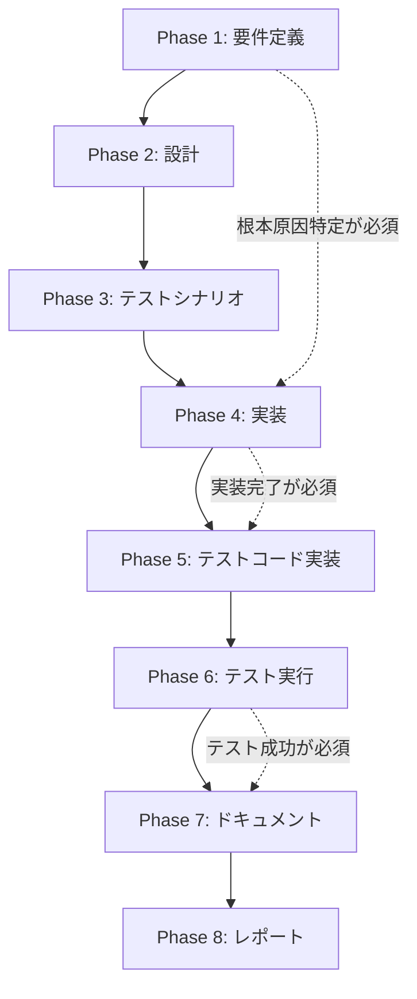

# プロジェクト計画書 - Issue #208

## 1. Issue分析

### 概要

`metadata.json` の `phases` オブジェクト内で `status: "pending"` のフェーズに `completed_steps: ["execute", "review"]` が設定されている不整合が発生し、`rollback` コマンドが「フェーズがまだ開始されていない」というエラーで失敗する。

### 複雑度: 中程度

**判断根拠**:
- 変更対象ファイル: 2~3ファイル（`src/commands/rollback.ts`, `src/core/metadata-manager.ts`, 場合によっては `src/phases/evaluation.ts`）
- 既存機能の拡張とバリデーション追加（新規機能開発ではない）
- テストファイルの追加が必要（ユニット + インテグレーション）
- ロジック自体は単純だが、メタデータ整合性の影響範囲が広い

### 見積もり工数: 8~12時間

**内訳**:
- 原因調査: 2~3h（Evaluation Phase、MetadataManager、Rollbackコマンドのコード調査）
- バリデーション改善: 2~3h（rollbackコマンドの判定ロジック修正）
- 整合性チェック追加: 2~3h（MetadataManagerへのバリデーション追加）
- テストコード実装: 2~3h（ユニット + インテグレーション）

### リスク評価: 中

**根拠**:
- **影響範囲が広い**: `metadata.json` の整合性チェックは、rollback以外のフェーズ（resume機能、フェーズ実行）にも影響する可能性がある
- **根本原因が不明**: Issue説明では3つの原因候補が挙がっているが、どれが真因か特定されていない
- **副作用のリスク**: バリデーション追加により、既存の正常なワークフローが誤検知される可能性がある

### 発生した問題の状態

```json
"test_implementation": {
  "status": "pending",        // ← pending になっている
  "started_at": null,         // ← 開始されていない
  "completed_steps": [        // ← でも completed_steps がある（不整合）
    "execute",
    "review"
  ]
}
```

### 期待される状態

`status: "pending"` のフェーズは `completed_steps: []` であるべき。

---

## 2. 実装戦略判断

### 実装戦略: EXTEND

**判断根拠**:
- 既存の `rollback` コマンドのバリデーションロジックを拡張
- 既存の `MetadataManager` にメタデータ整合性チェックメソッドを追加
- 既存の Evaluation Phase のフェーズリセット処理を調査・修正（必要に応じて）
- 新規ファイル・モジュールの作成は不要

**変更対象**:
- `src/commands/rollback.ts`: バリデーションロジック拡張（`validateRollbackOptions`）
- `src/core/metadata-manager.ts`: 整合性チェックメソッド追加（`validatePhaseConsistency`）
- `src/phases/evaluation.ts`: フェーズリセット処理の調査・修正（必要に応じて）

### テスト戦略: UNIT_INTEGRATION

**判断根拠**:
- **ユニットテスト**: バリデーションロジックの単体テスト（MetadataManager、Rollbackコマンド）
  - `completed_steps` がある場合の `pending` フェーズ判定
  - 不整合状態の検出・警告
- **インテグレーションテスト**: ワークフロー全体での動作確認
  - Evaluation Phase → 不整合発生 → Rollback成功のシナリオ
  - 既存の正常なワークフローが影響を受けないことを確認

**BDDテストは不要**:
- エンドユーザー向け機能ではなく、内部バリデーションロジックのため

### テストコード戦略: EXTEND_TEST

**判断根拠**:
- 既存テストファイルに追加:
  - `tests/unit/commands/rollback.test.ts`: rollbackバリデーションのテストケース追加
  - `tests/unit/core/metadata-manager.test.ts`: 整合性チェックメソッドのテスト追加
- 新規テストファイル作成:
  - `tests/integration/rollback-inconsistent-metadata.test.ts`: 不整合状態でのrollback動作確認

**理由**:
- 既存の rollback テストファイルが存在するため、そこに追加するのが自然
- インテグレーションテストは新規シナリオのため、新規ファイルを作成

---

## 3. 影響範囲分析

### 既存コードへの影響

#### 変更が必要なファイル

1. **`src/commands/rollback.ts`**:
   - `validateRollbackOptions()`: フェーズ判定ロジックを改善
   - 現在: `status === 'pending'` のみチェック
   - 改善後: `completed_steps` の存在も考慮して「開始済み」と判定

2. **`src/core/metadata-manager.ts`**:
   - 新規メソッド追加: `validatePhaseConsistency(phaseName: PhaseName): ValidationResult`
   - 整合性チェック: `status === 'pending'` かつ `completed_steps.length > 0` の場合、警告またはエラー
   - 呼び出し元: `resetSubsequentPhases()`, `updatePhaseForRollback()`

3. **`src/phases/evaluation.ts`（調査対象）**:
   - `rollbackToPhase()` メソッドの動作確認（行247）
   - フェーズリセット時に `completed_steps` が正しくリセットされているか確認
   - 必要に応じて修正

#### 影響を受ける機能

- **Rollback機能**: バリデーションロジック変更により、不整合状態でもrollback可能に
- **Resume機能**: `completed_steps` を参照する既存ロジックは影響を受けない（参照のみのため）
- **Evaluation Phase**: フェーズリセット処理が修正される可能性（根本原因の場合）

### 依存関係の変更

**新規依存の追加**: なし

**既存依存の変更**: なし

### マイグレーション要否

**不要**:
- 既存の `metadata.json` に対する自動マイグレーションは不要
- バリデーションロジックが追加されるだけで、データ構造の変更はなし
- 不整合状態の `metadata.json` は、rollback実行時に自動修正される

---

## 4. タスク分割

### Phase 1: 要件定義 (見積もり: 1~2h)

- [ ] Task 1-1: 問題の根本原因を特定 (1~2h)
  - Evaluation Phaseの `rollbackToPhase()` メソッド調査（行247）
  - `resetSubsequentPhases()` の動作確認（行352~379）
  - Issue #194 のスカッシュコミット機能との関連調査
  - Jenkins環境でのメタデータ同期問題の調査

### Phase 2: 設計 (見積もり: 2~3h)

- [ ] Task 2-1: Rollbackバリデーションロジックの設計 (1~1.5h)
  - `validateRollbackOptions()` の改善案設計
  - `completed_steps` を考慮したフェーズ判定ロジック
  - エラーメッセージの改善（ユーザーに原因を明示）

- [ ] Task 2-2: MetadataManager整合性チェックの設計 (1~1.5h)
  - `validatePhaseConsistency()` メソッドのシグネチャ設計
  - 不整合パターンの定義（status vs completed_steps）
  - 警告レベル vs エラーレベルの判定基準

### Phase 3: テストシナリオ (見積もり: 1~2h)

- [ ] Task 3-1: ユニットテストシナリオ定義 (0.5~1h)
  - `validateRollbackOptions()` のテストケース（不整合状態で成功）
  - `validatePhaseConsistency()` のテストケース（検出パターン網羅）

- [ ] Task 3-2: インテグレーションテストシナリオ定義 (0.5~1h)
  - 不整合メタデータでのrollback動作確認
  - 既存の正常なワークフローへの影響確認

### Phase 4: 実装 (見積もり: 2~3h)

- [ ] Task 4-1: Rollbackバリデーションロジック改善 (1~1.5h)
  - `src/commands/rollback.ts` の `validateRollbackOptions()` 修正
  - `completed_steps` を参照して「開始済み」判定
  - エラーメッセージの改善

- [ ] Task 4-2: MetadataManager整合性チェック追加 (1~1.5h)
  - `src/core/metadata-manager.ts` に `validatePhaseConsistency()` 追加
  - `resetSubsequentPhases()` に整合性チェック統合
  - `updatePhaseForRollback()` に整合性チェック統合

- [ ] Task 4-3: Evaluation Phaseの修正（必要に応じて） (0~1h)
  - `rollbackToPhase()` メソッドで `completed_steps` を確実にリセット
  - Phase 1 の調査結果に基づいて実施

### Phase 5: テストコード実装 (見積もり: 2~3h)

- [ ] Task 5-1: Rollbackコマンドのユニットテスト追加 (1~1.5h)
  - `tests/unit/commands/rollback.test.ts` に不整合状態のテストケース追加
  - `completed_steps` がある `pending` フェーズでのrollback成功確認

- [ ] Task 5-2: MetadataManagerのユニットテスト追加 (0.5~1h)
  - `tests/unit/core/metadata-manager.test.ts` に整合性チェックのテスト追加
  - 不整合パターンの検出確認

- [ ] Task 5-3: インテグレーションテスト作成 (1~1.5h)
  - `tests/integration/rollback-inconsistent-metadata.test.ts` 作成
  - 不整合メタデータでのrollback成功シナリオ
  - 既存ワークフローへの影響なし確認

### Phase 6: テスト実行 (見積もり: 0.5~1h)

- [ ] Task 6-1: ユニットテスト実行 (0.25~0.5h)
  - `npm run test:unit` 実行
  - カバレッジ確認（新規コードのカバレッジ90%以上）

- [ ] Task 6-2: インテグレーションテスト実行 (0.25~0.5h)
  - `npm run test:integration` 実行
  - 既存テストのリグレッション確認

### Phase 7: ドキュメント (見積もり: 1h)

- [ ] Task 7-1: CLAUDE.md 更新 (0.5h)
  - 「rollback コマンド」セクションにバリデーション改善を記載
  - 不整合メタデータの自動検出機能を追記

- [ ] Task 7-2: TROUBLESHOOTING.md 更新 (0.5h)
  - 「rollback が失敗する」セクションに本Issue対応を追記
  - 不整合状態の解決方法（rollback実行で自動修正）を記載

### Phase 8: レポート (見積もり: 0.5h)

- [ ] Task 8-1: 実装完了レポート作成 (0.5h)
  - 変更内容のサマリー作成
  - 修正前後の動作比較
  - テスト結果の記録

---

## 5. 依存関係



**クリティカルパス**:
- Phase 1 → Phase 4 → Phase 5 → Phase 6: 根本原因特定から実装・テストまでの一連の流れ
- Phase 1 の調査結果により、Phase 4 の実装内容が変動する（Evaluation Phase修正の要否）

---

## 6. リスクと軽減策

### リスク1: 根本原因の特定に時間がかかる

- **影響度**: 高
- **確率**: 中
- **軽減策**:
  - Phase 1 で Issue #194 のワークフロー実行ログを優先調査
  - Evaluation Phase の `rollbackToPhase()` メソッドを詳細にレビュー
  - 最悪の場合、原因特定を後回しにして、まずrollbackバリデーションを改善（対症療法）

### リスク2: バリデーション追加により既存ワークフローが誤検知される

- **影響度**: 高
- **確率**: 低
- **軽減策**:
  - インテグレーションテストで既存ワークフローの動作確認を徹底
  - 不整合検出時は「警告」レベルとし、エラーで停止しない
  - ログに詳細な情報を出力し、問題発生時のデバッグを容易に

### リスク3: MetadataManager の変更が他機能に影響

- **影響度**: 中
- **確率**: 中
- **軽減策**:
  - `validatePhaseConsistency()` は参照のみで副作用なし（read-only）
  - 既存の `resetSubsequentPhases()` の動作を変更しない（追加のチェックのみ）
  - ユニットテストで全メソッドの動作確認

### リスク4: Evaluation Phase の修正が必要になり工数増加

- **影響度**: 中
- **確率**: 中
- **軽減策**:
  - Phase 1 で優先的に調査し、早期に判断
  - 修正が必要な場合は Phase 4 で実施（見積もりに0~1h含まれている）
  - 最悪の場合、Evaluation Phase 修正は別Issueとして切り出し

---

## 7. 品質ゲート

### Phase 1: 要件定義

- [ ] 根本原因が特定されている（3つの候補のうち1つに絞り込み）
- [ ] 修正方針が明確になっている（rollbackバリデーション改善 + 整合性チェック追加）
- [ ] Evaluation Phase の修正要否が判断されている

### Phase 2: 設計

- [ ] `validateRollbackOptions()` の改善ロジックが明確に設計されている
- [ ] `validatePhaseConsistency()` のシグネチャとロジックが設計されている
- [ ] 不整合パターンの定義が網羅されている
- [ ] エラーメッセージが具体的で分かりやすい

### Phase 3: テストシナリオ

- [ ] ユニットテストシナリオが定義されている（最低5ケース以上）
- [ ] インテグレーションテストシナリオが定義されている（正常系 + 異常系）
- [ ] 既存ワークフローへの影響確認シナリオが含まれている

### Phase 4: 実装

- [ ] `validateRollbackOptions()` が `completed_steps` を考慮して判定している
- [ ] `validatePhaseConsistency()` が不整合を検出できる
- [ ] エラーメッセージがユーザーフレンドリー
- [ ] 既存コードの動作を破壊していない

### Phase 5: テストコード実装

- [ ] ユニットテストが実装されている（rollback + MetadataManager）
- [ ] インテグレーションテストが実装されている（不整合状態のrollback）
- [ ] テストコードの品質が高い（可読性、保守性）

### Phase 6: テスト実行

- [ ] すべてのユニットテストが成功している
- [ ] すべてのインテグレーションテストが成功している
- [ ] 新規コードのカバレッジが90%以上
- [ ] 既存テストのリグレッションがない

### Phase 7: ドキュメント

- [ ] CLAUDE.md に rollback バリデーション改善が記載されている
- [ ] TROUBLESHOOTING.md に不整合状態の解決方法が記載されている
- [ ] ドキュメントが分かりやすく、具体例が含まれている

### Phase 8: レポート

- [ ] 実装完了レポートが作成されている
- [ ] 変更内容のサマリーが明確
- [ ] 修正前後の動作比較が記載されている
- [ ] テスト結果が記録されている

---

## 8. 追加情報

### 関連Issue

- **Issue #90**: ロールバック機能（rollback コマンドの実装元）
- **Issue #194**: スカッシュコミット機能（不整合発生の原因候補）
- **Issue #10**: ステップ単位の進捗管理（`completed_steps` 導入）

### 参考ドキュメント

- `CLAUDE.md`: rollback コマンドの仕様（行66~112）
- `ARCHITECTURE.md`: MetadataManager の設計思想（行128）
- `src/commands/rollback.ts`: 既存のrollbackバリデーションロジック（行91~136）
- `src/core/metadata-manager.ts`: フェーズリセット処理（行352~379）

### 技術的考察

#### 不整合発生の3つの原因候補

1. **マイグレーション後のステータスリセット**:
   - `completed_steps` が追加された後、何らかの処理で `status` だけが `pending` にリセットされた
   - **確認ポイント**: `resetSubsequentPhases()` が `status` と `completed_steps` を同時にリセットしているか

2. **Jenkins環境とローカル環境のメタデータ同期問題**:
   - Jenkins上の一時ディレクトリで実行されたワークフローのメタデータとローカルのメタデータが不整合な状態でマージされた
   - **確認ポイント**: Git pull/push でメタデータが正しく同期されているか

3. **Evaluation Phase の `decision` 処理**:
   - Evaluation Phase が `FAIL_PHASE_X` を設定する際に、後続フェーズのステータスを不適切にリセットした
   - **確認ポイント**: `evaluation.ts` の `rollbackToPhase()` 呼び出し（行247）が `completed_steps` をリセットしているか

#### 推奨されるバリデーションアプローチ

**Option 1: Defensive（防御的）**
- `completed_steps` が空でないフェーズは「開始済み」として扱う
- 不整合は警告ログのみで、処理は継続

**Option 2: Strict（厳格）**
- 不整合を検出したらエラーで停止
- ユーザーに手動でのメタデータ修正を促す

**推奨**: Option 1（防御的アプローチ）
- 理由: rollback コマンドの目的は「ワークフローの復旧」であり、厳格すぎるバリデーションは逆効果
- ただし、警告ログで不整合を明示し、後続の調査・修正を促す

---

## 9. まとめ

本Issueは、`metadata.json` のフェーズステータスと `completed_steps` の不整合により rollback コマンドが失敗する問題を解決するものです。実装戦略は **EXTEND**（既存コード拡張）、テスト戦略は **UNIT_INTEGRATION**（ユニット + インテグレーション）を採用します。

### キーポイント

1. **根本原因の特定が最優先**: Phase 1 で Evaluation Phase、MetadataManager、Issue #194 関連を調査
2. **防御的バリデーション**: `completed_steps` を考慮した柔軟な判定ロジック
3. **既存機能への影響最小化**: 整合性チェックは参照のみで副作用なし
4. **徹底したテスト**: ユニット + インテグレーションで既存ワークフローへの影響確認

### 期待される効果

- rollback コマンドが不整合状態でも正常に動作
- 不整合メタデータの自動検出と警告
- 将来的な同様の問題の予防（整合性チェック機能）

---

**計画書作成日**: 2025-01-30
**見積もり総工数**: 8~12時間
**実装戦略**: EXTEND
**テスト戦略**: UNIT_INTEGRATION
**テストコード戦略**: EXTEND_TEST
