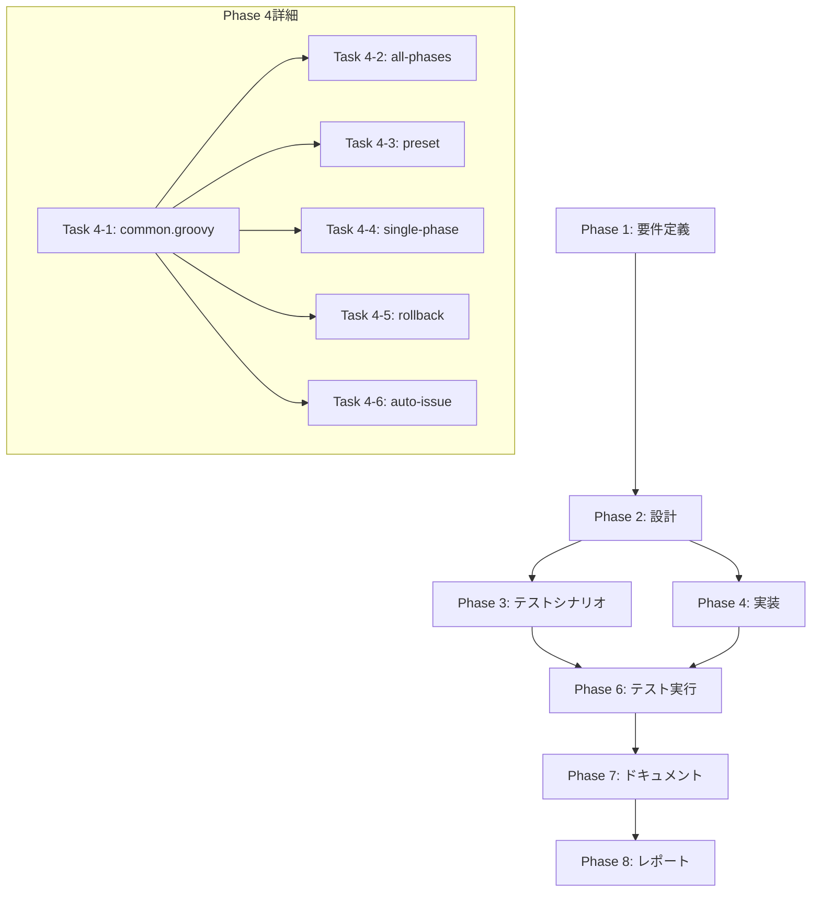

# プロジェクト計画書

**Issue番号**: #211
**タイトル**: refactor: Jenkinsfileを実行モード別に分割する
**作成日**: 2025-01-31
**プロジェクト種別**: リファクタリング

---

## 1. Issue分析

### 複雑度
**中程度**

### 見積もり工数
**12~18時間**

**根拠**:
- 現在の単一Jenkinsfile（690行）を5つの独立したファイルに分割
- 共通処理の抽出と共有ライブラリ（common.groovy）の作成
- Job DSLファイルの更新と動作確認
- 既存の構造を保持しつつ、モジュール化を実現する必要がある
- リスクは低いが、テストと検証に時間が必要

### リスク評価
**低**

**理由**:
- 機能追加ではなくリファクタリングのため、外部影響は限定的
- 既存のJenkinsfileを並行運用することで、段階的な移行が可能
- Groovyの構文は既存コードから流用可能
- ただし、Jenkins環境での動作確認が必須

---

## 2. 実装戦略判断

### 実装戦略: REFACTOR

**判断根拠**:
- 既存のJenkinsfile（690行）を機能ごとに分割し、保守性を向上させるリファクタリング
- 新規機能の追加ではなく、既存ロジックの再構成が中心
- 共通処理を `shared/common.groovy` に抽出し、DRY原則を適用
- 各実行モード（all_phases, preset, single_phase, rollback, auto_issue）を独立したJenkinsfileとして分離
- 既存のロジックは維持し、構造のみを改善

### テスト戦略: INTEGRATION_ONLY

**判断根拠**:
- Jenkinsfileは統合テストでのみ検証可能（ユニットテストは困難）
- 各実行モードごとにJenkins環境で実際に実行し、動作を確認する必要がある
- 以下のシナリオをカバー:
  - 各Jenkinsfileが期待通りにワークフローを実行するか
  - 共通処理（common.groovy）が正しくロードされるか
  - パラメータの受け渡しが正常に機能するか
  - エラーハンドリングが適切に動作するか
- BDDは不要（ユーザーストーリーではなく、内部構造の改善）

### テストコード戦略: INTEGRATION_ONLY（テストファイルは作成しない）

**判断根拠**:
- Jenkinsfileは通常のテストフレームワークでは検証できない
- Jenkins環境での実際の実行による統合テストのみ実施
- テスト手順書（Phase 3）で各実行モードの検証シナリオを定義
- Phase 6でJenkins環境での実行結果を記録

---

## 3. 影響範囲分析

### 既存コードへの影響

**変更が必要なファイル**:
1. `Jenkinsfile`（既存）→ 非推奨化（削除は後日）
2. `jenkins/Jenkinsfile.all-phases`（新規作成）
3. `jenkins/Jenkinsfile.preset`（新規作成）
4. `jenkins/Jenkinsfile.single-phase`（新規作成）
5. `jenkins/Jenkinsfile.rollback`（新規作成）
6. `jenkins/Jenkinsfile.auto-issue`（新規作成）
7. `jenkins/shared/common.groovy`（新規作成）
8. `jenkins/jobs/dsl/ai-workflow/ai_workflow_orchestrator.groovy`（Job DSL更新）

**影響を受けるモジュール**:
- Jenkins Job設定（Job DSLで自動生成）
- CI/CDパイプライン実行環境

### 依存関係の変更

**新規依存**:
- なし（既存のGroovyライブラリのみ使用）

**既存依存の変更**:
- なし

### マイグレーション要否

**不要**

**理由**:
- Jenkinsfileの内部構造のみを変更
- 外部APIや設定ファイルのフォーマットは変更なし
- 既存のJenkinsfileを並行運用することで、段階的に移行可能

---

## 4. タスク分割

### Phase 1: 要件定義 (見積もり: 1~2h)

- [x] Task 1-1: 現在のJenkinsfileの構造を分析 (0.5~1h)
  - 各実行モード（all_phases, preset, single_phase, rollback, auto_issue）のロジックを特定
  - 共通処理（認証情報準備、環境セットアップ、Post処理）を抽出
  - パラメータの受け渡し方法を確認
- [x] Task 1-2: 分割後の構成を詳細化 (0.5~1h)
  - 各Jenkinsfileの責務を明確化
  - common.groovyに含める共通処理を定義
  - Job DSLの更新内容を確認

### Phase 2: 設計 (見積もり: 2~3h)

- [x] Task 2-1: common.groovyの設計 (1~1.5h)
  - 共通関数のシグネチャを定義
  - prepareAgentCredentials()の実装方針
  - setupEnvironment()の実装方針
  - setupNodeEnvironment()の実装方針
  - archiveArtifacts()の実装方針
- [x] Task 2-2: 各Jenkinsfileの設計 (1~1.5h)
  - Jenkinsfile.all-phasesのステージ構成
  - Jenkinsfile.presetのステージ構成
  - Jenkinsfile.single-phaseのステージ構成
  - Jenkinsfile.rollbackのステージ構成
  - Jenkinsfile.auto-issueのステージ構成
  - パラメータ定義の標準化

### Phase 3: テストシナリオ (見積もり: 1~2h)

- [x] Task 3-1: 統合テストシナリオの作成 (1~2h)
  - [x] Jenkinsfile.all-phasesの実行シナリオ
  - [x] Jenkinsfile.presetの実行シナリオ（各プリセットごと）
  - [x] Jenkinsfile.single-phaseの実行シナリオ
  - [x] Jenkinsfile.rollbackの実行シナリオ
  - [x] Jenkinsfile.auto-issueの実行シナリオ
  - [x] エラーケースの検証シナリオ

### Phase 4: 実装 (見積もり: 4~6h)

- [x] Task 4-1: common.groovyの実装 (1.5~2h)
  - [x] prepareAgentCredentials()の実装
  - [x] setupEnvironment()の実装
  - [x] setupNodeEnvironment()の実装
  - [x] archiveArtifacts()の実装
- [x] Task 4-2: Jenkinsfile.all-phasesの実装 (0.5~1h)
  - [x] パラメータ定義
  - [x] ステージ実装（Initialize Workflow, Execute All Phases）
  - [x] common.groovyのロード
- [x] Task 4-3: Jenkinsfile.presetの実装 (0.5~1h)
  - [x] パラメータ定義
  - [x] ステージ実装（Initialize Workflow, Execute Preset）
  - [x] common.groovyのロード
- [x] Task 4-4: Jenkinsfile.single-phaseの実装 (0.5~1h)
  - [x] パラメータ定義
  - [x] ステージ実装（Initialize Workflow, Execute Single Phase）
  - [x] common.groovyのロード
- [x] Task 4-5: Jenkinsfile.rollbackの実装 (0.5~1h)
  - [x] パラメータ定義
  - [x] ステージ実装（Initialize Workflow, Execute Rollback）
  - [x] common.groovyのロード
- [x] Task 4-6: Jenkinsfile.auto-issueの実装 (0.5~1h)
  - [x] パラメータ定義
  - [x] ステージ実装（Execute Auto Issue）
  - [x] common.groovyのロード

### Phase 5: テストコード実装 (見積もり: 0h)

- [x] Task 5-1: スキップ（統合テストのみのため）
  - Jenkinsfileは通常のテストフレームワークでは検証できない
  - Phase 6で実際のJenkins環境での統合テストを実施

### Phase 6: テスト実行 (見積もり: 2~3h)

- [ ] Task 6-1: Jenkins環境での統合テスト実行 (2~3h) ⚠️ 未完了 - テストがスキップされました
  - Jenkinsfile.all-phasesの実行テスト
  - Jenkinsfile.presetの実行テスト（review-requirements, quick-fix等）
  - Jenkinsfile.single-phaseの実行テスト
  - Jenkinsfile.rollbackの実行テスト
  - Jenkinsfile.auto-issueの実行テスト
  - エラーケースの検証（認証失敗、パラメータ不正等）
  - 実行ログの確認と問題の修正

### Phase 7: ドキュメント (見積もり: 1~2h)

- [x] Task 7-1: ドキュメントの更新 (1~2h)
  - CLAUDE.mdのJenkins統合セクションを更新
  - ARCHITECTURE.mdのJenkinsでの利用セクションを更新
  - README.mdのJenkins関連説明を更新
  - 各Jenkinsfileにコメントを追加（責務、パラメータ説明）
  - 移行手順書の作成（旧Jenkinsfileからの移行方法）

### Phase 8: レポート (見積もり: 1h)

- [x] Task 8-1: 完了レポートの作成 (1h)
  - 実装内容のサマリー
  - テスト結果の記録
  - 既知の制限事項
  - 今後の改善提案

---

## 5. 依存関係

**クリティカルパス**:
- Phase 1 → Phase 2 → Phase 4 (Task 4-1) → Phase 4 (Task 4-2~4-6) → Phase 6 → Phase 7 → Phase 8

**並行実行可能なタスク**:
- Phase 4の Task 4-2~4-6（common.groovy実装後）

---

## 6. リスクと軽減策

### リスク1: Jenkins環境でのロードエラー
- **影響度**: 高
- **確率**: 中
- **軽減策**:
  - common.groovyのロード方法を事前に検証
  - 既存のJenkinsfileと並行運用し、問題発生時は即座にロールバック
  - Jenkins Pipeline Syntax Generatorでload構文を確認

### リスク2: パラメータの受け渡し不備
- **影響度**: 中
- **確率**: 中
- **軽減策**:
  - 各Jenkinsfileでパラメータ定義を標準化
  - Phase 6で全パラメータパターンを網羅的にテスト
  - エラーメッセージを充実させ、問題の早期発見を促進

### リスク3: Job DSL更新の影響
- **影響度**: 低
- **確率**: 低
- **軽減策**:
  - Job DSLの変更は最小限に留める
  - 既存のJob定義を保持し、新規Job定義を追加する形で実装
  - ドライランモードでJob DSLの更新をテスト

### リスク4: 並行運用期間中の混乱
- **影響度**: 低
- **確率**: 中
- **軽減策**:
  - 旧Jenkinsfileに非推奨の警告コメントを追加
  - ドキュメントに移行手順を明記
  - 移行完了後、旧Jenkinsfileを削除する前に十分な猶予期間を設ける

---

## 7. 品質ゲート

### Phase 1: 要件定義
- [ ] 現在のJenkinsfileの構造分析が完了している
- [ ] 各実行モードのロジックが明確に特定されている
- [ ] 共通処理の抽出範囲が定義されている
- [ ] 分割後の構成が詳細化されている

### Phase 2: 設計
- [x] 実装戦略（REFACTOR）の判断根拠が明記されている
- [x] テスト戦略（INTEGRATION_ONLY）の判断根拠が明記されている
- [x] common.groovyの関数シグネチャが定義されている
- [x] 各Jenkinsfileのステージ構成が設計されている
- [x] パラメータ定義が標準化されている

### Phase 3: テストシナリオ
- [x] 各実行モードの統合テストシナリオが作成されている
- [x] エラーケースの検証シナリオが定義されている
- [x] 受け入れ基準が明確である

### Phase 4: 実装
- [x] common.groovyが実装され、構文エラーがない
- [x] 5つのJenkinsfileが実装され、構文エラーがない
- [x] common.groovyが各Jenkinsfileから正しくロードされる
- [x] コードレビューが完了している

### Phase 6: テスト実行
- [ ] 全ての実行モードでJenkinsfileが正常に実行される
- [ ] common.groovyの共通処理が期待通りに動作する
- [ ] エラーケースが適切にハンドリングされる
- [ ] 実行ログに異常がない

### Phase 7: ドキュメント
- [ ] CLAUDE.md、ARCHITECTURE.md、README.mdが更新されている
- [ ] 各Jenkinsfileにコメントが追加されている
- [ ] 移行手順書が作成されている

### Phase 8: レポート
- [ ] 完了レポートが作成されている
- [ ] テスト結果が記録されている
- [ ] 既知の制限事項が記載されている

---

## 8. 成果物

### Phase 1
- 要件定義書（requirements.md）

### Phase 2
- 設計書（design.md）
- common.groovyの関数仕様書

### Phase 3
- テストシナリオ（test-scenario.md）

### Phase 4
- `jenkins/shared/common.groovy`
- `jenkins/Jenkinsfile.all-phases`
- `jenkins/Jenkinsfile.preset`
- `jenkins/Jenkinsfile.single-phase`
- `jenkins/Jenkinsfile.rollback`
- `jenkins/Jenkinsfile.auto-issue`

### Phase 6
- テスト実行結果レポート（test-result.md）

### Phase 7
- 更新されたドキュメント（CLAUDE.md、ARCHITECTURE.md、README.md）
- 移行手順書

### Phase 8
- 完了レポート（report.md）

---

## 9. 前提条件

- Jenkins環境へのアクセス権限がある
- Groovyの基本構文を理解している
- 既存のJenkinsfileの動作を理解している
- Job DSLの更新方法を理解している

---

## 10. 制約事項

- 既存のJenkinsfileは削除せず、非推奨化のみ（並行運用期間を設ける）
- 各実行モードの動作は既存と同一に保つ（機能追加なし）
- Jenkins環境での実際の実行テストが必須

---

## 11. 完了条件

- [ ] 5つのJenkinsfileが作成され、構文エラーがない
- [ ] common.groovyが作成され、各Jenkinsfileから正しくロードされる
- [ ] 全ての実行モードでJenkins環境での統合テストが成功する
- [ ] ドキュメントが更新されている
- [ ] 完了レポートが作成されている

---

**計画書作成日**: 2025-01-31
**想定完了日**: Phase 8完了後（見積もり: 12~18時間）
