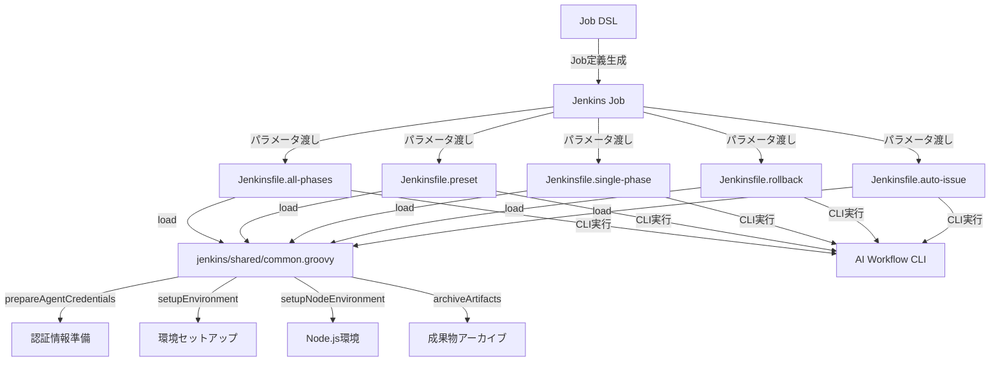
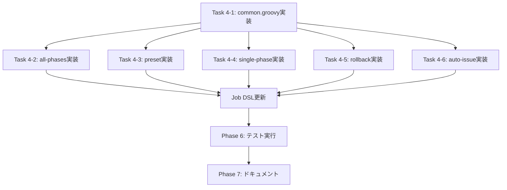

# 詳細設計書

**Issue番号**: #211
**タイトル**: refactor: Jenkinsfileを実行モード別に分割する
**作成日**: 2025-01-31
**プロジェクト種別**: リファクタリング

---

## 1. アーキテクチャ設計

### 1.1 システム全体図

```
┌─────────────────────────────────────────────────────────────┐
│                       Jenkins Job DSL                        │
│  (jenkins/jobs/dsl/ai-workflow/ai_workflow_orchestrator.groovy)│
└───────────────────────┬─────────────────────────────────────┘
                        │
                        │ Job定義
                        ▼
        ┌───────────────────────────────────────┐
        │   Jenkins Job (各実行モード専用)       │
        │  - AI Workflow - All Phases           │
        │  - AI Workflow - Preset               │
        │  - AI Workflow - Single Phase         │
        │  - AI Workflow - Rollback             │
        │  - AI Workflow - Auto Issue           │
        └───────────────┬───────────────────────┘
                        │
                        │ パラメータ渡し
                        ▼
┌───────────────────────────────────────────────────────────────┐
│                    Jenkinsfile Layer                          │
├───────────────────────────────────────────────────────────────┤
│  Jenkinsfile.all-phases      Jenkinsfile.preset               │
│  Jenkinsfile.single-phase    Jenkinsfile.rollback             │
│  Jenkinsfile.auto-issue                                       │
│                                                                │
│  各Jenkinsfileは以下の構造:                                    │
│  1. パラメータ定義 (parameters)                                │
│  2. 共通処理のロード (load 'jenkins/shared/common.groovy')     │
│  3. ステージ実行 (stages)                                      │
│  4. Post処理 (post)                                           │
└─────────────────────┬─────────────────────────────────────────┘
                      │
                      │ load
                      ▼
┌───────────────────────────────────────────────────────────────┐
│              Shared Library (common.groovy)                   │
├───────────────────────────────────────────────────────────────┤
│  - prepareAgentCredentials()    # 認証情報準備                 │
│  - setupEnvironment()           # REPOS_ROOT準備、クローン     │
│  - setupNodeEnvironment()       # npm install & build         │
│  - archiveArtifacts()           # 成果物アーカイブ             │
└─────────────────────┬─────────────────────────────────────────┘
                      │
                      │ 実行
                      ▼
┌───────────────────────────────────────────────────────────────┐
│                Docker Container Layer                         │
├───────────────────────────────────────────────────────────────┤
│  Docker Image: ai-workflow-agent                              │
│  Working Directory: /workspace                                │
│  Mounts:                                                      │
│    - REPOS_ROOT (/tmp/ai-workflow-repos-${BUILD_ID})          │
│    - credentials.json (Claude認証)                            │
└─────────────────────┬─────────────────────────────────────────┘
                      │
                      │ CLI実行
                      ▼
┌───────────────────────────────────────────────────────────────┐
│              AI Workflow CLI (node dist/index.js)             │
├───────────────────────────────────────────────────────────────┤
│  Commands:                                                    │
│    - init --issue-url ${ISSUE_URL}                            │
│    - execute --issue ${ISSUE_NUMBER} --phase all              │
│    - execute --issue ${ISSUE_NUMBER} --preset ${PRESET}       │
│    - execute --issue ${ISSUE_NUMBER} --phase ${START_PHASE}   │
│    - rollback --issue ${ISSUE_NUMBER} --to-phase ${ROLLBACK_TO_PHASE} │
│    - auto-issue --category ${AUTO_ISSUE_CATEGORY}             │
└───────────────────────────────────────────────────────────────┘
```

### 1.2 コンポーネント間の関係



### 1.3 データフロー

```
┌─────────────┐
│ Jenkins Job │
│  Parameters │
│  - ISSUE_URL│
│  - AGENT_MODE
│  - OPENAI_API_KEY
│  - GITHUB_TOKEN
│  - AWS認証情報
│  - PRESET/PHASE
└──────┬──────┘
       │
       │ 環境変数として渡す
       ▼
┌──────────────────┐
│  Jenkinsfile     │
│  (各モード専用)   │
└──────┬───────────┘
       │
       │ load
       ▼
┌──────────────────┐
│ common.groovy    │
│  関数呼び出し     │
│  1. prepareAgentCredentials()
│  2. setupEnvironment()
│  3. setupNodeEnvironment()
└──────┬───────────┘
       │
       │ Docker環境で実行
       ▼
┌──────────────────┐
│ Docker Container │
│  - REPOS_ROOT準備
│  - リポジトリクローン
│  - npm install & build
└──────┬───────────┘
       │
       │ CLI実行
       ▼
┌──────────────────┐
│ AI Workflow CLI  │
│  - init / execute│
│  - rollback      │
│  - auto-issue    │
└──────┬───────────┘
       │
       │ 成果物生成
       ▼
┌──────────────────┐
│ common.groovy    │
│ archiveArtifacts()│
└──────────────────┘
```

---

## 2. 実装戦略判断

### 実装戦略: REFACTOR

**判断根拠**:

1. **既存Jenkinsfileの再構成が中心**
   - 現在の `Jenkinsfile`（690行）を機能ごとに分割し、各実行モード専用のファイルに再構成する
   - 新規機能の追加ではなく、既存ロジックの整理と分離が目的
   - 各実行モードのロジックは既存Jenkinsfileから流用可能

2. **共通処理の抽出（DRY原則の適用）**
   - 重複している認証情報準備、環境セットアップ、Post処理を `shared/common.groovy` に集約
   - 各Jenkinsfileは共通処理をロードして再利用する構造

3. **既存機能の動作は変更しない**
   - 各実行モード（all_phases、preset、single_phase、rollback、auto_issue）の動作は既存Jenkinsfileと同等
   - CLI呼び出しのパラメータも変更なし
   - Job DSLパラメータも最小限の変更で対応

4. **既存Jenkinsfileは並行運用**
   - リファクタリング完了後も既存 `Jenkinsfile` を保持し、段階的に移行可能
   - 既存のJenkinsジョブ設定に影響を与えない

---

## 3. テスト戦略判断

### テスト戦略: INTEGRATION_ONLY

**判断根拠**:

1. **Jenkinsfileの性質上、統合テストが最適**
   - Jenkinsfileは宣言的パイプライン（Declarative Pipeline）のため、通常のテストフレームワーク（Jest、JUnit等）では検証できない
   - Jenkins環境での実際の実行による統合テストが唯一の現実的な検証方法

2. **各実行モードごとに統合テストを実施**
   - Jenkinsfile.all-phases: 全フェーズ実行の統合テスト
   - Jenkinsfile.preset: 各プリセット（review-requirements、quick-fix等）の統合テスト
   - Jenkinsfile.single-phase: 特定フェーズ実行の統合テスト
   - Jenkinsfile.rollback: 差し戻し実行の統合テスト
   - Jenkinsfile.auto-issue: 自動Issue生成の統合テスト

3. **BDDは不要**
   - ユーザーストーリーベースの検証ではなく、内部構造の改善が目的
   - 既存Jenkinsfileとの動作一致性を確認すれば十分

4. **ユニットテストは実施不可**
   - Groovyスクリプトの静的解析は可能だが、実行フローの検証には不十分
   - Jenkins Pipelineの動作はJenkins環境でのみ確認可能

---

## 4. テストコード戦略判断

### テストコード戦略: INTEGRATION_ONLY（テストファイルは作成しない）

**判断根拠**:

1. **Jenkinsfileは通常のテストフレームワークで検証できない**
   - JenkinsfileはDeclarative Pipeline構文のため、Jest/JUnitのようなテストフレームワークでは実行できない
   - Jenkins環境での実際の実行による統合テストのみ実施可能

2. **テスト手順書（Phase 3）で検証シナリオを定義**
   - Test Scenario Phase（Phase 3）で、各実行モードの検証シナリオを詳細に定義
   - 検証項目、期待結果、実行手順を明記したテストシナリオドキュメントを作成

3. **Testing Phase（Phase 6）でJenkins環境での実行結果を記録**
   - 各Jenkinsfileを実際のJenkins環境で実行し、動作を確認
   - 実行ログ、成果物、エラー有無を記録
   - 既存Jenkinsfileとの動作一致性を検証

4. **テストコードファイルの作成は不要**
   - `tests/integration/` 配下にJenkinsfileのテストファイルを作成しても実行できない
   - Jenkins Pipeline Unit Testing Frameworkも検討したが、本プロジェクトのビルド環境（Node.js + TypeScript）と互換性がない
   - テスト手順書とPhase 6での実行記録で品質を担保

---

## 5. 影響範囲分析

### 5.1 既存コードへの影響

#### 変更が必要なファイル

1. **Job DSL（更新が必要）**
   - `jenkins/jobs/dsl/ai-workflow/ai_workflow_orchestrator.groovy`
   - 各実行モード専用のJob定義を追加または既存Job定義を各Jenkinsfileに対応させる

2. **既存Jenkinsfile（非推奨化のみ）**
   - `Jenkinsfile`（ルートディレクトリ）
   - 削除はせず、ファイル冒頭に非推奨警告コメントを追加
   - 並行運用期間を設け、移行完了後に削除を検討

#### 新規作成が必要なファイル

1. `jenkins/shared/common.groovy` … 共通処理モジュール
2. `jenkins/Jenkinsfile.all-phases` … 全フェーズ実行
3. `jenkins/Jenkinsfile.preset` … プリセット実行
4. `jenkins/Jenkinsfile.single-phase` … 単一フェーズ実行
5. `jenkins/Jenkinsfile.rollback` … 差し戻し実行
6. `jenkins/Jenkinsfile.auto-issue` … 自動Issue生成

#### 影響を受けるモジュール

- **Jenkins Job設定**: Job DSLで自動生成されるJob定義
- **CI/CDパイプライン実行環境**: Jenkins実行環境のDocker設定（変更なし）

### 5.2 依存関係の変更

#### 新規依存

- **なし**: 既存のGroovyライブラリのみ使用

#### 既存依存の変更

- **なし**: Jenkins Pipelineプラグイン、Docker Pipeline Pluginは既存のまま

### 5.3 マイグレーション要否

**不要**

**理由**:
- Jenkinsfileの内部構造のみを変更
- 外部APIや設定ファイルのフォーマットは変更なし
- 既存Jenkinsfileを並行運用することで、段階的に移行可能
- Job DSLの更新は後方互換性を維持（既存Job定義を保持しつつ新規Job定義を追加）

---

## 6. 変更・追加ファイルリスト

### 6.1 新規作成ファイル

| ファイルパス | 概要 |
|------------|------|
| `jenkins/shared/common.groovy` | 共通処理モジュール（認証情報準備、環境セットアップ、Node.js環境、成果物アーカイブ） |
| `jenkins/Jenkinsfile.all-phases` | 全フェーズ実行用Jenkinsfile（Initialize Workflow → Execute All Phases） |
| `jenkins/Jenkinsfile.preset` | プリセット実行用Jenkinsfile（Initialize Workflow → Execute Preset） |
| `jenkins/Jenkinsfile.single-phase` | 単一フェーズ実行用Jenkinsfile（Initialize Workflow → Execute Single Phase） |
| `jenkins/Jenkinsfile.rollback` | 差し戻し実行用Jenkinsfile（Initialize Workflow → Execute Rollback） |
| `jenkins/Jenkinsfile.auto-issue` | 自動Issue生成用Jenkinsfile（Execute Auto Issue、Initialize Workflowなし） |

### 6.2 修正が必要な既存ファイル

| ファイルパス | 修正内容 |
|------------|---------|
| `jenkins/jobs/dsl/ai-workflow/ai_workflow_orchestrator.groovy` | 各実行モード専用のJob定義を追加（または既存Job定義を各Jenkinsfileに対応させる） |
| `Jenkinsfile`（ルートディレクトリ） | ファイル冒頭に非推奨警告コメントを追加（削除は後日） |

### 6.3 削除が必要なファイル

**なし**（並行運用期間を設けるため、既存Jenkinsfileは保持）

---

## 7. 詳細設計

### 7.1 共通処理モジュール（`jenkins/shared/common.groovy`）

#### 7.1.1 関数設計

##### (1) prepareAgentCredentials()

**目的**: エージェント実行に必要な認証情報を準備

**シグネチャ**:
```groovy
def prepareAgentCredentials() { ... }
```

**処理フロー**:
```
1. GitHub Token
   - 環境変数 GITHUB_TOKEN をそのまま使用（Job DSLパラメータから設定済み）

2. AWS認証情報
   - 環境変数 AWS_ACCESS_KEY_ID、AWS_SECRET_ACCESS_KEY、AWS_SESSION_TOKEN
   - Job DSLパラメータから設定済み

3. OpenAI API Key
   - 環境変数 OPENAI_API_KEY（Job DSLパラメータから設定済み）

4. Claude Code OAuth Token
   - Jenkins Credentialsから取得（withCredentials）
   - Base64エンコードされたファイルとして保存
   - デコードして credentials.json を生成

5. 環境変数の確認ログ出力
   - echo "GITHUB_TOKEN: ${env.GITHUB_TOKEN ? 'set' : 'not set'}"
   - echo "OPENAI_API_KEY: ${env.OPENAI_API_KEY ? 'set' : 'not set'}"
   - AWS認証情報の確認ログ
```

**疑似コード**:
```groovy
def prepareAgentCredentials() {
    echo "=== Prepare Agent Credentials ==="

    // GitHub Token確認
    if (!env.GITHUB_TOKEN) {
        error("GITHUB_TOKEN is not set")
    }
    echo "GITHUB_TOKEN: set"

    // OpenAI API Key確認
    if (!env.OPENAI_API_KEY) {
        error("OPENAI_API_KEY is not set")
    }
    echo "OPENAI_API_KEY: set"

    // AWS認証情報確認
    if (!env.AWS_ACCESS_KEY_ID || !env.AWS_SECRET_ACCESS_KEY) {
        error("AWS credentials are not set")
    }
    echo "AWS_ACCESS_KEY_ID: set"
    echo "AWS_SECRET_ACCESS_KEY: set"
    echo "AWS_SESSION_TOKEN: ${env.AWS_SESSION_TOKEN ? 'set' : 'not set'}"

    // Claude Code OAuth Token取得
    withCredentials([file(credentialsId: 'claude-code-oauth-token', variable: 'CLAUDE_CODE_CREDENTIALS_FILE')]) {
        sh '''
            mkdir -p /root/.claude-code
            base64 -d ${CLAUDE_CODE_CREDENTIALS_FILE} > /root/.claude-code/credentials.json
            chmod 600 /root/.claude-code/credentials.json
        '''
    }
    echo "Claude Code credentials prepared"
}
```

##### (2) setupEnvironment()

**目的**: REPOS_ROOT準備と対象リポジトリのクローン

**シグネチャ**:
```groovy
def setupEnvironment() { ... }
```

**処理フロー**:
```
1. REPOS_ROOT ディレクトリ作成
   - /tmp/ai-workflow-repos-${BUILD_ID}
   - 既存の場合は削除してから作成

2. 対象リポジトリのクローン
   - git clone https://github.com/${GITHUB_REPOSITORY}.git
   - ブランチ指定はなし（デフォルトブランチ）
   - 認証: GITHUB_TOKEN を使用

3. リポジトリパスの確認
   - ls -la ${REPOS_ROOT}/${REPO_NAME}
```

**疑似コード**:
```groovy
def setupEnvironment() {
    echo "=== Setup Environment ==="

    def REPOS_ROOT = "/tmp/ai-workflow-repos-${env.BUILD_ID}"
    env.REPOS_ROOT = REPOS_ROOT

    // REPOS_ROOT準備
    sh """
        rm -rf ${REPOS_ROOT}
        mkdir -p ${REPOS_ROOT}
    """
    echo "REPOS_ROOT prepared: ${REPOS_ROOT}"

    // リポジトリ名抽出（例: tielec/ai-workflow-agent → ai-workflow-agent）
    def REPO_NAME = env.GITHUB_REPOSITORY.split('/')[1]

    // リポジトリクローン
    sh """
        cd ${REPOS_ROOT}
        git clone https://${env.GITHUB_TOKEN}@github.com/${env.GITHUB_REPOSITORY}.git
    """
    echo "Repository cloned: ${REPOS_ROOT}/${REPO_NAME}"
}
```

##### (3) setupNodeEnvironment()

**目的**: Node.js環境確認とnpm install & build実行

**シグネチャ**:
```groovy
def setupNodeEnvironment() { ... }
```

**処理フロー**:
```
1. Node.js環境確認
   - node --version
   - npm --version

2. npm install実行
   - cd ${REPOS_ROOT}/${REPO_NAME}
   - npm install

3. npm run build実行
   - npm run build
```

**疑似コード**:
```groovy
def setupNodeEnvironment() {
    echo "=== Setup Node.js Environment ==="

    // Node.js環境確認
    sh """
        node --version
        npm --version
    """

    // リポジトリ名抽出
    def REPO_NAME = env.GITHUB_REPOSITORY.split('/')[1]
    def REPO_PATH = "${env.REPOS_ROOT}/${REPO_NAME}"

    // npm install
    sh """
        cd ${REPO_PATH}
        npm install
    """
    echo "npm install completed"

    // npm run build
    sh """
        cd ${REPO_PATH}
        npm run build
    """
    echo "npm run build completed"
}
```

##### (4) archiveArtifacts()

**目的**: ワークフローメタデータ、ログ、成果物のアーカイブ

**シグネチャ**:
```groovy
def archiveArtifacts(String issueNumber) { ... }
```

**処理フロー**:
```
1. リポジトリパス取得
   - REPO_PATH = ${REPOS_ROOT}/${REPO_NAME}

2. .ai-workflow/issue-${issueNumber}/ 配下のファイルをアーカイブ
   - archiveArtifacts artifacts: "**/.ai-workflow/issue-${issueNumber}/**", allowEmptyArchive: true

3. ログ出力
   - echo "Artifacts archived for Issue #${issueNumber}"
```

**疑似コード**:
```groovy
def archiveArtifacts(String issueNumber) {
    echo "=== Archive Artifacts ==="

    def REPO_NAME = env.GITHUB_REPOSITORY.split('/')[1]
    def REPO_PATH = "${env.REPOS_ROOT}/${REPO_NAME}"

    dir(REPO_PATH) {
        archiveArtifacts artifacts: "**/.ai-workflow/issue-${issueNumber}/**", allowEmptyArchive: true
    }
    echo "Artifacts archived for Issue #${issueNumber}"
}
```

#### 7.1.2 common.groovyの全体構造

```groovy
// jenkins/shared/common.groovy

def prepareAgentCredentials() {
    // 実装内容（7.1.1を参照）
}

def setupEnvironment() {
    // 実装内容（7.1.1を参照）
}

def setupNodeEnvironment() {
    // 実装内容（7.1.1を参照）
}

def archiveArtifacts(String issueNumber) {
    // 実装内容（7.1.1を参照）
}

// Groovyスクリプトとして読み込み可能にするため、return this を末尾に追加
return this
```

---

### 7.2 Jenkinsfile.all-phases 設計

#### 7.2.1 パラメータ定義

```groovy
parameters {
    string(
        name: 'ISSUE_URL',
        description: 'GitHub Issue URL (例: https://github.com/owner/repo/issues/123)',
        defaultValue: ''
    )
    choice(
        name: 'AGENT_MODE',
        choices: ['auto', 'codex', 'claude'],
        description: 'エージェントモード (auto: Codex優先→Claude、codex: Codexのみ、claude: Claudeのみ)'
    )
    string(
        name: 'OPENAI_API_KEY',
        description: 'OpenAI API Key (Codexエージェント用)',
        defaultValue: ''
    )
    string(
        name: 'GITHUB_TOKEN',
        description: 'GitHub Personal Access Token',
        defaultValue: ''
    )
    string(
        name: 'AWS_ACCESS_KEY_ID',
        description: 'AWS Access Key ID',
        defaultValue: ''
    )
    string(
        name: 'AWS_SECRET_ACCESS_KEY',
        description: 'AWS Secret Access Key',
        defaultValue: ''
    )
    string(
        name: 'AWS_SESSION_TOKEN',
        description: 'AWS Session Token (オプション)',
        defaultValue: ''
    )
}
```

#### 7.2.2 ステージ構成

```groovy
stages {
    stage('Prepare Agent Credentials') {
        steps {
            script {
                common.prepareAgentCredentials()
            }
        }
    }

    stage('Setup Environment') {
        steps {
            script {
                common.setupEnvironment()
            }
        }
    }

    stage('Setup Node.js Environment') {
        steps {
            script {
                common.setupNodeEnvironment()
            }
        }
    }

    stage('Initialize Workflow') {
        steps {
            script {
                def REPO_NAME = env.GITHUB_REPOSITORY.split('/')[1]
                def REPO_PATH = "${env.REPOS_ROOT}/${REPO_NAME}"

                sh """
                    cd ${REPO_PATH}
                    node dist/index.js init --issue-url ${params.ISSUE_URL}
                """

                // Issue番号を抽出
                def ISSUE_NUMBER = params.ISSUE_URL.tokenize('/')[-1]
                env.ISSUE_NUMBER = ISSUE_NUMBER
            }
        }
    }

    stage('Execute All Phases') {
        steps {
            script {
                def REPO_NAME = env.GITHUB_REPOSITORY.split('/')[1]
                def REPO_PATH = "${env.REPOS_ROOT}/${REPO_NAME}"

                sh """
                    cd ${REPO_PATH}
                    node dist/index.js execute \
                        --issue ${env.ISSUE_NUMBER} \
                        --phase all \
                        --agent ${params.AGENT_MODE}
                """
            }
        }
    }
}
```

#### 7.2.3 Post処理

```groovy
post {
    always {
        script {
            if (env.ISSUE_NUMBER) {
                common.archiveArtifacts(env.ISSUE_NUMBER)
            }

            // REPOS_ROOTクリーンアップ
            sh """
                rm -rf ${env.REPOS_ROOT}
            """
            echo "REPOS_ROOT cleaned up"
        }
    }
}
```

#### 7.2.4 Jenkinsfile.all-phasesの全体構造

```groovy
// jenkins/Jenkinsfile.all-phases

@Library('shared-library') _

def common

pipeline {
    agent {
        docker {
            image 'ai-workflow-agent:latest'
            args '-v /var/run/docker.sock:/var/run/docker.sock'
        }
    }

    parameters {
        // パラメータ定義（7.2.1を参照）
    }

    environment {
        GITHUB_TOKEN = "${params.GITHUB_TOKEN}"
        OPENAI_API_KEY = "${params.OPENAI_API_KEY}"
        AWS_ACCESS_KEY_ID = "${params.AWS_ACCESS_KEY_ID}"
        AWS_SECRET_ACCESS_KEY = "${params.AWS_SECRET_ACCESS_KEY}"
        AWS_SESSION_TOKEN = "${params.AWS_SESSION_TOKEN}"
        GITHUB_REPOSITORY = 'tielec/ai-workflow-agent'  // デフォルト値
    }

    stages {
        stage('Load Common Library') {
            steps {
                script {
                    common = load 'jenkins/shared/common.groovy'
                }
            }
        }

        // ステージ構成（7.2.2を参照）
    }

    post {
        // Post処理（7.2.3を参照）
    }
}
```

---

### 7.3 Jenkinsfile.preset 設計

#### 7.3.1 パラメータ定義

Jenkinsfile.all-phasesと同様のパラメータに加え、以下を追加：

```groovy
parameters {
    // 共通パラメータ（ISSUE_URL、AGENT_MODE、認証情報等）は7.2.1と同じ

    choice(
        name: 'PRESET',
        choices: [
            'review-requirements',
            'review-design',
            'review-test-scenario',
            'quick-fix',
            'implementation',
            'testing',
            'finalize'
        ],
        description: 'プリセット名'
    )
}
```

#### 7.3.2 Execute Presetステージ

```groovy
stage('Execute Preset') {
    steps {
        script {
            def REPO_NAME = env.GITHUB_REPOSITORY.split('/')[1]
            def REPO_PATH = "${env.REPOS_ROOT}/${REPO_NAME}"

            sh """
                cd ${REPO_PATH}
                node dist/index.js execute \
                    --issue ${env.ISSUE_NUMBER} \
                    --preset ${params.PRESET} \
                    --agent ${params.AGENT_MODE}
            """
        }
    }
}
```

#### 7.3.3 Jenkinsfile.presetの全体構造

Jenkinsfile.all-phasesとほぼ同じ構造で、以下の違いのみ：

- パラメータに `PRESET` を追加
- `Execute All Phases` ステージを `Execute Preset` に変更し、`--preset ${params.PRESET}` を渡す

---

### 7.4 Jenkinsfile.single-phase 設計

#### 7.4.1 パラメータ定義

```groovy
parameters {
    // 共通パラメータ（ISSUE_URL、AGENT_MODE、認証情報等）は7.2.1と同じ

    choice(
        name: 'START_PHASE',
        choices: [
            'planning',
            'requirements',
            'design',
            'test-scenario',
            'implementation',
            'test-implementation',
            'testing',
            'documentation',
            'report',
            'evaluation'
        ],
        description: '実行するフェーズ名'
    )
}
```

#### 7.4.2 Execute Single Phaseステージ

```groovy
stage('Execute Single Phase') {
    steps {
        script {
            def REPO_NAME = env.GITHUB_REPOSITORY.split('/')[1]
            def REPO_PATH = "${env.REPOS_ROOT}/${REPO_NAME}"

            sh """
                cd ${REPO_PATH}
                node dist/index.js execute \
                    --issue ${env.ISSUE_NUMBER} \
                    --phase ${params.START_PHASE} \
                    --agent ${params.AGENT_MODE}
            """
        }
    }
}
```

---

### 7.5 Jenkinsfile.rollback 設計

#### 7.5.1 パラメータ定義

```groovy
parameters {
    // 共通パラメータ（ISSUE_URL、AGENT_MODE、認証情報等）は7.2.1と同じ

    choice(
        name: 'ROLLBACK_TO_PHASE',
        choices: [
            'planning',
            'requirements',
            'design',
            'test-scenario',
            'implementation',
            'test-implementation',
            'testing',
            'documentation',
            'report',
            'evaluation'
        ],
        description: '差し戻し先フェーズ名'
    )

    text(
        name: 'ROLLBACK_REASON',
        description: '差し戻し理由（必須、最大1000文字）',
        defaultValue: ''
    )
}
```

#### 7.5.2 Execute Rollbackステージ

```groovy
stage('Execute Rollback') {
    steps {
        script {
            def REPO_NAME = env.GITHUB_REPOSITORY.split('/')[1]
            def REPO_PATH = "${env.REPOS_ROOT}/${REPO_NAME}"

            // 差し戻し理由をファイルに保存
            writeFile file: "${REPO_PATH}/rollback_reason.txt", text: params.ROLLBACK_REASON

            sh """
                cd ${REPO_PATH}
                node dist/index.js rollback \
                    --issue ${env.ISSUE_NUMBER} \
                    --to-phase ${params.ROLLBACK_TO_PHASE} \
                    --reason-file rollback_reason.txt \
                    --force
            """
        }
    }
}
```

---

### 7.6 Jenkinsfile.auto-issue 設計

#### 7.6.1 パラメータ定義

```groovy
parameters {
    // ISSUE_URLは不要

    choice(
        name: 'AUTO_ISSUE_CATEGORY',
        choices: ['bug', 'refactor', 'enhancement', 'all'],
        description: 'Issue生成カテゴリ',
        defaultValue: 'bug'
    )

    choice(
        name: 'AGENT_MODE',
        choices: ['auto', 'codex', 'claude'],
        description: 'エージェントモード'
    )

    // 認証情報パラメータ（OPENAI_API_KEY、GITHUB_TOKEN、AWS認証情報）は7.2.1と同じ
}
```

#### 7.6.2 Execute Auto Issueステージ

```groovy
stage('Execute Auto Issue') {
    steps {
        script {
            def REPO_NAME = env.GITHUB_REPOSITORY.split('/')[1]
            def REPO_PATH = "${env.REPOS_ROOT}/${REPO_NAME}"

            sh """
                cd ${REPO_PATH}
                node dist/index.js auto-issue \
                    --category ${params.AUTO_ISSUE_CATEGORY} \
                    --agent ${params.AGENT_MODE}
            """
        }
    }
}
```

#### 7.6.3 Jenkinsfile.auto-issueの全体構造

Jenkinsfile.all-phasesとほぼ同じ構造で、以下の違いのみ：

- パラメータに `AUTO_ISSUE_CATEGORY` を追加（`ISSUE_URL` は不要）
- `Initialize Workflow` ステージを削除
- `Execute Auto Issue` ステージのみ実行
- `Post処理` では `ISSUE_NUMBER` が存在しないため、archiveArtifacts呼び出しをスキップ

---

### 7.7 Job DSL更新設計

#### 7.7.1 Job定義の追加方針

既存の `ai_workflow_orchestrator.groovy` に、各実行モード専用のJob定義を追加します。

**方針**:
- 既存のJob定義を保持（後方互換性の維持）
- 各実行モード専用の新規Job定義を追加
- Job名は以下の命名規則に従う:
  - `AI Workflow - All Phases`
  - `AI Workflow - Preset`
  - `AI Workflow - Single Phase`
  - `AI Workflow - Rollback`
  - `AI Workflow - Auto Issue`

#### 7.7.2 Job定義の例（All Phases）

```groovy
pipelineJob('AI Workflow - All Phases') {
    description('Execute all phases (Phase 0-9) for a given Issue')

    parameters {
        stringParam('ISSUE_URL', '', 'GitHub Issue URL')
        choiceParam('AGENT_MODE', ['auto', 'codex', 'claude'], 'Agent mode')
        stringParam('OPENAI_API_KEY', '', 'OpenAI API Key')
        stringParam('GITHUB_TOKEN', '', 'GitHub Personal Access Token')
        stringParam('AWS_ACCESS_KEY_ID', '', 'AWS Access Key ID')
        stringParam('AWS_SECRET_ACCESS_KEY', '', 'AWS Secret Access Key')
        stringParam('AWS_SESSION_TOKEN', '', 'AWS Session Token (optional)')
    }

    definition {
        cpsScm {
            scm {
                git {
                    remote {
                        url('https://github.com/tielec/ai-workflow-agent.git')
                        credentials('github-token')
                    }
                    branch('*/main')
                }
            }
            scriptPath('jenkins/Jenkinsfile.all-phases')
        }
    }
}
```

#### 7.7.3 その他のJob定義

同様の構造で、以下のJob定義を追加：

- **AI Workflow - Preset**: `scriptPath('jenkins/Jenkinsfile.preset')`、`PRESET` パラメータを追加
- **AI Workflow - Single Phase**: `scriptPath('jenkins/Jenkinsfile.single-phase')`、`START_PHASE` パラメータを追加
- **AI Workflow - Rollback**: `scriptPath('jenkins/Jenkinsfile.rollback')`、`ROLLBACK_TO_PHASE` と `ROLLBACK_REASON` パラメータを追加
- **AI Workflow - Auto Issue**: `scriptPath('jenkins/Jenkinsfile.auto-issue')`、`AUTO_ISSUE_CATEGORY` パラメータを追加、`ISSUE_URL` は不要

---

## 8. セキュリティ考慮事項

### 8.1 認証・認可

1. **GitHub Personal Access Token**
   - Jenkins Credentialsに登録し、Job実行時のみ環境変数として渡す
   - ビルドログに出力されないよう、`credentials()` ヘルパーを使用
   - トークンのスコープ: `repo`、`workflow`、`read:org`

2. **OpenAI API Key（Codexエージェント用）**
   - Job DSLパラメータ経由で渡す
   - ビルドログには `***` としてマスクされる

3. **AWS認証情報**
   - Job DSLパラメータ経由で渡す
   - `AWS_SESSION_TOKEN` はオプション（一時的な認証情報の場合のみ使用）

4. **Claude Code OAuth Token**
   - Jenkins Credentialsに登録し、`withCredentials` ヘルパーで取得
   - Base64エンコードされたファイルとして保存
   - デコード後の `credentials.json` のパーミッションは `600`

### 8.2 データ保護

1. **認証情報のマスキング**
   - Jenkinsビルドログにトークンやパスワードが出力されないよう、`withCredentials` を使用
   - `echo` コマンドでは認証情報の存在のみを確認（値は出力しない）

2. **一時ファイルのクリーンアップ**
   - REPOS_ROOT（`/tmp/ai-workflow-repos-${BUILD_ID}`）はビルド完了後に削除
   - `credentials.json` は Docker Container内のみに存在（ホストには残らない）

3. **Git URLのサニタイゼーション**
   - HTTPS形式のGit URLからPersonal Access Tokenを除去
   - AI Workflow CLIの `sanitize-tokens` 機能を活用（v0.3.1以降）

### 8.3 セキュリティリスクと対策

| リスク | 対策 |
|-------|------|
| **認証情報のビルドログへの露出** | `withCredentials` ヘルパーを使用し、マスキングを徹底 |
| **一時ファイルの残留** | Post処理でREPOS_ROOTを削除、Docker Container破棄時にcredentials.jsonも削除 |
| **トークンの誤コミット** | `.gitignore` に `credentials.json` を追加、AI Workflow CLIの `sanitize-tokens` で検出・除去 |
| **不正なパラメータ注入** | Job DSLパラメータのバリデーション、CLI実行時のパラメータエスケープ |

---

## 9. 非機能要件への対応

### 9.1 パフォーマンス

**要件**: 各Jenkinsfileの実行時間は、既存Jenkinsfileと同等またはそれ以下であること

**対応**:
- 共通処理（認証情報準備、環境セットアップ）は `common.groovy` で一元管理し、重複実行を防ぐ
- `load` 構文のオーバーヘッドは無視できるレベル（数ミリ秒）
- CLI実行時間は変更なし（同じコマンドを実行するため）

**測定方法**:
- Phase 6（Testing Phase）で、各実行モードの実行時間を既存Jenkinsfileと比較
- 許容差: ±5%以内

### 9.2 スケーラビリティ

**要件**: 新規実行モード追加時は、新しいJenkinsfileを追加するだけで対応可能であること

**対応**:
- 各Jenkinsfileは独立しており、相互依存関係なし
- `common.groovy` は汎用的な共通処理のみを提供
- 新規実行モード追加手順:
  1. `jenkins/Jenkinsfile.{new-mode}` を作成
  2. `common.groovy` をロード
  3. Job DSLに新規Job定義を追加

### 9.3 保守性

**要件**: 各Jenkinsfileは200行以下に保つこと

**対応**:
- 共通処理を `common.groovy` に抽出し、各Jenkinsfileは100〜150行程度に抑える
- ステージ構成をシンプルに保つ（Prepare → Setup → Initialize → Execute）
- コメントを適切に配置し、可読性を向上

**ファイルサイズの目安**:
- `common.groovy`: 約150行
- `Jenkinsfile.all-phases`: 約120行
- `Jenkinsfile.preset`: 約120行
- `Jenkinsfile.single-phase`: 約120行
- `Jenkinsfile.rollback`: 約130行
- `Jenkinsfile.auto-issue`: 約100行（Initialize Workflowなし）

---

## 10. 実装の順序

### 10.1 推奨実装順序

1. **Phase 4: 実装フェーズ（Task 4-1）**
   - `jenkins/shared/common.groovy` の実装
   - 共通関数（prepareAgentCredentials、setupEnvironment、setupNodeEnvironment、archiveArtifacts）の実装
   - **依存関係**: なし（最初に実装すべきコンポーネント）

2. **Phase 4: 実装フェーズ（Task 4-2〜4-6）**
   - 5つのJenkinsfileを並行実装
   - 各Jenkinsfileは `common.groovy` をロードして共通処理を再利用
   - **依存関係**: Task 4-1完了後
   - **並行実装可能**: 5つのJenkinsfileは相互依存なし

3. **Phase 4: 実装フェーズ（完了後）**
   - Job DSL更新（`jenkins/jobs/dsl/ai-workflow/ai_workflow_orchestrator.groovy`）
   - 既存Jenkinsfileに非推奨警告コメントを追加
   - **依存関係**: Task 4-2〜4-6完了後

4. **Phase 6: テスト実行フェーズ**
   - Jenkins環境での統合テスト実行
   - 各実行モード（all_phases、preset、single_phase、rollback、auto_issue）ごとにテスト
   - **依存関係**: Phase 4完了後

5. **Phase 7: ドキュメントフェーズ**
   - CLAUDE.md、ARCHITECTURE.md、README.mdの更新
   - 各Jenkinsfileにコメント追加
   - **依存関係**: Phase 6完了後

### 10.2 依存関係グラフ



### 10.3 クリティカルパス

**最短実装経路**:
```
Task 4-1 (common.groovy)
  → Task 4-2〜4-6 (5つのJenkinsfile、並行実装)
  → Job DSL更新
  → Phase 6 (テスト実行)
  → Phase 7 (ドキュメント)
```

**見積もり時間**:
- Task 4-1: 1.5〜2時間
- Task 4-2〜4-6: 2.5〜5時間（並行実装、各0.5〜1時間）
- Job DSL更新: 0.5〜1時間
- Phase 6: 2〜3時間
- Phase 7: 1〜2時間
- **合計**: 7.5〜13時間（Planning Documentの見積もり12〜18時間内に収まる）

---

## 11. 設計決定事項（Design Decisions）

### 11.1 共通処理の抽出方針

**決定**: 重複コードを `jenkins/shared/common.groovy` に集約し、`load` 構文で読み込む

**理由**:
- DRY原則の適用により、保守性向上
- Jenkins Pipeline Shared Librariesへの移行は将来的な拡張候補とし、現時点では `load` 構文を採用（シンプルで実装コストが低い）

**代替案**:
- Jenkins Pipeline Shared Libraries: より高度な機能を提供するが、セットアップが複雑
- 各Jenkinsfileに重複コードを記述: 保守性が低下するため不採用

### 11.2 パラメータ渡し方針

**決定**: Job DSLパラメータ経由で環境変数として渡す

**理由**:
- 既存のJenkinsfile（690行）と同じ方式を踏襲し、後方互換性を維持
- Jenkins Credentialsとの統合が容易
- ビルドログでのマスキングが自動的に適用される

**代替案**:
- ファイル経由でパラメータを渡す: セキュリティ上のリスクがあるため不採用

### 11.3 既存Jenkinsfileの扱い

**決定**: 並行運用期間を設け、十分な検証後に削除を検討

**理由**:
- リスク軽減（新Jenkinsfileで問題が発生した場合、既存Jenkinsfileにロールバック可能）
- 段階的な移行が可能（既存のJenkinsジョブ設定に影響を与えない）

**移行スケジュール**:
1. Phase 8（Report Phase）完了時: 新Jenkinsfile実装完了、並行運用開始
2. 1〜2週間の検証期間: 各実行モードで動作確認
3. 検証完了後: 既存Jenkinsfileに非推奨警告を追記、削除予定日を明記
4. 非推奨化から1ヶ月後: 既存Jenkinsfileを削除

### 11.4 テスト戦略の決定

**決定**: Jenkins環境での統合テストのみ実施（INTEGRATION_ONLY）

**理由**:
- Jenkinsfileは宣言的パイプライン構文のため、通常のテストフレームワークでは検証できない
- Jenkins Pipeline Unit Testing Frameworkは検討したが、本プロジェクトのビルド環境（Node.js + TypeScript）と互換性がない

**検証方法**:
- Phase 3（Test Scenario Phase）で詳細なテストシナリオを作成
- Phase 6（Testing Phase）でJenkins環境での実際の実行により検証

---

## 12. 設計レビューチェックリスト

### 12.1 必須要件（品質ゲート）

- [x] **実装戦略の判断根拠が明記されている**（セクション2）
- [x] **テスト戦略の判断根拠が明記されている**（セクション3）
- [x] **テストコード戦略の判断根拠が明記されている**（セクション4）
- [x] **既存コードへの影響範囲が分析されている**（セクション5）
- [x] **変更が必要なファイルがリストアップされている**（セクション6）
- [x] **設計が実装可能である**（セクション7で詳細設計を記載）

### 12.2 推奨事項

- [x] アーキテクチャ設計が明確である（セクション1）
- [x] 詳細設計が具体的である（セクション7）
- [x] セキュリティ考慮事項が記載されている（セクション8）
- [x] 非機能要件への対応が記載されている（セクション9）
- [x] 実装の順序が明確である（セクション10）
- [x] 設計決定事項が記録されている（セクション11）

### 12.3 トレーサビリティ

要件定義書の各要件に対応する設計を以下に示します：

| 要件ID | 要件概要 | 設計セクション |
|--------|---------|---------------|
| FR-1 | 共通処理モジュール（common.groovy）の作成 | 7.1 |
| FR-2 | Jenkinsfile.all-phases の作成 | 7.2 |
| FR-3 | Jenkinsfile.preset の作成 | 7.3 |
| FR-4 | Jenkinsfile.single-phase の作成 | 7.4 |
| FR-5 | Jenkinsfile.rollback の作成 | 7.5 |
| FR-6 | Jenkinsfile.auto-issue の作成 | 7.6 |
| FR-7 | Job DSLファイルの更新 | 7.7 |
| FR-8 | 既存Jenkinsfileの並行運用 | 5.1、11.3 |
| NFR-1 | パフォーマンス要件 | 9.1 |
| NFR-2 | セキュリティ要件 | 8.1、8.2、8.3 |
| NFR-3 | 可用性・信頼性要件 | 5.1（独立性の確保） |
| NFR-4 | 保守性・拡張性要件 | 9.2、9.3 |

---

**設計書作成日**: 2025-01-31
**想定実装期間**: Phase 4完了後、Phase 6でテスト実行（見積もり: 7.5〜13時間）
