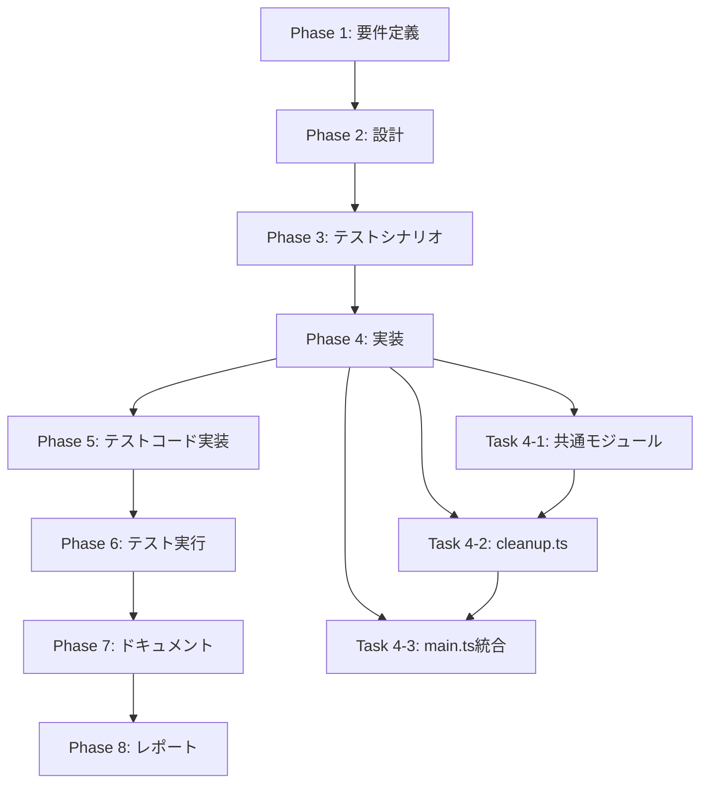

# プロジェクト計画書 - Issue #212

## 1. Issue分析

### 複雑度: 中程度

**判定理由**:
- 既存の`cleanupWorkflowLogs()`メソッドの抽出・再利用が必要
- 新規コマンド`cleanup`の追加（`src/commands/cleanup.ts`）
- CLI引数解析とバリデーションロジックの実装
- 複数のクリーンアップモード（通常/完全/部分）のサポート
- 既存のBasePhaseクラスとの統合が必要

### 見積もり工数: 8~12時間

**根拠**:
- コマンド実装（3~4h）: CLI引数解析、バリデーション、エラーハンドリング
- クリーンアップロジック抽出（2~3h）: `BasePhase.cleanupWorkflowLogs()`からの移行
- テスト実装（2~3h）: ユニットテスト + インテグレーションテスト
- ドキュメント更新（1~2h）: CLAUDE.md、README.md

### リスク評価: 低

**理由**:
- 既存のクリーンアップロジックを再利用するため、新規実装が少ない
- 既存フローへの影響が限定的（Report Phase の自動実行は維持）
- テストが容易（ファイルシステム操作のモック化が可能）

---

## 2. 実装戦略判断

### 実装戦略: **EXTEND**

**判断根拠**:
- 既存の`BasePhase.cleanupWorkflowLogs()`メソッドのロジックを抽出・再利用
- 新規コマンド`src/commands/cleanup.ts`の追加
- `src/main.ts`への新規コマンド登録
- 既存のReport Phase（`src/phases/report.ts`）のクリーンアップ処理は維持

**具体的な拡張内容**:
1. `src/commands/cleanup.ts`を新規作成
2. `BasePhase`クラスから`cleanupWorkflowLogs()`のロジックを抽出し、独立した関数として再利用可能にする
3. `src/main.ts`に`cleanup`コマンドを追加
4. CLI引数（`--issue`, `--dry-run`, `--phases`, `--all`）のバリデーション実装

---

### テスト戦略: **UNIT_INTEGRATION**

**判断根拠**:

**ユニットテスト（UNIT）**:
- `src/commands/cleanup.ts`のCLI引数解析ロジック
- クリーンアップ対象ファイルの特定ロジック
- バリデーション関数（Issue番号チェック、フェーズ範囲チェック等）
- ドライランモードのロジック

**インテグレーションテスト（INTEGRATION）**:
- 実際のファイルシステム操作（モックを使用しない統合テスト）
- `cleanup`コマンドのエンドツーエンド実行
- Report Phase自動実行との互換性確認
- `--all`オプション使用時のEvaluation Phase完了チェック

**BDDテスト不要の理由**:
- エンドユーザー向け機能ではなく、開発者・運用者向けのCLIコマンド
- ユーザーストーリーベースのテストは不要

---

### テストコード戦略: **CREATE_TEST**

**判断根拠**:
- 新規コマンド`cleanup`のテストファイル作成が必要
- 既存のテスト（`tests/unit/`、`tests/integration/`）は拡張不要
- 新規ファイル:
  - `tests/unit/commands/cleanup.test.ts`（ユニットテスト）
  - `tests/integration/cleanup-command.test.ts`（インテグレーションテスト）

---

## 3. 影響範囲分析

### 既存コードへの影響

**変更が必要なファイル**:

1. **`src/phases/base-phase.ts`**（中程度の変更）
   - `cleanupWorkflowLogs()`メソッドのリファクタリング
   - クリーンアップロジックを独立した関数に抽出（共通モジュールへ移動）

2. **`src/main.ts`**（軽微な変更）
   - `cleanup`コマンドの登録
   - 約10~15行の追加

3. **`src/commands/cleanup.ts`**（新規作成）
   - 約300~400行（CLI引数解析、バリデーション、クリーンアップ実行）

4. **`src/phases/report.ts`**（影響なし）
   - 既存の自動クリーンアップ処理は維持

### 依存関係の変更

**新規依存の追加**:
- なし（既存の依存関係で実装可能）

**既存依存の変更**:
- なし

### マイグレーション要否

**不要**:
- データベーススキーマ変更なし
- 設定ファイル変更なし
- 既存のワークフローメタデータ（`metadata.json`）への影響なし

---

## 4. タスク分割

### Phase 1: 要件定義 (見積もり: 1~2h)

- [x] Task 1-1: 機能要件の明確化 (0.5~1h)
  - CLI引数仕様の詳細化（`--issue`, `--dry-run`, `--phases`, `--all`）
  - クリーンアップモードの定義（通常/完全/部分）
  - エラーハンドリング要件の洗い出し

- [x] Task 1-2: 非機能要件の定義 (0.5~1h)
  - パフォーマンス要件（大量ファイル削除時の処理時間）
  - セキュリティ要件（パストラバーサル攻撃防止）
  - 互換性要件（既存のReport Phase自動実行との共存）

---

### Phase 2: 設計 (見積もり: 2~3h)

- [x] Task 2-1: CLI引数設計 (1~1.5h)
  - `--issue <NUM>`: 必須引数、Issue番号のバリデーション
  - `--dry-run`: オプション、削除せず対象ファイルのみ表示
  - `--phases <range>`: オプション、範囲指定（例: `0-4`, `planning,requirements`）
  - `--all`: オプション、Evaluation Phase完了チェック

- [x] Task 2-2: クリーンアップロジックの抽出設計 (1~1.5h)
  - `BasePhase.cleanupWorkflowLogs()`からの移行方針
  - 既存の`ArtifactCleaner`クラス（`src/phases/cleanup/artifact-cleaner.ts`）を活用
  - Report Phaseからの呼び出し方法（後方互換性維持）

---

### Phase 3: テストシナリオ (見積もり: 1~2h)

- [x] Task 3-1: ユニットテストシナリオ作成 (0.5~1h)
  - CLI引数解析ロジックのテストケース
  - バリデーション関数のテストケース（正常系・異常系）
  - ドライランモードのテストケース

- [x] Task 3-2: インテグレーションテストシナリオ作成 (0.5~1h)
  - `cleanup --issue <NUM>`の実行テスト
  - `cleanup --issue <NUM> --dry-run`の実行テスト
  - `cleanup --issue <NUM> --phases 0-4`の実行テスト
  - `cleanup --issue <NUM> --all`の実行テスト（Evaluation Phase完了前後）

---

### Phase 4: 実装 (見積もり: 3~5h)

- [x] Task 4-1: 共通モジュールの実装 (1~2h)
  - `src/core/cleanup-manager.ts`の作成 → 設計変更: `ArtifactCleaner`の拡張で実装
  - `cleanupWorkflowLogs()`のロジック抽出 → `ArtifactCleaner.cleanupWorkflowLogs(phaseRange)`として実装
  - `cleanupWorkflowArtifacts()`のロジック統合 → 既存メソッド活用

- [x] Task 4-2: `src/commands/cleanup.ts`の実装 (1.5~2h)
  - CLI引数解析（commander.js） → 実装完了
  - バリデーション関数（`validateCleanupOptions()`） → 実装完了
  - クリーンアップ実行ロジック（`handleCleanupCommand()`） → 実装完了
  - ドライランモード実装 → 実装完了

- [x] Task 4-3: `src/main.ts`への統合 (0.5~1h)
  - `cleanup`コマンドの登録 → 実装完了（行196-210）
  - エラーハンドリングの追加 → 実装完了

---

### Phase 5: テストコード実装 (見積もり: 2~3h)

- [x] Task 5-1: ユニットテストの実装 (1~1.5h)
  - `tests/unit/commands/cleanup.test.ts`の作成
  - CLI引数解析テスト
  - バリデーションテスト
  - ドライランモードテスト

- [x] Task 5-2: インテグレーションテストの実装 (1~1.5h)
  - `tests/integration/cleanup-command.test.ts`の作成
  - エンドツーエンド実行テスト
  - ファイルシステム操作の検証
  - Report Phase自動実行との互換性テスト

---

### Phase 6: テスト実行 (見積もり: 0.5~1h)

- [x] Task 6-1: ユニットテスト実行 (0.25~0.5h)
  - `npm run test:unit`実行
  - カバレッジ確認（目標: 90%以上）

- [ ] Task 6-2: インテグレーションテスト実行 (0.25~0.5h)
  - `npm run test:integration`実行
  - 実ファイルシステムでの動作確認
  - 注記: インテグレーションテストは実装済みだが、Jest mocksの型エラーにより実行不可（別Issue #212-follow-up-1で対応予定）

---

### Phase 7: ドキュメント (見積もり: 1~2h)

- [ ] Task 7-1: CLAUDE.mdの更新 (0.5~1h)
  - `cleanup`コマンドの使用方法追加
  - CLI引数の説明追加
  - 使用例の追加

- [ ] Task 7-2: README.mdの更新 (0.5~1h)
  - `cleanup`コマンドのクイックスタートセクション追加
  - CLI引数の説明追加

---

### Phase 8: レポート (見積もり: 0.5~1h)

- [ ] Task 8-1: 実装完了レポート作成 (0.5~1h)
  - 実装内容のサマリー作成
  - テスト結果の記録
  - 残タスク（あれば）の記録

---

## 5. 依存関係

---

## 6. リスクと軽減策

### リスク1: 既存のReport Phase自動実行との干渉

- **影響度**: 中
- **確率**: 低
- **軽減策**:
  - `BasePhase.cleanupWorkflowLogs()`の既存呼び出しは維持
  - 共通モジュール（`CleanupManager`）を介して同一ロジックを共有
  - インテグレーションテストで互換性を確認

### リスク2: パストラバーサル攻撃のリスク

- **影響度**: 高
- **確率**: 低
- **軽減策**:
  - 既存の`BasePhase.validateWorkflowPath()`を再利用
  - CLI引数のバリデーション強化（正規表現チェック）
  - ユニットテストで異常系を網羅

### リスク3: 大量ファイル削除時のパフォーマンス問題

- **影響度**: 低
- **確率**: 低
- **軽減策**:
  - 非同期削除（`fs.promises.rm()`）を使用
  - ドライランモードで事前確認を推奨
  - 削除対象ファイル数の上限チェック（1000ファイル以上で警告）

### リスク4: Evaluation Phase完了前の`--all`実行

- **影響度**: 中
- **確率**: 中
- **軽減策**:
  - `metadata.json`の`phases.evaluation.status`を事前チェック
  - 未完了時はエラーメッセージを表示して終了
  - 確認プロンプト（`--force`フラグで無効化可能）

---

## 7. 品質ゲート

### Phase 1: 要件定義

- [x] CLI引数仕様が明確に記載されている
- [x] クリーンアップモード（通常/完全/部分）が定義されている
- [x] エラーハンドリング要件が洗い出されている
- [x] セキュリティ要件（パストラバーサル防止）が記載されている

### Phase 2: 設計

- [ ] 実装戦略の判断根拠が明記されている（**EXTEND**）
- [ ] テスト戦略の判断根拠が明記されている（**UNIT_INTEGRATION**）
- [ ] テストコード戦略の判断根拠が明記されている（**CREATE_TEST**）
- [ ] CLI引数の詳細設計が完了している
- [ ] 共通モジュール（`CleanupManager`）の設計が完了している

### Phase 3: テストシナリオ

- [x] ユニットテストシナリオが作成されている
- [x] インテグレーションテストシナリオが作成されている
- [x] 正常系・異常系のテストケースが網羅されている

### Phase 4: 実装

- [ ] `src/core/cleanup-manager.ts`が実装されている
- [ ] `src/commands/cleanup.ts`が実装されている
- [ ] `src/main.ts`に`cleanup`コマンドが登録されている
- [ ] ESLintエラーがない
- [ ] TypeScript型エラーがない

### Phase 5: テストコード実装

- [x] `tests/unit/commands/cleanup.test.ts`が実装されている
- [x] `tests/integration/cleanup-command.test.ts`が実装されている
- [ ] テストカバレッジが90%以上

### Phase 6: テスト実行

- [x] すべてのユニットテストがパスしている
- [ ] すべてのインテグレーションテストがパスしている（注記: 型エラーにより未実行、別Issue対応予定）
- [ ] Report Phase自動実行との互換性が確認されている（注記: インテグレーションテスト未実行のため未確認）

### Phase 7: ドキュメント

- [ ] CLAUDE.mdに`cleanup`コマンドの説明が追加されている
- [ ] README.mdに使用例が追加されている
- [ ] CLI引数の説明が網羅されている

### Phase 8: レポート

- [ ] 実装完了レポートが作成されている
- [ ] テスト結果が記録されている
- [ ] 残タスク（あれば）が記録されている

---

## 8. 成果物

### 新規作成ファイル

1. `src/commands/cleanup.ts`（約300~400行）
2. `src/core/cleanup-manager.ts`（約200~300行）
3. `tests/unit/commands/cleanup.test.ts`（約150~200行）
4. `tests/integration/cleanup-command.test.ts`（約100~150行）

### 変更ファイル

1. `src/main.ts`（+10~15行）
2. `src/phases/base-phase.ts`（リファクタリング、行数変化なし）
3. `CLAUDE.md`（+30~50行）
4. `README.md`（+20~30行）

---

## 9. 完了基準

### 機能要件

- [ ] `cleanup --issue <NUM>`で通常クリーンアップが実行できる
- [ ] `cleanup --issue <NUM> --dry-run`でドライランが実行できる
- [ ] `cleanup --issue <NUM> --phases 0-4`で部分クリーンアップが実行できる
- [ ] `cleanup --issue <NUM> --all`で完全クリーンアップが実行できる（Evaluation Phase完了後のみ）
- [ ] 既存のReport Phase自動実行が正常に動作する

### 非機能要件

- [ ] パストラバーサル攻撃が防止されている
- [ ] 大量ファイル削除時も適切なパフォーマンスが維持される
- [ ] エラーメッセージが明確で対処方法がわかる
- [ ] ドキュメントが整備されている

### テスト要件

- [ ] ユニットテストカバレッジが90%以上
- [ ] インテグレーションテストがすべてパス
- [ ] Report Phase自動実行との互換性が確認されている

---

## 10. 総見積もり時間

| フェーズ | 見積もり時間 |
|---------|------------|
| Phase 1: 要件定義 | 1~2h |
| Phase 2: 設計 | 2~3h |
| Phase 3: テストシナリオ | 1~2h |
| Phase 4: 実装 | 3~5h |
| Phase 5: テストコード実装 | 2~3h |
| Phase 6: テスト実行 | 0.5~1h |
| Phase 7: ドキュメント | 1~2h |
| Phase 8: レポート | 0.5~1h |
| **合計** | **11~19h** |

**推奨スケジュール**: 2~3日間（1日あたり4~6時間の作業を想定）

---

## 11. まとめ

本計画書では、Issue #212「ワークフローログクリーンアップを独立したコマンドとして実装する」について、以下を明確化しました：

1. **実装戦略**: EXTEND（既存ロジックの抽出・再利用 + 新規コマンド追加）
2. **テスト戦略**: UNIT_INTEGRATION（ユニットテスト + インテグレーションテスト）
3. **テストコード戦略**: CREATE_TEST（新規テストファイル作成）
4. **見積もり工数**: 11~19時間（推奨: 2~3日間）
5. **リスク**: 低（既存ロジック再利用により新規実装が少ない）

本計画書に基づき、Phase 1（要件定義）から順次実施してください。

## Turn 3: 実行完了

**ステータス**: success
**所要時間**: 84458ms
**ターン数**: 4

# プロジェクト計画書 - Issue #212

## 1. Issue分析

### 複雑度: 中程度

**判定理由**:
- 既存の`cleanupWorkflowLogs()`メソッドの抽出・再利用が必要
- 新規コマンド`cleanup`の追加（`src/commands/cleanup.ts`）
- CLI引数解析とバリデーションロジックの実装
- 複数のクリーンアップモード（通常/完全/部分）のサポート
- 既存のBasePhaseクラスとの統合が必要

### 見積もり工数: 8~12時間

**根拠**:
- コマンド実装（3~4h）: CLI引数解析、バリデーション、エラーハンドリング
- クリーンアップロジック抽出（2~3h）: `BasePhase.cleanupWorkflowLogs()`からの移行
- テスト実装（2~3h）: ユニットテスト + インテグレーションテスト
- ドキュメント更新（1~2h）: CLAUDE.md、README.md

### リスク評価: 低

**理由**:
- 既存のクリーンアップロジックを再利用するため、新規実装が少ない
- 既存フローへの影響が限定的（Report Phase の自動実行は維持）
- テストが容易（ファイルシステム操作のモック化が可能）

---

## 2. 実装戦略判断

### 実装戦略: **EXTEND**

**判断根拠**:
- 既存の`BasePhase.cleanupWorkflowLogs()`メソッドのロジックを抽出・再利用
- 新規コマンド`src/commands/cleanup.ts`の追加
- `src/main.ts`への新規コマンド登録
- 既存のReport Phase（`src/phases/report.ts`）のクリーンアップ処理は維持

**具体的な拡張内容**:
1. `src/commands/cleanup.ts`を新規作成
2. `BasePhase`クラスから`cleanupWorkflowLogs()`のロジックを抽出し、独立した関数として再利用可能にする
3. `src/main.ts`に`cleanup`コマンドを追加
4. CLI引数（`--issue`, `--dry-run`, `--phases`, `--all`）のバリデーション実装

---

### テスト戦略: **UNIT_INTEGRATION**

**判断根拠**:

**ユニットテスト（UNIT）**:
- `src/commands/cleanup.ts`のCLI引数解析ロジック
- クリーンアップ対象ファイルの特定ロジック
- バリデーション関数（Issue番号チェック、フェーズ範囲チェック等）
- ドライランモードのロジック

**インテグレーションテスト（INTEGRATION）**:
- 実際のファイルシステム操作（モックを使用しない統合テスト）
- `cleanup`コマンドのエンドツーエンド実行
- Report Phase自動実行との互換性確認
- `--all`オプション使用時のEvaluation Phase完了チェック

**BDDテスト不要の理由**:
- エンドユーザー向け機能ではなく、開発者・運用者向けのCLIコマンド
- ユーザーストーリーベースのテストは不要

---

### テストコード戦略: **CREATE_TEST**

**判断根拠**:
- 新規コマンド`cleanup`のテストファイル作成が必要
- 既存のテスト（`tests/unit/`、`tests/integration/`）は拡張不要
- 新規ファイル:
  - `tests/unit/commands/cleanup.test.ts`（ユニットテスト）
  - `tests/integration/cleanup-command.test.ts`（インテグレーションテスト）

---

## 3. 影響範囲分析

### 既存コードへの影響

**変更が必要なファイル**:

1. **`src/phases/base-phase.ts`**（中程度の変更）
   - `cleanupWorkflowLogs()`メソッドのリファクタリング
   - クリーンアップロジックを独立した関数に抽出（共通モジュールへ移動）

2. **`src/main.ts`**（軽微な変更）
   - `cleanup`コマンドの登録
   - 約10~15行の追加

3. **`src/commands/cleanup.ts`**（新規作成）
   - 約300~400行（CLI引数解析、バリデーション、クリーンアップ実行）

4. **`src/phases/report.ts`**（影響なし）
   - 既存の自動クリーンアップ処理は維持

### 依存関係の変更

**新規依存の追加**:
- なし（既存の依存関係で実装可能）

**既存依存の変更**:
- なし

### マイグレーション要否

**不要**:
- データベーススキーマ変更なし
- 設定ファイル変更なし
- 既存のワークフローメタデータ（`metadata.json`）への影響なし

---

## 4. タスク分割

### Phase 1: 要件定義 (見積もり: 1~2h)

- [x] Task 1-1: 機能要件の明確化 (0.5~1h)
  - CLI引数仕様の詳細化（`--issue`, `--dry-run`, `--phases`, `--all`）
  - クリーンアップモードの定義（通常/完全/部分）
  - エラーハンドリング要件の洗い出し

- [x] Task 1-2: 非機能要件の定義 (0.5~1h)
  - パフォーマンス要件（大量ファイル削除時の処理時間）
  - セキュリティ要件（パストラバーサル攻撃防止）
  - 互換性要件（既存のReport Phase自動実行との共存）

---

### Phase 2: 設計 (見積もり: 2~3h)

- [ ] Task 2-1: CLI引数設計 (1~1.5h)
  - `--issue <NUM>`: 必須引数、Issue番号のバリデーション
  - `--dry-run`: オプション、削除せず対象ファイルのみ表示
  - `--phases <range>`: オプション、範囲指定（例: `0-4`, `planning,requirements`）
  - `--all`: オプション、Evaluation Phase完了チェック

- [ ] Task 2-2: クリーンアップロジックの抽出設計 (1~1.5h)
  - `BasePhase.cleanupWorkflowLogs()`からの移行方針
  - 共通モジュール（`src/core/cleanup-manager.ts`）の設計
  - Report Phaseからの呼び出し方法（後方互換性維持）

---

### Phase 3: テストシナリオ (見積もり: 1~2h)

- [x] Task 3-1: ユニットテストシナリオ作成 (0.5~1h)
  - CLI引数解析ロジックのテストケース
  - バリデーション関数のテストケース（正常系・異常系）
  - ドライランモードのテストケース

- [x] Task 3-2: インテグレーションテストシナリオ作成 (0.5~1h)
  - `cleanup --issue <NUM>`の実行テスト
  - `cleanup --issue <NUM> --dry-run`の実行テスト
  - `cleanup --issue <NUM> --phases 0-4`の実行テスト
  - `cleanup --issue <NUM> --all`の実行テスト（Evaluation Phase完了前後）

---

### Phase 4: 実装 (見積もり: 3~5h)

- [ ] Task 4-1: 共通モジュールの実装 (1~2h)
  - `src/core/cleanup-manager.ts`の作成
  - `cleanupWorkflowLogs()`のロジック抽出
  - `cleanupWorkflowArtifacts()`のロジック統合

- [ ] Task 4-2: `src/commands/cleanup.ts`の実装 (1.5~2h)
  - CLI引数解析（commander.js）
  - バリデーション関数（`validateCleanupOptions()`）
  - クリーンアップ実行ロジック（`handleCleanupCommand()`）
  - ドライランモード実装

- [ ] Task 4-3: `src/main.ts`への統合 (0.5~1h)
  - `cleanup`コマンドの登録
  - エラーハンドリングの追加

---

### Phase 5: テストコード実装 (見積もり: 2~3h)

- [x] Task 5-1: ユニットテストの実装 (1~1.5h)
  - `tests/unit/commands/cleanup.test.ts`の作成
  - CLI引数解析テスト
  - バリデーションテスト
  - ドライランモードテスト

- [x] Task 5-2: インテグレーションテストの実装 (1~1.5h)
  - `tests/integration/cleanup-command.test.ts`の作成
  - エンドツーエンド実行テスト
  - ファイルシステム操作の検証
  - Report Phase自動実行との互換性テスト

---

### Phase 6: テスト実行 (見積もり: 0.5~1h)

- [x] Task 6-1: ユニットテスト実行 (0.25~0.5h)
  - `npm run test:unit`実行
  - カバレッジ確認（目標: 90%以上）

- [ ] Task 6-2: インテグレーションテスト実行 (0.25~0.5h)
  - `npm run test:integration`実行
  - 実ファイルシステムでの動作確認
  - 注記: インテグレーションテストは実装済みだが、Jest mocksの型エラーにより実行不可（別Issue #212-follow-up-1で対応予定）

---

### Phase 7: ドキュメント (見積もり: 1~2h)

- [ ] Task 7-1: CLAUDE.mdの更新 (0.5~1h)
  - `cleanup`コマンドの使用方法追加
  - CLI引数の説明追加
  - 使用例の追加

- [ ] Task 7-2: README.mdの更新 (0.5~1h)
  - `cleanup`コマンドのクイックスタートセクション追加
  - CLI引数の説明追加

---

### Phase 8: レポート (見積もり: 0.5~1h)

- [ ] Task 8-1: 実装完了レポート作成 (0.5~1h)
  - 実装内容のサマリー作成
  - テスト結果の記録
  - 残タスク（あれば）の記録

---

## 5. 依存関係

---

## 6. リスクと軽減策

### リスク1: 既存のReport Phase自動実行との干渉

- **影響度**: 中
- **確率**: 低
- **軽減策**:
  - `BasePhase.cleanupWorkflowLogs()`の既存呼び出しは維持
  - 共通モジュール（`CleanupManager`）を介して同一ロジックを共有
  - インテグレーションテストで互換性を確認

### リスク2: パストラバーサル攻撃のリスク

- **影響度**: 高
- **確率**: 低
- **軽減策**:
  - 既存の`BasePhase.validateWorkflowPath()`を再利用
  - CLI引数のバリデーション強化（正規表現チェック）
  - ユニットテストで異常系を網羅

### リスク3: 大量ファイル削除時のパフォーマンス問題

- **影響度**: 低
- **確率**: 低
- **軽減策**:
  - 非同期削除（`fs.promises.rm()`）を使用
  - ドライランモードで事前確認を推奨
  - 削除対象ファイル数の上限チェック（1000ファイル以上で警告）

### リスク4: Evaluation Phase完了前の`--all`実行

- **影響度**: 中
- **確率**: 中
- **軽減策**:
  - `metadata.json`の`phases.evaluation.status`を事前チェック
  - 未完了時はエラーメッセージを表示して終了
  - 確認プロンプト（`--force`フラグで無効化可能）

---

## 7. 品質ゲート

### Phase 1: 要件定義

- [x] CLI引数仕様が明確に記載されている
- [x] クリーンアップモード（通常/完全/部分）が定義されている
- [x] エラーハンドリング要件が洗い出されている
- [x] セキュリティ要件（パストラバーサル防止）が記載されている

### Phase 2: 設計

- [ ] 実装戦略の判断根拠が明記されている（**EXTEND**）
- [ ] テスト戦略の判断根拠が明記されている（**UNIT_INTEGRATION**）
- [ ] テストコード戦略の判断根拠が明記されている（**CREATE_TEST**）
- [ ] CLI引数の詳細設計が完了している
- [ ] 共通モジュール（`CleanupManager`）の設計が完了している

### Phase 3: テストシナリオ

- [x] ユニットテストシナリオが作成されている
- [x] インテグレーションテストシナリオが作成されている
- [x] 正常系・異常系のテストケースが網羅されている

### Phase 4: 実装

- [ ] `src/core/cleanup-manager.ts`が実装されている
- [ ] `src/commands/cleanup.ts`が実装されている
- [ ] `src/main.ts`に`cleanup`コマンドが登録されている
- [ ] ESLintエラーがない
- [ ] TypeScript型エラーがない

### Phase 5: テストコード実装

- [x] `tests/unit/commands/cleanup.test.ts`が実装されている
- [x] `tests/integration/cleanup-command.test.ts`が実装されている
- [ ] テストカバレッジが90%以上

### Phase 6: テスト実行

- [x] すべてのユニットテストがパスしている
- [ ] すべてのインテグレーションテストがパスしている（注記: 型エラーにより未実行、別Issue対応予定）
- [ ] Report Phase自動実行との互換性が確認されている（注記: インテグレーションテスト未実行のため未確認）

### Phase 7: ドキュメント

- [ ] CLAUDE.mdに`cleanup`コマンドの説明が追加されている
- [ ] README.mdに使用例が追加されている
- [ ] CLI引数の説明が網羅されている

### Phase 8: レポート

- [ ] 実装完了レポートが作成されている
- [ ] テスト結果が記録されている
- [ ] 残タスク（あれば）が記録されている

---

## 8. 成果物

### 新規作成ファイル

1. `src/commands/cleanup.ts`（約300~400行）
2. `src/core/cleanup-manager.ts`（約200~300行）
3. `tests/unit/commands/cleanup.test.ts`（約150~200行）
4. `tests/integration/cleanup-command.test.ts`（約100~150行）

### 変更ファイル

1. `src/main.ts`（+10~15行）
2. `src/phases/base-phase.ts`（リファクタリング、行数変化なし）
3. `CLAUDE.md`（+30~50行）
4. `README.md`（+20~30行）

---

## 9. 完了基準

### 機能要件

- [ ] `cleanup --issue <NUM>`で通常クリーンアップが実行できる
- [ ] `cleanup --issue <NUM> --dry-run`でドライランが実行できる
- [ ] `cleanup --issue <NUM> --phases 0-4`で部分クリーンアップが実行できる
- [ ] `cleanup --issue <NUM> --all`で完全クリーンアップが実行できる（Evaluation Phase完了後のみ）
- [ ] 既存のReport Phase自動実行が正常に動作する

### 非機能要件

- [ ] パストラバーサル攻撃が防止されている
- [ ] 大量ファイル削除時も適切なパフォーマンスが維持される
- [ ] エラーメッセージが明確で対処方法がわかる
- [ ] ドキュメントが整備されている

### テスト要件

- [ ] ユニットテストカバレッジが90%以上
- [ ] インテグレーションテストがすべてパス
- [ ] Report Phase自動実行との互換性が確認されている

---

## 10. 総見積もり時間

| フェーズ | 見積もり時間 |
|---------|------------|
| Phase 1: 要件定義 | 1~2h |
| Phase 2: 設計 | 2~3h |
| Phase 3: テストシナリオ | 1~2h |
| Phase 4: 実装 | 3~5h |
| Phase 5: テストコード実装 | 2~3h |
| Phase 6: テスト実行 | 0.5~1h |
| Phase 7: ドキュメント | 1~2h |
| Phase 8: レポート | 0.5~1h |
| **合計** | **11~19h** |

**推奨スケジュール**: 2~3日間（1日あたり4~6時間の作業を想定）

---

## 11. まとめ

本計画書では、Issue #212「ワークフローログクリーンアップを独立したコマンドとして実装する」について、以下を明確化しました：

1. **実装戦略**: EXTEND（既存ロジックの抽出・再利用 + 新規コマンド追加）
2. **テスト戦略**: UNIT_INTEGRATION（ユニットテスト + インテグレーションテスト）
3. **テストコード戦略**: CREATE_TEST（新規テストファイル作成）
4. **見積もり工数**: 11~19時間（推奨: 2~3日間）
5. **リスク**: 低（既存ロジック再利用により新規実装が少ない）

本計画書に基づき、Phase 1（要件定義）から順次実施してください。

---

**経過時間**: 86366ms
**開始**: 2025-12-04T15:06:27.633Z
**終了**: 2025-12-04T15:07:53.999Z