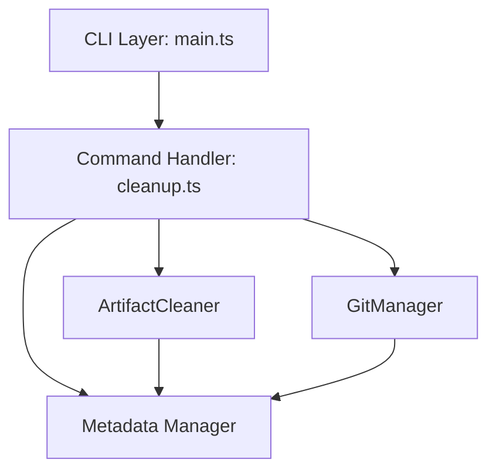

# 詳細設計書 - Issue #212

## 0. Planning Documentの確認

Planning Phase（Phase 0）で策定された開発計画を確認しました：

### 開発計画の全体像
- **実装戦略**: EXTEND（既存ロジックの抽出・再利用 + 新規コマンド追加）
- **テスト戦略**: UNIT_INTEGRATION（ユニットテスト + インテグレーションテスト）
- **テストコード戦略**: CREATE_TEST（新規テストファイル作成）
- **見積もり工数**: 11~19時間（推奨: 2~3日間）
- **リスク評価**: 低（既存ロジック再利用により新規実装が少ない）

### 主要な設計決定（Planning Phaseより）
1. `BasePhase.cleanupWorkflowLogs()`のロジックは既に`ArtifactCleaner`クラスに抽出済み
2. `src/commands/cleanup.ts`を新規作成し、CLI引数解析とバリデーション実装
3. `src/main.ts`に`cleanup`コマンドを登録
4. 既存のReport Phase（Phase 8）の自動クリーンアップ処理は維持

---

## 1. アーキテクチャ設計

### 1.1 システム全体図

```
┌─────────────────────────────────────────────────────────┐
│                    CLI Layer (src/main.ts)              │
│  - commander定義でcleanupコマンドを登録                  │
│  - オプション定義: --issue, --dry-run, --phases, --all  │
└─────────────────────────────────────────────────────────┘
                         │
                         ↓
┌─────────────────────────────────────────────────────────┐
│         Command Handler (src/commands/cleanup.ts)        │
│  - handleCleanupCommand(): エントリーポイント           │
│  - validateCleanupOptions(): バリデーション             │
│  - parsePhaseRange(): フェーズ範囲解析                  │
│  - executeCleanup(): クリーンアップ実行                 │
└─────────────────────────────────────────────────────────┘
                         │
                         ↓
┌─────────────────────────────────────────────────────────┐
│     Cleanup Core (src/phases/cleanup/artifact-cleaner.ts) │
│  - cleanupWorkflowLogs(): 通常クリーンアップ（既存）    │
│  - cleanupWorkflowArtifacts(): 完全クリーンアップ（既存）│
│  - validatePath(): パス検証（既存）                     │
│  - isSymbolicLink(): シンボリックリンクチェック（既存）  │
└─────────────────────────────────────────────────────────┘
                         │
                         ↓
┌─────────────────────────────────────────────────────────┐
│     Utilities (MetadataManager, GitManager)              │
│  - メタデータ読み込み・更新                             │
│  - Git コミット & プッシュ                              │
└─────────────────────────────────────────────────────────┘
```

### 1.2 コンポーネント間の関係



### 1.3 データフロー

1. **ユーザー入力**: CLI引数（`--issue 123 --phases 0-4`）
2. **バリデーション**: Issue番号、フェーズ範囲、Evaluation完了チェック
3. **メタデータ読み込み**: `.ai-workflow/issue-<NUM>/metadata.json`
4. **クリーンアップ実行**:
   - 通常モード: `ArtifactCleaner.cleanupWorkflowLogs()` を呼び出し
   - 完全モード: `ArtifactCleaner.cleanupWorkflowArtifacts()` を呼び出し
5. **Git コミット**: 削除後に自動コミット＆プッシュ
6. **結果出力**: コンソールに削除結果を表示

---

## 2. 実装戦略判断

### 実装戦略: **EXTEND**

**判断根拠**:
- **既存コードの再利用**: `ArtifactCleaner`クラス（`src/phases/cleanup/artifact-cleaner.ts`）が既に実装済み
  - `cleanupWorkflowLogs()`: 通常クリーンアップ（phases 00-08のexecute/review/revise削除）
  - `cleanupWorkflowArtifacts()`: 完全クリーンアップ（ワークフローディレクトリ全体削除）
  - `validatePath()`: パス検証（セキュリティ対策）
  - `isSymbolicLink()`: シンボリックリンクチェック
- **新規コマンド追加**: `src/commands/cleanup.ts`（約300行）を作成
- **CLI統合**: `src/main.ts`にコマンド定義を追加（約20行）
- **既存フローの維持**: Report Phaseの自動クリーンアップは変更なし

**具体的な拡張内容**:
1. `src/commands/cleanup.ts`を新規作成
   - CLI引数解析とバリデーション
   - フェーズ範囲の解析（`0-4` → `['planning', 'requirements', 'design', 'test_scenario', 'implementation']`）
   - `ArtifactCleaner`のメソッドを呼び出し
2. `src/main.ts`に`cleanup`コマンドを登録
3. `ArtifactCleaner.cleanupWorkflowLogs()`を拡張し、フェーズ範囲指定に対応（既存メソッドにオプション引数を追加）

---

## 3. テスト戦略判断

### テスト戦略: **UNIT_INTEGRATION**

**判断根拠**:

**ユニットテスト（UNIT）**:
- `src/commands/cleanup.ts`のCLI引数解析ロジック
  - `validateCleanupOptions()`: Issue番号、フェーズ範囲、Evaluation完了チェック
  - `parsePhaseRange()`: フェーズ範囲文字列の解析（`0-4`, `planning,requirements`）
- バリデーション関数のテストケース（正常系・異常系）
  - 無効なIssue番号（`--issue abc`）
  - 無効なフェーズ範囲（`--phases 10-12`）
  - Evaluation未完了時の`--all`オプション
- ドライランモードのロジック（ファイル削除せず、対象ファイルのみ表示）

**インテグレーションテスト（INTEGRATION）**:
- 実際のファイルシステム操作（モックを使用しない統合テスト）
  - `cleanup --issue <NUM>`の実行テスト
  - `cleanup --issue <NUM> --dry-run`の実行テスト
  - `cleanup --issue <NUM> --phases 0-4`の実行テスト
  - `cleanup --issue <NUM> --all`の実行テスト（Evaluation Phase完了前後）
- Report Phase自動実行との互換性確認
  - Report Phase完了後にクリーンアップが正常に動作することを確認
- Git コミット & プッシュの統合テスト
  - クリーンアップ後に自動コミットが実行されることを確認

**BDDテスト不要の理由**:
- エンドユーザー向け機能ではなく、開発者・運用者向けのCLIコマンド
- ユーザーストーリーベースのテストは不要（BDDはユーザー視点の受け入れテストに適している）

---

## 4. テストコード戦略判断

### テストコード戦略: **CREATE_TEST**

**判断根拠**:
- 新規コマンド`cleanup`のテストファイル作成が必要
- 既存のテスト（`tests/unit/`、`tests/integration/`）は拡張不要（rollbackコマンドと同様の独立した機能）
- 新規ファイル:
  - `tests/unit/commands/cleanup.test.ts`（ユニットテスト、約150-200行）
  - `tests/integration/cleanup-command.test.ts`（インテグレーションテスト、約100-150行）

**既存テストとの関連性**:
- `ArtifactCleaner`クラスの既存ユニットテストは維持（`tests/unit/phases/cleanup/artifact-cleaner.test.ts`）
- 新規コマンドのテストは独立して作成し、`ArtifactCleaner`のメソッドをモック化してテスト

---

## 5. 影響範囲分析

### 5.1 既存コードへの影響

**変更が必要なファイル**:

1. **`src/phases/cleanup/artifact-cleaner.ts`**（軽微な変更）
   - `cleanupWorkflowLogs()` メソッドを拡張し、フェーズ範囲指定に対応
   - 新規引数: `phaseRange?: PhaseName[]`（オプション）
   - デフォルト動作は既存と同じ（phases 00-08を削除）

2. **`src/main.ts`**（軽微な変更）
   - `cleanup`コマンドの登録
   - 約20行の追加

3. **`src/commands/cleanup.ts`**（新規作成）
   - 約300行（CLI引数解析、バリデーション、クリーンアップ実行）

4. **`src/phases/report.ts`**（影響なし）
   - 既存の自動クリーンアップ処理は維持
   - `ArtifactCleaner.cleanupWorkflowLogs()`の呼び出しは変更なし

### 5.2 依存関係の変更

**新規依存の追加**:
- なし（既存の依存関係で実装可能）

**既存依存の変更**:
- なし

### 5.3 マイグレーション要否

**不要**:
- データベーススキーマ変更なし
- 設定ファイル変更なし
- 既存のワークフローメタデータ（`metadata.json`）への影響なし

---

## 6. 変更・追加ファイルリスト

### 6.1 新規作成ファイル

| ファイルパス | 行数 | 説明 |
|------------|------|------|
| `src/commands/cleanup.ts` | 約300行 | クリーンアップコマンドハンドラ |
| `tests/unit/commands/cleanup.test.ts` | 約150-200行 | ユニットテスト |
| `tests/integration/cleanup-command.test.ts` | 約100-150行 | インテグレーションテスト |

### 6.2 修正が必要な既存ファイル

| ファイルパス | 変更内容 | 影響範囲 |
|------------|---------|---------|
| `src/main.ts` | `cleanup`コマンドの登録（約20行追加） | 軽微 |
| `src/phases/cleanup/artifact-cleaner.ts` | `cleanupWorkflowLogs()`メソッドの引数追加（約20行変更） | 軽微 |

### 6.3 削除が必要なファイル

なし

---

## 7. 詳細設計

### 7.1 クラス設計

#### 7.1.1 CleanupCommand（新規）

```typescript
// src/commands/cleanup.ts

import { MetadataManager } from '../core/metadata-manager.js';
import { GitManager } from '../core/git-manager.js';
import { ArtifactCleaner } from '../phases/cleanup/artifact-cleaner.js';
import { findWorkflowMetadata } from '../core/repository-utils.js';
import { PhaseName } from '../types.js';

/**
 * CleanupCommandOptions - CLIオプションの型定義
 */
export interface CleanupCommandOptions {
  issue: string;           // Issue番号（必須）
  dryRun?: boolean;        // ドライランフラグ（オプション）
  phases?: string;         // フェーズ範囲（例: "0-4", "planning,requirements"）
  all?: boolean;           // 完全クリーンアップフラグ
}

/**
 * handleCleanupCommand - クリーンアップコマンドのエントリーポイント
 */
export async function handleCleanupCommand(options: CleanupCommandOptions): Promise<void>;

/**
 * validateCleanupOptions - CLIオプションのバリデーション
 */
function validateCleanupOptions(
  options: CleanupCommandOptions,
  metadataManager: MetadataManager
): void;

/**
 * parsePhaseRange - フェーズ範囲文字列を解析してPhaseName配列に変換
 *
 * 例:
 * - "0-4" → ['planning', 'requirements', 'design', 'test_scenario', 'implementation']
 * - "planning,requirements" → ['planning', 'requirements']
 */
function parsePhaseRange(rangeStr: string): PhaseName[];

/**
 * executeCleanup - クリーンアップ実行
 */
async function executeCleanup(
  options: CleanupCommandOptions,
  metadataManager: MetadataManager,
  workflowDir: string
): Promise<void>;

/**
 * previewCleanup - ドライランモードでプレビュー表示
 */
function previewCleanup(
  options: CleanupCommandOptions,
  metadataManager: MetadataManager
): void;
```

#### 7.1.2 ArtifactCleaner（既存、拡張）

```typescript
// src/phases/cleanup/artifact-cleaner.ts

/**
 * cleanupWorkflowLogs - ワークフローログのクリーンアップ（既存メソッドを拡張）
 *
 * @param phaseRange - 削除対象のフェーズ範囲（オプション）
 *   - 未指定時: phases 00-08を削除（既存動作）
 *   - 指定時: 指定されたフェーズのみ削除
 */
async cleanupWorkflowLogs(phaseRange?: PhaseName[]): Promise<void>;
```

### 7.2 関数設計（主要な関数のみ）

#### 7.2.1 handleCleanupCommand

**入力**:
- `options: CleanupCommandOptions` - CLIオプション

**処理フロー**:
1. メタデータ読み込み（`findWorkflowMetadata`）
2. バリデーション（`validateCleanupOptions`）
3. ドライランモード判定
   - `--dry-run`: `previewCleanup()`を呼び出して終了
4. クリーンアップ実行（`executeCleanup`）
5. 成功メッセージ表示

**出力**:
- なし（コンソール出力のみ）

**エラーハンドリング**:
- バリデーションエラー: 即座に例外をスロー
- クリーンアップ失敗: エラーメッセージを表示し、終了コード1で終了

#### 7.2.2 validateCleanupOptions

**入力**:
- `options: CleanupCommandOptions` - CLIオプション
- `metadataManager: MetadataManager` - メタデータマネージャー

**バリデーション項目**:
1. **Issue番号チェック**: `options.issue`が数値であることを確認
2. **ワークフロー存在チェック**: `.ai-workflow/issue-<NUM>/metadata.json`が存在することを確認
3. **フェーズ範囲チェック**: `options.phases`が有効な範囲（0-9）であることを確認
4. **Evaluation完了チェック**: `options.all`使用時、Evaluation Phaseが完了していることを確認
   - `metadata.json`の`phases.evaluation.status`が`completed`であることをチェック
5. **排他制御**: `--phases`と`--all`は同時に指定できない

**出力**:
- なし（検証成功時）

**エラーハンドリング**:
- 検証失敗時: 適切なエラーメッセージで例外をスロー

#### 7.2.3 parsePhaseRange

**入力**:
- `rangeStr: string` - フェーズ範囲文字列（例: "0-4", "planning,requirements"）

**処理**:
1. 数値範囲パターン（`0-4`）の場合:
   - 正規表現`/^(\d+)-(\d+)$/`でマッチング
   - 開始番号と終了番号を抽出
   - 範囲チェック（0-9）
   - フェーズ番号→フェーズ名に変換（`getPhaseNameFromNumber`）
2. フェーズ名リストパターン（`planning,requirements`）の場合:
   - `,`で分割
   - 各フェーズ名が有効であることを確認
3. 無効なパターンの場合: 例外をスロー

**出力**:
- `PhaseName[]` - フェーズ名の配列

**エラーハンドリング**:
- 無効な範囲（例: `10-12`）: `Error: Invalid phase range: 10-12. Valid range is 0-9`
- 無効なフェーズ名（例: `invalid_phase`）: `Error: Invalid phase name: invalid_phase`

#### 7.2.4 executeCleanup

**入力**:
- `options: CleanupCommandOptions` - CLIオプション
- `metadataManager: MetadataManager` - メタデータマネージャー
- `workflowDir: string` - ワークフローディレクトリパス

**処理フロー**:
1. `--all`フラグ判定:
   - `true`: `ArtifactCleaner.cleanupWorkflowArtifacts(force=false)`を呼び出し
   - `false`: 通常クリーンアップに進む
2. フェーズ範囲の解析:
   - `options.phases`が指定されている場合: `parsePhaseRange()`で解析
   - 未指定の場合: デフォルト（phases 00-08）
3. `ArtifactCleaner.cleanupWorkflowLogs(phaseRange)`を呼び出し
4. Git コミット & プッシュ:
   - `GitManager.commitCleanupLogs()`を呼び出し
   - コミットメッセージ: `[ai-workflow] Clean up workflow execution logs (manual cleanup)`
   - `GitManager.pushToRemote()`を呼び出し
5. 成功メッセージ表示

**出力**:
- なし（コンソール出力のみ）

**エラーハンドリング**:
- クリーンアップ失敗: エラーメッセージを表示し、例外をスロー
- Git操作失敗: エラーメッセージを表示し、例外をスロー

#### 7.2.5 previewCleanup

**入力**:
- `options: CleanupCommandOptions` - CLIオプション
- `metadataManager: MetadataManager` - メタデータマネージャー

**処理**:
1. 削除対象ファイルのスキャン:
   - フェーズ範囲を解析
   - 各フェーズの`execute/`, `review/`, `revise/`ディレクトリをスキャン
   - ファイルサイズを集計
2. プレビュー表示:
   - 削除対象ファイルのリストを表示
   - ファイルパス、サイズ、削除対象数を表示
   - 合計サイズを表示

**出力**:
- なし（コンソール出力のみ）

### 7.3 データ構造設計

#### 7.3.1 CleanupCommandOptions

```typescript
export interface CleanupCommandOptions {
  issue: string;           // Issue番号（必須）
  dryRun?: boolean;        // ドライランフラグ（オプション、デフォルト: false）
  phases?: string;         // フェーズ範囲（オプション、例: "0-4", "planning,requirements"）
  all?: boolean;           // 完全クリーンアップフラグ（オプション、デフォルト: false）
}
```

#### 7.3.2 CleanupResult（内部使用）

```typescript
/**
 * CleanupResult - クリーンアップ結果の内部データ構造
 */
interface CleanupResult {
  success: boolean;          // 成功フラグ
  deletedFiles: string[];    // 削除されたファイルのリスト
  totalSize: number;         // 削除されたファイルの合計サイズ（バイト）
  error?: string;            // エラーメッセージ（失敗時）
}
```

### 7.4 インターフェース設計

#### 7.4.1 CLI引数インターフェース

```bash
# 基本的な使用方法
node dist/index.js cleanup --issue <NUM>

# ドライラン
node dist/index.js cleanup --issue <NUM> --dry-run

# フェーズ範囲指定（数値範囲）
node dist/index.js cleanup --issue <NUM> --phases 0-4

# フェーズ範囲指定（フェーズ名リスト）
node dist/index.js cleanup --issue <NUM> --phases planning,requirements

# 完全クリーンアップ
node dist/index.js cleanup --issue <NUM> --all
```

#### 7.4.2 ArtifactCleanerインターフェース拡張

```typescript
// 既存メソッド（拡張）
async cleanupWorkflowLogs(phaseRange?: PhaseName[]): Promise<void> {
  // phaseRange未指定時: phases 00-08を削除（既存動作）
  // phaseRange指定時: 指定されたフェーズのみ削除
}
```

---

## 8. セキュリティ考慮事項

### 8.1 パストラバーサル攻撃の防止

**対策**:
- `ArtifactCleaner.validatePath()`メソッドを再利用
- 正規表現`\.ai-workflow[\/\\]issue-\d+$`でパスを検証
- 不正なパス（例: `../../etc/passwd`）は即座に拒否

**実装箇所**:
- `executeCleanup()`関数内で`ArtifactCleaner`を使用する際、自動的にパス検証が実行される

### 8.2 シンボリックリンク攻撃の防止

**対策**:
- `ArtifactCleaner.isSymbolicLink()`メソッドを再利用
- `fs.lstatSync()`によるシンボリックリンクチェック
- シンボリックリンクの場合は削除を拒否

**実装箇所**:
- `ArtifactCleaner.cleanupWorkflowArtifacts()`内で自動的にチェックされる

### 8.3 CLI引数サニタイズ

**対策**:
- Issue番号のバリデーション（数値チェック）
- フェーズ範囲の正規表現チェック（`0-9`の範囲内）
- フェーズ名のホワイトリスト検証

**実装箇所**:
- `validateCleanupOptions()`関数
- `parsePhaseRange()`関数

---

## 9. 非機能要件への対応

### 9.1 パフォーマンス

**要件**:
- 1000ファイル以下の削除を10秒以内に完了する
- 削除対象ファイル数が1000ファイルを超える場合、警告メッセージを表示する

**対応**:
- `fs.promises.rm()`を使用した非同期削除
- ファイル数の事前カウントと警告表示（`previewCleanup()`）

### 9.2 スケーラビリティ

**要件**:
- 大規模プロジェクト（数百Issue）でも正常に動作する

**対応**:
- メタデータ探索は`findWorkflowMetadata()`を使用（効率的な探索）
- クリーンアップは単一Issueのみを対象（複数Issue一括クリーンアップはスコープ外）

### 9.3 保守性

**要件**:
- 既存コードとの整合性を保つ
- ログレベル制御（`LOG_LEVEL`環境変数）に対応
- 統一loggerモジュール（`src/utils/logger.ts`）を使用

**対応**:
- `ArtifactCleaner`クラスの既存メソッドを再利用
- `logger.info()`, `logger.warn()`, `logger.error()`を使用
- `console.log`は使用しない（ESLintルール`no-console`に違反）

---

## 10. 実装の順序

### Phase 1: 共通モジュールの拡張（優先度: 高）

**タスク**:
1. `src/phases/cleanup/artifact-cleaner.ts`の`cleanupWorkflowLogs()`を拡張
   - 新規引数: `phaseRange?: PhaseName[]`を追加
   - フェーズ範囲指定時のロジック実装
   - 既存動作（phases 00-08削除）は維持

**所要時間**: 約1時間

**依存関係**: なし

### Phase 2: CLIコマンドハンドラの実装（優先度: 高）

**タスク**:
1. `src/commands/cleanup.ts`を新規作成
   - `handleCleanupCommand()`実装
   - `validateCleanupOptions()`実装
   - `parsePhaseRange()`実装
   - `executeCleanup()`実装
   - `previewCleanup()`実装

**所要時間**: 約3時間

**依存関係**: Phase 1完了後

### Phase 3: CLI統合（優先度: 高）

**タスク**:
1. `src/main.ts`に`cleanup`コマンドを登録
   - オプション定義
   - アクションハンドラ登録

**所要時間**: 約30分

**依存関係**: Phase 2完了後

### Phase 4: ユニットテスト実装（優先度: 高）

**タスク**:
1. `tests/unit/commands/cleanup.test.ts`を作成
   - `validateCleanupOptions()`のテスト
   - `parsePhaseRange()`のテスト
   - エラーケースのテスト

**所要時間**: 約2時間

**依存関係**: Phase 2完了後

### Phase 5: インテグレーションテスト実装（優先度: 中）

**タスク**:
1. `tests/integration/cleanup-command.test.ts`を作成
   - `cleanup --issue <NUM>`のエンドツーエンドテスト
   - `cleanup --issue <NUM> --dry-run`のテスト
   - `cleanup --issue <NUM> --phases 0-4`のテスト
   - `cleanup --issue <NUM> --all`のテスト

**所要時間**: 約2時間

**依存関係**: Phase 3完了後

### Phase 6: ドキュメント更新（優先度: 中）

**タスク**:
1. `CLAUDE.md`の更新
   - `cleanup`コマンドの使用方法追加
   - CLI引数の説明追加
   - 使用例の追加
2. `README.md`の更新
   - クイックスタートセクションに`cleanup`コマンドを追加

**所要時間**: 約1時間

**依存関係**: Phase 3完了後

---

## 11. 品質ゲート（Phase 2: Design）

### 必須要件

- [x] **実装戦略の判断根拠が明記されている（EXTEND）**
  - 既存の`ArtifactCleaner`クラスを再利用
  - 新規コマンド`cleanup.ts`を追加
  - CLI統合（`main.ts`）

- [x] **テスト戦略の判断根拠が明記されている（UNIT_INTEGRATION）**
  - ユニットテスト: CLI引数解析、バリデーション、フェーズ範囲解析
  - インテグレーションテスト: ファイルシステム操作、Git統合、Report Phase互換性

- [x] **テストコード戦略の判断根拠が明記されている（CREATE_TEST）**
  - 新規テストファイル: `tests/unit/commands/cleanup.test.ts`, `tests/integration/cleanup-command.test.ts`

- [x] **既存コードへの影響範囲が分析されている**
  - `src/phases/cleanup/artifact-cleaner.ts`: 軽微な変更（メソッド引数追加）
  - `src/main.ts`: 軽微な変更（コマンド登録）
  - `src/phases/report.ts`: 影響なし

- [x] **変更が必要なファイルがリストアップされている**
  - 新規作成: `src/commands/cleanup.ts`, テストファイル2つ
  - 修正: `src/main.ts`, `src/phases/cleanup/artifact-cleaner.ts`
  - 削除: なし

- [x] **設計が実装可能である**
  - すべての関数・クラス設計が明確
  - データフロー、エラーハンドリング、セキュリティ対策が定義済み
  - 既存コードとの整合性が保たれている

---

## 12. 成果物サマリー

### 12.1 新規作成ファイル

1. `src/commands/cleanup.ts`（約300行）
   - CLIコマンドハンドラ
   - バリデーション、フェーズ範囲解析、クリーンアップ実行

2. `tests/unit/commands/cleanup.test.ts`（約150-200行）
   - ユニットテスト

3. `tests/integration/cleanup-command.test.ts`（約100-150行）
   - インテグレーションテスト

### 12.2 変更ファイル

1. `src/main.ts`（+約20行）
   - `cleanup`コマンドの登録

2. `src/phases/cleanup/artifact-cleaner.ts`（+約20行）
   - `cleanupWorkflowLogs()`メソッドの引数拡張

3. `CLAUDE.md`（+約30-50行）
   - `cleanup`コマンドのドキュメント追加

4. `README.md`（+約20-30行）
   - クイックスタートセクションに`cleanup`コマンドを追加

### 12.3 合計工数見積もり

| フェーズ | 見積もり時間 |
|---------|------------|
| Phase 1: 共通モジュール拡張 | 1時間 |
| Phase 2: CLIコマンドハンドラ実装 | 3時間 |
| Phase 3: CLI統合 | 0.5時間 |
| Phase 4: ユニットテスト実装 | 2時間 |
| Phase 5: インテグレーションテスト実装 | 2時間 |
| Phase 6: ドキュメント更新 | 1時間 |
| **合計** | **9.5時間** |

**推奨スケジュール**: 1.5日間（1日あたり6-7時間の作業を想定）

---

## 13. リスクと軽減策

### リスク1: 既存のReport Phase自動実行との干渉

- **影響度**: 中
- **確率**: 低
- **軽減策**:
  - `ArtifactCleaner.cleanupWorkflowLogs()`の既存呼び出しは引数なしのまま維持
  - デフォルト動作（phases 00-08削除）を変更しない
  - インテグレーションテストで互換性を確認

### リスク2: フェーズ範囲解析の誤動作

- **影響度**: 中
- **確率**: 低
- **軽減策**:
  - `parsePhaseRange()`のユニットテストで正常系・異常系を網羅
  - 無効な範囲（例: `10-12`）は明確なエラーメッセージを表示
  - ドライランモードで事前確認を推奨

### リスク3: Git操作の失敗

- **影響度**: 低
- **確率**: 低
- **軽減策**:
  - `GitManager`のエラーハンドリングを活用
  - Git操作失敗時は適切なエラーメッセージを表示
  - インテグレーションテストでGit操作を検証

---

## 14. まとめ

本設計書では、Issue #212「ワークフローログクリーンアップを独立したコマンドとして実装する」について、以下を明確化しました：

1. **実装戦略**: EXTEND（既存`ArtifactCleaner`クラスの再利用 + 新規コマンド追加）
2. **テスト戦略**: UNIT_INTEGRATION（ユニットテスト + インテグレーションテスト）
3. **テストコード戦略**: CREATE_TEST（新規テストファイル作成）
4. **見積もり工数**: 9.5時間（推奨: 1.5日間）
5. **リスク**: 低（既存ロジック再利用により新規実装が少ない）

**主要な設計決定**:
- `ArtifactCleaner`クラスの既存メソッド（`cleanupWorkflowLogs()`, `cleanupWorkflowArtifacts()`）を再利用
- `src/commands/cleanup.ts`を新規作成し、CLI引数解析とバリデーションを実装
- `src/main.ts`に`cleanup`コマンドを登録（約20行追加）
- Report Phaseの自動クリーンアップ処理は変更なし（後方互換性維持）

本設計書に基づき、Phase 1（共通モジュール拡張）から順次実装を開始してください。
