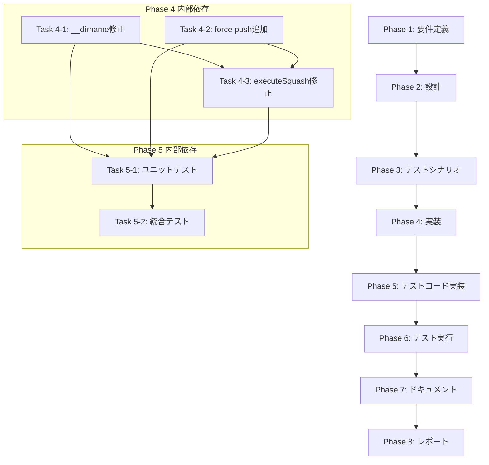

# プロジェクト計画書

## Issue分析

### 複雑度
**中程度**

### 見積もり工数
**12~16時間**

**根拠**:
- **問題1**: ESM環境での `__dirname` エラー修正（2~3h）
  - 単一ファイルの修正だが、他ファイルとの整合性確認が必要
- **問題2**: `--force-with-lease` が効いていない push の修正（4~6h）
  - RemoteManager の push ロジック調査と修正
  - スカッシュ専用の force push メソッド追加
- **問題3**: Pull後のpushでスカッシュが無効化される問題（3~4h）
  - エラーハンドリングロジックの修正
  - スカッシュ後の push 失敗時のリカバリー戦略見直し
- **テスト・ドキュメント**: ユニットテスト、統合テスト、ドキュメント更新（3~4h）

### リスク評価
**中**

**理由**:
- Git の force push は慎重な実装が必要（データ損失リスク）
- RemoteManager の変更は他機能（通常のpush）への影響を考慮する必要がある
- 統合テストでのエラー再現が難しい可能性

## 実装戦略判断

### 実装戦略: EXTEND

**判断根拠**:
1. **既存コードの拡張が中心**:
   - `squash-manager.ts` の `__dirname` を ESM 互換の方法に変更（既存メソッドの修正）
   - `remote-manager.ts` に force push 専用メソッドを追加（新規メソッド追加）
   - `squash-manager.ts` の `executeSquash()` メソッドを修正して新しい force push メソッドを呼び出す

2. **新規ファイル作成は不要**:
   - すべて既存ファイル内での修正・拡張で対応可能

3. **アーキテクチャ変更なし**:
   - ファサードパターン、依存性注入パターンは維持
   - クラス構造、責務分担は変更なし

### テスト戦略: UNIT_INTEGRATION

**判断根拠**:
1. **ユニットテストが必要**:
   - `squash-manager.ts` の `loadPromptTemplate()` メソッドのパス解決ロジック
   - `remote-manager.ts` の新しい force push メソッド
   - スカッシュ後の push 失敗時のエラーハンドリング

2. **インテグレーションテストが必要**:
   - 実際の Git リポジトリを使用したスカッシュ＆プッシュの動作確認
   - `--force-with-lease` が正しく機能するか確認
   - Pull によってスカッシュが無効化されないか確認

3. **BDDテストは不要**:
   - エンドユーザー向け機能ではなく、内部的なGit操作のため

### テストコード戦略: EXTEND_TEST

**判断根拠**:
1. **既存テストファイルに追加**:
   - `tests/unit/squash-manager.test.ts` に新しいユニットテストを追加
   - `tests/integration/squash-workflow.test.ts` に新しい統合テストを追加

2. **新規テストファイル作成は不要**:
   - スカッシュ機能のテストファイルは既に存在する
   - RemoteManager のテストも既存ファイルで対応可能

## 影響範囲分析

### 既存コードへの影響

**変更が必要なファイル**:
1. `src/core/git/squash-manager.ts`
   - `loadPromptTemplate()` メソッド: `__dirname` を `import.meta.url` + `fileURLToPath` に変更
   - `executeSquash()` メソッド: `remoteManager.pushToRemote()` を `remoteManager.forcePushToRemote()` に変更

2. `src/core/git/remote-manager.ts`
   - 新規メソッド追加: `forcePushToRemote()` メソッド
   - `pushToRemote()` メソッドの non-fast-forward エラーハンドリング見直し（スカッシュ後の pull を防ぐ）

3. `tests/unit/squash-manager.test.ts`
   - `loadPromptTemplate()` のテストケース追加

4. `tests/integration/squash-workflow.test.ts`
   - Force push の統合テスト追加

### 依存関係の変更

**新規依存の追加**: なし

**既存依存の変更**: なし

### マイグレーション要否

**不要**

- データベーススキーマ変更なし
- 設定ファイル変更なし
- メタデータフォーマット変更なし

## タスク分割

### Phase 1: 要件定義 (見積もり: 1~2h)

- [x] Task 1-1: 問題の詳細分析とエラーログ収集 (0.5~1h)
  - `__dirname is not defined` エラーの発生条件を確認
  - Force push が rejected される条件を確認
  - Pull後のpushで「no changes were pushed」となる条件を確認
- [x] Task 1-2: 既存の ESM 互換パターンの調査 (0.5~1h)
  - `src/core/github/issue-agent-generator.ts` の実装パターンを参考にする
  - `src/core/repository-analyzer.ts` の実装パターンを参考にする
  - プロジェクト全体で統一されている `import.meta.url` + `fileURLToPath` パターンを確認

### Phase 2: 設計 (見積もり: 2~3h)

- [x] Task 2-1: ESM互換のパス解決方法の設計 (0.5~1h)
  - `squash-manager.ts` に `__filename` と `__dirname` の定義を追加
  - 他のファイルとの整合性を確保
- [x] Task 2-2: Force push メソッドの設計 (1~1.5h)
  - `RemoteManager.forcePushToRemote()` メソッドのシグネチャ設計
  - `--force-with-lease` オプションの使用方法
  - リトライロジックの有無（force push では不要と判断）
- [x] Task 2-3: スカッシュ後の push 失敗時のエラーハンドリング設計 (0.5~1h)
  - `executeSquash()` メソッドの例外処理
  - Pull を実行しない方針の明確化
  - エラーメッセージの改善

### Phase 3: テストシナリオ (見積もり: 1~2h)

- [ ] Task 3-1: ユニットテストシナリオの作成 (0.5~1h)
  - `loadPromptTemplate()` が正しいパスを解決するか
  - `forcePushToRemote()` が `--force-with-lease` を使用するか
  - スカッシュ後の push 失敗時に pull を実行しないか
- [ ] Task 3-2: 統合テストシナリオの作成 (0.5~1h)
  - 実際のGitリポジトリでスカッシュ＆プッシュが成功するか
  - `--force-with-lease` によって他の変更を上書きしないか
  - Pull後のpushでスカッシュが無効化されないか

### Phase 4: 実装 (見積もり: 4~6h)

- [ ] Task 4-1: `squash-manager.ts` の `__dirname` エラー修正 (1~1.5h)
  - `import { fileURLToPath } from 'node:url';` と `import path from 'node:path';` を追加
  - `const __filename = fileURLToPath(import.meta.url);` を追加
  - `const __dirname = path.dirname(__filename);` を追加
  - `loadPromptTemplate()` メソッドの `__dirname` 参照を確認
- [ ] Task 4-2: `remote-manager.ts` に force push メソッド追加 (1.5~2h)
  - `forcePushToRemote()` メソッドを実装
  - `git.raw(['push', '--force-with-lease', 'origin', branchName])` を使用
  - エラーハンドリング（認証エラー、ネットワークエラー等）
- [ ] Task 4-3: `squash-manager.ts` の `executeSquash()` メソッド修正 (0.5~1h)
  - `remoteManager.pushToRemote()` を `remoteManager.forcePushToRemote()` に変更
  - コメント更新（`// 3. git push --force-with-lease`）
- [ ] Task 4-4: `remote-manager.ts` の `pushToRemote()` メソッド修正 (1~1.5h)
  - Non-fast-forward エラー時の pull ロジックを条件付きに変更
  - スカッシュ後の push では pull を実行しない（新しいフラグまたは別メソッド使用）

### Phase 5: テストコード実装 (見積もり: 2~3h)

- [ ] Task 5-1: `squash-manager.test.ts` にユニットテスト追加 (1~1.5h)
  - `loadPromptTemplate()` のパス解決テスト
  - プロンプトテンプレートが正しく読み込まれるかテスト
  - ESM環境での動作確認
- [ ] Task 5-2: `squash-workflow.test.ts` に統合テスト追加 (1~1.5h)
  - Force push の成功シナリオ
  - `--force-with-lease` が他の変更を上書きしないことを確認
  - スカッシュ後の push 失敗時に pull を実行しないことを確認

### Phase 6: テスト実行 (見積もり: 1~2h)

- [ ] Task 6-1: ユニットテスト実行と修正 (0.5~1h)
  - `npm run test:unit` を実行
  - 失敗したテストケースの修正
- [ ] Task 6-2: 統合テスト実行と修正 (0.5~1h)
  - `npm run test:integration` を実行
  - 失敗したテストケースの修正

### Phase 7: ドキュメント (見積もり: 1~2h)

- [ ] Task 7-1: CLAUDE.md の更新 (0.5~1h)
  - `--squash-on-complete` オプションの動作説明を更新
  - スカッシュ後の force push 動作を明記
  - エラーハンドリングの改善を記載
- [ ] Task 7-2: コード内コメントの更新 (0.5~1h)
  - `squash-manager.ts` の JSDoc コメント更新
  - `remote-manager.ts` の JSDoc コメント更新

### Phase 8: レポート (見積もり: 0.5~1h)

- [ ] Task 8-1: PR ボディの作成 (0.5~1h)
  - 修正内容のサマリー
  - 修正前後の動作比較
  - テスト結果の記載

## 依存関係

## リスクと軽減策

### リスク1: Force push によるデータ損失
- **影響度**: 高
- **確率**: 低
- **軽減策**:
  - `--force-with-lease` を使用して、他の変更を上書きしないようにする
  - スカッシュ前のコミットハッシュを `metadata.json` の `pre_squash_commits` に記録し、ロールバック可能にする
  - ブランチ保護チェック（main/master への force push を禁止）を維持する
  - 統合テストで force push の動作を十分に検証する

### リスク2: RemoteManager の変更が他機能に影響
- **影響度**: 中
- **確率**: 中
- **軽減策**:
  - `pushToRemote()` メソッドの既存ロジックは変更せず、新しい `forcePushToRemote()` メソッドを追加する
  - `pushToRemote()` の non-fast-forward エラーハンドリングは慎重に修正する（既存の通常プッシュに影響しないようにする）
  - 既存のユニットテスト・統合テストを実行して、リグレッションがないか確認する

### リスク3: ESM環境でのパス解決エラー
- **影響度**: 中
- **確率**: 低
- **軽減策**:
  - 既存の ESM 互換パターン（`issue-agent-generator.ts`、`repository-analyzer.ts`）を参考にする
  - プロジェクト全体で統一された `import.meta.url` + `fileURLToPath` パターンを使用する
  - ユニットテストでパス解決が正しく動作するか確認する

### リスク4: 統合テストでのエラー再現が困難
- **影響度**: 中
- **確率**: 中
- **軽減策**:
  - ローカル環境で実際の Git リポジトリを使用してスカッシュ＆プッシュを検証する
  - `--dry-run` オプション的なテストモード（実際には push しない）を検討する
  - Jenkins CI 環境でのテスト実行を確認する

## 品質ゲート

### Phase 1: 要件定義
- [x] **3つのエラーの発生条件が明確に記載されている**
- [x] **既存の ESM 互換パターンが調査されている**
- [x] **受け入れ基準が定義されている**:
  - `__dirname is not defined` エラーが発生しない
  - Force push が正常に実行される
  - Pull後のpushでスカッシュが無効化されない

### Phase 2: 設計
- [x] **実装戦略の判断根拠が明記されている**（EXTEND）
- [x] **テスト戦略の判断根拠が明記されている**（UNIT_INTEGRATION）
- [x] **テストコード戦略の判断根拠が明記されている**（EXTEND_TEST）
- [x] **ESM互換のパス解決方法が設計されている**
- [x] **Force push メソッドのシグネチャが定義されている**
- [x] **スカッシュ後の push 失敗時のエラーハンドリング方針が明確化されている**

### Phase 3: テストシナリオ
- [ ] **ユニットテストシナリオが作成されている**
- [ ] **統合テストシナリオが作成されている**
- [ ] **テストケースが検証可能である**（明確な入力と期待される出力が定義されている）

### Phase 4: 実装
- [ ] **`squash-manager.ts` の `__dirname` エラーが修正されている**
- [ ] **`remote-manager.ts` に `forcePushToRemote()` メソッドが追加されている**
- [ ] **`--force-with-lease` が正しく使用されている**
- [ ] **スカッシュ後の push 失敗時に pull を実行しない**
- [ ] **既存の通常プッシュ機能に影響がない**

### Phase 5: テストコード実装
- [ ] **ユニットテストが実装されている**
- [ ] **統合テストが実装されている**
- [ ] **テストケースが自動化されている**

### Phase 6: テスト実行
- [ ] **すべてのユニットテストが成功している**
- [ ] **すべての統合テストが成功している**
- [ ] **既存のテスト（リグレッション確認）も成功している**

### Phase 7: ドキュメント
- [ ] **CLAUDE.md が更新されている**
- [ ] **コード内コメント（JSDoc）が更新されている**
- [ ] **エラーハンドリングの改善が記載されている**

### Phase 8: レポート
- [ ] **PR ボディが作成されている**
- [ ] **修正内容のサマリーが明確である**
- [ ] **テスト結果が記載されている**

## 重要な設計判断

### 1. Force Push の実装方針

**判断**: `RemoteManager` に新しい `forcePushToRemote()` メソッドを追加し、`pushToRemote()` とは分離する。

**理由**:
- Force push は通常の push とは異なる性質を持つ（破壊的操作）
- 既存の `pushToRemote()` メソッドに force オプションを追加すると、誤用のリスクが高まる
- 単一責任原則（SRP）: 通常の push と force push は別の責務として扱う

### 2. Pull 後の Push でスカッシュが無効化される問題への対処

**判断**: スカッシュ後の push 失敗時は pull を実行せず、エラー終了する。

**理由**:
- Pull すると、スカッシュ前の履歴が復元されてしまい、スカッシュの目的を達成できない
- Force push が必要な状況では、pull は適切な対処法ではない
- ユーザーに明確なエラーメッセージを表示し、手動での対処を促す方が安全

### 3. ESM 互換パターンの統一

**判断**: プロジェクト全体で統一された `import.meta.url` + `fileURLToPath` パターンを使用する。

**理由**:
- 既存の実装（`issue-agent-generator.ts`、`repository-analyzer.ts` 等）で同じパターンが使用されている
- 一貫性のあるコードベースを維持する
- ESM の標準的な方法であり、将来的にも安全

## 追加情報

### 関連Issue
- Issue #194: スカッシュコミット機能の実装

### 参考ファイル
- `src/core/github/issue-agent-generator.ts`: ESM 互換の `__dirname` パターン
- `src/core/repository-analyzer.ts`: ESM 互換の `__dirname` パターン
- `src/core/git/remote-manager.ts`: 既存の push ロジック
- `src/core/git/squash-manager.ts`: スカッシュロジック
