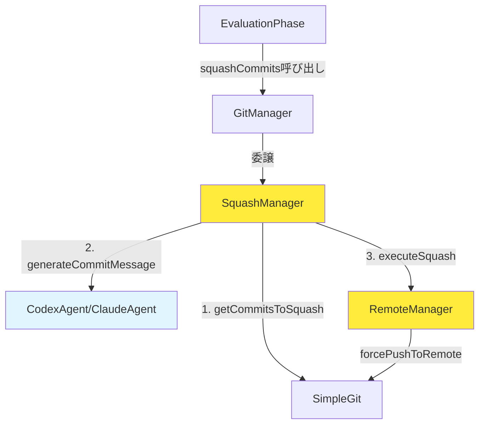
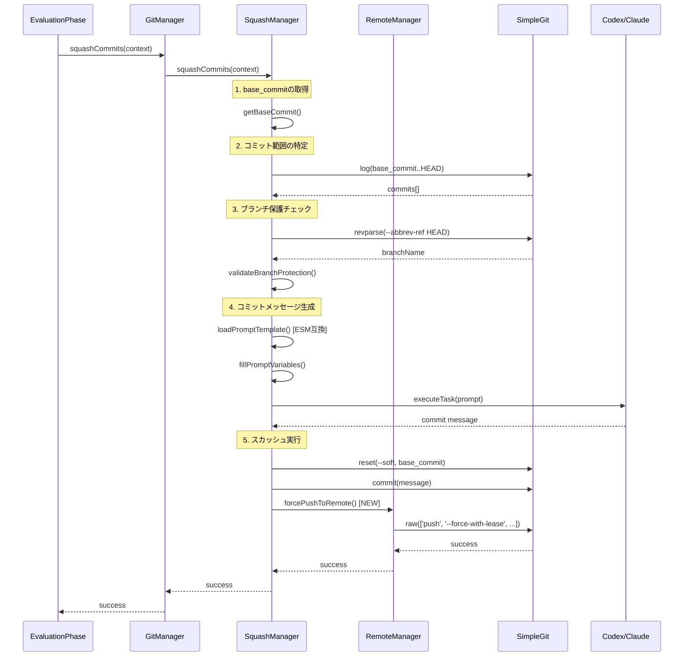

# 詳細設計書

## Issue情報

- **Issue番号**: #216
- **タイトル**: bug: --squash-on-complete が正常に動作しない（複数の問題）
- **状態**: open
- **URL**: https://github.com/tielec/ai-workflow-agent/issues/216

---

## 実装戦略: EXTEND

### 判断根拠

1. **既存コードの拡張が中心**:
   - `squash-manager.ts` の `loadPromptTemplate()` メソッドを修正（ESM互換のパス解決への変更）
   - `remote-manager.ts` に新しい `forcePushToRemote()` メソッドを追加
   - `squash-manager.ts` の `executeSquash()` メソッドを修正（新しいforce pushメソッドを呼び出す）
   - すべて既存ファイル内での修正・拡張で対応可能

2. **新規ファイル作成は不要**:
   - 既存の `squash-manager.ts` と `remote-manager.ts` の修正のみで対応可能
   - 新しいクラスやモジュールの追加は不要

3. **アーキテクチャ変更なし**:
   - ファサードパターン（GitManager → SquashManager、RemoteManager）は維持
   - 依存性注入パターンは維持
   - クラス構造、責務分担は変更なし
   - 既存の設計原則（SRP、依存性注入）に従った拡張のみ

---

## テスト戦略: UNIT_INTEGRATION

### 判断根拠

1. **ユニットテストが必要**:
   - `loadPromptTemplate()` メソッドのパス解決ロジックの検証
   - `forcePushToRemote()` メソッドの動作検証（`--force-with-lease` オプションの使用確認）
   - スカッシュ後のpush失敗時のエラーハンドリングロジックの検証
   - モック可能な単位テストで各メソッドの動作を確認

2. **インテグレーションテストが必要**:
   - 実際のGitリポジトリを使用したエンドツーエンドのスカッシュ＆プッシュ動作確認
   - `--force-with-lease` が正しく機能するかの実環境検証
   - Pull によってスカッシュが無効化されないかの実環境検証
   - Git操作の統合動作を実リポジトリで確認

3. **BDDテストは不要**:
   - エンドユーザー向け機能ではなく、内部的なGit操作のため
   - ユーザーストーリーベースのテストは不要
   - ユニットテスト + 統合テストで十分な品質保証が可能

---

## テストコード戦略: EXTEND_TEST

### 判断根拠

1. **既存テストファイルに追加**:
   - `tests/unit/squash-manager.test.ts` に新しいユニットテストケースを追加
   - `tests/integration/squash-workflow.test.ts` に新しい統合テストケースを追加
   - スカッシュ機能のテストファイルは既に存在する

2. **新規テストファイル作成は不要**:
   - RemoteManager のテストは既存の統合テストで対応可能
   - 新しいテストファイルを作成するほど独立した機能ではない
   - 既存テストのコンテキストを活用することで、テストコードの重複を削減

---

## アーキテクチャ設計

### システム全体図



### コンポーネント間の関係

#### 1. SquashManager（修正対象）

**責務**:
- スカッシュ対象コミット範囲の特定
- エージェントによるコミットメッセージ生成
- スカッシュ実行のオーケストレーション

**主要な修正**:
- `loadPromptTemplate()`: ESM互換のパス解決に変更
- `executeSquash()`: 新しい `forcePushToRemote()` メソッドを呼び出す

#### 2. RemoteManager（拡張対象）

**責務**:
- リモートへのpush操作（通常、force）
- pull操作
- GitHub認証設定

**主要な拡張**:
- 新規メソッド `forcePushToRemote()` を追加
- `pushToRemote()` のエラーハンドリングを改善（スカッシュ後のpullを防止）

#### 3. GitManager（変更なし）

**責務**:
- ファサードパターンによる各専門マネージャーの統合
- 既存のpublicメソッドの委譲

**変更**:
- なし（後方互換性を維持）

### データフロー



---

## 影響範囲分析

### 既存コードへの影響

#### 1. `src/core/git/squash-manager.ts`

**変更箇所**:
- **L1-L11（import文）**: `fileURLToPath` と `path` のインポート追加
- **L262（新規定数）**: `__filename` と `__dirname` の定義を追加
- **L264（loadPromptTemplate）**: パス解決ロジックを変更
- **L247（executeSquash）**: `pushToRemote()` を `forcePushToRemote()` に変更

**影響度**: 中
- パス解決の変更により、プロンプトファイルの読み込み方法が変わる
- force push メソッドの変更により、push の挙動が変わる

#### 2. `src/core/git/remote-manager.ts`

**変更箇所**:
- **L127（新規メソッド）**: `forcePushToRemote()` メソッドを追加
- **L40-L126（pushToRemote）**: エラーハンドリングの改善（スカッシュ後のpullを防止）

**影響度**: 中
- 新しいメソッド追加により、force push の責務を明確化
- 既存の `pushToRemote()` の動作は変更しない（後方互換性維持）

#### 3. `tests/unit/squash-manager.test.ts`

**変更箇所**:
- 新規テストケースの追加（`loadPromptTemplate()` のパス解決テスト）

**影響度**: 低
- 既存テストに影響なし

#### 4. `tests/integration/squash-workflow.test.ts`

**変更箇所**:
- 新規テストケースの追加（force push の統合テスト）

**影響度**: 低
- 既存テストに影響なし

### 依存関係の変更

**新規依存の追加**: なし
- `fileURLToPath` と `path` は Node.js 標準モジュール（既に使用中）

**既存依存の変更**: なし
- simple-git の使用方法は変更なし
- エージェントクライアントの使用方法は変更なし

### マイグレーション要否

**不要**

理由:
- データベーススキーマ変更なし
- 設定ファイル変更なし
- メタデータフォーマット変更なし
- 既存の `metadata.json` との互換性は維持される

---

## 変更・追加ファイルリスト

### 修正が必要な既存ファイル

1. **`src/core/git/squash-manager.ts`**
   - ESM互換のパス解決（`__dirname` → `import.meta.url` + `fileURLToPath`）
   - `executeSquash()` メソッドの修正（`forcePushToRemote()` 呼び出し）

2. **`src/core/git/remote-manager.ts`**
   - 新規メソッド `forcePushToRemote()` の追加
   - `pushToRemote()` のエラーハンドリング改善（将来的な拡張として検討）

3. **`tests/unit/squash-manager.test.ts`**
   - `loadPromptTemplate()` のテストケース追加

4. **`tests/integration/squash-workflow.test.ts`**
   - Force push の統合テストケース追加

### 新規作成ファイル

なし

### 削除が必要なファイル

なし

---

## 詳細設計

### 1. SquashManager の修正

#### 1.1. ESM互換のパス解決

**現在の実装** (`src/core/git/squash-manager.ts:262`):
```typescript
private async loadPromptTemplate(): Promise<string> {
  const templatePath = join(__dirname, '../../../prompts/squash/generate-message.txt');
  try {
    return await fs.readFile(templatePath, 'utf-8');
  } catch (error) {
    throw new Error(`Failed to load prompt template: ${getErrorMessage(error)}`);
  }
}
```

**修正後の実装**:
```typescript
// ファイル先頭（import文の追加）
import { fileURLToPath } from 'node:url';

// クラス定義の前（__dirname の定義）
const __filename = fileURLToPath(import.meta.url);
const __dirname = path.dirname(__filename);

// メソッドは変更なし（パス解決ロジックのみESM互換に）
private async loadPromptTemplate(): Promise<string> {
  const templatePath = join(__dirname, '../../../prompts/squash/generate-message.txt');
  try {
    return await fs.readFile(templatePath, 'utf-8');
  } catch (error) {
    throw new Error(`Failed to load prompt template: ${getErrorMessage(error)}`);
  }
}
```

**修正理由**:
- ESM環境では `__dirname` がグローバル変数として利用できない
- `import.meta.url` と `fileURLToPath` を使用することで、ESM互換のパス解決が可能
- 既存の実装パターン（`issue-agent-generator.ts`、`repository-analyzer.ts`）と統一

#### 1.2. executeSquash メソッドの修正

**現在の実装** (`src/core/git/squash-manager.ts:235-253`):
```typescript
private async executeSquash(baseCommit: string, message: string): Promise<void> {
  try {
    // 1. git reset --soft <base_commit>
    logger.info(`Resetting to ${baseCommit}...`);
    await this.git.reset(['--soft', baseCommit]);

    // 2. git commit -m "<message>"
    logger.info('Creating squashed commit...');
    await this.git.commit(message);

    // 3. git push --force-with-lease
    logger.info('Force pushing to remote...');
    await this.remoteManager.pushToRemote(3, 2000);

    logger.info('Squash and push completed successfully.');
  } catch (error) {
    throw new Error(`Failed to execute squash: ${getErrorMessage(error)}`);
  }
}
```

**修正後の実装**:
```typescript
private async executeSquash(baseCommit: string, message: string): Promise<void> {
  try {
    // 1. git reset --soft <base_commit>
    logger.info(`Resetting to ${baseCommit}...`);
    await this.git.reset(['--soft', baseCommit]);

    // 2. git commit -m "<message>"
    logger.info('Creating squashed commit...');
    await this.git.commit(message);

    // 3. git push --force-with-lease
    logger.info('Force pushing to remote...');
    await this.remoteManager.forcePushToRemote(); // 変更

    logger.info('Squash and push completed successfully.');
  } catch (error) {
    throw new Error(`Failed to execute squash: ${getErrorMessage(error)}`);
  }
}
```

**修正理由**:
- `pushToRemote()` は non-fast-forward エラー時に pull を実行する
- pull するとスカッシュ前の履歴が復元され、スカッシュの目的を達成できない
- `forcePushToRemote()` は pull を実行せず、`--force-with-lease` で安全に強制プッシュ

### 2. RemoteManager の拡張

#### 2.1. forcePushToRemote メソッドの追加

**新規メソッド**:
```typescript
/**
 * Force push to remote with --force-with-lease
 *
 * スカッシュ後の強制プッシュ専用メソッド。
 * non-fast-forward エラー時も pull を実行せず、明確なエラーメッセージを返す。
 *
 * @param maxRetries - 最大リトライ回数（デフォルト: 3）
 * @param retryDelay - リトライ間隔（ミリ秒、デフォルト: 2000）
 * @returns PushSummary
 * @throws Error - push失敗時
 */
public async forcePushToRemote(
  maxRetries = 3,
  retryDelay = 2000,
): Promise<PushSummary> {
  let retries = 0;
  const status = await this.git.status();
  const branchName =
    status.current ?? this.metadata.data.branch_name ?? null;

  logger.debug(`Force push to remote: branch=${branchName}, ahead=${status.ahead}, behind=${status.behind}`);

  if (!branchName) {
    throw new Error('Unable to determine current branch name');
  }

  while (retries <= maxRetries) {
    try {
      logger.debug(`Force pushing to origin/${branchName}...`);

      // --force-with-lease を使用
      const pushResult = await this.git.raw([
        'push',
        '--force-with-lease',
        'origin',
        branchName,
      ]);

      logger.debug(`Force push result: ${pushResult}`);
      logger.info('Force push completed successfully.');

      return { success: true, retries };
    } catch (error) {
      const errorMessage = getErrorMessage(error).toLowerCase();

      // non-fast-forward エラーの場合はエラー終了（pullしない）
      if (errorMessage.includes('rejected') || errorMessage.includes('non-fast-forward')) {
        logger.error(
          'Force push rejected. Remote branch has diverged. ' +
          'Please manually resolve the conflict:\n' +
          `  1. git fetch origin\n` +
          `  2. git rebase origin/${branchName}\n` +
          `  3. git push --force-with-lease`,
        );
        return {
          success: false,
          retries,
          error: 'Remote branch has diverged. Manual intervention required.',
        };
      }

      // リトライ可能エラーの場合
      if (!this.isRetriableError(error) || retries === maxRetries) {
        logger.error(`Force push failed permanently: ${getErrorMessage(error)}`);
        return {
          success: false,
          retries,
          error: getErrorMessage(error),
        };
      }

      logger.warn(`Retriable error, retrying (${retries + 1}/${maxRetries})...`);
      retries += 1;
      await delay(retryDelay);
    }
  }

  return { success: false, retries: maxRetries, error: 'Unknown force push failure' };
}
```

**設計ポイント**:
1. **`--force-with-lease` の使用**: 他の変更を上書きしない安全な強制プッシュ
2. **Pull の禁止**: non-fast-forward エラー時も pull を実行せず、明確なエラーメッセージを返す
3. **リトライロジック**: ネットワークエラー等のリトライ可能エラーには対応
4. **既存メソッドとの分離**: `pushToRemote()` とは独立した責務を持つ専用メソッド

#### 2.2. pushToRemote メソッドの改善（将来的な拡張として検討）

**現在の実装**の問題点:
- L94-108 で non-fast-forward エラー時に無条件で pull を実行
- スカッシュ後の push では pull が不適切（スカッシュが無効化される）

**改善案**（オプション、今回は実装しない）:
```typescript
// スカッシュ後のpushかどうかを判定するフラグを追加
public async pushToRemote(
  maxRetries = 3,
  retryDelay = 2000,
  options?: { allowPullOnReject?: boolean }, // デフォルト: true
): Promise<PushSummary> {
  // ...

  // non-fast-forward error の処理
  if ((errorMessage.includes('rejected') || errorMessage.includes('non-fast-forward')) && retries === 0) {
    if (options?.allowPullOnReject !== false) {
      // 通常のpush: pullを実行
      logger.warn('Push rejected (non-fast-forward). Pulling remote changes...');
      const pullResult = await this.pullLatest(branchName);
      // ...
    } else {
      // スカッシュ後のpush: pullを実行しない
      logger.error('Push rejected after squash. Manual intervention required.');
      return { success: false, retries, error: 'Manual intervention required.' };
    }
  }

  // ...
}
```

**判断**:
- 今回は `forcePushToRemote()` を追加することで対応
- `pushToRemote()` の変更は既存の通常push機能への影響が大きいため、別Issueで検討

### 3. クラス設計

#### 3.1. SquashManager

**変更後のクラス構造**:
```typescript
export class SquashManager {
  private readonly git: SimpleGit;
  private readonly metadataManager: MetadataManager;
  private readonly commitManager: CommitManager;
  private readonly remoteManager: RemoteManager;
  private readonly codexAgent: CodexAgentClient | null;
  private readonly claudeAgent: ClaudeAgentClient | null;
  private readonly workingDir: string;

  // 既存メソッド（変更なし）
  public async squashCommits(context: PhaseContext): Promise<void>;
  private async getCommitsToSquash(baseCommit: string): Promise<string[]>;
  private async validateBranchProtection(): Promise<void>;
  private async generateCommitMessage(context: PhaseContext): Promise<string>;
  private async fillPromptVariables(template: string, context: PhaseContext): Promise<string>;
  private isValidCommitMessage(message: string): boolean;
  private generateFallbackMessage(context: PhaseContext): string;

  // 修正メソッド
  private async loadPromptTemplate(): Promise<string>; // ESM互換に変更
  private async executeSquash(baseCommit: string, message: string): Promise<void>; // forcePushToRemote呼び出しに変更
}
```

#### 3.2. RemoteManager

**変更後のクラス構造**:
```typescript
export class RemoteManager {
  private readonly git: SimpleGit;
  private readonly metadata: MetadataManager;

  // 既存メソッド（変更なし）
  public async pushToRemote(maxRetries = 3, retryDelay = 2000): Promise<PushSummary>;
  public async pullLatest(branchName?: string): Promise<{ success: boolean; error?: string | null }>;
  private async getCurrentBranch(): Promise<string>;
  private isRetriableError(error: unknown): boolean;
  private async setupGithubCredentials(): Promise<void>;

  // 新規メソッド
  public async forcePushToRemote(maxRetries = 3, retryDelay = 2000): Promise<PushSummary>; // 追加
}
```

### 4. インターフェース設計

**PushSummary インターフェース**（既存、変更なし）:
```typescript
interface PushSummary {
  success: boolean;
  retries: number;
  error?: string;
}
```

**forcePushToRemote メソッドのシグネチャ**:
```typescript
public async forcePushToRemote(
  maxRetries?: number,  // デフォルト: 3
  retryDelay?: number,  // デフォルト: 2000
): Promise<PushSummary>
```

### 5. データ構造設計

**変更なし**

理由:
- メタデータ（`metadata.json`）の構造は変更なし
- `pre_squash_commits`、`squashed_at` 等の既存フィールドは維持
- 新しいデータ構造の追加は不要

---

## セキュリティ考慮事項

### 1. 認証・認可

**変更なし**

理由:
- GitHub認証は既存の `setupGithubCredentials()` で処理
- `GITHUB_TOKEN` の取り扱いは既存実装を踏襲
- 新しい認証要件は発生しない

### 2. データ保護

**force push によるデータ損失の防止**:
1. **`--force-with-lease` の使用**:
   - 他の変更を上書きしないことを保証
   - リモートブランチが先に進んでいる場合は push が rejected される

2. **ブランチ保護チェック**:
   - main/master ブランチへの force push を禁止（既存実装を維持）
   - `validateBranchProtection()` メソッドで検証

3. **ロールバック可能性**:
   - スカッシュ前のコミットハッシュを `pre_squash_commits` メタデータに記録
   - 必要に応じて元の履歴に戻すことが可能

### 3. セキュリティリスクと対策

**リスク1: パストラバーサル攻撃**
- **影響度**: 低
- **対策**:
  - プロンプトテンプレートのパスは固定（`../../../prompts/squash/generate-message.txt`）
  - ユーザー入力によるパス変更は不可

**リスク2: コマンドインジェクション**
- **影響度**: 低
- **対策**:
  - simple-git ライブラリを使用（コマンドは適切にエスケープされる）
  - ブランチ名は Git コマンドから取得（ユーザー入力ではない）

---

## 非機能要件への対応

### 1. パフォーマンス

**目標**:
- プロンプトテンプレート読み込み時間: 100ms 以内（現在と同等）

**対策**:
- `import.meta.url` + `fileURLToPath` によるパス解決は `__dirname` と同等のパフォーマンス
- ファイルI/Oは既存実装と変更なし

**測定方法**:
- ユニットテストで `loadPromptTemplate()` の実行時間を計測

### 2. スケーラビリティ

**影響なし**

理由:
- スカッシュ処理は Issue 単位で実行（並列実行なし）
- リモートpush 操作は1回のみ
- スケーラビリティへの影響はない

### 3. 保守性

**目標**:
- ESM互換のパス解決が、プロジェクト全体で統一されたパターンに従うこと

**対策**:
- `issue-agent-generator.ts`、`repository-analyzer.ts` と同じパターンを使用
- プロジェクト全体のコードレビューで整合性を確認

**メトリクス**:
- ESM互換パターンの使用率: 100%（全ESMファイル）
- コードレビューでの承認

---

## 実装の順序

### フェーズ1: ESM互換のパス解決（優先度: 高）

**実装順序**:
1. `src/core/git/squash-manager.ts` のimport文修正
   - `fileURLToPath` のインポート追加
   - `__filename`、`__dirname` の定義追加

2. `loadPromptTemplate()` メソッドの動作確認
   - 既存のパス解決ロジックは変更なし
   - ESM環境での動作を確認

3. ユニットテスト追加
   - `tests/unit/squash-manager.test.ts` に新規テストケース追加
   - プロンプトファイルが正しく読み込まれることを確認

**依存関係**:
- なし（独立して実装可能）

### フェーズ2: Force push メソッドの追加（優先度: 高）

**実装順序**:
1. `src/core/git/remote-manager.ts` に `forcePushToRemote()` メソッドを追加
   - `--force-with-lease` オプションの使用
   - non-fast-forward エラー時の処理（pullを実行しない）
   - エラーハンドリング（認証エラー、ネットワークエラー等）

2. `executeSquash()` メソッドの修正
   - `pushToRemote()` を `forcePushToRemote()` に変更
   - コメント更新（`// 3. git push --force-with-lease`）

3. 統合テスト追加
   - `tests/integration/squash-workflow.test.ts` に新規テストケース追加
   - Force push の成功シナリオ
   - `--force-with-lease` が他の変更を上書きしないことを確認

**依存関係**:
- フェーズ1完了後に実施（プロンプト読み込みが正常に動作する必要がある）

### フェーズ3: テスト実行と品質確認（優先度: 高）

**実装順序**:
1. ユニットテスト実行
   - `npm run test:unit` を実行
   - 失敗したテストケースの修正

2. 統合テスト実行
   - `npm run test:integration` を実行
   - 失敗したテストケースの修正

3. リグレッションテスト
   - 既存のユニットテスト・統合テストがすべて成功することを確認
   - 通常の push 機能（`pushToRemote()`）が正常に動作することを確認

**依存関係**:
- フェーズ1、フェーズ2完了後に実施

### フェーズ4: ドキュメント更新（優先度: 中）

**実装順序**:
1. `CLAUDE.md` の更新
   - `--squash-on-complete` オプションの動作説明を更新
   - スカッシュ後の force push 動作を明記
   - エラーハンドリングの改善を記載

2. コード内コメントの更新
   - `squash-manager.ts` の JSDoc コメント更新
   - `remote-manager.ts` の JSDoc コメント更新

**依存関係**:
- フェーズ1、フェーズ2完了後に実施

---

## 重要な設計判断

### 1. Force Push の実装方針

**判断**: `RemoteManager` に新しい `forcePushToRemote()` メソッドを追加し、`pushToRemote()` とは分離する。

**理由**:
1. **単一責任原則（SRP）**:
   - 通常の push と force push は異なる責務を持つ
   - force push は破壊的操作であり、慎重な取り扱いが必要

2. **誤用リスクの低減**:
   - 既存の `pushToRemote()` に force オプションを追加すると、誤って force push が実行されるリスクが高まる
   - 専用メソッドにすることで、force push の意図を明確化

3. **後方互換性の維持**:
   - 既存の `pushToRemote()` メソッドは変更せず、新しいメソッドを追加
   - 既存コードへの影響を最小化

**代替案と却下理由**:
- **代替案1**: `pushToRemote()` に `force: boolean` オプションを追加
  - **却下理由**: 誤用リスクが高い、既存コードへの影響が大きい

- **代替案2**: `pushToRemote()` の内部で自動的に force push を判定
  - **却下理由**: メソッドの責務が不明確になる、テストが困難

### 2. Pull 後の Push でスカッシュが無効化される問題への対処

**判断**: スカッシュ後の push 失敗時は pull を実行せず、エラー終了する。

**理由**:
1. **スカッシュの目的を達成**:
   - Pull すると、スカッシュ前の履歴が復元されてしまう
   - Force push が必要な状況では、pull は適切な対処法ではない

2. **安全性の確保**:
   - `--force-with-lease` により、他の変更を上書きしないことを保証
   - リモートブランチが先に進んでいる場合は、手動での対処を促す

3. **明確なエラーメッセージ**:
   - ユーザーに手動での対処方法を具体的に提示
   - Git コマンドのチートシートを提供

**代替案と却下理由**:
- **代替案1**: 自動的に pull → rebase → force push を実行
  - **却下理由**: 自動マージの失敗リスクが高い、ユーザーの意図を尊重すべき

- **代替案2**: `pushToRemote()` を修正して、スカッシュ後の pull を防止
  - **却下理由**: 既存の通常push機能への影響が大きい、別Issueで検討すべき

### 3. ESM 互換パターンの統一

**判断**: プロジェクト全体で統一された `import.meta.url` + `fileURLToPath` パターンを使用する。

**理由**:
1. **一貫性の確保**:
   - 既存の実装（`issue-agent-generator.ts`、`repository-analyzer.ts` 等）で同じパターンが使用されている
   - コードベース全体での統一性を維持

2. **ESM の標準的な方法**:
   - Node.js の公式ドキュメントで推奨されているパターン
   - 将来的にも安全

3. **保守性の向上**:
   - 統一されたパターンにより、コードの理解と変更が容易
   - プロジェクト全体でのコードレビューが効率的

**代替案と却下理由**:
- **代替案1**: `__dirname` を使い続ける（CommonJSパターン）
  - **却下理由**: ESM環境で動作しない、将来的な互換性の問題

- **代替案2**: 絶対パスを直接指定
  - **却下理由**: ビルド後のディレクトリ構造に依存、柔軟性が低い

---

## 品質ゲート（Phase 2）

以下の品質ゲートを満たしています：

- [x] **実装戦略の判断根拠が明記されている**（EXTEND）
- [x] **テスト戦略の判断根拠が明記されている**（UNIT_INTEGRATION）
- [x] **テストコード戦略の判断根拠が明記されている**（EXTEND_TEST）
- [x] **既存コードへの影響範囲が分析されている**（4ファイル、影響度: 中〜低）
- [x] **変更が必要なファイルがリストアップされている**（修正4ファイル、新規0ファイル、削除0ファイル）
- [x] **設計が実装可能である**（具体的なコード例、シーケンス図、実装順序を記載）

---

## 追加情報

### 関連Issue

- **Issue #194**: スカッシュコミット機能の実装（本Issueの前提）
- **Issue #54**: Git URLのセキュリティ対策（トークン除去）

### 参考ファイル

- **`src/core/github/issue-agent-generator.ts`**: ESM 互換の `__dirname` パターン
- **`src/core/repository-analyzer.ts`**: ESM 互換の `__dirname` パターン
- **`src/core/git/remote-manager.ts`**: 既存の push ロジック
- **`src/core/git/squash-manager.ts`**: スカッシュロジック

### 参考ドキュメント

- **Node.js ESM Documentation**: https://nodejs.org/api/esm.html
- **simple-git Documentation**: https://github.com/steveukx/git-js
- **Git `--force-with-lease` Documentation**: https://git-scm.com/docs/git-push#Documentation/git-push.txt---force-with-leaseltrefnamegt

---

## 変更履歴

| 日付 | バージョン | 変更内容 | 担当者 |
|------|-----------|---------|--------|
| 2025-01-30 | 1.0 | 初版作成 | AI Workflow Agent |
