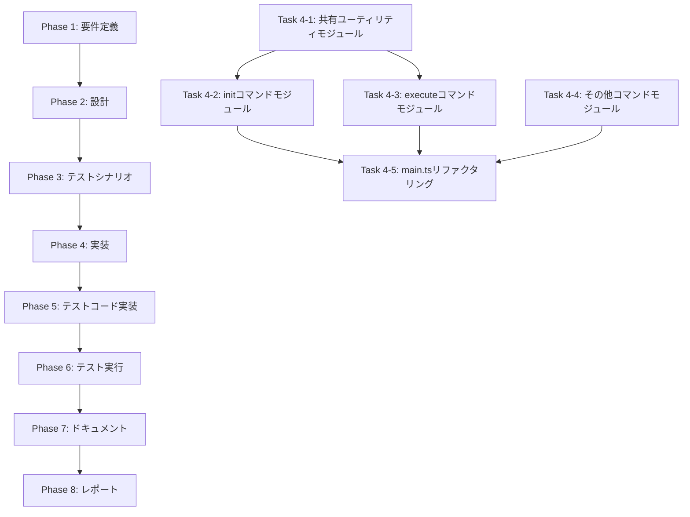

# プロジェクト計画書 - Issue #22

**Issue番号**: #22
**タイトル**: [REFACTOR] CLI コマンド処理の分離 (main.ts リファクタリング)
**作成日**: 2025-01-20
**ステータス**: Planning Phase

---

## 1. Issue分析

### 複雑度
**中程度**

### 判定根拠
- **ファイル数**: `main.ts` (1310行) から3つの新規モジュールへ分離（複数ファイルの作成）
- **影響範囲**: エントリーポイントのリファクタリングであり、全コマンド（init/execute/review/list-presets）に影響
- **破壊的変更リスク**: 既存の動作を完全に維持する必要があり、統合テストで検証必須
- **テスト要件**: 既存のユニットテスト18件（main-preset-resolution.test.ts等）および統合テスト18件の互換性維持が必要
- **設計要件**: SOLID原則の適用（単一責任原則）、依存関係の明確化

### 見積もり工数
**14~18時間**

### 根拠
- Phase 1 (要件定義): 2~3時間 - Issue要件の詳細分析、テストケース確認
- Phase 2 (設計): 3~4時間 - モジュール分割設計、インターフェース設計、依存関係設計
- Phase 3 (テストシナリオ): 2~3時間 - 既存テストの移行計画、新規テストシナリオ策定
- Phase 4 (実装): 4~5時間 - 3つのコマンドモジュール作成、main.tsリファクタリング
- Phase 5 (テストコード実装): 1~2時間 - テストファイルのimport修正、追加テスト作成
- Phase 6 (テスト実行): 1時間 - 既存テスト全件実行、リグレッション確認
- Phase 7 (ドキュメント): 0.5~1時間 - ARCHITECTURE.md、CLAUDE.md更新
- Phase 8 (レポート): 0.5時間 - PR本文生成、変更サマリー作成

### リスク評価
**中**

### リスク要因
1. **破壊的変更の可能性**: 既存のテストが失敗する可能性（影響度: 高、確率: 中）
2. **循環依存の発生**: コマンドモジュール間で依存が発生する可能性（影響度: 中、確率: 低）
3. **型定義の不整合**: 共有型の切り出しで型エラーが発生する可能性（影響度: 中、確率: 中）
4. **Git操作の影響**: 大規模なファイル移動によるGit履歴の追跡性低下（影響度: 低、確率: 高）

---

## 2. 実装戦略判断

### 実装戦略: REFACTOR

#### 判断根拠
- **既存コード改善が中心**: `main.ts` (1310行) から責務を分離し、200行以下に削減
- **機能追加なし**: 新規機能の追加はなく、既存の4つのコマンド（init/execute/review/list-presets）を分離
- **構造改善**: SOLID原則（単一責任原則）の適用が主目的
- **破壊的変更禁止**: 既存の動作を完全に維持（後方互換性100%）

### テスト戦略: UNIT_INTEGRATION

#### 判断根拠
- **ユニットテスト**: モジュール分割後の各コマンドハンドラは独立してテスト可能
  - `tests/unit/commands/init.test.ts` - 初期化ロジックの単体テスト
  - `tests/unit/commands/execute.test.ts` - 実行ロジックの単体テスト
  - `tests/unit/commands/list-presets.test.ts` - プリセット一覧表示の単体テスト
- **統合テスト**: 既存の統合テスト（18件）を再利用し、CLI全体の動作を検証
  - `tests/integration/workflow-init-cleanup.test.ts` - ワークフロー初期化とクリーンアップ（3.1.1, 3.1.2）
  - `tests/integration/custom-branch-workflow.test.ts` - カスタムブランチ名のワークフロー
  - `tests/integration/multi-repo-workflow.test.ts` - マルチリポジトリワークフロー
  - `tests/integration/preset-execution.test.ts` - プリセット実行の統合テスト
- **BDD不要の理由**: エンドユーザー向けの機能追加ではなく、内部リファクタリングのため

### テストコード戦略: BOTH_TEST

#### 判断根拠
- **EXTEND_TEST**: 既存のユニットテスト（`tests/unit/main-preset-resolution.test.ts`等）のimport文を修正
  - 既存テスト: 220行（main.tsのプライベート関数をテスト用に再現）
  - 対応方針: モジュール分離後は正式なexportされた関数をテストするよう変更
- **CREATE_TEST**: 新規コマンドモジュールのユニットテストを作成
  - `tests/unit/commands/init.test.ts` - 初期化コマンドのロジックテスト
  - `tests/unit/commands/execute.test.ts` - 実行コマンドのロジックテスト（エージェント選択、プリセット解決等）
  - `tests/unit/commands/list-presets.test.ts` - プリセット一覧表示のロジックテスト
- **BOTH適用の理由**:
  - 既存テストは互換性維持のために拡張が必要
  - 新規モジュールは独立したテストカバレッジが必要

---

## 3. 影響範囲分析

### 既存コードへの影響

#### 変更が必要なファイル
1. **src/main.ts** (1310行 → 200行以下に削減)
   - コマンドルーターとしての役割のみ残す
   - `handleInitCommand`, `handleExecuteCommand`, `handleReviewCommand`, `listPresets` を削除
   - ヘルパー関数（`parseIssueUrl`, `resolveLocalRepoPath`, `findWorkflowMetadata`, `validateBranchName`, `resolveBranchName`等）を適切なモジュールへ移動

2. **tests/unit/main-preset-resolution.test.ts** (220行)
   - import文の修正: `resolvePresetName` を `src/commands/execute.ts` からimport
   - テストロジックの修正: 再現コードを削除し、正式なexportされた関数を使用

3. **tests/integration/workflow-init-cleanup.test.ts**
   - import文の修正: 必要に応じて `src/commands/init.ts` からimport
   - テストケース自体は変更不要（動作の互換性維持）

4. **tests/unit/repository-resolution.test.ts**
   - import文の修正: `parseIssueUrl`, `resolveLocalRepoPath`, `findWorkflowMetadata` を適切なモジュールからimport

5. **tests/unit/branch-validation.test.ts**
   - import文の修正: `validateBranchName`, `resolveBranchName` を `src/commands/init.ts` からimport

#### 新規作成ファイル
1. **src/commands/init.ts** (約250~300行)
   - `handleInitCommand` の実装
   - `validateBranchName`, `resolveBranchName` の移動
   - `parseIssueUrl`, `resolveLocalRepoPath`, `findWorkflowMetadata` の移動（または共有モジュールへ）

2. **src/commands/execute.ts** (約450~500行)
   - `handleExecuteCommand` の実装
   - `executePhasesSequential`, `executePhasesFrom`, `createPhaseInstance` の移動
   - `resolvePresetName`, `getPresetPhases`, `canResumeWorkflow` の移動

3. **src/commands/list-presets.ts** (約50~80行)
   - `listPresets` の実装（現在は関数、独立したモジュールへ）

4. **src/commands/review.ts** (約50行)
   - `handleReviewCommand` の実装

5. **src/core/repository-utils.ts** (約200行) - オプション
   - `parseIssueUrl`, `resolveLocalRepoPath`, `findWorkflowMetadata` の共通化
   - 複数コマンドで使用される可能性があるため、共有モジュールとして分離

6. **src/types/commands.ts** (約100行) - オプション
   - `PhaseContext`, `ExecutionSummary`, `PhaseResultMap`, `IssueInfo`, `BranchValidationResult` 等の型定義を分離

7. **tests/unit/commands/init.test.ts** (約150~200行)
   - 初期化コマンドのユニットテスト
   - ブランチ名バリデーション、Issue URL解析、リポジトリ解決のテスト

8. **tests/unit/commands/execute.test.ts** (約200~250行)
   - 実行コマンドのユニットテスト
   - エージェントモード選択、プリセット解決、フェーズ実行順序のテスト

9. **tests/unit/commands/list-presets.test.ts** (約50~80行)
   - プリセット一覧表示のユニットテスト

### 依存関係の変更

#### 新規依存の追加
- **なし** - 既存の依存関係（commander, fs-extra, simple-git等）のみ使用

#### 既存依存の変更
- **なし** - 依存ライブラリのバージョン変更は不要

### マイグレーション要否

#### データベーススキーマ変更
- **なし**

#### 設定ファイル変更
- **なし** - package.json, tsconfig.jsonの変更不要
- **ビルドスクリプト**: 既存のビルドスクリプト（`npm run build`）で自動的に新規ファイルをコンパイル

#### 環境変数変更
- **なし** - 既存の環境変数（GITHUB_TOKEN, CODEX_API_KEY等）をそのまま使用

---

## 4. タスク分割

### Phase 1: 要件定義 (見積もり: 2~3h)

- [x] Task 1-1: Issue要件の詳細分析 (1h)
  - Issue #22の要件を確認（main.ts を200行以下に削減、コマンドごとの責務明確化）
  - 親Issue #1との関連性確認
  - テストカバレッジ維持要件の確認
- [x] Task 1-2: 既存テストケースの棚卸し (1~2h)
  - ユニットテスト18件の内容確認（main-preset-resolution.test.ts, branch-validation.test.ts, repository-resolution.test.ts等）
  - 統合テスト18件の内容確認（workflow-init-cleanup.test.ts, custom-branch-workflow.test.ts, multi-repo-workflow.test.ts等）
  - テスト依存関係の洗い出し

### Phase 2: 設計 (見積もり: 3~4h)

- [x] Task 2-1: モジュール分割設計 (1.5~2h)
  - コマンドモジュール構成の決定（init.ts, execute.ts, review.ts, list-presets.ts）
  - 共有ユーティリティモジュール設計（repository-utils.ts, types/commands.ts）
  - main.tsに残すロジックの範囲決定（commander定義、ルーティング、エラーハンドリング）
- [x] Task 2-2: インターフェース設計 (0.5~1h)
  - 各コマンドハンドラのシグネチャ定義
  - 共有型定義の抽出（PhaseContext, ExecutionSummary, IssueInfo等）
- [x] Task 2-3: 依存関係設計 (1h)
  - モジュール間の依存関係図作成
  - 循環依存の回避戦略（共有ユーティリティモジュールの活用）
  - import/export構成の決定

### Phase 3: テストシナリオ (見積もり: 2~3h)

- [x] Task 3-1: 既存テストの移行計画 (1~1.5h)
  - main-preset-resolution.test.ts の移行方針（src/commands/execute.tsへ）
  - branch-validation.test.ts の移行方針（src/commands/init.tsへ）
  - repository-resolution.test.ts の移行方針（src/core/repository-utils.tsへ）
- [x] Task 3-2: 新規ユニットテストシナリオ策定 (0.5~1h)
  - tests/unit/commands/init.test.ts のテストケース設計
  - tests/unit/commands/execute.test.ts のテストケース設計
  - tests/unit/commands/list-presets.test.ts のテストケース設計
- [x] Task 3-3: 統合テストの互換性確認 (0.5h)
  - 既存の統合テスト18件が引き続き動作することを確認
  - 必要に応じてimport文の修正計画を立案

### Phase 4: 実装 (見積もり: 4~5h)

- [x] Task 4-1: 共有ユーティリティモジュール作成 (1h)
  - src/core/repository-utils.ts 作成（parseIssueUrl, resolveLocalRepoPath, findWorkflowMetadata）
  - src/types/commands.ts 作成（PhaseContext, ExecutionSummary, IssueInfo等の型定義）
- [x] Task 4-2: initコマンドモジュール作成 (1h)
  - src/commands/init.ts 作成
  - handleInitCommand, validateBranchName, resolveBranchName の実装
- [x] Task 4-3: executeコマンドモジュール作成 (1.5~2h)
  - src/commands/execute.ts 作成
  - handleExecuteCommand, executePhasesSequential, createPhaseInstance, resolvePresetName等の実装
- [x] Task 4-4: その他コマンドモジュール作成 (0.5h)
  - src/commands/review.ts 作成（handleReviewCommand）
  - src/commands/list-presets.ts 作成（listPresets）
- [x] Task 4-5: main.tsリファクタリング (1h)
  - コマンドルーターとしての再構成（commander定義のみ残す）
  - 各コマンドハンドラを新規モジュールからimport
  - 行数を200行以下に削減

### Phase 5: テストコード実装 (見積もり: 1~2h)

- [x] Task 5-1: 既存テストのimport修正 (0.5h)
  - tests/unit/main-preset-resolution.test.ts のimport修正
  - tests/unit/branch-validation.test.ts のimport修正
  - tests/unit/repository-resolution.test.ts のimport修正
- [x] Task 5-2: 新規ユニットテスト作成 (0.5~1h)
  - tests/unit/commands/init.test.ts 作成
  - tests/unit/commands/execute.test.ts 作成
  - tests/unit/commands/list-presets.test.ts 作成

### Phase 6: テスト実行 (見積もり: 1h)

- [x] Task 6-1: ユニットテスト全件実行 (0.5h)
  - `npm run test:unit` 実行
  - 既存テスト（18件）+ 新規テスト（3件）の成功確認
- [x] Task 6-2: 統合テスト全件実行 (0.5h)
  - `npm run test:integration` 実行
  - 既存の統合テスト18件の成功確認（リグレッションがないこと）

### Phase 7: ドキュメント (見積もり: 0.5~1h)

- [x] Task 7-1: ARCHITECTURE.md更新 (0.25~0.5h)
  - モジュール一覧の更新（src/commands/* を追加）
  - CLI エントリーポイントの説明更新
- [x] Task 7-2: CLAUDE.md更新 (0.25~0.5h)
  - アーキテクチャ概要の更新
  - コマンドハンドラの説明追加

### Phase 8: レポート (見積もり: 0.5h)

- [ ] Task 8-1: PR本文生成 (0.25h)
  - 変更サマリーの作成
  - テスト結果の記載
- [ ] Task 8-2: 最終検証 (0.25h)
  - main.tsが200行以下であることを確認
  - 全テストがパスすることを確認

---

## 5. 依存関係



**重要な依存関係**:
- **Phase 2 → Phase 4**: 設計が完了しないと実装に着手できない（モジュール構成、インターフェース設計が必須）
- **Phase 4 → Phase 5**: 実装が完了しないとテストコードを作成できない（テスト対象が存在しない）
- **Phase 5 → Phase 6**: テストコードが完了しないとテスト実行できない
- **Task 4-1 → Task 4-2, 4-3**: 共有ユーティリティモジュールが完成しないと各コマンドモジュールで依存解決できない

---

## 6. リスクと軽減策

### リスク1: 既存テストの互換性喪失
- **影響度**: 高
- **確率**: 中
- **軽減策**:
  1. Phase 3でテスト移行計画を詳細に策定
  2. Phase 5で既存テストのimport修正を最優先で実施
  3. Phase 6で既存テスト18件 + 統合テスト18件を全件実行し、リグレッションがないことを確認
  4. 失敗した場合はロールバック可能なようにGitブランチで管理

### リスク2: 循環依存の発生
- **影響度**: 中
- **確率**: 低
- **軽減策**:
  1. Phase 2で依存関係図を作成し、循環依存を事前検出
  2. 共有ユーティリティモジュール（repository-utils.ts, types/commands.ts）を独立したモジュールとして設計
  3. コマンドモジュール間では直接importせず、必ず共有モジュールを経由する設計
  4. TypeScriptコンパイラの循環依存警告を有効化（tsconfig.json）

### リスク3: 型定義の不整合
- **影響度**: 中
- **確率**: 中
- **軽減策**:
  1. Phase 4-1で共有型定義を最優先で作成（types/commands.ts）
  2. TypeScript strict mode（tsconfig.json）を活用して型エラーをビルド時に検出
  3. Phase 6でビルドエラーがないことを確認（`npm run build`）
  4. 型定義の重複を避けるため、single source of truth原則を徹底

### リスク4: main.tsの行数削減目標未達成
- **影響度**: 中
- **確率**: 低
- **軽減策**:
  1. Phase 2で各モジュールに移動するロジックを明確に洗い出し
  2. Phase 4-5でmain.tsに残すロジックを最小限に制限（commander定義、ルーティング、エラーハンドリングのみ）
  3. Phase 8で最終検証を実施し、200行以下であることを確認
  4. 200行を超える場合はさらにヘルパー関数を抽出

### リスク5: Git履歴の追跡性低下
- **影響度**: 低
- **確率**: 高
- **軽減策**:
  1. Git mv コマンドを使用せず、新規ファイル作成 + 元ファイル削除の方式で実装
  2. コミットメッセージに「Refactor: Extract XXX from main.ts」と明記
  3. Phase 8のPR本文で変更内容を詳細に説明

---

## 7. 品質ゲート

### Phase 1: 要件定義
- [ ] Issue要件が明確に記載されている（main.ts を200行以下、コマンドごとの責務明確化、テストカバレッジ維持）
- [ ] 既存テストケース（36件）の棚卸しが完了している
- [ ] テスト互換性維持の要件が明確になっている

### Phase 2: 設計
- [ ] 実装戦略（REFACTOR）の判断根拠が明記されている
- [ ] テスト戦略（UNIT_INTEGRATION）の判断根拠が明記されている
- [ ] テストコード戦略（BOTH_TEST）の判断根拠が明記されている
- [ ] モジュール分割設計が完了している（src/commands/*, src/core/repository-utils.ts, src/types/commands.ts）
- [ ] インターフェース設計が完了している（各コマンドハンドラのシグネチャ、共有型定義）
- [ ] 依存関係図が作成されている（循環依存がないこと）

### Phase 3: テストシナリオ
- [ ] 既存テストの移行計画が策定されている（main-preset-resolution.test.ts, branch-validation.test.ts, repository-resolution.test.ts）
- [ ] 新規ユニットテストシナリオが策定されている（tests/unit/commands/*.test.ts）
- [ ] 統合テストの互換性確認が完了している

### Phase 4: 実装
- [ ] 共有ユーティリティモジュールが作成されている（repository-utils.ts, types/commands.ts）
- [ ] 4つのコマンドモジュールが作成されている（init.ts, execute.ts, review.ts, list-presets.ts）
- [ ] main.tsがリファクタリングされ、200行以下になっている
- [ ] TypeScriptコンパイルエラーがない（`npm run build` 成功）

### Phase 5: テストコード実装
- [ ] 既存テストのimport修正が完了している（3ファイル）
- [ ] 新規ユニットテストが作成されている（3ファイル）

### Phase 6: テスト実行
- [ ] ユニットテスト全件（21件）がパスしている
- [ ] 統合テスト全件（18件）がパスしている
- [ ] カバレッジが低下していない（`npm run test:coverage`）

### Phase 7: ドキュメント
- [x] ARCHITECTURE.mdが更新されている（モジュール一覧、CLIエントリーポイント）
- [x] CLAUDE.mdが更新されている（アーキテクチャ概要、コマンドハンドラ説明）

### Phase 8: レポート
- [ ] PR本文が作成されている（変更サマリー、テスト結果）
- [ ] main.tsが200行以下であることが確認されている
- [ ] 全テストがパスしていることが確認されている

---

## 8. 成功基準（Done Criteria）

### 必須要件
1. ✅ **main.tsが200行以下に削減されている**
   - 測定方法: `wc -l src/main.ts` で行数を確認
   - 合格基準: 200行以下

2. ✅ **既存のユニットテストが全てパスしている**
   - 測定方法: `npm run test:unit` の実行結果
   - 合格基準: 18件 + 新規3件 = 21件すべて成功

3. ✅ **既存の統合テストが全てパスしている**
   - 測定方法: `npm run test:integration` の実行結果
   - 合格基準: 18件すべて成功（リグレッションなし）

4. ✅ **TypeScriptビルドが成功している**
   - 測定方法: `npm run build` の実行結果
   - 合格基準: エラーなしでビルド完了

5. ✅ **テストカバレッジが低下していない**
   - 測定方法: `npm run test:coverage` の実行結果
   - 合格基準: 現行カバレッジ（不明）と同等以上

### 推奨要件
1. 📋 **各コマンドモジュールが独立してテスト可能である**
   - 測定方法: 新規ユニットテスト（tests/unit/commands/*.test.ts）の実行
   - 合格基準: 各モジュールのテストが他モジュールに依存せず実行可能

2. 📋 **循環依存が存在しない**
   - 測定方法: madge等のツールでimport依存関係を確認
   - 合格基準: 循環依存が0件

3. 📋 **SOLID原則（単一責任原則）が適用されている**
   - 測定方法: コードレビューで各モジュールの責務を確認
   - 合格基準: 各モジュールが単一の責務（1つのコマンド処理）のみを持つ

---

## 9. 補足情報

### 参考Issue
- **親Issue #1**: リファクタリングの全体計画
- **関連Issue**: 特になし

### 優先度
**高** - エントリーポイントの整理により、他のリファクタリング（Phase管理、メタデータ管理等）の影響範囲が明確化されます。

### 備考
- リファクタリングは破壊的変更を含まないため、フィーチャーフラグは不要
- main.tsの行数削減は、コード可読性とメンテナンス性向上の両方に寄与
- SOLID原則の適用により、将来的な機能追加が容易になる（例: 新規コマンドの追加）

---

## 10. チェックリスト標準フォーマット確認

本計画書では、以下のチェックリスト標準フォーマットを遵守しています：

```markdown
- [ ] Task X-Y: [タスク名] (見積もり時間)
  - サブタスク1
  - サブタスク2
```

**確認項目**:
- ✅ 各Phaseにチェックリスト形式のタスクが記載されている
- ✅ 各タスクに見積もり時間が明記されている
- ✅ 各タスクが検証可能な内容になっている（例: 「〜が作成されている」「〜がパスしている」）
- ✅ タスク粒度が1~4時間程度である

このチェックリストは、Review Phase（Phase 0のレビュー）で完了判定に使用されます。

---

**計画書作成日**: 2025-01-20
**作成者**: AI Workflow Agent
**バージョン**: 1.0
