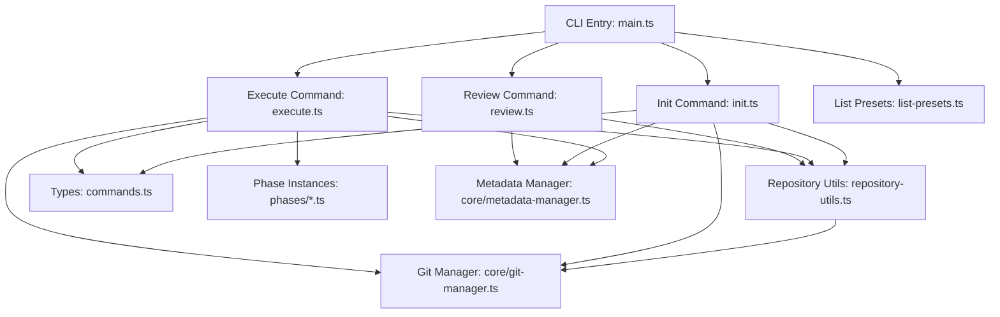
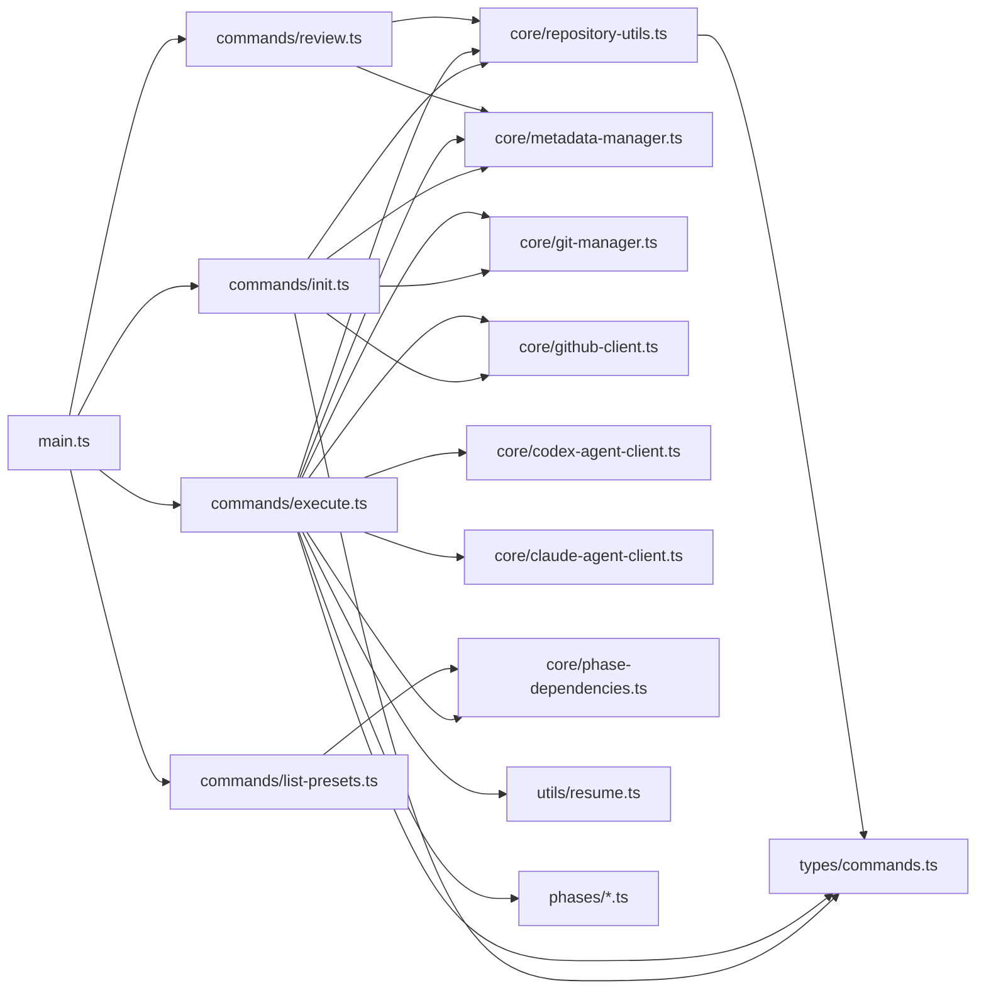
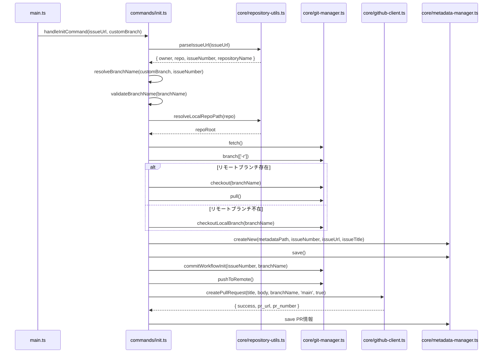
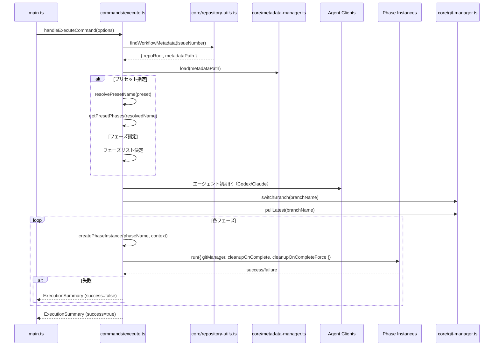
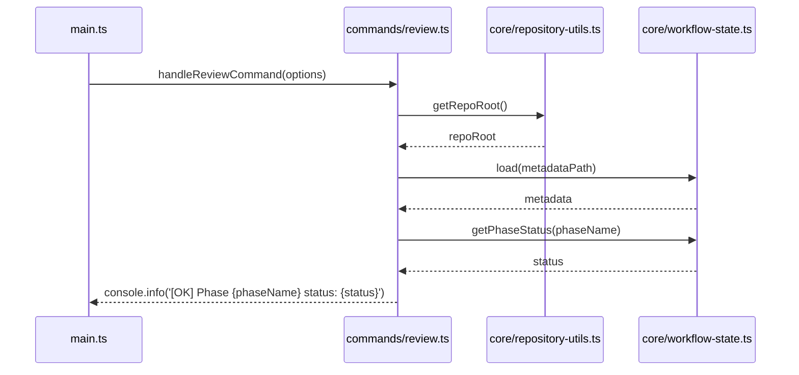
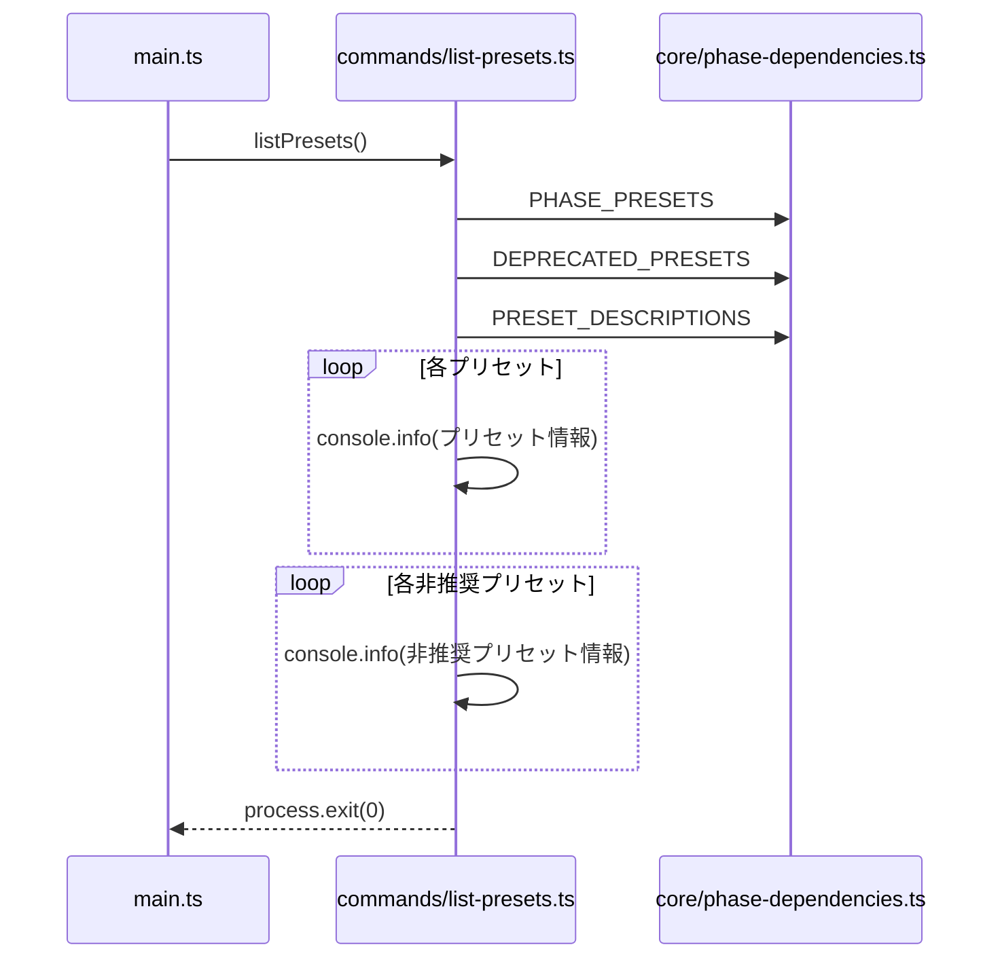
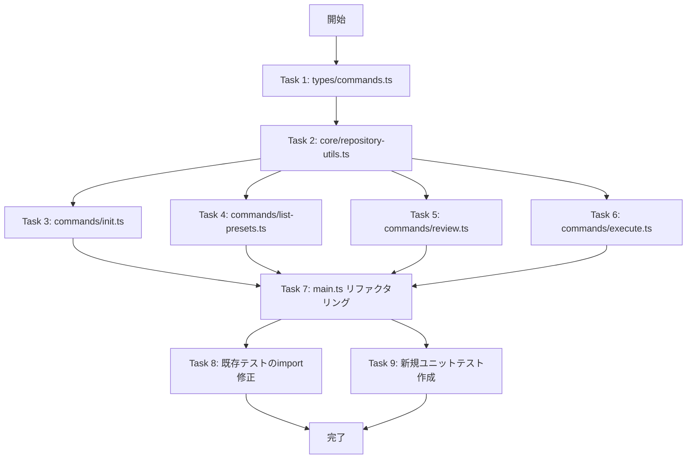

# 詳細設計書 - Issue #22

**Issue番号**: #22
**タイトル**: [REFACTOR] CLI コマンド処理の分離 (main.ts リファクタリング)
**作成日**: 2025-01-20
**ステータス**: Design Phase

---

## 1. アーキテクチャ設計

### 1.1 現行システム構成

```
src/main.ts (1309行)
├─ CLI定義 (commander)
├─ init コマンドハンドラ (229行)
├─ execute コマンドハンドラ (346行)
├─ review コマンドハンドラ (18行)
├─ list-presets 関数 (26行)
├─ ヘルパー関数群
│  ├─ parseIssueUrl
│  ├─ resolveLocalRepoPath
│  ├─ findWorkflowMetadata
│  ├─ validateBranchName
│  ├─ resolveBranchName
│  ├─ getRepoRoot
│  ├─ resolvePresetName
│  ├─ getPresetPhases
│  ├─ loadExternalDocuments
│  ├─ resetMetadata
│  └─ その他
└─ フェーズ実行関数群
   ├─ executePhasesSequential
   ├─ executePhasesFrom
   └─ createPhaseInstance
```

### 1.2 リファクタリング後のシステム構成

```
src/
├─ main.ts (200行以下) ← コマンドルーターのみ
│  ├─ CLI定義 (commander)
│  ├─ runCli() エントリーポイント
│  ├─ reportFatalError()
│  ├─ reportExecutionSummary()
│  ├─ isValidPhaseName()
│  └─ PHASE_ORDER 定数
│
├─ commands/ (新規ディレクトリ)
│  ├─ init.ts (約250~300行)
│  │  ├─ handleInitCommand()
│  │  ├─ validateBranchName()
│  │  └─ resolveBranchName()
│  │
│  ├─ execute.ts (約450~500行)
│  │  ├─ handleExecuteCommand()
│  │  ├─ executePhasesSequential()
│  │  ├─ executePhasesFrom()
│  │  ├─ createPhaseInstance()
│  │  ├─ resolvePresetName()
│  │  ├─ getPresetPhases()
│  │  ├─ canResumeWorkflow()
│  │  ├─ loadExternalDocuments()
│  │  └─ resetMetadata()
│  │
│  ├─ review.ts (約50行)
│  │  └─ handleReviewCommand()
│  │
│  └─ list-presets.ts (約50~80行)
│     └─ listPresets()
│
├─ core/ (既存ディレクトリ)
│  └─ repository-utils.ts (新規 - 約200行)
│     ├─ parseIssueUrl()
│     ├─ resolveLocalRepoPath()
│     ├─ findWorkflowMetadata()
│     └─ getRepoRoot()
│
└─ types/ (既存ディレクトリ)
   └─ commands.ts (新規 - 約100行)
      ├─ PhaseContext
      ├─ PhaseResultMap
      ├─ ExecutionSummary
      ├─ IssueInfo
      └─ BranchValidationResult
```

### 1.3 データフロー図



### 1.4 コンポーネント間の関係

#### 依存関係ルール

1. **main.ts → commands/***: 一方向依存のみ（commands/* は main.ts をimportしない）
2. **commands/* → core/repository-utils.ts**: 共有ユーティリティを利用
3. **commands/* → types/commands.ts**: 共有型定義を利用
4. **commands/* 相互**: 直接依存禁止（共有モジュール経由のみ）

#### モジュール境界

| モジュール | 責務 | 公開API |
|-----------|------|---------|
| `main.ts` | CLIルーティング | `runCli()` |
| `commands/init.ts` | Issue初期化 | `handleInitCommand()` |
| `commands/execute.ts` | フェーズ実行 | `handleExecuteCommand()` |
| `commands/review.ts` | フェーズレビュー | `handleReviewCommand()` |
| `commands/list-presets.ts` | プリセット一覧表示 | `listPresets()` |
| `core/repository-utils.ts` | リポジトリ解決 | `parseIssueUrl()`, `resolveLocalRepoPath()`, `findWorkflowMetadata()`, `getRepoRoot()` |
| `types/commands.ts` | 型定義 | 各種型定義 |

---

## 2. 実装戦略判断

### 実装戦略: REFACTOR

#### 判断根拠

1. **既存コード改善が中心**
   - `main.ts` (1309行) から責務を分離し、200行以下に削減
   - 既存の動作を完全に維持（後方互換性100%）
   - 機能追加はなく、既存の4つのコマンド（init/execute/review/list-presets）を分離

2. **構造改善が主目的**
   - SOLID原則（単一責任原則）の適用
   - コマンドごとの責務明確化
   - テスト容易性向上（モジュール単位のテストが可能）

3. **破壊的変更の禁止**
   - CLIインターフェースは完全に一致
   - エージェントモード（auto/codex/claude）の動作維持
   - メタデータ構造の変更なし
   - 既存のユニットテスト18件 + 統合テスト18件の互換性維持

4. **内部リファクタリング**
   - エンドユーザー向けの機能追加ではない
   - 開発者の保守性・可読性向上が目的
   - 外部APIの変更なし

---

## 3. テスト戦略判断

### テスト戦略: UNIT_INTEGRATION

#### 判断根拠

1. **ユニットテストの必要性**
   - モジュール分割後の各コマンドハンドラは独立してテスト可能
   - 新規ユニットテスト:
     - `tests/unit/commands/init.test.ts` - 初期化ロジックの単体テスト
     - `tests/unit/commands/execute.test.ts` - 実行ロジックの単体テスト
     - `tests/unit/commands/list-presets.test.ts` - プリセット一覧表示の単体テスト
   - 既存ユニットテストの継続利用:
     - `tests/unit/branch-validation.test.ts` - ブランチバリデーション
     - `tests/unit/repository-resolution.test.ts` - リポジトリ解決
     - `tests/unit/main-preset-resolution.test.ts` - プリセット解決

2. **統合テストの必要性**
   - CLI全体の動作検証が必須
   - 既存の統合テスト（18件）を再利用:
     - `tests/integration/workflow-init-cleanup.test.ts` - ワークフロー初期化とクリーンアップ
     - `tests/integration/custom-branch-workflow.test.ts` - カスタムブランチ名のワークフロー
     - `tests/integration/multi-repo-workflow.test.ts` - マルチリポジトリワークフロー
     - `tests/integration/preset-execution.test.ts` - プリセット実行の統合テスト
   - リファクタリング前後で動作が同一であることを保証

3. **BDD不要の理由**
   - エンドユーザー向けの機能追加ではない
   - ユーザーストーリーの追加なし
   - 内部リファクタリングのみ

4. **テスト戦略の利点**
   - ユニットテスト: 各モジュールの独立した動作検証
   - 統合テスト: システム全体の互換性検証
   - テストカバレッジの維持（現行水準と同等以上）

---

## 4. テストコード戦略判断

### テストコード戦略: BOTH_TEST

#### 判断根拠

1. **EXTEND_TEST（既存テストの拡張）の必要性**
   - 既存ユニットテストのimport文修正が必要:
     - `tests/unit/main-preset-resolution.test.ts` (220行)
       - 現状: main.ts のプライベート関数をテスト用に再現
       - 対応: `resolvePresetName` を `src/commands/execute.ts` からimport
     - `tests/unit/branch-validation.test.ts`
       - import文の修正: `parseIssueUrl`, `resolveLocalRepoPath` を `src/core/repository-utils.ts` からimport
     - `tests/unit/repository-resolution.test.ts`
       - import文の修正: `findWorkflowMetadata` を `src/core/repository-utils.ts` からimport
   - 既存統合テストのimport修正（必要に応じて）

2. **CREATE_TEST（新規テスト作成）の必要性**
   - 新規コマンドモジュールの独立したテストカバレッジが必要:
     - `tests/unit/commands/init.test.ts` (約150~200行)
       - 初期化コマンドのユニットテスト
       - ブランチ名バリデーション、Issue URL解析、リポジトリ解決のテスト
     - `tests/unit/commands/execute.test.ts` (約200~250行)
       - 実行コマンドのユニットテスト
       - エージェントモード選択、プリセット解決、フェーズ実行順序のテスト
     - `tests/unit/commands/list-presets.test.ts` (約50~80行)
       - プリセット一覧表示のユニットテスト

3. **BOTH適用の理由**
   - 既存テストは互換性維持のために拡張が必要（破壊的変更の回避）
   - 新規モジュールは独立したテストカバレッジが必要（品質保証）
   - テストカバレッジの向上（現行水準の維持 + 新規モジュールのカバレッジ追加）

---

## 5. 影響範囲分析

### 5.1 既存コードへの影響

#### 変更が必要なファイル

1. **src/main.ts** (1309行 → 200行以下に削減)
   - **変更内容**:
     - コマンドルーターとしての役割のみ残す
     - `handleInitCommand`, `handleExecuteCommand`, `handleReviewCommand` を削除
     - `listPresets` を削除
     - ヘルパー関数を適切なモジュールへ移動
   - **削除する関数**:
     - `handleInitCommand()` → `src/commands/init.ts` へ移動
     - `handleExecuteCommand()` → `src/commands/execute.ts` へ移動
     - `handleReviewCommand()` → `src/commands/review.ts` へ移動
     - `listPresets()` → `src/commands/list-presets.ts` へ移動
     - `parseIssueUrl()` → `src/core/repository-utils.ts` へ移動
     - `resolveLocalRepoPath()` → `src/core/repository-utils.ts` へ移動
     - `findWorkflowMetadata()` → `src/core/repository-utils.ts` へ移動
     - `getRepoRoot()` → `src/core/repository-utils.ts` へ移動
     - `validateBranchName()` → `src/commands/init.ts` へ移動
     - `resolveBranchName()` → `src/commands/init.ts` へ移動
     - `executePhasesSequential()` → `src/commands/execute.ts` へ移動
     - `executePhasesFrom()` → `src/commands/execute.ts` へ移動
     - `createPhaseInstance()` → `src/commands/execute.ts` へ移動
     - `resolvePresetName()` → `src/commands/execute.ts` へ移動
     - `getPresetPhases()` → `src/commands/execute.ts` へ移動
     - `canResumeWorkflow()` → `src/commands/execute.ts` へ移動
     - `loadExternalDocuments()` → `src/commands/execute.ts` へ移動
     - `resetMetadata()` → `src/commands/execute.ts` へ移動
   - **残す関数**:
     - `runCli()` - CLI エントリーポイント
     - `reportFatalError()` - エラーハンドリング
     - `reportExecutionSummary()` - 実行サマリー表示
     - `isValidPhaseName()` - フェーズ名バリデーション
   - **残す定数**:
     - `PHASE_ORDER` - フェーズ順序定義

2. **tests/unit/main-preset-resolution.test.ts** (220行)
   - **変更内容**:
     - import文の修正: `resolvePresetName` を `src/commands/execute.ts` からimport
     - テストロジックの修正: 再現コードを削除し、正式なexportされた関数を使用
   - **変更箇所**:
     ```typescript
     // 変更前
     // main.ts のロジックを再現してテスト

     // 変更後
     import { resolvePresetName } from '../../src/commands/execute.js';
     ```

3. **tests/unit/branch-validation.test.ts**
   - **変更内容**:
     - import文の修正: `parseIssueUrl`, `resolveLocalRepoPath` を `src/core/repository-utils.ts` からimport
   - **変更箇所**:
     ```typescript
     // 変更前
     import { parseIssueUrl, resolveLocalRepoPath, findWorkflowMetadata } from '../../src/main.js';

     // 変更後
     import { parseIssueUrl, resolveLocalRepoPath, findWorkflowMetadata } from '../../src/core/repository-utils.js';
     ```

4. **tests/unit/repository-resolution.test.ts**
   - **変更内容**:
     - import文の修正: `findWorkflowMetadata` を `src/core/repository-utils.ts` からimport
   - **変更箇所**:
     ```typescript
     // 変更前
     import { findWorkflowMetadata } from '../../src/main.js';

     // 変更後
     import { findWorkflowMetadata } from '../../src/core/repository-utils.js';
     ```

5. **tests/integration/workflow-init-cleanup.test.ts**
   - **変更内容**:
     - import文の修正（必要に応じて）
     - テストケース自体は変更不要（動作の互換性維持）

6. **tests/integration/custom-branch-workflow.test.ts**
   - **変更内容**:
     - import文の修正（必要に応じて）
     - テストケース自体は変更不要（動作の互換性維持）

7. **tests/integration/multi-repo-workflow.test.ts**
   - **変更内容**:
     - import文の修正（必要に応じて）
     - テストケース自体は変更不要（動作の互換性維持）

8. **tests/integration/preset-execution.test.ts**
   - **変更内容**:
     - import文の修正（必要に応じて）
     - テストケース自体は変更不要（動作の互換性維持）

#### 新規作成ファイル

1. **src/commands/init.ts** (約250~300行)
   - **責務**: Issue初期化コマンド処理
   - **主要関数**:
     - `handleInitCommand(issueUrl: string, customBranch?: string): Promise<void>`
     - `validateBranchName(branchName: string): BranchValidationResult`
     - `resolveBranchName(customBranch: string | undefined, issueNumber: number): string`
   - **依存モジュール**:
     - `core/repository-utils.ts` (parseIssueUrl, resolveLocalRepoPath, getRepoRoot)
     - `core/metadata-manager.ts`
     - `core/git-manager.ts`
     - `core/github-client.ts`
     - `core/workflow-state.ts`
     - `types/commands.ts`

2. **src/commands/execute.ts** (約450~500行)
   - **責務**: フェーズ実行コマンド処理
   - **主要関数**:
     - `handleExecuteCommand(options: any): Promise<void>`
     - `executePhasesSequential(phases: PhaseName[], context: PhaseContext, gitManager: GitManager, cleanupOnComplete?: boolean, cleanupOnCompleteForce?: boolean): Promise<ExecutionSummary>`
     - `executePhasesFrom(startPhase: PhaseName, context: PhaseContext, gitManager: GitManager, cleanupOnComplete?: boolean, cleanupOnCompleteForce?: boolean): Promise<ExecutionSummary>`
     - `createPhaseInstance(phaseName: PhaseName, context: PhaseContext): BasePhase`
     - `resolvePresetName(presetName: string): { resolvedName: string; warning?: string }`
     - `getPresetPhases(presetName: string): PhaseName[]`
     - `canResumeWorkflow(resumeManager: ResumeManager): boolean`
     - `loadExternalDocuments(docs: { requirements?: string; design?: string; test_scenario?: string }, metadataManager: MetadataManager, repoRoot: string): Promise<void>`
     - `resetMetadata(metadataManager: MetadataManager, metadataPath: string, issueNumber: string): Promise<MetadataManager>`
   - **依存モジュール**:
     - `core/repository-utils.ts` (findWorkflowMetadata, getRepoRoot)
     - `core/metadata-manager.ts`
     - `core/git-manager.ts`
     - `core/github-client.ts`
     - `core/codex-agent-client.ts`
     - `core/claude-agent-client.ts`
     - `core/phase-dependencies.ts`
     - `utils/resume.ts`
     - `phases/*.ts`
     - `types/commands.ts`

3. **src/commands/review.ts** (約50行)
   - **責務**: フェーズレビューコマンド処理
   - **主要関数**:
     - `handleReviewCommand(options: any): Promise<void>`
   - **依存モジュール**:
     - `core/repository-utils.ts` (getRepoRoot)
     - `core/workflow-state.ts`
     - `types.ts` (PhaseName)

4. **src/commands/list-presets.ts** (約50~80行)
   - **責務**: プリセット一覧表示
   - **主要関数**:
     - `listPresets(): void`
   - **依存モジュール**:
     - `core/phase-dependencies.ts` (PHASE_PRESETS, DEPRECATED_PRESETS, PRESET_DESCRIPTIONS)

5. **src/core/repository-utils.ts** (約200行)
   - **責務**: リポジトリ関連の共通ユーティリティ
   - **主要関数**:
     - `parseIssueUrl(issueUrl: string): IssueInfo`
     - `resolveLocalRepoPath(repoName: string): string`
     - `findWorkflowMetadata(issueNumber: string): Promise<{ repoRoot: string; metadataPath: string }>`
     - `getRepoRoot(): Promise<string>`
   - **依存モジュール**:
     - `node:path`
     - `node:os`
     - `fs-extra`
     - `simple-git`
     - `types/commands.ts` (IssueInfo)

6. **src/types/commands.ts** (約100行)
   - **責務**: コマンド関連の型定義
   - **型定義**:
     - `PhaseContext` - フェーズ実行コンテキスト
     - `PhaseResultMap` - フェーズ実行結果マップ
     - `ExecutionSummary` - 実行サマリー
     - `IssueInfo` - Issue情報
     - `BranchValidationResult` - ブランチバリデーション結果
   - **依存モジュール**:
     - `types.ts` (PhaseName, PhaseExecutionResult)
     - `core/metadata-manager.ts` (MetadataManager)
     - `core/codex-agent-client.ts` (CodexAgentClient)
     - `core/claude-agent-client.ts` (ClaudeAgentClient)
     - `core/github-client.ts` (GitHubClient)

7. **tests/unit/commands/init.test.ts** (約150~200行)
   - **責務**: 初期化コマンドのユニットテスト
   - **テストケース**:
     - ブランチ名バリデーション（正常系・異常系）
     - Issue URL解析
     - リポジトリ解決
     - カスタムブランチ名の処理

8. **tests/unit/commands/execute.test.ts** (約200~250行)
   - **責務**: 実行コマンドのユニットテスト
   - **テストケース**:
     - エージェントモード選択（auto/codex/claude）
     - プリセット解決（正常系・後方互換性）
     - フェーズ実行順序
     - レジューム機能

9. **tests/unit/commands/list-presets.test.ts** (約50~80行)
   - **責務**: プリセット一覧表示のユニットテスト
   - **テストケース**:
     - プリセット一覧の正しい表示
     - 非推奨プリセット一覧の表示

### 5.2 依存関係の変更

#### 新規依存の追加

- **なし** - 既存の依存関係（commander, fs-extra, simple-git等）のみ使用

#### 既存依存の変更

- **なし** - 依存ライブラリのバージョン変更は不要

#### モジュール間の依存関係



### 5.3 マイグレーション要否

#### データベーススキーマ変更

- **なし**

#### 設定ファイル変更

- **なし** - package.json, tsconfig.jsonの変更不要
- **ビルドスクリプト**: 既存のビルドスクリプト（`npm run build`）で自動的に新規ファイルをコンパイル

#### 環境変数変更

- **なし** - 既存の環境変数（GITHUB_TOKEN, CODEX_API_KEY等）をそのまま使用

---

## 6. 変更・追加ファイルリスト

### 6.1 新規作成ファイル

| ファイルパス | 行数（見積もり） | 説明 |
|-------------|----------------|------|
| `src/commands/init.ts` | 250~300 | Issue初期化コマンドハンドラ |
| `src/commands/execute.ts` | 450~500 | フェーズ実行コマンドハンドラ |
| `src/commands/review.ts` | 50 | フェーズレビューコマンドハンドラ |
| `src/commands/list-presets.ts` | 50~80 | プリセット一覧表示 |
| `src/core/repository-utils.ts` | 200 | リポジトリ関連ユーティリティ |
| `src/types/commands.ts` | 100 | コマンド関連型定義 |
| `tests/unit/commands/init.test.ts` | 150~200 | 初期化コマンドのユニットテスト |
| `tests/unit/commands/execute.test.ts` | 200~250 | 実行コマンドのユニットテスト |
| `tests/unit/commands/list-presets.test.ts` | 50~80 | プリセット一覧のユニットテスト |

### 6.2 修正が必要な既存ファイル

| ファイルパス | 変更内容 |
|-------------|---------|
| `src/main.ts` | コマンドハンドラ削除、import文追加 (1309行 → 200行以下) |
| `tests/unit/main-preset-resolution.test.ts` | import文修正、テストロジック修正 |
| `tests/unit/branch-validation.test.ts` | import文修正 |
| `tests/unit/repository-resolution.test.ts` | import文修正 |
| `tests/integration/workflow-init-cleanup.test.ts` | import文修正（必要に応じて） |
| `tests/integration/custom-branch-workflow.test.ts` | import文修正（必要に応じて） |
| `tests/integration/multi-repo-workflow.test.ts` | import文修正（必要に応じて） |
| `tests/integration/preset-execution.test.ts` | import文修正（必要に応じて） |

### 6.3 削除が必要なファイル

- **なし**

---

## 7. 詳細設計

### 7.1 src/commands/init.ts の設計

#### クラス・関数設計

```typescript
/**
 * Issue初期化コマンドハンドラ
 * @param issueUrl - GitHub Issue URL
 * @param customBranch - カスタムブランチ名（オプション）
 */
export async function handleInitCommand(
  issueUrl: string,
  customBranch?: string
): Promise<void>

/**
 * Gitブランチ名のバリデーション
 * git-check-ref-format の命名規則に基づく
 * @param branchName - 検証するブランチ名
 * @returns バリデーション結果（valid: boolean, error?: string）
 */
export function validateBranchName(branchName: string): BranchValidationResult

/**
 * ブランチ名を解決（デフォルト vs カスタム）
 * @param customBranch - CLI の --branch オプション値
 * @param issueNumber - Issue番号
 * @returns 解決されたブランチ名
 * @throws バリデーションエラー時はエラーをスロー
 */
export function resolveBranchName(
  customBranch: string | undefined,
  issueNumber: number
): string
```

#### データ構造設計

```typescript
/**
 * ブランチ名バリデーション結果
 */
interface BranchValidationResult {
  valid: boolean;
  error?: string;
}
```

#### 実装フロー



### 7.2 src/commands/execute.ts の設計

#### クラス・関数設計

```typescript
/**
 * フェーズ実行コマンドハンドラ
 * @param options - CLI オプション
 */
export async function handleExecuteCommand(options: any): Promise<void>

/**
 * フェーズを順次実行
 * @param phases - 実行するフェーズリスト
 * @param context - フェーズ実行コンテキスト
 * @param gitManager - Git管理インスタンス
 * @param cleanupOnComplete - 完了時クリーンアップフラグ
 * @param cleanupOnCompleteForce - クリーンアップ強制フラグ
 * @returns 実行サマリー
 */
export async function executePhasesSequential(
  phases: PhaseName[],
  context: PhaseContext,
  gitManager: GitManager,
  cleanupOnComplete?: boolean,
  cleanupOnCompleteForce?: boolean
): Promise<ExecutionSummary>

/**
 * 特定フェーズから実行
 * @param startPhase - 開始フェーズ
 * @param context - フェーズ実行コンテキスト
 * @param gitManager - Git管理インスタンス
 * @param cleanupOnComplete - 完了時クリーンアップフラグ
 * @param cleanupOnCompleteForce - クリーンアップ強制フラグ
 * @returns 実行サマリー
 */
export async function executePhasesFrom(
  startPhase: PhaseName,
  context: PhaseContext,
  gitManager: GitManager,
  cleanupOnComplete?: boolean,
  cleanupOnCompleteForce?: boolean
): Promise<ExecutionSummary>

/**
 * フェーズインスタンスを作成
 * @param phaseName - フェーズ名
 * @param context - フェーズ実行コンテキスト
 * @returns フェーズインスタンス
 */
export function createPhaseInstance(
  phaseName: PhaseName,
  context: PhaseContext
): BasePhase

/**
 * プリセット名を解決（後方互換性対応）
 * @param presetName - プリセット名
 * @returns 解決結果（resolvedName, warning）
 */
export function resolvePresetName(presetName: string): {
  resolvedName: string;
  warning?: string;
}

/**
 * プリセットのフェーズリストを取得
 * @param presetName - プリセット名
 * @returns フェーズリスト
 */
export function getPresetPhases(presetName: string): PhaseName[]

/**
 * ワークフロー再開可否を判定
 * @param resumeManager - レジュームマネージャ
 * @returns 再開可能かどうか
 */
export function canResumeWorkflow(resumeManager: ResumeManager): boolean

/**
 * 外部ドキュメントを読み込み
 * @param docs - ドキュメントパス
 * @param metadataManager - メタデータマネージャ
 * @param repoRoot - リポジトリルート
 */
export async function loadExternalDocuments(
  docs: { requirements?: string; design?: string; test_scenario?: string },
  metadataManager: MetadataManager,
  repoRoot: string
): Promise<void>

/**
 * メタデータをリセット
 * @param metadataManager - メタデータマネージャ
 * @param metadataPath - メタデータパス
 * @param issueNumber - Issue番号
 * @returns リフレッシュされたメタデータマネージャ
 */
export async function resetMetadata(
  metadataManager: MetadataManager,
  metadataPath: string,
  issueNumber: string
): Promise<MetadataManager>
```

#### データ構造設計

```typescript
/**
 * フェーズ実行コンテキスト
 */
type PhaseContext = {
  workingDir: string;
  metadataManager: MetadataManager;
  codexClient: CodexAgentClient | null;
  claudeClient: ClaudeAgentClient | null;
  githubClient: GitHubClient;
  skipDependencyCheck: boolean;
  ignoreDependencies: boolean;
  presetPhases?: PhaseName[];
};

/**
 * フェーズ実行結果マップ
 */
type PhaseResultMap = Record<PhaseName, PhaseExecutionResult>;

/**
 * 実行サマリー
 */
type ExecutionSummary = {
  success: boolean;
  failedPhase?: PhaseName;
  error?: string;
  results: PhaseResultMap;
};
```

#### 実装フロー



### 7.3 src/commands/review.ts の設計

#### クラス・関数設計

```typescript
/**
 * フェーズレビューコマンドハンドラ
 * @param options - CLI オプション
 */
export async function handleReviewCommand(options: any): Promise<void>
```

#### 実装フロー



### 7.4 src/commands/list-presets.ts の設計

#### クラス・関数設計

```typescript
/**
 * 利用可能なプリセット一覧を表示
 */
export function listPresets(): void
```

#### 実装フロー



### 7.5 src/core/repository-utils.ts の設計

#### クラス・関数設計

```typescript
/**
 * GitHub Issue URLからリポジトリ情報を抽出
 * @param issueUrl - GitHub Issue URL
 * @returns Issue情報（owner, repo, issueNumber, repositoryName）
 * @throws URL形式が不正な場合はエラー
 */
export function parseIssueUrl(issueUrl: string): IssueInfo

/**
 * リポジトリ名からローカルパスを解決
 * @param repoName - リポジトリ名
 * @returns ローカルリポジトリパス
 * @throws リポジトリが見つからない場合はエラー
 */
export function resolveLocalRepoPath(repoName: string): string

/**
 * Issue番号から対応するメタデータを探索
 * @param issueNumber - Issue番号
 * @returns リポジトリルートパスとメタデータパス
 * @throws メタデータが見つからない場合はエラー
 */
export async function findWorkflowMetadata(
  issueNumber: string
): Promise<{ repoRoot: string; metadataPath: string }>

/**
 * Gitリポジトリのルートパスを取得
 * @returns リポジトリルートパス
 */
export async function getRepoRoot(): Promise<string>
```

#### データ構造設計

```typescript
/**
 * Issue URL解析結果
 */
interface IssueInfo {
  /**
   * リポジトリオーナー
   * 例: "tielec"
   */
  owner: string;

  /**
   * リポジトリ名
   * 例: "my-app"
   */
  repo: string;

  /**
   * Issue番号
   * 例: 123
   */
  issueNumber: number;

  /**
   * リポジトリ名（owner/repo形式）
   * 例: "tielec/my-app"
   */
  repositoryName: string;
}
```

### 7.6 src/types/commands.ts の設計

#### 型定義

```typescript
import type { PhaseName, PhaseExecutionResult } from '../types.js';
import type { MetadataManager } from '../core/metadata-manager.js';
import type { CodexAgentClient } from '../core/codex-agent-client.js';
import type { ClaudeAgentClient } from '../core/claude-agent-client.js';
import type { GitHubClient } from '../core/github-client.js';

/**
 * フェーズ実行コンテキスト
 */
export type PhaseContext = {
  workingDir: string;
  metadataManager: MetadataManager;
  codexClient: CodexAgentClient | null;
  claudeClient: ClaudeAgentClient | null;
  githubClient: GitHubClient;
  skipDependencyCheck: boolean;
  ignoreDependencies: boolean;
  presetPhases?: PhaseName[];
};

/**
 * フェーズ実行結果マップ
 */
export type PhaseResultMap = Record<PhaseName, PhaseExecutionResult>;

/**
 * 実行サマリー
 */
export type ExecutionSummary = {
  success: boolean;
  failedPhase?: PhaseName;
  error?: string;
  results: PhaseResultMap;
};

/**
 * Issue URL解析結果
 */
export interface IssueInfo {
  /**
   * リポジトリオーナー
   * 例: "tielec"
   */
  owner: string;

  /**
   * リポジトリ名
   * 例: "my-app"
   */
  repo: string;

  /**
   * Issue番号
   * 例: 123
   */
  issueNumber: number;

  /**
   * リポジトリ名（owner/repo形式）
   * 例: "tielec/my-app"
   */
  repositoryName: string;
}

/**
 * ブランチ名バリデーション結果
 */
export interface BranchValidationResult {
  valid: boolean;
  error?: string;
}
```

---

## 8. セキュリティ考慮事項

### 8.1 認証・認可

#### 既存の認証機構の維持

1. **GitHub 認証**
   - `GITHUB_TOKEN` 環境変数の取り扱いロジックを変更しない
   - トークンはログに出力しない（既存の実装を維持）

2. **Codex API 認証**
   - `CODEX_API_KEY` / `OPENAI_API_KEY` 環境変数の取り扱いロジックを変更しない
   - APIキーはログに出力しない（既存の実装を維持）

3. **Claude Code 認証**
   - `CLAUDE_CODE_CREDENTIALS_PATH` の取り扱いロジックを変更しない
   - 認証情報ファイルのパーミッションチェックを維持

### 8.2 データ保護

#### ファイルパス解決時のセキュリティ

1. **パストラバーサル対策**
   - `resolveLocalRepoPath()`: 既存の実装を維持（`path.resolve()` によるパス正規化）
   - `findWorkflowMetadata()`: 既存の実装を維持（ディレクトリトラバーサル防止）

2. **シンボリックリンク攻撃対策**
   - `fs.existsSync()` によるファイル存在確認を維持
   - `.git` ディレクトリの存在確認を維持

### 8.3 セキュリティリスクと対策

| リスク | 対策 | 実装箇所 |
|-------|------|---------|
| 不正なIssue URL | 正規表現によるバリデーション | `core/repository-utils.ts: parseIssueUrl()` |
| 不正なブランチ名 | Git命名規則に基づくバリデーション | `commands/init.ts: validateBranchName()` |
| 不正なファイルパス | `path.resolve()` によるパス正規化 | `core/repository-utils.ts: resolveLocalRepoPath()` |
| 環境変数の漏洩 | ログ出力時のマスキング（既存の実装を維持） | 各コマンドモジュール |

---

## 9. 非機能要件への対応

### 9.1 パフォーマンス

#### 目標

- ビルド時間: リファクタリング前の ±10% 以内
- CLI起動時間: リファクタリング前の ±10% 以内

#### 対策

1. **モジュール分割による影響**
   - import文の増加による起動時間への影響は微小（ES modulesの遅延ロード）
   - 各コマンドモジュールは独立してロード可能（必要なモジュールのみロード）

2. **ビルド時間への影響**
   - TypeScriptコンパイラは増分コンパイルをサポート（変更ファイルのみ再コンパイル）
   - 新規ファイル数は9ファイル（src: 6, tests: 3）のため、ビルド時間への影響は軽微

### 9.2 スケーラビリティ

#### 将来的な拡張性

1. **新規コマンドの追加**
   - `src/commands/` 配下に新規ファイルを追加するのみ
   - `main.ts` への影響は最小限（`.command()` 定義の追加のみ）

2. **共有ユーティリティの拡充**
   - `core/repository-utils.ts` に新規関数を追加可能
   - 各コマンドモジュールから利用可能

3. **型定義の拡張**
   - `types/commands.ts` に新規型定義を追加可能
   - 各コマンドモジュールから利用可能

### 9.3 保守性

#### コードの可読性

1. **main.ts の簡素化**
   - 1309行 → 200行以下（約85%削減）
   - CLIルーティングの見通しが大幅に改善

2. **責務の明確化**
   - 各コマンドモジュールが単一の責務を持つ（単一責任原則）
   - コマンドごとのロジックが独立して理解可能

#### テスト容易性

1. **モジュール単位のテスト**
   - 各コマンドモジュールが独立してテスト可能
   - モック・スタブの使用を最小化

2. **既存テストの互換性**
   - import文の修正のみで既存テストが継続利用可能
   - テストカバレッジの維持

#### ドキュメント

1. **ARCHITECTURE.md の更新**
   - モジュール一覧の更新（`src/commands/*` を追加）
   - CLI エントリーポイントの説明更新

2. **CLAUDE.md の更新**
   - アーキテクチャ概要の更新
   - コマンドハンドラの説明追加

---

## 10. 実装の順序

### 推奨実装順序

実装は以下の順序で進めることを推奨します：

#### Phase 1: 共有モジュールの作成（優先度: 高）

1. **src/types/commands.ts**
   - 理由: 各コマンドモジュールで使用される型定義を最優先で作成
   - 依存関係: なし
   - 所要時間: 0.5~1h

2. **src/core/repository-utils.ts**
   - 理由: 各コマンドモジュールで使用される共通関数を作成
   - 依存関係: `types/commands.ts`
   - 所要時間: 1~1.5h

#### Phase 2: コマンドモジュールの作成（優先度: 高）

3. **src/commands/init.ts**
   - 理由: 最もシンプルなコマンドモジュールから着手
   - 依存関係: `types/commands.ts`, `core/repository-utils.ts`
   - 所要時間: 1~1.5h

4. **src/commands/list-presets.ts**
   - 理由: 依存関係が少なく、独立性が高い
   - 依存関係: `core/phase-dependencies.ts`
   - 所要時間: 0.5h

5. **src/commands/review.ts**
   - 理由: ロジックがシンプル（約50行）
   - 依存関係: `core/repository-utils.ts`, `core/workflow-state.ts`
   - 所要時間: 0.5h

6. **src/commands/execute.ts**
   - 理由: 最も複雑なコマンドモジュール（約450~500行）
   - 依存関係: `types/commands.ts`, `core/repository-utils.ts`, 他多数
   - 所要時間: 2~2.5h

#### Phase 3: main.ts のリファクタリング（優先度: 高）

7. **src/main.ts**
   - 理由: 各コマンドモジュールが完成した後にリファクタリング
   - 依存関係: すべてのコマンドモジュール
   - 所要時間: 1h

#### Phase 4: テストコードの実装（優先度: 中）

8. **既存テストのimport修正**
   - ファイル:
     - `tests/unit/main-preset-resolution.test.ts`
     - `tests/unit/branch-validation.test.ts`
     - `tests/unit/repository-resolution.test.ts`
   - 所要時間: 0.5h

9. **新規ユニットテストの作成**
   - ファイル:
     - `tests/unit/commands/init.test.ts`
     - `tests/unit/commands/execute.test.ts`
     - `tests/unit/commands/list-presets.test.ts`
   - 所要時間: 1~1.5h

#### 依存関係グラフ



---

## 11. インターフェース設計

### 11.1 CLIインターフェース（変更なし）

#### init コマンド

```bash
ai-workflow init --issue-url <URL> [--branch <name>]
```

- **オプション**:
  - `--issue-url <URL>` (必須): GitHub Issue URL
  - `--branch <name>` (任意): カスタムブランチ名

#### execute コマンド

```bash
ai-workflow execute --issue <number> [--phase <name>|--preset <name>] [--agent <mode>] [その他オプション]
```

- **オプション**:
  - `--issue <number>` (必須): Issue番号
  - `--phase <name>` (任意): フェーズ名または "all"
  - `--preset <name>` (任意): プリセット名
  - `--agent <mode>` (任意): エージェントモード（auto/codex/claude）
  - `--git-user <name>` (任意): Git コミットユーザー名
  - `--git-email <email>` (任意): Git コミットメールアドレス
  - `--force-reset` (任意): メタデータクリア＆Phase 1 から再開
  - `--skip-dependency-check` (任意): 依存関係チェックをスキップ
  - `--ignore-dependencies` (任意): 依存関係警告を表示するが続行
  - `--requirements-doc <path>` (任意): 外部要件ドキュメントパス
  - `--design-doc <path>` (任意): 外部設計ドキュメントパス
  - `--test-scenario-doc <path>` (任意): 外部テストシナリオドキュメントパス
  - `--cleanup-on-complete` (任意): Evaluation Phase完了後に `.ai-workflow` ディレクトリを削除
  - `--cleanup-on-complete-force` (任意): 確認プロンプトをスキップ（CI環境用）

#### review コマンド

```bash
ai-workflow review --phase <name> --issue <number>
```

- **オプション**:
  - `--phase <name>` (必須): フェーズ名
  - `--issue <number>` (必須): Issue番号

#### list-presets コマンド

```bash
ai-workflow list-presets
```

- **オプション**: なし

### 11.2 プログラマティックインターフェース

#### commands/init.ts

```typescript
/**
 * Issue初期化コマンドハンドラ
 */
export async function handleInitCommand(
  issueUrl: string,
  customBranch?: string
): Promise<void>;

/**
 * ブランチ名バリデーション
 */
export function validateBranchName(branchName: string): BranchValidationResult;

/**
 * ブランチ名解決
 */
export function resolveBranchName(
  customBranch: string | undefined,
  issueNumber: number
): string;
```

#### commands/execute.ts

```typescript
/**
 * フェーズ実行コマンドハンドラ
 */
export async function handleExecuteCommand(options: any): Promise<void>;

/**
 * フェーズ順次実行
 */
export async function executePhasesSequential(
  phases: PhaseName[],
  context: PhaseContext,
  gitManager: GitManager,
  cleanupOnComplete?: boolean,
  cleanupOnCompleteForce?: boolean
): Promise<ExecutionSummary>;

/**
 * 特定フェーズから実行
 */
export async function executePhasesFrom(
  startPhase: PhaseName,
  context: PhaseContext,
  gitManager: GitManager,
  cleanupOnComplete?: boolean,
  cleanupOnCompleteForce?: boolean
): Promise<ExecutionSummary>;

/**
 * フェーズインスタンス作成
 */
export function createPhaseInstance(
  phaseName: PhaseName,
  context: PhaseContext
): BasePhase;

/**
 * プリセット名解決
 */
export function resolvePresetName(presetName: string): {
  resolvedName: string;
  warning?: string;
};

/**
 * プリセットフェーズ取得
 */
export function getPresetPhases(presetName: string): PhaseName[];

/**
 * ワークフロー再開可否判定
 */
export function canResumeWorkflow(resumeManager: ResumeManager): boolean;

/**
 * 外部ドキュメント読み込み
 */
export async function loadExternalDocuments(
  docs: { requirements?: string; design?: string; test_scenario?: string },
  metadataManager: MetadataManager,
  repoRoot: string
): Promise<void>;

/**
 * メタデータリセット
 */
export async function resetMetadata(
  metadataManager: MetadataManager,
  metadataPath: string,
  issueNumber: string
): Promise<MetadataManager>;
```

#### commands/review.ts

```typescript
/**
 * フェーズレビューコマンドハンドラ
 */
export async function handleReviewCommand(options: any): Promise<void>;
```

#### commands/list-presets.ts

```typescript
/**
 * プリセット一覧表示
 */
export function listPresets(): void;
```

#### core/repository-utils.ts

```typescript
/**
 * Issue URL解析
 */
export function parseIssueUrl(issueUrl: string): IssueInfo;

/**
 * ローカルリポジトリパス解決
 */
export function resolveLocalRepoPath(repoName: string): string;

/**
 * ワークフローメタデータ探索
 */
export async function findWorkflowMetadata(
  issueNumber: string
): Promise<{ repoRoot: string; metadataPath: string }>;

/**
 * リポジトリルート取得
 */
export async function getRepoRoot(): Promise<string>;
```

---

## 12. エラーハンドリング設計

### 12.1 エラー分類

| エラーカテゴリ | 説明 | 処理方針 |
|--------------|------|---------|
| バリデーションエラー | 入力値の検証失敗（ブランチ名、Issue URL等） | 即座にエラーメッセージを表示し、終了コード1で終了 |
| リソース不在エラー | リポジトリ、メタデータ、ブランチが見つからない | エラーメッセージを表示し、解決方法を提示して終了コード1で終了 |
| Git操作エラー | Git コマンド実行失敗（checkout, pull, push等） | エラーメッセージを表示し、終了コード1で終了 |
| GitHub API エラー | PR作成失敗、Issue取得失敗等 | 警告メッセージを表示し、処理を継続（PR作成は必須ではない） |
| エージェントエラー | Codex/Claude API 実行失敗 | エラーメッセージを表示し、フォールバック（auto modeの場合）または終了 |

### 12.2 エラーメッセージ形式

#### 既存のエラーメッセージ形式を維持

```typescript
// 正常系ログ
console.info('[INFO] メッセージ');
console.info('[OK] メッセージ');

// 警告ログ
console.warn('[WARNING] メッセージ');

// エラーログ
console.error('[ERROR] メッセージ');
```

### 12.3 エラーハンドリング例

#### commands/init.ts

```typescript
try {
  issueInfo = parseIssueUrl(issueUrl);
} catch (error) {
  console.error(`[ERROR] ${(error as Error).message}`);
  process.exit(1);
}
```

#### commands/execute.ts

```typescript
if (!codexClient && !claudeClient) {
  console.error(
    `[ERROR] Agent mode "${agentMode}" requires a valid agent configuration, but neither Codex API key nor Claude Code credentials are available.`
  );
  process.exit(1);
}
```

#### core/repository-utils.ts

```typescript
// リポジトリが見つからない場合
throw new Error(
  `Repository '${repoName}' not found.\nPlease set REPOS_ROOT environment variable or clone the repository.`
);
```

---

## 13. 品質ゲート（Phase 2）

本設計書は以下の品質ゲートを満たしています：

- ✅ **実装戦略の判断根拠が明記されている**
  - セクション2: REFACTOR戦略の選択理由を4つの観点から説明

- ✅ **テスト戦略の判断根拠が明記されている**
  - セクション3: UNIT_INTEGRATION戦略の選択理由を4つの観点から説明

- ✅ **テストコード戦略の判断根拠が明記されている**
  - セクション4: BOTH_TEST戦略の選択理由を3つの観点から説明

- ✅ **既存コードへの影響範囲が分析されている**
  - セクション5: 変更が必要なファイル8件、新規作成ファイル9件をリストアップ
  - セクション5: 依存関係の変更を分析（新規依存なし、既存依存変更なし）

- ✅ **変更が必要なファイルがリストアップされている**
  - セクション6: 新規作成ファイル9件、修正ファイル8件を表形式でリストアップ

- ✅ **設計が実装可能である**
  - セクション7: 各モジュールの詳細設計（クラス・関数設計、データ構造、実装フロー）を記載
  - セクション10: 実装順序を依存関係グラフとともに提示
  - セクション11: インターフェース設計を明記

---

## 14. 補足情報

### 14.1 循環依存の回避戦略

#### ルール

1. **main.ts → commands/***: 一方向依存のみ
2. **commands/* → core/repository-utils.ts**: 共有ユーティリティを利用
3. **commands/* → types/commands.ts**: 共有型定義を利用
4. **commands/* 相互**: 直接依存禁止

#### 検証方法

```bash
# madge 等のツールで循環依存をチェック
npx madge --circular --extensions ts src/
```

### 14.2 TypeScript strict mode 対応

#### tsconfig.json 設定（変更なし）

```json
{
  "compilerOptions": {
    "strict": true,
    "noImplicitAny": true,
    "strictNullChecks": true,
    "strictFunctionTypes": true,
    "strictPropertyInitialization": true,
    "noImplicitThis": true,
    "alwaysStrict": true
  }
}
```

### 14.3 ESLint 対応

#### コーディング規約（変更なし）

- インデント: 2スペース
- セミコロン: 必須
- クォート: シングルクォート
- 命名規則: camelCase（関数・変数）、PascalCase（クラス・型）

#### 検証方法

```bash
npx eslint --ext .ts src
```

### 14.4 Git コミット戦略

#### コミットメッセージ形式

```
[ai-workflow] Phase 4 (implementation) - execute completed

- src/commands/execute.ts を作成
- handleExecuteCommand, executePhasesSequential 等を実装
```

#### ブランチ戦略

- ブランチ名: `ai-workflow/issue-22`
- 1つのフェーズで1つのPR

---

**設計書バージョン**: 1.0
**作成日**: 2025-01-20
**作成者**: AI Workflow Agent
**レビュー状態**: Pending Review
