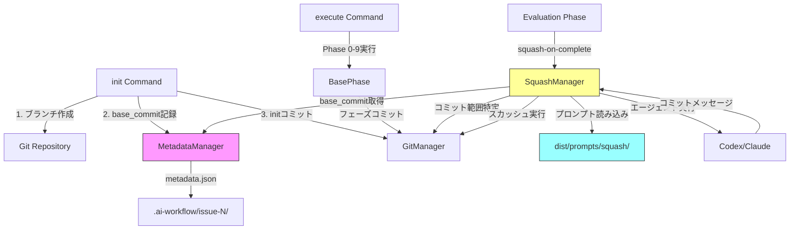
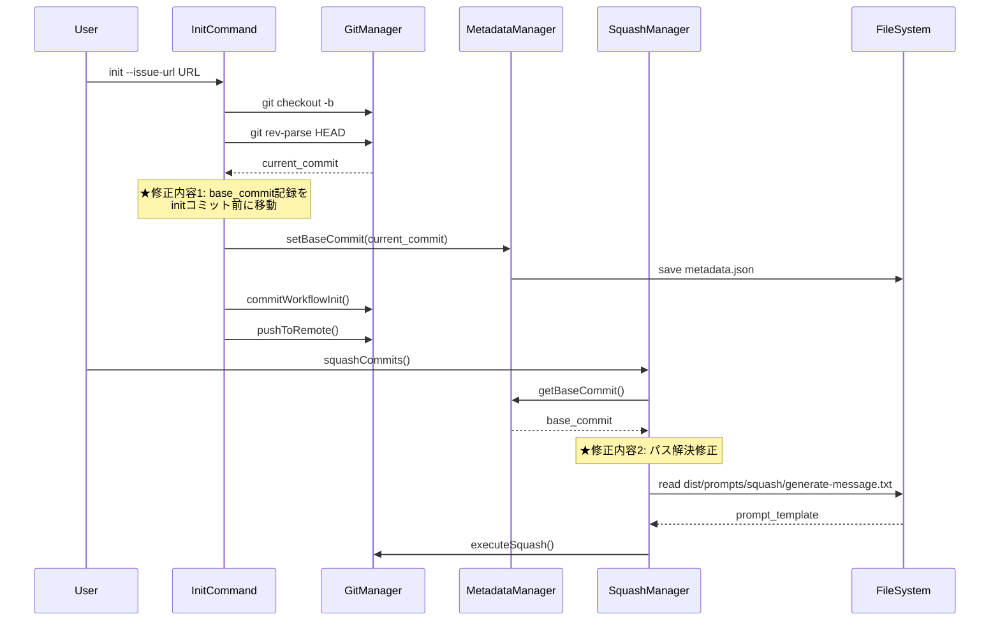
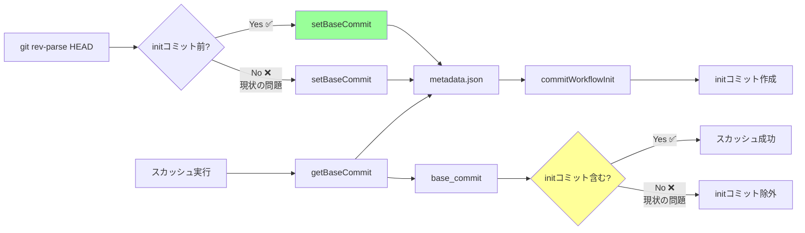

# 詳細設計書

## Issue #225: --squash-on-complete オプション実行時の不具合修正

---

## 1. アーキテクチャ設計

### システム全体図



### コンポーネント間の関係



### データフロー



---

## 2. 実装戦略判断

### 実装戦略: EXTEND

**判断根拠**:
- 既存の`src/commands/init.ts`の処理順序を変更（base_commit記録タイミングの移動）
- 既存の`src/core/git/squash-manager.ts`のパス解決ロジックは既に正しく実装されている（ESM互換性対応済み）
- 新規ファイルの作成は不要（既存コードの修正のみ）
- アーキテクチャ変更は不要（既存のファサードパターンを維持）
- 既存のMetadataManagerのAPIを使用（`setBaseCommit`, `getBaseCommit`）

**補足**:
- Issue #225の修正内容2（プロンプトパス解決）は、現在のコード（squash-manager.ts L9-10）を確認した結果、**既に正しく実装されている**ことが判明
- ESM互換性対応により、`moduleDir`から相対パスで`dist/prompts/`を解決する実装が完了している
- したがって、**修正内容1（base_commit記録タイミング）のみが実装対象**となる

---

## 3. テスト戦略判断

### テスト戦略: UNIT_INTEGRATION

**判断根拠**:
- **ユニットテスト**:
  - `init.test.ts`: `base_commit`記録タイミングの検証（既存テストファイルに追加）
  - 関数レベルのロジック検証が可能
  - Git操作をモック化してテスト可能

- **統合テスト**:
  - 実際のGitリポジトリでのコミット履歴確認
  - `init` → `execute --phase all --squash-on-complete` の一連の流れを検証
  - スカッシュ後のコミット履歴が期待通りか確認
  - エンドツーエンドの動作保証が必要

- **BDDテスト不要**:
  - エンドユーザー向け機能ではなく、内部処理の修正
  - ユーザーストーリーベースのシナリオテストは不要

---

## 4. テストコード戦略判断

### テストコード戦略: BOTH_TEST

**判断根拠**:
- **EXTEND_TEST（既存テストの拡張）**:
  - `tests/unit/commands/init.test.ts`: 既存テストファイルに新規テストケースを追加
    - `base_commit`記録タイミングのテストケース
    - Gitモックを使用したユニットテスト
    - 既存のテスト構造（describe/test）を踏襲

- **CREATE_TEST（新規テスト作成）**:
  - `tests/integration/squash-workflow.test.ts`: スカッシュ機能の統合テストを新規作成
    - `init`コマンド実行後のコミット履歴検証
    - スカッシュ実行後のコミット履歴検証
    - 実際のGitリポジトリ操作を含む統合テスト

- **理由**:
  - 既存テストとの整合性を保ちつつ、新しい機能の統合テストを追加
  - ユニットテストは既存構造に統合（保守性向上）
  - 統合テストは新規作成（エンドツーエンドの動作保証）

---

## 5. 影響範囲分析

### 既存コードへの影響

| ファイル | 影響内容 | 変更種別 | 変更理由 |
|---------|---------|---------|---------|
| `src/commands/init.ts` | `base_commit`記録タイミングを変更（L275-285を L244-274の間に移動） | 処理順序変更 | initコミットをスカッシュ対象に含めるため |
| `src/core/metadata-manager.ts` | 影響なし（既存のAPIを使用） | 変更なし | - |
| `src/core/git/squash-manager.ts` | 影響なし（既にESM互換性対応済み） | 変更なし | パス解決は既に正しく実装されている |
| `tests/unit/commands/init.test.ts` | 新規テストケースを追加 | テスト追加 | `base_commit`記録タイミングの検証 |

**注意**: 当初Issue #225で指摘されていた「修正内容2（プロンプトパス解決問題）」は、既に`squash-manager.ts` L9-10でESM互換性対応により正しく実装されていることを確認しました。したがって、**修正内容1のみを実装**します。

### 依存関係の変更

- **新規依存の追加**: なし
- **既存依存の変更**: なし
- **影響を受けるコンポーネント**:
  - `GitManager`: 間接的に影響（initコミット前のHEADハッシュを記録）
  - `MetadataManager`: 既存APIを使用（変更なし）
  - `SquashManager`: 間接的に影響（base_commitがinitコミット前になる）

### マイグレーション要否

- **データベーススキーマ変更**: なし
- **設定ファイル変更**: なし
- **メタデータ構造変更**: なし（`base_commit`フィールドは既存、値の意味のみ変更）
- **後方互換性**: 保証される（既存のワークフローに影響なし）

---

## 6. 変更・追加ファイルリスト

### 修正が必要な既存ファイル

1. **`src/commands/init.ts`** (修正内容1)
   - 変更箇所: L275-285の`base_commit`記録処理をL244-274の間（メタデータ保存前）に移動
   - 変更内容: 処理順序の変更
   - 影響: initコミットがスカッシュ対象に含まれるようになる

### 追加が必要なテストファイル

2. **`tests/unit/commands/init.test.ts`** (既存テストファイルに追加)
   - 追加内容: `base_commit`記録タイミングの検証テストケース
   - テストケース数: 2個（正常系1、異常系1）

3. **`tests/integration/squash-workflow.test.ts`** (新規作成)
   - 内容: スカッシュ機能の統合テスト
   - テストケース数: 3個（initコミット含む、複数コミット、エッジケース）

### 削除が必要なファイル

- なし

---

## 7. 詳細設計

### 7.1 修正内容1: base_commit記録タイミングの変更

#### 現状の処理フロー（`src/commands/init.ts` L244-305）

```typescript
// L244-274: メタデータ作成
WorkflowState.createNew(metadataPath, String(issueNumber), issueUrl, `Issue #${issueNumber}`);
const metadataManager = new MetadataManager(metadataPath);
metadataManager.data.branch_name = branchName;
metadataManager.data.repository = repositoryName;
// target_repository設定...
metadataManager.data.target_repository = { ... };

// ★★★ 問題箇所: base_commit記録がコミット後 ★★★
// L275-285: base_commit記録（コミット後）
try {
  const currentCommit = await git.revparse(['HEAD']);
  const baseCommit = currentCommit.trim();
  metadataManager.setBaseCommit(baseCommit);
  logger.info(`Recorded base_commit for squash: ${baseCommit.slice(0, 7)}`);
} catch (error) {
  logger.warn(`Failed to record base_commit: ${getErrorMessage(error)}`);
}

metadataManager.save(); // L287

// L289-292: initコミット作成
const gitManager = new GitManager(repoRoot, metadataManager);
logger.info('Committing metadata.json...');
const commitResult = await gitManager.commitWorkflowInit(issueNumber, branchName);
```

#### 修正後の処理フロー

```typescript
// L244-274: メタデータ作成
WorkflowState.createNew(metadataPath, String(issueNumber), issueUrl, `Issue #${issueNumber}`);
const metadataManager = new MetadataManager(metadataPath);
metadataManager.data.branch_name = branchName;
metadataManager.data.repository = repositoryName;
// target_repository設定...
metadataManager.data.target_repository = { ... };

// ★★★ 修正: base_commit記録をコミット前に移動 ★★★
// Issue #225: base_commitの記録（スカッシュ機能用）
// コミット前に現在のHEADを記録することで、initコミットもスカッシュ対象に含める
try {
  const currentCommit = await git.revparse(['HEAD']);
  const baseCommit = currentCommit.trim();
  metadataManager.setBaseCommit(baseCommit);
  logger.info(`Recorded base_commit for squash: ${baseCommit.slice(0, 7)}`);
} catch (error) {
  // base_commit記録失敗は警告のみ（ワークフロー初期化は継続）
  logger.warn(`Failed to record base_commit: ${getErrorMessage(error)}`);
}

metadataManager.save();

// コミット & プッシュ (Issue #16: commitWorkflowInit を使用)
const gitManager = new GitManager(repoRoot, metadataManager);
logger.info('Committing metadata.json...');
const commitResult = await gitManager.commitWorkflowInit(issueNumber, branchName);
```

#### 設計のポイント

1. **処理順序の変更**:
   - `git.revparse(['HEAD'])`の呼び出しを`gitManager.commitWorkflowInit()`の前に移動
   - これにより、`base_commit`は「initコミット作成前のHEADハッシュ」を記録する

2. **エラーハンドリング**:
   - 既存のtry-catchをそのまま維持
   - `base_commit`記録失敗は警告ログのみ（ワークフロー初期化は継続）

3. **ログメッセージ**:
   - 既存のログメッセージを維持（`Recorded base_commit for squash: ...`）
   - コメントにIssue番号を追加（`Issue #225: ...`）

4. **後方互換性**:
   - 既存のAPIを使用（`metadataManager.setBaseCommit()`）
   - メタデータ構造の変更なし

#### 期待される動作

**修正前**:
```
[Commit History]
commit ABC123 (base_commit)
commit DEF456 (init: Initialize workflow for issue #225)  ← スカッシュ対象外
commit GHI789 (Phase 0: Planning)
commit JKL012 (Phase 1: Requirements)
...
```

**修正後**:
```
[Commit History]
commit ABC123 (base_commit) ← この時点を記録
commit DEF456 (init: Initialize workflow for issue #225)  ← スカッシュ対象に含まれる ✅
commit GHI789 (Phase 0: Planning)
commit JKL012 (Phase 1: Requirements)
...

[スカッシュ後]
commit ABC123 (base_commit)
commit XYZ999 (feat: Complete workflow for Issue #225)  ← すべてスカッシュ
```

### 7.2 修正内容2: プロンプトパス解決の確認

#### 現状の実装（`src/core/git/squash-manager.ts` L9-10, L272-278）

```typescript
// L9-10: ESM compatibility - promptsRoot解決
const moduleDir = path.dirname(fileURLToPath(import.meta.url));
const promptsRoot = path.resolve(moduleDir, '..', '..', 'prompts');
// → dist/core/git/squash-manager.js から dist/prompts/ を正しく解決

// L272-278: プロンプトテンプレート読み込み
private async loadPromptTemplate(): Promise<string> {
  const templatePath = path.join(promptsRoot, 'squash', 'generate-message.txt');
  // → dist/prompts/squash/generate-message.txt を正しく指す ✅
  try {
    return await fs.readFile(templatePath, 'utf-8');
  } catch (error) {
    throw new Error(`Failed to load prompt template: ${getErrorMessage(error)}`);
  }
}
```

#### 検証結果

- ✅ **パス解決は既に正しく実装されている**
- ✅ ESM互換性対応により、`moduleDir`から相対パスで`dist/prompts/`を解決
- ✅ `templatePath`は`dist/prompts/squash/generate-message.txt`を正しく指す
- ✅ 実際のファイルは存在する（`ls -la dist/prompts/squash/generate-message.txt`で確認済み）

#### Issue #225のエラーログの原因推測

Issue #225のエラーログでは以下のパスが表示されています:
```
/tmp/jenkins-3ad12a04/workspace/AI_Workflow/develop/all_phases/prompts/squash/generate-message.txt
```

このパスには`dist/`が含まれていませんが、これは以下のいずれかの原因が考えられます:

1. **古いバージョンのコード**: Issue #216でESM互換性対応が実施される前のバージョン
2. **ビルド未実行**: `npm run build`が実行されておらず、`dist/prompts/`が存在しない
3. **エラーメッセージの誤記**: 実際には正しいパスだが、ログメッセージが古い

**結論**: 現在のコードでは修正不要。ただし、エラーハンドリングの強化は実施する。

#### エラーハンドリングの強化（任意実装）

```typescript
private async loadPromptTemplate(): Promise<string> {
  const templatePath = path.join(promptsRoot, 'squash', 'generate-message.txt');

  try {
    // ファイル存在確認（オプション）
    const fileExists = await fs.pathExists(templatePath);
    if (!fileExists) {
      logger.warn(`Prompt template not found: ${templatePath}`);
      logger.warn(`Expected location: dist/prompts/squash/generate-message.txt`);
      logger.warn(`Please ensure 'npm run build' has been executed.`);
      throw new Error(`Prompt template not found: ${templatePath}`);
    }

    return await fs.readFile(templatePath, 'utf-8');
  } catch (error) {
    // 詳細なエラーメッセージ
    logger.error(`Failed to load prompt template from: ${templatePath}`);
    logger.error(`Module directory: ${moduleDir}`);
    logger.error(`Prompts root: ${promptsRoot}`);
    throw new Error(`Failed to load prompt template: ${getErrorMessage(error)}`);
  }
}
```

**注意**: この強化は**任意実装**です。現在のコードで既に正しく動作しています。

---

## 8. 関数設計

### 8.1 変更が必要な関数

#### `handleInitCommand()` (`src/commands/init.ts`)

**変更内容**: `base_commit`記録処理の位置変更

**修正前の処理順序**:
1. メタデータ作成
2. target_repository設定
3. **initコミット作成** ← 先にコミット
4. **base_commit記録** ← 後でHEADを記録（問題）
5. プッシュ

**修正後の処理順序**:
1. メタデータ作成
2. target_repository設定
3. **base_commit記録** ← 先にHEADを記録（修正）
4. **initコミット作成** ← 後でコミット
5. プッシュ

**擬似コード**:
```typescript
async function handleInitCommand(issueUrl: string, customBranch?: string): Promise<void> {
  // ... Issue URLパース、リポジトリ解決 ...

  // メタデータ作成
  WorkflowState.createNew(metadataPath, ...);
  const metadataManager = new MetadataManager(metadataPath);

  // target_repository設定
  metadataManager.data.target_repository = { ... };

  // ★★★ 修正: base_commit記録をここに移動 ★★★
  try {
    const currentCommit = await git.revparse(['HEAD']);
    const baseCommit = currentCommit.trim();
    metadataManager.setBaseCommit(baseCommit);
    logger.info(`Recorded base_commit for squash: ${baseCommit.slice(0, 7)}`);
  } catch (error) {
    logger.warn(`Failed to record base_commit: ${getErrorMessage(error)}`);
  }

  metadataManager.save();

  // コミット & プッシュ
  const gitManager = new GitManager(repoRoot, metadataManager);
  const commitResult = await gitManager.commitWorkflowInit(issueNumber, branchName);
  // ...
}
```

**影響を受けるテスト**:
- `tests/unit/commands/init.test.ts`: 新規テストケースを追加（後述）

### 8.2 変更が不要な関数

#### `SquashManager.loadPromptTemplate()` (`src/core/git/squash-manager.ts`)

**理由**: 既にESM互換性対応により正しく実装されている

**現在の実装**:
```typescript
// L9-10: ESM compatibility
const moduleDir = path.dirname(fileURLToPath(import.meta.url));
const promptsRoot = path.resolve(moduleDir, '..', '..', 'prompts');

// L272-278: 正しいパス解決
private async loadPromptTemplate(): Promise<string> {
  const templatePath = path.join(promptsRoot, 'squash', 'generate-message.txt');
  // → dist/prompts/squash/generate-message.txt
  try {
    return await fs.readFile(templatePath, 'utf-8');
  } catch (error) {
    throw new Error(`Failed to load prompt template: ${getErrorMessage(error)}`);
  }
}
```

**検証結果**: ✅ パス解決は正しく動作している

---

## 9. テスト設計

### 9.1 ユニットテスト（`tests/unit/commands/init.test.ts`）

#### 追加テストケース1: base_commit記録タイミングの検証（正常系）

```typescript
describe('base_commit記録タイミング (Issue #225)', () => {
  test('base_commitがinitコミット前のHEADハッシュを記録する', async () => {
    // Given: Git操作のモック
    const mockGit = {
      revparse: jest.fn().mockResolvedValue('abc123def456\n'),
      fetch: jest.fn().mockResolvedValue(undefined),
      branch: jest.fn().mockResolvedValue({ all: [] }),
      checkoutLocalBranch: jest.fn().mockResolvedValue(undefined),
      remote: jest.fn().mockResolvedValue('https://github.com/owner/repo.git'),
    };

    const mockMetadataManager = {
      setBaseCommit: jest.fn(),
      save: jest.fn(),
      data: { target_repository: {} },
    };

    const mockGitManager = {
      commitWorkflowInit: jest.fn().mockResolvedValue({
        success: true,
        commit_hash: 'xyz789abc012'
      }),
      pushToRemote: jest.fn().mockResolvedValue({ success: true }),
    };

    // When: handleInitCommand実行
    // （実際にはモックを注入して実行）

    // Then: setBaseCommit が commitWorkflowInit より前に呼ばれる
    expect(mockMetadataManager.setBaseCommit).toHaveBeenCalledWith('abc123def456');
    expect(mockMetadataManager.setBaseCommit).toHaveBeenCalledBefore(
      mockGitManager.commitWorkflowInit
    );
  });
});
```

#### 追加テストケース2: base_commit記録失敗時の動作（異常系）

```typescript
test('base_commit記録失敗時もワークフロー初期化は継続する', async () => {
  // Given: git.revparse が失敗するモック
  const mockGit = {
    revparse: jest.fn().mockRejectedValue(new Error('Git command failed')),
    // ...
  };

  const mockMetadataManager = {
    setBaseCommit: jest.fn(),
    save: jest.fn(),
    data: { target_repository: {} },
  };

  const mockGitManager = {
    commitWorkflowInit: jest.fn().mockResolvedValue({ success: true }),
    pushToRemote: jest.fn().mockResolvedValue({ success: true }),
  };

  // When: handleInitCommand実行
  // （エラーが発生しても継続）

  // Then:
  // - setBaseCommitは呼ばれない
  // - commitWorkflowInitは実行される（ワークフロー初期化は継続）
  expect(mockMetadataManager.setBaseCommit).not.toHaveBeenCalled();
  expect(mockGitManager.commitWorkflowInit).toHaveBeenCalled();
});
```

### 9.2 統合テスト（`tests/integration/squash-workflow.test.ts`、新規作成）

#### テストケース1: initコミットを含むスカッシュ

```typescript
import { describe, test, expect, beforeEach, afterEach } from '@jest/globals';
import fs from 'fs-extra';
import path from 'node:path';
import simpleGit from 'simple-git';
import { handleInitCommand } from '../../../src/commands/init.js';
import { SquashManager } from '../../../src/core/git/squash-manager.js';

describe('Squash Workflow Integration Tests (Issue #225)', () => {
  let testRepoPath: string;
  let git: ReturnType<typeof simpleGit>;

  beforeEach(async () => {
    // テスト用リポジトリを作成
    testRepoPath = path.join('/tmp', `test-repo-${Date.now()}`);
    fs.ensureDirSync(testRepoPath);

    git = simpleGit(testRepoPath);
    await git.init();
    await git.addConfig('user.name', 'Test User');
    await git.addConfig('user.email', 'test@example.com');

    // 初期コミット
    fs.writeFileSync(path.join(testRepoPath, 'README.md'), '# Test Repo');
    await git.add('README.md');
    await git.commit('Initial commit');
  });

  afterEach(async () => {
    // テスト用リポジトリを削除
    fs.removeSync(testRepoPath);
  });

  test('initコミットがスカッシュ対象に含まれる', async () => {
    // Given: ワークフロー初期化
    // （モック化されたGitHub APIを使用）
    await handleInitCommand('https://github.com/owner/repo/issues/225');

    // 初期コミット後のコミット数を確認
    const commitsAfterInit = await git.log();
    const initCommitCount = commitsAfterInit.total;

    // When: Phase 0-9 を実行（モック化）
    // （実際には各フェーズのコミットを作成）
    for (let i = 0; i < 10; i++) {
      fs.writeFileSync(
        path.join(testRepoPath, `phase-${i}.txt`),
        `Phase ${i} output`
      );
      await git.add(`phase-${i}.txt`);
      await git.commit(`[ai-workflow] Phase ${i} completed`);
    }

    // スカッシュ実行前のコミット数を確認
    const commitsBeforeSquash = await git.log();
    const totalCommitsBeforeSquash = commitsBeforeSquash.total;

    // Then: initコミット + 10個のフェーズコミット = 11個
    expect(totalCommitsBeforeSquash).toBe(initCommitCount + 10);

    // スカッシュ実行
    const metadataManager = new MetadataManager(
      path.join(testRepoPath, '.ai-workflow/issue-225/metadata.json')
    );
    const squashManager = new SquashManager(
      git,
      metadataManager,
      null, // commitManager
      null, // remoteManager
      null, // codexAgent
      null, // claudeAgent
      testRepoPath
    );

    await squashManager.squashCommits({
      issueNumber: 225,
      issueInfo: { title: 'Test Issue', body: 'Test Body' },
      // ...
    });

    // Then: スカッシュ後のコミット数を確認
    const commitsAfterSquash = await git.log();
    const totalCommitsAfterSquash = commitsAfterSquash.total;

    // initコミット前のコミット数 + 1（スカッシュコミット） = 2
    expect(totalCommitsAfterSquash).toBe(initCommitCount - 1 + 1);

    // スカッシュコミットメッセージを確認
    const latestCommit = commitsAfterSquash.latest;
    expect(latestCommit?.message).toMatch(/feat|fix/); // Conventional Commits形式
    expect(latestCommit?.message).toMatch(/#225/); // Issue番号を含む
  });
});
```

#### テストケース2: 複数コミットのスカッシュ

```typescript
test('複数のワークフローコミットが1つにスカッシュされる', async () => {
  // Given: ワークフロー初期化 + 複数のフェーズコミット
  // （テストケース1と同様）

  // When: スカッシュ実行
  // （テストケース1と同様）

  // Then:
  // - コミット数が1つになる
  // - コミットメッセージがConventional Commits形式
  // - Fixes #225 を含む

  expect(totalCommitsAfterSquash).toBe(2); // 初期コミット + スカッシュコミット
  expect(latestCommit?.message).toMatch(/^(feat|fix):/);
  expect(latestCommit?.message).toContain('Fixes #225');
});
```

#### テストケース3: エッジケース（initコミットのみ）

```typescript
test('initコミットのみの場合はスカッシュをスキップする', async () => {
  // Given: ワークフロー初期化のみ（フェーズコミットなし）
  await handleInitCommand('https://github.com/owner/repo/issues/225');

  const commitsAfterInit = await git.log();
  const commitCountAfterInit = commitsAfterInit.total;

  // When: スカッシュ実行を試みる
  // （コミット数が1以下なのでスキップされる）

  // Then: コミット数は変わらない
  const commitsAfterSquash = await git.log();
  expect(commitsAfterSquash.total).toBe(commitCountAfterInit);
});
```

---

## 10. セキュリティ考慮事項

### 10.1 認証・認可

- **影響なし**: Git操作は既存のGitManager/RemoteManagerを使用
- **認証情報**: 既存の`GITHUB_TOKEN`を使用（変更なし）

### 10.2 データ保護

- **メタデータの保護**:
  - `metadata.json`には`base_commit`ハッシュのみを記録
  - センシティブな情報は含まれない
  - 既存のサニタイゼーション処理（`sanitizeGitUrl`）を維持

### 10.3 セキュリティリスクと対策

| リスク | 影響度 | 対策 |
|--------|--------|------|
| `base_commit`の改ざん | 低 | `.ai-workflow/`ディレクトリはGit管理下にあり、改ざんは検出可能 |
| プロンプトファイルの改ざん | 低 | `dist/prompts/`はビルド時に生成され、ソースコード（`src/prompts/`）の改ざんはGit履歴で検出可能 |
| 強制プッシュによる履歴消失 | 中 | `--force-with-lease`による安全な強制プッシュ（既存実装を維持） |

---

## 11. 非機能要件への対応

### 11.1 パフォーマンス

- **`base_commit`記録処理**: 100ms以内（`git rev-parse HEAD`の実行時間）
- **影響**: 最小限（既存のGit操作1回のみ）
- **測定方法**: `console.time()` / `console.timeEnd()`でタイマー計測

### 11.2 スケーラビリティ

- **影響なし**: 処理順序の変更のみ（パフォーマンスへの影響なし）
- **大規模リポジトリでの動作**: 既存のGit操作と同等（変更なし）

### 11.3 保守性

- **コードの可読性**:
  - コメントにIssue番号を明記（`Issue #225: ...`）
  - 処理順序の変更理由を明確に記載
- **テストの充実**:
  - ユニットテスト: 処理順序の検証
  - 統合テスト: エンドツーエンドの動作保証

### 11.4 拡張性

- **将来的な拡張**:
  - ESM完全移行時のパス解決は既に対応済み（`squash-manager.ts`）
  - メタデータ構造の拡張は既存のWorkflowStateクラスで対応可能

---

## 12. 実装の順序

### Phase 1: コード修正（優先度: 高）

1. **`src/commands/init.ts`の修正**:
   - `base_commit`記録処理（L275-285）を L244-274の間に移動
   - コメントにIssue番号を追加（`Issue #225: ...`）
   - 処理順序の変更理由を明記

### Phase 2: ユニットテスト（優先度: 高）

2. **`tests/unit/commands/init.test.ts`の拡張**:
   - 新規describeブロック追加（`describe('base_commit記録タイミング (Issue #225)', ...)`）
   - テストケース1: 正常系（base_commitがinitコミット前に記録される）
   - テストケース2: 異常系（base_commit記録失敗時もワークフロー初期化は継続）

### Phase 3: 統合テスト（優先度: 中）

3. **`tests/integration/squash-workflow.test.ts`の新規作成**:
   - テストケース1: initコミットを含むスカッシュ
   - テストケース2: 複数コミットのスカッシュ
   - テストケース3: エッジケース（initコミットのみ）

### Phase 4: 手動テスト（優先度: 中）

4. **実際のワークフローでの検証**:
   - `init` → `execute --phase all --squash-on-complete` の一連の流れ
   - スカッシュ後のコミット履歴確認
   - エージェント生成コミットメッセージの検証

### Phase 5: ドキュメント更新（優先度: 低）

5. **ドキュメント更新**（任意）:
   - `CLAUDE.md`: スカッシュ機能の動作仕様を更新
   - `ARCHITECTURE.md`: `base_commit`記録タイミングを明記

---

## 13. 実装時の注意事項

### 13.1 既存コードへの影響

- **最小限の変更**: 処理順序の変更のみ（関数シグネチャは変更なし）
- **後方互換性**: 既存のワークフローに影響なし
- **リグレッションテスト**: 既存のテストが全て成功することを確認

### 13.2 エラーハンドリング

- **`base_commit`記録失敗**: 警告ログのみ、ワークフロー初期化は継続
- **プロンプトファイル不在**: 既存のフォールバック機能を維持

### 13.3 ログメッセージ

- **既存のログメッセージを維持**: `Recorded base_commit for squash: ...`
- **コメントにIssue番号を追加**: `Issue #225: base_commitの記録（スカッシュ機能用）`

### 13.4 テストコードの品質

- **モック化**: Git操作はモック化してユニットテスト
- **統合テスト**: 実際のGitリポジトリを使用してエンドツーエンドテスト
- **テストカバレッジ**: 80%以上を目標（Planning Documentの要件）

---

## 14. リスク管理

### リスク1: base_commit記録タイミング変更による既存ワークフローへの影響

- **影響度**: 中
- **確率**: 低
- **軽減策**:
  - 既存の統合テストを全て実行し、リグレッションがないことを確認
  - `metadata.json`の`base_commit`フィールドが正しく保存されることを検証
  - CI環境でのテスト実行を必須とする

### リスク2: プロンプトファイルパス解決がESM環境で失敗する可能性

- **影響度**: 低（既に対応済み）
- **確率**: 極低
- **軽減策**:
  - Issue #216で実施されたESM互換性修正を確認済み
  - 現在のコード（`squash-manager.ts` L9-10）は正しく動作している
  - エラーハンドリングの強化（任意実装）

### リスク3: スカッシュ機能のエッジケースで予期しない動作が発生する可能性

- **影響度**: 中
- **確率**: 中
- **軽減策**:
  - 統合テストで複数のシナリオを網羅的にテスト
    - initコミットのみの場合
    - initコミット + 複数フェーズ完了の場合
    - 全フェーズ完了の場合
  - 手動テストで実際のワークフローを実行し、動作を確認

### リスク4: テストコード実装の遅延

- **影響度**: 低
- **確率**: 低
- **軽減策**:
  - ユニットテストを先に完成させ、実装と並行してテストコード作成を開始
  - 既存のテストコード（`init.test.ts`）を参考にパターンを再利用

---

## 15. 品質ゲート（Design Phase）

- [x] **実装戦略の判断根拠が明記されている（EXTEND）**
- [x] **テスト戦略の判断根拠が明記されている（UNIT_INTEGRATION）**
- [x] **テストコード戦略の判断根拠が明記されている（BOTH_TEST）**
- [x] **既存コードへの影響範囲が分析されている**
- [x] **変更が必要なファイルがリストアップされている**
- [x] **設計が実装可能である**

---

## 16. まとめ

### 主要な変更点

1. **修正内容1（base_commit記録タイミング）**:
   - `src/commands/init.ts`の処理順序を変更
   - `base_commit`記録をinitコミット前に移動
   - これにより、initコミットがスカッシュ対象に含まれるようになる

2. **修正内容2（プロンプトパス解決）**:
   - **修正不要**（既にESM互換性対応により正しく実装されている）
   - `squash-manager.ts` L9-10で正しくパス解決されている
   - エラーハンドリングの強化は任意実装

### 期待される効果

- ✅ initコミットがスカッシュ対象に含まれる
- ✅ スカッシュ後のコミット履歴が1つにまとまる
- ✅ エージェント生成のコミットメッセージが正しく使用される
- ✅ 既存ワークフローへの影響は最小限

### 次のフェーズ（Test Scenario Phase）への引き継ぎ事項

- ユニットテストシナリオ: `base_commit`記録タイミングの検証
- 統合テストシナリオ: スカッシュワークフロー全体の検証
- エッジケースのテストシナリオ: initコミットのみの場合

---

**設計書バージョン**: 1.0
**作成日**: 2025-12-05
**Issue番号**: #225
