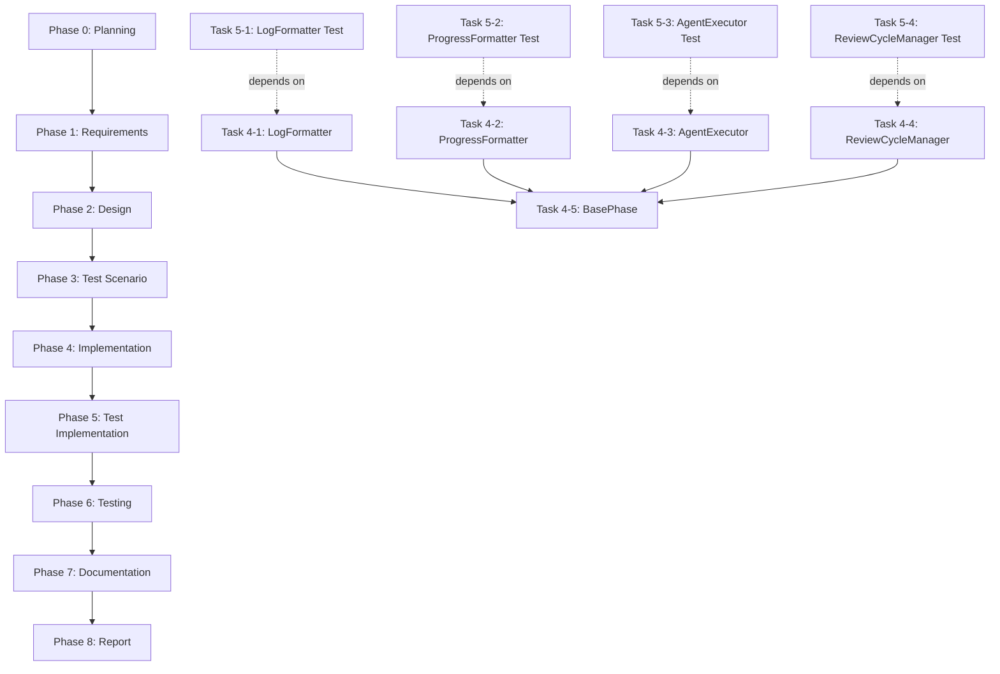

# プロジェクト計画書 - Issue #23

## 1. Issue分析

### 複雑度: 複雑

**判定理由**:
- **アーキテクチャ変更**: 1419行の巨大なクラスを複数のモジュールに分割する大規模なリファクタリング
- **影響範囲**: すべてのフェーズクラス（10個）が BasePhase に依存しており、リファクタリングによる影響範囲が広い
- **責務分離**: エージェント実行、レビューサイクル、進捗表示、ログフォーマットという4つの独立した責務を抽出
- **テスト要件**: 既存のすべてのフェーズ実行テストがパスする必要があり、リグレッション防止が必須
- **リスク**: 既存の動作を保ちながら内部構造を大幅に変更するため、予期しない副作用のリスクが高い

### 見積もり工数: 20~28時間

**根拠**:
- **Phase 1 (要件定義)**: 2~3h - 既存コードの責務分析、モジュール境界の明確化
- **Phase 2 (設計)**: 4~6h - 各モジュールのインターフェース設計、依存関係の整理
- **Phase 3 (テストシナリオ)**: 2~3h - リグレッションテストシナリオの策定
- **Phase 4 (実装)**: 6~8h - 4つのモジュール作成 + BasePhase の分割
- **Phase 5 (テストコード実装)**: 2~3h - ユニットテスト・インテグレーションテストの作成
- **Phase 6 (テスト実行)**: 1~2h - 全フェーズ実行テストの検証
- **Phase 7 (ドキュメント)**: 2~2h - ARCHITECTURE.md と CLAUDE.md の更新
- **Phase 8 (レポート)**: 1~1h - 実装レポートの作成

### リスク評価: 高

**理由**:
- **既存動作への影響**: すべてのフェーズクラスに影響するため、リグレッションのリスクが高い
- **テスト網羅性**: 既存テストが不十分な場合、見逃しが発生する可能性
- **コード行数目標**: 300行以下という厳しい目標達成が困難な可能性
- **暗黙的な依存関係**: 1419行の中に隠れた依存関係が存在する可能性

---

## 2. 実装戦略判断

### 実装戦略: REFACTOR

**判断根拠**:
- **既存コードの構造改善**: base-phase.ts (1419行) の責務を分離し、保守性を向上
- **新規機能追加なし**: 機能追加ではなく、既存機能の内部構造を改善
- **インターフェースの維持**: フェーズクラス（PlanningPhase等）への影響を最小化し、既存のAPIを維持
- **モジュール抽出パターン**: Extract Class、Extract Module の適用

### テスト戦略: UNIT_INTEGRATION

**判断根拠**:
- **UNIT**: 各モジュール（AgentExecutor、ReviewCycleManager、ProgressFormatter、LogFormatter）の単体動作検証
  - AgentExecutor: エージェント実行ロジック単体のテスト
  - ReviewCycleManager: レビューサイクル管理ロジックのテスト
  - ProgressFormatter: 進捗表示フォーマットのテスト
  - LogFormatter: ログフォーマット変換のテスト
- **INTEGRATION**: 全フェーズ実行テストによるエンドツーエンド検証
  - 既存の `tests/integration/preset-execution.test.ts` を活用
  - BasePhase と各モジュールの連携動作を検証
  - レビューサイクル、Git コミット、進捗表示の統合動作を確認
- **BDD不要**: ユーザーストーリーベースのテストは不要（内部リファクタリングのため）

### テストコード戦略: CREATE_TEST

**判断根拠**:
- **新規テストファイル作成**: 新規モジュール用のユニットテストを作成
  - `tests/unit/phases/core/agent-executor.test.ts`
  - `tests/unit/phases/core/review-cycle-manager.test.ts`
  - `tests/unit/phases/formatters/progress-formatter.test.ts`
  - `tests/unit/phases/formatters/log-formatter.test.ts`
- **既存テスト活用**: 既存の統合テスト（`preset-execution.test.ts`、`step-commit-push.test.ts`等）はそのまま利用し、リグレッション検証に使用
- **テスト拡張不要**: 既存テストファイルの変更は最小限に抑え、新規テストで補完

---

## 3. 影響範囲分析

### 既存コードへの影響

#### 変更が必要なファイル（コア）
- `src/phases/base-phase.ts` - メインの分割対象（1419行 → 300行以下に削減）
- `src/phases/planning.ts` - BasePhase 継承クラス（import 追加の可能性）
- `src/phases/requirements.ts` - 同上
- `src/phases/design.ts` - 同上
- `src/phases/test-scenario.ts` - 同上
- `src/phases/implementation.ts` - 同上
- `src/phases/test-implementation.ts` - 同上
- `src/phases/testing.ts` - 同上
- `src/phases/documentation.ts` - 同上
- `src/phases/report.ts` - 同上
- `src/phases/evaluation.ts` - 同上

#### 新規作成ファイル
- `src/phases/core/agent-executor.ts` - エージェント実行ロジック（約200~250行）
- `src/phases/core/review-cycle-manager.ts` - レビューサイクル管理（約150~200行）
- `src/phases/formatters/progress-formatter.ts` - 進捗表示フォーマット（約200~250行）
- `src/phases/formatters/log-formatter.ts` - ログフォーマット（約300~400行）

#### 影響を受けるテストファイル
- 既存の統合テスト（`tests/integration/` 配下）は変更不要（リグレッション検証に利用）
- 新規ユニットテスト（`tests/unit/phases/` 配下）を作成

### 依存関係の変更

#### 新規依存の追加
- **なし** - 既存の依存関係を維持

#### 既存依存の変更
- BasePhase の内部実装を変更するが、外部インターフェースは維持
- フェーズクラスから見た BasePhase の使用方法は変更なし

### マイグレーション要否

- **データベーススキーマ変更**: なし
- **設定ファイル変更**: なし
- **環境変数変更**: なし
- **メタデータ構造変更**: なし（`.ai-workflow/issue-*/metadata.json` は変更なし）

---

## 4. タスク分割

### Phase 1: 要件定義 (見積もり: 2~3h)

- [x] Task 1-1: base-phase.ts の責務分析 (1~1.5h)
  - 各メソッドの責務を洗い出し（execute, review, revise, format系, log系）
  - モジュール境界の候補を抽出
  - 依存関係マップの作成
- [x] Task 1-2: モジュール分割要件の定義 (1~1.5h)
  - AgentExecutor の責務明確化（execute/review/revise 実行）
  - ReviewCycleManager の責務明確化（リトライロジック、依存関係チェック）
  - ProgressFormatter の責務明確化（コンソール出力整形）
  - LogFormatter の責務明確化（Codex/Claude ログ変換）
  - 各モジュールのインターフェース仕様（public メソッド）を定義

### Phase 2: 設計 (見積もり: 4~6h)

- [x] Task 2-1: モジュール間インターフェース設計 (2~3h)
  - AgentExecutor のインターフェース定義（executeTask, runAgentTask）
  - ReviewCycleManager のインターフェース定義（performReviewCycle, performReviseStepWithRetry）
  - ProgressFormatter のインターフェース定義（formatProgressComment）
  - LogFormatter のインターフェース定義（formatAgentLog, formatCodexAgentLog）
  - 各モジュールの依存関係整理（BasePhase との関係）
- [x] Task 2-2: BasePhase オーケストレーション設計 (2~3h)
  - run() メソッドの再設計（各モジュールの呼び出し順序）
  - 各モジュールへの依存注入設計
  - エラーハンドリング方針の策定
  - 行数削減計画（1419行 → 300行以下）の詳細化

### Phase 3: テストシナリオ (見積もり: 2~3h)

- [x] Task 3-1: ユニットテストシナリオ策定 (1~1.5h)
  - AgentExecutor のテストシナリオ（成功、失敗、フォールバック）
  - ReviewCycleManager のテストシナリオ（リトライ成功、最大リトライ到達）
  - ProgressFormatter のテストシナリオ（各フェーズのステータス表示）
  - LogFormatter のテストシナリオ（Codex/Claude ログ変換）
- [x] Task 3-2: インテグレーションテストシナリオ策定 (1~1.5h)
  - 全フェーズ実行テストのリグレッション検証
  - レビューサイクル動作確認
  - Git コミット・プッシュ連携確認
  - エージェントログフォーマット維持確認

### Phase 4: 実装 (見積もり: 6~8h)

- [x] Task 4-1: LogFormatter の実装 (1.5~2h)
  - formatAgentLog メソッドの抽出
  - formatCodexAgentLog メソッドの抽出
  - Claude ログフォーマットロジックの移行
  - Codex ログフォーマットロジックの移行
- [x] Task 4-2: ProgressFormatter の実装 (1.5~2h)
  - formatProgressComment メソッドの抽出
  - フェーズステータス表示ロジックの移行
  - GitHub コメントフォーマットロジックの移行
- [x] Task 4-3: AgentExecutor の実装 (1.5~2h)
  - executeWithAgent メソッドの抽出
  - runAgentTask メソッドの抽出
  - エージェントフォールバックロジックの移行
  - 利用量メトリクス抽出・記録ロジックの移行
- [x] Task 4-4: ReviewCycleManager の実装 (1~1.5h)
  - performReviewCycle メソッドの抽出
  - performReviseStepWithRetry メソッドの抽出
  - リトライカウント管理ロジックの移行
  - 依存関係検証ロジックの移行
- [x] Task 4-5: BasePhase のリファクタリング (0.5~0.5h)
  - 各モジュールのインポート追加
  - run() メソッドのオーケストレーション化
  - 不要なメソッドの削除
  - 行数確認（300行以下達成）

### Phase 5: テストコード実装 (見積もり: 2~3h)

- [x] Task 5-1: LogFormatter ユニットテスト作成 (0.5~0.75h)
  - tests/unit/phases/formatters/log-formatter.test.ts の作成
  - Codex ログフォーマットテスト
  - Claude ログフォーマットテスト
- [x] Task 5-2: ProgressFormatter ユニットテスト作成 (0.5~0.75h)
  - tests/unit/phases/formatters/progress-formatter.test.ts の作成
  - フェーズステータス表示テスト
  - GitHub コメントフォーマットテスト
- [x] Task 5-3: AgentExecutor ユニットテスト作成 (0.5~0.75h)
  - tests/unit/phases/core/agent-executor.test.ts の作成
  - エージェント実行成功テスト
  - エージェントフォールバックテスト
- [x] Task 5-4: ReviewCycleManager ユニットテスト作成 (0.5~0.75h)
  - tests/unit/phases/core/review-cycle-manager.test.ts の作成
  - レビューサイクルリトライテスト
  - 最大リトライ到達テスト

### Phase 6: テスト実行 (見積もり: 1~2h)

- [x] Task 6-1: ユニットテスト実行 (0.5~1h)
  - npm run test:unit の実行
  - 新規ユニットテストの合格確認
  - カバレッジ確認（80%以上を目標）
- [ ] Task 6-2: インテグレーションテスト実行 (0.5~1h)
  - npm run test:integration の実行
  - 既存統合テストの合格確認（リグレッション検証）
  - 全フェーズ実行テストの動作確認

### Phase 7: ドキュメント (見積もり: 2~2h)

- [x] Task 7-1: ARCHITECTURE.md の更新 (1~1h)
  - BasePhase のライフサイクルセクション更新
  - 新規モジュールの説明追加（AgentExecutor、ReviewCycleManager、ProgressFormatter、LogFormatter）
  - モジュール一覧表への追加
- [x] Task 7-2: CLAUDE.md の更新 (1~1h)
  - アーキテクチャセクションの更新
  - BasePhase の行数削減（1419行 → 300行以下）を記載
  - 各モジュールの役割説明追加

### Phase 8: レポート (見積もり: 1~1h)

- [x] Task 8-1: 実装レポート作成 (1~1h)
  - リファクタリング結果のサマリー作成
  - 行数削減達成状況の報告
  - テスト結果のサマリー
  - PR ボディ生成

---

## 5. 依存関係

### タスク間の依存関係詳細

#### Phase 4 (実装) 内の依存関係
- Task 4-1 〜 4-4（各モジュール実装）は並行実行可能
- Task 4-5（BasePhase リファクタリング）は Task 4-1 〜 4-4 完了後に実行（すべてのモジュールが揃っている必要がある）

#### Phase 5 (テストコード実装) 内の依存関係
- 各テストタスクは対応する実装タスク完了後に実行可能
- テストタスク間は並行実行可能

---

## 6. リスクと軽減策

### リスク1: 暗黙的な依存関係の見逃し

- **影響度**: 高
- **確率**: 中
- **軽減策**:
  - Phase 1 で徹底的なコード分析を実施（すべてのメソッド、プライベート変数の洗い出し）
  - Phase 4 実装時に段階的にリファクタリング（モジュール単位で分離し、都度テスト実行）
  - 既存の統合テストを頻繁に実行し、早期にリグレッションを検出

### リスク2: 行数削減目標（300行以下）の未達成

- **影響度**: 中
- **確率**: 中
- **軽減策**:
  - Phase 2 で詳細な行数削減計画を策定（各モジュールへの移行行数を見積もり）
  - Task 4-5 実装後に行数を確認し、未達成の場合は追加モジュール抽出を検討
  - 必要に応じて、ヘルパーメソッドをさらに分離（例: `formatters/issue-formatter.ts`）

### リスク3: テストカバレッジ不足によるリグレッション

- **影響度**: 高
- **確率**: 低
- **軽減策**:
  - 既存の統合テスト（`tests/integration/`）を全て実行し、リグレッション検証
  - Phase 5 で各モジュールのユニットテストを作成し、カバレッジ80%以上を目標
  - Phase 6 で手動テストも実施（実際にワークフローを実行し、ログフォーマット、進捗表示を目視確認）

### リスク4: フェーズクラスへの影響

- **影響度**: 中
- **確率**: 低
- **軽減策**:
  - BasePhase の public インターフェースを維持（既存のメソッドシグネチャは変更しない）
  - フェーズクラス（PlanningPhase 等）からの呼び出し方法を変更しない
  - Phase 6 で全フェーズの実行テストを実施し、動作確認

### リスク5: Codex/Claude エージェントログのフォーマット変更

- **影響度**: 中
- **確率**: 低
- **軽減策**:
  - LogFormatter モジュールでロジックを完全に移行（コピー＆ペーストではなく、慎重に抽出）
  - Phase 5 でログフォーマットのユニットテストを作成（既存のログサンプルを使用）
  - Phase 6 で実際のエージェント実行ログを確認

---

## 7. 品質ゲート

### Phase 1: 要件定義

- [x] 責務分析ドキュメントが作成されている（各メソッドの責務が明記）
- [x] モジュール境界が明確に定義されている（4つのモジュールの役割が明記）
- [x] 依存関係マップが作成されている（各モジュール間の依存関係が図示）
- [x] モジュール分割要件が明確に記載されている（各モジュールの public インターフェースが定義）

### Phase 2: 設計

- [x] 実装戦略の判断根拠が明記されている（REFACTOR）
- [x] テスト戦略の判断根拠が明記されている（UNIT_INTEGRATION）
- [x] 各モジュールのインターフェース設計が完成している（メソッドシグネチャ、引数、戻り値）
- [x] BasePhase オーケストレーション設計が完成している（run() メソッドの擬似コード）
- [x] 行数削減計画が詳細化されている（各モジュールへの移行行数見積もり）
- [x] エラーハンドリング方針が策定されている

### Phase 3: テストシナリオ

- [x] ユニットテストシナリオが4つのモジュール分作成されている
- [x] インテグレーションテストシナリオが作成されている（リグレッション検証項目）
- [x] 各テストシナリオに期待値が明記されている
- [x] テストカバレッジ目標が設定されている（80%以上）

### Phase 4: 実装

- [x] LogFormatter モジュールが作成され、ログフォーマットロジックが移行されている
- [x] ProgressFormatter モジュールが作成され、進捗表示ロジックが移行されている
- [x] AgentExecutor モジュールが作成され、エージェント実行ロジックが移行されている
- [x] ReviewCycleManager モジュールが作成され、レビューサイクルロジックが移行されている
- [x] BasePhase が300行以下に削減されている
- [x] 既存のフェーズクラスへの影響が最小限に抑えられている（import 追加のみ）
- [x] TypeScript コンパイルエラーがない（npm run build が成功）

### Phase 5: テストコード実装

- [x] LogFormatter ユニットテストが作成されている
- [x] ProgressFormatter ユニットテストが作成されている
- [x] AgentExecutor ユニットテストが作成されている
- [x] ReviewCycleManager ユニットテストが作成されている
- [x] すべてのユニットテストが合格している（npm run test:unit）

### Phase 6: テスト実行

- [x] すべてのユニットテストがパスしている
- [ ] すべての統合テストがパスしている（リグレッション検証完了）
- [x] カバレッジが80%以上達成されている
- [ ] 手動テスト結果が記録されている（ログフォーマット、進捗表示の確認）

### Phase 7: ドキュメント

- [x] ARCHITECTURE.md が更新されている（新規モジュールの説明追加）
- [x] CLAUDE.md が更新されている（行数削減達成状況記載）
- [x] 各モジュールの役割が明確にドキュメント化されている

### Phase 8: レポート

- [ ] リファクタリング結果がサマリー化されている
- [ ] 行数削減達成状況が報告されている（1419行 → X行）
- [ ] テスト結果がサマリー化されている（ユニット/統合テストの合格率、カバレッジ）
- [ ] PR ボディが生成されている

---

## 8. 補足事項

### コード品質基準

- **TypeScript Strict Mode**: すべてのコードは `strict: true` でコンパイルエラーがないこと
- **ESLint**: コーディング規約に従う（既存のスタイルを維持）
- **命名規則**: クラス名はPascalCase、メソッド名はcamelCase、ファイル名はkebab-case
- **コメント**: 各モジュールのファイル冒頭にモジュールの役割を記載

### リファクタリング原則

- **Single Responsibility Principle (SRP)**: 各モジュールは単一の責務を持つ
- **Open/Closed Principle (OCP)**: 拡張に対して開いており、修正に対して閉じている
- **Dependency Inversion Principle (DIP)**: 具象ではなく抽象に依存する（インターフェース経由で連携）

### モジュール設計方針

- **AgentExecutor**: エージェント実行に関する責務のみ（execute/review/revise の実行、フォールバック）
- **ReviewCycleManager**: レビューサイクル管理に関する責務のみ（リトライロジック、依存関係チェック）
- **ProgressFormatter**: 進捗表示フォーマットに関する責務のみ（GitHub コメント生成）
- **LogFormatter**: ログフォーマットに関する責務のみ（Codex/Claude ログの Markdown 変換）

### 行数削減目標の詳細

**現状**: base-phase.ts = 1419行

**目標**: base-phase.ts = 300行以下

**削減対象**:
- formatAgentLog 関連（約200行） → LogFormatter へ
- formatCodexAgentLog 関連（約220行） → LogFormatter へ
- formatProgressComment 関連（約130行） → ProgressFormatter へ
- executeWithAgent、runAgentTask 関連（約150行） → AgentExecutor へ
- performReviewCycle、performReviseStepWithRetry 関連（約190行） → ReviewCycleManager へ
- extractUsageMetrics、recordUsageMetrics（約70行） → AgentExecutor へ

**期待削減量**: 約960行 → 残り約460行

**さらなる削減施策**（必要に応じて）:
- ヘルパーメソッドの分離（例: `formatters/issue-formatter.ts` に formatIssueInfo を移動）
- ファイル参照関連メソッドの分離（例: `utils/file-reference-resolver.ts`）

---

## 9. 成功基準

このリファクタリングが成功したと判断する基準：

1. **行数削減達成**: base-phase.ts が300行以下に削減されている
2. **テスト合格**: すべてのユニットテスト・インテグレーションテストがパスしている
3. **リグレッションゼロ**: 既存のフェーズ実行動作に変更がない（ログフォーマット、進捗表示、レビューサイクルが正常動作）
4. **保守性向上**: 各モジュールが単一の責務を持ち、コードの見通しが良くなっている
5. **ドキュメント更新**: ARCHITECTURE.md、CLAUDE.md が最新化されている

---

## 10. 参考情報

- **Issue #1**: 親Issue（全体のアーキテクチャ改善）
- **base-phase.ts**: 現在1419行（リファクタリング対象）
- **既存テスト**: tests/integration/ 配下の統合テストを活用
- **TypeScript設定**: tsconfig.json（strict mode有効）
- **ビルドスクリプト**: npm run build（tsc + copy-static-assets.mjs）
