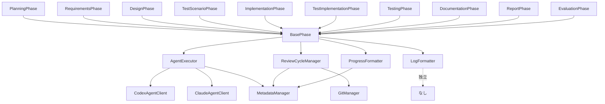

# 要件定義書 - Issue #23: BasePhase アーキテクチャの分割

## 0. Planning Document の確認

Planning Phase で策定された開発計画を確認しました。以下の重要事項を踏まえて要件定義を実施します：

### 計画の要約
- **複雑度**: 複雑（大規模リファクタリング、アーキテクチャ変更）
- **見積もり工数**: 20~28時間（8フェーズ）
- **実装戦略**: REFACTOR（既存コードの構造改善）
- **テスト戦略**: UNIT_INTEGRATION（各モジュールのユニットテスト + エンドツーエンド検証）
- **リスク評価**: 高（既存動作への影響、テスト網羅性、行数削減目標達成）

### 主要なリスクと軽減策
1. **暗黙的な依存関係の見逃し** → 徹底的なコード分析、段階的リファクタリング
2. **行数削減目標（300行以下）の未達成** → 詳細な行数削減計画、追加モジュール抽出の検討
3. **テストカバレッジ不足** → 既存統合テスト活用、80%以上のカバレッジ目標
4. **フェーズクラスへの影響** → public インターフェース維持、呼び出し方法の変更なし

---

## 1. 概要

### 背景
現在の `src/phases/base-phase.ts` は1420行にわたる巨大なクラスであり、以下の課題が存在します：

- **複数の責務が混在**: エージェント実行、レビューサイクル管理、進捗表示フォーマット、ログフォーマットなど、独立した責務が一つのクラスに混在
- **保守性の低下**: 行数が多いため、コードの見通しが悪く、バグ修正や機能追加が困難
- **テスタビリティの低下**: 責務が密結合しており、個別の機能をテストすることが困難
- **Single Responsibility Principle (SRP) 違反**: 一つのクラスが複数の理由で変更される状態

### 目的
`BasePhase` クラスを**300行以下**に削減し、各責務を独立したモジュールに分割することで、以下を実現します：

1. **保守性の向上**: 各モジュールが単一の責務を持ち、コードの見通しが良くなる
2. **テスタビリティの向上**: 各モジュールを独立してテスト可能にする
3. **拡張性の向上**: 新機能の追加が容易になる
4. **リグレッションゼロ**: 既存のフェーズ実行動作に影響を与えない

### ビジネス価値
- **開発速度の向上**: コードの見通しが良くなることで、バグ修正や機能追加の時間を短縮
- **品質の向上**: テスタビリティの向上により、バグの早期発見・修正が可能
- **技術的負債の削減**: アーキテクチャの改善により、将来的なメンテナンスコストを削減

### 技術的価値
- **アーキテクチャの改善**: SOLID原則（特にSRP、DIP）に準拠した設計
- **コード品質の向上**: 行数削減、責務の明確化、依存関係の整理
- **ドキュメント改善**: ARCHITECTURE.md、CLAUDE.md の更新により、開発者の理解を促進

---

## 2. 機能要件

### FR-1: LogFormatter モジュールの作成
**優先度**: 高

**説明**: エージェントログのフォーマット変換を担当する独立モジュールを作成します。

**詳細要件**:
- **FR-1.1**: `src/phases/formatters/log-formatter.ts` を新規作成
- **FR-1.2**: `formatAgentLog()` メソッドを実装（約200行のロジックを移行）
  - Codex/Claude の生ログを Markdown 形式に変換
  - 実行時間、開始/終了時刻、エラー情報を含むサマリーを生成
- **FR-1.3**: `formatCodexAgentLog()` メソッドを実装（約220行のロジックを移行）
  - JSON イベントストリームを解析
  - ターンごとの内訳（スレッド開始、ツール実行、実行完了）を Markdown 化
  - 4000文字を超える出力は切り詰め（truncate）
- **FR-1.4**: ファイル冒頭にモジュールの役割を記載したコメントを追加
- **FR-1.5**: 既存の `base-phase.ts` から該当ロジックを削除し、LogFormatter を使用するよう変更

**成功基準**:
- LogFormatter が Codex/Claude の生ログを正しく Markdown に変換できること
- 既存のエージェント実行ログフォーマットが維持されること

---

### FR-2: ProgressFormatter モジュールの作成
**優先度**: 高

**説明**: 進捗表示フォーマットを担当する独立モジュールを作成します。

**詳細要件**:
- **FR-2.1**: `src/phases/formatters/progress-formatter.ts` を新規作成
- **FR-2.2**: `formatProgressComment()` メソッドを実装（約130行のロジックを移行）
  - フェーズステータス（pending/in_progress/completed/failed）に応じた絵文字表示
  - 全フェーズの進捗状況リスト
  - 現在のフェーズ詳細（ステータス、開始時刻、試行回数）
  - 完了したフェーズの詳細（折りたたみ表示）
  - 最終更新時刻
- **FR-2.3**: ファイル冒頭にモジュールの役割を記載したコメントを追加
- **FR-2.4**: 既存の `base-phase.ts` から該当ロジックを削除し、ProgressFormatter を使用するよう変更

**成功基準**:
- ProgressFormatter が GitHub Issue コメントを正しくフォーマットできること
- 既存の進捗表示フォーマットが維持されること

---

### FR-3: AgentExecutor モジュールの作成
**優先度**: 高

**説明**: エージェント実行ロジックを担当する独立モジュールを作成します。

**詳細要件**:
- **FR-3.1**: `src/phases/core/agent-executor.ts` を新規作成
- **FR-3.2**: `executeWithAgent()` メソッドを実装（約55行のロジックを移行）
  - プライマリエージェント（Codex または Claude）の実行
  - 認証エラー時のフォールバック処理
  - 空出力時のフォールバック処理
- **FR-3.3**: `runAgentTask()` メソッドを実装（約60行のロジックを移行）
  - プロンプトファイルの保存
  - エージェントタスクの実行（`agent.executeTask()` 呼び出し）
  - 生ログの保存（`agent_log_raw.txt`）
  - フォーマット済みログの保存（`agent_log.md`）
  - 認証失敗検出（"invalid bearer token" 等のパターンマッチ）
- **FR-3.4**: `extractUsageMetrics()` メソッドを実装（約65行のロジックを移行）
  - JSON メッセージから利用量メトリクス（input_tokens、output_tokens、total_cost_usd）を抽出
  - 正規表現によるフォールバック解析
- **FR-3.5**: `recordUsageMetrics()` メソッドを実装（約10行のロジックを移行）
  - メトリクスをメタデータに記録（`metadata.addCost()` 呼び出し）
- **FR-3.6**: ファイル冒頭にモジュールの役割を記載したコメントを追加
- **FR-3.7**: 既存の `base-phase.ts` から該当ロジックを削除し、AgentExecutor を使用するよう変更

**成功基準**:
- AgentExecutor が Codex/Claude エージェントを正しく実行できること
- 認証エラー時に代替エージェントへのフォールバックが動作すること
- 利用量メトリクスが正しく抽出・記録されること

---

### FR-4: ReviewCycleManager モジュールの作成
**優先度**: 高

**説明**: レビューサイクル管理を担当する独立モジュールを作成します。

**詳細要件**:
- **FR-4.1**: `src/phases/core/review-cycle-manager.ts` を新規作成
- **FR-4.2**: `performReviewCycle()` メソッドを実装（約120行のロジックを移行）
  - レビュー実行（`review()` メソッド呼び出し）
  - レビュー失敗時の revise ステップ実行
  - 最大リトライ回数（3回）のチェック
  - リトライカウントの更新
  - 成功/失敗の判定とログ出力
- **FR-4.3**: `performReviseStepWithRetry()` メソッドを実装（約80行のロジックを移行）
  - revise ステップの実行（リトライ付き）
  - Git コミット＆プッシュ（ステップ単位）
  - レビュー再実行
  - 完了ステップの更新
- **FR-4.4**: ファイル冒頭にモジュールの役割を記載したコメントを追加
- **FR-4.5**: 既存の `base-phase.ts` から該当ロジックを削除し、ReviewCycleManager を使用するよう変更

**成功基準**:
- ReviewCycleManager がレビューサイクルを正しく管理できること
- 最大リトライ回数（3回）が守られること
- revise ステップが正しく実行され、Git コミット＆プッシュが動作すること

---

### FR-5: BasePhase のリファクタリング
**優先度**: 高

**説明**: BasePhase クラスを各モジュールのオーケストレーションのみを担当するよう再設計します。

**詳細要件**:
- **FR-5.1**: 各モジュール（LogFormatter、ProgressFormatter、AgentExecutor、ReviewCycleManager）のインポート追加
- **FR-5.2**: `run()` メソッドのオーケストレーション化
  - 依存関係チェック（既存ロジック維持）
  - execute ステップ → AgentExecutor 呼び出し
  - review ステップ → ReviewCycleManager 呼び出し
  - revise ステップ → ReviewCycleManager 呼び出し
- **FR-5.3**: 不要なメソッドの削除
  - `formatAgentLog()`、`formatCodexAgentLog()` → LogFormatter へ移動済み
  - `formatProgressComment()` → ProgressFormatter へ移動済み
  - `executeWithAgent()`、`runAgentTask()` → AgentExecutor へ移動済み
  - `extractUsageMetrics()`、`recordUsageMetrics()` → AgentExecutor へ移動済み
  - `performReviewCycle()`、`performReviseStepWithRetry()` → ReviewCycleManager へ移動済み
- **FR-5.4**: 行数を**300行以下**に削減（目標: 約460行から更に削減）
- **FR-5.5**: TypeScript strict mode でコンパイルエラーがないこと
- **FR-5.6**: 既存の public インターフェースを維持（フェーズクラスへの影響を最小化）

**成功基準**:
- BasePhase が300行以下に削減されていること
- TypeScript コンパイルエラーがないこと（`npm run build` が成功）
- 既存のフェーズクラス（PlanningPhase 等）への影響が最小限であること

---

### FR-6: 既存フェーズクラスへの影響最小化
**優先度**: 高

**説明**: 既存の10個のフェーズクラスへの影響を最小化します。

**詳細要件**:
- **FR-6.1**: フェーズクラス（`planning.ts`, `requirements.ts`, `design.ts`, `test-scenario.ts`, `implementation.ts`, `test-implementation.ts`, `testing.ts`, `documentation.ts`, `report.ts`, `evaluation.ts`）への変更は import 追加のみに留める
- **FR-6.2**: BasePhase の public メソッド（`execute()`, `review()`, `run()` 等）のシグネチャを変更しない
- **FR-6.3**: BasePhase の protected メソッド（`loadPrompt()`, `getIssueInfo()`, `postOutput()` 等）のシグネチャを変更しない

**成功基準**:
- 既存のフェーズクラスが BasePhase の変更に影響されないこと
- フェーズクラスのコンパイルエラーがないこと

---

## 3. 非機能要件

### NFR-1: パフォーマンス要件
- **NFR-1.1**: リファクタリング後も、フェーズ実行時間は現状と同等であること（±10%以内）
- **NFR-1.2**: モジュール化によるオーバーヘッドは無視できる程度であること（1ミリ秒未満）

### NFR-2: セキュリティ要件
- **NFR-2.1**: エージェント認証情報の取り扱いは現状と同等のセキュリティレベルを維持すること
- **NFR-2.2**: ログファイルに機密情報（API キー等）が含まれないこと

### NFR-3: 可用性・信頼性要件
- **NFR-3.1**: リファクタリング後も、既存の統合テスト（`tests/integration/preset-execution.test.ts` 等）が100%パスすること
- **NFR-3.2**: エージェントフォールバック機能が正常に動作すること（Codex → Claude）
- **NFR-3.3**: レビューサイクル（最大3回リトライ）が正常に動作すること

### NFR-4: 保守性・拡張性要件
- **NFR-4.1**: 各モジュールは単一の責務を持ち、Single Responsibility Principle (SRP) に準拠すること
- **NFR-4.2**: 各モジュールは独立してテスト可能であること（依存関係注入を活用）
- **NFR-4.3**: コード品質基準を満たすこと
  - TypeScript Strict Mode 有効
  - ESLint ルール準拠
  - 命名規則遵守（クラス名: PascalCase、メソッド名: camelCase、ファイル名: kebab-case）
- **NFR-4.4**: 各モジュールのファイル冒頭にモジュールの役割を記載したコメントが存在すること

### NFR-5: テスト要件
- **NFR-5.1**: 新規モジュール（LogFormatter、ProgressFormatter、AgentExecutor、ReviewCycleManager）のユニットテストカバレッジが80%以上であること
- **NFR-5.2**: 既存の統合テスト（`tests/integration/` 配下）が全てパスすること
- **NFR-5.3**: リグレッションテストにより、既存動作が維持されていることを確認すること

---

## 4. 制約事項

### 技術的制約
- **TC-1**: TypeScript 5.x を使用すること
- **TC-2**: Node.js 20以上で動作すること
- **TC-3**: 既存の依存関係（`fs-extra`, `simple-git`, `@octokit/rest`, `openai` 等）を維持すること
- **TC-4**: ビルドツール（`tsc`, `copy-static-assets.mjs`）の変更は不要であること
- **TC-5**: 既存のディレクトリ構造（`src/phases/`, `src/core/`, `src/prompts/` 等）を維持すること

### リソース制約
- **RC-1**: 実装工数は20~28時間を目安とすること（Planning Phase の見積もりに基づく）
- **RC-2**: Phase 4（実装）は6~8時間を目安とすること
- **RC-3**: 行数削減目標（300行以下）を達成すること

### ポリシー制約
- **PC-1**: SOLID原則（特にSRP、DIP）に準拠すること
- **PC-2**: 既存のコーディング規約（ESLint ルール）を遵守すること
- **PC-3**: コメントは日本語で記述すること（既存コードに合わせる）

---

## 5. 前提条件

### システム環境
- Node.js 20以上がインストールされていること
- npm 10以上がインストールされていること
- Git がインストールされていること

### 依存コンポーネント
- `src/core/metadata-manager.ts`: メタデータ管理
- `src/core/codex-agent-client.ts`: Codex エージェントクライアント
- `src/core/claude-agent-client.ts`: Claude エージェントクライアント
- `src/core/github-client.ts`: GitHub API クライアント
- `src/core/git-manager.ts`: Git 操作マネージャー
- `src/types.ts`: 型定義（PhaseName、PhaseStatus、PhaseExecutionResult 等）

### 外部システム連携
- GitHub API（Issue コメント投稿、PR 管理）
- Codex API（エージェント実行）
- Claude Code SDK（エージェント実行）

---

## 6. 受け入れ基準

### AC-1: LogFormatter モジュール作成
**Given**: Codex/Claude エージェントが生ログを出力した
**When**: LogFormatter が生ログをフォーマットする
**Then**:
- Markdown 形式のログが生成される
- ターンごとの内訳（スレッド開始、ツール実行、実行完了）が含まれる
- 実行時間、開始/終了時刻、エラー情報が含まれる
- 既存のログフォーマットと同一である

### AC-2: ProgressFormatter モジュール作成
**Given**: フェーズが実行中または完了した
**When**: ProgressFormatter が進捗状況をフォーマットする
**Then**:
- GitHub Issue コメントが正しくフォーマットされる
- フェーズステータスに応じた絵文字が表示される
- 全フェーズの進捗状況リストが含まれる
- 現在のフェーズ詳細（ステータス、開始時刻、試行回数）が含まれる
- 完了したフェーズの詳細が折りたたみ表示される

### AC-3: AgentExecutor モジュール作成
**Given**: フェーズが execute ステップを実行する
**When**: AgentExecutor がエージェントを実行する
**Then**:
- プライマリエージェント（Codex または Claude）が実行される
- 認証エラー時に代替エージェントへフォールバックする
- 空出力時に代替エージェントへフォールバックする
- 利用量メトリクス（input_tokens、output_tokens、total_cost_usd）が正しく抽出・記録される

### AC-4: ReviewCycleManager モジュール作成
**Given**: フェーズが review ステップを実行する
**When**: ReviewCycleManager がレビューサイクルを管理する
**Then**:
- レビューが実行される
- レビュー失敗時に revise ステップが実行される
- 最大リトライ回数（3回）に達するまでリトライされる
- 各ステップ完了後に Git コミット＆プッシュが実行される
- revise 成功後にレビューが再実行される

### AC-5: BasePhase リファクタリング
**Given**: BasePhase が各モジュールを使用する
**When**: BasePhase の run() メソッドが実行される
**Then**:
- BasePhase が300行以下に削減されている
- TypeScript コンパイルエラーがない（`npm run build` が成功）
- 既存の public/protected インターフェースが維持されている
- 依存関係チェックが正常に動作する
- execute/review/revise ステップが正常に実行される

### AC-6: 既存フェーズクラスへの影響最小化
**Given**: 既存のフェーズクラス（10個）が存在する
**When**: BasePhase がリファクタリングされる
**Then**:
- フェーズクラスへの変更が import 追加のみである
- フェーズクラスのコンパイルエラーがない
- 全フェーズ実行テストがパスする（`tests/integration/preset-execution.test.ts`）

### AC-7: ユニットテスト作成
**Given**: 新規モジュール（4つ）が作成された
**When**: ユニットテストが実行される（`npm run test:unit`）
**Then**:
- LogFormatter のユニットテストがパスする
- ProgressFormatter のユニットテストがパスする
- AgentExecutor のユニットテストがパスする
- ReviewCycleManager のユニットテストがパスする
- カバレッジが80%以上である

### AC-8: インテグレーションテスト
**Given**: 既存の統合テストが存在する
**When**: 統合テストが実行される（`npm run test:integration`）
**Then**:
- 全ての統合テスト（`tests/integration/` 配下）がパスする
- 全フェーズ実行テストがパスする（`preset-execution.test.ts`）
- レビューサイクルが正常動作する
- Git コミット＆プッシュが正常動作する

### AC-9: ドキュメント更新
**Given**: リファクタリングが完了した
**When**: ドキュメントが更新される
**Then**:
- ARCHITECTURE.md が更新されている（新規モジュールの説明追加）
- CLAUDE.md が更新されている（行数削減達成状況記載）
- 各モジュールの役割が明確にドキュメント化されている

### AC-10: リグレッションゼロ
**Given**: リファクタリングが完了した
**When**: 既存のワークフローを実行する
**Then**:
- エージェント実行が正常動作する（Codex/Claude）
- レビューサイクルが正常動作する（最大3回リトライ）
- 進捗表示が正常動作する（GitHub Issue コメント）
- ログフォーマットが維持される（Codex/Claude ログ）
- Git コミット＆プッシュが正常動作する

---

## 7. スコープ外

### 明確にスコープ外とする事項
1. **新機能の追加**: このリファクタリングは既存機能の内部構造改善に専念し、新機能の追加は行わない
2. **フェーズ実行ロジックの変更**: execute/review/revise の実行順序やロジックは変更しない
3. **メタデータ構造の変更**: `metadata.json` の構造変更は行わない
4. **プロンプトテンプレートの変更**: `src/prompts/` 配下のプロンプトは変更しない
5. **外部 API の変更**: GitHub API、Codex API、Claude Code SDK の使用方法は変更しない
6. **テストフレームワークの変更**: Jest の設定やテストユーティリティは変更しない
7. **ビルドシステムの変更**: `tsc`, `copy-static-assets.mjs` は変更しない
8. **Docker/Jenkins 設定の変更**: Dockerfile、Jenkinsfile は変更しない

### 将来的な拡張候補
1. **さらなるモジュール分離**: ヘルパーメソッドの分離（例: `formatters/issue-formatter.ts`、`utils/file-reference-resolver.ts`）
2. **依存関係注入の強化**: コンストラクタインジェクションによるテスタビリティ向上
3. **イベント駆動アーキテクチャ**: フェーズ間の疎結合化
4. **プラグインシステム**: カスタムフォーマッター、カスタムエージェントの追加

---

## 8. 付録

### A. 行数削減計画詳細

**現状**: `base-phase.ts` = 1420行

**削減対象**:
- `formatAgentLog()` 関連（約90行） → LogFormatter へ
- `formatCodexAgentLog()` 関連（約220行） → LogFormatter へ
- `formatProgressComment()` 関連（約130行） → ProgressFormatter へ
- `executeWithAgent()`, `runAgentTask()` 関連（約115行） → AgentExecutor へ
- `extractUsageMetrics()`, `recordUsageMetrics()` 関連（約75行） → AgentExecutor へ
- `performReviewCycle()`, `performReviseStepWithRetry()` 関連（約200行） → ReviewCycleManager へ

**期待削減量**: 約830行

**削減後**: 約590行

**さらなる削減施策**（300行以下達成のため）:
- ヘルパーメソッドの分離（`formatIssueInfo()`, `getPlanningDocumentReference()`, `getAgentFileReference()`, `buildOptionalContext()` 等） → 約200行削減
- 定数の外部化（`phaseDefinitions`, `statusEmoji` 等） → 約90行削減

**最終目標**: 約300行以下

### B. モジュール一覧

| モジュール | 役割 | 行数見積もり |
|-----------|------|-------------|
| `log-formatter.ts` | エージェントログのフォーマット変換 | 300~400行 |
| `progress-formatter.ts` | 進捗表示フォーマット | 200~250行 |
| `agent-executor.ts` | エージェント実行ロジック | 200~250行 |
| `review-cycle-manager.ts` | レビューサイクル管理 | 150~200行 |
| `base-phase.ts`（リファクタリング後） | オーケストレーション | 300行以下 |

### C. 依存関係図

### D. テストシナリオ概要

#### ユニットテスト
1. **LogFormatter**:
   - Codex ログフォーマット（JSON イベント解析）
   - Claude ログフォーマット（Markdown 変換）
   - エラー時のフォーマット

2. **ProgressFormatter**:
   - フェーズステータス表示（pending/in_progress/completed/failed）
   - GitHub コメントフォーマット
   - 完了フェーズの折りたたみ表示

3. **AgentExecutor**:
   - エージェント実行成功
   - 認証エラー時のフォールバック
   - 空出力時のフォールバック
   - 利用量メトリクス抽出

4. **ReviewCycleManager**:
   - レビューサイクルリトライ（1回目成功）
   - レビューサイクルリトライ（3回目成功）
   - 最大リトライ到達（失敗）

#### インテグレーションテスト
1. 全フェーズ実行テスト（`preset-execution.test.ts`）
2. レビューサイクル動作確認
3. Git コミット・プッシュ連携確認
4. エージェントログフォーマット維持確認

### E. 参考情報

- **Issue #1**: 親 Issue（全体のアーキテクチャ改善）
- **Planning Document**: `.ai-workflow/issue-23/00_planning/output/planning.md`
- **ARCHITECTURE.md**: アーキテクチャ設計思想
- **CLAUDE.md**: プロジェクト全体方針とコーディングガイドライン
- **既存テスト**: `tests/integration/` 配下の統合テスト
- **TypeScript 設定**: `tsconfig.json`（strict mode 有効）

---

**作成日**: 2025-01-XX
**バージョン**: 1.0
**ステータス**: レビュー待ち
