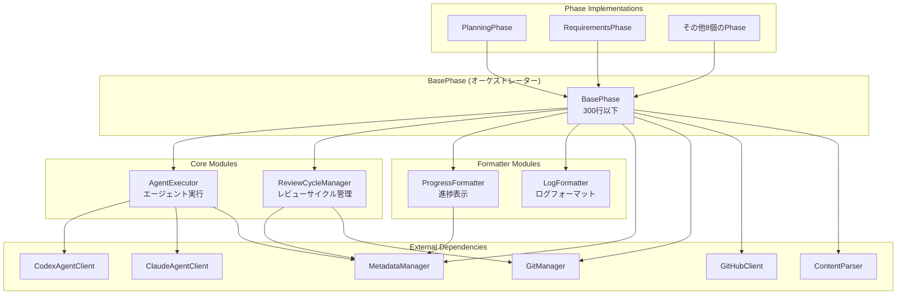
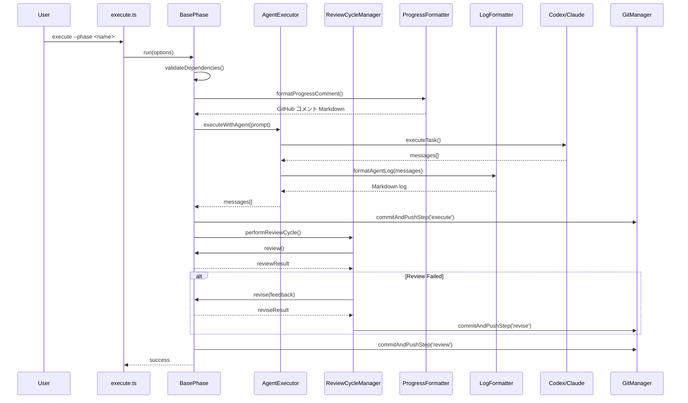
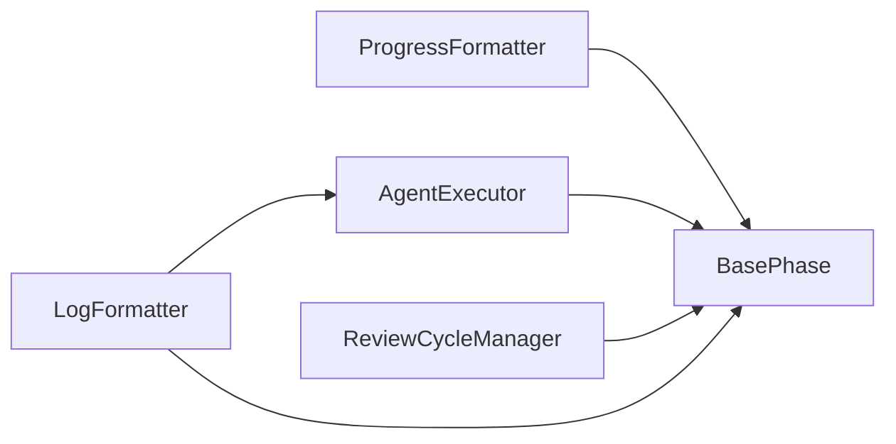

# 詳細設計書 - Issue #23: BasePhase アーキテクチャの分割

## 0. Planning Document と Requirements の確認

Planning Phase および Requirements Phase で策定された計画を確認しました。以下の重要事項を踏まえて設計を実施します：

### 計画の要約
- **複雑度**: 複雑（大規模リファクタリング、アーキテクチャ変更）
- **見積もり工数**: 20~28時間（8フェーズ）
- **実装戦略**: REFACTOR（既存コードの構造改善）
- **テスト戦略**: UNIT_INTEGRATION（各モジュールのユニットテスト + エンドツーエンド検証）
- **リスク評価**: 高（既存動作への影響、テスト網羅性、行数削減目標達成）
- **行数削減目標**: base-phase.ts を **1420行 → 300行以下** に削減

### 既存コード分析結果
- **現在の base-phase.ts**: 1420行
- **主要な責務**:
  1. エージェント実行ロジック（executeWithAgent, runAgentTask）
  2. レビューサイクル管理（performReviewCycle, performReviseStepWithRetry）
  3. 進捗表示フォーマット（formatProgressComment）
  4. ログフォーマット（formatAgentLog, formatCodexAgentLog）
  5. ライフサイクル管理（run メソッド）
  6. メタデータ・Git 連携

---

## 1. アーキテクチャ設計

### 1.1 システム全体図



### 1.2 コンポーネント間の関係

#### 依存関係の方向性
- **BasePhase**: 各モジュールを依存性注入し、オーケストレーションのみを担当
- **AgentExecutor**: エージェントクライアント（Codex/Claude）への依存を隔離
- **ReviewCycleManager**: BasePhase の revise メソッドを呼び出すための抽象化
- **ProgressFormatter**: MetadataManager からフェーズ状態を取得し、GitHub コメントをフォーマット
- **LogFormatter**: エージェントログの生データを Markdown に変換（外部依存なし）

### 1.3 データフロー



---

## 2. 実装戦略判断

### 実装戦略: REFACTOR

**判断根拠**:
1. **既存コードの構造改善**: base-phase.ts (1420行) の責務を分離し、保守性を向上させる
2. **新規機能追加なし**: 機能追加ではなく、既存機能の内部構造を改善する
3. **インターフェースの維持**: フェーズクラス（PlanningPhase 等）への影響を最小化し、既存の API を維持する
4. **モジュール抽出パターン**: Extract Class、Extract Module の適用により、Single Responsibility Principle を実現

**リファクタリングパターン**:
- **Extract Class**: 複数の責務を独立したクラスに分離
- **Dependency Injection**: 各モジュールを constructor で注入し、テスタビリティを向上
- **Facade Pattern**: BasePhase を各モジュールのファサードとして機能させる

---

## 3. テスト戦略判断

### テスト戦略: UNIT_INTEGRATION

**判断根拠**:
1. **UNIT（ユニットテスト）**: 各モジュール（AgentExecutor、ReviewCycleManager、ProgressFormatter、LogFormatter）の単体動作検証
   - AgentExecutor: エージェント実行ロジック単体のテスト
   - ReviewCycleManager: レビューサイクル管理ロジックのテスト
   - ProgressFormatter: 進捗表示フォーマットのテスト
   - LogFormatter: ログフォーマット変換のテスト

2. **INTEGRATION（統合テスト）**: 全フェーズ実行テストによるエンドツーエンド検証
   - 既存の `tests/integration/preset-execution.test.ts` を活用
   - BasePhase と各モジュールの連携動作を検証
   - レビューサイクル、Git コミット、進捗表示の統合動作を確認

3. **BDD不要**: ユーザーストーリーベースのテストは不要（内部リファクタリングのため、外部仕様は変更なし）

**テストカバレッジ目標**: 80%以上（新規モジュールのユニットテスト）

---

## 4. テストコード戦略判断

### テストコード戦略: CREATE_TEST

**判断根拠**:
1. **新規テストファイル作成**: 新規モジュール用のユニットテストを作成
   - `tests/unit/phases/core/agent-executor.test.ts`
   - `tests/unit/phases/core/review-cycle-manager.test.ts`
   - `tests/unit/phases/formatters/progress-formatter.test.ts`
   - `tests/unit/phases/formatters/log-formatter.test.ts`

2. **既存テスト活用**: 既存の統合テスト（`preset-execution.test.ts`、`step-commit-push.test.ts` 等）はそのまま利用し、リグレッション検証に使用

3. **テスト拡張不要**: 既存テストファイルの変更は最小限に抑え、新規テストで補完

**テストフレームワーク**: Jest (NODE_OPTIONS=--experimental-vm-modules)

---

## 5. 影響範囲分析

### 5.1 既存コードへの影響

#### 変更が必要なファイル（コア）
| ファイル | 変更内容 | 影響度 |
|---------|---------|--------|
| `src/phases/base-phase.ts` | メインの分割対象（1420行 → 300行以下に削減） | 高 |
| `src/phases/planning.ts` | import 追加の可能性 | 低 |
| `src/phases/requirements.ts` | import 追加の可能性 | 低 |
| `src/phases/design.ts` | import 追加の可能性 | 低 |
| `src/phases/test-scenario.ts` | import 追加の可能性 | 低 |
| `src/phases/implementation.ts` | import 追加の可能性 | 低 |
| `src/phases/test-implementation.ts` | import 追加の可能性 | 低 |
| `src/phases/testing.ts` | import 追加の可能性 | 低 |
| `src/phases/documentation.ts` | import 追加の可能性 | 低 |
| `src/phases/report.ts` | import 追加の可能性 | 低 |
| `src/phases/evaluation.ts` | import 追加の可能性 | 低 |

#### 影響を受けるテストファイル
- 既存の統合テスト（`tests/integration/` 配下）は変更不要（リグレッション検証に利用）
- 新規ユニットテスト（`tests/unit/phases/` 配下）を作成

### 5.2 依存関係の変更

#### 新規依存の追加
- **なし** - 既存の依存関係を維持

#### 既存依存の変更
- BasePhase の内部実装を変更するが、外部インターフェースは維持
- フェーズクラスから見た BasePhase の使用方法は変更なし

### 5.3 マイグレーション要否

- **データベーススキーマ変更**: なし
- **設定ファイル変更**: なし
- **環境変数変更**: なし
- **メタデータ構造変更**: なし（`.ai-workflow/issue-*/metadata.json` は変更なし）

---

## 6. 変更・追加ファイルリスト

### 6.1 新規作成ファイル

#### Core Modules
1. **`src/phases/core/agent-executor.ts`**
   - 行数見積もり: 200~250行
   - 責務: エージェント実行ロジック（execute/review/revise の実行、フォールバック）

2. **`src/phases/core/review-cycle-manager.ts`**
   - 行数見積もり: 150~200行
   - 責務: レビューサイクル管理（リトライロジック、依存関係チェック）

#### Formatter Modules
3. **`src/phases/formatters/progress-formatter.ts`**
   - 行数見積もり: 200~250行
   - 責務: 進捗表示フォーマット（GitHub コメント生成）

4. **`src/phases/formatters/log-formatter.ts`**
   - 行数見積もり: 300~400行
   - 責務: ログフォーマット（Codex/Claude ログの Markdown 変換）

#### Test Files
5. **`tests/unit/phases/core/agent-executor.test.ts`**
   - 行数見積もり: 150~200行
   - テスト対象: AgentExecutor

6. **`tests/unit/phases/core/review-cycle-manager.test.ts`**
   - 行数見積もり: 150~200行
   - テスト対象: ReviewCycleManager

7. **`tests/unit/phases/formatters/progress-formatter.test.ts`**
   - 行数見積もり: 100~150行
   - テスト対象: ProgressFormatter

8. **`tests/unit/phases/formatters/log-formatter.test.ts`**
   - 行数見積もり: 150~200行
   - テスト対象: LogFormatter

### 6.2 修正が必要な既存ファイル

1. **`src/phases/base-phase.ts`**
   - 変更内容: 各モジュールのインポート追加、run() メソッドのオーケストレーション化、不要なメソッドの削除
   - 目標行数: **300行以下**（現在: 1420行）

2. **`src/phases/*.ts`（全10個のフェーズクラス）**
   - 変更内容: import 追加の可能性（BasePhase の変更により必要な場合のみ）
   - 影響度: 最小限

### 6.3 削除が必要なファイル

- **なし** - 既存ファイルの削除は不要

---

## 7. 詳細設計

### 7.1 LogFormatter クラス設計

#### 責務
- Codex/Claude の生ログを Markdown 形式に変換
- ターンごとの内訳（スレッド開始、ツール実行、実行完了）を生成
- 4000文字を超える出力は切り詰め（truncate）

#### インターフェース

```typescript
/**
 * エージェントログのフォーマット変換を担当
 */
export class LogFormatter {
  /**
   * エージェントログを Markdown 形式に変換
   *
   * @param messages - エージェントが生成したメッセージ配列
   * @param startTime - 開始時刻（ミリ秒）
   * @param endTime - 終了時刻（ミリ秒）
   * @param duration - 実行時間（ミリ秒）
   * @param error - エラー（存在する場合）
   * @param agentName - エージェント名（'Codex Agent' | 'Claude Agent'）
   * @returns Markdown 形式のログ
   */
  formatAgentLog(
    messages: string[],
    startTime: number,
    endTime: number,
    duration: number,
    error: Error | null,
    agentName: string,
  ): string;

  /**
   * Codex エージェントログを Markdown 形式に変換
   *
   * @param messages - JSON イベントストリーム
   * @param startTime - 開始時刻（ミリ秒）
   * @param endTime - 終了時刻（ミリ秒）
   * @param duration - 実行時間（ミリ秒）
   * @param error - エラー（存在する場合）
   * @returns Markdown 形式のログ、またはパース失敗時は null
   */
  formatCodexAgentLog(
    messages: string[],
    startTime: number,
    endTime: number,
    duration: number,
    error: Error | null,
  ): string | null;
}
```

#### 主要メソッド

1. **`formatAgentLog()`**
   - Codex/Claude の生ログを判別し、適切なフォーマッターを呼び出す
   - Claude の場合: JSON メッセージを解析し、ターンごとに整形
   - Codex の場合: `formatCodexAgentLog()` を呼び出し

2. **`formatCodexAgentLog()`**
   - JSON イベントストリーム（`thread.started`, `item.started`, `item.completed`, `response.completed` 等）を解析
   - ターンごとの内訳を Markdown に変換
   - 4000文字を超える出力は切り詰め

#### プライベートヘルパーメソッド
- `parseJson(raw: string)`: JSON パース（エラーハンドリング付き）
- `asRecord(value: unknown)`: オブジェクト型アサーション
- `getString(source: Record<string, unknown> | null, key: string)`: 文字列取得
- `getNumber(source: Record<string, unknown> | null, key: string)`: 数値取得
- `describeItemType(value: string)`: アイテム種別の日本語変換
- `truncate(value: string, limit: number)`: 文字列切り詰め

---

### 7.2 ProgressFormatter クラス設計

#### 責務
- フェーズステータス（pending/in_progress/completed/failed）に応じた絵文字表示
- 全フェーズの進捗状況リスト
- 現在のフェーズ詳細（ステータス、開始時刻、試行回数）
- 完了したフェーズの詳細（折りたたみ表示）

#### インターフェース

```typescript
/**
 * 進捗表示フォーマットを担当
 */
export class ProgressFormatter {
  /**
   * 進捗コメントを Markdown 形式で生成
   *
   * @param currentPhase - 現在のフェーズ名
   * @param status - 現在のステータス
   * @param metadata - メタデータマネージャー
   * @param details - 詳細メッセージ（オプション）
   * @returns GitHub Issue コメント用 Markdown
   */
  formatProgressComment(
    currentPhase: PhaseName,
    status: PhaseStatus,
    metadata: MetadataManager,
    details?: string,
  ): string;
}
```

#### 主要ロジック

1. **フェーズステータス一覧の生成**
   - 全10フェーズの状態を絵文字付きでリスト化
   - 完了時刻または開始時刻を表示

2. **現在のフェーズ詳細の生成**
   - ステータス、開始時刻、試行回数（リトライカウント）を表示
   - 詳細メッセージがあれば追加

3. **完了したフェーズの詳細（折りたたみ）**
   - `<details>` タグで折りたたみ表示
   - レビュー結果、完了時刻を表示

4. **最終更新時刻の追加**
   - `YYYY-MM-DD HH:MM:SS` 形式でフォーマット

#### 定数
```typescript
const statusEmoji: Record<string, string> = {
  pending: '⏸️',
  in_progress: '🔄',
  completed: '✅',
  failed: '❌',
};

const phaseDefinitions: Array<{ key: PhaseName; number: string; label: string }> = [
  { key: 'planning', number: 'Phase 0', label: 'Planning' },
  { key: 'requirements', number: 'Phase 1', label: 'Requirements' },
  // ... (全10フェーズ)
];
```

---

### 7.3 AgentExecutor クラス設計

#### 責務
- プライマリエージェント（Codex または Claude）の実行
- 認証エラー時のフォールバック処理
- 空出力時のフォールバック処理
- 利用量メトリクスの抽出・記録

#### インターフェース

```typescript
/**
 * エージェント実行ロジックを担当
 */
export class AgentExecutor {
  private codex: CodexAgentClient | null;
  private claude: ClaudeAgentClient | null;
  private readonly logFormatter: LogFormatter;
  private readonly metadata: MetadataManager;
  private readonly phaseName: PhaseName;
  private readonly workingDir: string;

  constructor(
    codex: CodexAgentClient | null,
    claude: ClaudeAgentClient | null,
    metadata: MetadataManager,
    phaseName: PhaseName,
    workingDir: string,
  );

  /**
   * エージェントを使用してタスクを実行
   *
   * @param prompt - プロンプト文字列
   * @param options - 実行オプション（maxTurns、verbose、logDir）
   * @returns エージェントが生成したメッセージ配列
   */
  executeWithAgent(
    prompt: string,
    options?: { maxTurns?: number; verbose?: boolean; logDir?: string },
  ): Promise<string[]>;

  /**
   * 最後に実行したエージェントの利用量メトリクスを取得
   *
   * @returns 利用量メトリクス（存在する場合）
   */
  getLastExecutionMetrics(): UsageMetrics | null;
}
```

#### 主要メソッド

1. **`executeWithAgent()`**
   - プライマリエージェント（Codex または Claude）を判定
   - エージェントタスクを実行（`runAgentTask()` を呼び出し）
   - 認証エラー時に代替エージェントへフォールバック
   - 空出力時に代替エージェントへフォールバック

2. **`runAgentTask()`（プライベート）**
   - プロンプトファイルの保存（`prompt.txt`）
   - エージェントタスクの実行（`agent.executeTask()` 呼び出し）
   - 生ログの保存（`agent_log_raw.txt`）
   - フォーマット済みログの保存（`agent_log.md`）
   - 認証失敗検出（"invalid bearer token" 等のパターンマッチ）
   - 利用量メトリクスの抽出・記録

3. **`extractUsageMetrics()`（プライベート）**
   - JSON メッセージから利用量メトリクス（input_tokens、output_tokens、total_cost_usd）を抽出
   - 正規表現によるフォールバック解析

4. **`recordUsageMetrics()`（プライベート）**
   - メトリクスをメタデータに記録（`metadata.addCost()` 呼び出し）

#### データ構造

```typescript
type UsageMetrics = {
  inputTokens: number;
  outputTokens: number;
  totalCostUsd: number;
};
```

---

### 7.4 ReviewCycleManager クラス設計

#### 責務
- レビュー実行（`review()` メソッド呼び出し）
- レビュー失敗時の revise ステップ実行
- 最大リトライ回数（3回）のチェック
- リトライカウントの更新
- Git コミット＆プッシュ（ステップ単位）

#### インターフェース

```typescript
/**
 * レビューサイクル管理を担当
 */
export class ReviewCycleManager {
  private readonly metadata: MetadataManager;
  private readonly phaseName: PhaseName;
  private readonly maxRetries: number = 3;

  constructor(
    metadata: MetadataManager,
    phaseName: PhaseName,
  );

  /**
   * Reviseステップの実行（リトライ付き）
   *
   * @param gitManager - Git マネージャー（コミット＆プッシュ用）
   * @param initialReviewResult - 初回レビュー結果
   * @param reviewFn - レビュー関数
   * @param reviseFn - Revise 関数
   * @param postProgressFn - 進捗投稿関数
   * @throws エラー時は例外をスロー
   */
  performReviseStepWithRetry(
    gitManager: GitManager | null,
    initialReviewResult: PhaseExecutionResult,
    reviewFn: () => Promise<PhaseExecutionResult>,
    reviseFn: (feedback: string) => Promise<PhaseExecutionResult>,
    postProgressFn: (status: PhaseStatus, details?: string) => Promise<void>,
    commitAndPushStepFn: (step: 'execute' | 'review' | 'revise') => Promise<void>,
  ): Promise<void>;
}
```

#### 主要ロジック

1. **`performReviseStepWithRetry()`**
   - reviseステップが既に完了している場合はスキップ
   - 最大リトライ回数（3回）まで以下を繰り返し:
     - リトライカウントを更新
     - 進捗コメントを投稿
     - revise 関数を実行
     - Git コミット＆プッシュ（revise ステップ）
     - レビューを再実行
     - レビューが成功した場合:
       - review を completed_steps に追加
       - Git コミット＆プッシュ（review ステップ）
       - 処理を終了
     - レビューが失敗した場合:
       - revise を completed_steps から削除（再試行可能にする）
       - 次のリトライへ
   - 最大リトライ回数に達した場合は例外をスロー

---

### 7.5 BasePhase のリファクタリング設計

#### 目標
- **行数削減**: 1420行 → **300行以下**
- **責務の明確化**: オーケストレーションのみを担当
- **既存インターフェースの維持**: フェーズクラスへの影響を最小化

#### 変更内容

1. **各モジュールのインポート追加**
```typescript
import { LogFormatter } from './formatters/log-formatter.js';
import { ProgressFormatter } from './formatters/progress-formatter.js';
import { AgentExecutor } from './core/agent-executor.js';
import { ReviewCycleManager } from './core/review-cycle-manager.js';
```

2. **コンストラクタに各モジュールのインスタンス化を追加**
```typescript
private readonly logFormatter: LogFormatter;
private readonly progressFormatter: ProgressFormatter;
private agentExecutor: AgentExecutor | null = null;
private readonly reviewCycleManager: ReviewCycleManager;

constructor(params: BasePhaseConstructorParams) {
  // ... 既存の初期化 ...

  this.logFormatter = new LogFormatter();
  this.progressFormatter = new ProgressFormatter();
  this.reviewCycleManager = new ReviewCycleManager(
    this.metadata,
    this.phaseName,
  );

  // AgentExecutor は遅延初期化（codex/claude が設定されている場合のみ）
  if (this.codex || this.claude) {
    this.agentExecutor = new AgentExecutor(
      this.codex,
      this.claude,
      this.metadata,
      this.phaseName,
      this.workingDir,
    );
  }
}
```

3. **run() メソッドのオーケストレーション化**
   - 既存のロジックを維持しつつ、各モジュールを呼び出す
   - `executeWithAgent()` → `agentExecutor.executeWithAgent()` に変更
   - `performReviseStepWithRetry()` → `reviewCycleManager.performReviseStepWithRetry()` に変更
   - `formatProgressComment()` → `progressFormatter.formatProgressComment()` に変更

4. **不要なメソッドの削除**
   - `formatAgentLog()` → LogFormatter へ移動
   - `formatCodexAgentLog()` → LogFormatter へ移動
   - `formatProgressComment()` → ProgressFormatter へ移動
   - `executeWithAgent()` → AgentExecutor へ移動
   - `runAgentTask()` → AgentExecutor へ移動
   - `extractUsageMetrics()` → AgentExecutor へ移動
   - `recordUsageMetrics()` → AgentExecutor へ移動
   - `performReviseStepWithRetry()` → ReviewCycleManager へ移動
   - プライベートヘルパーメソッド（parseJson, asRecord, getString, getNumber 等）→ LogFormatter へ移動

5. **保持するメソッド**
   - `run()`: フェーズライフサイクルのオーケストレーション
   - `execute()`: 抽象メソッド（各フェーズで実装）
   - `review()`: 抽象メソッド（各フェーズで実装）
   - `shouldRunReview()`: レビュー実行判定
   - `loadPrompt()`: プロンプトファイル読み込み
   - `getIssueInfo()`: Issue 情報取得
   - `postOutput()`: 成果物の GitHub コメント投稿
   - `updatePhaseStatus()`: フェーズステータス更新
   - `getPhaseOutputFile()`: フェーズ成果物ファイルパス取得
   - `formatIssueInfo()`: Issue 情報フォーマット
   - `getPlanningDocumentReference()`: Planning ドキュメント参照取得
   - `getAgentFileReference()`: エージェントファイル参照変換
   - `buildOptionalContext()`: オプショナルコンテキスト構築
   - `getPhaseNumber()`: フェーズ番号取得
   - `ensureDirectories()`: ディレクトリ確保
   - `handleFailure()`: 失敗処理
   - `postProgress()`: 進捗投稿
   - `autoCommitAndPush()`: 自動コミット＆プッシュ
   - `cleanupWorkflowArtifacts()`: ワークフローアーティファクトクリーンアップ
   - `commitAndPushStep()`: ステップ単位のコミット＆プッシュ

#### 行数削減計画

| カテゴリ | 削減対象 | 削減行数 |
|---------|---------|----------|
| ログフォーマット | `formatAgentLog()`, `formatCodexAgentLog()`, プライベートヘルパー | 約310行 |
| 進捗フォーマット | `formatProgressComment()`, 定数 | 約130行 |
| エージェント実行 | `executeWithAgent()`, `runAgentTask()`, `extractUsageMetrics()`, `recordUsageMetrics()` | 約190行 |
| レビューサイクル | `performReviseStepWithRetry()` | 約80行 |
| **合計削減** | | **約710行** |
| **削減後** | | **約710行** |

**さらなる削減施策**（300行以下達成のため）:
- ヘルパーメソッドの分離（`formatIssueInfo()`, `getPlanningDocumentReference()`, `getAgentFileReference()`, `buildOptionalContext()` 等） → 約200行削減
- 定数の外部化（`phaseDefinitions`, `statusEmoji` 等は ProgressFormatter に移動済み）

**最終目標**: 約300行以下

---

## 8. セキュリティ考慮事項

### 8.1 認証・認可
- **エージェント認証情報の取り扱い**: 既存のセキュリティレベルを維持
  - Codex API キー（`CODEX_API_KEY` / `OPENAI_API_KEY`）
  - Claude Code 認証情報（`CLAUDE_CODE_CREDENTIALS_PATH`）
- **GitHub トークンの取り扱い**: `GITHUB_TOKEN` 環境変数の適切な管理

### 8.2 データ保護
- **ログファイルに機密情報を含めない**: API キー等の機密情報がログに記録されないように注意
- **メタデータの保護**: `.ai-workflow/issue-*/metadata.json` に機密情報を含めない

### 8.3 セキュリティリスクと対策
- **パストラバーサル攻撃**: ファイルパス操作時に `path.resolve()` を使用し、絶対パスに変換
- **シンボリックリンク攻撃**: ワークフローディレクトリ削除時に `fs.lstatSync()` でシンボリックリンクをチェック

---

## 9. 非機能要件への対応

### 9.1 パフォーマンス
- **目標**: リファクタリング後も、フェーズ実行時間は現状と同等であること（±10%以内）
- **対策**: モジュール化によるオーバーヘッドを最小限に抑える（関数呼び出しのみ、新規 I/O 操作なし）

### 9.2 スケーラビリティ
- **モジュールの独立性**: 各モジュールが疎結合であるため、将来的な拡張が容易
- **依存性注入**: コンストラクタインジェクションにより、テスタビリティと拡張性を向上

### 9.3 保守性
- **Single Responsibility Principle**: 各モジュールが単一の責務を持つ
- **コード品質基準**:
  - TypeScript Strict Mode 有効
  - ESLint ルール準拠
  - 命名規則遵守（クラス名: PascalCase、メソッド名: camelCase、ファイル名: kebab-case）
- **ドキュメント**: 各モジュールのファイル冒頭にモジュールの役割を記載

---

## 10. 実装の順序

### 推奨実装順序

1. **Phase 1: LogFormatter の実装**
   - 理由: 外部依存が最も少なく、独立して実装可能
   - 成果物: `src/phases/formatters/log-formatter.ts`

2. **Phase 2: ProgressFormatter の実装**
   - 理由: MetadataManager のみに依存し、実装が比較的容易
   - 成果物: `src/phases/formatters/progress-formatter.ts`

3. **Phase 3: AgentExecutor の実装**
   - 理由: LogFormatter に依存するため、LogFormatter 完成後に実装
   - 成果物: `src/phases/core/agent-executor.ts`

4. **Phase 4: ReviewCycleManager の実装**
   - 理由: MetadataManager に依存し、BasePhase の revise メソッドを呼び出すための抽象化が必要
   - 成果物: `src/phases/core/review-cycle-manager.ts`

5. **Phase 5: BasePhase のリファクタリング**
   - 理由: 全モジュールが揃った後に、オーケストレーション化を実施
   - 成果物: `src/phases/base-phase.ts`（1420行 → 300行以下）

6. **Phase 6: ユニットテストの実装**
   - 理由: 各モジュール実装後に、ユニットテストを作成
   - 成果物: `tests/unit/phases/` 配下のテストファイル（4つ）

7. **Phase 7: インテグレーションテストの実行**
   - 理由: 全モジュール実装完了後に、既存統合テストでリグレッション検証
   - 検証内容: `tests/integration/preset-execution.test.ts` 等の既存テストが全てパス

8. **Phase 8: ドキュメント更新**
   - 理由: 実装完了後に、ARCHITECTURE.md、CLAUDE.md を更新
   - 成果物: アーキテクチャドキュメント、プロジェクトガイドライン

### 依存関係の考慮



- LogFormatter → AgentExecutor → BasePhase
- ProgressFormatter → BasePhase
- ReviewCycleManager → BasePhase

---

## 11. 品質ゲート確認

### 実装戦略の判断根拠が明記されている
✅ **セクション2で明記**: REFACTOR戦略を選択し、既存コードの構造改善、新規機能追加なし、インターフェースの維持、モジュール抽出パターンの適用を根拠として記載

### テスト戦略の判断根拠が明記されている
✅ **セクション3で明記**: UNIT_INTEGRATION戦略を選択し、各モジュールのユニットテスト、全フェーズ実行テストによるエンドツーエンド検証、BDD不要の理由を記載

### テストコード戦略の判断根拠が明記されている
✅ **セクション4で明記**: CREATE_TEST戦略を選択し、新規テストファイル作成、既存テスト活用、テスト拡張不要の理由を記載

### 既存コードへの影響範囲が分析されている
✅ **セクション5で詳細に分析**:
- 変更が必要なファイル（base-phase.ts、全10個のフェーズクラス）
- 影響を受けるテストファイル
- 依存関係の変更
- マイグレーション要否

### 変更が必要なファイルがリストアップされている
✅ **セクション6で網羅的にリストアップ**:
- 新規作成ファイル（4つのモジュール + 4つのテストファイル）
- 修正が必要な既存ファイル（base-phase.ts、全10個のフェーズクラス）
- 削除が必要なファイル（なし）

### 設計が実装可能である
✅ **セクション7で詳細設計を記載**:
- 各モジュールのクラス設計（LogFormatter、ProgressFormatter、AgentExecutor、ReviewCycleManager）
- インターフェース定義
- データ構造設計
- BasePhase のリファクタリング設計

---

## 12. 補足事項

### 12.1 リスクと軽減策

#### リスク1: 暗黙的な依存関係の見逃し
- **影響度**: 高
- **確率**: 中
- **軽減策**:
  - Phase 1 で徹底的なコード分析を実施（すべてのメソッド、プライベート変数の洗い出し）
  - Phase 4 実装時に段階的にリファクタリング（モジュール単位で分離し、都度テスト実行）
  - 既存の統合テストを頻繁に実行し、早期にリグレッションを検出

#### リスク2: 行数削減目標（300行以下）の未達成
- **影響度**: 中
- **確率**: 中
- **軽減策**:
  - Phase 2 で詳細な行数削減計画を策定（各モジュールへの移行行数を見積もり）
  - Task 4-5 実装後に行数を確認し、未達成の場合は追加モジュール抽出を検討
  - 必要に応じて、ヘルパーメソッドをさらに分離（例: `formatters/issue-formatter.ts`）

#### リスク3: テストカバレッジ不足によるリグレッション
- **影響度**: 高
- **確率**: 低
- **軽減策**:
  - 既存の統合テスト（`tests/integration/`）を全て実行し、リグレッション検証
  - Phase 5 で各モジュールのユニットテストを作成し、カバレッジ80%以上を目標
  - Phase 6 で手動テストも実施（実際にワークフローを実行し、ログフォーマット、進捗表示を目視確認）

### 12.2 コード品質基準

- **TypeScript Strict Mode**: すべてのコードは `strict: true` でコンパイルエラーがないこと
- **ESLint**: コーディング規約に従う（既存のスタイルを維持）
- **命名規則**: クラス名はPascalCase、メソッド名はcamelCase、ファイル名はkebab-case
- **コメント**: 各モジュールのファイル冒頭にモジュールの役割を記載（日本語）

### 12.3 リファクタリング原則

- **Single Responsibility Principle (SRP)**: 各モジュールは単一の責務を持つ
- **Open/Closed Principle (OCP)**: 拡張に対して開いており、修正に対して閉じている
- **Dependency Inversion Principle (DIP)**: 具象ではなく抽象に依存する（インターフェース経由で連携）

---

## 13. 成功基準

このリファクタリングが成功したと判断する基準：

1. **行数削減達成**: base-phase.ts が300行以下に削減されている
2. **テスト合格**: すべてのユニットテスト・インテグレーションテストがパスしている
3. **リグレッションゼロ**: 既存のフェーズ実行動作に変更がない（ログフォーマット、進捗表示、レビューサイクルが正常動作）
4. **保守性向上**: 各モジュールが単一の責務を持ち、コードの見通しが良くなっている
5. **ドキュメント更新**: ARCHITECTURE.md、CLAUDE.md が最新化されている

---

## 14. 参考情報

- **Issue #1**: 親Issue（全体のアーキテクチャ改善）
- **Planning Document**: `.ai-workflow/issue-23/00_planning/output/planning.md`
- **Requirements Document**: `.ai-workflow/issue-23/01_requirements/output/requirements.md`
- **base-phase.ts**: 現在1420行（リファクタリング対象）
- **既存テスト**: `tests/integration/` 配下の統合テストを活用
- **TypeScript設定**: `tsconfig.json`（strict mode有効）
- **ビルドスクリプト**: `npm run build`（tsc + copy-static-assets.mjs）

---

**作成日**: 2025-01-20
**バージョン**: 1.0
**ステータス**: レビュー待ち
