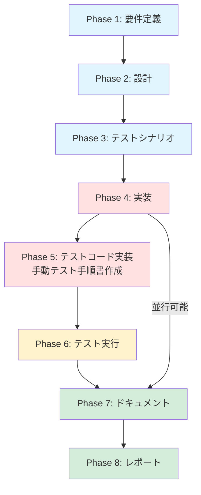

# プロジェクト計画書 - Issue #232

## Issue分析

### Issue概要
- **Issue番号**: #232
- **タイトル**: Jenkins Job用Jenkinsfileを適切なディレクトリに配置
- **状態**: open
- **URL**: https://github.com/tielec/ai-workflow-agent/issues/232

### 複雑度評価: 簡単

**判断根拠**:
- **作業内容**: ファイル移動とテキスト置換が中心
- **影響範囲**: 限定的（Jenkinsfile 5個、DSLファイル 5個、README.md 1個）
- **技術的難易度**: 低（新規実装やロジック変更なし）
- **リスク**: 低（パス変更のみで既存機能への影響なし）

### 見積もり工数: 3～5時間

**工数内訳**:
- **Phase 1（要件定義）**: 0.5～1h
  - ディレクトリ構造の設計確認
  - 移動対象ファイルの整理
- **Phase 2（設計）**: 0.5～1h
  - 新ディレクトリ構造の詳細設計
  - scriptPath更新パターンの策定
- **Phase 3（テストシナリオ）**: 0.5～1h
  - シードジョブ実行テスト計画
  - ジョブ生成検証計画
- **Phase 4（実装）**: 0.5～1h
  - ファイル移動スクリプト作成・実行
  - DSLファイル更新
  - README.md更新
- **Phase 5～8（テスト・ドキュメント・レポート）**: 1～1h
  - シードジョブ実行・検証
  - 動作確認
  - ドキュメント最終調整

### リスク評価: 低

**理由**:
- 既存機能への影響がない（ファイルパス変更のみ）
- ロールバックが容易（Git revert で即座に復元可能）
- テスト環境でのシードジョブ実行で事前検証可能

---

## 実装戦略判断

### 実装戦略: EXTEND

**判断根拠**:
- **既存ディレクトリ構造への追加**: `jenkins/jobs/pipeline/ai-workflow/` 配下に新しいサブディレクトリを作成
- **既存ファイルの修正**: DSLファイルの `scriptPath` 属性を更新、README.md のディレクトリ構造セクションを更新
- **新規作成なし**: 新規モジュールやクラスの作成は不要
- **リファクタリング要素なし**: 既存コードの構造改善ではなく、配置場所の整理

この作業は「既存のディレクトリ構造に新しいディレクトリを追加し、既存ファイルを移動・更新する」という **EXTEND** パターンに該当します。

### テスト戦略: INTEGRATION_ONLY

**判断根拠**:
- **単体テスト不要**: ロジック変更がなく、ユニットテストの対象がない
- **インテグレーションテスト必須**: シードジョブとJob DSLの統合動作確認が必要
  - シードジョブが正常に実行されること
  - 5種類のジョブが正しいパス（新しい `scriptPath`）で生成されること
  - 生成されたジョブが正常に実行されること（ビルド可能性チェック）
- **BDDテスト不要**: エンドユーザー向けストーリーではなく、内部的な構造整理

この作業は「ファイル配置の変更が正しく反映されるかを、シードジョブ実行で検証する」という **INTEGRATION_ONLY** パターンに該当します。

### テストコード戦略: CREATE_TEST

**判断根拠**:
- **新規テストファイル作成**: 既存のテストコードがない（ディレクトリ構造検証用のテストが未整備）
- **テスト対象**: シードジョブ実行結果の検証（ジョブ生成、scriptPath、ビルド可能性）
- **テストファイル**: `tests/integration/test_seed_job_execution.py`（または類似のテストファイル）を作成
- **既存テスト拡張不要**: 既存のテストファイルに追加する内容がない

ただし、本Issueでは **手動統合テスト（Jenkins UI上でシードジョブを実行）** を実施するため、テストコード実装は **オプション** とします。

---

## 影響範囲分析

### 変更が必要なファイル

#### 1. Jenkinsfile（5個）- 移動対象

| 現在のパス | 新しいパス |
|-----------|-----------|
| `jenkins/Jenkinsfile.all-phases` | `jenkins/jobs/pipeline/ai-workflow/all-phases/Jenkinsfile` |
| `jenkins/Jenkinsfile.preset` | `jenkins/jobs/pipeline/ai-workflow/preset/Jenkinsfile` |
| `jenkins/Jenkinsfile.single-phase` | `jenkins/jobs/pipeline/ai-workflow/single-phase/Jenkinsfile` |
| `jenkins/Jenkinsfile.rollback` | `jenkins/jobs/pipeline/ai-workflow/rollback/Jenkinsfile` |
| `jenkins/Jenkinsfile.auto-issue` | `jenkins/jobs/pipeline/ai-workflow/auto-issue/Jenkinsfile` |

#### 2. DSLファイル（5個）- scriptPath更新

| DSLファイルパス | 更新する属性 | 現在の値 | 新しい値 |
|---------------|------------|---------|---------|
| `jenkins/jobs/dsl/ai-workflow/ai_workflow_all_phases_job.groovy` | `scriptPath` | `'Jenkinsfile'` | `'jenkins/jobs/pipeline/ai-workflow/all-phases/Jenkinsfile'` |
| `jenkins/jobs/dsl/ai-workflow/ai_workflow_preset_job.groovy` | `scriptPath` | `'Jenkinsfile'` | `'jenkins/jobs/pipeline/ai-workflow/preset/Jenkinsfile'` |
| `jenkins/jobs/dsl/ai-workflow/ai_workflow_single_phase_job.groovy` | `scriptPath` | `'Jenkinsfile'` | `'jenkins/jobs/pipeline/ai-workflow/single-phase/Jenkinsfile'` |
| `jenkins/jobs/dsl/ai-workflow/ai_workflow_rollback_job.groovy` | `scriptPath` | `'Jenkinsfile'` | `'jenkins/jobs/pipeline/ai-workflow/rollback/Jenkinsfile'` |
| `jenkins/jobs/dsl/ai-workflow/ai_workflow_auto_issue_job.groovy` | `scriptPath` | `'Jenkinsfile'` | `'jenkins/jobs/pipeline/ai-workflow/auto-issue/Jenkinsfile'` |

#### 3. ドキュメント（1個）- ディレクトリ構造セクション更新

- `jenkins/README.md` - 「ディレクトリ構造」セクションを更新

### 変更不要なファイル

- `jenkins/jobs/pipeline/_seed/ai-workflow-job-creator/Jenkinsfile` - シードジョブ定義（変更不要）
- `jenkins/jobs/pipeline/_seed/ai-workflow-job-creator/job-config.yaml` - ジョブ設定（`jenkinsfile: Jenkinsfile` は相対パスなので変更不要）
- `jenkins/jobs/pipeline/_seed/ai-workflow-job-creator/folder-config.yaml` - フォルダ設定（変更不要）
- `jenkins/jobs/dsl/folders.groovy` - フォルダDSL（変更不要）
- `jenkins/shared/common.groovy` - 共通処理（変更不要）

### 依存関係の変更

**新規依存の追加**: なし
**既存依存の変更**: なし

### マイグレーション要否

**不要**
- データベース変更なし
- 設定ファイルフォーマット変更なし
- ファイルパス変更のみで、既存ジョブは自動的に新しいパスに更新される（シードジョブ再実行により）

---

## タスク分割

### Phase 1: 要件定義 (見積もり: 0.5～1h)

- [ ] Task 1-1: 新ディレクトリ構造の詳細仕様を確定 (0.3h)
  - `jenkins/jobs/pipeline/ai-workflow/` 配下のサブディレクトリ構成を確認
  - 各モード（all-phases, preset, single-phase, rollback, auto-issue）のディレクトリ名を確定
  - README.mdに記載するディレクトリツリー図を設計
- [ ] Task 1-2: 移動対象ファイルとscriptPath更新箇所のリストアップ (0.2～0.5h)
  - Jenkinsfile 5個の移動元・移動先パスをリスト化
  - DSLファイル 5個の `scriptPath` 更新箇所をリスト化
  - README.md の更新箇所を特定
- [ ] Task 1-3: シードジョブ実行による検証手順を定義 (0.2h)
  - シードジョブ実行前の事前確認項目
  - シードジョブ実行後の検証項目（ジョブ生成、scriptPath、ビルド可能性）
  - ロールバック手順（Git revert による復元手順）

### Phase 2: 設計 (見積もり: 0.5～1h)

- [ ] Task 2-1: ディレクトリ構造設計 (0.2～0.5h)
  - 新しいディレクトリ構造のツリー図作成
  - 各ディレクトリの目的と配置ファイルを明記
  - README.mdに掲載するフォーマット設計
- [ ] Task 2-2: scriptPath更新パターンの策定 (0.2h)
  - 各DSLファイルの更新箇所（行番号）を特定
  - 置換パターン（正規表現）を定義
  - 一括置換スクリプト（sedまたはPython）の設計
- [ ] Task 2-3: ファイル移動スクリプトの設計 (0.1～0.3h)
  - 移動先ディレクトリ作成コマンド
  - ファイル移動コマンド（`git mv`）
  - エラーハンドリング（移動先ディレクトリ存在チェック、ファイル存在チェック）

### Phase 3: テストシナリオ (見積もり: 0.5～1h)

- [ ] Task 3-1: シードジョブ実行テストシナリオ作成 (0.3～0.5h)
  - **事前条件**: DSLファイルの `scriptPath` が新しいパスに更新されていること
  - **実行手順**: シードジョブ（`Admin_Jobs/ai-workflow-job-creator`）を実行
  - **期待結果**:
    - ジョブが正常に完了すること
    - 5種類のジョブ（all_phases, preset, single_phase, rollback, auto_issue）が生成されること
    - 各ジョブのPipeline設定で `scriptPath` が新しいパスになっていること
  - **検証方法**: Jenkins UIでジョブ設定を確認
- [ ] Task 3-2: ビルド可能性検証テストシナリオ作成 (0.2～0.5h)
  - **テスト対象**: 生成された5種類のジョブ
  - **実行手順**: 各ジョブでテストビルドを実行（`DRY_RUN=true`）
  - **期待結果**:
    - すべてのジョブでビルドが開始されること（Jenkinsfile読み込み成功）
    - エラーメッセージが表示されないこと
  - **異常系テスト**: 存在しないscriptPathを指定した場合のエラーメッセージ確認

### Phase 4: 実装 (見積もり: 0.5～1h)

- [ ] Task 4-1: 新ディレクトリ構造の作成 (0.1h)
  - `jenkins/jobs/pipeline/ai-workflow/` 配下に5つのサブディレクトリを作成
    - `all-phases/`
    - `preset/`
    - `single-phase/`
    - `rollback/`
    - `auto-issue/`
- [ ] Task 4-2: Jenkinsfileの移動 (0.1～0.2h)
  - `git mv` コマンドで5個のJenkinsfileを移動
  - 移動後のファイル名を `Jenkinsfile` に統一
- [ ] Task 4-3: DSLファイルのscriptPath更新 (0.1～0.2h)
  - 5個のDSLファイルで `scriptPath('Jenkinsfile')` を新しいパスに置換
  - 正規表現または `sed` コマンドで一括置換
- [ ] Task 4-4: README.mdのディレクトリ構造セクション更新 (0.2～0.4h)
  - 「ディレクトリ構造」セクションのツリー図を更新
  - 新しいディレクトリ構造を反映
  - セクション「## ディレクトリ構造」の内容を全面改訂

### Phase 5: テストコード実装 (見積もり: 0.5～1h)

- [ ] Task 5-1: 手動統合テスト手順書の作成 (0.5～1h)
  - シードジョブ実行手順書（スクリーンショット付き）
  - ジョブ生成確認手順書（Jenkins UI確認ポイント）
  - ビルド可能性確認手順書（テストビルド実行手順）
  - ロールバック手順書（Git revert 実行手順）

**注**: 本Issueでは自動テストコードの実装は行わず、手動統合テストで代替します。

### Phase 6: テスト実行 (見積もり: 0.5～1h)

- [ ] Task 6-1: シードジョブ実行テスト (0.2～0.3h)
  - シードジョブを実行し、ジョブ生成を確認
  - 5種類のジョブが生成されることを確認
  - 各ジョブの `scriptPath` 設定を確認
- [ ] Task 6-2: ビルド可能性検証テスト (0.2～0.3h)
  - 生成されたジョブでテストビルドを実行（`DRY_RUN=true`）
  - すべてのジョブでビルドが正常に開始されることを確認
- [ ] Task 6-3: 異常系テスト (0.1～0.4h)
  - 存在しないscriptPathを指定した場合のエラーメッセージを確認
  - エラーハンドリングが適切に動作することを確認

### Phase 7: ドキュメント (見積もり: 0.5～1h)

- [ ] Task 7-1: README.mdの最終調整 (0.3～0.5h)
  - ディレクトリ構造セクションの内容を精査
  - 誤字脱字チェック
  - Markdownフォーマットチェック
- [ ] Task 7-2: コミットメッセージ・PR本文の作成 (0.2～0.5h)
  - コミットメッセージを作成（Conventional Commits形式）
  - PR本文を作成（変更内容、影響範囲、テスト結果を記載）
  - 関連Issue（#230）へのリンクを追加

### Phase 8: レポート (見積もり: 0.5～1h)

- [ ] Task 8-1: テスト結果サマリーの作成 (0.2～0.3h)
  - シードジョブ実行結果
  - ビルド可能性検証結果
  - 異常系テスト結果
- [ ] Task 8-2: マージ前最終チェック (0.2～0.3h)
  - すべてのファイルが正しく移動されているか確認
  - DSLファイルの `scriptPath` が正しく更新されているか確認
  - README.mdが正しく更新されているか確認
  - 手動統合テストがすべてパスしているか確認
- [ ] Task 8-3: Issue #232のクローズ準備 (0.1～0.4h)
  - 完了条件（4つのチェックリスト）がすべて満たされているか確認
  - レビューコメントへの対応状況を確認

---

## 依存関係



**並行実行可能なタスク**:
- Phase 4（実装）とPhase 7（ドキュメント）は一部並行実行可能
  - README.md更新は実装完了後に実施

---

## リスクと軽減策

### リスク1: DSLファイルのscriptPath更新漏れ

- **影響度**: 高（ジョブ生成失敗またはビルドエラー）
- **確率**: 中（手作業による置換ミス）
- **軽減策**:
  - 一括置換スクリプト（`sed` またはPython）を使用して人的ミスを削減
  - Phase 6で全ジョブのビルド可能性テストを実施し、早期検出
  - コードレビュー時に5個のDSLファイルすべてを確認

### リスク2: 移動先ディレクトリ構造の誤り

- **影響度**: 中（ジョブ生成失敗、構造の再変更が必要）
- **確率**: 低（要件定義・設計フェーズで明確化）
- **軽減策**:
  - Phase 1で新ディレクトリ構造を明確に定義
  - Phase 2でツリー図を作成し、視覚的に確認
  - Phase 6のシードジョブ実行テストで構造を検証

### リスク3: シードジョブ実行失敗によるジョブ未生成

- **影響度**: 高（ジョブが利用不可能）
- **確率**: 低（DSLファイル構文エラーまたはパス誤り）
- **軽減策**:
  - Phase 3でテストシナリオを詳細に定義
  - Phase 6でシードジョブ実行テストを実施
  - エラー発生時はロールバック手順（Git revert）を実施

### リスク4: README.mdの更新漏れ

- **影響度**: 低（ドキュメント不整合）
- **確率**: 中（手作業による更新漏れ）
- **軽減策**:
  - Phase 1でREADME.md更新箇所をリスト化
  - Phase 7でMarkdownフォーマットチェックと誤字脱字チェックを実施
  - コードレビュー時にREADME.mdの内容を確認

---

## 品質ゲート

### Phase 1: 要件定義

- [ ] 新ディレクトリ構造が明確に定義されている
- [ ] 移動対象ファイル（5個）とscriptPath更新箇所（5個）がリスト化されている
- [ ] シードジョブ実行による検証手順が定義されている

### Phase 2: 設計

- [ ] 実装戦略の判断根拠が明記されている（EXTEND）
- [ ] テスト戦略の判断根拠が明記されている（INTEGRATION_ONLY）
- [ ] テストコード戦略の判断根拠が明記されている（CREATE_TEST、ただし手動テストで代替）
- [ ] 新ディレクトリ構造のツリー図が作成されている
- [ ] scriptPath更新パターンが策定されている

### Phase 3: テストシナリオ

- [ ] シードジョブ実行テストシナリオが作成されている（事前条件、実行手順、期待結果、検証方法）
- [ ] ビルド可能性検証テストシナリオが作成されている
- [ ] 異常系テストシナリオが作成されている

### Phase 4: 実装

- [ ] 5つのサブディレクトリが正しく作成されている
- [ ] 5個のJenkinsfileが正しく移動されている
- [ ] 5個のDSLファイルの `scriptPath` が正しく更新されている
- [ ] README.mdのディレクトリ構造セクションが更新されている

### Phase 5: テストコード実装

- [ ] 手動統合テスト手順書が作成されている
  - シードジョブ実行手順書
  - ジョブ生成確認手順書
  - ビルド可能性確認手順書
  - ロールバック手順書

### Phase 6: テスト実行

- [ ] シードジョブが正常に実行され、5種類のジョブが生成されている
- [ ] 各ジョブの `scriptPath` 設定が正しいことが確認されている
- [ ] すべてのジョブでテストビルドが正常に開始されることが確認されている
- [ ] 異常系テスト（存在しないscriptPath）でエラーメッセージが表示されることが確認されている

### Phase 7: ドキュメント

- [ ] README.mdの内容が正確で、誤字脱字がない
- [ ] コミットメッセージがConventional Commits形式に準拠している
- [ ] PR本文に変更内容、影響範囲、テスト結果が記載されている

### Phase 8: レポート

- [ ] テスト結果サマリーが作成されている
- [ ] マージ前最終チェックがすべてパスしている
- [ ] Issue #232の完了条件（4つのチェックリスト）がすべて満たされている

---

## 完了条件（Issue #232より）

- [ ] 各Jenkinsfileが適切なディレクトリに移動されている
- [ ] DSLファイルの `scriptPath` が正しく更新されている
- [ ] `jenkins/README.md` が更新されている
- [ ] シードジョブを実行してジョブが正常に生成されることを確認

---

## 実装上の注意事項

### 1. Git操作

- **ファイル移動は `git mv` コマンドを使用** → 履歴を保持
- **ディレクトリ作成は `mkdir -p` を使用** → 親ディレクトリも同時に作成

### 2. scriptPath更新

- **相対パスで記載**: `jenkins/jobs/pipeline/ai-workflow/all-phases/Jenkinsfile`
- **引用符に注意**: Groovyの文字列リテラルはシングルクォート `'` を使用

### 3. README.md更新

- **Markdownフォーマットの統一**: インデント（2スペース）、リストマーカー（`-`）
- **ディレクトリツリー図**: コードブロック（` ```plaintext ` 〜 ` ``` `）で記載

### 4. シードジョブ実行

- **実行タイミング**: すべてのファイル変更をコミット後、PRマージ前
- **実行環境**: Jenkins UI上で手動実行（`Admin_Jobs/ai-workflow-job-creator`）
- **検証項目**: ジョブ生成数（5種類 × 10フォルダ = 50ジョブ）、scriptPath設定、ビルド可能性

---

## 関連ドキュメント

- [Issue #230](https://github.com/tielec/ai-workflow-agent/issues/230) - AI Workflow Jenkins Job定義の移行
- [ARCHITECTURE.md](../../ARCHITECTURE.md) - アーキテクチャ設計思想
- [jenkins/README.md](../../jenkins/README.md) - Jenkins Jobs概要
- [jenkins/jobs/dsl/ai-workflow/TEST_PLAN.md](../../jenkins/jobs/dsl/ai-workflow/TEST_PLAN.md) - テスト計画

---

**作成日時**: 2025-01-31
**バージョン**: 1.0
**最終更新**: Phase 0 (Planning) - プロジェクト計画書作成完了
