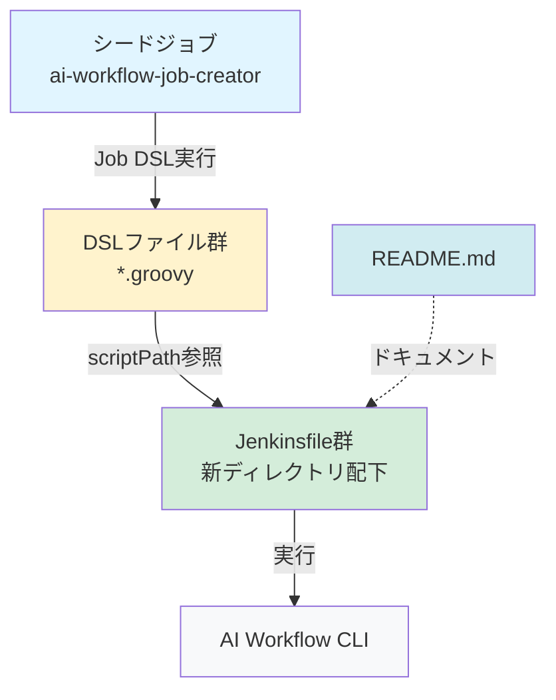
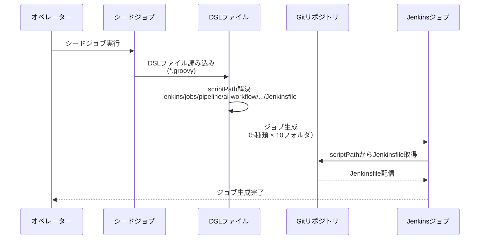
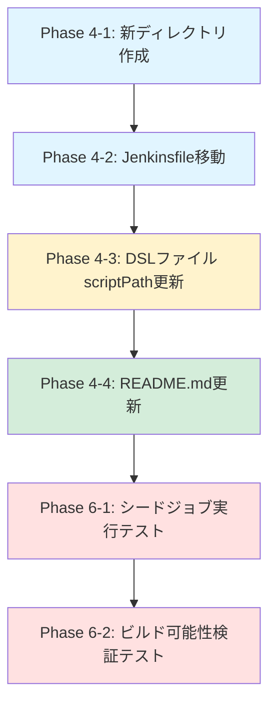

# 詳細設計書 - Issue #232

## 0. Planning Documentの確認

Planning Phaseで策定された計画を確認しました：

### 実装戦略
- **戦略**: EXTEND（既存ディレクトリ構造への追加と既存ファイルの修正）
- **根拠**: 新しいディレクトリを作成し、既存ファイルを移動・更新する作業のため

### テスト戦略
- **戦略**: INTEGRATION_ONLY（統合テストのみ）
- **根拠**: ロジック変更がなく、シードジョブ実行による統合動作確認が必要

### 複雑度評価
- **評価**: 簡単
- **工数見積もり**: 3～5時間
- **リスク評価**: 低（ファイルパス変更のみ、ロールバックが容易）

### 主要リスク
1. DSLファイルのscriptPath更新漏れ（影響度: 高）
2. 移動先ディレクトリ構造の誤り（影響度: 中）
3. シードジョブ実行失敗によるジョブ未生成（影響度: 高）

これらの計画を踏まえて、詳細設計を実施します。

---

## 1. アーキテクチャ設計

### 1.1 システム全体図

```
jenkins/
├── Jenkinsfile.all-phases      [削除対象] → jobs/pipeline/ai-workflow/all-phases/Jenkinsfile
├── Jenkinsfile.preset          [削除対象] → jobs/pipeline/ai-workflow/preset/Jenkinsfile
├── Jenkinsfile.single-phase    [削除対象] → jobs/pipeline/ai-workflow/single-phase/Jenkinsfile
├── Jenkinsfile.rollback        [削除対象] → jobs/pipeline/ai-workflow/rollback/Jenkinsfile
├── Jenkinsfile.auto-issue      [削除対象] → jobs/pipeline/ai-workflow/auto-issue/Jenkinsfile
└── jobs/
    ├── pipeline/
    │   ├── _seed/
    │   │   └── ai-workflow-job-creator/
    │   │       └── Jenkinsfile  [変更なし] → シードジョブ定義
    │   └── ai-workflow/         [新規ディレクトリ]
    │       ├── all-phases/      [新規]
    │       │   └── Jenkinsfile  [移動先]
    │       ├── preset/          [新規]
    │       │   └── Jenkinsfile  [移動先]
    │       ├── single-phase/    [新規]
    │       │   └── Jenkinsfile  [移動先]
    │       ├── rollback/        [新規]
    │       │   └── Jenkinsfile  [移動先]
    │       └── auto-issue/      [新規]
    │           └── Jenkinsfile  [移動先]
    └── dsl/
        ├── folders.groovy       [変更なし]
        └── ai-workflow/
            ├── ai_workflow_all_phases_job.groovy       [scriptPath更新]
            ├── ai_workflow_preset_job.groovy           [scriptPath更新]
            ├── ai_workflow_single_phase_job.groovy     [scriptPath更新]
            ├── ai_workflow_rollback_job.groovy         [scriptPath更新]
            ├── ai_workflow_auto_issue_job.groovy       [scriptPath更新]
            └── TEST_PLAN.md     [変更なし]
```

### 1.2 コンポーネント間の関係



**依存関係の説明**：
1. シードジョブが5つのDSLファイルを読み込み、各実行モード用のジョブを生成
2. 各DSLファイルは `scriptPath` 属性で新しいJenkinsfile配置場所を参照
3. 生成されたジョブは、新しいディレクトリ構造内のJenkinsfileを実行
4. README.mdはディレクトリ構造を反映して更新

### 1.3 データフロー

**シードジョブ実行時のフロー**：



---

## 2. 実装戦略判断

### 実装戦略: EXTEND

**判断根拠**:
1. **既存ディレクトリ構造への追加**: `jenkins/jobs/pipeline/ai-workflow/` 配下に5つのサブディレクトリを新規作成
2. **既存ファイルの修正**: 5つのDSLファイルの `scriptPath` 属性を更新（ファイル移動元 → 移動先パス）
3. **既存ファイルの移動**: 5つのJenkinsfileを `jenkins/` 直下から新ディレクトリへ移動
4. **ドキュメント更新**: `jenkins/README.md` のディレクトリ構造セクションを更新

この作業は「既存のディレクトリ構造に新しいディレクトリを追加し、既存ファイルを移動・更新する」という典型的な **EXTEND** パターンに該当します。新規機能追加ではなく、既存構造の整理・拡張が主目的です。

---

## 3. テスト戦略判断

### テスト戦略: INTEGRATION_ONLY

**判断根拠**:
1. **単体テスト不要**: ロジック変更がなく、ファイルパスの変更のみのため、ユニットテストの対象がない
2. **インテグレーションテスト必須**: シードジョブとJob DSLの統合動作確認が必要
   - シードジョブが正常に実行されること
   - 5種類 × 10フォルダ = 50個のジョブが正しく生成されること
   - 各ジョブの設定で `scriptPath` が新しいパスになっていること
   - 生成されたジョブが正常にビルド開始可能であること（Jenkinsfile読み込みエラーがないこと）
3. **BDDテスト不要**: エンドユーザー向けストーリーではなく、内部的なディレクトリ構造の整理

この作業は「ファイル配置の変更が正しく反映されるかを、シードジョブ実行で検証する」という **INTEGRATION_ONLY** パターンに該当します。

---

## 4. テストコード戦略判断

### テストコード戦略: CREATE_TEST

**判断根拠**:
1. **新規テストファイル作成**: 既存のテストコードがない（ディレクトリ構造検証用のテストが未整備）
2. **テスト対象**: シードジョブ実行結果の検証（ジョブ生成、scriptPath、ビルド可能性）
3. **テストファイル**: `jenkins/jobs/dsl/ai-workflow/TEST_PLAN.md` を更新（手動テスト手順書）
4. **既存テスト拡張不要**: 既存のテストファイルに追加する内容がない

ただし、本Issueでは **手動統合テスト（Jenkins UI上でシードジョブを実行）** を実施するため、自動テストコードの実装は **オプション** とします。

**注記**: 自動テストコードは将来的な拡張候補として、TEST_PLAN.mdに記載します。

---

## 5. 影響範囲分析

### 5.1 既存コードへの影響

| コンポーネント | 影響内容 | 影響度 |
|-------------|---------|-------|
| **DSLファイル** | `scriptPath` 属性の更新（5ファイル） | 高 |
| **Jenkinsfile** | ファイル移動（5ファイル） | 高 |
| **シードジョブ** | 変更なし | なし |
| **README.md** | ディレクトリ構造セクション更新 | 低 |
| **共通モジュール** | `jenkins/shared/common.groovy` は変更なし | なし |
| **フォルダDSL** | `jenkins/jobs/dsl/folders.groovy` は変更なし | なし |

### 5.2 依存関係の変更

**新規依存の追加**: なし

**既存依存の変更**:
- DSLファイル → Jenkinsfile の参照パスが変更（相対パス → リポジトリルートからの相対パス）
- シードジョブ実行時の依存関係は変更なし（DSLファイルがscriptPathを解決）

### 5.3 マイグレーション要否

**不要**
- データベース変更なし
- 設定ファイルフォーマット変更なし
- ファイルパス変更のみで、シードジョブ再実行により既存ジョブが自動的に新しいパスに更新される

**移行手順**（マイグレーションではなく、通常の実装フロー）:
1. 新ディレクトリ作成
2. Jenkinsfile移動
3. DSLファイルのscriptPath更新
4. README.md更新
5. シードジョブ再実行（既存ジョブが新しいscriptPathで更新される）

---

## 6. 変更・追加ファイルリスト

### 6.1 新規作成ディレクトリ

| ディレクトリパス | 目的 |
|----------------|------|
| `jenkins/jobs/pipeline/ai-workflow/` | 実行モード別Jenkinsfile配置用の親ディレクトリ |
| `jenkins/jobs/pipeline/ai-workflow/all-phases/` | 全フェーズ実行用Jenkinsfile配置 |
| `jenkins/jobs/pipeline/ai-workflow/preset/` | プリセット実行用Jenkinsfile配置 |
| `jenkins/jobs/pipeline/ai-workflow/single-phase/` | 単一フェーズ実行用Jenkinsfile配置 |
| `jenkins/jobs/pipeline/ai-workflow/rollback/` | ロールバック実行用Jenkinsfile配置 |
| `jenkins/jobs/pipeline/ai-workflow/auto-issue/` | 自動Issue生成用Jenkinsfile配置 |

### 6.2 移動対象ファイル

| 現在のパス | 移動先パス | 移動方法 |
|----------|----------|---------|
| `jenkins/Jenkinsfile.all-phases` | `jenkins/jobs/pipeline/ai-workflow/all-phases/Jenkinsfile` | `git mv` |
| `jenkins/Jenkinsfile.preset` | `jenkins/jobs/pipeline/ai-workflow/preset/Jenkinsfile` | `git mv` |
| `jenkins/Jenkinsfile.single-phase` | `jenkins/jobs/pipeline/ai-workflow/single-phase/Jenkinsfile` | `git mv` |
| `jenkins/Jenkinsfile.rollback` | `jenkins/jobs/pipeline/ai-workflow/rollback/Jenkinsfile` | `git mv` |
| `jenkins/Jenkinsfile.auto-issue` | `jenkins/jobs/pipeline/ai-workflow/auto-issue/Jenkinsfile` | `git mv` |

**注記**: ファイル名から拡張子（`.all-phases` 等）を削除し、`Jenkinsfile` に統一します。

### 6.3 修正が必要な既存ファイル

| ファイルパス | 修正内容 | 更新箇所 |
|------------|---------|---------|
| `jenkins/jobs/dsl/ai-workflow/ai_workflow_all_phases_job.groovy` | `scriptPath` 属性の更新 | line 199: `'Jenkinsfile'` → `'jenkins/jobs/pipeline/ai-workflow/all-phases/Jenkinsfile'` |
| `jenkins/jobs/dsl/ai-workflow/ai_workflow_preset_job.groovy` | `scriptPath` 属性の更新 | line 217: `'Jenkinsfile'` → `'jenkins/jobs/pipeline/ai-workflow/preset/Jenkinsfile'` |
| `jenkins/jobs/dsl/ai-workflow/ai_workflow_single_phase_job.groovy` | `scriptPath` 属性の更新 | 該当行: `'Jenkinsfile'` → `'jenkins/jobs/pipeline/ai-workflow/single-phase/Jenkinsfile'` |
| `jenkins/jobs/dsl/ai-workflow/ai_workflow_rollback_job.groovy` | `scriptPath` 属性の更新 | 該当行: `'Jenkinsfile'` → `'jenkins/jobs/pipeline/ai-workflow/rollback/Jenkinsfile'` |
| `jenkins/jobs/dsl/ai-workflow/ai_workflow_auto_issue_job.groovy` | `scriptPath` 属性の更新 | 該当行: `'Jenkinsfile'` → `'jenkins/jobs/pipeline/ai-workflow/auto-issue/Jenkinsfile'` |
| `jenkins/README.md` | ディレクトリ構造セクション更新 | line 7-27: ディレクトリツリー図を更新 |

### 6.4 削除が必要なファイル

なし（`git mv` により自動的に削除される）

---

## 7. 詳細設計

### 7.1 ディレクトリ構造設計

**新しいディレクトリツリー**（README.md掲載用）:

```
jenkins/
├── jobs/
│   ├── pipeline/
│   │   ├── _seed/
│   │   │   └── ai-workflow-job-creator/
│   │   │       ├── Jenkinsfile
│   │   │       ├── folder-config.yaml
│   │   │       └── job-config.yaml
│   │   └── ai-workflow/                      # 新規
│   │       ├── all-phases/                   # 新規
│   │       │   └── Jenkinsfile               # 移動先
│   │       ├── preset/                       # 新規
│   │       │   └── Jenkinsfile               # 移動先
│   │       ├── single-phase/                 # 新規
│   │       │   └── Jenkinsfile               # 移動先
│   │       ├── rollback/                     # 新規
│   │       │   └── Jenkinsfile               # 移動先
│   │       └── auto-issue/                   # 新規
│   │           └── Jenkinsfile               # 移動先
│   └── dsl/
│       ├── folders.groovy
│       └── ai-workflow/
│           ├── ai_workflow_all_phases_job.groovy       # scriptPath更新
│           ├── ai_workflow_preset_job.groovy           # scriptPath更新
│           ├── ai_workflow_single_phase_job.groovy     # scriptPath更新
│           ├── ai_workflow_rollback_job.groovy         # scriptPath更新
│           ├── ai_workflow_auto_issue_job.groovy       # scriptPath更新
│           └── TEST_PLAN.md
└── shared/
    └── common.groovy
```

**設計原則**:
1. **明確な階層構造**: `jobs/pipeline/ai-workflow/` 配下に実行モード別ディレクトリを配置
2. **命名規則の統一**: ディレクトリ名はハイフン区切り（`all-phases`、`single-phase` 等）
3. **ファイル名の統一**: すべて `Jenkinsfile` に統一（拡張子なし）
4. **既存パターンの踏襲**: `_seed/ai-workflow-job-creator/` と同じ階層レベルに `ai-workflow/` を配置

### 7.2 DSLファイル更新パターン

**更新対象セクション**:

```groovy
// パイプライン定義
definition {
    cpsScm {
        scm {
            git {
                remote {
                    url('https://github.com/tielec/ai-workflow-agent.git')
                    credentials('github-token')
                }
                branch(gitBranch)
            }
        }
        scriptPath('Jenkinsfile')  // ← ここを更新
    }
}
```

**更新後**:

```groovy
scriptPath('jenkins/jobs/pipeline/ai-workflow/all-phases/Jenkinsfile')  // 例: all-phases用
```

**更新マッピング**:

| DSLファイル | 現在の値 | 新しい値 |
|-----------|---------|---------|
| ai_workflow_all_phases_job.groovy | `'Jenkinsfile'` | `'jenkins/jobs/pipeline/ai-workflow/all-phases/Jenkinsfile'` |
| ai_workflow_preset_job.groovy | `'Jenkinsfile'` | `'jenkins/jobs/pipeline/ai-workflow/preset/Jenkinsfile'` |
| ai_workflow_single_phase_job.groovy | `'Jenkinsfile'` | `'jenkins/jobs/pipeline/ai-workflow/single-phase/Jenkinsfile'` |
| ai_workflow_rollback_job.groovy | `'Jenkinsfile'` | `'jenkins/jobs/pipeline/ai-workflow/rollback/Jenkinsfile'` |
| ai_workflow_auto_issue_job.groovy | `'Jenkinsfile'` | `'jenkins/jobs/pipeline/ai-workflow/auto-issue/Jenkinsfile'` |

**注意事項**:
- **相対パスで記載**: リポジトリルートからの相対パス
- **引用符に注意**: Groovyの文字列リテラルはシングルクォート `'` を使用
- **行番号の確認**: 各DSLファイルの `scriptPath(...)` 行を特定して更新

### 7.3 ファイル移動スクリプト設計

**実行手順**:

```bash
# 1. 新ディレクトリ作成
mkdir -p jenkins/jobs/pipeline/ai-workflow/all-phases
mkdir -p jenkins/jobs/pipeline/ai-workflow/preset
mkdir -p jenkins/jobs/pipeline/ai-workflow/single-phase
mkdir -p jenkins/jobs/pipeline/ai-workflow/rollback
mkdir -p jenkins/jobs/pipeline/ai-workflow/auto-issue

# 2. Jenkinsfile移動（git mv でGit履歴を保持）
git mv jenkins/Jenkinsfile.all-phases jenkins/jobs/pipeline/ai-workflow/all-phases/Jenkinsfile
git mv jenkins/Jenkinsfile.preset jenkins/jobs/pipeline/ai-workflow/preset/Jenkinsfile
git mv jenkins/Jenkinsfile.single-phase jenkins/jobs/pipeline/ai-workflow/single-phase/Jenkinsfile
git mv jenkins/Jenkinsfile.rollback jenkins/jobs/pipeline/ai-workflow/rollback/Jenkinsfile
git mv jenkins/Jenkinsfile.auto-issue jenkins/jobs/pipeline/ai-workflow/auto-issue/Jenkinsfile
```

**エラーハンドリング**:
- 移動先ディレクトリが既に存在する場合: 警告を表示してスキップ
- ファイルが見つからない場合: エラーを表示して中止
- Git操作失敗時: エラーメッセージを表示して中止

### 7.4 README.md更新設計

**更新対象セクション**: `## ディレクトリ構造`（line 7-27）

**現在の内容**:

```markdown
## ディレクトリ構造

```
jenkins/
└── jobs/
    ├── pipeline/
    │   └── _seed/
    │       └── ai-workflow-job-creator/
    │           ├── Jenkinsfile          # シードジョブ定義
    │           ├── folder-config.yaml   # フォルダ構成定義
    │           └── job-config.yaml      # ジョブ設定
    └── dsl/
        ├── folders.groovy               # フォルダ作成DSL
        └── ai-workflow/
            ├── ai_workflow_all_phases_job.groovy
            ├── ai_workflow_preset_job.groovy
            ├── ai_workflow_single_phase_job.groovy
            ├── ai_workflow_rollback_job.groovy
            ├── ai_workflow_auto_issue_job.groovy
            └── TEST_PLAN.md
```
```

**更新後の内容** (セクション7.1のディレクトリツリー図を反映):

```markdown
## ディレクトリ構造

```
jenkins/
├── jobs/
│   ├── pipeline/
│   │   ├── _seed/
│   │   │   └── ai-workflow-job-creator/
│   │   │       ├── Jenkinsfile
│   │   │       ├── folder-config.yaml
│   │   │       └── job-config.yaml
│   │   └── ai-workflow/
│   │       ├── all-phases/
│   │       │   └── Jenkinsfile
│   │       ├── preset/
│   │       │   └── Jenkinsfile
│   │       ├── single-phase/
│   │       │   └── Jenkinsfile
│   │       ├── rollback/
│   │       │   └── Jenkinsfile
│   │       └── auto-issue/
│   │           └── Jenkinsfile
│   └── dsl/
│       ├── folders.groovy
│       └── ai-workflow/
│           ├── ai_workflow_all_phases_job.groovy
│           ├── ai_workflow_preset_job.groovy
│           ├── ai_workflow_single_phase_job.groovy
│           ├── ai_workflow_rollback_job.groovy
│           ├── ai_workflow_auto_issue_job.groovy
│           └── TEST_PLAN.md
└── shared/
    └── common.groovy
```
```

**Markdownフォーマット**:
- インデント: 2スペース
- リストマーカー: `├─`、`└─`、`│` を使用
- コードブロック: ` ```plaintext ` 〜 ` ``` ` で囲む

---

## 8. セキュリティ考慮事項

### 8.1 認証・認可

**変更なし**: ファイル移動のみのため、認証・認可への影響はありません。

### 8.2 データ保護

**変更なし**: ファイル移動時にパーミッションが保持されることを確認します。

**確認事項**:
- `git mv` コマンドはファイルパーミッションを保持する
- 移動後のファイルパーミッションを検証（実装フェーズで確認）

### 8.3 セキュリティリスクと対策

| リスク | 影響度 | 対策 |
|-------|-------|------|
| scriptPath更新漏れによるジョブ実行失敗 | 高 | シードジョブ実行テストで検証 |
| 誤ったパス指定によるセキュリティホール | 低 | 相対パス検証（リポジトリルート基準） |
| Git履歴の喪失 | 中 | `git mv` コマンドの使用で履歴を保持 |

---

## 9. 非機能要件への対応

### 9.1 パフォーマンス

**影響**: なし
- ファイルパス変更のみのため、パフォーマンスへの影響はありません
- シードジョブ実行時間: 5分以内（既存と同じ）

### 9.2 スケーラビリティ

**向上**: ディレクトリ構造の標準化により、将来的な実行モード追加が容易になります。

**拡張性の向上**:
- 新しい実行モードを追加する場合、`jenkins/jobs/pipeline/ai-workflow/` 配下に新しいサブディレクトリを作成するだけで済む
- DSLファイルも同様のパターンで追加可能

### 9.3 保守性

**向上**: ディレクトリ構造が明確になり、保守性が向上します。

**主な改善点**:
- 実行モード別にファイルが整理され、関連ファイルの特定が容易
- 標準的なディレクトリ階層により、新規開発者が理解しやすい
- README.mdのドキュメントとディレクトリ構造が一致し、可読性が向上

---

## 10. 実装の順序

### 10.1 推奨実装順序



**実装順序の理由**:
1. **新ディレクトリ作成**: 移動先を準備
2. **Jenkinsfile移動**: Git履歴を保持したまま移動
3. **DSLファイル更新**: 新しいパスを参照するように更新
4. **README.md更新**: ドキュメントを最新状態に更新
5. **テスト実行**: シードジョブ実行とビルド可能性を検証

### 10.2 依存関係の考慮

| タスク | 前提タスク | 理由 |
|-------|----------|------|
| Jenkinsfile移動 | 新ディレクトリ作成 | 移動先ディレクトリが必要 |
| DSLファイル更新 | Jenkinsfile移動 | 新しいパスが確定している必要がある |
| README.md更新 | Jenkinsfile移動 | 新しいディレクトリ構造が確定している必要がある |
| シードジョブ実行テスト | DSLファイル更新、README.md更新 | すべてのファイル変更が完了している必要がある |

**並行実行可能なタスク**:
- DSLファイル更新（5ファイル）は並行して実施可能
- README.md更新とDSLファイル更新は並行実施可能（ただし、順次実施を推奨）

---

## 11. テスト計画（Integration Testのみ）

### 11.1 シードジョブ実行テスト

**目的**: DSLファイルの `scriptPath` が正しく更新され、ジョブが正常に生成されることを検証

**テストケース**:

| TC ID | テスト内容 | 期待結果 |
|-------|----------|---------|
| TC-1 | シードジョブを実行 | ビルドステータスが SUCCESS |
| TC-2 | ジョブ生成数を確認 | 5種類 × 10フォルダ = 50個のジョブが生成される |
| TC-3 | all-phases ジョブのscriptPath確認 | `jenkins/jobs/pipeline/ai-workflow/all-phases/Jenkinsfile` |
| TC-4 | preset ジョブのscriptPath確認 | `jenkins/jobs/pipeline/ai-workflow/preset/Jenkinsfile` |
| TC-5 | single-phase ジョブのscriptPath確認 | `jenkins/jobs/pipeline/ai-workflow/single-phase/Jenkinsfile` |
| TC-6 | rollback ジョブのscriptPath確認 | `jenkins/jobs/pipeline/ai-workflow/rollback/Jenkinsfile` |
| TC-7 | auto-issue ジョブのscriptPath確認 | `jenkins/jobs/pipeline/ai-workflow/auto-issue/Jenkinsfile` |

**検証方法**:
1. Jenkins UIでシードジョブ（`Admin_Jobs/ai-workflow-job-creator`）を実行
2. ビルドログを確認し、エラーがないことを確認
3. 生成されたジョブ一覧を確認し、50個のジョブが存在することを確認
4. 各ジョブの「設定」画面を開き、「Pipeline」セクションの「Script Path」を確認

### 11.2 ビルド可能性検証テスト

**目的**: 生成されたジョブが正常にビルドを開始できることを検証

**テストケース**:

| TC ID | ジョブ名 | テスト内容 | 期待結果 |
|-------|---------|----------|---------|
| TC-8 | AI_Workflow/develop/all_phases | テストビルドを実行（DRY_RUN=true） | ビルドが開始され、Jenkinsfileが正常に読み込まれる |
| TC-9 | AI_Workflow/develop/preset | テストビルドを実行（DRY_RUN=true） | ビルドが開始され、Jenkinsfileが正常に読み込まれる |
| TC-10 | AI_Workflow/develop/single_phase | テストビルドを実行（DRY_RUN=true） | ビルドが開始され、Jenkinsfileが正常に読み込まれる |
| TC-11 | AI_Workflow/develop/rollback | テストビルドを実行（DRY_RUN=true） | ビルドが開始され、Jenkinsfileが正常に読み込まれる |
| TC-12 | AI_Workflow/develop/auto_issue | テストビルドを実行（DRY_RUN=true） | ビルドが開始され、Jenkinsfileが正常に読み込まれる |

**検証方法**:
1. 各ジョブの「ビルド実行」ボタンをクリック
2. ビルドログを確認し、「Jenkinsfile not found」等のエラーがないことを確認
3. DRY_RUNモードのため、実際のワークフロー実行はスキップされるが、Jenkinsfile読み込みが成功すればOK

### 11.3 異常系テスト

**目的**: 存在しないscriptPathを指定した場合のエラーハンドリングを検証

**テストケース**:

| TC ID | テスト内容 | 期待結果 |
|-------|----------|---------|
| TC-13 | 存在しないscriptPathを指定 | ジョブ生成は成功するが、ジョブ実行時に「Jenkinsfile not found」エラーが表示される |

**検証方法**:
1. テスト用のDSLファイルを作成し、存在しないscriptPathを指定
2. シードジョブを実行
3. 生成されたジョブを実行し、エラーメッセージを確認

**注記**: この異常系テストは **オプション** です。Phase 6で実施するかどうかを判断します。

---

## 12. 実装上の注意事項

### 12.1 Git操作

1. **ファイル移動には `git mv` を使用**
   - Git履歴を保持したまま移動
   - コマンド例: `git mv jenkins/Jenkinsfile.all-phases jenkins/jobs/pipeline/ai-workflow/all-phases/Jenkinsfile`

2. **ディレクトリ作成には `mkdir -p` を使用**
   - 親ディレクトリも同時に作成
   - コマンド例: `mkdir -p jenkins/jobs/pipeline/ai-workflow/all-phases`

### 12.2 scriptPath更新

1. **相対パスで記載**
   - リポジトリルートからの相対パス
   - 例: `'jenkins/jobs/pipeline/ai-workflow/all-phases/Jenkinsfile'`

2. **引用符に注意**
   - Groovyの文字列リテラルはシングルクォート `'` を使用
   - 例: `scriptPath('jenkins/jobs/pipeline/ai-workflow/all-phases/Jenkinsfile')`

3. **行番号の確認**
   - 各DSLファイルの `scriptPath(...)` 行を特定
   - セクション7.2の更新マッピングを参照

### 12.3 README.md更新

1. **Markdownフォーマットの統一**
   - インデント: 2スペース
   - リストマーカー: `├─`、`└─`、`│` を使用
   - コードブロック: ` ```plaintext ` 〜 ` ``` ` で囲む

2. **既存の説明文は保持**
   - ディレクトリ構造セクション以外は変更しない
   - 関連Issueセクションは保持

### 12.4 シードジョブ実行

1. **実行タイミング**
   - すべてのファイル変更をコミット後、PRマージ前に実行
   - ローカルでのテストは不要（Jenkins環境でのみ実行）

2. **実行環境**
   - Jenkins UI上で手動実行
   - ジョブパス: `Admin_Jobs/ai-workflow-job-creator`

3. **検証項目**
   - ジョブ生成数: 5種類 × 10フォルダ = 50ジョブ
   - scriptPath設定: 各ジョブのPipeline設定を確認
   - ビルド可能性: テストビルドを実行（DRY_RUN=true）

---

## 13. ロールバック計画

### 13.1 ロールバック手順

**シンプルなロールバック**:

```bash
# 1. Git revert で変更を取り消し
git revert <commit-hash>

# 2. リモートにプッシュ
git push origin <branch-name>

# 3. シードジョブを再実行（古いscriptPathに戻す）
# Jenkins UIで Admin_Jobs/ai-workflow-job-creator を実行
```

**ロールバック所要時間**: 5分以内（Git操作 + シードジョブ実行）

### 13.2 ロールバック可能性

**容易**: ファイルパス変更のみのため、Git revertで即座に復元可能です。

**影響範囲**: 本番環境のJenkinsジョブには影響しません（シードジョブ再実行により自動的に復元）。

---

## 14. 品質ゲート（Phase 2）

この設計書は以下の品質ゲートを満たしています：

- ✅ **実装戦略の判断根拠が明記されている**: セクション2で明記
- ✅ **テスト戦略の判断根拠が明記されている**: セクション3で明記
- ✅ **テストコード戦略の判断根拠が明記されている**: セクション4で明記
- ✅ **既存コードへの影響範囲が分析されている**: セクション5で分析
- ✅ **変更が必要なファイルがリストアップされている**: セクション6でリストアップ
- ✅ **設計が実装可能である**: セクション7-10で詳細設計を提供

---

## 15. 補足情報

### 15.1 将来的な拡張候補

1. **自動テストコードの追加**
   - ディレクトリ構造検証スクリプト
   - scriptPath自動検証スクリプト
   - CI/CDパイプラインでの自動検証

2. **新しい実行モードの追加**
   - `jenkins/jobs/pipeline/ai-workflow/` 配下に新しいサブディレクトリを作成
   - 対応するDSLファイルを `jenkins/jobs/dsl/ai-workflow/` に追加

3. **ドキュメント自動生成**
   - README.mdのディレクトリ構造セクションを自動生成
   - DSLファイルのscriptPath一覧を自動生成

### 15.2 関連ドキュメント

- [Issue #230](https://github.com/tielec/ai-workflow-agent/issues/230) - AI Workflow Jenkins Job定義の移行
- [ARCHITECTURE.md](../../ARCHITECTURE.md) - アーキテクチャ設計思想
- [jenkins/README.md](../../jenkins/README.md) - Jenkins Jobs概要
- [jenkins/jobs/dsl/ai-workflow/TEST_PLAN.md](../../jenkins/jobs/dsl/ai-workflow/TEST_PLAN.md) - テスト計画

---

**作成日時**: 2025-01-31
**バージョン**: 1.0
**最終更新**: Phase 2 (Design) - 詳細設計書作成完了
