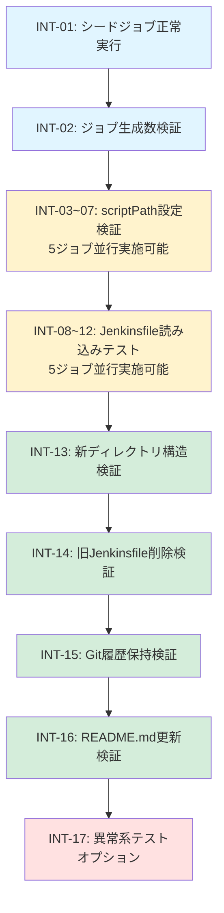

# テストシナリオ - Issue #232

## 0. Planning Documentの確認

Planning Phaseで策定されたテスト戦略を確認しました：

### テスト戦略
- **戦略**: INTEGRATION_ONLY（統合テストのみ）
- **根拠**: ロジック変更がなく、シードジョブ実行による統合動作確認が必要

### テスト対象範囲
- シードジョブとJob DSLの統合動作
- ファイル配置変更の正確性
- Jenkinsfile読み込みの正常性
- ジョブ生成の完全性

---

## 1. テスト戦略サマリー

### 1.1 選択されたテスト戦略

**INTEGRATION_ONLY**: 統合テストのみを実施

**判断根拠**（Phase 2から引用）:
- ロジック変更がなく、ファイルパスの変更のみのため、ユニットテストの対象がない
- シードジョブとJob DSLの統合動作確認が必要
- エンドユーザー向けストーリーではなく、内部的なディレクトリ構造の整理のため、BDDテストは不要

### 1.2 テスト対象の範囲

| コンポーネント | テスト対象 | テスト方法 |
|-------------|----------|----------|
| **シードジョブ** | 正常実行とジョブ生成 | Jenkins UIで手動実行 |
| **DSLファイル** | scriptPath更新の正確性 | シードジョブ実行後のジョブ設定確認 |
| **Jenkinsfile** | 正しい配置とアクセス可能性 | ジョブ実行時のJenkinsfile読み込み |
| **ディレクトリ構造** | 新規ディレクトリの存在とファイル配置 | ファイルシステム確認 |
| **README.md** | ドキュメントの正確性と一貫性 | 目視確認 |

### 1.3 テストの目的

1. **統合動作の検証**: シードジョブがDSLファイルを読み込み、正しくジョブを生成すること
2. **パス解決の検証**: 更新されたscriptPathが正しくJenkinsfileを参照すること
3. **ビルド可能性の検証**: 生成されたジョブが正常にビルドを開始できること
4. **完全性の検証**: すべてのファイルが正しく移動・更新されていること

---

## 2. Integrationテストシナリオ

### 2.1 シードジョブ実行による統合テスト

#### INT-01: シードジョブ正常実行テスト

**目的**: シードジョブが正常に実行され、エラーなく完了すること

**前提条件**:
- すべてのファイル変更（Jenkinsfile移動、DSL更新、README更新）がコミット・プッシュされている
- Jenkinsが稼働している
- シードジョブ（`Admin_Jobs/ai-workflow-job-creator`）が登録されている

**テスト手順**:
1. Jenkins UIにログイン
2. `Admin_Jobs/ai-workflow-job-creator` ジョブに移動
3. 「ビルド実行」ボタンをクリック
4. ビルドログをリアルタイムで監視

**期待結果**:
- ビルドステータスが `SUCCESS` になる
- ビルドログにエラーメッセージが含まれない
- "Processing DSL script" メッセージが5つのDSLファイルについて表示される
- "GeneratedJob" メッセージが50個のジョブについて表示される

**確認項目**:
- [ ] ビルドステータスが SUCCESS である
- [ ] ビルドログに "ERROR" または "FAILED" が含まれない
- [ ] すべてのDSLファイル（5個）が正常に処理された
- [ ] すべてのジョブ（50個）が生成された

**異常時の対応**:
- エラーが発生した場合、ビルドログからエラー箇所を特定
- DSLファイルの構文エラーまたはscriptPath指定ミスの可能性を確認
- 必要に応じてロールバック（Git revert）

---

#### INT-02: ジョブ生成数検証テスト

**目的**: 期待される数のジョブが生成されること

**前提条件**:
- INT-01が成功している

**テスト手順**:
1. Jenkins UIで `AI_Workflow` フォルダに移動
2. サブフォルダ一覧を確認（develop, stable-1〜9の10フォルダ）
3. 各フォルダ内のジョブ数を確認

**期待結果**:
- `AI_Workflow` フォルダ配下に10個のサブフォルダが存在する
  - develop
  - stable-1, stable-2, ..., stable-9
- 各サブフォルダ内に5個のジョブが存在する
  - all_phases
  - preset
  - single_phase
  - rollback
  - auto_issue
- 合計: 10フォルダ × 5ジョブ = 50ジョブ

**確認項目**:
- [ ] `AI_Workflow` フォルダが存在する
- [ ] サブフォルダ数が10個である
- [ ] 各サブフォルダに5個のジョブが存在する
- [ ] ジョブ名が正しい（all_phases, preset, single_phase, rollback, auto_issue）

**異常時の対応**:
- ジョブ数が不足している場合、DSLファイルの実行ログを確認
- 一部のジョブが生成されていない場合、該当するDSLファイルのscriptPath設定を確認

---

#### INT-03: scriptPath設定検証テスト（all-phases）

**目的**: all_phasesジョブのscriptPath設定が正しく更新されていること

**前提条件**:
- INT-02が成功している

**テスト手順**:
1. Jenkins UIで `AI_Workflow/develop/all_phases` ジョブに移動
2. 「設定」ボタンをクリック
3. "Pipeline" セクションまでスクロール
4. "Definition" が "Pipeline script from SCM" になっていることを確認
5. "Script Path" フィールドの値を確認

**期待結果**:
- Script Path: `jenkins/jobs/pipeline/ai-workflow/all-phases/Jenkinsfile`

**確認項目**:
- [ ] Definition が "Pipeline script from SCM" である
- [ ] SCM が "Git" である
- [ ] Repository URL が `https://github.com/tielec/ai-workflow-agent.git` である
- [ ] Script Path が `jenkins/jobs/pipeline/ai-workflow/all-phases/Jenkinsfile` である

**異常時の対応**:
- Script Pathが誤っている場合、DSLファイル（`ai_workflow_all_phases_job.groovy`）のscriptPath行を確認
- 修正後、シードジョブを再実行

---

#### INT-04: scriptPath設定検証テスト（preset）

**目的**: presetジョブのscriptPath設定が正しく更新されていること

**前提条件**:
- INT-02が成功している

**テスト手順**:
1. Jenkins UIで `AI_Workflow/develop/preset` ジョブに移動
2. 「設定」ボタンをクリック
3. "Pipeline" セクションの "Script Path" を確認

**期待結果**:
- Script Path: `jenkins/jobs/pipeline/ai-workflow/preset/Jenkinsfile`

**確認項目**:
- [ ] Script Path が `jenkins/jobs/pipeline/ai-workflow/preset/Jenkinsfile` である

**異常時の対応**:
- Script Pathが誤っている場合、DSLファイル（`ai_workflow_preset_job.groovy`）を確認

---

#### INT-05: scriptPath設定検証テスト（single-phase）

**目的**: single_phaseジョブのscriptPath設定が正しく更新されていること

**前提条件**:
- INT-02が成功している

**テスト手順**:
1. Jenkins UIで `AI_Workflow/develop/single_phase` ジョブに移動
2. 「設定」ボタンをクリック
3. "Pipeline" セクションの "Script Path" を確認

**期待結果**:
- Script Path: `jenkins/jobs/pipeline/ai-workflow/single-phase/Jenkinsfile`

**確認項目**:
- [ ] Script Path が `jenkins/jobs/pipeline/ai-workflow/single-phase/Jenkinsfile` である

**異常時の対応**:
- Script Pathが誤っている場合、DSLファイル（`ai_workflow_single_phase_job.groovy`）を確認

---

#### INT-06: scriptPath設定検証テスト（rollback）

**目的**: rollbackジョブのscriptPath設定が正しく更新されていること

**前提条件**:
- INT-02が成功している

**テスト手順**:
1. Jenkins UIで `AI_Workflow/develop/rollback` ジョブに移動
2. 「設定」ボタンをクリック
3. "Pipeline" セクションの "Script Path" を確認

**期待結果**:
- Script Path: `jenkins/jobs/pipeline/ai-workflow/rollback/Jenkinsfile`

**確認項目**:
- [ ] Script Path が `jenkins/jobs/pipeline/ai-workflow/rollback/Jenkinsfile` である

**異常時の対応**:
- Script Pathが誤っている場合、DSLファイル（`ai_workflow_rollback_job.groovy`）を確認

---

#### INT-07: scriptPath設定検証テスト（auto-issue）

**目的**: auto_issueジョブのscriptPath設定が正しく更新されていること

**前提条件**:
- INT-02が成功している

**テスト手順**:
1. Jenkins UIで `AI_Workflow/develop/auto_issue` ジョブに移動
2. 「設定」ボタンをクリック
3. "Pipeline" セクションの "Script Path" を確認

**期待結果**:
- Script Path: `jenkins/jobs/pipeline/ai-workflow/auto-issue/Jenkinsfile`

**確認項目**:
- [ ] Script Path が `jenkins/jobs/pipeline/ai-workflow/auto-issue/Jenkinsfile` である

**異常時の対応**:
- Script Pathが誤っている場合、DSLファイル（`ai_workflow_auto_issue_job.groovy`）を確認

---

### 2.2 ビルド可能性検証テスト

#### INT-08: all_phasesジョブのJenkinsfile読み込みテスト

**目的**: all_phasesジョブが正常にJenkinsfileを読み込み、ビルドを開始できること

**前提条件**:
- INT-03が成功している

**テスト手順**:
1. Jenkins UIで `AI_Workflow/develop/all_phases` ジョブに移動
2. 「パラメータ付きビルド」ボタンをクリック
3. パラメータを設定:
   - `ISSUE_URL`: テスト用のダミーURL（例: `https://github.com/tielec/test-repo/issues/1`）
   - `DRY_RUN`: `true`（ドライランモード）
   - その他: デフォルト値
4. 「ビルド」ボタンをクリック
5. ビルドログを監視

**期待結果**:
- ビルドが開始される
- ビルドログに「Jenkinsfile not found」等のエラーが表示されない
- Jenkinsfileの内容（stages定義）が正常に読み込まれる
- DRY_RUNモードのため、実際のワークフロー実行はスキップされる

**確認項目**:
- [ ] ビルドが開始される
- [ ] ビルドログに "Checking out Revision" メッセージが表示される
- [ ] ビルドログに "Loading Jenkinsfile" または類似のメッセージが表示される
- [ ] ビルドログに "Jenkinsfile not found" エラーが表示されない
- [ ] ビルドログに pipeline stages（Planning, Requirements等）が表示される

**異常時の対応**:
- "Jenkinsfile not found" エラーが表示された場合、scriptPath設定を再確認
- ファイルパスが正しいか、Gitリポジトリ上の実際のファイル配置を確認
- 必要に応じてJenkinsfileの移動操作を再実施

---

#### INT-09: presetジョブのJenkinsfile読み込みテスト

**目的**: presetジョブが正常にJenkinsfileを読み込み、ビルドを開始できること

**前提条件**:
- INT-04が成功している

**テスト手順**:
1. Jenkins UIで `AI_Workflow/develop/preset` ジョブに移動
2. 「パラメータ付きビルド」ボタンをクリック
3. パラメータを設定:
   - `ISSUE_URL`: テスト用のダミーURL
   - `PRESET`: `quick-fix`
   - `DRY_RUN`: `true`
   - その他: デフォルト値
4. 「ビルド」ボタンをクリック
5. ビルドログを監視

**期待結果**:
- ビルドが開始される
- Jenkinsfileが正常に読み込まれる
- DRY_RUNモードでの実行が確認できる

**確認項目**:
- [ ] ビルドが開始される
- [ ] "Jenkinsfile not found" エラーが表示されない
- [ ] pipeline stages が表示される
- [ ] PRESET パラメータが正しく認識される

**異常時の対応**:
- INT-08と同様の対応

---

#### INT-10: single_phaseジョブのJenkinsfile読み込みテスト

**目的**: single_phaseジョブが正常にJenkinsfileを読み込み、ビルドを開始できること

**前提条件**:
- INT-05が成功している

**テスト手順**:
1. Jenkins UIで `AI_Workflow/develop/single_phase` ジョブに移動
2. 「パラメータ付きビルド」ボタンをクリック
3. パラメータを設定:
   - `ISSUE_URL`: テスト用のダミーURL
   - `PHASE`: `implementation`
   - `DRY_RUN`: `true`
   - その他: デフォルト値
4. 「ビルド」ボタンをクリック
5. ビルドログを監視

**期待結果**:
- ビルドが開始される
- Jenkinsfileが正常に読み込まれる

**確認項目**:
- [ ] ビルドが開始される
- [ ] "Jenkinsfile not found" エラーが表示されない
- [ ] PHASE パラメータが正しく認識される

**異常時の対応**:
- INT-08と同様の対応

---

#### INT-11: rollbackジョブのJenkinsfile読み込みテスト

**目的**: rollbackジョブが正常にJenkinsfileを読み込み、ビルドを開始できること

**前提条件**:
- INT-06が成功している

**テスト手順**:
1. Jenkins UIで `AI_Workflow/develop/rollback` ジョブに移動
2. 「パラメータ付きビルド」ボタンをクリック
3. パラメータを設定:
   - `ISSUE_URL`: テスト用のダミーURL
   - `ROLLBACK_TO_PHASE`: `requirements`
   - `DRY_RUN`: `true`
   - その他: デフォルト値
4. 「ビルド」ボタンをクリック
5. ビルドログを監視

**期待結果**:
- ビルドが開始される
- Jenkinsfileが正常に読み込まれる

**確認項目**:
- [ ] ビルドが開始される
- [ ] "Jenkinsfile not found" エラーが表示されない
- [ ] ROLLBACK_TO_PHASE パラメータが正しく認識される

**異常時の対応**:
- INT-08と同様の対応

---

#### INT-12: auto_issueジョブのJenkinsfile読み込みテスト

**目的**: auto_issueジョブが正常にJenkinsfileを読み込み、ビルドを開始できること

**前提条件**:
- INT-07が成功している

**テスト手順**:
1. Jenkins UIで `AI_Workflow/develop/auto_issue` ジョブに移動
2. 「パラメータ付きビルド」ボタンをクリック
3. パラメータを設定:
   - `REPO_URL`: テスト用のリポジトリURL
   - `DRY_RUN`: `true`
   - その他: デフォルト値
4. 「ビルド」ボタンをクリック
5. ビルドログを監視

**期待結果**:
- ビルドが開始される
- Jenkinsfileが正常に読み込まれる

**確認項目**:
- [ ] ビルドが開始される
- [ ] "Jenkinsfile not found" エラーが表示されない
- [ ] REPO_URL パラメータが正しく認識される

**異常時の対応**:
- INT-08と同様の対応

---

### 2.3 ファイルシステム統合テスト

#### INT-13: 新ディレクトリ構造検証テスト

**目的**: 新しいディレクトリ構造が正しく作成されていること

**前提条件**:
- すべてのファイル変更がコミット・プッシュされている

**テスト手順**:
1. Gitリポジトリをクローン（またはプル）
2. `jenkins/jobs/pipeline/ai-workflow/` ディレクトリに移動
3. サブディレクトリ一覧を確認
4. 各サブディレクトリ内のファイルを確認

**期待結果**:
- `jenkins/jobs/pipeline/ai-workflow/` ディレクトリが存在する
- 以下の5つのサブディレクトリが存在する:
  - `all-phases/`
  - `preset/`
  - `single-phase/`
  - `rollback/`
  - `auto-issue/`
- 各サブディレクトリ内に `Jenkinsfile` が存在する

**確認項目**:
- [ ] `jenkins/jobs/pipeline/ai-workflow/` ディレクトリが存在する
- [ ] サブディレクトリ数が5個である
- [ ] 各サブディレクトリに `Jenkinsfile` が存在する
- [ ] Jenkinsfile のファイル名が正確である（拡張子なし）

**異常時の対応**:
- ディレクトリが存在しない場合、Phase 4の実装を再確認
- ファイル移動操作（git mv）が正しく実行されたか確認

---

#### INT-14: 旧Jenkinsfile削除検証テスト

**目的**: 旧ディレクトリのJenkinsfileが削除されていること

**前提条件**:
- INT-13が成功している

**テスト手順**:
1. `jenkins/` ディレクトリに移動
2. `Jenkinsfile.*` ファイルの存在を確認

**期待結果**:
- `jenkins/` ディレクトリ直下に以下のファイルが**存在しない**:
  - `Jenkinsfile.all-phases`
  - `Jenkinsfile.preset`
  - `Jenkinsfile.single-phase`
  - `Jenkinsfile.rollback`
  - `Jenkinsfile.auto-issue`
- シードジョブのJenkinsfileのみが残っている:
  - `jenkins/jobs/pipeline/_seed/ai-workflow-job-creator/Jenkinsfile`

**確認項目**:
- [ ] `jenkins/Jenkinsfile.all-phases` が存在しない
- [ ] `jenkins/Jenkinsfile.preset` が存在しない
- [ ] `jenkins/Jenkinsfile.single-phase` が存在しない
- [ ] `jenkins/Jenkinsfile.rollback` が存在しない
- [ ] `jenkins/Jenkinsfile.auto-issue` が存在しない
- [ ] シードジョブのJenkinsfileは残っている

**異常時の対応**:
- 旧ファイルが残っている場合、ファイル移動操作（git mv）を再実施
- `git mv` コマンドが正しく実行されたか確認

---

#### INT-15: Git履歴保持検証テスト

**目的**: ファイル移動操作でGit履歴が保持されていること

**前提条件**:
- INT-13、INT-14が成功している

**テスト手順**:
1. ターミナルで以下のコマンドを実行:
   ```bash
   git log --follow jenkins/jobs/pipeline/ai-workflow/all-phases/Jenkinsfile
   ```
2. コミット履歴を確認

**期待結果**:
- 移動前のファイル（`jenkins/Jenkinsfile.all-phases`）のコミット履歴が表示される
- `--follow` オプションにより、ファイル名変更をまたいで履歴が追跡される

**確認項目**:
- [ ] コミット履歴が表示される
- [ ] 移動前のファイル名（`jenkins/Jenkinsfile.all-phases`）が履歴に含まれる
- [ ] 履歴が途切れていない

**異常時の対応**:
- 履歴が失われている場合、`git mv` ではなく `mv` + `git add` が使用された可能性がある
- 必要に応じて、履歴を保持した移動操作を再実施

---

### 2.4 ドキュメント統合テスト

#### INT-16: README.md更新検証テスト

**目的**: README.mdのディレクトリ構造セクションが正しく更新されていること

**前提条件**:
- すべてのファイル変更がコミット・プッシュされている

**テスト手順**:
1. `jenkins/README.md` ファイルを開く
2. "ディレクトリ構造" セクション（## ディレクトリ構造）を確認
3. ディレクトリツリー図を視覚的に確認

**期待結果**:
- ディレクトリ構造セクションに以下の構造が記載されている:
  ```
  jenkins/
  ├── jobs/
  │   ├── pipeline/
  │   │   ├── _seed/
  │   │   │   └── ai-workflow-job-creator/
  │   │   │       ├── Jenkinsfile
  │   │   │       ├── folder-config.yaml
  │   │   │       └── job-config.yaml
  │   │   └── ai-workflow/
  │   │       ├── all-phases/
  │   │       │   └── Jenkinsfile
  │   │       ├── preset/
  │   │       │   └── Jenkinsfile
  │   │       ├── single-phase/
  │   │       │   └── Jenkinsfile
  │   │       ├── rollback/
  │   │       │   └── Jenkinsfile
  │   │       └── auto-issue/
  │   │           └── Jenkinsfile
  │   └── dsl/
  │       ├── folders.groovy
  │       └── ai-workflow/
  │           ├── ai_workflow_all_phases_job.groovy
  │           ├── ai_workflow_preset_job.groovy
  │           ├── ai_workflow_single_phase_job.groovy
  │           ├── ai_workflow_rollback_job.groovy
  │           ├── ai_workflow_auto_issue_job.groovy
  │           └── TEST_PLAN.md
  └── shared/
      └── common.groovy
  ```

**確認項目**:
- [ ] `ai-workflow/` ディレクトリが追加されている
- [ ] 5つのサブディレクトリ（all-phases, preset, single-phase, rollback, auto-issue）が記載されている
- [ ] 各サブディレクトリ配下に `Jenkinsfile` が記載されている
- [ ] Markdownフォーマットが正しい（インデント、リストマーカー）
- [ ] コードブロック（` ``` `）で囲まれている

**異常時の対応**:
- 記載内容が誤っている場合、README.mdを再編集
- フォーマットが崩れている場合、Markdownlintでチェック

---

### 2.5 異常系統合テスト（オプション）

#### INT-17: 存在しないscriptPath指定時のエラーハンドリングテスト

**目的**: 存在しないscriptPathを指定した場合に適切なエラーメッセージが表示されること

**前提条件**:
- テスト用のDSLファイルを作成できる環境

**テスト手順**:
1. テスト用のDSLファイルを作成:
   ```groovy
   pipelineJob('Test/invalid_scriptpath') {
       definition {
           cpsScm {
               scm {
                   git {
                       remote {
                           url('https://github.com/tielec/ai-workflow-agent.git')
                       }
                       branch('*/develop')
                   }
               }
               scriptPath('jenkins/jobs/pipeline/ai-workflow/nonexistent/Jenkinsfile')
           }
       }
   }
   ```
2. シードジョブで上記DSLファイルを実行
3. 生成されたジョブ（`Test/invalid_scriptpath`）を実行
4. エラーメッセージを確認

**期待結果**:
- ジョブ生成は成功する（DSL構文エラーがないため）
- ジョブ実行時にエラーが発生する
- エラーメッセージに「Jenkinsfile not found」または類似のメッセージが含まれる

**確認項目**:
- [ ] ジョブが生成される
- [ ] ジョブ実行時にエラーが発生する
- [ ] エラーメッセージが明確である

**注記**: このテストは**オプション**です。Phase 6で実施するかどうかを判断します。

---

## 3. テストデータ

### 3.1 正常データ

| データ種別 | 内容 |
|----------|------|
| **テスト用Issue URL** | `https://github.com/tielec/test-repo/issues/1` |
| **テスト用リポジトリURL** | `https://github.com/tielec/test-repo.git` |
| **DRY_RUNフラグ** | `true`（ドライランモード） |
| **PRESET値** | `quick-fix` |
| **PHASE値** | `implementation` |
| **ROLLBACK_TO_PHASE値** | `requirements` |

### 3.2 scriptPath期待値

| ジョブ種別 | 期待されるscriptPath |
|----------|---------------------|
| all_phases | `jenkins/jobs/pipeline/ai-workflow/all-phases/Jenkinsfile` |
| preset | `jenkins/jobs/pipeline/ai-workflow/preset/Jenkinsfile` |
| single_phase | `jenkins/jobs/pipeline/ai-workflow/single-phase/Jenkinsfile` |
| rollback | `jenkins/jobs/pipeline/ai-workflow/rollback/Jenkinsfile` |
| auto_issue | `jenkins/jobs/pipeline/ai-workflow/auto-issue/Jenkinsfile` |

### 3.3 ディレクトリ構造期待値

```
jenkins/jobs/pipeline/ai-workflow/
├── all-phases/
│   └── Jenkinsfile
├── preset/
│   └── Jenkinsfile
├── single-phase/
│   └── Jenkinsfile
├── rollback/
│   └── Jenkinsfile
└── auto-issue/
    └── Jenkinsfile
```

### 3.4 異常データ（異常系テスト用）

| データ種別 | 内容 |
|----------|------|
| **存在しないscriptPath** | `jenkins/jobs/pipeline/ai-workflow/nonexistent/Jenkinsfile` |
| **不正なscriptPath** | `../../../etc/passwd` |

---

## 4. テスト環境要件

### 4.1 必要なテスト環境

| 環境要素 | 要件 |
|---------|------|
| **Jenkins** | 稼働中のJenkinsサーバー（アクセス可能） |
| **Git** | Gitリポジトリ（ai-workflow-agent）へのアクセス |
| **認証情報** | Jenkins UIへのログイン認証情報 |
| **ブランチ** | テスト実行ブランチ（issue-232 または develop） |

### 4.2 必要な外部サービス

| サービス | 目的 |
|---------|------|
| **GitHub** | Gitリポジトリのホスティング |
| **Jenkins** | シードジョブとパイプラインジョブの実行 |

### 4.3 モック/スタブの必要性

**不要**: Integration Testでは実際のJenkinsとGitリポジトリを使用するため、モック/スタブは使用しません。

### 4.4 テスト実行手順の前提条件

1. **ファイル変更の完了**: Phase 4（実装）ですべてのファイル変更が完了していること
2. **コミット・プッシュ**: すべての変更がGitリポジトリにコミット・プッシュされていること
3. **Jenkins稼働**: Jenkinsサーバーが稼働中であること
4. **シードジョブ登録**: `Admin_Jobs/ai-workflow-job-creator` が登録されていること

---

## 5. テストシナリオ実行順序

### 5.1 推奨実行順序

統合テストは以下の順序で実施することを推奨します：



### 5.2 実行順序の理由

1. **INT-01（シードジョブ実行）**: すべてのテストの前提条件
2. **INT-02（ジョブ生成数）**: ジョブが正しく生成されたことを早期に確認
3. **INT-03~07（scriptPath検証）**: 個別ジョブの設定が正しいことを確認
4. **INT-08~12（ビルド可能性）**: Jenkinsfileが実際に読み込めることを確認
5. **INT-13~15（ファイルシステム）**: Git操作が正しく実施されたことを確認
6. **INT-16（ドキュメント）**: ドキュメントが正確であることを確認
7. **INT-17（異常系）**: 最後にオプションの異常系テストを実施

### 5.3 並行実行可能なテスト

以下のテストは並行実行可能です：

- **INT-03~07**: 5つのジョブのscriptPath検証（独立しているため）
- **INT-08~12**: 5つのジョブのビルド可能性検証（独立しているため）

---

## 6. 品質ゲート（Phase 3）

このテストシナリオは、以下の品質ゲートを満たしています：

### ✅ Phase 2の戦略に沿ったテストシナリオである

- **INTEGRATION_ONLY** 戦略に基づき、統合テストのみを作成
- Unitテスト、BDDテストは含まれていない

### ✅ 主要な正常系がカバーされている

- シードジョブ実行（INT-01）
- ジョブ生成（INT-02）
- scriptPath設定検証（INT-03~07）
- Jenkinsfile読み込み検証（INT-08~12）
- ファイルシステム検証（INT-13~15）
- ドキュメント検証（INT-16）

### ✅ 主要な異常系がカバーされている

- 存在しないscriptPath指定時のエラーハンドリング（INT-17）

### ✅ 期待結果が明確である

- すべてのテストケースで「期待結果」セクションを明記
- 具体的な確認項目をチェックリスト形式で提供
- 異常時の対応方法を記載

---

## 7. テスト実行チェックリスト

### 7.1 事前準備

- [ ] すべてのファイル変更（Jenkinsfile移動、DSL更新、README更新）が完了している
- [ ] すべての変更がコミット・プッシュされている
- [ ] Jenkinsサーバーが稼働している
- [ ] シードジョブ（`Admin_Jobs/ai-workflow-job-creator`）が登録されている
- [ ] Jenkins UIへのアクセス権限がある

### 7.2 必須テスト（Phase 6で実施）

- [ ] INT-01: シードジョブ正常実行テスト
- [ ] INT-02: ジョブ生成数検証テスト
- [ ] INT-03: scriptPath設定検証テスト（all-phases）
- [ ] INT-04: scriptPath設定検証テスト（preset）
- [ ] INT-05: scriptPath設定検証テスト（single-phase）
- [ ] INT-06: scriptPath設定検証テスト（rollback）
- [ ] INT-07: scriptPath設定検証テスト（auto-issue）
- [ ] INT-08: all_phasesジョブのJenkinsfile読み込みテスト
- [ ] INT-09: presetジョブのJenkinsfile読み込みテスト
- [ ] INT-10: single_phaseジョブのJenkinsfile読み込みテスト
- [ ] INT-11: rollbackジョブのJenkinsfile読み込みテスト
- [ ] INT-12: auto_issueジョブのJenkinsfile読み込みテスト
- [ ] INT-13: 新ディレクトリ構造検証テスト
- [ ] INT-14: 旧Jenkinsfile削除検証テスト
- [ ] INT-15: Git履歴保持検証テスト
- [ ] INT-16: README.md更新検証テスト

### 7.3 オプションテスト

- [ ] INT-17: 存在しないscriptPath指定時のエラーハンドリングテスト

### 7.4 テスト完了条件

すべての必須テスト（INT-01~16）が成功すること

---

## 8. 補足情報

### 8.1 テスト実行時の注意事項

1. **シードジョブ実行のタイミング**: すべてのファイル変更をコミット・プッシュ後に実行すること
2. **DRY_RUNモードの活用**: ビルド可能性検証テストでは必ずDRY_RUNモードを使用すること
3. **並行実行の制限**: シードジョブは同時実行を無効化しているため、他のビルドが実行中の場合は待機すること
4. **スクリーンショットの保存**: Phase 6のテスト実行時に、証跡としてスクリーンショットを保存すること推奨

### 8.2 トラブルシューティング

| 問題 | 原因 | 対処方法 |
|------|------|---------|
| シードジョブが失敗する | DSL構文エラー | ビルドログからエラー箇所を特定し、DSLファイルを修正 |
| scriptPathが正しくない | DSLファイルの更新漏れ | 該当するDSLファイルのscriptPath行を確認・修正 |
| Jenkinsfile not found | ファイル移動の失敗 | Gitリポジトリ上の実際のファイル配置を確認 |
| ジョブ数が不足 | DSLファイルの実行漏れ | シードジョブのビルドログを確認し、すべてのDSLファイルが処理されたか確認 |

### 8.3 関連ドキュメント

- [要件定義書](../../01_requirements/output/requirements.md) - 受け入れ基準の詳細
- [設計書](../../02_design/output/design.md) - テスト計画の詳細
- [Planning Document](../../00_planning/output/planning.md) - テスト戦略の根拠

---

**作成日時**: 2025-01-31
**バージョン**: 1.0
**最終更新**: Phase 3 (Test Scenario) - テストシナリオ作成完了
