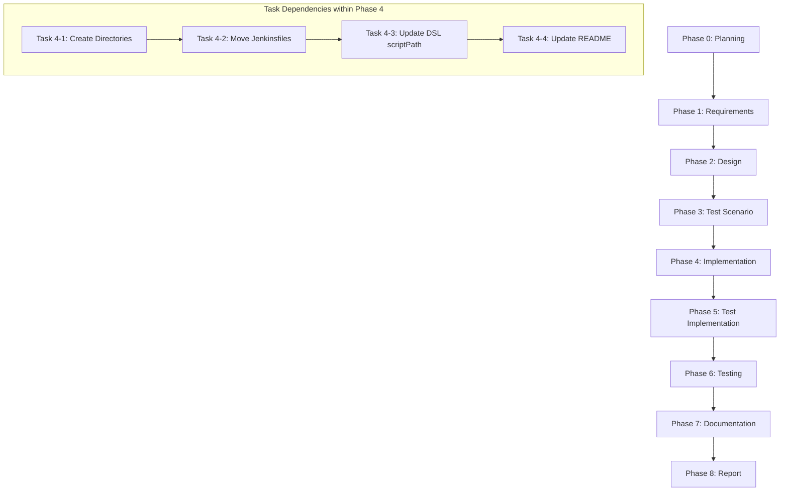

# プロジェクト計画書 - Issue #236

## Issue概要

- **Issue番号**: #236
- **タイトル**: Jenkins Job用Jenkinsfileを適切なディレクトリに配置
- **状態**: open
- **URL**: https://github.com/tielec/ai-workflow-agent/issues/236

## 1. Issue分析

### 複雑度
**判定**: 簡単

### 見積もり工数
**合計: 2~3時間**

**根拠**:
- ファイル移動作業: 0.5時間（5ファイルの移動と確認）
- DSL scriptPath更新: 1時間（5 DSLファイルの修正とテスト）
- README.md更新: 0.5時間（ディレクトリ構造図の更新）
- 動作確認: 1時間（シードジョブの実行とジョブ生成確認）

### リスク評価
**判定**: 低

**根拠**:
- 単純なファイル移動と参照更新のみ
- 既存の動作ロジックに変更なし
- リスク要因は設定ミスによるジョブ生成失敗程度（容易に復旧可能）

---

## 2. 実装戦略判断

### 実装戦略: EXTEND

**判断根拠**:
- **既存のディレクトリ構造を拡張**して新しい配置場所を作成
- Jenkinsfileの内容自体は**変更せず移動のみ**
- DSLファイルの `scriptPath` パラメータを**拡張**（新しいパスに更新）
- 新規ファイルの作成はなく、既存ファイルの移動と設定変更が中心
- アーキテクチャ変更や新機能追加ではなく、**既存構造の整理・拡張**

この判断により:
- Phase 2（Design）では既存ディレクトリ構造の拡張設計を実施
- Phase 4（Implementation）では既存ファイルの移動とDSL修正を実施
- Phase 7（Documentation）ではREADME.mdのディレクトリ構造図を更新

### テスト戦略: INTEGRATION_ONLY

**判断根拠**:
- **ユニットテストは不要**: ロジック変更がなく、ファイル配置変更のみ
- **統合テストは必須**: DSL → Jenkinsfileの参照が正しく機能するか確認
- **統合テスト内容**:
  1. シードジョブを実行してDSLからJenkinsfileへの参照を検証
  2. 各実行モード（all-phases, preset, single-phase, rollback, auto-issue）のジョブが正しく生成されるか確認
  3. 生成されたジョブの設定（scriptPath）が正しいか検証
- BDDテストは不要（ユーザーストーリーではなく内部構造の整理）

**テスト方針**:
- Jenkins上でシードジョブ（`Admin_Jobs/ai-workflow-job-creator`）を実行
- 50ジョブ（5種類 × 10フォルダ）が正常に生成されることを確認
- 各ジョブの設定画面で `scriptPath` が正しいパスを指していることを確認

### テストコード戦略: 該当なし

**判断根拠**:
- ファイル移動とDSL設定変更のみのため、**プログラマティックなテストコードは不要**
- 統合テストは**手動テスト**で実施（Jenkins UI上でシードジョブ実行と確認）
- Phase 5（Test Implementation）では手動テスト手順書を作成
- Phase 6（Testing）では実際にJenkins上でテストを実行

**テスト方法**:
- 手動テスト手順書に基づいてJenkins UIで操作
- テスト結果をスクリーンショット・コンソールログで記録

---

## 3. 影響範囲分析

### 変更対象ファイル

#### 移動対象（5ファイル）
| 現在のパス | 移動先パス |
|-----------|-----------|
| `jenkins/Jenkinsfile.all-phases` | `jenkins/jobs/pipeline/ai-workflow/all-phases/Jenkinsfile` |
| `jenkins/Jenkinsfile.preset` | `jenkins/jobs/pipeline/ai-workflow/preset/Jenkinsfile` |
| `jenkins/Jenkinsfile.single-phase` | `jenkins/jobs/pipeline/ai-workflow/single-phase/Jenkinsfile` |
| `jenkins/Jenkinsfile.rollback` | `jenkins/jobs/pipeline/ai-workflow/rollback/Jenkinsfile` |
| `jenkins/Jenkinsfile.auto-issue` | `jenkins/jobs/pipeline/ai-workflow/auto-issue/Jenkinsfile` |

#### 修正対象（5 DSLファイル）
| ファイル | 現在の scriptPath | 新しい scriptPath |
|---------|------------------|------------------|
| `jenkins/jobs/dsl/ai-workflow/ai_workflow_all_phases_job.groovy` | `Jenkinsfile` | `jenkins/jobs/pipeline/ai-workflow/all-phases/Jenkinsfile` |
| `jenkins/jobs/dsl/ai-workflow/ai_workflow_preset_job.groovy` | `Jenkinsfile` | `jenkins/jobs/pipeline/ai-workflow/preset/Jenkinsfile` |
| `jenkins/jobs/dsl/ai-workflow/ai_workflow_single_phase_job.groovy` | `Jenkinsfile` | `jenkins/jobs/pipeline/ai-workflow/single-phase/Jenkinsfile` |
| `jenkins/jobs/dsl/ai-workflow/ai_workflow_rollback_job.groovy` | `jenkins/jobs/pipeline/ai-workflow/rollback/Jenkinsfile` |
| `jenkins/jobs/dsl/ai-workflow/ai_workflow_auto_issue_job.groovy` | `jenkins/jobs/pipeline/ai-workflow/auto-issue/Jenkinsfile` |

#### ドキュメント更新（1ファイル）
- `jenkins/README.md`

### 既存コードへの影響
- **影響あり**: DSLファイルの `scriptPath` 設定値のみ
- **影響なし**: Jenkinsfileの内容、共通ライブラリ（`jenkins/shared/common.groovy`）
- **影響なし**: シードジョブの設定（`jenkins/jobs/pipeline/_seed/ai-workflow-job-creator/Jenkinsfile`）

### 依存関係の変更
- **新規依存の追加**: なし
- **既存依存の変更**: なし
- **Git履歴への影響**: ファイル移動は `git mv` を使用してコミット履歴を保持

### マイグレーション要否
- **不要**: データベース、設定ファイル等の変更なし

---

## 4. タスク分割

## ⚠️ 重要: チェックリスト標準フォーマット（必須）

このチェックリストは、Review Phaseで完了判定に使用されます。

### Phase 1: 要件定義 (見積もり: 0.5h)

- [ ] Task 1-1: 要件の明確化 (0.5h)
  - 移動元・移動先のディレクトリパスを確認
  - DSLファイルの現在の scriptPath 設定を確認
  - 完了条件（Issue本文記載の4項目）を確認

### Phase 2: 設計 (見積もり: 0.5h)

- [ ] Task 2-1: ディレクトリ構造の設計 (0.3h)
  - 新しいディレクトリ構造の階層を設計
  - 各実行モードのディレクトリ名を決定（all-phases, preset, single-phase, rollback, auto-issue）
- [ ] Task 2-2: DSL scriptPath の新しい値を設計 (0.2h)
  - 各DSLファイルの scriptPath パラメータに設定する値を決定
  - リポジトリルートからの相対パスを確認

### Phase 3: テストシナリオ (見積もり: 0.5h)

- [ ] Task 3-1: 統合テストシナリオの作成 (0.5h)
  - テストケース1: シードジョブが正常に実行できること
  - テストケース2: 50ジョブ（5種類 × 10フォルダ）が正常に生成されること
  - テストケース3: 各ジョブの設定で scriptPath が正しいパスを指していること
  - 期待結果と検証方法を明記

### Phase 4: 実装 (見積もり: 1.5h)

- [ ] Task 4-1: ディレクトリ構造の作成 (0.2h)
  - `jenkins/jobs/pipeline/ai-workflow/` ディレクトリを作成
  - 各実行モード用のサブディレクトリを作成（all-phases, preset, single-phase, rollback, auto-issue）
- [ ] Task 4-2: Jenkinsfile の移動 (0.3h)
  - `git mv` を使用して5つのJenkinsfileを新しいディレクトリに移動
  - コミット履歴が保持されていることを確認
- [ ] Task 4-3: DSL scriptPath の更新 (0.5h)
  - 5つのDSLファイルの scriptPath を新しいパスに更新
  - 構文エラーがないことを確認
- [ ] Task 4-4: README.md の更新 (0.5h)
  - ディレクトリ構造図を新しい構造に更新
  - 説明文の調整（必要に応じて）

### Phase 5: テストコード実装 (見積もり: 0.5h)

- [ ] Task 5-1: 手動テスト手順書の作成 (0.5h)
  - シードジョブの実行手順を記載
  - ジョブ生成確認の手順を記載
  - scriptPath 検証の手順を記載

### Phase 6: テスト実行 (見積もり: 1h)

- [ ] Task 6-1: シードジョブの実行 (0.3h)
  - Jenkins上で `Admin_Jobs/ai-workflow-job-creator` を実行
  - コンソールログを確認してエラーがないことを確認
- [ ] Task 6-2: ジョブ生成の確認 (0.4h)
  - 50ジョブが正常に生成されたことを確認
  - 各ジョブのフォルダ配置が正しいことを確認
- [ ] Task 6-3: scriptPath の検証 (0.3h)
  - 各ジョブの設定画面を開いて scriptPath が正しいことを確認
  - 最低1つずつ（5ジョブ）を手動確認

### Phase 7: ドキュメント (見積もり: 0.3h)

- [ ] Task 7-1: 変更内容の記録 (0.3h)
  - 移動したファイルのリストを記録
  - 更新したDSLファイルのリストを記録
  - テスト結果を記録

### Phase 8: レポート (見積もり: 0.2h)

- [ ] Task 8-1: 完了レポートの作成 (0.2h)
  - 実施内容のサマリーを作成
  - 完了条件（4項目）の達成状況を確認

---

## 5. 依存関係

### フェーズ間の依存関係
- **Phase 1 → Phase 2**: 要件定義で確認した移動元・移動先パスを設計で使用
- **Phase 2 → Phase 3**: 設計したディレクトリ構造とscriptPathをテストシナリオで検証
- **Phase 3 → Phase 4**: テストシナリオで定義した検証項目を実装で実現
- **Phase 4 → Phase 5**: 実装完了後にテスト手順書を作成
- **Phase 5 → Phase 6**: テスト手順書に基づいてテストを実行

### タスク間の依存関係（Phase 4内）
1. **Task 4-1（ディレクトリ作成）が完了しないと**、Task 4-2（ファイル移動）は実行不可
2. **Task 4-2（ファイル移動）が完了しないと**、Task 4-3（DSL更新）は意味がない
3. **Task 4-3（DSL更新）が完了しないと**、Task 4-4（README更新）で正確な情報を記載できない

---

## 6. リスクと軽減策

### リスク1: DSL scriptPath の設定ミス
- **影響度**: 中
- **確率**: 低
- **影響**: ジョブ生成時に scriptPath が見つからず、ジョブが正常に動作しない
- **軽減策**:
  - Phase 4（Implementation）で構文チェックを実施
  - Phase 6（Testing）でシードジョブ実行前にDSLファイルをレビュー
  - テスト失敗時は修正後に再度シードジョブを実行

### リスク2: ファイル移動時のコミット履歴喪失
- **影響度**: 低
- **確率**: 低
- **影響**: `git mv` を使わないとコミット履歴が失われる
- **軽減策**:
  - 必ず `git mv` コマンドを使用
  - 移動後に `git log --follow <file>` でコミット履歴が保持されていることを確認

### リスク3: シードジョブ実行時のエラー
- **影響度**: 中
- **確率**: 低
- **影響**: DSL構文エラーでジョブ生成に失敗
- **軽減策**:
  - Phase 6（Testing）の前にDSLファイルのGroovy構文チェックを実施
  - エラー発生時はコンソールログを確認して修正

### リスク4: Jenkins上の既存ジョブへの影響
- **影響度**: 低
- **確率**: 極低
- **影響**: 既存のジョブ設定が上書きされる
- **軽減策**:
  - シードジョブは既存ジョブの設定を上書きしない（Job DSLの設計による）
  - 万が一上書きされても、再度シードジョブを実行すれば復旧可能

---

## 7. 品質ゲート

### Phase 1: 要件定義
- [ ] 移動元・移動先のディレクトリパスが明確に記載されている
- [ ] DSLファイルの現在の scriptPath 設定が確認されている
- [ ] 完了条件（Issue本文記載の4項目）が明確に記載されている

### Phase 2: 設計
- [ ] 新しいディレクトリ構造が図示されている
- [ ] 各DSLファイルの scriptPath の新しい値が明確に設計されている
- [ ] 実装戦略（EXTEND）の判断根拠が明記されている
- [ ] テスト戦略（INTEGRATION_ONLY）の判断根拠が明記されている

### Phase 3: テストシナリオ
- [ ] 統合テストのテストケースが3つ以上定義されている
- [ ] 各テストケースに期待結果と検証方法が記載されている
- [ ] テスト失敗時の対応手順が記載されている

### Phase 4: 実装
- [ ] 新しいディレクトリが作成されている（`jenkins/jobs/pipeline/ai-workflow/`配下）
- [ ] 5つのJenkinsfileが正しいディレクトリに移動されている
- [ ] 5つのDSLファイルの scriptPath が正しく更新されている
- [ ] `jenkins/README.md` のディレクトリ構造図が更新されている
- [ ] `git mv` を使用してコミット履歴が保持されている

### Phase 5: テストコード実装
- [ ] 手動テスト手順書が作成されている
- [ ] シードジョブの実行手順が記載されている
- [ ] ジョブ生成確認の手順が記載されている
- [ ] scriptPath 検証の手順が記載されている

### Phase 6: テスト実行
- [ ] シードジョブが正常に実行されている
- [ ] 50ジョブ（5種類 × 10フォルダ）が正常に生成されている
- [ ] 各ジョブの scriptPath が正しいパスを指している（最低5ジョブを手動確認）
- [ ] テスト結果がスクリーンショット・コンソールログで記録されている

### Phase 7: ドキュメント
- [ ] 移動したファイルのリストが記録されている
- [ ] 更新したDSLファイルのリストが記録されている
- [ ] テスト結果が記録されている

### Phase 8: レポート
- [ ] 完了条件（4項目）の達成状況が確認されている
- [ ] 実施内容のサマリーが作成されている
- [ ] Issue #236のクローズ準備が完了している

---

## 8. 完了条件（Issue #236 より）

以下の4項目をすべて達成することで、このIssueは完了とみなされます：

1. ✅ **各Jenkinsfileが適切なディレクトリに移動されている**
   - 検証方法: `jenkins/jobs/pipeline/ai-workflow/` 配下に5つのディレクトリが存在し、各Jenkinsfileが配置されていることを確認

2. ✅ **DSLファイルの scriptPath が正しく更新されている**
   - 検証方法: 5つのDSLファイルを開き、scriptPath が新しいパスに更新されていることを確認

3. ✅ **`jenkins/README.md` が更新されている**
   - 検証方法: README.mdのディレクトリ構造図が新しい構造を反映していることを確認

4. ✅ **シードジョブを実行してジョブが正常に生成されることを確認**
   - 検証方法: Jenkins上で `Admin_Jobs/ai-workflow-job-creator` を実行し、50ジョブが正常に生成されることを確認

---

## 9. まとめ

このIssueは、Issue #230（Jenkins Job定義の移行）の後続作業として、Jenkinsfileを標準的なディレクトリ構造に整理するものです。

**特徴**:
- **低リスク**: ロジック変更なし、ファイル移動と設定更新のみ
- **短期間**: 合計2~3時間の工数で完了可能
- **明確な完了条件**: Issue本文記載の4項目で客観的に検証可能

**実装アプローチ**:
- **実装戦略: EXTEND** - 既存ディレクトリ構造を拡張し、ファイルを移動
- **テスト戦略: INTEGRATION_ONLY** - Jenkins上でシードジョブを実行して統合テスト

**次のフェーズへ**:
- Phase 1（要件定義）で移動元・移動先パスを確認
- Phase 2（設計）で新しいディレクトリ構造とscriptPathを設計
- Phase 4（実装）で実際のファイル移動とDSL更新を実施
- Phase 6（テスト）でJenkins上で動作確認

---

**作成日**: 2025-01-31
**作成者**: AI Workflow Agent (Phase 0: Planning)
