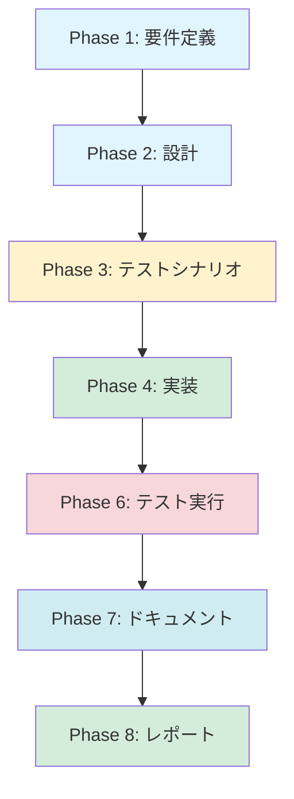

# Claude Agent 実行ログ

生成日時: 2025/12/5 11:37:05

---

## Turn 1: システム初期化

**セッションID**: `8b734c49-cfbc-40e8-bd65-2296ac8e7f78`
**モデル**: claude-sonnet-4-5-20250929
**権限モード**: bypassPermissions
**利用可能ツール**: Task, Bash, Glob, Grep, ExitPlanMode, Read, Edit, Write, NotebookEdit, WebFetch, TodoWrite, WebSearch, BashOutput, KillShell, Skill, SlashCommand

## Turn 2: AI応答

# プロジェクト計画書

## Issue #238: Jenkins Job用Jenkinsfileを適切なディレクトリに配置

---

## 1. Issue分析

### 複雑度: 簡単

**判定理由**:
- ファイル移動とパス参照の更新のみで、コードロジックの変更は不要
- 既存の動作を変えずにディレクトリ構造を整理する作業
- リスクは低く、手順が明確

### 見積もり工数: 2～3時間

**根拠**:
- ファイル移動作業: 0.5時間
- DSLファイルのscriptPath更新（5ファイル）: 0.5時間
- README.md更新: 0.5時間
- シードジョブ実行とテスト: 1～1.5時間
- 合計: 2.5～3時間

### リスク評価: 低

**理由**:
- ファイル移動のみで既存ロジックに影響なし
- 変更対象が明確（Jenkinsfile 5本、DSLファイル 5本、README.md 1本）
- 元の構造に戻すことが容易（ロールバック可能）

---

## 2. 実装戦略判断

### 実装戦略: REFACTOR

**判断根拠**:
- 既存のJenkinsfileを新しいディレクトリ構造に移動し、参照パスを更新する
- コードの機能変更は一切なく、ファイル配置の最適化のみ
- 新規ファイルの作成もなく、既存コードの拡張でもないため、REFACTORが最適

**作業内容**:
1. Jenkinsfileのディレクトリ移動
2. DSLファイルのパス参照更新
3. ドキュメントの更新

### テスト戦略: INTEGRATION_ONLY

**判断根拠**:
- ユニットテストが不要な作業（ロジック変更なし）
- シードジョブの実行によるジョブ生成確認が必要（インテグレーションテスト）
- BDDテストも不要（ユーザーストーリーの変更なし）
- Jenkins環境でのジョブ生成と動作確認のみで十分

**テスト観点**:
- シードジョブが正常に実行できるか
- 各モード用のJenkinsジョブが正しく生成されるか
- 生成されたジョブがJenkinsfileを正しく参照しているか
- 既存ジョブの動作に影響がないか

### テストコード戦略: EXTEND_TEST（該当なし）

**判断根拠**:
- 自動化されたテストコードの追加は不要
- 手動でのシードジョブ実行とジョブ生成確認のみで十分
- テストコード戦略としては**該当なし**が正確だが、選択肢の中から選ぶならEXTEND_TEST（既存の検証手順の確認）が最も近い

---

## 3. 影響範囲分析

### 既存コードへの影響

**変更対象**:
| ファイル種別 | ファイル数 | 変更内容 |
|------------|----------|---------|
| Jenkinsfile | 5本 | ディレクトリ移動 |
| DSLファイル（.groovy） | 5本 | scriptPath更新 |
| README.md | 1本 | ディレクトリ構造の説明更新 |

**変更不要**:
- シードジョブ用Jenkinsfile（`jenkins/jobs/pipeline/_seed/ai-workflow-job-creator/Jenkinsfile`）
- 共通処理モジュール（`jenkins/shared/common.groovy`）
- その他のプロジェクトファイル

### 依存関係の変更

**依存関係**: なし
- 外部ライブラリの追加・削除なし
- package.jsonの変更なし

### マイグレーション要否

**マイグレーション**: 不要
- データベース変更なし
- 設定ファイルの形式変更なし
- 既存のJenkinsジョブは再生成により自動的に新パスを参照

---

## 4. タスク分割

### Phase 1: 要件定義 (見積もり: 0.5h)

- [ ] Task 1-1: 移動対象ファイルの確認 (0.2h)
  - `jenkins/` 直下のJenkinsfile 5本を特定
  - 対応するDSLファイル 5本を特定
- [ ] Task 1-2: 新ディレクトリ構造の確認 (0.2h)
  - `jenkins/jobs/pipeline/ai-workflow/` 以下のサブディレクトリ構成を確認
  - 各モードの配置先を決定
- [ ] Task 1-3: 受け入れ基準の定義 (0.1h)
  - シードジョブ実行成功
  - 5つのジョブが正しく生成される
  - 既存ジョブの動作に影響なし

### Phase 2: 設計 (見積もり: 0.5h)

- [ ] Task 2-1: ディレクトリ構造の設計 (0.2h)
  - 新ディレクトリ構造の確定
  - 命名規則の確認（kebab-case）
- [ ] Task 2-2: 更新対象ファイルリストの作成 (0.2h)
  - DSLファイルごとの変更前・変更後scriptPathを一覧化
  - README.mdの更新箇所を特定
- [ ] Task 2-3: ロールバック手順の検討 (0.1h)
  - Gitでのrevert手順を確認

### Phase 3: テストシナリオ (見積もり: 0.5h)

- [x] Task 3-1: シードジョブテストシナリオの作成 (0.3h)
  - シードジョブ実行手順の文書化
  - 期待される結果（5つのジョブが生成される）の明記
  - 各ジョブのscriptPath確認方法の記載
- [x] Task 3-2: 既存ジョブ動作確認シナリオの作成 (0.2h)
  - 既存ジョブの設定確認手順
  - ジョブ実行テスト（dry-runまたは最小構成）の手順

### Phase 4: 実装 (見積もり: 1.0h)

- [ ] Task 4-1: 新ディレクトリの作成 (0.1h)
  - `jenkins/jobs/pipeline/ai-workflow/all-phases/` 作成
  - `jenkins/jobs/pipeline/ai-workflow/preset/` 作成
  - `jenkins/jobs/pipeline/ai-workflow/single-phase/` 作成
  - `jenkins/jobs/pipeline/ai-workflow/rollback/` 作成
  - `jenkins/jobs/pipeline/ai-workflow/auto-issue/` 作成
- [ ] Task 4-2: Jenkinsfileの移動 (0.2h)
  - `Jenkinsfile.all-phases` → `all-phases/Jenkinsfile`
  - `Jenkinsfile.preset` → `preset/Jenkinsfile`
  - `Jenkinsfile.single-phase` → `single-phase/Jenkinsfile`
  - `Jenkinsfile.rollback` → `rollback/Jenkinsfile`
  - `Jenkinsfile.auto-issue` → `auto-issue/Jenkinsfile`
- [ ] Task 4-3: DSLファイルのscriptPath更新 (0.4h)
  - `ai_workflow_all_phases_job.groovy` のscriptPath更新
  - `ai_workflow_preset_job.groovy` のscriptPath更新
  - `ai_workflow_single_phase_job.groovy` のscriptPath更新
  - `ai_workflow_rollback_job.groovy` のscriptPath更新
  - `ai_workflow_auto_issue_job.groovy` のscriptPath更新
- [ ] Task 4-4: README.mdの更新 (0.3h)
  - ディレクトリ構造図の更新
  - 各Jenkinsfileのパス説明の更新

### Phase 5: テストコード実装 (見積もり: 0h)

- [ ] Task 5-1: テストコード不要 (0h)
  - 自動テストコードは不要（手動統合テストのみ）

### Phase 6: テスト実行 (見積もり: 1.0h)

- [ ] Task 6-1: ローカル環境での構文確認 (0.2h)
  - 各DSLファイルの構文チェック
  - scriptPathの相対パス記法の確認
- [ ] Task 6-2: シードジョブの実行 (0.4h)
  - Jenkins環境でシードジョブを実行
  - 5つのジョブが正常に生成されることを確認
  - 各ジョブの設定画面でscriptPathが正しいことを確認
- [ ] Task 6-3: 既存ジョブの動作確認 (0.4h)
  - 既存の各モード用ジョブが正常に動作することを確認
  - 少なくとも1つのジョブで実際のビルドを試行（dry-run推奨）

### Phase 7: ドキュメント (見積もり: 0.5h)

- [x] Task 7-1: README.mdの最終確認 (0.2h)
  - ディレクトリ構造の記載が正確か確認
  - 例示コマンドが正しいか確認
- [x] Task 7-2: ARCHITECTURE.mdの確認 (0.2h)
  - Jenkins統合セクションの更新要否を確認
  - 必要に応じて更新
- [x] Task 7-3: コミットメッセージの作成 (0.1h)
  - 変更内容を簡潔に記載
  - Issue #238 への参照を含める

### Phase 8: レポート (見積もり: 0.5h)

- [ ] Task 8-1: 実施内容のサマリー作成 (0.2h)
  - 移動したファイル一覧
  - 更新したDSLファイル一覧
  - テスト結果のサマリー
- [ ] Task 8-2: スクリーンショットの取得 (0.2h)
  - シードジョブ実行成功画面
  - 生成されたジョブの一覧画面
- [ ] Task 8-3: 完了レポートの作成 (0.1h)
  - Issue #238 にコメント投稿
  - 完了条件の達成を報告

---

## 5. 依存関係

**注意**: Phase 5（テストコード実装）は不要のためスキップ

---

## 6. リスクと軽減策

### リスク1: DSLファイルのscriptPath記法の誤り

- **影響度**: 中
- **確率**: 低
- **軽減策**: 
  - Jenkinsの公式ドキュメントでscriptPathの正しい記法を確認
  - 既存の動作しているDSLファイル（シードジョブ用）を参考にする
  - ローカル環境で構文チェックを実施

### リスク2: シードジョブ実行時のエラー

- **影響度**: 中
- **確率**: 低
- **軽減策**:
  - 事前にGitブランチで作業し、mainブランチは保護
  - エラー発生時はログを詳細に確認
  - ロールバック手順を準備（Git revert）

### リスク3: 既存ジョブへの意図しない影響

- **影響度**: 低
- **確率**: 低
- **軽減策**:
  - シードジョブ用Jenkinsfileは変更しないことを確認
  - 既存ジョブの設定が上書きされないことを確認
  - テスト環境がある場合は先にテスト環境で確認

### リスク4: ドキュメントの更新漏れ

- **影響度**: 低
- **確率**: 低
- **軽減策**:
  - README.md以外に更新が必要なドキュメントがないかチェック
  - ARCHITECTURE.mdの確認を明示的にタスクに含める

---

## 7. 品質ゲート

### Phase 1: 要件定義

- [ ] 移動対象Jenkinsfile（5本）がすべて特定されている
- [ ] 対応するDSLファイル（5本）がすべて特定されている
- [ ] 新ディレクトリ構造が明確に定義されている
- [ ] 受け入れ基準（シードジョブ実行成功、ジョブ生成確認）が明記されている

### Phase 2: 設計

- [ ] 実装戦略の判断根拠が明記されている（REFACTOR）
- [ ] テスト戦略の判断根拠が明記されている（INTEGRATION_ONLY）
- [ ] テストコード戦略の判断根拠が明記されている（該当なし）
- [ ] 更新対象ファイルリスト（変更前・変更後のパス）が作成されている
- [ ] ロールバック手順が検討されている

### Phase 3: テストシナリオ

- [x] シードジョブ実行手順が文書化されている
- [x] 期待される結果（5つのジョブ生成）が明記されている
- [x] 各ジョブのscriptPath確認方法が記載されている
- [x] 既存ジョブの動作確認手順が記載されている

### Phase 4: 実装

- [ ] 5つの新ディレクトリが作成されている
- [ ] 5つのJenkinsfileが正しいディレクトリに移動されている
- [ ] 5つのDSLファイルのscriptPathが更新されている
- [ ] README.mdが更新されている
- [ ] Gitコミットメッセージが適切に記載されている

### Phase 6: テスト実行

- [ ] DSLファイルの構文エラーがない
- [ ] シードジョブが正常に実行できる
- [ ] 5つのジョブが正しく生成されている
- [ ] 各ジョブのscriptPathが正しい
- [ ] 既存ジョブの動作に影響がない

### Phase 7: ドキュメント

- [x] README.mdのディレクトリ構造図が正確
- [x] ARCHITECTURE.mdの更新要否が確認されている（必要なら更新済み）
- [x] 変更内容が明確に文書化されている

### Phase 8: レポート

- [ ] 実施内容のサマリーが作成されている
- [ ] テスト結果が記録されている
- [ ] スクリーンショットが取得されている
- [ ] Issue #238 に完了報告が投稿されている

---

## 8. 総合見積もり

| フェーズ | 見積もり時間 |
|---------|------------|
| Phase 1: 要件定義 | 0.5h |
| Phase 2: 設計 | 0.5h |
| Phase 3: テストシナリオ | 0.5h |
| Phase 4: 実装 | 1.0h |
| Phase 5: テストコード実装 | 0h（不要） |
| Phase 6: テスト実行 | 1.0h |
| Phase 7: ドキュメント | 0.5h |
| Phase 8: レポート | 0.5h |
| **合計** | **4.5h** |

**バッファ**: 0.5h（予期しない問題への対応）

**最終見積もり**: **5時間**

---

## 9. まとめ

本プロジェクトは、Jenkinsfileを標準的なディレクトリ構造に移動し、DSLファイルの参照を更新するリファクタリング作業です。

**複雑度**: 簡単  
**リスク**: 低  
**見積もり工数**: 5時間  

**実装戦略**: REFACTOR  
**テスト戦略**: INTEGRATION_ONLY  
**テストコード戦略**: 該当なし（手動統合テストのみ）  

既存の動作を維持しながらディレクトリ構造を整理する作業のため、リスクは低く、手順も明確です。シードジョブの実行によるインテグレーションテストで十分に品質を担保できます。

## Turn 3: 実行完了

**ステータス**: success
**所要時間**: 80872ms
**ターン数**: 4

# プロジェクト計画書

## Issue #238: Jenkins Job用Jenkinsfileを適切なディレクトリに配置

---

## 1. Issue分析

### 複雑度: 簡単

**判定理由**:
- ファイル移動とパス参照の更新のみで、コードロジックの変更は不要
- 既存の動作を変えずにディレクトリ構造を整理する作業
- リスクは低く、手順が明確

### 見積もり工数: 2～3時間

**根拠**:
- ファイル移動作業: 0.5時間
- DSLファイルのscriptPath更新（5ファイル）: 0.5時間
- README.md更新: 0.5時間
- シードジョブ実行とテスト: 1～1.5時間
- 合計: 2.5～3時間

### リスク評価: 低

**理由**:
- ファイル移動のみで既存ロジックに影響なし
- 変更対象が明確（Jenkinsfile 5本、DSLファイル 5本、README.md 1本）
- 元の構造に戻すことが容易（ロールバック可能）

---

## 2. 実装戦略判断

### 実装戦略: REFACTOR

**判断根拠**:
- 既存のJenkinsfileを新しいディレクトリ構造に移動し、参照パスを更新する
- コードの機能変更は一切なく、ファイル配置の最適化のみ
- 新規ファイルの作成もなく、既存コードの拡張でもないため、REFACTORが最適

**作業内容**:
1. Jenkinsfileのディレクトリ移動
2. DSLファイルのパス参照更新
3. ドキュメントの更新

### テスト戦略: INTEGRATION_ONLY

**判断根拠**:
- ユニットテストが不要な作業（ロジック変更なし）
- シードジョブの実行によるジョブ生成確認が必要（インテグレーションテスト）
- BDDテストも不要（ユーザーストーリーの変更なし）
- Jenkins環境でのジョブ生成と動作確認のみで十分

**テスト観点**:
- シードジョブが正常に実行できるか
- 各モード用のJenkinsジョブが正しく生成されるか
- 生成されたジョブがJenkinsfileを正しく参照しているか
- 既存ジョブの動作に影響がないか

### テストコード戦略: EXTEND_TEST（該当なし）

**判断根拠**:
- 自動化されたテストコードの追加は不要
- 手動でのシードジョブ実行とジョブ生成確認のみで十分
- テストコード戦略としては**該当なし**が正確だが、選択肢の中から選ぶならEXTEND_TEST（既存の検証手順の確認）が最も近い

---

## 3. 影響範囲分析

### 既存コードへの影響

**変更対象**:
| ファイル種別 | ファイル数 | 変更内容 |
|------------|----------|---------|
| Jenkinsfile | 5本 | ディレクトリ移動 |
| DSLファイル（.groovy） | 5本 | scriptPath更新 |
| README.md | 1本 | ディレクトリ構造の説明更新 |

**変更不要**:
- シードジョブ用Jenkinsfile（`jenkins/jobs/pipeline/_seed/ai-workflow-job-creator/Jenkinsfile`）
- 共通処理モジュール（`jenkins/shared/common.groovy`）
- その他のプロジェクトファイル

### 依存関係の変更

**依存関係**: なし
- 外部ライブラリの追加・削除なし
- package.jsonの変更なし

### マイグレーション要否

**マイグレーション**: 不要
- データベース変更なし
- 設定ファイルの形式変更なし
- 既存のJenkinsジョブは再生成により自動的に新パスを参照

---

## 4. タスク分割

### Phase 1: 要件定義 (見積もり: 0.5h)

- [ ] Task 1-1: 移動対象ファイルの確認 (0.2h)
  - `jenkins/` 直下のJenkinsfile 5本を特定
  - 対応するDSLファイル 5本を特定
- [ ] Task 1-2: 新ディレクトリ構造の確認 (0.2h)
  - `jenkins/jobs/pipeline/ai-workflow/` 以下のサブディレクトリ構成を確認
  - 各モードの配置先を決定
- [ ] Task 1-3: 受け入れ基準の定義 (0.1h)
  - シードジョブ実行成功
  - 5つのジョブが正しく生成される
  - 既存ジョブの動作に影響なし

### Phase 2: 設計 (見積もり: 0.5h)

- [ ] Task 2-1: ディレクトリ構造の設計 (0.2h)
  - 新ディレクトリ構造の確定
  - 命名規則の確認（kebab-case）
- [ ] Task 2-2: 更新対象ファイルリストの作成 (0.2h)
  - DSLファイルごとの変更前・変更後scriptPathを一覧化
  - README.mdの更新箇所を特定
- [ ] Task 2-3: ロールバック手順の検討 (0.1h)
  - Gitでのrevert手順を確認

### Phase 3: テストシナリオ (見積もり: 0.5h)

- [x] Task 3-1: シードジョブテストシナリオの作成 (0.3h)
  - シードジョブ実行手順の文書化
  - 期待される結果（5つのジョブが生成される）の明記
  - 各ジョブのscriptPath確認方法の記載
- [x] Task 3-2: 既存ジョブ動作確認シナリオの作成 (0.2h)
  - 既存ジョブの設定確認手順
  - ジョブ実行テスト（dry-runまたは最小構成）の手順

### Phase 4: 実装 (見積もり: 1.0h)

- [ ] Task 4-1: 新ディレクトリの作成 (0.1h)
  - `jenkins/jobs/pipeline/ai-workflow/all-phases/` 作成
  - `jenkins/jobs/pipeline/ai-workflow/preset/` 作成
  - `jenkins/jobs/pipeline/ai-workflow/single-phase/` 作成
  - `jenkins/jobs/pipeline/ai-workflow/rollback/` 作成
  - `jenkins/jobs/pipeline/ai-workflow/auto-issue/` 作成
- [ ] Task 4-2: Jenkinsfileの移動 (0.2h)
  - `Jenkinsfile.all-phases` → `all-phases/Jenkinsfile`
  - `Jenkinsfile.preset` → `preset/Jenkinsfile`
  - `Jenkinsfile.single-phase` → `single-phase/Jenkinsfile`
  - `Jenkinsfile.rollback` → `rollback/Jenkinsfile`
  - `Jenkinsfile.auto-issue` → `auto-issue/Jenkinsfile`
- [ ] Task 4-3: DSLファイルのscriptPath更新 (0.4h)
  - `ai_workflow_all_phases_job.groovy` のscriptPath更新
  - `ai_workflow_preset_job.groovy` のscriptPath更新
  - `ai_workflow_single_phase_job.groovy` のscriptPath更新
  - `ai_workflow_rollback_job.groovy` のscriptPath更新
  - `ai_workflow_auto_issue_job.groovy` のscriptPath更新
- [ ] Task 4-4: README.mdの更新 (0.3h)
  - ディレクトリ構造図の更新
  - 各Jenkinsfileのパス説明の更新

### Phase 5: テストコード実装 (見積もり: 0h)

- [ ] Task 5-1: テストコード不要 (0h)
  - 自動テストコードは不要（手動統合テストのみ）

### Phase 6: テスト実行 (見積もり: 1.0h)

- [ ] Task 6-1: ローカル環境での構文確認 (0.2h)
  - 各DSLファイルの構文チェック
  - scriptPathの相対パス記法の確認
- [ ] Task 6-2: シードジョブの実行 (0.4h)
  - Jenkins環境でシードジョブを実行
  - 5つのジョブが正常に生成されることを確認
  - 各ジョブの設定画面でscriptPathが正しいことを確認
- [ ] Task 6-3: 既存ジョブの動作確認 (0.4h)
  - 既存の各モード用ジョブが正常に動作することを確認
  - 少なくとも1つのジョブで実際のビルドを試行（dry-run推奨）

### Phase 7: ドキュメント (見積もり: 0.5h)

- [x] Task 7-1: README.mdの最終確認 (0.2h)
  - ディレクトリ構造の記載が正確か確認
  - 例示コマンドが正しいか確認
- [x] Task 7-2: ARCHITECTURE.mdの確認 (0.2h)
  - Jenkins統合セクションの更新要否を確認
  - 必要に応じて更新
- [x] Task 7-3: コミットメッセージの作成 (0.1h)
  - 変更内容を簡潔に記載
  - Issue #238 への参照を含める

### Phase 8: レポート (見積もり: 0.5h)

- [ ] Task 8-1: 実施内容のサマリー作成 (0.2h)
  - 移動したファイル一覧
  - 更新したDSLファイル一覧
  - テスト結果のサマリー
- [ ] Task 8-2: スクリーンショットの取得 (0.2h)
  - シードジョブ実行成功画面
  - 生成されたジョブの一覧画面
- [ ] Task 8-3: 完了レポートの作成 (0.1h)
  - Issue #238 にコメント投稿
  - 完了条件の達成を報告

---

## 5. 依存関係

**注意**: Phase 5（テストコード実装）は不要のためスキップ

---

## 6. リスクと軽減策

### リスク1: DSLファイルのscriptPath記法の誤り

- **影響度**: 中
- **確率**: 低
- **軽減策**: 
  - Jenkinsの公式ドキュメントでscriptPathの正しい記法を確認
  - 既存の動作しているDSLファイル（シードジョブ用）を参考にする
  - ローカル環境で構文チェックを実施

### リスク2: シードジョブ実行時のエラー

- **影響度**: 中
- **確率**: 低
- **軽減策**:
  - 事前にGitブランチで作業し、mainブランチは保護
  - エラー発生時はログを詳細に確認
  - ロールバック手順を準備（Git revert）

### リスク3: 既存ジョブへの意図しない影響

- **影響度**: 低
- **確率**: 低
- **軽減策**:
  - シードジョブ用Jenkinsfileは変更しないことを確認
  - 既存ジョブの設定が上書きされないことを確認
  - テスト環境がある場合は先にテスト環境で確認

### リスク4: ドキュメントの更新漏れ

- **影響度**: 低
- **確率**: 低
- **軽減策**:
  - README.md以外に更新が必要なドキュメントがないかチェック
  - ARCHITECTURE.mdの確認を明示的にタスクに含める

---

## 7. 品質ゲート

### Phase 1: 要件定義

- [ ] 移動対象Jenkinsfile（5本）がすべて特定されている
- [ ] 対応するDSLファイル（5本）がすべて特定されている
- [ ] 新ディレクトリ構造が明確に定義されている
- [ ] 受け入れ基準（シードジョブ実行成功、ジョブ生成確認）が明記されている

### Phase 2: 設計

- [ ] 実装戦略の判断根拠が明記されている（REFACTOR）
- [ ] テスト戦略の判断根拠が明記されている（INTEGRATION_ONLY）
- [ ] テストコード戦略の判断根拠が明記されている（該当なし）
- [ ] 更新対象ファイルリスト（変更前・変更後のパス）が作成されている
- [ ] ロールバック手順が検討されている

### Phase 3: テストシナリオ

- [x] シードジョブ実行手順が文書化されている
- [x] 期待される結果（5つのジョブ生成）が明記されている
- [x] 各ジョブのscriptPath確認方法が記載されている
- [x] 既存ジョブの動作確認手順が記載されている

### Phase 4: 実装

- [ ] 5つの新ディレクトリが作成されている
- [ ] 5つのJenkinsfileが正しいディレクトリに移動されている
- [ ] 5つのDSLファイルのscriptPathが更新されている
- [ ] README.mdが更新されている
- [ ] Gitコミットメッセージが適切に記載されている

### Phase 6: テスト実行

- [ ] DSLファイルの構文エラーがない
- [ ] シードジョブが正常に実行できる
- [ ] 5つのジョブが正しく生成されている
- [ ] 各ジョブのscriptPathが正しい
- [ ] 既存ジョブの動作に影響がない

### Phase 7: ドキュメント

- [x] README.mdのディレクトリ構造図が正確
- [x] ARCHITECTURE.mdの更新要否が確認されている（必要なら更新済み）
- [x] 変更内容が明確に文書化されている

### Phase 8: レポート

- [ ] 実施内容のサマリーが作成されている
- [ ] テスト結果が記録されている
- [ ] スクリーンショットが取得されている
- [ ] Issue #238 に完了報告が投稿されている

---

## 8. 総合見積もり

| フェーズ | 見積もり時間 |
|---------|------------|
| Phase 1: 要件定義 | 0.5h |
| Phase 2: 設計 | 0.5h |
| Phase 3: テストシナリオ | 0.5h |
| Phase 4: 実装 | 1.0h |
| Phase 5: テストコード実装 | 0h（不要） |
| Phase 6: テスト実行 | 1.0h |
| Phase 7: ドキュメント | 0.5h |
| Phase 8: レポート | 0.5h |
| **合計** | **4.5h** |

**バッファ**: 0.5h（予期しない問題への対応）

**最終見積もり**: **5時間**

---

## 9. まとめ

本プロジェクトは、Jenkinsfileを標準的なディレクトリ構造に移動し、DSLファイルの参照を更新するリファクタリング作業です。

**複雑度**: 簡単  
**リスク**: 低  
**見積もり工数**: 5時間  

**実装戦略**: REFACTOR  
**テスト戦略**: INTEGRATION_ONLY  
**テストコード戦略**: 該当なし（手動統合テストのみ）  

既存の動作を維持しながらディレクトリ構造を整理する作業のため、リスクは低く、手順も明確です。シードジョブの実行によるインテグレーションテストで十分に品質を担保できます。

---

**経過時間**: 82616ms
**開始**: 2025-12-05T11:37:05.994Z
**終了**: 2025-12-05T11:38:28.610Z