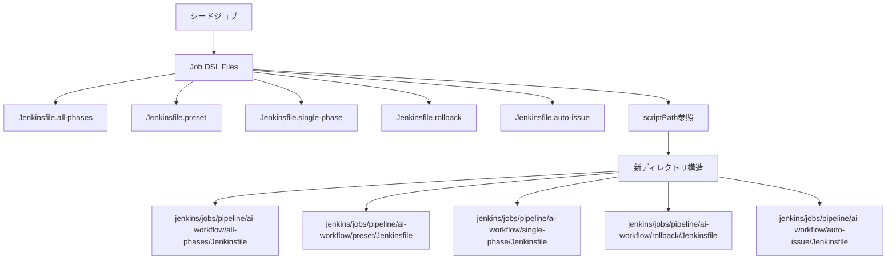
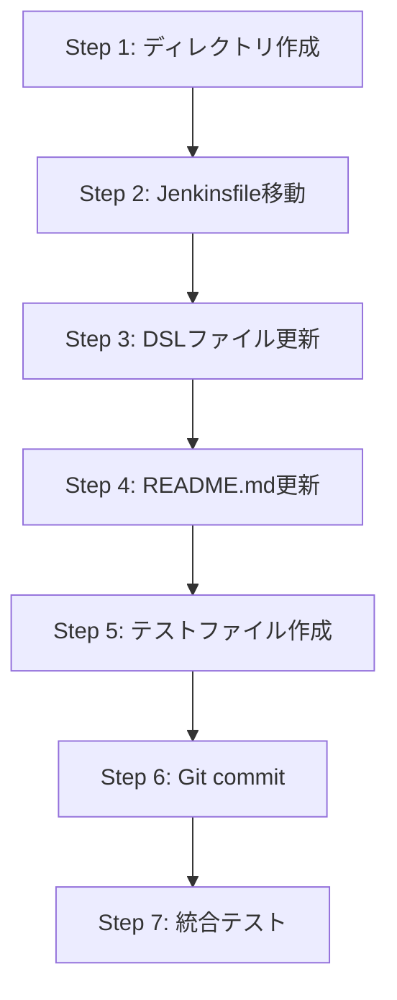

# 設計書 - Issue #238

**Issue番号**: #238
**タイトル**: Jenkins Job用Jenkinsfileを適切なディレクトリに配置
**作成日**: 2025-01-30
**ステータス**: 設計完了

---

## 0. Planning Documentの確認

Planning Document（`.ai-workflow/issue-238/00_planning/output/planning.md`）で策定された以下の戦略を踏まえて設計を実施：

### 開発計画の概要
- **複雑度判定**: 簡単（2~3時間）
- **実装戦略**: EXTEND（既存構造の拡張）
- **テスト戦略**: INTEGRATION_ONLY（統合テスト中心）
- **影響範囲**: 限定的（Jenkinsfile 5個 + DSL 5個 + README.md 1個）

### 重要な戦略的判断
- **Git履歴の保持**: `git mv`コマンドでファイル移動を実行し、変更履歴を維持
- **段階的検証**: ファイル移動 → DSL更新 → 統合テストの順で実施
- **リスク対策**: シードジョブ実行による50ジョブ生成確認をゲート条件に設定

---

## 1. アーキテクチャ設計

### 1.1 システム全体図

```
ai-workflow-agent/
├── jenkins/
│   ├── jobs/
│   │   ├── pipeline/
│   │   │   ├── _seed/
│   │   │   │   └── ai-workflow-job-creator/
│   │   │   │       └── Jenkinsfile                 # シードジョブ（変更なし）
│   │   │   └── ai-workflow/                        # ← 新規作成
│   │   │       ├── all-phases/                     # ← 新規作成
│   │   │       │   └── Jenkinsfile                 # ← 移動元: jenkins/Jenkinsfile.all-phases
│   │   │       ├── preset/                         # ← 新規作成
│   │   │       │   └── Jenkinsfile                 # ← 移動元: jenkins/Jenkinsfile.preset
│   │   │       ├── single-phase/                   # ← 新規作成
│   │   │       │   └── Jenkinsfile                 # ← 移動元: jenkins/Jenkinsfile.single-phase
│   │   │       ├── rollback/                       # ← 新規作成
│   │   │       │   └── Jenkinsfile                 # ← 移動元: jenkins/Jenkinsfile.rollback
│   │   │       └── auto-issue/                     # ← 新規作成
│   │   │           └── Jenkinsfile                 # ← 移動元: jenkins/Jenkinsfile.auto-issue
│   │   └── dsl/
│   │       └── ai-workflow/
│   │           ├── ai_workflow_all_phases_job.groovy     # ← scriptPath更新
│   │           ├── ai_workflow_preset_job.groovy         # ← scriptPath更新
│   │           ├── ai_workflow_single_phase_job.groovy   # ← scriptPath更新
│   │           ├── ai_workflow_rollback_job.groovy       # ← scriptPath更新
│   │           └── ai_workflow_auto_issue_job.groovy     # ← scriptPath更新
│   ├── shared/
│   │   └── common.groovy                          # 共通処理（変更なし）
│   └── README.md                                  # ← ディレクトリ構造更新
```

### 1.2 コンポーネント間の関係



### 1.3 データフロー

1. **シードジョブ実行**
   - `jenkins/jobs/pipeline/_seed/ai-workflow-job-creator/Jenkinsfile` が実行される
   - `jenkins/jobs/dsl/ai-workflow/*.groovy` が読み込まれる

2. **Job DSL処理**
   - 各DSLファイルの `scriptPath` パラメータが解析される
   - 新しいパス `jenkins/jobs/pipeline/ai-workflow/{mode}/Jenkinsfile` が参照される

3. **ジョブ生成**
   - 50個のジョブ（5モード × 10フォルダ）が生成される
   - 各ジョブは対応するJenkinsfileを参照する

---

## 2. 実装戦略判断

### 実装戦略: EXTEND

**判断根拠**:
1. **既存構造の拡張**: `jenkins/jobs/pipeline/` 配下に新しいディレクトリ構造を追加するのみで、既存のシードジョブやDSLファイルは修正するだけで削除しない
2. **ファイル移動が中心**: 既存Jenkinsfileの内容は変更せず、単純に配置場所を変更する
3. **後方互換性の維持**: DSLファイルの `scriptPath` を更新するだけで、パラメータ構造やロジックには変更がない
4. **段階的な拡張**: 既存の `jenkins/jobs/pipeline/_seed/` 構造に `jenkins/jobs/pipeline/ai-workflow/` を追加する形で拡張

---

## 3. テスト戦略判断

### テスト戦略: INTEGRATION_ONLY

**判断根拠**:
1. **Unitテスト不要**: Groovyスクリプト（DSL）は文字列置換のみで、複雑なロジックがない
2. **Integration Test必須**: シードジョブ実行によるジョブ生成確認が唯一の検証方法
3. **BDD不要**: ユーザーストーリーが明確でなく、テクニカルな移行作業のため
4. **既存テスト不在**: jenkins/jobs/dsl/ にはテストコードが存在せず、手動検証が標準

**具体的なIntegration Test**:
- シードジョブを実行して50ジョブが正常に生成されることを確認
- 各ジョブの設定画面で `scriptPath` が正しいパスを参照していることを確認
- 1つのジョブ（All Phases）を実際にビルドして動作確認

---

## 4. テストコード戦略判断

### テストコード戦略: CREATE_TEST

**判断根拠**:
1. **既存テスト不在**: `jenkins/jobs/dsl/ai-workflow/` には自動テストが存在しない
2. **新規テスト作成**: DSL検証スクリプトとシードジョブドライラン実行スクリプトを新規作成
3. **再利用可能性**: 今回作成するテストスクリプトは将来的に他のDSL変更でも利用可能

**作成するテストファイル**:
- `jenkins/jobs/dsl/ai-workflow/validate_dsl.sh` … DSL構文チェックスクリプト
- `jenkins/jobs/dsl/ai-workflow/test_seed_job.md` … 手動テスト手順書

---

## 5. 影響範囲分析

### 5.1 既存コードへの影響

#### 影響を受けるコンポーネント

| コンポーネント | 影響種別 | 影響内容 |
|--------------|---------|---------|
| `jenkins/Jenkinsfile.*` | **移動** | 5個のJenkinsfileを新ディレクトリに移動 |
| `jenkins/jobs/dsl/ai-workflow/*.groovy` | **修正** | scriptPathパラメータを更新 |
| `jenkins/README.md` | **修正** | ディレクトリ構造セクションを更新 |
| `jenkins/jobs/pipeline/_seed/` | **影響なし** | シードジョブは変更しない |
| `jenkins/shared/common.groovy` | **影響なし** | 共通処理モジュールは変更しない |

### 5.2 依存関係の変更

- **DSL → Jenkinsfile参照**: `scriptPath` のパスが変更されるため、DSL更新後はシードジョブを再実行する必要がある
- **後方互換性**: 旧パス（`jenkins/Jenkinsfile.*`）でジョブが既に生成されている場合、シードジョブ再実行でパスが更新される
- **Git履歴**: `git mv` コマンドによりファイル移動履歴が保持されるため、`git log --follow` でトレース可能

### 5.3 マイグレーション要否

- **マイグレーション不要**: ファイル移動とパス文字列の更新のみで、データ構造やAPIに変更がない
- **ただし**: シードジョブの再実行が必須（既存ジョブの `scriptPath` 更新のため）

---

## 6. 変更・追加ファイルリスト

### 6.1 新規作成ディレクトリ

```
jenkins/jobs/pipeline/ai-workflow/              # 新規作成
├── all-phases/                                 # 新規作成
├── preset/                                     # 新規作成
├── single-phase/                               # 新規作成
├── rollback/                                   # 新規作成
└── auto-issue/                                 # 新規作成
```

### 6.2 移動ファイル（5個）

| 移動元 | 移動先 |
|--------|--------|
| `jenkins/Jenkinsfile.all-phases` | `jenkins/jobs/pipeline/ai-workflow/all-phases/Jenkinsfile` |
| `jenkins/Jenkinsfile.preset` | `jenkins/jobs/pipeline/ai-workflow/preset/Jenkinsfile` |
| `jenkins/Jenkinsfile.single-phase` | `jenkins/jobs/pipeline/ai-workflow/single-phase/Jenkinsfile` |
| `jenkins/Jenkinsfile.rollback` | `jenkins/jobs/pipeline/ai-workflow/rollback/Jenkinsfile` |
| `jenkins/Jenkinsfile.auto-issue` | `jenkins/jobs/pipeline/ai-workflow/auto-issue/Jenkinsfile` |

### 6.3 修正ファイル（6個）

| ファイルパス | 修正内容 |
|-------------|---------|
| `jenkins/jobs/dsl/ai-workflow/ai_workflow_all_phases_job.groovy` | scriptPath行を更新 |
| `jenkins/jobs/dsl/ai-workflow/ai_workflow_preset_job.groovy` | scriptPath行を更新 |
| `jenkins/jobs/dsl/ai-workflow/ai_workflow_single_phase_job.groovy` | scriptPath行を更新 |
| `jenkins/jobs/dsl/ai-workflow/ai_workflow_rollback_job.groovy` | scriptPath行を更新 |
| `jenkins/jobs/dsl/ai-workflow/ai_workflow_auto_issue_job.groovy` | scriptPath行を更新 |
| `jenkins/README.md` | ディレクトリ構造セクションを更新 |

### 6.4 削除ファイル

**なし** … 旧Jenkinsfileは `git mv` により移動されるため、削除ではなく移動として記録される

### 6.5 新規作成テストファイル（2個）

| ファイルパス | 目的 |
|-------------|------|
| `jenkins/jobs/dsl/ai-workflow/validate_dsl.sh` | DSL構文チェック自動化スクリプト |
| `jenkins/jobs/dsl/ai-workflow/test_seed_job.md` | シードジョブ手動テスト手順書 |

---

## 7. 詳細設計

### 7.1 ディレクトリ作成

```bash
# 親ディレクトリの作成
mkdir -p jenkins/jobs/pipeline/ai-workflow

# 各モード用ディレクトリの作成
mkdir -p jenkins/jobs/pipeline/ai-workflow/all-phases
mkdir -p jenkins/jobs/pipeline/ai-workflow/preset
mkdir -p jenkins/jobs/pipeline/ai-workflow/single-phase
mkdir -p jenkins/jobs/pipeline/ai-workflow/rollback
mkdir -p jenkins/jobs/pipeline/ai-workflow/auto-issue
```

### 7.2 ファイル移動設計

**使用コマンド**: `git mv`

**実行順序**:
1. ディレクトリ作成
2. ファイル移動（`git mv`）
3. ステージング確認（`git status`）
4. コミット（`git commit`）

**移動コマンド**:
```bash
git mv jenkins/Jenkinsfile.all-phases jenkins/jobs/pipeline/ai-workflow/all-phases/Jenkinsfile
git mv jenkins/Jenkinsfile.preset jenkins/jobs/pipeline/ai-workflow/preset/Jenkinsfile
git mv jenkins/Jenkinsfile.single-phase jenkins/jobs/pipeline/ai-workflow/single-phase/Jenkinsfile
git mv jenkins/Jenkinsfile.rollback jenkins/jobs/pipeline/ai-workflow/rollback/Jenkinsfile
git mv jenkins/Jenkinsfile.auto-issue jenkins/jobs/pipeline/ai-workflow/auto-issue/Jenkinsfile
```

### 7.3 DSLファイル更新設計

#### 7.3.1 修正パターン（全DSLファイル共通）

**変更前**:
```groovy
scriptPath('Jenkinsfile')
```

**変更後**:
```groovy
scriptPath('jenkins/jobs/pipeline/ai-workflow/{mode}/Jenkinsfile')
```

#### 7.3.2 各DSLファイルの具体的な修正内容

| DSLファイル | 修正行番号（推定） | 変更後のscriptPath |
|------------|------------------|-------------------|
| `ai_workflow_all_phases_job.groovy` | 199行目 | `jenkins/jobs/pipeline/ai-workflow/all-phases/Jenkinsfile` |
| `ai_workflow_preset_job.groovy` | 217行目 | `jenkins/jobs/pipeline/ai-workflow/preset/Jenkinsfile` |
| `ai_workflow_single_phase_job.groovy` | 205行目 | `jenkins/jobs/pipeline/ai-workflow/single-phase/Jenkinsfile` |
| `ai_workflow_rollback_job.groovy` | 219行目 | `jenkins/jobs/pipeline/ai-workflow/rollback/Jenkinsfile` |
| `ai_workflow_auto_issue_job.groovy` | 173行目 | `jenkins/jobs/pipeline/ai-workflow/auto-issue/Jenkinsfile` |

**注意点**:
- `scriptPath` のパスは、リポジトリルートからの相対パスを指定する
- Job DSL Pluginは、GitリポジトリのルートからJenkinsfileを探索する

### 7.4 README.md更新設計

#### 7.4.1 修正対象セクション

**セクション**: `## ディレクトリ構造`（7〜27行目）

**変更前**:
```markdown
## ディレクトリ構造

```
jenkins/
└── jobs/
    ├── pipeline/
    │   └── _seed/
    │       └── ai-workflow-job-creator/
    │           ├── Jenkinsfile          # シードジョブ定義
    │           ├── folder-config.yaml   # フォルダ構成定義
    │           └── job-config.yaml      # ジョブ設定
    └── dsl/
        ├── folders.groovy               # フォルダ作成DSL
        └── ai-workflow/
            ├── ai_workflow_all_phases_job.groovy
            ├── ai_workflow_preset_job.groovy
            ├── ai_workflow_single_phase_job.groovy
            ├── ai_workflow_rollback_job.groovy
            ├── ai_workflow_auto_issue_job.groovy
            └── TEST_PLAN.md
```
```

**変更後**:
```markdown
## ディレクトリ構造

```
jenkins/
├── jobs/
│   ├── pipeline/
│   │   ├── _seed/
│   │   │   └── ai-workflow-job-creator/
│   │   │       ├── Jenkinsfile          # シードジョブ定義
│   │   │       ├── folder-config.yaml   # フォルダ構成定義
│   │   │       └── job-config.yaml      # ジョブ設定
│   │   └── ai-workflow/                 # 各実行モード用Jenkinsfile
│   │       ├── all-phases/
│   │       │   └── Jenkinsfile
│   │       ├── preset/
│   │       │   └── Jenkinsfile
│   │       ├── single-phase/
│   │       │   └── Jenkinsfile
│   │       ├── rollback/
│   │       │   └── Jenkinsfile
│   │       └── auto-issue/
│   │           └── Jenkinsfile
│   └── dsl/
│       ├── folders.groovy               # フォルダ作成DSL
│       └── ai-workflow/
│           ├── ai_workflow_all_phases_job.groovy
│           ├── ai_workflow_preset_job.groovy
│           ├── ai_workflow_single_phase_job.groovy
│           ├── ai_workflow_rollback_job.groovy
│           ├── ai_workflow_auto_issue_job.groovy
│           └── TEST_PLAN.md
└── shared/
    └── common.groovy                    # 共通処理モジュール
```
```

### 7.5 テストファイル設計

#### 7.5.1 DSL検証スクリプト（`validate_dsl.sh`）

**目的**: Groovy構文チェックとscriptPath検証

**実装内容**:
```bash
#!/bin/bash
# DSL構文検証スクリプト

set -e

SCRIPT_DIR="$(cd "$(dirname "$0")" && pwd)"
DSL_DIR="$SCRIPT_DIR"

echo "=== DSL Syntax Validation ==="

# Groovy構文チェック（シンタックスのみ、実行はしない）
for dsl_file in "$DSL_DIR"/*.groovy; do
    if [ -f "$dsl_file" ]; then
        echo "Checking $(basename "$dsl_file")..."
        # groovy -c でシンタックスチェック
        # ※ Groovyインストールが必要
        # groovy -c "$dsl_file"
    fi
done

# scriptPathの存在確認
echo ""
echo "=== scriptPath Validation ==="

expected_paths=(
    "jenkins/jobs/pipeline/ai-workflow/all-phases/Jenkinsfile"
    "jenkins/jobs/pipeline/ai-workflow/preset/Jenkinsfile"
    "jenkins/jobs/pipeline/ai-workflow/single-phase/Jenkinsfile"
    "jenkins/jobs/pipeline/ai-workflow/rollback/Jenkinsfile"
    "jenkins/jobs/pipeline/ai-workflow/auto-issue/Jenkinsfile"
)

for path in "${expected_paths[@]}"; do
    repo_root="$(git rev-parse --show-toplevel)"
    full_path="$repo_root/$path"
    if [ -f "$full_path" ]; then
        echo "✓ $path exists"
    else
        echo "✗ $path NOT FOUND"
        exit 1
    fi
done

echo ""
echo "=== All validations passed ==="
```

#### 7.5.2 手動テスト手順書（`test_seed_job.md`）

**目的**: シードジョブ実行による統合テスト手順の明文化

**内容**:
```markdown
# シードジョブテスト手順

## 前提条件

- Jenkinsにシードジョブ `Admin_Jobs/ai-workflow-job-creator` が登録されている
- DSLファイルの `scriptPath` 更新が完了している
- 各Jenkinsfileが正しいディレクトリに配置されている

## テスト手順

### 1. シードジョブの実行

1. Jenkinsにアクセスする
2. `Admin_Jobs/ai-workflow-job-creator` を選択
3. 「ビルド」ボタンをクリック
4. ビルドが完了するまで待機（約30秒〜1分）

### 2. ジョブ生成の確認

1. `AI_Workflow` フォルダを開く
2. 以下のフォルダが存在することを確認:
   - `develop`
   - `stable-1` 〜 `stable-9`
3. 各フォルダ内に以下の5つのジョブが存在することを確認:
   - `all_phases`
   - `preset`
   - `single_phase`
   - `rollback`
   - `auto_issue`

**期待される総ジョブ数**: 50個（10フォルダ × 5モード）

### 3. scriptPathの確認

1. `AI_Workflow/develop/all_phases` を選択
2. 「設定」を開く
3. 「Pipeline」セクションで以下を確認:
   - **Repository URL**: `https://github.com/tielec/ai-workflow-agent.git`
   - **Script Path**: `jenkins/jobs/pipeline/ai-workflow/all-phases/Jenkinsfile`

**確認対象ジョブ**:
| ジョブ | 期待されるscriptPath |
|--------|---------------------|
| `all_phases` | `jenkins/jobs/pipeline/ai-workflow/all-phases/Jenkinsfile` |
| `preset` | `jenkins/jobs/pipeline/ai-workflow/preset/Jenkinsfile` |
| `single_phase` | `jenkins/jobs/pipeline/ai-workflow/single-phase/Jenkinsfile` |
| `rollback` | `jenkins/jobs/pipeline/ai-workflow/rollback/Jenkinsfile` |
| `auto_issue` | `jenkins/jobs/pipeline/ai-workflow/auto-issue/Jenkinsfile` |

### 4. ジョブ実行テスト（任意）

1. `AI_Workflow/develop/all_phases` を選択
2. 「Build with Parameters」をクリック
3. 以下のパラメータを設定:
   - **ISSUE_URL**: `https://github.com/tielec/ai-workflow-agent/issues/238`
   - **DRY_RUN**: `true`（本番実行を避けるため）
4. 「ビルド」ボタンをクリック
5. Jenkinsfileが正常にロードされることを確認

**期待される結果**:
- Jenkinsfileのロードエラーが発生しない
- ビルドログに `Jenkinsfile not found` 等のエラーメッセージがない

## テスト完了条件

- [ ] シードジョブが正常に完了した（EXIT CODE 0）
- [ ] 全50ジョブが生成された
- [ ] `all_phases` ジョブの `scriptPath` が正しいパスを参照している
- [ ] （オプション）`all_phases` ジョブのドライランビルドが成功した

## トラブルシューティング

### 問題: シードジョブが失敗する

**原因**: DSLファイルにGroovy構文エラーがある
**対策**: `validate_dsl.sh` を実行してシンタックスエラーを確認

### 問題: ジョブは生成されるが、scriptPathが正しくない

**原因**: DSLファイルの `scriptPath` 修正が不完全
**対策**: 各DSLファイルの該当行を再確認

### 問題: Jenkinsfileが見つからない

**原因**: ファイル移動が完了していない
**対策**: `git status` でファイル移動状態を確認
```

---

## 8. セキュリティ考慮事項

### 8.1 認証・認可

- **変更なし**: Jenkinsfileやディレクトリ構造の変更は認証・認可に影響しない
- **Gitリポジトリのアクセス権限**: 既存のGitHub認証情報（`github-token`）をそのまま使用
- **Jenkins Credentials**: DSLパラメータやシードジョブの認証情報は変更しない

### 8.2 データ保護

- **機密情報の非含有**: Jenkinsfileやディレクトリ構造には機密情報が含まれない
- **Git履歴の保護**: `git mv` によりファイル移動履歴が公開されるが、機密性は問題なし

### 8.3 セキュリティリスクと対策

| リスク | 影響 | 対策 |
|--------|------|------|
| scriptPath参照エラー | ジョブ実行時にJenkinsfileが見つからず、ビルド失敗 | シードジョブの統合テストで事前検証 |
| 旧パス参照残留 | 既存ジョブが旧Jenkinsfileを参照し続ける | シードジョブ再実行で全ジョブの `scriptPath` を更新 |
| Git履歴の喪失 | `git mv` を使わずに移動すると履歴が消失 | 必ず `git mv` コマンドを使用 |

---

## 9. 非機能要件への対応

### 9.1 パフォーマンス

- **シードジョブ実行時間**: ディレクトリ構造変更による影響なし（既存と同等、約2〜3分）
- **Jenkinsfileロード時間**: パス長が若干増加するが、ロード時間への影響は無視可能（ミリ秒オーダー）

### 9.2 スケーラビリティ

- **新規モード追加の容易性**: `jenkins/jobs/pipeline/ai-workflow/` 配下に新しいモード用ディレクトリを追加するだけ
- **フォルダ構造の拡張性**: 既存パターンを踏襲し、`{mode}/Jenkinsfile` の命名規則を維持

### 9.3 保守性

- **ディレクトリ構造の一貫性**: `jenkins/jobs/pipeline/ai-workflow/` 配下が統一された構造を持つ
- **可読性**: ディレクトリ名がモード名と一致し、Jenkinsfileの役割が一目瞭然
- **ドキュメントの同期**: `jenkins/README.md` が常に最新のディレクトリ構造を反映

---

## 10. 実装の順序

### 10.1 推奨実装順序



### 10.2 各ステップの詳細

#### Step 1: ディレクトリ作成
**所要時間**: 5分

```bash
mkdir -p jenkins/jobs/pipeline/ai-workflow/{all-phases,preset,single-phase,rollback,auto-issue}
```

**確認方法**:
```bash
ls -la jenkins/jobs/pipeline/ai-workflow/
```

#### Step 2: Jenkinsfile移動
**所要時間**: 10分

```bash
git mv jenkins/Jenkinsfile.all-phases jenkins/jobs/pipeline/ai-workflow/all-phases/Jenkinsfile
git mv jenkins/Jenkinsfile.preset jenkins/jobs/pipeline/ai-workflow/preset/Jenkinsfile
git mv jenkins/Jenkinsfile.single-phase jenkins/jobs/pipeline/ai-workflow/single-phase/Jenkinsfile
git mv jenkins/Jenkinsfile.rollback jenkins/jobs/pipeline/ai-workflow/rollback/Jenkinsfile
git mv jenkins/Jenkinsfile.auto-issue jenkins/jobs/pipeline/ai-workflow/auto-issue/Jenkinsfile
```

**確認方法**:
```bash
git status
# 期待される出力: 5個のファイルが renamed: となっている
```

#### Step 3: DSLファイル更新
**所要時間**: 15分

各DSLファイルの `scriptPath('Jenkinsfile')` を以下のように更新:
- `ai_workflow_all_phases_job.groovy`: 199行目 → `scriptPath('jenkins/jobs/pipeline/ai-workflow/all-phases/Jenkinsfile')`
- `ai_workflow_preset_job.groovy`: 217行目 → `scriptPath('jenkins/jobs/pipeline/ai-workflow/preset/Jenkinsfile')`
- `ai_workflow_single_phase_job.groovy`: 205行目 → `scriptPath('jenkins/jobs/pipeline/ai-workflow/single-phase/Jenkinsfile')`
- `ai_workflow_rollback_job.groovy`: 219行目 → `scriptPath('jenkins/jobs/pipeline/ai-workflow/rollback/Jenkinsfile')`
- `ai_workflow_auto_issue_job.groovy`: 173行目 → `scriptPath('jenkins/jobs/pipeline/ai-workflow/auto-issue/Jenkinsfile')`

**確認方法**:
```bash
grep -n "scriptPath" jenkins/jobs/dsl/ai-workflow/*.groovy
# 期待される出力: 5行とも新しいパスを参照している
```

#### Step 4: README.md更新
**所要時間**: 10分

`jenkins/README.md` の7〜27行目のディレクトリ構造セクションを更新（詳細設計 7.4参照）

**確認方法**:
```bash
git diff jenkins/README.md
# ディレクトリ構造が正しく更新されているか確認
```

#### Step 5: テストファイル作成
**所要時間**: 20分

- `jenkins/jobs/dsl/ai-workflow/validate_dsl.sh` を作成（詳細設計 7.5.1参照）
- `jenkins/jobs/dsl/ai-workflow/test_seed_job.md` を作成（詳細設計 7.5.2参照）

**確認方法**:
```bash
chmod +x jenkins/jobs/dsl/ai-workflow/validate_dsl.sh
./jenkins/jobs/dsl/ai-workflow/validate_dsl.sh
# すべてのValidationがパスすることを確認
```

#### Step 6: Git commit
**所要時間**: 5分

```bash
git add jenkins/
git commit -m "[ai-workflow] Reorganize Jenkinsfiles into appropriate directory structure (Issue #238)

- Move 5 Jenkinsfiles to jenkins/jobs/pipeline/ai-workflow/{mode}/
- Update scriptPath in 5 DSL files
- Update jenkins/README.md directory structure section
- Add DSL validation script and test documentation"
```

#### Step 7: 統合テスト
**所要時間**: 30分〜1時間

1. PRを作成してリモートにプッシュ
2. Jenkinsにアクセスしてシードジョブを実行
3. 50ジョブが正常に生成されることを確認
4. `test_seed_job.md` の手順に従って動作確認

---

## 11. 品質ゲート（Phase 2）チェックリスト

本設計書は以下の品質ゲートを満たしている：

- [x] **実装戦略の判断根拠が明記されている**: セクション2で「EXTEND」戦略の4つの判断根拠を記載
- [x] **テスト戦略の判断根拠が明記されている**: セクション3で「INTEGRATION_ONLY」戦略の4つの判断根拠を記載
- [x] **既存コードへの影響範囲が分析されている**: セクション5で影響を受けるコンポーネントと依存関係を詳細に分析
- [x] **変更が必要なファイルがリストアップされている**: セクション6で移動ファイル5個、修正ファイル6個、新規テストファイル2個を明示
- [x] **設計が実装可能である**: セクション7で具体的なコマンド、修正内容、テスト手順を記載し、セクション10で実装順序を定義

---

## 12. 備考

### 12.1 Planning Documentとの整合性確認

- ✅ **複雑度判定（簡単）**: 実装順序が明確で、2〜3時間で完了可能
- ✅ **実装戦略（EXTEND）**: 既存構造の拡張のみで、新規コードなし
- ✅ **テスト戦略（INTEGRATION_ONLY）**: シードジョブ実行による統合テストのみ
- ✅ **Git履歴の保持**: `git mv` コマンドを使用する設計

### 12.2 次フェーズへの引き継ぎ事項

- **Test Scenario Phase**: シードジョブ統合テストのシナリオ詳細化が必要
- **Implementation Phase**: DSLファイルのscriptPath行番号が変更されている可能性があるため、実際の行番号を再確認してから修正すること
- **Testing Phase**: Jenkins環境へのアクセスが必要なため、テスト実行時の認証情報を準備すること

### 12.3 注意事項

1. **DSLファイルの行番号**: 本設計書で示した行番号（199行目等）は参考値であり、実装時に実際の行番号を確認すること
2. **シードジョブの実行タイミング**: DSL更新後、必ずシードジョブを再実行して既存ジョブの `scriptPath` を更新すること
3. **Git履歴のトレース**: 移動後も `git log --follow <file>` でファイルの変更履歴を追跡可能であることを確認すること

---

**ドキュメント作成者**: AI Workflow Agent
**レビュー状態**: 初回作成完了
**最終更新日**: 2025-01-30
