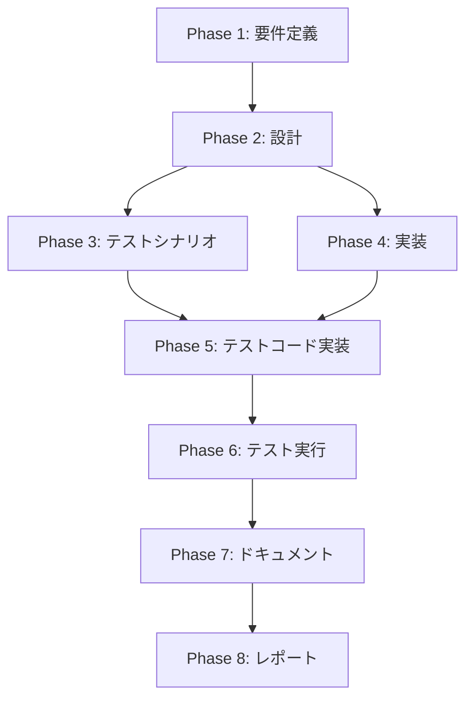

# プロジェクト計画書 - Issue #24: GitHub Client の機能別分割

## 1. Issue分析

### 複雑度
**中程度**

### 見積もり工数
**12~16時間**

#### 根拠
- 現在の`github-client.ts`は702行で、以下の責務を持つ：
  - Issue操作（取得、コメント投稿、クローズ）: 約200行
  - PR操作（作成、更新、検索、クローズ）: 約150行
  - コメント操作（進捗コメント、レビュー結果）: 約150行
  - ドキュメント抽出・テンプレート処理: 約200行
- ファサードパターンによる統合で既存APIの後方互換性を維持
- 各モジュールを200行以下に分割し、独立してテスト可能にする必要がある
- テストコードの作成（統合テストとユニットテスト）が必要
- 既存の呼び出し箇所（`src/commands/init.ts`, `src/commands/execute.ts`, `src/phases/base-phase.ts`）の動作確認

### リスク評価
**中**

#### 主なリスク
1. **技術的リスク（中）**: ファサードパターンの実装により、Octokitインスタンスの共有方法を誤ると認証エラーが発生する可能性
2. **スコープリスク（中）**: ドキュメント抽出ロジック（private メソッド）の配置先が曖昧で、責務の境界が不明確になる可能性
3. **リソースリスク（低）**: TypeScript + Octokit の経験があれば対応可能
4. **依存リスク（低）**: 外部API（GitHub）依存だが、既存のOctokitインスタンスを再利用するため影響は限定的

## 2. 実装戦略判断

### 実装戦略: REFACTOR

**判断根拠**:
既存の`github-client.ts`（702行）を機能別に分割し、ファサードパターンで統合する**リファクタリング**作業です。新規機能の追加ではなく、既存コードの構造改善が目的です。

- **CREATE**: 新規モジュール（`issue-client.ts`, `pull-request-client.ts`, `comment-client.ts`, `review-client.ts`）を作成
- **EXTEND**: なし（既存機能の拡張はしない）
- **REFACTOR**: 既存メソッドを機能別に分割・再配置し、ファサードで統合

### テスト戦略: UNIT_INTEGRATION

**判断根拠**:
- **UNIT**: 各クライアント（IssueClient, PullRequestClient, CommentClient, ReviewClient）の独立した動作を検証
  - Octokitのモック化により、APIレスポンスの境界値テスト
  - エラーハンドリング（401/403/422）の検証
- **INTEGRATION**: ファサードパターンによる統合動作を検証
  - 既存の呼び出し箇所（`init.ts`, `execute.ts`, `base-phase.ts`）との互換性テスト
  - Octokitインスタンス共有の正常性確認

BDDテストは不要（ユーザーストーリーよりも内部リファクタリングが中心）。

### テストコード戦略: CREATE_TEST

**判断根拠**:
- 既存のGitHub Clientに対するテストコードが存在しない（`Glob: **/github*.test.ts` の結果が空）
- 新規モジュール（`issue-client.ts`, `pull-request-client.ts`, `comment-client.ts`, `review-client.ts`）に対応する**新規テストファイル**を作成
- ファサードパターンの統合テストも新規作成

**テストファイル構成**:
- `tests/unit/github/issue-client.test.ts`
- `tests/unit/github/pull-request-client.test.ts`
- `tests/unit/github/comment-client.test.ts`
- `tests/unit/github/review-client.test.ts`
- `tests/integration/github-client-facade.test.ts`

## 3. 影響範囲分析

### 既存コードへの影響

#### 変更が必要なファイル
1. **`src/core/github-client.ts`**（702行 → 約150行）
   - ファサードとして各クライアントを統合
   - 既存のpublicメソッドは維持（後方互換性）

2. **新規作成ファイル**
   - `src/core/github/issue-client.ts`（約180行）
   - `src/core/github/pull-request-client.ts`（約200行）
   - `src/core/github/comment-client.ts`（約150行）
   - `src/core/github/review-client.ts`（約180行）

#### 動作確認が必要なファイル（変更不要）
- `src/commands/init.ts`（GitHubClient を使用）
- `src/commands/execute.ts`（GitHubClient を使用）
- `src/phases/base-phase.ts`（GitHubClient を使用）

### 依存関係の変更

#### 新規依存の追加
なし（既存の`@octokit/rest`, `@octokit/request-error` を継続使用）

#### 既存依存の変更
なし

### マイグレーション要否

#### データベーススキーマ変更
なし

#### 設定ファイル変更
なし

#### 環境変数変更
なし

## 4. タスク分割

### Phase 1: 要件定義 (見積もり: 1~2h)

- [x] Task 1-1: 現行GitHub Clientの責務分析 (0.5~1h)
  - 各メソッドの責務を分類（Issue/PR/Comment/Review/Extract）
  - private メソッドの配置先を決定（DocumentExtractorクラスの要否検討）
  - Octokitインスタンス共有方法の設計

- [x] Task 1-2: 受け入れ基準の明確化 (0.5~1h)
  - 各クライアントの行数制約（200行以下）
  - 後方互換性の定義（既存の呼び出し元が無変更で動作）
  - テストカバレッジ目標（80%以上）

### Phase 2: 設計 (見積もり: 2~3h)

- [ ] Task 2-1: モジュール構成の詳細設計 (1~1.5h)
  - IssueClient のインターフェース設計（getIssue, getIssueInfo, getIssueComments, postComment, closeIssueWithReason, createIssueFromEvaluation）
  - PullRequestClient のインターフェース設計（createPullRequest, checkExistingPr, updatePullRequest, closePullRequest, getPullRequestNumber）
  - CommentClient のインターフェース設計（postWorkflowProgress, createOrUpdateProgressComment）
  - ReviewClient のインターフェース設計（postReviewResult）
  - DocumentExtractor の必要性検討（extractPhaseOutputs, generatePrBodyTemplate, generatePrBodyDetailed）

- [ ] Task 2-2: ファサードパターンの設計 (0.5~1h)
  - GitHubClient のコンストラクタで各クライアントを初期化
  - 各publicメソッドを対応するクライアントに委譲
  - Octokitインスタンスを各クライアントに渡す方法（コンストラクタ注入）

- [ ] Task 2-3: エラーハンドリング方針の統一 (0.5h)
  - RequestError の処理方法（401/403/422）
  - 各クライアントでのエラーメッセージフォーマット
  - ファサード層でのエラー伝播方針

### Phase 3: テストシナリオ (見積もり: 1.5~2h)

- [ ] Task 3-1: ユニットテストシナリオ作成 (1~1.5h)
  - IssueClient のテストケース（正常系、エラー系、境界値）
  - PullRequestClient のテストケース（PR作成成功、既存PR検出、422エラー）
  - CommentClient のテストケース（進捗コメント作成/更新、既存コメント検出失敗時のフォールバック）
  - ReviewClient のテストケース（レビュー結果投稿、サジェスション表示）

- [ ] Task 3-2: 統合テストシナリオ作成 (0.5h)
  - ファサードパターンによる既存API互換性テスト
  - 既存の呼び出し元（init.ts, execute.ts, base-phase.ts）との結合テスト

### Phase 4: 実装 (見積もり: 4~5h)

- [ ] Task 4-1: IssueClient の実装 (1~1.5h)
  - `src/core/github/issue-client.ts` の作成
  - getIssue, getIssueInfo, getIssueComments, getIssueCommentsDict の実装
  - postComment, closeIssueWithReason, createIssueFromEvaluation の実装

- [ ] Task 4-2: PullRequestClient の実装 (1~1.5h)
  - `src/core/github/pull-request-client.ts` の作成
  - createPullRequest, checkExistingPr, updatePullRequest の実装
  - closePullRequest, getPullRequestNumber の実装

- [ ] Task 4-3: CommentClient の実装 (0.5~1h)
  - `src/core/github/comment-client.ts` の作成
  - postWorkflowProgress, createOrUpdateProgressComment の実装

- [ ] Task 4-4: ReviewClient の実装 (0.5h)
  - `src/core/github/review-client.ts` の作成
  - postReviewResult の実装

- [ ] Task 4-5: ファサードの実装 (0.5~1h)
  - `src/core/github-client.ts` のリファクタリング
  - 各クライアントのインスタンス化とOctokitインスタンス注入
  - 既存publicメソッドを各クライアントに委譲
  - DocumentExtractor 関連のprivateメソッドを適切な場所に配置（GitHubClient 内部保持 or 別クラス化）

### Phase 5: テストコード実装 (見積もり: 2~3h)

- [ ] Task 5-1: IssueClient のユニットテスト (0.5~1h)
  - Octokitのモック化
  - 正常系（getIssue, postComment, createIssueFromEvaluation）
  - エラー系（401/403エラー、RequestError処理）

- [ ] Task 5-2: PullRequestClient のユニットテスト (0.5~1h)
  - createPullRequest の正常系（成功、既存PR検出、422エラー）
  - checkExistingPr の正常系・エラー系
  - updatePullRequest, closePullRequest のテスト

- [ ] Task 5-3: CommentClient のユニットテスト (0.5h)
  - postWorkflowProgress の正常系
  - createOrUpdateProgressComment の正常系（新規作成、更新成功、更新失敗時のフォールバック）

- [ ] Task 5-4: ReviewClient のユニットテスト (0.25h)
  - postReviewResult の正常系

- [ ] Task 5-5: ファサード統合テスト (0.25~0.5h)
  - GitHubClient の各メソッドが正しいクライアントに委譲されているか検証
  - 既存の呼び出し元との互換性確認

### Phase 6: テスト実行 (見積もり: 0.5~1h)

- [ ] Task 6-1: ユニットテスト実行 (0.25~0.5h)
  - `npm run test:unit` ですべてのユニットテストが成功することを確認
  - カバレッジレポート確認（80%以上）

- [ ] Task 6-2: 統合テスト実行 (0.25~0.5h)
  - `npm run test:integration` で統合テストが成功することを確認
  - 既存の呼び出し元（init.ts, execute.ts, base-phase.ts）の動作確認

### Phase 7: ドキュメント (見積もり: 1~1.5h)

- [ ] Task 7-1: ARCHITECTURE.md の更新 (0.5~1h)
  - GitHubClient のモジュール構成を追記（ファサードパターンの説明）
  - 各クライアントの責務を記載
  - Octokitインスタンス共有方法の説明

- [ ] Task 7-2: CLAUDE.md の更新 (0.5h)
  - `src/core/github-client.ts` の説明を更新（ファサードとしての役割）
  - 新規モジュール（`src/core/github/*.ts`）の説明を追加

### Phase 8: レポート (見積もり: 0.5h)

- [ ] Task 8-1: 実装サマリーの作成 (0.25h)
  - 分割前後の行数比較（702行 → 各モジュール200行以下）
  - 後方互換性の検証結果
  - テストカバレッジレポート

- [ ] Task 8-2: PR本文の作成 (0.25h)
  - テンプレートに基づくPR本文生成
  - レビューポイントの明記（ファサードパターンの実装品質、Octokitインスタンス共有の正確性）

## 5. 依存関係

### クリティカルパス
Phase 1 → Phase 2 → Phase 4 → Phase 5 → Phase 6 → Phase 7 → Phase 8

Phase 3（テストシナリオ）はPhase 5と並行可能だが、Phase 2の完了が前提。

## 6. リスクと軽減策

### リスク1: Octokitインスタンスの共有方法の誤り
- **影響度**: 高
- **確率**: 中
- **軽減策**:
  - Phase 2（設計）で依存性注入パターン（コンストラクタ注入）を明確に定義
  - Phase 5（テストコード実装）で各クライアントがOctokitインスタンスを正しく使用しているか検証
  - 統合テストで実際のGitHub API呼び出しシーケンスを確認（モック環境）

### リスク2: private メソッドの配置先が曖昧
- **影響度**: 中
- **確率**: 中
- **軽減策**:
  - Phase 1（要件定義）で `extractSectionFromFile`, `extractSectionWithCandidates`, `extractSection` などのprivateメソッドの配置先を決定
  - 選択肢1: GitHubClient 内部に保持（ファサードが持つユーティリティ機能として）
  - 選択肢2: 別クラス `DocumentExtractor` を作成（単一責任原則に従う）
  - 推奨: 選択肢2（DocumentExtractorクラス化）により、責務を明確化

### リスク3: 既存の呼び出し元での後方互換性破壊
- **影響度**: 高
- **確率**: 低
- **軽減策**:
  - Phase 4（実装）でファサードパターンにより既存のpublicメソッドを完全に維持
  - Phase 5（テストコード実装）で既存の呼び出し元（init.ts, execute.ts, base-phase.ts）との統合テストを実施
  - Phase 6（テスト実行）で既存のワークフロー全体を手動実行し、動作確認

### リスク4: テストカバレッジ不足
- **影響度**: 中
- **確率**: 低
- **軽減策**:
  - Phase 5（テストコード実装）でカバレッジ目標（80%以上）を明確化
  - `npm run test:coverage` でカバレッジレポートを確認
  - エラーハンドリング（401/403/422）の境界値テストを網羅

### リスク5: 行数制約（200行以下）の超過
- **影響度**: 低
- **確率**: 中
- **軽減策**:
  - Phase 1（要件定義）で各クライアントのメソッド数を事前に計算
  - Phase 4（実装）で各モジュールの行数を定期的に確認
  - 必要に応じてさらに細分化（例: DocumentExtractor を別クラス化）

## 7. 品質ゲート

### Phase 1: 要件定義
- [ ] 各メソッドの責務分類が完了している（Issue/PR/Comment/Review/Extract）
- [ ] private メソッドの配置先が決定している（DocumentExtractor クラス化の要否）
- [ ] Octokitインスタンス共有方法が明確である（コンストラクタ注入）
- [ ] 受け入れ基準が定義されている（行数制約、後方互換性、テストカバレッジ）

### Phase 2: 設計
- [ ] 実装戦略の判断根拠が明記されている（REFACTOR）
- [ ] テスト戦略の判断根拠が明記されている（UNIT_INTEGRATION）
- [ ] テストコード戦略の判断根拠が明記されている（CREATE_TEST）
- [ ] 各クライアントのインターフェースが明確である
- [ ] ファサードパターンの実装方針が定義されている
- [ ] エラーハンドリング方針が統一されている

### Phase 3: テストシナリオ
- [ ] 各クライアントのユニットテストシナリオが網羅されている（正常系、エラー系、境界値）
- [ ] ファサード統合テストシナリオが定義されている
- [ ] エラーハンドリング（401/403/422）のテストケースが含まれている

### Phase 4: 実装
- [ ] IssueClient が200行以下である
- [ ] PullRequestClient が200行以下である
- [ ] CommentClient が200行以下である
- [ ] ReviewClient が200行以下である
- [ ] ファサードが既存のpublicメソッドをすべて維持している
- [ ] Octokitインスタンスが各クライアントに正しく注入されている

### Phase 5: テストコード実装
- [ ] 各クライアントのユニットテストが実装されている
- [ ] Octokitのモック化が適切である
- [ ] ファサード統合テストが実装されている
- [ ] 既存の呼び出し元（init.ts, execute.ts, base-phase.ts）との互換性テストが含まれている

### Phase 6: テスト実行
- [ ] すべてのユニットテストが成功している
- [ ] すべての統合テストが成功している
- [ ] テストカバレッジが80%以上である
- [ ] 既存のワークフロー全体が正常動作している

### Phase 7: ドキュメント
- [ ] ARCHITECTURE.md にファサードパターンの説明が追加されている
- [ ] CLAUDE.md に新規モジュールの説明が追加されている
- [ ] 各クライアントの責務が明確に記載されている

### Phase 8: レポート
- [ ] 実装サマリーが作成されている（行数比較、後方互換性、テストカバレッジ）
- [ ] PR本文が作成されている（レビューポイントの明記）
- [ ] 検証項目（Issue本文）がすべて満たされている
  - [ ] GitHub API連携テストがすべてパス
  - [ ] 既存コードからの呼び出しが正常動作
  - [ ] 各クライアントが200行以下
  - [ ] ファサードが後方互換性を維持

---

**作成日**: 2025-01-XX
**見積もり総工数**: 12~16時間
**リスク評価**: 中
**実装戦略**: REFACTOR
**テスト戦略**: UNIT_INTEGRATION
**テストコード戦略**: CREATE_TEST
