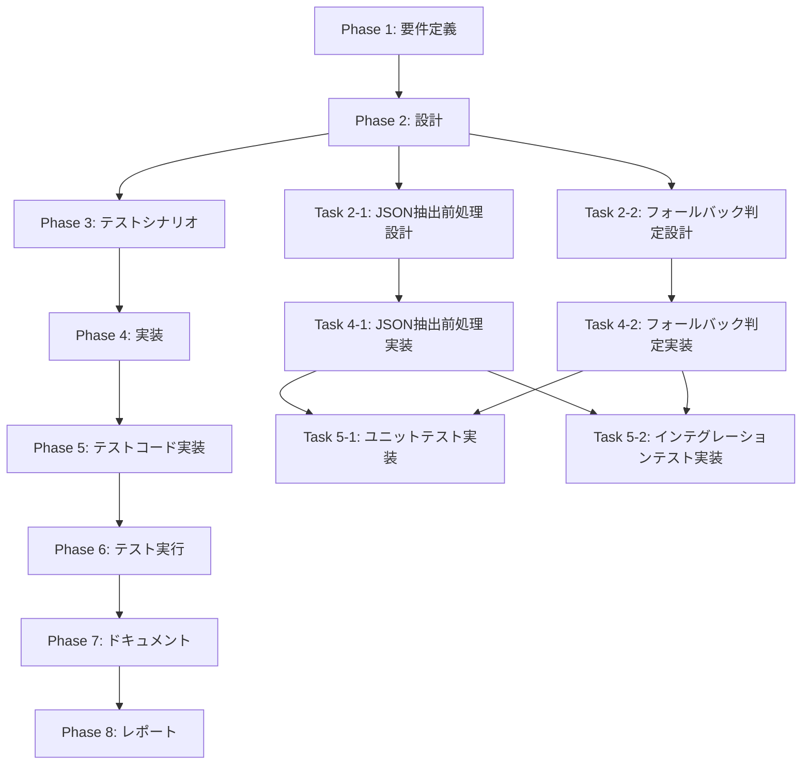

# プロジェクト計画書 - Issue #243

## 1. Issue分析

### 複雑度
**中程度**（見積もり: 8~12時間）

### 根拠
- **複数ファイルの修正が必要**: `content-parser.ts`、`review-cycle-manager.ts`、`phase-runner.ts` の3つのコアモジュールに影響
- **既存機能の拡張**: レビュー結果パースロジックの改善（新規機能ではない）
- **テストケース追加**: 既存テストの拡張と新規エッジケーステスト追加
- **リスクは中程度**: 既存のレビューサイクルに影響を与えるが、影響範囲は限定的

### 見積もり工数
**合計: 8~12時間**

| フェーズ | 工数 |
|---------|------|
| Phase 1: 要件定義 | 1~2h |
| Phase 2: 設計 | 2~3h |
| Phase 3: テストシナリオ | 1~2h |
| Phase 4: 実装 | 3~4h |
| Phase 5: テストコード実装 | 2~3h |
| Phase 6: テスト実行 | 0.5~1h |
| Phase 7: ドキュメント | 0.5~1h |
| Phase 8: レポート | 0.5~1h |

### リスク評価
**中**

- **技術的リスク**: LLMレスポンス形式の多様性（予期しない形式への対応）
- **影響範囲**: 全フェーズのレビュー機能に影響（Planning, Requirements, Design等）
- **後方互換性**: 既存の正常なレビュー結果が誤って FAIL 判定されるリスク

---

## 2. 実装戦略判断

### 実装戦略: **EXTEND**

#### 判断根拠
- **既存コードの拡張**: `content-parser.ts` の `parseReviewResult` メソッドを改善
- **新規ファイル作成なし**: 既存モジュール（`content-parser.ts`、`review-cycle-manager.ts`）の修正のみ
- **機能追加**: JSON抽出前処理、フォールバック判定ロジックの改善
- **アーキテクチャ変更なし**: レビューサイクルの基本フローは維持

### テスト戦略: **UNIT_INTEGRATION**

#### 判断根拠
- **ユニットテスト**: `parseReviewResult` メソッドの単体テスト（JSONパース、フォールバック判定）
- **インテグレーションテスト**: レビューサイクル全体のテスト（execute → review → revise フロー）
- **外部依存**: LLMレスポンスのモック化が必要
- **BDD不要**: エンドユーザー向け機能ではなく、内部ロジックの修正

**テストケース例**:
- ユニット: JSON後に余計なテキストがある場合のパーステスト
- ユニット: FAIL判定の誤検出防止テスト（「PASS判定が可能になります」を含む文字列）
- インテグレーション: レビューFAIL → revise実行 → 再レビューのフロー

### テストコード戦略: **EXTEND_TEST**

#### 判断根拠
- **既存テストファイル拡張**: `tests/unit/core/content-parser.test.ts` にテストケース追加
- **新規テストファイル不要**: 既存の `content-parser` テストスイートで十分
- **インテグレーションテスト**: 既存の `tests/integration/review-cycle.test.ts` にエッジケース追加（存在しない場合は作成）

---

## 3. 影響範囲分析

### 既存コードへの影響

| ファイル | 変更内容 | 影響度 |
|---------|---------|--------|
| `src/core/content-parser.ts` | `parseReviewResult` メソッドの改善 | **高** |
| `src/phases/core/review-cycle-manager.ts` | リトライ上限後の処理強化 | **中** |
| `src/phases/lifecycle/phase-runner.ts` | フェーズ失敗時の処理追加 | **低** |
| `tests/unit/core/content-parser.test.ts` | テストケース追加 | **中** |
| `tests/integration/review-cycle.test.ts` | インテグレーションテスト追加 | **中** |

### 依存関係の変更
- **新規依存なし**: 既存のNode.js標準ライブラリと `@types/jest` のみ使用
- **既存依存の変更なし**: `package.json` の変更不要

### マイグレーション要否
- **不要**: データベーススキーマ変更なし、設定ファイル変更なし
- **メタデータ互換性**: 既存の `metadata.json` 形式は維持

---

## 4. タスク分割

### Phase 1: 要件定義 (見積もり: 1~2h)

- [x] Task 1-1: バグの詳細分析 (0.5~1h)
  - LLMレスポンスのサンプルデータ収集（実際のログから抽出）
  - JSONパースエラーの発生条件を特定
  - フォールバック判定の誤検出パターンを列挙
- [x] Task 1-2: 受け入れ基準の明確化 (0.5~1h)
  - Issue本文の受け入れ条件を検証可能な形式に変換
  - テストケースの入出力仕様を定義
  - エッジケース（境界値）の洗い出し

### Phase 2: 設計 (見積もり: 2~3h)

- [x] Task 2-1: JSON抽出前処理の設計 (1~1.5h)
  - 正規表現パターンの設計（`\{[\s\S]*?\}`）
  - マルチラインJSON対応（ネストされた `{}` への対応）
  - パース失敗時のエラーハンドリング設計
- [x] Task 2-2: フォールバック判定ロジックの設計 (1~1.5h)
  - 明確なマーカーパターンのリスト作成（優先順位付き）
  - 誤検出防止ロジックの設計（「PASS判定が可能になります」への対応）
  - デフォルト値（FAIL）の設定方針

### Phase 3: テストシナリオ (見積もり: 1~2h)

- [ ] Task 3-1: ユニットテストシナリオ作成 (0.5~1h)
  - JSON後に余計なテキストがある場合のテストケース
  - 「PASS判定が可能になります」を含む文字列のテストケース
  - マルチラインJSONのテストケース
  - マーカーパターン優先順位のテストケース
- [ ] Task 3-2: インテグレーションテストシナリオ作成 (0.5~1h)
  - レビューFAIL → revise実行のフロー
  - リトライ上限（3回）超過時のフェーズ失敗処理
  - 後続フェーズに進まないことの検証

### Phase 4: 実装 (見積もり: 3~4h)

- [x] Task 4-1: `content-parser.ts` のJSON抽出前処理実装 (1~1.5h)
  - 正規表現によるJSON抽出ロジック追加
  - エラーハンドリング強化（JSON抽出失敗時のログ出力）
- [x] Task 4-2: `content-parser.ts` のフォールバック判定ロジック改善 (1~1.5h)
  - マーカーパターンによる優先判定ロジック追加
  - デフォルトFAIL判定の実装
  - 既存の `includes('PASS')` ロジック削除
- [x] Task 4-3: `review-cycle-manager.ts` のリトライ上限処理強化 (0.5~1h)
  - リトライ回数超過時のフェーズ失敗処理追加
  - メタデータ更新（`phases.*.status = 'failed'`）

### Phase 5: テストコード実装 (見積もり: 2~3h)

- [ ] Task 5-1: ユニットテスト実装 (1~1.5h)
  - `content-parser.test.ts` にテストケース追加
  - JSONパーステストケース実装
  - フォールバック判定テストケース実装
  - モックデータの準備
- [ ] Task 5-2: インテグレーションテスト実装 (1~1.5h)
  - `review-cycle.test.ts` にテストケース追加（存在しない場合は作成）
  - レビューサイクル全体のテスト実装
  - リトライ上限処理のテスト実装

### Phase 6: テスト実行 (見積もり: 0.5~1h)

- [ ] Task 6-1: ユニットテスト実行 (0.25~0.5h)
  - `npm run test:unit` 実行
  - テストカバレッジ確認（`content-parser.ts` の修正箇所）
- [ ] Task 6-2: インテグレーションテスト実行 (0.25~0.5h)
  - `npm run test:integration` 実行
  - 既存テストの回帰テスト確認

### Phase 7: ドキュメント (見積もり: 0.5~1h)

- [ ] Task 7-1: CLAUDE.md の更新 (0.25~0.5h)
  - レビュー結果パースロジックの変更内容を記載
  - JSON抽出前処理の仕様追記
- [ ] Task 7-2: コードコメント追加 (0.25~0.5h)
  - `parseReviewResult` メソッドのJSDocコメント更新
  - 正規表現パターンの説明コメント追加

### Phase 8: レポート (見積もり: 0.5~1h)

- [ ] Task 8-1: 完了レポート作成 (0.5~1h)
  - 実装内容のサマリー作成
  - テスト結果の記載
  - PR本文の生成

---

## 5. 依存関係

---

## 6. リスクと軽減策

### リスク1: LLMレスポンス形式の多様性
- **影響度**: 高
- **確率**: 中
- **軽減策**: 
  - 複数のマーカーパターンを優先順位付きで定義（「最終判定」「判定結果」「DECISION」等）
  - JSON抽出失敗時のフォールバックロジック強化
  - 実際のログデータからサンプルを収集し、テストケースに追加

### リスク2: 既存の正常なレビュー結果が誤って FAIL 判定される
- **影響度**: 高
- **確率**: 低
- **軽減策**:
  - 既存テストの回帰テスト実施（Phase 6）
  - フォールバック判定ロジックのデフォルト値を FAIL に設定（安全側に倒す）
  - マーカーパターンの優先順位を明確化（「最終判定」を最優先）

### リスク3: リトライ上限処理の実装漏れ
- **影響度**: 中
- **確率**: 低
- **軽減策**:
  - `review-cycle-manager.ts` のリトライ回数チェックロジックを強化
  - インテグレーションテストでリトライ上限（3回）超過時のフローを検証
  - フェーズ失敗時のメタデータ更新を確実に実施（`phases.*.status = 'failed'`）

### リスク4: テストカバレッジ不足
- **影響度**: 中
- **確率**: 低
- **軽減策**:
  - Phase 3でテストシナリオを網羅的に作成
  - エッジケース（境界値）を重点的にテスト
  - テストカバレッジツール（Jest）でカバレッジ率を確認（目標: 90%以上）

---

## 7. 品質ゲート

### Phase 1: 要件定義
- [x] バグの根本原因が明確に特定されている
- [x] 受け入れ基準が検証可能な形式で定義されている
- [x] エッジケースが洗い出されている

### Phase 2: 設計
- [x] **実装戦略の判断根拠が明記されている**（EXTEND）
- [x] **テスト戦略の判断根拠が明記されている**（UNIT_INTEGRATION）
- [x] **テストコード戦略の判断根拠が明記されている**（EXTEND_TEST）
- [x] JSON抽出前処理の設計が具体的である
- [x] フォールバック判定ロジックの優先順位が明確である

### Phase 3: テストシナリオ
- [ ] ユニットテストシナリオが網羅的である
- [ ] インテグレーションテストシナリオが実装フローをカバーしている
- [ ] エッジケースのテストシナリオが含まれている

### Phase 4: 実装
- [ ] JSON抽出前処理が実装されている
- [ ] フォールバック判定ロジックが改善されている
- [ ] リトライ上限処理が実装されている
- [ ] コードレビューで指摘事項がない

### Phase 5: テストコード実装
- [ ] ユニットテストが実装されている
- [ ] インテグレーションテストが実装されている
- [ ] テストカバレッジが90%以上である

### Phase 6: テスト実行
- [ ] すべてのユニットテストがパスしている
- [ ] すべてのインテグレーションテストがパスしている
- [ ] 既存テストの回帰テストがパスしている

### Phase 7: ドキュメント
- [ ] CLAUDE.md が更新されている
- [ ] コードコメントが追加されている
- [ ] 変更内容が明確に記載されている

### Phase 8: レポート
- [ ] 完了レポートが作成されている
- [ ] テスト結果が記載されている
- [ ] PR本文が生成されている

---

## 8. 補足事項

### 実装の優先順位
1. **最優先**: JSON抽出前処理（Task 4-1） - バグの根本原因
2. **高優先**: フォールバック判定ロジック改善（Task 4-2） - 誤検出防止
3. **中優先**: リトライ上限処理（Task 4-3） - 後続フェーズへの進行防止

### レビューポイント
- **JSON抽出ロジック**: ネストされた `{}` への対応（正規表現の貪欲マッチ vs 非貪欲マッチ）
- **フォールバック判定**: マーカーパターンの優先順位（「最終判定」 > 「判定結果」 > 「DECISION」）
- **テストカバレッジ**: エッジケース（境界値）が網羅されているか

### 完了条件
- [ ] Issue本文の受け入れ条件がすべて満たされている
- [ ] 既存テストがすべてパスしている
- [ ] 新規テストケースが追加されている
- [ ] ドキュメントが更新されている

---

**計画書作成日**: 2025-01-30  
**見積もり合計工数**: 8~12時間  
**リスクレベル**: 中  
**実装戦略**: EXTEND  
**テスト戦略**: UNIT_INTEGRATION  
**テストコード戦略**: EXTEND_TEST

## Turn 3: 実行完了

**ステータス**: success
**所要時間**: 78560ms
**ターン数**: 4

以下、プロジェクト計画書を作成します。

---

# プロジェクト計画書 - Issue #243

## 1. Issue分析

### 複雑度
**中程度**（見積もり: 8~12時間）

### 根拠
- **複数ファイルの修正が必要**: `content-parser.ts`、`review-cycle-manager.ts`、`phase-runner.ts` の3つのコアモジュールに影響
- **既存機能の拡張**: レビュー結果パースロジックの改善（新規機能ではない）
- **テストケース追加**: 既存テストの拡張と新規エッジケーステスト追加
- **リスクは中程度**: 既存のレビューサイクルに影響を与えるが、影響範囲は限定的

### 見積もり工数
**合計: 8~12時間**

| フェーズ | 工数 |
|---------|------|
| Phase 1: 要件定義 | 1~2h |
| Phase 2: 設計 | 2~3h |
| Phase 3: テストシナリオ | 1~2h |
| Phase 4: 実装 | 3~4h |
| Phase 5: テストコード実装 | 2~3h |
| Phase 6: テスト実行 | 0.5~1h |
| Phase 7: ドキュメント | 0.5~1h |
| Phase 8: レポート | 0.5~1h |

### リスク評価
**中**

- **技術的リスク**: LLMレスポンス形式の多様性（予期しない形式への対応）
- **影響範囲**: 全フェーズのレビュー機能に影響（Planning, Requirements, Design等）
- **後方互換性**: 既存の正常なレビュー結果が誤って FAIL 判定されるリスク

---

## 2. 実装戦略判断

### 実装戦略: **EXTEND**

#### 判断根拠
- **既存コードの拡張**: `content-parser.ts` の `parseReviewResult` メソッドを改善
- **新規ファイル作成なし**: 既存モジュール（`content-parser.ts`、`review-cycle-manager.ts`）の修正のみ
- **機能追加**: JSON抽出前処理、フォールバック判定ロジックの改善
- **アーキテクチャ変更なし**: レビューサイクルの基本フローは維持

### テスト戦略: **UNIT_INTEGRATION**

#### 判断根拠
- **ユニットテスト**: `parseReviewResult` メソッドの単体テスト（JSONパース、フォールバック判定）
- **インテグレーションテスト**: レビューサイクル全体のテスト（execute → review → revise フロー）
- **外部依存**: LLMレスポンスのモック化が必要
- **BDD不要**: エンドユーザー向け機能ではなく、内部ロジックの修正

**テストケース例**:
- ユニット: JSON後に余計なテキストがある場合のパーステスト
- ユニット: FAIL判定の誤検出防止テスト（「PASS判定が可能になります」を含む文字列）
- インテグレーション: レビューFAIL → revise実行 → 再レビューのフロー

### テストコード戦略: **EXTEND_TEST**

#### 判断根拠
- **既存テストファイル拡張**: `tests/unit/core/content-parser.test.ts` にテストケース追加
- **新規テストファイル不要**: 既存の `content-parser` テストスイートで十分
- **インテグレーションテスト**: 既存の `tests/integration/review-cycle.test.ts` にエッジケース追加（存在しない場合は作成）

---

## 3. 影響範囲分析

### 既存コードへの影響

| ファイル | 変更内容 | 影響度 |
|---------|---------|--------|
| `src/core/content-parser.ts` | `parseReviewResult` メソッドの改善 | **高** |
| `src/phases/core/review-cycle-manager.ts` | リトライ上限後の処理強化 | **中** |
| `src/phases/lifecycle/phase-runner.ts` | フェーズ失敗時の処理追加 | **低** |
| `tests/unit/core/content-parser.test.ts` | テストケース追加 | **中** |
| `tests/integration/review-cycle.test.ts` | インテグレーションテスト追加 | **中** |

### 依存関係の変更
- **新規依存なし**: 既存のNode.js標準ライブラリと `@types/jest` のみ使用
- **既存依存の変更なし**: `package.json` の変更不要

### マイグレーション要否
- **不要**: データベーススキーマ変更なし、設定ファイル変更なし
- **メタデータ互換性**: 既存の `metadata.json` 形式は維持

---

## 4. タスク分割

### Phase 1: 要件定義 (見積もり: 1~2h)

- [x] Task 1-1: バグの詳細分析 (0.5~1h)
  - LLMレスポンスのサンプルデータ収集（実際のログから抽出）
  - JSONパースエラーの発生条件を特定
  - フォールバック判定の誤検出パターンを列挙
- [x] Task 1-2: 受け入れ基準の明確化 (0.5~1h)
  - Issue本文の受け入れ条件を検証可能な形式に変換
  - テストケースの入出力仕様を定義
  - エッジケース（境界値）の洗い出し

### Phase 2: 設計 (見積もり: 2~3h)

- [x] Task 2-1: JSON抽出前処理の設計 (1~1.5h)
  - 正規表現パターンの設計（`\{[\s\S]*?\}`）
  - マルチラインJSON対応（ネストされた `{}` への対応）
  - パース失敗時のエラーハンドリング設計
- [x] Task 2-2: フォールバック判定ロジックの設計 (1~1.5h)
  - 明確なマーカーパターンのリスト作成（優先順位付き）
  - 誤検出防止ロジックの設計（「PASS判定が可能になります」への対応）
  - デフォルト値（FAIL）の設定方針

### Phase 3: テストシナリオ (見積もり: 1~2h)

- [ ] Task 3-1: ユニットテストシナリオ作成 (0.5~1h)
  - JSON後に余計なテキストがある場合のテストケース
  - 「PASS判定が可能になります」を含む文字列のテストケース
  - マルチラインJSONのテストケース
  - マーカーパターン優先順位のテストケース
- [ ] Task 3-2: インテグレーションテストシナリオ作成 (0.5~1h)
  - レビューFAIL → revise実行のフロー
  - リトライ上限（3回）超過時のフェーズ失敗処理
  - 後続フェーズに進まないことの検証

### Phase 4: 実装 (見積もり: 3~4h)

- [x] Task 4-1: `content-parser.ts` のJSON抽出前処理実装 (1~1.5h)
  - 正規表現によるJSON抽出ロジック追加
  - エラーハンドリング強化（JSON抽出失敗時のログ出力）
- [x] Task 4-2: `content-parser.ts` のフォールバック判定ロジック改善 (1~1.5h)
  - マーカーパターンによる優先判定ロジック追加
  - デフォルトFAIL判定の実装
  - 既存の `includes('PASS')` ロジック削除
- [x] Task 4-3: `review-cycle-manager.ts` のリトライ上限処理強化 (0.5~1h)
  - リトライ回数超過時のフェーズ失敗処理追加
  - メタデータ更新（`phases.*.status = 'failed'`）

### Phase 5: テストコード実装 (見積もり: 2~3h)

- [ ] Task 5-1: ユニットテスト実装 (1~1.5h)
  - `content-parser.test.ts` にテストケース追加
  - JSONパーステストケース実装
  - フォールバック判定テストケース実装
  - モックデータの準備
- [ ] Task 5-2: インテグレーションテスト実装 (1~1.5h)
  - `review-cycle.test.ts` にテストケース追加（存在しない場合は作成）
  - レビューサイクル全体のテスト実装
  - リトライ上限処理のテスト実装

### Phase 6: テスト実行 (見積もり: 0.5~1h)

- [ ] Task 6-1: ユニットテスト実行 (0.25~0.5h)
  - `npm run test:unit` 実行
  - テストカバレッジ確認（`content-parser.ts` の修正箇所）
- [ ] Task 6-2: インテグレーションテスト実行 (0.25~0.5h)
  - `npm run test:integration` 実行
  - 既存テストの回帰テスト確認

### Phase 7: ドキュメント (見積もり: 0.5~1h)

- [ ] Task 7-1: CLAUDE.md の更新 (0.25~0.5h)
  - レビュー結果パースロジックの変更内容を記載
  - JSON抽出前処理の仕様追記
- [ ] Task 7-2: コードコメント追加 (0.25~0.5h)
  - `parseReviewResult` メソッドのJSDocコメント更新
  - 正規表現パターンの説明コメント追加

### Phase 8: レポート (見積もり: 0.5~1h)

- [ ] Task 8-1: 完了レポート作成 (0.5~1h)
  - 実装内容のサマリー作成
  - テスト結果の記載
  - PR本文の生成

---

## 5. 依存関係

---

## 6. リスクと軽減策

### リスク1: LLMレスポンス形式の多様性
- **影響度**: 高
- **確率**: 中
- **軽減策**: 
  - 複数のマーカーパターンを優先順位付きで定義（「最終判定」「判定結果」「DECISION」等）
  - JSON抽出失敗時のフォールバックロジック強化
  - 実際のログデータからサンプルを収集し、テストケースに追加

### リスク2: 既存の正常なレビュー結果が誤って FAIL 判定される
- **影響度**: 高
- **確率**: 低
- **軽減策**:
  - 既存テストの回帰テスト実施（Phase 6）
  - フォールバック判定ロジックのデフォルト値を FAIL に設定（安全側に倒す）
  - マーカーパターンの優先順位を明確化（「最終判定」を最優先）

### リスク3: リトライ上限処理の実装漏れ
- **影響度**: 中
- **確率**: 低
- **軽減策**:
  - `review-cycle-manager.ts` のリトライ回数チェックロジックを強化
  - インテグレーションテストでリトライ上限（3回）超過時のフローを検証
  - フェーズ失敗時のメタデータ更新を確実に実施（`phases.*.status = 'failed'`）

### リスク4: テストカバレッジ不足
- **影響度**: 中
- **確率**: 低
- **軽減策**:
  - Phase 3でテストシナリオを網羅的に作成
  - エッジケース（境界値）を重点的にテスト
  - テストカバレッジツール（Jest）でカバレッジ率を確認（目標: 90%以上）

---

## 7. 品質ゲート

### Phase 1: 要件定義
- [x] バグの根本原因が明確に特定されている
- [x] 受け入れ基準が検証可能な形式で定義されている
- [x] エッジケースが洗い出されている

### Phase 2: 設計
- [x] **実装戦略の判断根拠が明記されている**（EXTEND）
- [x] **テスト戦略の判断根拠が明記されている**（UNIT_INTEGRATION）
- [x] **テストコード戦略の判断根拠が明記されている**（EXTEND_TEST）
- [x] JSON抽出前処理の設計が具体的である
- [x] フォールバック判定ロジックの優先順位が明確である

### Phase 3: テストシナリオ
- [ ] ユニットテストシナリオが網羅的である
- [ ] インテグレーションテストシナリオが実装フローをカバーしている
- [ ] エッジケースのテストシナリオが含まれている

### Phase 4: 実装
- [ ] JSON抽出前処理が実装されている
- [ ] フォールバック判定ロジックが改善されている
- [ ] リトライ上限処理が実装されている
- [ ] コードレビューで指摘事項がない

### Phase 5: テストコード実装
- [ ] ユニットテストが実装されている
- [ ] インテグレーションテストが実装されている
- [ ] テストカバレッジが90%以上である

### Phase 6: テスト実行
- [ ] すべてのユニットテストがパスしている
- [ ] すべてのインテグレーションテストがパスしている
- [ ] 既存テストの回帰テストがパスしている

### Phase 7: ドキュメント
- [ ] CLAUDE.md が更新されている
- [ ] コードコメントが追加されている
- [ ] 変更内容が明確に記載されている

### Phase 8: レポート
- [ ] 完了レポートが作成されている
- [ ] テスト結果が記載されている
- [ ] PR本文が生成されている

---

## 8. 補足事項

### 実装の優先順位
1. **最優先**: JSON抽出前処理（Task 4-1） - バグの根本原因
2. **高優先**: フォールバック判定ロジック改善（Task 4-2） - 誤検出防止
3. **中優先**: リトライ上限処理（Task 4-3） - 後続フェーズへの進行防止

### レビューポイント
- **JSON抽出ロジック**: ネストされた `{}` への対応（正規表現の貪欲マッチ vs 非貪欲マッチ）
- **フォールバック判定**: マーカーパターンの優先順位（「最終判定」 > 「判定結果」 > 「DECISION」）
- **テストカバレッジ**: エッジケース（境界値）が網羅されているか

### 完了条件
- [ ] Issue本文の受け入れ条件がすべて満たされている
- [ ] 既存テストがすべてパスしている
- [ ] 新規テストケースが追加されている
- [ ] ドキュメントが更新されている

---

**計画書作成日**: 2025-01-30  
**見積もり合計工数**: 8~12時間  
**リスクレベル**: 中  
**実装戦略**: EXTEND  
**テスト戦略**: UNIT_INTEGRATION  
**テストコード戦略**: EXTEND_TEST

---

**経過時間**: 80062ms
**開始**: 2025-12-05T14:10:45.657Z
**終了**: 2025-12-05T14:12:05.719Z