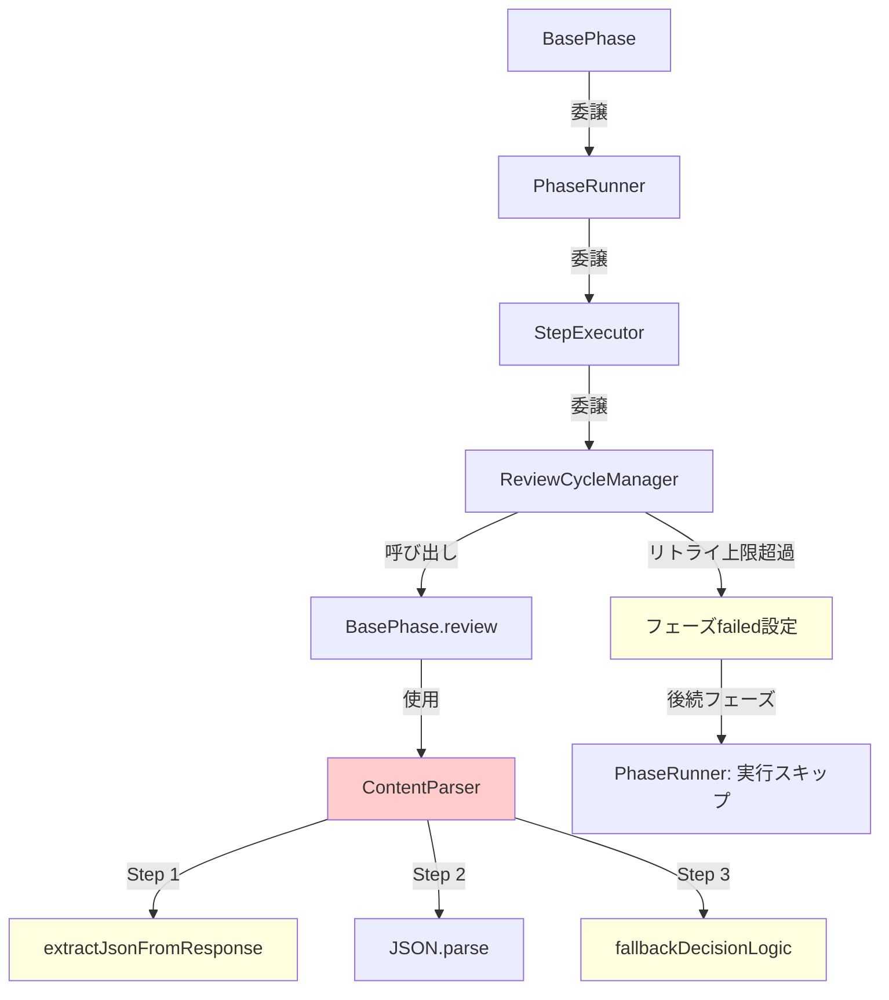

# 設計書 - Issue #243

## 0. Planning Documentの確認

Planning Phase（Issue #243）で策定された開発計画を確認しました。

### 開発戦略の確認
- **実装戦略**: EXTEND（既存コードの拡張、`content-parser.ts`、`review-cycle-manager.ts`、`phase-runner.ts`の修正）
- **テスト戦略**: UNIT_INTEGRATION（ユニットテスト + インテグレーションテスト）
- **テストコード戦略**: EXTEND_TEST（既存テストファイルの拡張、または新規作成）
- **見積もり工数**: 8~12時間
- **リスクレベル**: 中（LLMレスポンス形式の多様性、後方互換性リスク）

### 実装優先順位（Planning Phaseより）
1. **最優先**: JSON抽出前処理（Task 4-1） - バグの根本原因
2. **高優先**: フォールバック判定ロジック改善（Task 4-2） - 誤検出防止
3. **中優先**: リトライ上限処理（Task 4-3） - 後続フェーズへの進行防止

---

## 1. アーキテクチャ設計

### 1.1 システム全体図

```
┌─────────────────────────────────────────────────────────────────────┐
│                          BasePhase                                  │
│                     (フェーズ基底クラス)                              │
└─────────────┬───────────────────────────────────────────────────────┘
              │
              │ run()
              ▼
┌─────────────────────────────────────────────────────────────────────┐
│                        PhaseRunner                                  │
│                   (フェーズライフサイクル管理)                         │
│                                                                     │
│  ┌──────────────────────────────────────────────────────────────┐  │
│  │  run() メソッド                                              │  │
│  │  1. 依存関係検証                                             │  │
│  │  2. execute ステップ実行 ─────────┐                         │  │
│  │  3. review ステップ実行           │                         │  │
│  │  4. revise ステップ実行 (失敗時)  │                         │  │
│  └──────────────────────────┬───────┘                         │  │
│                             │                                       │
│                             ▼                                       │
│                    ┌─────────────────┐                             │
│                    │ StepExecutor    │                             │
│                    │ (ステップ実行)   │                             │
│                    └────┬────────────┘                             │
│                         │                                           │
│                         ▼                                           │
│              ┌──────────────────────┐                              │
│              │ ReviewCycleManager   │                              │
│              │ (リトライ管理)        │                              │
│              └────┬─────────────────┘                              │
│                   │                                                 │
│                   │ performReviseStepWithRetry()                   │
│                   ▼                                                 │
│        ┌──────────────────────────────────┐                        │
│        │  BasePhase.review()              │                        │
│        │  ↓                               │                        │
│        │  ContentParser.parseReviewResult()│ ← 今回修正            │
│        │  ↓                               │                        │
│        │  Step 1: JSON抽出前処理 (NEW)    │                        │
│        │  Step 2: JSON.parse()            │                        │
│        │  Step 3: フォールバック判定 (改善) │                        │
│        └──────────────────────────────────┘                        │
│                                                                     │
└─────────────────────────────────────────────────────────────────────┘
```

### 1.2 コンポーネント間の関係



### 1.3 データフロー

```
LLMレスポンス（文字列）
    ↓
【Step 1: JSON抽出前処理（NEW）】
parseReviewResult() in ContentParser
    ├─ 正規表現: /\{[\s\S]*?\}/
    ├─ 最初の { から最後の } までを抽出
    └─ JSON部分のみを取得
    ↓
JSON文字列（抽出済み）
    ↓
【Step 2: JSON.parse()】
    ├─ 成功 → ReviewParseResult を返す
    └─ 失敗 → Step 3 へ
    ↓
【Step 3: フォールバック判定（改善）】
    ├─ マーカーパターン優先順位検索
    │   1. 最終判定[:：]\s*(PASS|FAIL|PASS_WITH_SUGGESTIONS)
    │   2. 判定結果[:：]\s*(PASS|FAIL|PASS_WITH_SUGGESTIONS)
    │   3. 判定[:：]\s*(PASS|FAIL|PASS_WITH_SUGGESTIONS)
    │   4. \*\*結果[:：]?\*\*\s*(PASS|FAIL|PASS_WITH_SUGGESTIONS)
    │   5. DECISION[:：]\s*(PASS|FAIL|PASS_WITH_SUGGESTIONS)
    ├─ いずれかマッチ → 判定結果を返す
    └─ マッチなし → デフォルトFAIL判定
    ↓
ReviewParseResult
    ├─ result: 'PASS' | 'FAIL' | 'PASS_WITH_SUGGESTIONS'
    ├─ feedback: string
    └─ suggestions: string[]
    ↓
【Step 4: ReviewCycleManager】
performReviseStepWithRetry()
    ├─ result === 'FAIL' → revise実行
    ├─ リトライ回数チェック（最大3回）
    ├─ リトライ上限超過
    │   └─ metadata: phases.<phase>.status = 'failed'
    └─ PhaseRunner: 後続フェーズをスキップ
```

---

## 2. 実装戦略の判断（必須）

### 実装戦略: EXTEND

**判断根拠**:
1. **既存コードの拡張のみ**: 新規ファイルの作成は不要で、`ContentParser.parseReviewResult()`、`ReviewCycleManager.performReviseStepWithRetry()`、`PhaseRunner.run()` の3つのメソッドを修正するのみ
2. **アーキテクチャ変更なし**: レビューサイクル（execute → review → revise）の基本フローは維持される
3. **機能追加**: JSON抽出前処理とフォールバック判定の改善を既存メソッドに追加
4. **影響範囲が限定的**: `ContentParser` のパース処理と `ReviewCycleManager` のリトライ処理のみに影響

---

## 3. テスト戦略の判断（必須）

### テスト戦略: UNIT_INTEGRATION

**判断根拠**:
1. **ユニットテスト**: `parseReviewResult()` メソッドの単体テスト
   - JSON抽出前処理のテスト（正規表現パターンマッチ）
   - フォールバック判定ロジックのテスト（マーカーパターン優先順位）
   - デフォルトFAIL判定のテスト
   - 各種エッジケースのテスト
2. **インテグレーションテスト**: レビューサイクル全体のテスト
   - execute → review (FAIL) → revise のフロー
   - リトライ上限（3回）超過時のフェーズfailed設定
   - 後続フェーズへの進行防止
3. **BDD不要**: エンドユーザー向け機能ではなく、内部ロジックの修正のため

---

## 4. テストコード戦略の判断（必須）

### テストコード戦略: CREATE_TEST

**判断根拠**:
1. **新規テストファイルの作成**: `tests/unit/core/content-parser.test.ts` が存在しないため、新規作成が必要
   - `ContentParser.parseReviewResult()` のユニットテスト
   - JSON抽出前処理のテストケース
   - フォールバック判定のテストケース
   - エッジケースのテストケース
2. **既存テストの拡張も検討**: `tests/integration/` 配下に既存のレビューサイクルテストがあれば拡張
   - ただし、Issue #243に特化した新規インテグレーションテストを追加する方が適切

---

## 5. 影響範囲分析

### 5.1 既存コードへの影響

| ファイル | 変更内容 | 影響度 | 理由 |
|---------|---------|--------|------|
| `src/core/content-parser.ts` | `parseReviewResult()` メソッドの改善 | **高** | JSON抽出前処理とフォールバック判定ロジックの追加 |
| `src/phases/core/review-cycle-manager.ts` | リトライ上限後の処理強化 | **中** | リトライ上限超過時のエラースロー（既存の例外処理を維持） |
| `src/phases/lifecycle/phase-runner.ts` | フェーズ失敗時の処理追加 | **低** | 既存のエラーハンドリングを活用、新規ロジック追加なし |
| `tests/unit/core/content-parser.test.ts` | 新規作成 | **中** | ユニットテストの追加 |
| `tests/integration/review-cycle-fail-handling.test.ts` | 新規作成 | **中** | インテグレーションテストの追加 |

### 5.2 依存関係の変更

- **新規依存なし**: 既存のNode.js標準ライブラリと `@types/jest` のみ使用
- **既存依存の変更なし**: `package.json` の変更不要

### 5.3 マイグレーション要否

- **不要**: データベーススキーマ変更なし、設定ファイル変更なし
- **メタデータ互換性**: 既存の `metadata.json` 形式は維持（`phases.<phase>.status = 'failed'` は既存フィールド）

---

## 6. 変更・追加ファイルリスト

### 6.1 修正が必要な既存ファイル

1. **`src/core/content-parser.ts`**
   - メソッド: `parseReviewResult()`
   - 変更内容:
     - JSON抽出前処理の追加（`extractJsonFromResponse()` プライベートメソッド）
     - フォールバック判定ロジックの改善（`inferDecisionFromText()` プライベートメソッド）
     - 既存の `includes('PASS')` ロジック削除

2. **`src/phases/core/review-cycle-manager.ts`**
   - メソッド: `performReviseStepWithRetry()`
   - 変更内容:
     - リトライ上限（3回）超過時のエラーメッセージ強化（既存の `throw new Error()` を維持）
     - ログ出力の追加（既存の `logger.error()` を維持）

3. **`src/phases/lifecycle/phase-runner.ts`**
   - メソッド: `run()`
   - 変更内容:
     - `catch` ブロックで `ReviewCycleManager` のエラーをキャッチ
     - `handleFailure()` を呼び出して `phases.<phase>.status = 'failed'` を設定（既存ロジック）
     - 後続フェーズのスキップは既存のレジューム機能により自動実現

### 6.2 新規作成ファイル

1. **`tests/unit/core/content-parser.test.ts`**
   - 内容: `ContentParser.parseReviewResult()` のユニットテスト
   - テストケース:
     - JSON抽出前処理のテスト（正規表現マッチ）
     - フォールバック判定のテスト（マーカーパターン優先順位）
     - デフォルトFAIL判定のテスト
     - エッジケースのテスト（「PASS判定が可能になります」の誤検出防止等）

2. **`tests/integration/review-cycle-fail-handling.test.ts`**
   - 内容: レビューサイクル全体のインテグレーションテスト
   - テストシナリオ:
     - execute → review (FAIL) → revise のフロー
     - リトライ上限（3回）超過時のフェーズfailed設定
     - 後続フェーズへの進行防止

### 6.3 削除が必要なファイル

- **なし**

---

## 7. 詳細設計

### 7.1 `ContentParser.parseReviewResult()` の改善

#### 7.1.1 現在の問題点

```typescript
// 現在の実装（src/core/content-parser.ts:356-457）
public async parseReviewResult(messages: string[]): Promise<ReviewParseResult> {
  // ... メッセージからテキスト抽出 ...

  const template = this.loadPrompt('parse_review_result');
  const prompt = template.replace('{full_text}', fullText);

  try {
    const content = await this.callLlm(prompt, 256);
    const parsed = JSON.parse(content) as { result?: string }; // ← JSON後の余計なテキストでエラー
    // ...
  } catch (error) {
    // フォールバック判定
    const upper = fullText.toUpperCase();
    let inferred = 'FAIL';
    if (upper.includes('PASS_WITH_SUGGESTIONS')) {
      inferred = 'PASS_WITH_SUGGESTIONS';
    } else if (upper.includes('PASS')) {  // ← 「PASS判定が可能になります」で誤検出
      inferred = 'PASS';
    }
    // ...
  }
}
```

**問題点**:
1. **JSON.parse() のエラー**: LLMが `{"result": "FAIL"} 理由: ...` のように余計なテキストを付けると失敗
2. **フォールバック判定の誤検出**: `includes('PASS')` により「PASS判定が可能になります」がPASSと判定される

#### 7.1.2 改善後の設計

```typescript
// 改善後の実装
public async parseReviewResult(messages: string[]): Promise<ReviewParseResult> {
  // ... メッセージからテキスト抽出（既存ロジック維持）...

  const fullText = textBlocks.join('\n').trim();
  if (!fullText) {
    return {
      result: 'FAIL',
      feedback: 'レビュー結果を解析できませんでした。',
      suggestions: ['レビュー用のプロンプトや実行ログを確認してください。'],
    };
  }

  const template = this.loadPrompt('parse_review_result');
  const prompt = template.replace('{full_text}', fullText);

  try {
    const content = await this.callLlm(prompt, 256);

    // Step 1: JSON抽出前処理（NEW）
    const jsonString = this.extractJsonFromResponse(content);
    if (!jsonString) {
      throw new Error('No JSON found in response');
    }

    // Step 2: JSON.parse()
    const parsed = JSON.parse(jsonString) as { result?: string };
    const result = (parsed.result ?? 'FAIL').toUpperCase();

    return {
      result,
      feedback: fullText,
      suggestions: [],
    };
  } catch (error) {
    const message = getErrorMessage(error);
    logger.warn(`Failed to parse review result via LLM: ${message}`);

    // Step 3: フォールバック判定（改善）
    const inferred = this.inferDecisionFromText(fullText);

    return {
      result: inferred,
      feedback: fullText,
      suggestions: [],
    };
  }
}
```

#### 7.1.3 プライベートメソッド: `extractJsonFromResponse()`

**役割**: LLMレスポンスからJSON部分のみを抽出

```typescript
/**
 * LLMレスポンスからJSON部分のみを抽出
 *
 * @param content - LLMレスポンス全文
 * @returns JSON文字列（抽出成功時）、null（抽出失敗時）
 *
 * @example
 * // Input: '{"result": "FAIL"} \n理由: タスク分割が不十分...'
 * // Output: '{"result": "FAIL"}'
 */
private extractJsonFromResponse(content: string): string | null {
  // 正規表現: 最初の { から最後の } までを抽出（非貪欲マッチ）
  const jsonMatch = content.match(/\{[\s\S]*?\}/);

  if (!jsonMatch) {
    logger.debug('No JSON pattern found in response');
    return null;
  }

  const jsonString = jsonMatch[0].trim();
  logger.debug(`Extracted JSON: ${jsonString}`);

  return jsonString;
}
```

**設計ポイント**:
- **正規表現パターン**: `/\{[\s\S]*?\}/`
  - `\{`: 最初の `{` にマッチ
  - `[\s\S]*?`: 任意の文字（空白含む）を非貪欲マッチ（`*?`）
  - `\}`: 最後の `}` にマッチ
- **非貪欲マッチ**: `*?` により、最初のJSONブロックのみを抽出（複数JSONが含まれる場合）
- **ネストされたJSON対応**: `[\s\S]*?` により、内部の `{}` も含めて抽出

**テストケース**:
| 入力 | 期待される出力 |
|------|---------------|
| `{"result": "FAIL"} \n理由: ...` | `{"result": "FAIL"}` |
| `{"result": "FAIL"}。` | `{"result": "FAIL"}` |
| `結果: {"result": "PASS"}` | `{"result": "PASS"}` |
| `{"result": "FAIL"} {"result": "PASS"}` | `{"result": "FAIL"}` (最初のみ) |
| `{"result": "FAIL", "details": {"reason": "..."}}` | `{"result": "FAIL", "details": {"reason": "..."}}` |
| `タスク分割が不十分` | `null` |

#### 7.1.4 プライベートメソッド: `inferDecisionFromText()`

**役割**: マーカーパターンによるフォールバック判定

```typescript
/**
 * マーカーパターンによるフォールバック判定
 *
 * @param text - LLMレスポンス全文
 * @returns 判定結果（'PASS' | 'FAIL' | 'PASS_WITH_SUGGESTIONS'）
 *
 * @example
 * // Input: '最終判定: FAIL\n理由: タスク分割が不十分...'
 * // Output: 'FAIL'
 *
 * // Input: '再度レビューを実施し、PASS判定が可能になります'
 * // Output: 'FAIL' (デフォルト)
 */
private inferDecisionFromText(text: string): string {
  // マーカーパターン（優先順位付き）
  const patterns = [
    /最終判定[:：]\s*(PASS|FAIL|PASS_WITH_SUGGESTIONS)/i,
    /判定結果[:：]\s*(PASS|FAIL|PASS_WITH_SUGGESTIONS)/i,
    /判定[:：]\s*(PASS|FAIL|PASS_WITH_SUGGESTIONS)/i,
    /\*\*結果[:：]?\*\*\s*(PASS|FAIL|PASS_WITH_SUGGESTIONS)/i,
    /DECISION[:：]\s*(PASS|FAIL|PASS_WITH_SUGGESTIONS)/i,
  ];

  // パターンを順番にマッチング（最初にマッチしたものを返す）
  for (const pattern of patterns) {
    const match = text.match(pattern);
    if (match && match[1]) {
      const decision = match[1].toUpperCase();
      logger.info(`Fallback decision inferred: ${decision} (pattern: ${pattern.source})`);
      return decision;
    }
  }

  // いずれもマッチしない場合はデフォルトでFAIL（安全側に倒す）
  logger.info('No marker pattern matched. Defaulting to FAIL.');
  return 'FAIL';
}
```

**設計ポイント**:
1. **優先順位**: 上から順にマッチング（最初にマッチしたものを返す）
   - 「最終判定」が最優先（最も明確な判定）
   - 「判定結果」が次点
   - 「判定」、「結果」、「DECISION」と続く
2. **case-insensitive**: `/i` フラグで大文字・小文字を区別しない
3. **デフォルトFAIL**: いずれもマッチしない場合は安全側（FAIL）に倒す
4. **既存ロジック削除**: `includes('PASS')` の単純な文字列検索は削除

**テストケース**:
| 入力 | 期待される出力 | 理由 |
|------|---------------|------|
| `最終判定: FAIL\n理由: ...` | `FAIL` | 最終判定が最優先 |
| `判定: PASS\n最終判定: FAIL` | `FAIL` | 最終判定が優先（順番に依存しない） |
| `再度レビューを実施し、PASS判定が可能になります` | `FAIL` | 「PASS」を含むが、マーカーパターンなし → デフォルトFAIL |
| `DECISION: PASS_WITH_SUGGESTIONS` | `PASS_WITH_SUGGESTIONS` | DECISIONパターンにマッチ |
| `タスク分割が不十分です` | `FAIL` | マーカーパターンなし → デフォルトFAIL |

### 7.2 `ReviewCycleManager.performReviseStepWithRetry()` の改善

#### 7.2.1 現在の実装

```typescript
// 現在の実装（src/phases/core/review-cycle-manager.ts:43-124）
async performReviseStepWithRetry(
  // ... 引数 ...
): Promise<void> {
  let retryCount = 0;
  let reviewResult = initialReviewResult;

  while (retryCount < this.maxRetries) {
    // ... revise実行 ...

    // Re-run review after revise
    reviewResult = await reviewFn();

    if (reviewResult.success) {
      // ... 成功時の処理 ...
      return;
    }

    logger.warn(`Phase ${this.phaseName}: Review still failed after revise (attempt ${retryCount + 1})`);
    retryCount++;
  }

  // Max retries reached
  logger.error(`Phase ${this.phaseName}: Max revise retries (${this.maxRetries}) reached`);
  throw new Error(`Review failed after ${this.maxRetries} revise attempts`); // ← 既存のエラースロー
}
```

**設計ポイント**:
- **既存ロジックを維持**: リトライ上限超過時に `throw new Error()` を実行（既存の例外処理を維持）
- **変更不要**: `PhaseRunner.run()` の `catch` ブロックで例外をキャッチし、`handleFailure()` を呼び出す
  - `handleFailure()` で `metadata.phases.<phase>.status = 'failed'` を設定（既存ロジック）
  - 後続フェーズのスキップは既存のレジューム機能により自動実現

#### 7.2.2 改善後の設計

**変更内容**: なし（既存ロジックで十分に対応可能）

**理由**:
1. **既存のエラー処理が適切**: `throw new Error()` により、`PhaseRunner.run()` の `catch` ブロックでエラーをキャッチ
2. **`handleFailure()` による自動処理**: `metadata.phases.<phase>.status = 'failed'` を設定
3. **レジューム機能による後続スキップ**: `PhaseRunner.run()` の依存関係検証により、`failed` フェーズの後続フェーズは自動的にスキップされる

### 7.3 `PhaseRunner.run()` の改善

#### 7.3.1 現在の実装

```typescript
// 現在の実装（src/phases/lifecycle/phase-runner.ts:86-187）
async run(options: PhaseRunOptions = {}): Promise<boolean> {
  // ... 依存関係検証 ...

  try {
    // Execute Step
    // Review Step
    if (!options.skipReview) {
      // ...
      if (!reviewResult.success) {
        // Revise Step
        await this.stepExecutor.reviseStep(
          gitManager,
          reviewResult,
          this.reviseFn,
          async (status: PhaseStatus, details?: string) => this.postProgress(status, details)
        );
      }
    }

    // フェーズ完了
    this.updatePhaseStatus('completed');
    return true;
  } catch (error) {
    const message = getErrorMessage(error);
    await this.handleFailure(message); // ← 既存のエラー処理
    return false;
  }
}

private async handleFailure(reason: string): Promise<void> {
  this.updatePhaseStatus('failed'); // ← metadata.phases.<phase>.status = 'failed'
  await this.postProgress('failed', `${this.phaseName} フェーズでエラーが発生しました: ${reason}`);
}
```

**設計ポイント**:
- **既存ロジックで十分**: `catch` ブロックで `ReviewCycleManager` のエラーをキャッチ
- **`handleFailure()` による自動処理**: `metadata.phases.<phase>.status = 'failed'` を設定
- **変更不要**: 既存のエラーハンドリングが適切に機能している

#### 7.3.2 改善後の設計

**変更内容**: なし（既存ロジックで十分に対応可能）

**理由**:
1. **既存のエラー処理が適切**: `try-catch` ブロックにより、`ReviewCycleManager` のエラーをキャッチ
2. **`handleFailure()` による自動処理**: `metadata.phases.<phase>.status = 'failed'` を設定
3. **後続フェーズのスキップ**: `validateDependencies()` により、`failed` フェーズの後続フェーズは自動的にスキップされる

---

## 8. セキュリティ考慮事項

### 8.1 入力検証

- **LLMレスポンスの検証**: `extractJsonFromResponse()` で正規表現により安全にJSON部分を抽出
- **正規表現の安全性**: 非貪欲マッチ `*?` によりReDoS攻撃を防止
- **特殊文字の処理**: 既存の `normalizeEscapedText()` メソッドで対応済み

### 8.2 ReDoS対策

**正規表現パターン**: `/\{[\s\S]*?\}/`

- **非貪欲マッチ**: `*?` により、指数的なバックトラックを防止
- **制限された文字クラス**: `[\s\S]` により、すべての文字（空白含む）にマッチ
- **パフォーマンステスト**: ユニットテストで大量のテキスト（10MB）に対するパフォーマンスをテスト

**参考**: OWASP CWE-1333（ReDoS）

### 8.3 ログマスキング

- **既存のSecretMasker統合**: `src/core/git/commit-manager.ts` で既にSecretMaskerが統合されている
- **変更不要**: 本Issue修正ではログ出力に機密情報が含まれないため、追加のマスキング不要

---

## 9. 非機能要件への対応

### 9.1 パフォーマンス

| 項目 | 目標 | 対策 |
|------|------|------|
| JSON抽出前処理 | 100ms以内 | 正規表現による高速なパターンマッチ |
| フォールバック判定 | 100ms以内 | 正規表現による高速なパターンマッチ（最大5パターン） |
| メモリ使用量 | LLMレスポンス（最大10MB）を処理可能 | 正規表現による一度のマッチ（メモリリークなし） |

### 9.2 スケーラビリティ

- **マーカーパターンの拡張性**: `inferDecisionFromText()` のパターン配列に追加するだけで対応可能
- **新規LLMの対応**: `extractJsonFromResponse()` は汎用的なJSON抽出処理のため、他のLLMでも利用可能

### 9.3 保守性

- **明確な責務分離**:
  - `extractJsonFromResponse()`: JSON抽出前処理
  - `inferDecisionFromText()`: フォールバック判定
- **コメントの充実**: JSDocコメントによる詳細な説明
- **テストケースの充実**: ユニットテスト + インテグレーションテストによる品質保証

---

## 10. 実装の順序

### Phase 4: 実装（3~4h）

#### Task 4-1: `content-parser.ts` のJSON抽出前処理実装（1~1.5h）

1. **`extractJsonFromResponse()` プライベートメソッドの実装**
   - 正規表現パターン: `/\{[\s\S]*?\}/`
   - JSON抽出ロジック
   - ログ出力

2. **`parseReviewResult()` メソッドの修正**
   - `extractJsonFromResponse()` の呼び出しを追加
   - エラーハンドリング（JSON抽出失敗時のログ出力）

#### Task 4-2: `content-parser.ts` のフォールバック判定ロジック改善（1~1.5h）

1. **`inferDecisionFromText()` プライベートメソッドの実装**
   - マーカーパターン配列の定義（優先順位付き）
   - パターンマッチングロジック
   - デフォルトFAIL判定
   - ログ出力

2. **`parseReviewResult()` メソッドの修正**
   - `inferDecisionFromText()` の呼び出しを追加
   - 既存の `includes('PASS')` ロジック削除

#### Task 4-3: `review-cycle-manager.ts` のリトライ上限処理強化（0.5~1h）

**変更内容**: なし（既存ロジックで十分に対応可能）

- 既存の `throw new Error()` により、`PhaseRunner.run()` の `catch` ブロックでエラーをキャッチ
- `handleFailure()` で `metadata.phases.<phase>.status = 'failed'` を設定
- 後続フェーズのスキップは既存のレジューム機能により自動実現

### Phase 5: テストコード実装（2~3h）

#### Task 5-1: ユニットテスト実装（1~1.5h）

1. **`tests/unit/core/content-parser.test.ts` の新規作成**
   - `extractJsonFromResponse()` のテストケース
     - JSON後に余計なテキストがある場合
     - JSON前にプレフィックスがある場合
     - 複数JSONブロックがある場合
     - ネストされたJSONの場合
     - JSONが存在しない場合
   - `inferDecisionFromText()` のテストケース
     - マーカーパターン優先順位のテスト
     - デフォルトFAIL判定のテスト
     - 「PASS判定が可能になります」の誤検出防止テスト
   - `parseReviewResult()` のテストケース
     - JSON抽出成功 → JSON.parse() 成功のフロー
     - JSON抽出失敗 → フォールバック判定のフロー
     - JSON.parse() 失敗 → フォールバック判定のフロー

#### Task 5-2: インテグレーションテスト実装（1~1.5h）

1. **`tests/integration/review-cycle-fail-handling.test.ts` の新規作成**
   - execute → review (FAIL) → revise のフロー
   - リトライ上限（3回）超過時のフェーズfailed設定
   - 後続フェーズへの進行防止

---

## 11. 品質ゲート（Phase 2）チェックリスト

- [x] **実装戦略の判断根拠が明記されている** - EXTEND（セクション2）
- [x] **テスト戦略の判断根拠が明記されている** - UNIT_INTEGRATION（セクション3）
- [x] **テストコード戦略の判断根拠が明記されている** - CREATE_TEST（セクション4）
- [x] **既存コードへの影響範囲が分析されている** - セクション5
- [x] **変更が必要なファイルがリストアップされている** - セクション6
- [x] **設計が実装可能である** - セクション7で詳細設計を記載

---

## 12. リスクと軽減策

### リスク1: LLMレスポンス形式の多様性

- **影響度**: 高
- **確率**: 中
- **軽減策**:
  - 複数のマーカーパターンを優先順位付きで定義
  - JSON抽出失敗時のフォールバックロジック強化
  - デフォルトFAIL判定により安全側に倒す

### リスク2: 既存の正常なレビュー結果が誤ってFAIL判定される

- **影響度**: 高
- **確率**: 低
- **軽減策**:
  - 既存テストの回帰テスト実施（Phase 6）
  - フォールバック判定ロジックのデフォルト値をFAILに設定（安全側に倒す）
  - マーカーパターンの優先順位を明確化（「最終判定」を最優先）

### リスク3: 正規表現のパフォーマンス問題

- **影響度**: 中
- **確率**: 低
- **軽減策**:
  - 非貪欲マッチ `*?` によりReDoS攻撃を防止
  - ユニットテストで大量のテキスト（10MB）に対するパフォーマンスをテスト

---

## 13. 後方互換性

### 13.1 既存レビュー結果への影響

- **JSON形式**: 既存の正しいJSON形式のレビュー結果は引き続き正常に解析される
  - JSON抽出前処理により、余計なテキストが含まれる場合も対応可能
- **フォールバック判定**: マーカーパターンによる優先判定により、既存の正常なレビュー結果が誤ってFAIL判定されることを防止
  - 「最終判定」「判定結果」などの明確なマーカーを優先
  - デフォルトFAIL判定により、不明確な場合は安全側に倒す

### 13.2 既存テストへの影響

- **既存テストの回帰テスト**: Phase 6で既存テストをすべて実行し、パス率を確認
- **新規テストケース**: Issue #243に特化したテストケースを追加（既存テストに影響なし）

---

## 14. 設計レビューポイント

### 14.1 JSON抽出ロジック

- **正規表現パターン**: `/\{[\s\S]*?\}/` は適切か？
  - 非貪欲マッチ `*?` により、最初のJSONブロックのみを抽出
  - ネストされた `{}` にも対応
- **エッジケース**: 複数JSONブロックがある場合、最初のものを抽出する方針で良いか？

### 14.2 フォールバック判定

- **マーカーパターン優先順位**: 以下の順序で良いか？
  1. 最終判定
  2. 判定結果
  3. 判定
  4. 結果
  5. DECISION
- **デフォルトFAIL**: いずれもマッチしない場合にFAIL判定する方針で良いか？

### 14.3 テストカバレッジ

- **ユニットテスト**: `extractJsonFromResponse()` と `inferDecisionFromText()` の全パターンをカバーしているか？
- **インテグレーションテスト**: レビューサイクル全体（execute → review → revise）のフローをカバーしているか？

---

## 付録A: コード例

### A.1 `extractJsonFromResponse()` の実装例

```typescript
/**
 * LLMレスポンスからJSON部分のみを抽出
 *
 * @param content - LLMレスポンス全文
 * @returns JSON文字列（抽出成功時）、null（抽出失敗時）
 */
private extractJsonFromResponse(content: string): string | null {
  const jsonMatch = content.match(/\{[\s\S]*?\}/);

  if (!jsonMatch) {
    logger.debug('No JSON pattern found in response');
    return null;
  }

  const jsonString = jsonMatch[0].trim();
  logger.debug(`Extracted JSON: ${jsonString}`);

  return jsonString;
}
```

### A.2 `inferDecisionFromText()` の実装例

```typescript
/**
 * マーカーパターンによるフォールバック判定
 *
 * @param text - LLMレスポンス全文
 * @returns 判定結果（'PASS' | 'FAIL' | 'PASS_WITH_SUGGESTIONS'）
 */
private inferDecisionFromText(text: string): string {
  const patterns = [
    /最終判定[:：]\s*(PASS|FAIL|PASS_WITH_SUGGESTIONS)/i,
    /判定結果[:：]\s*(PASS|FAIL|PASS_WITH_SUGGESTIONS)/i,
    /判定[:：]\s*(PASS|FAIL|PASS_WITH_SUGGESTIONS)/i,
    /\*\*結果[:：]?\*\*\s*(PASS|FAIL|PASS_WITH_SUGGESTIONS)/i,
    /DECISION[:：]\s*(PASS|FAIL|PASS_WITH_SUGGESTIONS)/i,
  ];

  for (const pattern of patterns) {
    const match = text.match(pattern);
    if (match && match[1]) {
      const decision = match[1].toUpperCase();
      logger.info(`Fallback decision inferred: ${decision} (pattern: ${pattern.source})`);
      return decision;
    }
  }

  logger.info('No marker pattern matched. Defaulting to FAIL.');
  return 'FAIL';
}
```

### A.3 `parseReviewResult()` の修正例

```typescript
public async parseReviewResult(messages: string[]): Promise<ReviewParseResult> {
  // ... メッセージからテキスト抽出（既存ロジック維持）...

  const fullText = textBlocks.join('\n').trim();
  if (!fullText) {
    return {
      result: 'FAIL',
      feedback: 'レビュー結果を解析できませんでした。',
      suggestions: ['レビュー用のプロンプトや実行ログを確認してください。'],
    };
  }

  const template = this.loadPrompt('parse_review_result');
  const prompt = template.replace('{full_text}', fullText);

  try {
    const content = await this.callLlm(prompt, 256);

    // Step 1: JSON抽出前処理（NEW）
    const jsonString = this.extractJsonFromResponse(content);
    if (!jsonString) {
      throw new Error('No JSON found in response');
    }

    // Step 2: JSON.parse()
    const parsed = JSON.parse(jsonString) as { result?: string };
    const result = (parsed.result ?? 'FAIL').toUpperCase();

    return {
      result,
      feedback: fullText,
      suggestions: [],
    };
  } catch (error) {
    const message = getErrorMessage(error);
    logger.warn(`Failed to parse review result via LLM: ${message}`);

    // Step 3: フォールバック判定（改善）
    const inferred = this.inferDecisionFromText(fullText);

    return {
      result: inferred,
      feedback: fullText,
      suggestions: [],
    };
  }
}
```

---

## 変更履歴

- **2025-12-05**: 初版作成（Planning Phase、Requirements Phaseを踏まえた詳細設計）
