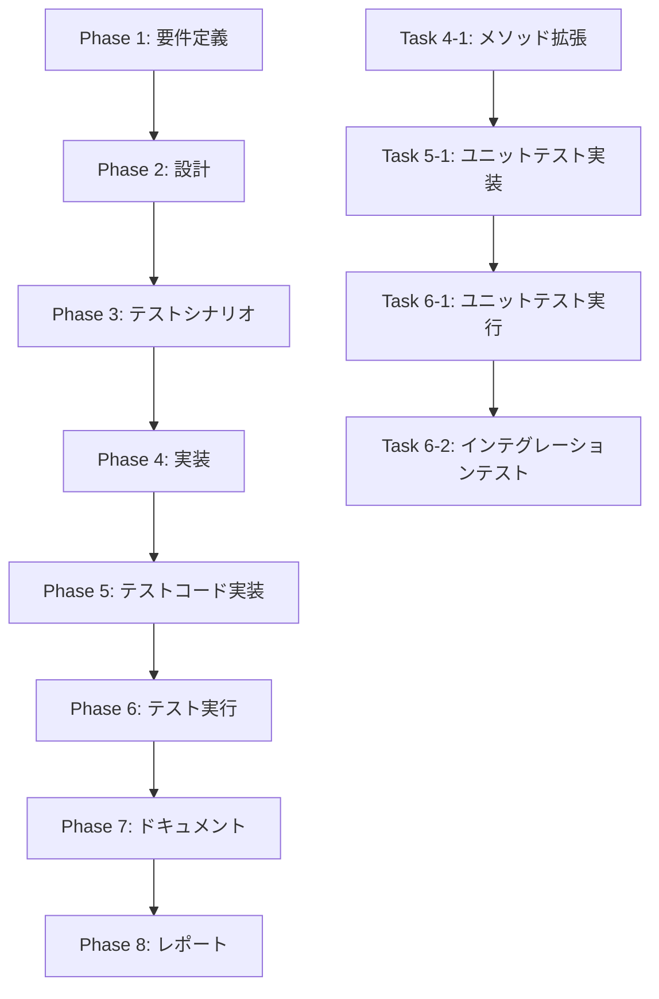

# プロジェクト計画書 - Issue #245

## 1. Issue分析

### 複雑度判定: **中程度**

**根拠:**
- 単一モジュール（`base-phase.ts`）の修正が中心だが、Phase全体のエージェント動作に影響する
- パス解決ロジックの追加は比較的シンプルだが、既存のフォールバック機構との整合性確認が必要
- PR #235の修正パターンを踏襲するため、設計方針は明確
- テスト範囲は限定的（ユニットテスト拡張）だが、Jenkins環境での動作確認が必須

### 見積もり工数: **8~12時間**

**内訳:**
- 要件定義: 1~2時間
- 設計: 1~2時間
- テストシナリオ: 1時間
- 実装: 2~3時間
- テストコード実装: 1~2時間
- テスト実行: 1時間
- ドキュメント: 1時間
- レポート: 0.5時間

### リスク評価: **中**

**根拠:**
- パス解決ロジックの変更はエッジケース（存在しないパス、シンボリックリンク等）でのバグを誘発しやすい
- Jenkins環境での検証が必須だが、ローカル環境での再現が困難
- PR #235と同様の修正パターンであり、既知の解決策が存在するため高リスクではない

---

## 2. 実装戦略判断

### 実装戦略: **EXTEND**

**判断根拠:**
- 既存の `BasePhase.getAgentWorkingDirectory()` メソッドを拡張
- PR #235の `execute.ts` で実装済みのパス解決ロジックを再利用
- 新規ファイル・クラスの作成は不要（既存メソッドの内部ロジック追加）
- 既存のフォールバック機構（`getActiveAgent().getWorkingDirectory()` → `this.workingDir`）を維持しつつ、REPOS_ROOT対応を最優先で追加

### テスト戦略: **UNIT_INTEGRATION**

**判断根拠:**
- **ユニットテスト**: `getAgentWorkingDirectory()` のパス解決ロジックを単体でテスト
  - REPOS_ROOT設定時の動的パス解決
  - REPOS_ROOT未設定時のフォールバック動作
  - 存在しないパスの扱い
- **インテグレーションテスト**: Jenkins環境でのpreset実行テスト
  - `review-requirements` プリセットでのPlanning Document参照
  - 既存のローカル実行環境（REPOS_ROOT未設定）での動作確認
- BDDテストは不要（ユーザーストーリーよりも技術的な内部修正）

### テストコード戦略: **EXTEND_TEST**

**判断根拠:**
- 既存のユニットテスト `tests/unit/phases/base-phase.test.ts`（存在する場合）に追加
- 新規テストケースの追加:
  - REPOS_ROOT設定時のパス解決
  - REPOS_ROOT未設定時のフォールバック
  - 無効なパスの扱い
- 新規テストファイル作成は不要（既存機能の拡張であるため）

---

## 3. 影響範囲分析

### 既存コードへの影響

**変更対象ファイル:**
- `src/phases/base-phase.ts`: `getAgentWorkingDirectory()` メソッドの拡張
- `tests/unit/phases/base-phase.test.ts`: テストケース追加（存在する場合）

**間接的に影響を受けるコンポーネント:**
- `src/phases/context/context-builder.ts`: `getAgentFileReference()` が呼び出す `getAgentWorkingDirectoryFn()` の動作が変更される
- すべてのPhaseクラス（Planning, Requirements, Design, ...）: BasePhaseを継承しているため、間接的に影響を受ける

### 依存関係の変更

- **新規依存の追加**: なし
- **既存依存の変更**: なし（`fs`, `path`, `config` は既存の依存関係）

### マイグレーション要否

- **不要**: 内部ロジックの変更のみで、APIやメタデータ構造の変更なし

---

## 4. タスク分割

### Phase 1: 要件定義 (見積もり: 1~2h)

- [ ] Task 1-1: Issue分析と既存実装の調査 (1h)
  - Issue #245のログ分析と根本原因の特定
  - PR #235の修正内容の確認（`execute.ts` のパターン）
  - `base-phase.ts:96-102` の既存実装の確認
- [ ] Task 1-2: 受け入れ条件の定義 (0.5h)
  - preset実行時のPlanning Document参照が成功する
  - REPOS_ROOT設定時に正しいパスが返される
  - REPOS_ROOT未設定時も既存動作が維持される
- [ ] Task 1-3: 非機能要件の確認 (0.5h)
  - パフォーマンス: パス解決の追加コストは無視できるレベル
  - 互換性: ローカル実行環境（REPOS_ROOT未設定）での動作保証

### Phase 2: 設計 (見積もり: 1~2h)

- [ ] Task 2-1: パス解決ロジックの詳細設計 (1h)
  - PR #235の `execute.ts` パターンを `base-phase.ts` に適用
  - フォールバック順序の定義: REPOS_ROOT → getActiveAgent() → workingDir
  - エッジケースの洗い出し（存在しないパス、権限エラー等）
- [ ] Task 2-2: テストケース設計 (0.5h)
  - REPOS_ROOT設定時の動作
  - REPOS_ROOT未設定時の動作
  - 無効なパス・存在しないパスの扱い
- [ ] Task 2-3: エラーハンドリング設計 (0.5h)
  - `fs.existsSync()` の例外ハンドリング
  - ログ出力レベルの決定（DEBUG/INFO/WARN）

### Phase 3: テストシナリオ (見積もり: 1h)

- [ ] Task 3-1: ユニットテストシナリオ作成 (0.5h)
  - REPOS_ROOT設定時: 正しいパスが返される
  - REPOS_ROOT未設定時: 既存のフォールバックが動作する
  - 存在しないパス: エラーを適切にハンドリングする
- [ ] Task 3-2: インテグレーションテストシナリオ作成 (0.5h)
  - Jenkins環境での `review-requirements` プリセット実行
  - ローカル環境での `--phase all` 実行（REPOS_ROOT未設定）

### Phase 4: 実装 (見積もり: 2~3h)

- [ ] Task 4-1: `getAgentWorkingDirectory()` メソッドの拡張 (1.5~2h)
  - REPOS_ROOT環境変数チェックの追加
  - `config.getReposRoot()` と `metadata.data.target_repository?.repo` からパス構築
  - `fs.existsSync()` による存在チェック
  - 既存のフォールバック機構（getActiveAgent → workingDir）の維持
- [ ] Task 4-2: ログ出力の追加 (0.5h)
  - DEBUG: REPOS_ROOT設定時の動的パス解決
  - WARN: パスが存在しない場合のフォールバック
- [ ] Task 4-3: コードレビューと静的解析 (0.5h)
  - ESLintチェック
  - TypeScript型チェック

### Phase 5: テストコード実装 (見積もり: 1~2h)

- [ ] Task 5-1: ユニットテストの実装 (1~1.5h)
  - `tests/unit/phases/base-phase.test.ts` に追加
  - REPOS_ROOT設定時のテストケース
  - REPOS_ROOT未設定時のテストケース
  - 無効なパスのテストケース
- [ ] Task 5-2: モック・スタブの実装 (0.5h)
  - `config.getReposRoot()` のモック
  - `fs.existsSync()` のモック

### Phase 6: テスト実行 (見積もり: 1h)

- [ ] Task 6-1: ユニットテストの実行 (0.5h)
  - `npm run test:unit` での全テスト実行
  - カバレッジ確認（新規コードのカバレッジ目標: 80%以上）
- [ ] Task 6-2: インテグレーションテストの実行 (0.5h)
  - Jenkins環境での動作確認（`review-requirements` プリセット）
  - ローカル環境での動作確認（REPOS_ROOT未設定）

### Phase 7: ドキュメント (見積もり: 1h)

- [ ] Task 7-1: CLAUDE.md / ARCHITECTURE.md の更新 (0.5h)
  - `getAgentWorkingDirectory()` の動作仕様を追記
  - REPOS_ROOT対応の説明を追加
- [ ] Task 7-2: TROUBLESHOOTING.md の更新 (0.5h)
  - パス解決エラーのトラブルシューティング追加

### Phase 8: レポート (見積もり: 0.5h)

- [ ] Task 8-1: 完了レポート作成 (0.5h)
  - 実装内容のサマリー
  - テスト結果のサマリー
  - PRマージ推奨

---

## 5. 依存関係

**クリティカルパス:**
Phase 1 → Phase 2 → Phase 4（Task 4-1） → Phase 5（Task 5-1） → Phase 6（Task 6-2）

---

## 6. リスクと軽減策

### リスク1: Jenkins環境での動作確認が失敗する

- **影響度**: 高（Issueの主要な問題が未解決になる）
- **確率**: 中（PR #235と同様のパターンだが、エッジケースでの挙動は未確認）
- **軽減策**:
  - Phase 4実装時に、PR #235のコードを正確に再現する
  - Phase 6でJenkins環境での動作確認を優先的に実施
  - 失敗時はログを詳細に確認し、パス解決の各ステップをデバッグ

### リスク2: ローカル環境（REPOS_ROOT未設定）での互換性破壊

- **影響度**: 高（既存のローカル開発環境が動作不能になる）
- **確率**: 低（フォールバック機構を維持するため）
- **軽減策**:
  - Phase 2設計時に、フォールバック順序を明確に定義
  - Phase 5でREPOS_ROOT未設定時のテストケースを優先実装
  - Phase 6でローカル環境での動作確認を必須化

### リスク3: パス解決のエッジケース（存在しないパス、権限エラー）でのバグ

- **影響度**: 中（特定条件下でエラーが発生する可能性）
- **確率**: 中（`fs.existsSync()` の例外ハンドリングが不足する可能性）
- **軽減策**:
  - Phase 2でエッジケースを網羅的に洗い出す
  - Phase 4で `try-catch` による例外ハンドリングを追加
  - Phase 5でエッジケースのテストケースを実装

### リスク4: 工数超過（テスト環境構築の遅延）

- **影響度**: 低（スケジュール遅延）
- **確率**: 中（Jenkins環境での動作確認に時間がかかる可能性）
- **軽減策**:
  - Phase 6のインテグレーションテストは早めに着手
  - テスト失敗時のバッファとして、見積もりに余裕を持たせる（8~12時間）

---

## 7. 品質ゲート

### Phase 1: 要件定義
- [ ] Issue分析が完了し、根本原因が特定されている
- [ ] 受け入れ条件が明確に定義されている
- [ ] PR #235の修正内容が理解されている

### Phase 2: 設計
- [ ] 実装戦略（EXTEND）の判断根拠が明記されている
- [ ] テスト戦略（UNIT_INTEGRATION）の判断根拠が明記されている
- [ ] テストコード戦略（EXTEND_TEST）の判断根拠が明記されている
- [ ] パス解決ロジックのフォールバック順序が明確に定義されている
- [ ] エッジケースが網羅的に洗い出されている

### Phase 3: テストシナリオ
- [ ] ユニットテストシナリオが網羅的である（REPOS_ROOT設定/未設定/エッジケース）
- [ ] インテグレーションテストシナリオが明確である（Jenkins/ローカル環境）

### Phase 4: 実装
- [ ] `getAgentWorkingDirectory()` メソッドが正しく拡張されている
- [ ] REPOS_ROOT設定時に動的パス解決が実装されている
- [ ] 既存のフォールバック機構が維持されている
- [ ] 例外ハンドリングが適切に実装されている
- [ ] ESLint・TypeScript型チェックがパスしている

### Phase 5: テストコード実装
- [ ] ユニットテストが実装されている（最低3ケース）
- [ ] モック・スタブが適切に実装されている
- [ ] テストコードがESLintをパスしている

### Phase 6: テスト実行
- [ ] すべてのユニットテストがパスしている
- [ ] 新規コードのカバレッジが80%以上である
- [ ] Jenkins環境でのインテグレーションテストがパスしている
- [ ] ローカル環境（REPOS_ROOT未設定）での動作が確認されている

### Phase 7: ドキュメント
- [ ] CLAUDE.md / ARCHITECTURE.md が更新されている
- [ ] TROUBLESHOOTING.md にトラブルシューティングが追加されている

### Phase 8: レポート
- [ ] 完了レポートが作成され、実装内容・テスト結果がサマリーされている
- [ ] PRマージ推奨が明記されている

---

## 品質ゲート（Phase 0）

このプロジェクト計画書は、以下の品質ゲートを満たしています：

- [x] **実装戦略が明確に決定されている**（EXTEND）
- [x] **テスト戦略が明確に決定されている**（UNIT_INTEGRATION）
- [x] **テストコード戦略が明確に決定されている**（EXTEND_TEST）
- [x] **影響範囲が分析されている**（base-phase.ts、context-builder.ts）
- [x] **タスク分割が適切な粒度である**（各タスク0.5~2h、検証可能）
- [x] **リスクが洗い出されている**（4つの主要リスクと軽減策）

---

以上、プロジェクト計画書の作成を完了しました。

## Turn 3: 実行完了

**ステータス**: success
**所要時間**: 78068ms
**ターン数**: 4

以下、プロジェクト計画書を作成します。

---

# プロジェクト計画書 - Issue #245

## 1. Issue分析

### 複雑度判定: **中程度**

**根拠:**
- 単一モジュール（`base-phase.ts`）の修正が中心だが、Phase全体のエージェント動作に影響する
- パス解決ロジックの追加は比較的シンプルだが、既存のフォールバック機構との整合性確認が必要
- PR #235の修正パターンを踏襲するため、設計方針は明確
- テスト範囲は限定的（ユニットテスト拡張）だが、Jenkins環境での動作確認が必須

### 見積もり工数: **8~12時間**

**内訳:**
- 要件定義: 1~2時間
- 設計: 1~2時間
- テストシナリオ: 1時間
- 実装: 2~3時間
- テストコード実装: 1~2時間
- テスト実行: 1時間
- ドキュメント: 1時間
- レポート: 0.5時間

### リスク評価: **中**

**根拠:**
- パス解決ロジックの変更はエッジケース（存在しないパス、シンボリックリンク等）でのバグを誘発しやすい
- Jenkins環境での検証が必須だが、ローカル環境での再現が困難
- PR #235と同様の修正パターンであり、既知の解決策が存在するため高リスクではない

---

## 2. 実装戦略判断

### 実装戦略: **EXTEND**

**判断根拠:**
- 既存の `BasePhase.getAgentWorkingDirectory()` メソッドを拡張
- PR #235の `execute.ts` で実装済みのパス解決ロジックを再利用
- 新規ファイル・クラスの作成は不要（既存メソッドの内部ロジック追加）
- 既存のフォールバック機構（`getActiveAgent().getWorkingDirectory()` → `this.workingDir`）を維持しつつ、REPOS_ROOT対応を最優先で追加

### テスト戦略: **UNIT_INTEGRATION**

**判断根拠:**
- **ユニットテスト**: `getAgentWorkingDirectory()` のパス解決ロジックを単体でテスト
  - REPOS_ROOT設定時の動的パス解決
  - REPOS_ROOT未設定時のフォールバック動作
  - 存在しないパスの扱い
- **インテグレーションテスト**: Jenkins環境でのpreset実行テスト
  - `review-requirements` プリセットでのPlanning Document参照
  - 既存のローカル実行環境（REPOS_ROOT未設定）での動作確認
- BDDテストは不要（ユーザーストーリーよりも技術的な内部修正）

### テストコード戦略: **EXTEND_TEST**

**判断根拠:**
- 既存のユニットテスト `tests/unit/phases/base-phase.test.ts`（存在する場合）に追加
- 新規テストケースの追加:
  - REPOS_ROOT設定時のパス解決
  - REPOS_ROOT未設定時のフォールバック
  - 無効なパスの扱い
- 新規テストファイル作成は不要（既存機能の拡張であるため）

---

## 3. 影響範囲分析

### 既存コードへの影響

**変更対象ファイル:**
- `src/phases/base-phase.ts`: `getAgentWorkingDirectory()` メソッドの拡張
- `tests/unit/phases/base-phase.test.ts`: テストケース追加（存在する場合）

**間接的に影響を受けるコンポーネント:**
- `src/phases/context/context-builder.ts`: `getAgentFileReference()` が呼び出す `getAgentWorkingDirectoryFn()` の動作が変更される
- すべてのPhaseクラス（Planning, Requirements, Design, ...）: BasePhaseを継承しているため、間接的に影響を受ける

### 依存関係の変更

- **新規依存の追加**: なし
- **既存依存の変更**: なし（`fs`, `path`, `config` は既存の依存関係）

### マイグレーション要否

- **不要**: 内部ロジックの変更のみで、APIやメタデータ構造の変更なし

---

## 4. タスク分割

### Phase 1: 要件定義 (見積もり: 1~2h)

- [ ] Task 1-1: Issue分析と既存実装の調査 (1h)
  - Issue #245のログ分析と根本原因の特定
  - PR #235の修正内容の確認（`execute.ts` のパターン）
  - `base-phase.ts:96-102` の既存実装の確認
- [ ] Task 1-2: 受け入れ条件の定義 (0.5h)
  - preset実行時のPlanning Document参照が成功する
  - REPOS_ROOT設定時に正しいパスが返される
  - REPOS_ROOT未設定時も既存動作が維持される
- [ ] Task 1-3: 非機能要件の確認 (0.5h)
  - パフォーマンス: パス解決の追加コストは無視できるレベル
  - 互換性: ローカル実行環境（REPOS_ROOT未設定）での動作保証

### Phase 2: 設計 (見積もり: 1~2h)

- [ ] Task 2-1: パス解決ロジックの詳細設計 (1h)
  - PR #235の `execute.ts` パターンを `base-phase.ts` に適用
  - フォールバック順序の定義: REPOS_ROOT → getActiveAgent() → workingDir
  - エッジケースの洗い出し（存在しないパス、権限エラー等）
- [ ] Task 2-2: テストケース設計 (0.5h)
  - REPOS_ROOT設定時の動作
  - REPOS_ROOT未設定時の動作
  - 無効なパス・存在しないパスの扱い
- [ ] Task 2-3: エラーハンドリング設計 (0.5h)
  - `fs.existsSync()` の例外ハンドリング
  - ログ出力レベルの決定（DEBUG/INFO/WARN）

### Phase 3: テストシナリオ (見積もり: 1h)

- [ ] Task 3-1: ユニットテストシナリオ作成 (0.5h)
  - REPOS_ROOT設定時: 正しいパスが返される
  - REPOS_ROOT未設定時: 既存のフォールバックが動作する
  - 存在しないパス: エラーを適切にハンドリングする
- [ ] Task 3-2: インテグレーションテストシナリオ作成 (0.5h)
  - Jenkins環境での `review-requirements` プリセット実行
  - ローカル環境での `--phase all` 実行（REPOS_ROOT未設定）

### Phase 4: 実装 (見積もり: 2~3h)

- [ ] Task 4-1: `getAgentWorkingDirectory()` メソッドの拡張 (1.5~2h)
  - REPOS_ROOT環境変数チェックの追加
  - `config.getReposRoot()` と `metadata.data.target_repository?.repo` からパス構築
  - `fs.existsSync()` による存在チェック
  - 既存のフォールバック機構（getActiveAgent → workingDir）の維持
- [ ] Task 4-2: ログ出力の追加 (0.5h)
  - DEBUG: REPOS_ROOT設定時の動的パス解決
  - WARN: パスが存在しない場合のフォールバック
- [ ] Task 4-3: コードレビューと静的解析 (0.5h)
  - ESLintチェック
  - TypeScript型チェック

### Phase 5: テストコード実装 (見積もり: 1~2h)

- [ ] Task 5-1: ユニットテストの実装 (1~1.5h)
  - `tests/unit/phases/base-phase.test.ts` に追加
  - REPOS_ROOT設定時のテストケース
  - REPOS_ROOT未設定時のテストケース
  - 無効なパスのテストケース
- [ ] Task 5-2: モック・スタブの実装 (0.5h)
  - `config.getReposRoot()` のモック
  - `fs.existsSync()` のモック

### Phase 6: テスト実行 (見積もり: 1h)

- [ ] Task 6-1: ユニットテストの実行 (0.5h)
  - `npm run test:unit` での全テスト実行
  - カバレッジ確認（新規コードのカバレッジ目標: 80%以上）
- [ ] Task 6-2: インテグレーションテストの実行 (0.5h)
  - Jenkins環境での動作確認（`review-requirements` プリセット）
  - ローカル環境での動作確認（REPOS_ROOT未設定）

### Phase 7: ドキュメント (見積もり: 1h)

- [ ] Task 7-1: CLAUDE.md / ARCHITECTURE.md の更新 (0.5h)
  - `getAgentWorkingDirectory()` の動作仕様を追記
  - REPOS_ROOT対応の説明を追加
- [ ] Task 7-2: TROUBLESHOOTING.md の更新 (0.5h)
  - パス解決エラーのトラブルシューティング追加

### Phase 8: レポート (見積もり: 0.5h)

- [ ] Task 8-1: 完了レポート作成 (0.5h)
  - 実装内容のサマリー
  - テスト結果のサマリー
  - PRマージ推奨

---

## 5. 依存関係

**クリティカルパス:**
Phase 1 → Phase 2 → Phase 4（Task 4-1） → Phase 5（Task 5-1） → Phase 6（Task 6-2）

---

## 6. リスクと軽減策

### リスク1: Jenkins環境での動作確認が失敗する

- **影響度**: 高（Issueの主要な問題が未解決になる）
- **確率**: 中（PR #235と同様のパターンだが、エッジケースでの挙動は未確認）
- **軽減策**:
  - Phase 4実装時に、PR #235のコードを正確に再現する
  - Phase 6でJenkins環境での動作確認を優先的に実施
  - 失敗時はログを詳細に確認し、パス解決の各ステップをデバッグ

### リスク2: ローカル環境（REPOS_ROOT未設定）での互換性破壊

- **影響度**: 高（既存のローカル開発環境が動作不能になる）
- **確率**: 低（フォールバック機構を維持するため）
- **軽減策**:
  - Phase 2設計時に、フォールバック順序を明確に定義
  - Phase 5でREPOS_ROOT未設定時のテストケースを優先実装
  - Phase 6でローカル環境での動作確認を必須化

### リスク3: パス解決のエッジケース（存在しないパス、権限エラー）でのバグ

- **影響度**: 中（特定条件下でエラーが発生する可能性）
- **確率**: 中（`fs.existsSync()` の例外ハンドリングが不足する可能性）
- **軽減策**:
  - Phase 2でエッジケースを網羅的に洗い出す
  - Phase 4で `try-catch` による例外ハンドリングを追加
  - Phase 5でエッジケースのテストケースを実装

### リスク4: 工数超過（テスト環境構築の遅延）

- **影響度**: 低（スケジュール遅延）
- **確率**: 中（Jenkins環境での動作確認に時間がかかる可能性）
- **軽減策**:
  - Phase 6のインテグレーションテストは早めに着手
  - テスト失敗時のバッファとして、見積もりに余裕を持たせる（8~12時間）

---

## 7. 品質ゲート

### Phase 1: 要件定義
- [ ] Issue分析が完了し、根本原因が特定されている
- [ ] 受け入れ条件が明確に定義されている
- [ ] PR #235の修正内容が理解されている

### Phase 2: 設計
- [ ] 実装戦略（EXTEND）の判断根拠が明記されている
- [ ] テスト戦略（UNIT_INTEGRATION）の判断根拠が明記されている
- [ ] テストコード戦略（EXTEND_TEST）の判断根拠が明記されている
- [ ] パス解決ロジックのフォールバック順序が明確に定義されている
- [ ] エッジケースが網羅的に洗い出されている

### Phase 3: テストシナリオ
- [ ] ユニットテストシナリオが網羅的である（REPOS_ROOT設定/未設定/エッジケース）
- [ ] インテグレーションテストシナリオが明確である（Jenkins/ローカル環境）

### Phase 4: 実装
- [ ] `getAgentWorkingDirectory()` メソッドが正しく拡張されている
- [ ] REPOS_ROOT設定時に動的パス解決が実装されている
- [ ] 既存のフォールバック機構が維持されている
- [ ] 例外ハンドリングが適切に実装されている
- [ ] ESLint・TypeScript型チェックがパスしている

### Phase 5: テストコード実装
- [ ] ユニットテストが実装されている（最低3ケース）
- [ ] モック・スタブが適切に実装されている
- [ ] テストコードがESLintをパスしている

### Phase 6: テスト実行
- [ ] すべてのユニットテストがパスしている
- [ ] 新規コードのカバレッジが80%以上である
- [ ] Jenkins環境でのインテグレーションテストがパスしている
- [ ] ローカル環境（REPOS_ROOT未設定）での動作が確認されている

### Phase 7: ドキュメント
- [ ] CLAUDE.md / ARCHITECTURE.md が更新されている
- [ ] TROUBLESHOOTING.md にトラブルシューティングが追加されている

### Phase 8: レポート
- [ ] 完了レポートが作成され、実装内容・テスト結果がサマリーされている
- [ ] PRマージ推奨が明記されている

---

## 品質ゲート（Phase 0）

このプロジェクト計画書は、以下の品質ゲートを満たしています：

- [x] **実装戦略が明確に決定されている**（EXTEND）
- [x] **テスト戦略が明確に決定されている**（UNIT_INTEGRATION）
- [x] **テストコード戦略が明確に決定されている**（EXTEND_TEST）
- [x] **影響範囲が分析されている**（base-phase.ts、context-builder.ts）
- [x] **タスク分割が適切な粒度である**（各タスク0.5~2h、検証可能）
- [x] **リスクが洗い出されている**（4つの主要リスクと軽減策）

---

以上、プロジェクト計画書の作成を完了しました。

---

**経過時間**: 79595ms
**開始**: 2025-12-05T14:46:03.653Z
**終了**: 2025-12-05T14:47:23.248Z