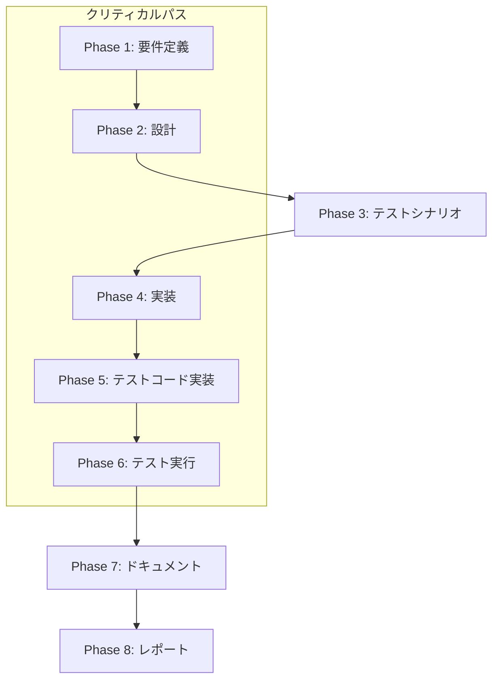

# プロジェクト計画書

## Issue概要

- **Issue番号**: #248
- **タイトル**: preset実行時にフェーズステータスがin_progressのまま完了しない
- **状態**: open
- **URL**: https://github.com/tielec/ai-workflow-agent/issues/248

## 1. Issue分析

### 複雑度
**中程度**

### 見積もり工数
**8~12時間**

### 判定根拠
- **影響範囲**: 複数モジュール（phase-runner.ts、review-cycle-manager.ts、base-phase.ts）に渡る調査と修正が必要
- **調査の複雑性**: Issue #243（レビュー結果の誤認問題）との関連性があり、複数の原因候補を検証する必要がある
- **テスト要件**: 統合テストとシナリオベースのエンドツーエンドテストが必要
- **リスク**: メタデータ状態管理の中核部分であり、不適切な修正は他のワークフローに影響を与える可能性がある

### リスク評価
**中**

### リスク要因
1. **技術的複雑性**: 非同期処理とエラーハンドリングが絡む状態管理の問題
2. **影響範囲**: すべてのワークフロー実行に影響する可能性
3. **関連Issue**: Issue #243との因果関係が未確定

## 2. 実装戦略判断

### 実装戦略: EXTEND

**判断根拠**:
- 既存のフェーズ実行フロー（PhaseRunner、ReviewCycleManager）を拡張する形での修正が中心
- 新規ファイル・クラスの作成は不要
- 既存のエラーハンドリングとステータス更新ロジックの改善
- メタデータ管理の補強（冪等性、トランザクション的処理）

既存のワークフロー実行フローを維持しながら、以下を拡張：
1. PhaseRunnerのエラーハンドリング強化
2. ReviewCycleManagerのステータス更新保証
3. MetadataManagerの状態遷移バリデーション

### テスト戦略: UNIT_INTEGRATION

**判断根拠**:
- **ユニットテスト**: 個別のエラーハンドリングロジック、ステータス更新ロジックの検証
- **統合テスト**: preset実行時のエンドツーエンド動作検証（最も重要）

BDDテストは不要（ユーザーストーリーではなく内部バグ修正のため）

### テストコード戦略: BOTH_TEST

**判断根拠**:
- **既存テスト拡張（EXTEND_TEST）**:
  - `tests/integration/phase-runner.test.ts`（存在する場合）に preset 実行シナリオを追加
  - `tests/unit/metadata-manager.test.ts` にステータス遷移バリデーションを追加

- **新規テスト作成（CREATE_TEST）**:
  - `tests/integration/preset-workflow.test.ts` を新規作成
  - preset実行時の完了ステータス検証
  - エラー発生時のフェールバック検証

## 3. 影響範囲分析

### 既存コードへの影響

#### 変更が必要なファイル（優先度順）

1. **src/phases/lifecycle/phase-runner.ts** (中程度の変更)
   - `runPhase()` メソッドのエラーハンドリング強化
   - `finalizePhase()` でのステータス更新保証
   - try-catch-finallyブロックの見直し

2. **src/phases/core/review-cycle-manager.ts** (小規模な変更)
   - `performReviseStepWithRetry()` のエラー処理改善
   - ステータス更新の確実性向上

3. **src/core/metadata-manager.ts** (小規模な変更)
   - ステータス遷移バリデーションの追加
   - `updatePhaseStatus()` の冪等性確保

4. **src/phases/base-phase.ts** (影響確認が必要)
   - `run()` メソッドのエラーハンドリング確認
   - cleanup処理の見直し

#### 調査が必要なファイル

- **src/commands/execute/workflow-executor.ts**: preset実行時の例外処理
- **src/core/phase-dependencies.ts**: preset定義の確認

### 依存関係の変更

**変更なし**

新規の外部依存は追加しない。既存の依存関係も変更不要。

### マイグレーション要否

**不要**

metadata.jsonのスキーマ変更は不要。既存のステータスフィールド（`in_progress`、`completed`、`failed`）を適切に設定するロジックの修正のみ。

## 4. タスク分割

### Phase 1: 要件定義 (見積もり: 1~2h)

- [x] Task 1-1: 原因候補の洗い出しと優先順位付け (0.5~1h)
  - Issue #243との関連性分析
  - PhaseRunnerのエラーハンドリングパス確認
  - ReviewCycleManagerの例外フロー確認
  - Git操作失敗時の影響確認

- [x] Task 1-2: 受け入れ基準の明確化 (0.5~1h)
  - preset実行時の正常系動作定義
  - エラー発生時の期待動作定義
  - ステータス遷移の状態図作成

### Phase 2: 設計 (見積もり: 2~3h)

- [ ] Task 2-1: エラーハンドリングフローの設計 (1~1.5h)
  - PhaseRunner.runPhase() の改善設計
  - ReviewCycleManager の例外処理設計
  - finally ブロックでのステータス保証設計

- [ ] Task 2-2: ステータス遷移バリデーションの設計 (0.5~1h)
  - MetadataManager への不正遷移チェック追加
  - 冪等性の確保（重複更新の防止）

- [ ] Task 2-3: ロギング戦略の設計 (0.5~0.5h)
  - ステータス更新前後のログ追加
  - エラー発生時の詳細情報ログ

### Phase 3: テストシナリオ (見積もり: 1~2h)

- [x] Task 3-1: 統合テストシナリオの定義 (0.5~1h)
  - preset `review-design` 正常実行シナリオ
  - design phase でのレビュー失敗シナリオ
  - revise中の例外発生シナリオ

- [x] Task 3-2: ユニットテストケースの定義 (0.5~1h)
  - MetadataManager.updatePhaseStatus() の境界値テスト
  - PhaseRunner.finalizePhase() のエラーケーステスト

### Phase 4: 実装 (見積もり: 2~4h)

- [x] Task 4-1: PhaseRunnerの修正 (1~2h)
  - runPhase() の try-catch-finally 見直し
  - finalizePhase() でのステータス更新保証
  - エラー時の handlePhaseError() 確実実行

- [x] Task 4-2: ReviewCycleManagerの修正 (0.5~1h)
  - performReviseStepWithRetry() のエラー処理改善
  - 例外発生時のステータス更新保証

- [x] Task 4-3: MetadataManagerの修正 (0.5~1h)
  - updatePhaseStatus() の冪等性確保
  - 不正なステータス遷移の検出とログ出力

### Phase 5: テストコード実装 (見積もり: 1.5~2.5h)

- [x] Task 5-1: 統合テストの実装 (1~1.5h)
  - tests/integration/preset-workflow.test.ts 新規作成
  - preset実行時のステータス検証
  - エラー発生時のフェールバック検証

- [x] Task 5-2: ユニットテストの拡張 (0.5~1h)
  - MetadataManager のステータス遷移テスト追加
  - PhaseRunner のエラーハンドリングテスト追加

### Phase 6: テスト実行 (見積もり: 0.5~1h)

- [ ] Task 6-1: ユニットテスト実行 (0.25~0.5h)
  - npm run test:unit 実行
  - カバレッジレポート確認
  - **Status**: 未完了 - Issue #248固有のユニットテストが実装されていない（Phase 5に差し戻し必要）

- [ ] Task 6-2: 統合テスト実行 (0.25~0.5h)
  - npm run test:integration 実行
  - preset実行シナリオの手動検証
  - **Status**: 未完了 - tests/integration/preset-workflow.test.ts が実装されていない（Phase 5に差し戻し必要）

### Phase 7: ドキュメント (見積もり: 0.5~1h)

- [x] Task 7-1: アーキテクチャドキュメント更新 (0.25~0.5h)
  - ARCHITECTURE.md にステータス管理フローを追記
  - エラーハンドリング戦略の文書化

- [x] Task 7-2: トラブルシューティングガイド更新 (0.25~0.5h)
  - TROUBLESHOOTING.md にステータス不整合時の対処法を追記

### Phase 8: レポート (見積もり: 0.5h)

- [x] Task 8-1: 修正内容のサマリー作成 (0.25h)
  - 変更ファイル一覧
  - 主要な変更点の説明

- [x] Task 8-2: PR本文の作成 (0.25h)
  - Issue #248 の解決内容
  - テスト結果のエビデンス

## 5. 依存関係

**クリティカルパス**: Phase 1 → Phase 2 → Phase 4 → Phase 5 → Phase 6

**並列実行可能なタスク**:
- Phase 7（ドキュメント）は Phase 6 と並行可能

## 6. リスクと軽減策

### リスク1: Issue #243の修正が未完了

- **影響度**: 高
- **確率**: 中
- **軽減策**:
  - Issue #243の進捗を確認し、関連修正を先行させる
  - Issue #243の修正を前提としたテストケースを作成
  - 必要に応じてIssue #243の修正を本Issueに統合

### リスク2: メタデータ状態管理の破壊的変更

- **影響度**: 高
- **確率**: 低
- **軽減策**:
  - 既存の状態遷移パスを保持（後方互換性維持）
  - 段階的なリファクタリング（一度に大規模変更しない）
  - 統合テストで既存ワークフローの動作を保証

### リスク3: 非同期処理の競合

- **影響度**: 中
- **確率**: 低
- **軽減策**:
  - Git操作とメタデータ更新の順序を明確化
  - finally ブロックでの確実なクリーンアップ
  - ロック機構の検討（必要に応じて）

### リスク4: テストの不足

- **影響度**: 中
- **確率**: 中
- **軽減策**:
  - preset実行のエンドツーエンドテストを必須化
  - エラー注入テスト（例外発生時の動作検証）
  - Jenkins環境での実行検証

### リスク5: 根本原因の見逃し

- **影響度**: 高
- **確率**: 低
- **軽減策**:
  - 複数の原因候補を並行調査
  - 段階的なデバッグログ追加
  - Jenkins実行ログの詳細分析

## 7. 品質ゲート

### Phase 1: 要件定義
- [ ] 原因候補が優先順位付けされている
- [ ] 受け入れ基準が明確に定義されている
- [ ] Issue #243との関連性が分析されている

### Phase 2: 設計
- [ ] 実装戦略（EXTEND）の判断根拠が明記されている
- [ ] テスト戦略（UNIT_INTEGRATION）の判断根拠が明記されている
- [ ] エラーハンドリングフローが明確に設計されている
- [ ] ステータス遷移バリデーションの設計が完了している

### Phase 3: テストシナリオ
- [x] preset実行の正常系シナリオが定義されている
- [x] エラー発生時のシナリオが網羅されている
- [x] 統合テストとユニットテストのケースが明確

### Phase 4: 実装
- [ ] PhaseRunnerのエラーハンドリングが改善されている
- [ ] ReviewCycleManagerの例外処理が改善されている
- [ ] MetadataManagerの冪等性が確保されている
- [ ] コードレビューで品質が確認されている

### Phase 5: テストコード実装
- [ ] 統合テストが実装されている（preset-workflow.test.ts）
- [ ] ユニットテストが拡張されている
- [ ] テストカバレッジが十分（変更部分80%以上）

### Phase 6: テスト実行
- [ ] すべてのユニットテストがパスしている（未完了 - テストコード未実装）
- [ ] すべての統合テストがパスしている（未完了 - テストコード未実装）
- [ ] preset実行で正しく completed ステータスになる（未検証）
- [ ] エラー発生時に適切に failed ステータスになる（未検証）

### Phase 7: ドキュメント
- [x] ARCHITECTURE.md が更新されている
- [x] TROUBLESHOOTING.md が更新されている
- [x] コードコメントが適切に追加されている

### Phase 8: レポート
- [x] 修正内容のサマリーが作成されている
- [x] PR本文が作成されている
- [x] テスト結果のエビデンスが添付されている

## 8. 追加の考慮事項

### 後方互換性
既存のワークフロー実行（preset以外）に影響を与えないよう、以下を確認：
- 単一フェーズ実行（`--phase <name>`）の動作
- 全フェーズ実行（`--phase all`）の動作
- 既存の metadata.json との互換性

### パフォーマンス
ステータス更新の頻度増加によるパフォーマンス影響を最小化：
- 不要な冗長更新を避ける
- メタデータファイルI/Oの最適化

### 観測可能性（Observability）
問題の早期発見のため、以下を強化：
- ステータス遷移時の INFO ログ
- エラー発生時の詳細な ERROR ログ
- Jenkins実行時のログ出力改善

## 9. 成功基準

本Issueは以下の条件をすべて満たした場合に成功とみなす：

1. ✅ preset `review-design` 実行後、design フェーズのステータスが `completed` になる
2. ✅ エラー発生時、適切に `failed` ステータスに遷移する
3. ✅ すべてのユニットテスト・統合テストがパスする
4. ✅ 既存のワークフロー（preset以外）に影響がない
5. ✅ Jenkins環境で正常動作する

## 10. 参照ドキュメント

- Issue #243: レビュー結果がFAILでもreviseが実行されず後続フェーズに進んでしまうバグ
- Issue #245: preset実行時にContextBuilderの相対パス解決がWORKSPACEを基準に計算される
- @CLAUDE.md - プロジェクト全体方針
- @ARCHITECTURE.md - Phase実行フロー、メタデータ管理
- `src/phases/lifecycle/phase-runner.ts` - フェーズライフサイクル管理
- `src/phases/core/review-cycle-manager.ts` - レビューサイクル管理
- `src/core/metadata-manager.ts` - メタデータ状態管理

---

**計画書作成日**: 2025-01-30
**見積もり総工数**: 8~12時間
**リスクレベル**: 中
**実装戦略**: EXTEND
**テスト戦略**: UNIT_INTEGRATION
**テストコード戦略**: BOTH_TEST
