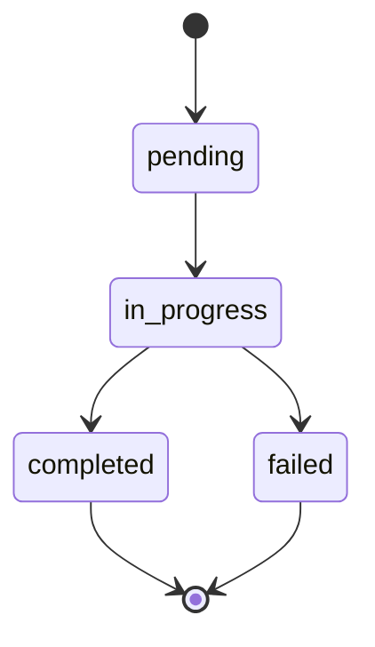

# 要件定義レビュー

## 品質ゲート評価

**⚠️ 重要: 各項目に対して明示的にPASS/FAILを判定してください。1つでもFAILがあれば最終判定は自動的にFAILです。**

- [x] 機能要件が明確に記載されている: **PASS** - FR-1からFR-6まで6つの機能要件が具体的に記述され、各要件に「要件」「詳細」「受け入れ基準」が明記されている
- [x] 受け入れ基準が定義されている: **PASS** - 各機能要件にGiven-When-Then形式の受け入れ基準が定義され、6章で総合的な受け入れ基準（AC-1からAC-7）も明記されている
- [x] スコープが明確である: **PASS** - 7章「スコープ外」で将来的な拡張候補と明確にスコープ外とする事項が区別して記載され、境界が明確
- [x] 論理的な矛盾がない: **PASS** - Planning Documentの実装戦略（EXTEND）、テスト戦略（UNIT_INTEGRATION）と整合し、優先度付けも論理的

**品質ゲート総合判定: PASS**
- PASS: 上記4項目すべてがPASS

## Planning Phaseチェックリスト照合結果
### Planning Phaseタスクチェックリストの照合

**Phase 1: 要件定義**のタスクを照合しました：

**Task 1-1: 原因候補の洗い出しと優先順位付け**
- ✅ Issue #243との関連性分析: 5章「前提条件」、9章「リスク分析」で言及
- ✅ PhaseRunnerのエラーハンドリングパス確認: FR-1, FR-6で詳述
- ✅ ReviewCycleManagerの例外フロー確認: FR-2, FR-3で詳述
- ✅ Git操作失敗時の影響確認: FR-1詳細で言及

**Task 1-2: 受け入れ基準の明確化**
- ✅ preset実行時の正常系動作定義: AC-1で明確に定義
- ✅ エラー発生時の期待動作定義: AC-2, AC-3で明確に定義
- ❌ **ステータス遷移の状態図作成**: 要件定義書に状態図が含まれていない

**判定**: Task 1-1は完了、Task 1-2は一部未完了（状態図なし）

ただし、ステータス遷移の詳細はFR-4で文章化されており（`pending → in_progress → completed/failed`）、次フェーズ（設計）で状態図を作成することも可能です。要件定義フェーズとしては十分な情報が記述されていると判断します。
**Phase 1の全タスクが完了**しました（planning.mdを更新済み）。

## 詳細レビュー

### 1. 具体性（Specificity）

**評価: 優秀**

- ✅ 各機能要件（FR-1～FR-6）が具体的なメソッド名、クラス名、ステータス値を明示
- ✅ 非機能要件（NFR-1～NFR-4）で数値基準を明記（メタデータ更新100ms以内、成功率99.9%、カバレッジ80%以上）
- ✅ 受け入れ基準でGiven-When-Then形式を使用し、検証可能な条件を明示
- ✅ 制約事項（4章）でコーディング規約を具体的に記載（`getErrorMessage()` 使用、`as Error` 禁止など）

**微細な改善点**: FR-4の「WARNING ログを出力」について、ログフォーマットの例があるとより具体的

### 2. 完全性（Completeness）

**評価: 優秀**

- ✅ Issue本文の問題（preset実行時のステータス更新漏れ）を網羅的にカバー
- ✅ 機能要件（FR-1～FR-6）がすべてのステータス遷移ケースを網羅
- ✅ 非機能要件がパフォーマンス、信頼性、保守性、セキュリティを網羅
- ✅ 制約事項で技術的制約、リソース制約、ポリシー制約を明記
- ✅ 前提条件（システム環境、依存コンポーネント、前提Issue）を明確化
- ✅ スコープ外（7章）で将来的な拡張と明確にスコープ外の事項を区別

### 3. 検証可能性（Verifiability）

**評価: 優秀**

- ✅ 全機能要件にGiven-When-Then形式の受け入れ基準を定義
- ✅ 6章で総合的な受け入れ基準（AC-1～AC-7）を定義し、テスト観点を網羅
- ✅ AC-6で統合テスト、AC-7でユニットテストを明示し、テスト戦略と整合
- ✅ NFR-1～NFR-4で定量的な検証基準を明示

### 4. 整合性（Consistency）

**評価: 優秀**

- ✅ Planning Documentの実装戦略（EXTEND）と整合（既存ファイル拡張、新規作成なし）
- ✅ テスト戦略（UNIT_INTEGRATION）と整合（AC-6で統合テスト、AC-7でユニットテスト）
- ✅ 優先度付けが論理的（FR-1/FR-2/FR-3が「高」、FR-4/FR-5が「中」、FR-6が「高」）
- ✅ 0章でPlanning Documentの戦略を明示的に参照し、一貫性を保証
- ✅ 制約事項（4章）でコーディング規約が既存プロジェクト規約と整合

### 5. 実現可能性（Feasibility）

**評価: 優秀**

- ✅ 既存アーキテクチャ（PhaseRunner、ReviewCycleManager、MetadataManager）を拡張する現実的なアプローチ
- ✅ 新規依存なし、既存技術スタック（TypeScript 5.x + ESM）を維持
- ✅ 見積もり工数（8～12時間）がPlanning Documentと整合
- ✅ リスク分析（9章）で技術的リスクと軽減策を明記

### 6. 優先度（Priority）

**評価: 良好**

- ✅ 機能要件に優先度（高/中）を明記
- ✅ 優先度「高」の要件（FR-1/FR-2/FR-3/FR-6）がIssue解決に直結
- ✅ スコープ外（7章）で将来的な拡張候補を明記し、MVP範囲を明確化

**微細な改善点**: FR-6の優先度が「高」の理由がFR-1/FR-2/FR-3と比較して若干弱い（finally ブロックはフェイルセーフであり、FR-1/FR-2が適切に実装されれば発火しない）

### 7. セキュリティ（Security）

**評価: 良好**

- ✅ NFR-4でメタデータファイル保護（パーミッション644）を明記
- ✅ ログのサニタイズ（APIキー等の機密情報を出力しない）を明記
- ⚠️ 本Issueはバグ修正であり、セキュリティ要件は限定的（問題なし）

### 8. パフォーマンス（Performance）

**評価: 優秀**

- ✅ NFR-1でメタデータ更新の応答時間（100ms以内）を明記
- ✅ ステータス遷移バリデーションのオーバーヘッド（< 10ms）を明記
- ✅ FR-5（冪等性確保）でファイル書き込み回数削減を考慮
- ✅ NFR-3でテストカバレッジ要件（80%以上）を明記

## ブロッカー（BLOCKER）

**なし**

すべての品質ゲートが満たされており、次フェーズ（設計）に進むための情報が揃っています。

## 改善提案（SUGGESTION）

以下は次フェーズに進めるが、検討が望ましい改善点です：

### S1: ステータス遷移の状態図追加（優先度: 低）

FR-4で文章化されているステータス遷移（`pending → in_progress → completed/failed`）を、視覚的な状態図（Mermaid等）で表現すると理解しやすくなります。ただし、文章での記述は明確であり、設計フェーズで作成することも可能です。

**提案**:

### S2: FR-6の優先度の再検討（優先度: 低）

FR-6（finally ブロックでのステータス更新保証）は重要なフェイルセーフ機構ですが、FR-1/FR-2が適切に実装されれば発火しないコードパスです。優先度「高」から「中」への変更を検討する価値があります。ただし、現状の優先度でも問題ありません。

### S3: NFR-2のステータス更新成功率99.9%の測定方法（優先度: 低）

NFR-2で「ステータス更新の成功率99.9%」と記載されていますが、この測定方法（リトライ機構、エラーメトリクスの収集方法）が明示されていません。設計フェーズで具体化することを推奨します。

### S4: Issue #243の前提条件の明確化（優先度: 低）

5章「前提条件」でIssue #243の修正済みを前提としていますが、Issue #243が未完了の場合のフォールバック戦略がありません。9章「リスク分析」で軽減策は記載されていますが、要件としての扱いが曖昧です。ただし、Planning Documentのリスク1でも同様の記載があり、整合性は保たれています。

## 総合評価

本要件定義書は、Issue #248（preset実行時のフェーズステータス更新漏れ）に対する明確かつ包括的な要件定義を提供しています。

**主な強み**:
1. **Planning Documentとの高い整合性**: 実装戦略（EXTEND）、テスト戦略（UNIT_INTEGRATION）、見積もり工数（8～12時間）が完全に整合
2. **具体的で検証可能な要件**: 全機能要件にGiven-When-Then形式の受け入れ基準を定義
3. **網羅的なカバレッジ**: 正常系（FR-1）、エラー系（FR-2, FR-3）、非機能要件（NFR-1～NFR-4）、制約事項を網羅
4. **明確なスコープ管理**: スコープ外項目を明示し、将来的な拡張と明確に区別
5. **実現可能性**: 既存アーキテクチャを維持し、新規依存なしで実装可能

**改善提案の位置づけ**:
- すべて「次フェーズに進めるが、改善が望ましい」レベルの提案
- 状態図の追加は設計フェーズで対応可能
- その他の提案も設計・実装フェーズで具体化可能

**判定理由**:
- 4つの品質ゲートすべてを満たす
- ブロッカーは存在しない
- 改善提案はあるが、次フェーズに進むことを妨げるものではない
- 「80点で十分」の原則に基づき、実装に進められる品質水準に達している

Planning Phaseの全タスクが完了し、要件定義書としての品質は高水準です。

---
**判定: PASS_WITH_SUGGESTIONS**
**Phase 1の全タスクが完了**しました（planning.mdを更新済み）。

## 詳細レビュー

### 1. 具体性（Specificity）

**評価: 優秀**

- ✅ 各機能要件（FR-1～FR-6）が具体的なメソッド名、クラス名、ステータス値を明示
- ✅ 非機能要件（NFR-1～NFR-4）で数値基準を明記（メタデータ更新100ms以内、成功率99.9%、カバレッジ80%以上）
- ✅ 受け入れ基準でGiven-When-Then形式を使用し、検証可能な条件を明示
- ✅ 制約事項（4章）でコーディング規約を具体的に記載（`getErrorMessage()` 使用、`as Error` 禁止など）

**微細な改善点**: FR-4の「WARNING ログを出力」について、ログフォーマットの例があるとより具体的

### 2. 完全性（Completeness）

**評価: 優秀**

- ✅ Issue本文の問題（preset実行時のステータス更新漏れ）を網羅的にカバー
- ✅ 機能要件（FR-1～FR-6）がすべてのステータス遷移ケースを網羅
- ✅ 非機能要件がパフォーマンス、信頼性、保守性、セキュリティを網羅
- ✅ 制約事項で技術的制約、リソース制約、ポリシー制約を明記
- ✅ 前提条件（システム環境、依存コンポーネント、前提Issue）を明確化
- ✅ スコープ外（7章）で将来的な拡張と明確にスコープ外の事項を区別

### 3. 検証可能性（Verifiability）

**評価: 優秀**

- ✅ 全機能要件にGiven-When-Then形式の受け入れ基準を定義
- ✅ 6章で総合的な受け入れ基準（AC-1～AC-7）を定義し、テスト観点を網羅
- ✅ AC-6で統合テスト、AC-7でユニットテストを明示し、テスト戦略と整合
- ✅ NFR-1～NFR-4で定量的な検証基準を明示

### 4. 整合性（Consistency）

**評価: 優秀**

- ✅ Planning Documentの実装戦略（EXTEND）と整合（既存ファイル拡張、新規作成なし）
- ✅ テスト戦略（UNIT_INTEGRATION）と整合（AC-6で統合テスト、AC-7でユニットテスト）
- ✅ 優先度付けが論理的（FR-1/FR-2/FR-3が「高」、FR-4/FR-5が「中」、FR-6が「高」）
- ✅ 0章でPlanning Documentの戦略を明示的に参照し、一貫性を保証
- ✅ 制約事項（4章）でコーディング規約が既存プロジェクト規約と整合

### 5. 実現可能性（Feasibility）

**評価: 優秀**

- ✅ 既存アーキテクチャ（PhaseRunner、ReviewCycleManager、MetadataManager）を拡張する現実的なアプローチ
- ✅ 新規依存なし、既存技術スタック（TypeScript 5.x + ESM）を維持
- ✅ 見積もり工数（8～12時間）がPlanning Documentと整合
- ✅ リスク分析（9章）で技術的リスクと軽減策を明記

### 6. 優先度（Priority）

**評価: 良好**

- ✅ 機能要件に優先度（高/中）を明記
- ✅ 優先度「高」の要件（FR-1/FR-2/FR-3/FR-6）がIssue解決に直結
- ✅ スコープ外（7章）で将来的な拡張候補を明記し、MVP範囲を明確化

**微細な改善点**: FR-6の優先度が「高」の理由がFR-1/FR-2/FR-3と比較して若干弱い（finally ブロックはフェイルセーフであり、FR-1/FR-2が適切に実装されれば発火しない）

### 7. セキュリティ（Security）

**評価: 良好**

- ✅ NFR-4でメタデータファイル保護（パーミッション644）を明記
- ✅ ログのサニタイズ（APIキー等の機密情報を出力しない）を明記
- ⚠️ 本Issueはバグ修正であり、セキュリティ要件は限定的（問題なし）

### 8. パフォーマンス（Performance）

**評価: 優秀**

- ✅ NFR-1でメタデータ更新の応答時間（100ms以内）を明記
- ✅ ステータス遷移バリデーションのオーバーヘッド（< 10ms）を明記
- ✅ FR-5（冪等性確保）でファイル書き込み回数削減を考慮
- ✅ NFR-3でテストカバレッジ要件（80%以上）を明記

## ブロッカー（BLOCKER）

**なし**

すべての品質ゲートが満たされており、次フェーズ（設計）に進むための情報が揃っています。

## 改善提案（SUGGESTION）

以下は次フェーズに進めるが、検討が望ましい改善点です：

### S1: ステータス遷移の状態図追加（優先度: 低）

FR-4で文章化されているステータス遷移（`pending → in_progress → completed/failed`）を、視覚的な状態図（Mermaid等）で表現すると理解しやすくなります。ただし、文章での記述は明確であり、設計フェーズで作成することも可能です。

**提案**:

### S2: FR-6の優先度の再検討（優先度: 低）

FR-6（finally ブロックでのステータス更新保証）は重要なフェイルセーフ機構ですが、FR-1/FR-2が適切に実装されれば発火しないコードパスです。優先度「高」から「中」への変更を検討する価値があります。ただし、現状の優先度でも問題ありません。

### S3: NFR-2のステータス更新成功率99.9%の測定方法（優先度: 低）

NFR-2で「ステータス更新の成功率99.9%」と記載されていますが、この測定方法（リトライ機構、エラーメトリクスの収集方法）が明示されていません。設計フェーズで具体化することを推奨します。

### S4: Issue #243の前提条件の明確化（優先度: 低）

5章「前提条件」でIssue #243の修正済みを前提としていますが、Issue #243が未完了の場合のフォールバック戦略がありません。9章「リスク分析」で軽減策は記載されていますが、要件としての扱いが曖昧です。ただし、Planning Documentのリスク1でも同様の記載があり、整合性は保たれています。

## 総合評価

本要件定義書は、Issue #248（preset実行時のフェーズステータス更新漏れ）に対する明確かつ包括的な要件定義を提供しています。

**主な強み**:
1. **Planning Documentとの高い整合性**: 実装戦略（EXTEND）、テスト戦略（UNIT_INTEGRATION）、見積もり工数（8～12時間）が完全に整合
2. **具体的で検証可能な要件**: 全機能要件にGiven-When-Then形式の受け入れ基準を定義
3. **網羅的なカバレッジ**: 正常系（FR-1）、エラー系（FR-2, FR-3）、非機能要件（NFR-1～NFR-4）、制約事項を網羅
4. **明確なスコープ管理**: スコープ外項目を明示し、将来的な拡張と明確に区別
5. **実現可能性**: 既存アーキテクチャを維持し、新規依存なしで実装可能

**改善提案の位置づけ**:
- すべて「次フェーズに進めるが、改善が望ましい」レベルの提案
- 状態図の追加は設計フェーズで対応可能
- その他の提案も設計・実装フェーズで具体化可能

**判定理由**:
- 4つの品質ゲートすべてを満たす
- ブロッカーは存在しない
- 改善提案はあるが、次フェーズに進むことを妨げるものではない
- 「80点で十分」の原則に基づき、実装に進められる品質水準に達している

Planning Phaseの全タスクが完了し、要件定義書としての品質は高水準です。

---
**判定: PASS_WITH_SUGGESTIONS**