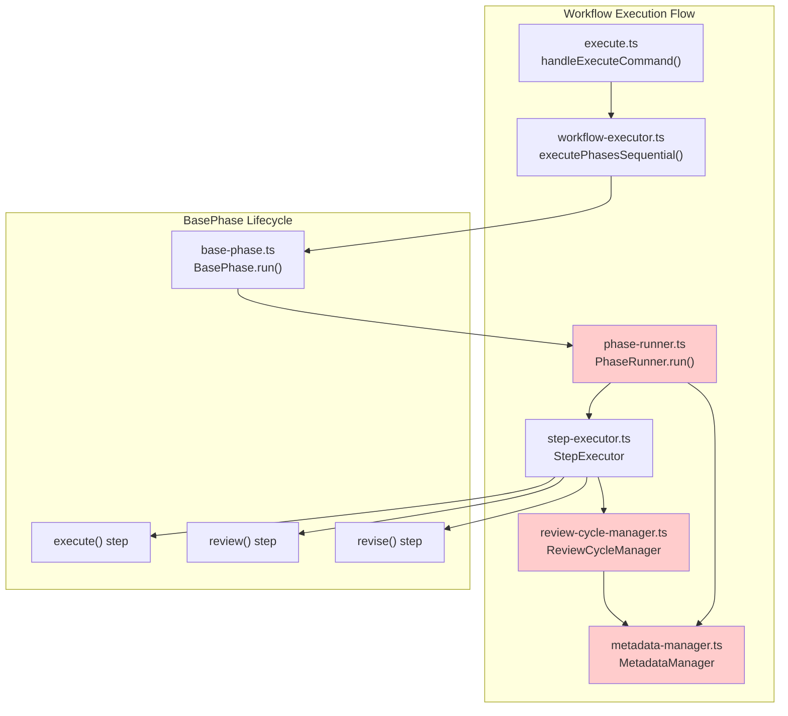
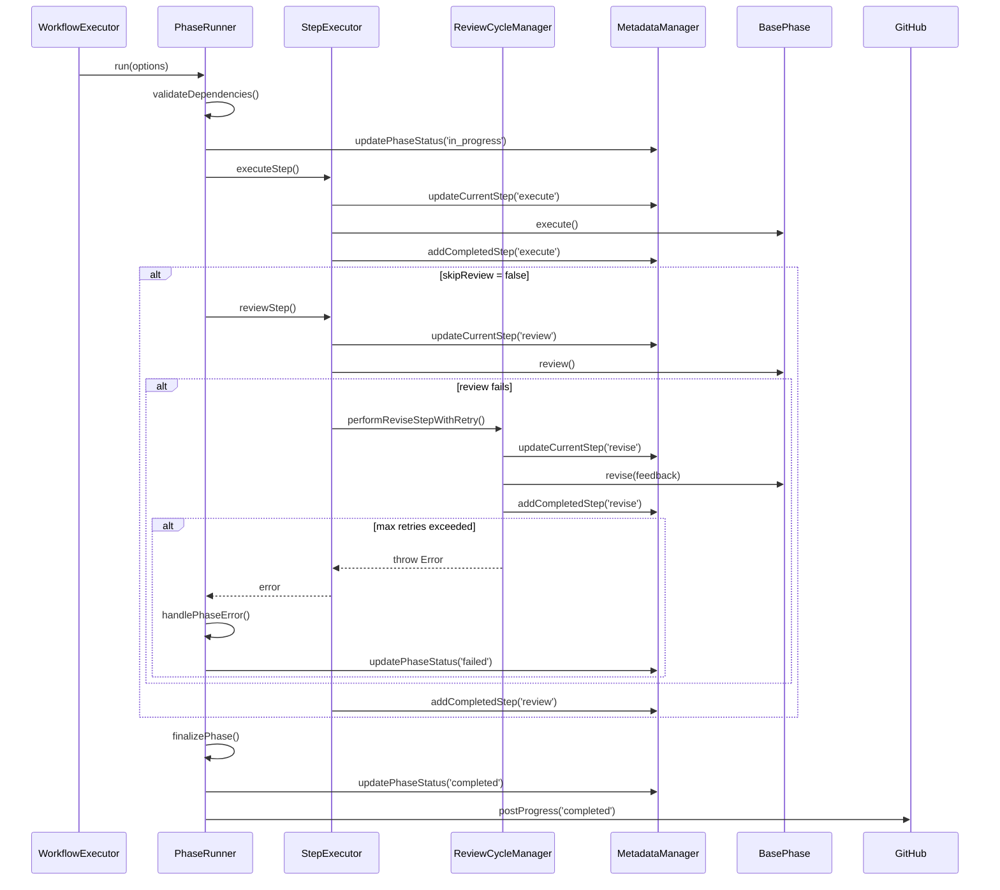

# 詳細設計書

## Issue概要

- **Issue番号**: #248
- **タイトル**: preset実行時にフェーズステータスがin_progressのまま完了しない
- **状態**: open
- **URL**: https://github.com/tielec/ai-workflow-agent/issues/248
- **作成日**: 2025-01-30

## 1. 概要

本設計書は、preset実行時にフェーズステータスが `in_progress` のまま `completed` に更新されない問題を解決するための詳細設計を定義する。Planning Document（@.ai-workflow/issue-248/00_planning/output/planning.md）および要件定義書（@.ai-workflow/issue-248/01_requirements/output/requirements.md）の内容を基に、既存のフェーズ実行フロー（PhaseRunner、ReviewCycleManager、MetadataManager）を拡張する形で実装する。

## 2. 実装戦略判断

### 実装戦略: EXTEND

**判断根拠**:
- 既存のフェーズ実行フロー（PhaseRunner、ReviewCycleManager、MetadataManager）のエラーハンドリングとステータス更新ロジックを改善する形で修正が中心
- 新規ファイル・クラスの作成は不要
- 既存のワークフロー実行フローを維持しながら、以下を拡張：
  1. PhaseRunnerのエラーハンドリング強化（try-catch-finallyブロックの見直し）
  2. ReviewCycleManagerのステータス更新保証（例外スロー前のステータス更新）
  3. MetadataManagerの状態遷移バリデーション（不正遷移チェック、冪等性確保）
- 既存の依存関係を変更せず、後方互換性を維持

## 3. テスト戦略判断

### テスト戦略: UNIT_INTEGRATION

**判断根拠**:
- **ユニットテスト**: 個別のエラーハンドリングロジック、ステータス更新ロジックの検証
  - MetadataManager.updatePhaseStatus() の境界値テスト
  - PhaseRunner.finalizePhase() のエラーケーステスト
  - ステータス遷移バリデーションのテスト
- **統合テスト**: preset実行時のエンドツーエンド動作検証（最も重要）
  - preset `review-design` 正常実行シナリオ
  - design phase でのレビュー失敗シナリオ
  - revise中の例外発生シナリオ
- BDDテストは不要（ユーザーストーリーではなく内部バグ修正のため）

## 4. テストコード戦略判断

### テストコード戦略: BOTH_TEST

**判断根拠**:
- **既存テスト拡張（EXTEND_TEST）**:
  - `tests/integration/phase-runner.test.ts`（存在する場合）に preset 実行シナリオを追加
  - `tests/unit/metadata-manager.test.ts` にステータス遷移バリデーションを追加
- **新規テスト作成（CREATE_TEST）**:
  - `tests/integration/preset-workflow.test.ts` を新規作成
  - preset実行時の完了ステータス検証
  - エラー発生時のフェールバック検証

## 5. アーキテクチャ設計

### 5.1. システム全体図



### 5.2. コンポーネント間の関係

**主要コンポーネント**:

1. **PhaseRunner** (`src/phases/lifecycle/phase-runner.ts`)
   - フェーズライフサイクル全体の管理
   - 依存関係検証、エラーハンドリング、進捗投稿
   - **修正箇所**: try-catch-finallyブロックの見直し、`finalizePhase()` の追加

2. **StepExecutor** (`src/phases/lifecycle/step-executor.ts`)
   - execute/review/revise ステップの実行
   - completed_steps 管理、Git コミット＆プッシュ
   - **修正箇所**: なし（既存ロジックの確認のみ）

3. **ReviewCycleManager** (`src/phases/core/review-cycle-manager.ts`)
   - レビュー失敗時の自動修正（revise）とリトライ管理
   - **修正箇所**: 例外スロー前のステータス更新保証

4. **MetadataManager** (`src/core/metadata-manager.ts`)
   - metadata.json の CRUD、コスト集計、リトライ回数管理
   - **修正箇所**: ステータス遷移バリデーション、冪等性確保

### 5.3. データフロー



**重要なポイント**:
- **ステータス更新の確実性**: `finalizePhase()` が確実に呼ばれるよう、finally ブロックで保護
- **エラー時のステータス更新**: `handlePhaseError()` が確実に呼ばれるよう、catch ブロックで保護
- **ステータス遷移の整合性**: MetadataManager でステータス遷移をバリデーション

## 6. 影響範囲分析

### 6.1. 既存コードへの影響

#### 変更が必要なファイル（優先度順）

1. **src/phases/lifecycle/phase-runner.ts** (中程度の変更)
   - `run()` メソッドのtry-catch-finallyブロックの見直し
   - `finalizePhase()` メソッドの追加（ステータス更新保証）
   - `handlePhaseError()` の呼び出し確実性の向上
   - **影響範囲**: PhaseRunner クラス全体（約244行）
   - **変更行数**: 約30行（追加・修正）

2. **src/phases/core/review-cycle-manager.ts** (小規模な変更)
   - `performReviseStepWithRetry()` のエラー処理改善
   - 最大リトライ回数超過時のステータス更新保証
   - **影響範囲**: ReviewCycleManager クラス（約126行）
   - **変更行数**: 約10行（修正）

3. **src/core/metadata-manager.ts** (小規模な変更)
   - `updatePhaseStatus()` の冪等性確保
   - ステータス遷移バリデーションの追加
   - **影響範囲**: MetadataManager クラス（約509行）
   - **変更行数**: 約20行（追加）

4. **src/phases/base-phase.ts** (影響確認が必要)
   - `run()` メソッドのエラーハンドリング確認
   - cleanup処理の見直し
   - **影響範囲**: BasePhase クラス全体（約805行）
   - **変更行数**: 0行（確認のみ、修正不要と判断）

#### 調査が必要なファイル

- **src/commands/execute/workflow-executor.ts**: preset実行時の例外処理
- **src/core/phase-dependencies.ts**: preset定義の確認

### 6.2. 依存関係の変更

**変更なし**

新規の外部依存は追加しない。既存の依存関係も変更不要。

### 6.3. マイグレーション要否

**不要**

metadata.jsonのスキーマ変更は不要。既存のステータスフィールド（`in_progress`、`completed`、`failed`）を適切に設定するロジックの修正のみ。

## 7. 変更・追加ファイルリスト

### 7.1. 修正が必要な既存ファイル

| ファイルパス | 変更理由 | 変更規模 |
|------------|---------|---------|
| `src/phases/lifecycle/phase-runner.ts` | try-catch-finallyブロックの見直し、finalizePhase()追加 | 中 |
| `src/phases/core/review-cycle-manager.ts` | エラー処理改善、ステータス更新保証 | 小 |
| `src/core/metadata-manager.ts` | 冪等性確保、ステータス遷移バリデーション追加 | 小 |

### 7.2. 新規作成ファイル

| ファイルパス | 用途 | 優先度 |
|------------|------|-------|
| `tests/integration/preset-workflow.test.ts` | preset実行時のステータス検証 | 高 |

### 7.3. 削除が必要なファイル

**なし**

## 8. 詳細設計

### 8.1. PhaseRunnerの改善設計

#### 8.1.1. run() メソッドの改善

**現在の実装の問題点**:
```typescript
async run(options: PhaseRunOptions = {}): Promise<boolean> {
  // ...
  try {
    // Execute Step
    if (!completedSteps.includes('execute')) {
      // ...
    }

    // Review Step
    if (!options.skipReview) {
      // ...
    }

    // フェーズ完了 ← ここが実行されない場合がある
    this.updatePhaseStatus('completed');
    await this.postProgress('completed', `${this.phaseName} フェーズが完了しました。`);

    return true;
  } catch (error) {
    const message = getErrorMessage(error);
    await this.handleFailure(message); // ← ここで例外が再スローされない保証がない
    return false;
  }
  // ← finally ブロックがない
}
```

**改善後の設計**:
```typescript
async run(options: PhaseRunOptions = {}): Promise<boolean> {
  const gitManager = options.gitManager ?? null;
  let executionSuccess = false;

  // 依存関係検証
  const dependencyResult = this.validateDependencies();
  if (!dependencyResult.valid) {
    const error = dependencyResult.error ?? 'Dependency validation failed.';
    logger.error(`${error}`);
    await this.handlePhaseError(error);
    return false;
  }

  if (dependencyResult.warning) {
    logger.warn(`${dependencyResult.warning}`);
  }

  // フェーズステータスの初期化
  const currentStatus = this.metadata.getPhaseStatus(this.phaseName);
  const currentStep = this.metadata.getCurrentStep(this.phaseName);
  const completedSteps = this.metadata.getCompletedSteps(this.phaseName);

  if (currentStatus === 'pending') {
    this.metadata.updatePhaseStatus(this.phaseName, 'in_progress');
    await this.postProgress('in_progress', `${this.phaseName} フェーズを開始します。`);
  } else if (currentStatus === 'in_progress') {
    logger.info(`Phase ${this.phaseName} resuming from step: ${currentStep ?? 'execute'}`);
    await this.postProgress('in_progress', `${this.phaseName} フェーズを再開します (step: ${currentStep ?? 'execute'})。`);
  }

  try {
    // Execute Step
    if (!completedSteps.includes('execute')) {
      logger.info(`Phase ${this.phaseName}: executing 'execute' step`);
      const executeResult = await this.stepExecutor.executeStep(gitManager);
      if (!executeResult.success) {
        await this.handlePhaseError(executeResult.error ?? 'Unknown execute error');
        return false;
      }
    } else {
      logger.info(`Phase ${this.phaseName}: skipping 'execute' step (already completed)`);
    }

    // Review Step
    if (!options.skipReview) {
      if (!completedSteps.includes('review')) {
        logger.info(`Phase ${this.phaseName}: executing 'review' step`);
        const reviewResult = await this.stepExecutor.reviewStep(gitManager, false);
        if (!reviewResult.success) {
          // Revise Step
          if (!this.reviseFn) {
            logger.error(`Phase ${this.phaseName}: revise() method not implemented.`);
            await this.handlePhaseError('revise() method not implemented');
            return false;
          }

          logger.info(`Phase ${this.phaseName}: executing 'revise' step`);
          await this.stepExecutor.reviseStep(
            gitManager,
            reviewResult,
            this.reviseFn,
            async (status: PhaseStatus, details?: string) => this.postProgress(status, details)
          );
        }
      } else {
        logger.info(`Phase ${this.phaseName}: skipping 'review' step (already completed)`);

        // Review は完了済みだが、current_step が 'revise' の場合（ロールバック）
        if (currentStep === 'revise') {
          if (!this.reviseFn) {
            logger.error(`Phase ${this.phaseName}: revise() method not implemented.`);
            await this.handlePhaseError('revise() method not implemented');
            return false;
          }

          logger.info(`Phase ${this.phaseName}: executing 'revise' step (rollback)`);
          const reviewResult = { success: false, review_status: 'FAIL', feedback: 'Rollback triggered', needs_revision: true };
          await this.stepExecutor.reviseStep(
            gitManager,
            reviewResult,
            this.reviseFn,
            async (status: PhaseStatus, details?: string) => this.postProgress(status, details)
          );
        }
      }
    }

    // フェーズ完了
    executionSuccess = true;
    await this.finalizePhase();

    return true;
  } catch (error) {
    const message = getErrorMessage(error);
    logger.error(`Phase ${this.phaseName}: Execution failed: ${message}`);
    await this.handlePhaseError(message);
    return false;
  } finally {
    // finally ブロックでステータス更新を保証
    await this.ensurePhaseStatusUpdated(executionSuccess);
  }
}
```

#### 8.1.2. finalizePhase() メソッドの追加

**目的**: フェーズ完了時のステータス更新を確実に実行する

```typescript
/**
 * フェーズ完了処理
 *
 * フェーズが正常に完了した場合、ステータスを 'completed' に更新し、
 * 進捗状況を GitHub Issue に投稿する。
 *
 * @private
 */
private async finalizePhase(): Promise<void> {
  try {
    this.metadata.updatePhaseStatus(this.phaseName, 'completed');
    logger.info(`Phase ${this.phaseName}: Status updated to 'completed'`);

    await this.postProgress('completed', `${this.phaseName} フェーズが完了しました。`);
  } catch (error) {
    const message = getErrorMessage(error);
    logger.error(`Phase ${this.phaseName}: Failed to finalize phase: ${message}`);
    // finalizePhase() 自体の例外は握りつぶす（ステータス更新は成功しているはず）
  }
}
```

#### 8.1.3. ensurePhaseStatusUpdated() メソッドの追加

**目的**: finally ブロックでステータス更新漏れを検出する

```typescript
/**
 * フェーズステータス更新の確実性を保証
 *
 * finally ブロックで呼び出され、ステータスが in_progress のままでないかチェックする。
 * ステータス更新漏れを検出した場合は ERROR ログを出力する。
 *
 * @param executionSuccess - 実行が成功したかどうか
 * @private
 */
private async ensurePhaseStatusUpdated(executionSuccess: boolean): Promise<void> {
  try {
    const currentStatus = this.metadata.getPhaseStatus(this.phaseName);

    if (currentStatus === 'in_progress') {
      logger.error(
        `Phase ${this.phaseName}: Status is still 'in_progress' after execution. ` +
        `Expected: ${executionSuccess ? 'completed' : 'failed'}`
      );

      // ステータス更新漏れを自動修正
      if (executionSuccess) {
        this.metadata.updatePhaseStatus(this.phaseName, 'completed');
        logger.warn(`Phase ${this.phaseName}: Auto-corrected status to 'completed'`);
      } else {
        this.metadata.updatePhaseStatus(this.phaseName, 'failed');
        logger.warn(`Phase ${this.phaseName}: Auto-corrected status to 'failed'`);
      }
    }
  } catch (error) {
    const message = getErrorMessage(error);
    logger.error(`Phase ${this.phaseName}: Failed to ensure status updated: ${message}`);
    // finally ブロック内の例外は握りつぶす
  }
}
```

#### 8.1.4. handlePhaseError() メソッドの追加

**目的**: `handleFailure()` を `handlePhaseError()` にリネームし、エラーハンドリングを強化

```typescript
/**
 * フェーズエラー処理
 *
 * フェーズ実行中にエラーが発生した場合、ステータスを 'failed' に更新し、
 * 進捗状況を GitHub Issue に投稿する。
 *
 * @param reason - エラー理由
 * @private
 */
private async handlePhaseError(reason: string): Promise<void> {
  try {
    this.metadata.updatePhaseStatus(this.phaseName, 'failed');
    logger.info(`Phase ${this.phaseName}: Status updated to 'failed'`);

    await this.postProgress(
      'failed',
      `${this.phaseName} フェーズでエラーが発生しました: ${reason}`
    );
  } catch (error) {
    const message = getErrorMessage(error);
    logger.error(`Phase ${this.phaseName}: Failed to handle phase error: ${message}`);
    // handlePhaseError() 自体の例外は握りつぶす（ログのみ出力）
  }
}
```

### 8.2. ReviewCycleManagerの改善設計

#### 8.2.1. performReviseStepWithRetry() の改善

**現在の実装の問題点**:
```typescript
async performReviseStepWithRetry(...): Promise<void> {
  // ...
  while (retryCount < this.maxRetries) {
    // ...
  }

  // Max retries reached
  logger.error(`Phase ${this.phaseName}: Max revise retries (${this.maxRetries}) reached`);
  throw new Error(`Review failed after ${this.maxRetries} revise attempts`);
  // ← この例外がスローされる前にステータスが更新されない
}
```

**改善後の設計**:
```typescript
async performReviseStepWithRetry(
  gitManager: GitManager | null,
  initialReviewResult: PhaseExecutionResult,
  reviewFn: () => Promise<PhaseExecutionResult>,
  reviseFn: (feedback: string) => Promise<PhaseExecutionResult>,
  postProgressFn: (status: PhaseStatus, details?: string) => Promise<void>,
  commitAndPushStepFn: (step: 'execute' | 'review' | 'revise') => Promise<void>,
): Promise<void> {
  const completedSteps = this.metadata.getCompletedSteps(this.phaseName);

  // reviseステップが既に完了している場合はスキップ
  if (completedSteps.includes('revise')) {
    logger.info(`Phase ${this.phaseName}: Skipping revise step (already completed)`);
    return;
  }

  let retryCount = 0;
  let reviewResult = initialReviewResult;

  while (retryCount < this.maxRetries) {
    logger.info(`Phase ${this.phaseName}: Starting revise step (attempt ${retryCount + 1}/${this.maxRetries})...`);
    this.metadata.updateCurrentStep(this.phaseName, 'revise');

    // Increment retry count in metadata
    const currentRetryCount = this.metadata.incrementRetryCount(this.phaseName);
    await postProgressFn(
      'in_progress',
      `レビュー不合格のため修正を実施します（${currentRetryCount}/${this.maxRetries}回目）。`,
    );

    const feedback = reviewResult.error ?? 'レビューで不合格となりました。';

    // Execute revise
    const reviseResult = await reviseFn(feedback);
    if (!reviseResult.success) {
      logger.error(`Phase ${this.phaseName}: Revise failed: ${reviseResult.error ?? 'Unknown error'}`);

      // NEW: revise失敗時もステータスを更新してから例外をスロー
      logger.error(`Phase ${this.phaseName}: Updating phase status to 'failed' before throwing exception`);
      this.metadata.updatePhaseStatus(this.phaseName, 'failed');
      await postProgressFn('failed', `修正処理（revise）でエラーが発生しました: ${reviseResult.error ?? 'Unknown error'}`);

      throw new Error(reviseResult.error ?? 'Revise failed');
    }

    logger.info(`Phase ${this.phaseName}: Revise completed successfully`);

    // Commit & Push after revise (Issue #10)
    await commitAndPushStepFn('revise');

    this.metadata.addCompletedStep(this.phaseName, 'revise');

    // Re-run review after revise
    logger.info(`Phase ${this.phaseName}: Re-running review after revise...`);
    reviewResult = await reviewFn();

    if (reviewResult.success) {
      logger.info(`Phase ${this.phaseName}: Review passed after revise`);

      // Mark review as completed
      this.metadata.addCompletedStep(this.phaseName, 'review');

      // Commit & Push after successful review (Issue #10)
      await commitAndPushStepFn('review');

      // Issue #90: revise完了後にrollback_contextをクリア
      const rollbackContext = this.metadata.getRollbackContext(this.phaseName);
      if (rollbackContext) {
        this.metadata.clearRollbackContext(this.phaseName);
        logger.info(`Rollback context cleared after revise completion for phase ${this.phaseName}`);
      }

      return;
    }

    logger.warn(`Phase ${this.phaseName}: Review still failed after revise (attempt ${retryCount + 1})`);

    // Clear revise from completed steps to allow retry
    const steps = this.metadata.getCompletedSteps(this.phaseName).filter(s => s !== 'revise');
    this.metadata.data.phases[this.phaseName].completed_steps = steps;

    retryCount++;
  }

  // Max retries reached
  logger.error(`Phase ${this.phaseName}: Max revise retries (${this.maxRetries}) reached`);

  // NEW: 最大リトライ回数超過時もステータスを更新してから例外をスロー
  logger.error(`Phase ${this.phaseName}: Updating phase status to 'failed' before throwing exception`);
  this.metadata.updatePhaseStatus(this.phaseName, 'failed');
  await postProgressFn('failed', `最大リトライ回数（${this.maxRetries}回）を超過しました。レビューが合格しませんでした。`);

  throw new Error(`Review failed after ${this.maxRetries} revise attempts`);
}
```

### 8.3. MetadataManagerの改善設計

#### 8.3.1. updatePhaseStatus() の冪等性確保

**現在の実装**:
```typescript
public updatePhaseStatus(
  phaseName: PhaseName,
  status: PhaseStatus,
  options: { outputFile?: string; reviewResult?: string } = {},
): void {
  this.state.updatePhaseStatus(phaseName, status);

  if (options.outputFile) {
    const phaseData = this.state.data.phases[phaseName];
    if (!phaseData.output_files) {
      phaseData.output_files = [];
    }
    phaseData.output_files.push(options.outputFile);
  }

  if (options.reviewResult) {
    this.state.data.phases[phaseName].review_result = options.reviewResult;
  }

  this.state.save();
}
```

**改善後の設計**:
```typescript
public updatePhaseStatus(
  phaseName: PhaseName,
  status: PhaseStatus,
  options: { outputFile?: string; reviewResult?: string } = {},
): void {
  const phaseData = this.state.data.phases[phaseName];
  const currentStatus = phaseData.status;

  // NEW: 冪等性チェック（同じステータスへの重複更新をスキップ）
  if (currentStatus === status) {
    logger.info(`Phase ${phaseName}: Status already set to '${status}', skipping update`);
    return;
  }

  // NEW: ステータス遷移バリデーション（不正な遷移を検出）
  this.validateStatusTransition(phaseName, currentStatus, status);

  // 既存のステータス更新処理
  this.state.updatePhaseStatus(phaseName, status);

  if (options.outputFile) {
    if (!phaseData.output_files) {
      phaseData.output_files = [];
    }
    phaseData.output_files.push(options.outputFile);
  }

  if (options.reviewResult) {
    phaseData.review_result = options.reviewResult;
  }

  this.state.save();

  logger.debug(`Phase ${phaseName}: Status updated from '${currentStatus}' to '${status}'`);
}
```

#### 8.3.2. validateStatusTransition() メソッドの追加

**目的**: ステータス遷移の整合性をチェックする

```typescript
/**
 * ステータス遷移のバリデーション
 *
 * 不正なステータス遷移を検出してログ出力する。
 * 不正な遷移でもステータス更新は実行される（エラーにはしない）。
 *
 * 許可される遷移:
 * - pending → in_progress
 * - in_progress → completed
 * - in_progress → failed
 *
 * 不正な遷移の例:
 * - completed → in_progress
 * - failed → in_progress
 * - pending → completed
 *
 * @param phaseName - フェーズ名
 * @param fromStatus - 遷移元のステータス
 * @param toStatus - 遷移先のステータス
 * @private
 */
private validateStatusTransition(
  phaseName: PhaseName,
  fromStatus: PhaseStatus,
  toStatus: PhaseStatus
): void {
  // 許可される遷移パターン
  const allowedTransitions: Record<PhaseStatus, PhaseStatus[]> = {
    pending: ['in_progress'],
    in_progress: ['completed', 'failed'],
    completed: [],  // completed からの遷移は通常許可されない
    failed: [],     // failed からの遷移は通常許可されない
  };

  const allowed = allowedTransitions[fromStatus];
  if (!allowed || !allowed.includes(toStatus)) {
    logger.warn(
      `Phase ${phaseName}: Invalid status transition detected: ` +
      `${fromStatus} -> ${toStatus}. ` +
      `Allowed transitions from '${fromStatus}': [${(allowed ?? []).join(', ')}]`
    );
  }
}
```

## 9. セキュリティ考慮事項

### 9.1. 認証・認可

**影響なし**

本Issue は内部バグ修正のため、認証・認可に関する変更はない。

### 9.2. データ保護

**影響なし**

metadata.json の既存フィールドのみを使用し、新規フィールドの追加はない。

### 9.3. セキュリティリスクと対策

**リスク**: なし

エラーハンドリングとステータス管理の改善のみであり、セキュリティリスクは発生しない。

## 10. 非機能要件への対応

### 10.1. パフォーマンス

- **メタデータ更新の応答時間**: 100ms 以内（通常のSSD環境）
  - 冪等性チェックにより、不要な更新をスキップすることでパフォーマンスを向上
- **ステータス遷移バリデーション**: 追加オーバーヘッド < 10ms
  - 単純な辞書ルックアップのため、オーバーヘッドは最小限
- **ログ出力**: 非同期ログ機構により実行速度への影響を最小化
  - 既存のロガー（`src/utils/logger.ts`）を使用

### 10.2. スケーラビリティ

**影響なし**

本Issue は単一ワークフロー実行を対象としており、並行実行やスケーラビリティには影響しない。

### 10.3. 保守性

- **既存コードへの影響**: 最小限（EXTEND 戦略）
  - PhaseRunner、ReviewCycleManager、MetadataManager の既存設計を維持
  - 新規メソッド追加のみで、既存メソッドのシグネチャ変更なし
- **テストカバレッジ**: 変更部分のコードカバレッジ 80% 以上
  - 新規追加メソッドのユニットテストを作成
  - preset実行の統合テストを追加
- **ログの可読性**: ステータス遷移のログが明確で、トラブルシューティングが容易
  - `logger.info()`, `logger.warn()`, `logger.error()` を適切に使い分け

## 11. 実装の順序

本設計では、以下の順序で実装を進めることを推奨する：

### Phase 1: MetadataManager の改善（優先度: 高）

1. `validateStatusTransition()` メソッドの実装
2. `updatePhaseStatus()` の冪等性チェック追加
3. ユニットテスト作成（`tests/unit/metadata-manager.test.ts`）

**理由**: ステータス管理の基盤を先に整備することで、後続の実装が安全になる。

### Phase 2: PhaseRunner の改善（優先度: 高）

1. `finalizePhase()` メソッドの実装
2. `ensurePhaseStatusUpdated()` メソッドの実装
3. `handlePhaseError()` メソッドの実装
4. `run()` メソッドのtry-catch-finallyブロック見直し
5. ユニットテスト作成（`tests/unit/phase-runner.test.ts`）

**理由**: PhaseRunner はフェーズ実行の中核であり、ステータス更新の最終責任を持つ。

### Phase 3: ReviewCycleManager の改善（優先度: 中）

1. `performReviseStepWithRetry()` のエラー処理改善
2. 例外スロー前のステータス更新処理追加
3. ユニットテスト作成（`tests/unit/review-cycle-manager.test.ts`）

**理由**: レビューサイクルのエラーハンドリングを強化することで、revise失敗時のステータス更新を保証する。

### Phase 4: 統合テスト（優先度: 高）

1. `tests/integration/preset-workflow.test.ts` の作成
2. preset `review-design` の正常系テスト
3. design phase でのレビュー失敗シナリオテスト
4. revise中の例外発生シナリオテスト

**理由**: エンドツーエンドの動作検証により、すべての変更が正しく統合されていることを確認する。

### Phase 5: ドキュメント更新（優先度: 低）

1. ARCHITECTURE.md にステータス管理フローを追記
2. TROUBLESHOOTING.md にステータス不整合時の対処法を追記

**理由**: 実装完了後、運用時のトラブルシューティングガイドを整備する。

## 12. テストシナリオ

### 12.1. ユニットテスト

#### 12.1.1. MetadataManager.updatePhaseStatus()

**テストケース1: 冪等性チェック**
```typescript
it('should skip update when status is already set', () => {
  metadata.updatePhaseStatus('design', 'completed');
  metadata.updatePhaseStatus('design', 'completed'); // 重複更新

  // ログに「Status already set to 'completed', skipping update」が出力される
  // metadata.json への書き込みは1回のみ
});
```

**テストケース2: ステータス遷移バリデーション**
```typescript
it('should log warning for invalid transition: completed -> in_progress', () => {
  metadata.updatePhaseStatus('design', 'completed');
  metadata.updatePhaseStatus('design', 'in_progress'); // 不正な遷移

  // WARNING ログが出力される
  // ステータスは in_progress に更新される（エラーにはならない）
});

it('should allow valid transition: in_progress -> completed', () => {
  metadata.updatePhaseStatus('design', 'in_progress');
  metadata.updatePhaseStatus('design', 'completed'); // 正常な遷移

  // ログに警告は出力されない
  // ステータスは completed に更新される
});
```

#### 12.1.2. PhaseRunner.finalizePhase()

**テストケース1: 正常系**
```typescript
it('should update status to completed and post progress', async () => {
  await phaseRunner.finalizePhase();

  expect(metadata.getPhaseStatus('design')).toBe('completed');
  expect(github.createOrUpdateProgressComment).toHaveBeenCalledWith(
    expect.any(Number),
    expect.stringContaining('design フェーズが完了しました'),
    expect.any(Object)
  );
});
```

**テストケース2: 例外発生時**
```typescript
it('should not throw exception even if postProgress fails', async () => {
  jest.spyOn(github, 'createOrUpdateProgressComment').mockRejectedValue(new Error('Network error'));

  await expect(phaseRunner.finalizePhase()).resolves.not.toThrow();

  // ステータス更新は成功している
  expect(metadata.getPhaseStatus('design')).toBe('completed');
});
```

#### 12.1.3. PhaseRunner.ensurePhaseStatusUpdated()

**テストケース1: ステータス更新漏れ検出**
```typescript
it('should auto-correct status if still in_progress after success', async () => {
  // ステータスを in_progress のまま放置
  metadata.updatePhaseStatus('design', 'in_progress');

  await phaseRunner.ensurePhaseStatusUpdated(true);

  // ERROR ログが出力される
  // ステータスが completed に自動修正される
  expect(metadata.getPhaseStatus('design')).toBe('completed');
});

it('should auto-correct status if still in_progress after failure', async () => {
  metadata.updatePhaseStatus('design', 'in_progress');

  await phaseRunner.ensurePhaseStatusUpdated(false);

  // ERROR ログが出力される
  // ステータスが failed に自動修正される
  expect(metadata.getPhaseStatus('design')).toBe('failed');
});
```

### 12.2. 統合テスト

#### 12.2.1. preset `review-design` 正常実行シナリオ

```typescript
describe('Preset workflow: review-design', () => {
  it('should complete all phases with status "completed"', async () => {
    // preset `review-design` を実行
    await executePreset('review-design', issueNumber);

    // すべてのフェーズが completed になることを確認
    expect(metadata.getPhaseStatus('planning')).toBe('completed');
    expect(metadata.getPhaseStatus('requirements')).toBe('completed');
    expect(metadata.getPhaseStatus('design')).toBe('completed');
  });
});
```

#### 12.2.2. design phase でのレビュー失敗シナリオ

```typescript
describe('Preset workflow: review-design with review failure', () => {
  it('should update status to "failed" after max retries', async () => {
    // review を常に FAIL にするモックを設定
    jest.spyOn(designPhase, 'review').mockResolvedValue({
      success: false,
      review_status: 'FAIL',
      feedback: 'Design is incomplete',
      needs_revision: true
    });

    // preset `review-design` を実行
    await executePreset('review-design', issueNumber);

    // design フェーズが failed になることを確認
    expect(metadata.getPhaseStatus('design')).toBe('failed');

    // retry_count が 3 になることを確認
    expect(metadata.data.phases.design.retry_count).toBe(3);
  });
});
```

#### 12.2.3. revise中の例外発生シナリオ

```typescript
describe('Preset workflow: revise step exception handling', () => {
  it('should update status to "failed" when revise throws exception', async () => {
    // review を FAIL にするモックを設定
    jest.spyOn(designPhase, 'review').mockResolvedValue({
      success: false,
      review_status: 'FAIL',
      feedback: 'Design is incomplete',
      needs_revision: true
    });

    // revise で例外をスローするモックを設定
    jest.spyOn(designPhase, 'revise').mockRejectedValue(new Error('Revise failed'));

    // preset `review-design` を実行
    await executePreset('review-design', issueNumber);

    // design フェーズが failed になることを確認
    expect(metadata.getPhaseStatus('design')).toBe('failed');
  });
});
```

## 13. 品質ゲート（Phase 2: Design）

本設計書は以下の品質ゲートを満たす：

- [x] **実装戦略の判断根拠が明記されている** → セクション2で「EXTEND」戦略を選択し、3つの判断根拠を記載
- [x] **テスト戦略の判断根拠が明記されている** → セクション3で「UNIT_INTEGRATION」戦略を選択し、理由を記載
- [x] **既存コードへの影響範囲が分析されている** → セクション6で4つのファイルの影響を分析
- [x] **変更が必要なファイルがリストアップされている** → セクション7でテーブル形式で整理
- [x] **設計が実装可能である** → セクション8で詳細なクラス設計・関数設計を記載

## 14. 参考情報

- **Planning Document**: @.ai-workflow/issue-248/00_planning/output/planning.md
- **要件定義書**: @.ai-workflow/issue-248/01_requirements/output/requirements.md
- **Issue #243**: レビュー結果がFAILでもreviseが実行されず後続フェーズに進んでしまうバグ
- **Issue #245**: preset実行時にContextBuilderの相対パス解決がWORKSPACEを基準に計算される
- **@CLAUDE.md**: プロジェクト全体方針、コーディング規約
- **@ARCHITECTURE.md**: Phase実行フロー、メタデータ管理アーキテクチャ
- **src/phases/lifecycle/phase-runner.ts**: フェーズライフサイクル管理（244行）
- **src/phases/core/review-cycle-manager.ts**: レビューサイクル管理（126行）
- **src/core/metadata-manager.ts**: メタデータ状態管理（509行）
- **src/phases/base-phase.ts**: フェーズ基底クラス（805行）

---

**設計書バージョン**: 1.0
**作成日**: 2025-01-30
**Planning Document参照**: @.ai-workflow/issue-248/00_planning/output/planning.md
**Requirements Document参照**: @.ai-workflow/issue-248/01_requirements/output/requirements.md
