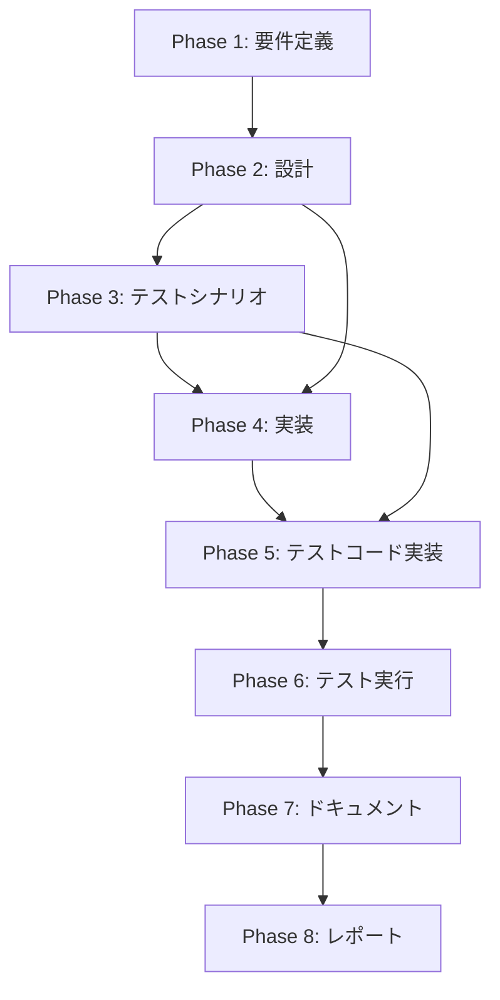

# Claude Agent 実行ログ

生成日時: 2025/10/21 13:54:10

---

## Turn 1: システム初期化

**セッションID**: `c3635217-1e71-4d3a-a5e4-480a0279f5cb`
**モデル**: claude-sonnet-4-5-20250929
**権限モード**: bypassPermissions
**利用可能ツール**: Task, Bash, Glob, Grep, ExitPlanMode, Read, Edit, Write, NotebookEdit, WebFetch, TodoWrite, WebSearch, BashOutput, KillShell, Skill, SlashCommand

## Turn 2: AI応答

以下、GitHub Issue #25 に基づいたプロジェクト計画書を作成します。

---

# プロジェクト計画書 - Issue #25: Git Manager の操作別分割

## 1. Issue分析

### 複雑度
**中程度**

### 見積もり工数
**12~16時間**

### 判断根拠
- **現状**: `git-manager.ts` が548行の単一ファイルで、コミット・ブランチ・リモート操作が混在
- **作業内容**:
  - 3つの新規マネージャークラスの作成（各200行以下）
  - ファサードパターンによる既存インターフェース維持
  - simple-gitインスタンスの共有設計
  - 統合テスト・マルチリポジトリワークフローの検証
- **ファイル数**: 新規3ファイル + 既存1ファイル変更
- **テスト要件**: 既存の統合テストがすべてパスする必要がある（後方互換性）
- **リスク**: 既存のGit操作に依存する全モジュールへの影響範囲が広い

### リスク評価
**中**

- Git操作は全フェーズで使用されるため、影響範囲が広い
- ファサードパターンにより後方互換性は維持しやすいが、統合テストの網羅性が重要
- simple-gitインスタンスの共有方法により、作業ディレクトリ管理の一貫性が損なわれるリスク

---

## 2. 実装戦略判断

### 実装戦略: **REFACTOR**

#### 判断根拠
- 既存の `git-manager.ts` を操作種別ごとに分割し、責務を明確化
- 新規機能追加ではなく、既存コードの構造改善が目的
- ファサードパターンにより既存インターフェースを維持（CREATE + REFACTORのハイブリッドだが、主目的はREFACTOR）
- 既存の統合テストがすべてパスすることが品質ゲート

### テスト戦略: **UNIT_INTEGRATION**

#### 判断根拠
- **UNIT**: 各マネージャー（commit/branch/remote）の独立した動作を検証
  - simple-gitのモック化により、Git操作のロジックを単体テスト
  - エラーハンドリング、リトライロジックの検証
- **INTEGRATION**: 実際のGitリポジトリを用いた統合テスト
  - マルチリポジトリワークフローの動作確認（Issue #1関連）
  - ファサード経由での後方互換性検証
  - 既存の統合テストがすべてパスすることを確認
- **BDDは不要**: エンドユーザー向け機能ではなく、内部リファクタリング

### テストコード戦略: **BOTH_TEST**

#### 判断根拠
- **CREATE_TEST**: 新規マネージャークラス用のユニットテスト作成
  - `tests/unit/git/commit-manager.test.ts`
  - `tests/unit/git/branch-manager.test.ts`
  - `tests/unit/git/remote-manager.test.ts`
- **EXTEND_TEST**: 既存の統合テストを維持・拡張
  - `tests/integration/git-manager.test.ts` の既存テストは維持
  - ファサード経由での後方互換性テストを追加
  - マルチリポジトリワークフローテストの拡張

---

## 3. 影響範囲分析

### 既存コードへの影響

#### 直接的な変更ファイル
- `src/core/git-manager.ts` (548行 → 約150行に削減、ファサードとして再実装)

#### 新規作成ファイル
- `src/core/git/commit-manager.ts` (目標: 200行以下)
- `src/core/git/branch-manager.ts` (目標: 200行以下)
- `src/core/git/remote-manager.ts` (目標: 200行以下)

#### 依存モジュール（変更不要、インターフェース維持により影響なし）
- `src/phases/base-phase.ts` - フェーズごとのGitコミット・プッシュ
- `src/commands/init.ts` - ブランチ作成・切り替え
- `src/commands/execute.ts` - メタデータ同期、リモート操作
- `src/core/metadata-manager.ts` - Git操作の利用者

### 依存関係の変更

#### 新規依存
- なし（既存の `simple-git` を継続使用）

#### 既存依存の変更
- なし（simple-gitのインスタンス共有方法を内部で変更するが、外部インターフェースは不変）

### マイグレーション要否
- **不要**
  - ファサードパターンにより既存インターフェースを完全に維持
  - 呼び出し元のコード変更は不要
  - 設定ファイル、環境変数、データベースへの影響なし

---

## 4. タスク分割

### Phase 1: 要件定義 (見積もり: 1~2h)

- [ ] Task 1-1: 既存git-manager.tsの責務整理 (0.5~1h)
  - 現在のメソッドをコミット/ブランチ/リモート操作に分類
  - 各操作の入力・出力・エラーハンドリングを整理
  - simple-gitインスタンスの使用方法を調査
- [ ] Task 1-2: ファサードパターンの要件定義 (0.5~1h)
  - 既存インターフェースの一覧作成（後方互換性の基準）
  - 各マネージャーの責務範囲を明確化
  - simple-gitインスタンスの共有方法を設計（DI or shared singleton）

### Phase 2: 設計 (見積もり: 2~3h)

- [ ] Task 2-1: 各マネージャーのインターフェース設計 (1~1.5h)
  - CommitManager: commit(), push(), ensureCleanTree() 等
  - BranchManager: createBranch(), switchBranch(), deleteBranch() 等
  - RemoteManager: pull(), push(), fetch(), syncMetadata() 等
  - 各メソッドのシグネチャ、返り値、エラー型を定義
- [ ] Task 2-2: ファサードクラスの設計 (0.5~1h)
  - GitManager ファサードの構造設計
  - 各マネージャーのインスタンス化方法（DI or lazy initialization）
  - 既存メソッドと新マネージャーのマッピング
- [ ] Task 2-3: simple-git共有方式の設計 (0.5h)
  - コンストラクタ注入 vs ファクトリパターンの比較
  - 作業ディレクトリ管理の一貫性を保つ方法

### Phase 3: テストシナリオ (見積もり: 1.5~2h)

- [ ] Task 3-1: ユニットテストシナリオ作成 (1~1.5h)
  - CommitManager: コミット作成、プッシュ、クリーンツリー検証
  - BranchManager: ブランチ作成、切り替え、削除、バリデーション
  - RemoteManager: pull、push、fetch、競合検出
  - simple-gitモックの設計（エラーケース含む）
- [ ] Task 3-2: 統合テストシナリオ作成 (0.5h)
  - 既存の統合テストの棚卸し
  - ファサード経由での後方互換性テストシナリオ
  - マルチリポジトリワークフローテストの拡張シナリオ

### Phase 4: 実装 (見積もり: 4~6h)

- [ ] Task 4-1: CommitManager の実装 (1~1.5h)
  - コミット作成ロジック（メッセージフォーマット）
  - プッシュロジック（リモート存在確認）
  - クリーンツリー検証ロジック
- [ ] Task 4-2: BranchManager の実装 (1~1.5h)
  - ブランチ作成・切り替え・削除ロジック
  - ブランチバリデーション（Git命名規則）
  - リモートブランチの存在確認
- [ ] Task 4-3: RemoteManager の実装 (1~1.5h)
  - pull、push、fetchロジック
  - メタデータ同期ロジック（CI環境対応）
  - リモート競合検出・エラーハンドリング
- [ ] Task 4-4: GitManager ファサードの実装 (0.5~1h)
  - 各マネージャーのインスタンス化
  - 既存メソッドの委譲実装
  - simple-gitインスタンス共有の実装

### Phase 5: テストコード実装 (見積もり: 2~3h)

- [ ] Task 5-1: CommitManager ユニットテスト (0.5~1h)
  - モックによるcommit/pushの正常系テスト
  - エラーケース（リモートなし、競合等）
- [ ] Task 5-2: BranchManager ユニットテスト (0.5~1h)
  - ブランチ操作の正常系テスト
  - バリデーションエラーケース
- [ ] Task 5-3: RemoteManager ユニットテスト (0.5~1h)
  - リモート操作の正常系テスト
  - 競合検出、メタデータ同期のテスト
- [ ] Task 5-4: ファサード統合テスト拡張 (0.5h)
  - 既存の統合テストの実行確認
  - 後方互換性テストの追加

### Phase 6: テスト実行 (見積もり: 1h)

- [ ] Task 6-1: ユニットテスト実行 (0.5h)
  - `npm run test:unit` 実行
  - カバレッジ確認（各マネージャー80%以上）
- [ ] Task 6-2: 統合テスト実行 (0.5h)
  - `npm run test:integration` 実行
  - マルチリポジトリワークフローの動作確認
  - 既存テストがすべてパスすることを確認

### Phase 7: ドキュメント (見積もり: 0.5~1h)

- [ ] Task 7-1: CLAUDE.mdの更新 (0.25h)
  - Git Manager のモジュール構成を追記
  - 各マネージャーの責務範囲を記載
- [ ] Task 7-2: ARCHITECTURE.mdの更新 (0.25h)
  - Git操作のアーキテクチャ図を更新
  - ファサードパターンの設計意図を記載

### Phase 8: レポート (見積もり: 0.5h)

- [ ] Task 8-1: リファクタリング成果のまとめ (0.25h)
  - 行数削減の定量評価（548行 → 各200行以下）
  - テストカバレッジの報告
- [ ] Task 8-2: PR作成 (0.25h)
  - 変更内容のサマリー
  - 後方互換性維持の確認結果

---

## 5. 依存関係

**クリティカルパス**: P1 → P2 → P4 → P5 → P6 → P7 → P8

**並行実行可能な作業**:
- Phase 2完了後、Phase 3（テストシナリオ）とPhase 4（実装）の一部タスクを並行可能
- Phase 4完了後、Phase 5（テストコード実装）とPhase 7（ドキュメント）の一部を並行可能

---

## 6. リスクと軽減策

### リスク1: 既存の統合テストが失敗する
- **影響度**: 高（リリースブロッカー）
- **確率**: 中
- **軽減策**:
  - Phase 2で既存インターフェースを完全にマッピング
  - Phase 5で既存の統合テストを最優先で実行
  - ファサードパターンにより既存コードを変更せずインターフェース維持

### リスク2: simple-gitインスタンス共有により作業ディレクトリ管理が不整合
- **影響度**: 高（マルチリポジトリワークフロー破綻）
- **確率**: 中
- **軽減策**:
  - Phase 2でsimple-git共有方式を慎重に設計（DI推奨）
  - Phase 3でマルチリポジトリシナリオを重点的にテスト
  - Phase 6で既存のマルチリポジトリ統合テストを必ず実行

### リスク3: 各マネージャーが200行を超える
- **影響度**: 中（Issue目標未達）
- **確率**: 低
- **軽減策**:
  - Phase 1で責務範囲を明確に分割
  - Phase 4で実装中に行数をモニタリング
  - 必要に応じてヘルパー関数を別モジュールに切り出し

### リスク4: ファサードクラスが肥大化
- **影響度**: 低（目標は達成するが、コード品質低下）
- **確率**: 中
- **軽減策**:
  - ファサードは単純な委譲のみ実装（ロジックを含めない）
  - 複雑な処理は各マネージャーに委譲
  - Phase 2で設計レビュー時に確認

---

## 7. 品質ゲート

### Phase 1: 要件定義
- [ ] 既存git-manager.tsの全メソッドが分類されている（コミット/ブランチ/リモート）
- [ ] ファサードパターンの要件が明確に定義されている（後方互換性の基準）
- [ ] simple-gitインスタンスの共有方法が決定されている

### Phase 2: 設計
- [ ] 実装戦略の判断根拠が明記されている（REFACTOR）
- [ ] テスト戦略の判断根拠が明記されている（UNIT_INTEGRATION）
- [ ] 各マネージャーのインターフェースが定義されている（シグネチャ、返り値、エラー型）
- [ ] ファサードクラスの構造が設計されている
- [ ] simple-git共有方式が設計されている（DI or ファクトリ）

### Phase 3: テストシナリオ
- [ ] 各マネージャーのユニットテストシナリオが作成されている
- [ ] 統合テストシナリオ（ファサード経由）が作成されている
- [ ] マルチリポジトリワークフローのテストシナリオが含まれている
- [ ] エラーケースのテストシナリオが網羅されている

### Phase 4: 実装
- [ ] CommitManager が実装され、200行以下である
- [ ] BranchManager が実装され、200行以下である
- [ ] RemoteManager が実装され、200行以下である
- [ ] GitManager ファサードが実装され、既存インターフェースを維持している
- [ ] simple-gitインスタンスが適切に共有されている

### Phase 5: テストコード実装
- [ ] 各マネージャーのユニットテストが実装されている
- [ ] ファサード統合テストが実装されている
- [ ] 既存の統合テストが維持されている

### Phase 6: テスト実行
- [ ] すべてのユニットテストがパスしている
- [ ] すべての統合テストがパスしている（既存テスト含む）
- [ ] マルチリポジトリワークフローが正常動作している
- [ ] テストカバレッジが80%以上である

### Phase 7: ドキュメント
- [ ] CLAUDE.mdが更新されている（Git Managerのモジュール構成）
- [ ] ARCHITECTURE.mdが更新されている（ファサードパターンの設計意図）

### Phase 8: レポート
- [ ] リファクタリング成果が定量評価されている（行数削減、カバレッジ）
- [ ] 後方互換性維持が確認されている
- [ ] PRが作成されている

---

## 8. 補足事項

### ファサードパターンの設計指針
- **既存インターフェースの完全維持**: 呼び出し元のコード変更を一切不要にする
- **単純な委譲**: ファサード内にロジックを含めず、各マネージャーに委譲
- **依存性注入**: simple-gitインスタンスはコンストラクタ注入を推奨

### テスト優先度
1. **最優先**: 既存の統合テストがすべてパスすること（後方互換性）
2. **高優先**: マルチリポジトリワークフローの動作確認
3. **中優先**: 各マネージャーのユニットテスト（カバレッジ80%以上）

### 成功基準
- [ ] 各マネージャーが200行以下
- [ ] 既存の統合テストがすべてパス
- [ ] マルチリポジトリワークフローが正常動作
- [ ] ファサードが後方互換性を維持
- [ ] テストカバレッジ80%以上

---

以上のプロジェクト計画書に基づき、Phase 1から順次実行してください。

## Turn 3: 実行完了

**ステータス**: success
**所要時間**: 84912ms
**ターン数**: 4

以下、GitHub Issue #25 に基づいたプロジェクト計画書を作成します。

---

# プロジェクト計画書 - Issue #25: Git Manager の操作別分割

## 1. Issue分析

### 複雑度
**中程度**

### 見積もり工数
**12~16時間**

### 判断根拠
- **現状**: `git-manager.ts` が548行の単一ファイルで、コミット・ブランチ・リモート操作が混在
- **作業内容**:
  - 3つの新規マネージャークラスの作成（各200行以下）
  - ファサードパターンによる既存インターフェース維持
  - simple-gitインスタンスの共有設計
  - 統合テスト・マルチリポジトリワークフローの検証
- **ファイル数**: 新規3ファイル + 既存1ファイル変更
- **テスト要件**: 既存の統合テストがすべてパスする必要がある（後方互換性）
- **リスク**: 既存のGit操作に依存する全モジュールへの影響範囲が広い

### リスク評価
**中**

- Git操作は全フェーズで使用されるため、影響範囲が広い
- ファサードパターンにより後方互換性は維持しやすいが、統合テストの網羅性が重要
- simple-gitインスタンスの共有方法により、作業ディレクトリ管理の一貫性が損なわれるリスク

---

## 2. 実装戦略判断

### 実装戦略: **REFACTOR**

#### 判断根拠
- 既存の `git-manager.ts` を操作種別ごとに分割し、責務を明確化
- 新規機能追加ではなく、既存コードの構造改善が目的
- ファサードパターンにより既存インターフェースを維持（CREATE + REFACTORのハイブリッドだが、主目的はREFACTOR）
- 既存の統合テストがすべてパスすることが品質ゲート

### テスト戦略: **UNIT_INTEGRATION**

#### 判断根拠
- **UNIT**: 各マネージャー（commit/branch/remote）の独立した動作を検証
  - simple-gitのモック化により、Git操作のロジックを単体テスト
  - エラーハンドリング、リトライロジックの検証
- **INTEGRATION**: 実際のGitリポジトリを用いた統合テスト
  - マルチリポジトリワークフローの動作確認（Issue #1関連）
  - ファサード経由での後方互換性検証
  - 既存の統合テストがすべてパスすることを確認
- **BDDは不要**: エンドユーザー向け機能ではなく、内部リファクタリング

### テストコード戦略: **BOTH_TEST**

#### 判断根拠
- **CREATE_TEST**: 新規マネージャークラス用のユニットテスト作成
  - `tests/unit/git/commit-manager.test.ts`
  - `tests/unit/git/branch-manager.test.ts`
  - `tests/unit/git/remote-manager.test.ts`
- **EXTEND_TEST**: 既存の統合テストを維持・拡張
  - `tests/integration/git-manager.test.ts` の既存テストは維持
  - ファサード経由での後方互換性テストを追加
  - マルチリポジトリワークフローテストの拡張

---

## 3. 影響範囲分析

### 既存コードへの影響

#### 直接的な変更ファイル
- `src/core/git-manager.ts` (548行 → 約150行に削減、ファサードとして再実装)

#### 新規作成ファイル
- `src/core/git/commit-manager.ts` (目標: 200行以下)
- `src/core/git/branch-manager.ts` (目標: 200行以下)
- `src/core/git/remote-manager.ts` (目標: 200行以下)

#### 依存モジュール（変更不要、インターフェース維持により影響なし）
- `src/phases/base-phase.ts` - フェーズごとのGitコミット・プッシュ
- `src/commands/init.ts` - ブランチ作成・切り替え
- `src/commands/execute.ts` - メタデータ同期、リモート操作
- `src/core/metadata-manager.ts` - Git操作の利用者

### 依存関係の変更

#### 新規依存
- なし（既存の `simple-git` を継続使用）

#### 既存依存の変更
- なし（simple-gitのインスタンス共有方法を内部で変更するが、外部インターフェースは不変）

### マイグレーション要否
- **不要**
  - ファサードパターンにより既存インターフェースを完全に維持
  - 呼び出し元のコード変更は不要
  - 設定ファイル、環境変数、データベースへの影響なし

---

## 4. タスク分割

### Phase 1: 要件定義 (見積もり: 1~2h)

- [ ] Task 1-1: 既存git-manager.tsの責務整理 (0.5~1h)
  - 現在のメソッドをコミット/ブランチ/リモート操作に分類
  - 各操作の入力・出力・エラーハンドリングを整理
  - simple-gitインスタンスの使用方法を調査
- [ ] Task 1-2: ファサードパターンの要件定義 (0.5~1h)
  - 既存インターフェースの一覧作成（後方互換性の基準）
  - 各マネージャーの責務範囲を明確化
  - simple-gitインスタンスの共有方法を設計（DI or shared singleton）

### Phase 2: 設計 (見積もり: 2~3h)

- [ ] Task 2-1: 各マネージャーのインターフェース設計 (1~1.5h)
  - CommitManager: commit(), push(), ensureCleanTree() 等
  - BranchManager: createBranch(), switchBranch(), deleteBranch() 等
  - RemoteManager: pull(), push(), fetch(), syncMetadata() 等
  - 各メソッドのシグネチャ、返り値、エラー型を定義
- [ ] Task 2-2: ファサードクラスの設計 (0.5~1h)
  - GitManager ファサードの構造設計
  - 各マネージャーのインスタンス化方法（DI or lazy initialization）
  - 既存メソッドと新マネージャーのマッピング
- [ ] Task 2-3: simple-git共有方式の設計 (0.5h)
  - コンストラクタ注入 vs ファクトリパターンの比較
  - 作業ディレクトリ管理の一貫性を保つ方法

### Phase 3: テストシナリオ (見積もり: 1.5~2h)

- [ ] Task 3-1: ユニットテストシナリオ作成 (1~1.5h)
  - CommitManager: コミット作成、プッシュ、クリーンツリー検証
  - BranchManager: ブランチ作成、切り替え、削除、バリデーション
  - RemoteManager: pull、push、fetch、競合検出
  - simple-gitモックの設計（エラーケース含む）
- [ ] Task 3-2: 統合テストシナリオ作成 (0.5h)
  - 既存の統合テストの棚卸し
  - ファサード経由での後方互換性テストシナリオ
  - マルチリポジトリワークフローテストの拡張シナリオ

### Phase 4: 実装 (見積もり: 4~6h)

- [ ] Task 4-1: CommitManager の実装 (1~1.5h)
  - コミット作成ロジック（メッセージフォーマット）
  - プッシュロジック（リモート存在確認）
  - クリーンツリー検証ロジック
- [ ] Task 4-2: BranchManager の実装 (1~1.5h)
  - ブランチ作成・切り替え・削除ロジック
  - ブランチバリデーション（Git命名規則）
  - リモートブランチの存在確認
- [ ] Task 4-3: RemoteManager の実装 (1~1.5h)
  - pull、push、fetchロジック
  - メタデータ同期ロジック（CI環境対応）
  - リモート競合検出・エラーハンドリング
- [ ] Task 4-4: GitManager ファサードの実装 (0.5~1h)
  - 各マネージャーのインスタンス化
  - 既存メソッドの委譲実装
  - simple-gitインスタンス共有の実装

### Phase 5: テストコード実装 (見積もり: 2~3h)

- [ ] Task 5-1: CommitManager ユニットテスト (0.5~1h)
  - モックによるcommit/pushの正常系テスト
  - エラーケース（リモートなし、競合等）
- [ ] Task 5-2: BranchManager ユニットテスト (0.5~1h)
  - ブランチ操作の正常系テスト
  - バリデーションエラーケース
- [ ] Task 5-3: RemoteManager ユニットテスト (0.5~1h)
  - リモート操作の正常系テスト
  - 競合検出、メタデータ同期のテスト
- [ ] Task 5-4: ファサード統合テスト拡張 (0.5h)
  - 既存の統合テストの実行確認
  - 後方互換性テストの追加

### Phase 6: テスト実行 (見積もり: 1h)

- [ ] Task 6-1: ユニットテスト実行 (0.5h)
  - `npm run test:unit` 実行
  - カバレッジ確認（各マネージャー80%以上）
- [ ] Task 6-2: 統合テスト実行 (0.5h)
  - `npm run test:integration` 実行
  - マルチリポジトリワークフローの動作確認
  - 既存テストがすべてパスすることを確認

### Phase 7: ドキュメント (見積もり: 0.5~1h)

- [ ] Task 7-1: CLAUDE.mdの更新 (0.25h)
  - Git Manager のモジュール構成を追記
  - 各マネージャーの責務範囲を記載
- [ ] Task 7-2: ARCHITECTURE.mdの更新 (0.25h)
  - Git操作のアーキテクチャ図を更新
  - ファサードパターンの設計意図を記載

### Phase 8: レポート (見積もり: 0.5h)

- [ ] Task 8-1: リファクタリング成果のまとめ (0.25h)
  - 行数削減の定量評価（548行 → 各200行以下）
  - テストカバレッジの報告
- [ ] Task 8-2: PR作成 (0.25h)
  - 変更内容のサマリー
  - 後方互換性維持の確認結果

---

## 5. 依存関係

**クリティカルパス**: P1 → P2 → P4 → P5 → P6 → P7 → P8

**並行実行可能な作業**:
- Phase 2完了後、Phase 3（テストシナリオ）とPhase 4（実装）の一部タスクを並行可能
- Phase 4完了後、Phase 5（テストコード実装）とPhase 7（ドキュメント）の一部を並行可能

---

## 6. リスクと軽減策

### リスク1: 既存の統合テストが失敗する
- **影響度**: 高（リリースブロッカー）
- **確率**: 中
- **軽減策**:
  - Phase 2で既存インターフェースを完全にマッピング
  - Phase 5で既存の統合テストを最優先で実行
  - ファサードパターンにより既存コードを変更せずインターフェース維持

### リスク2: simple-gitインスタンス共有により作業ディレクトリ管理が不整合
- **影響度**: 高（マルチリポジトリワークフロー破綻）
- **確率**: 中
- **軽減策**:
  - Phase 2でsimple-git共有方式を慎重に設計（DI推奨）
  - Phase 3でマルチリポジトリシナリオを重点的にテスト
  - Phase 6で既存のマルチリポジトリ統合テストを必ず実行

### リスク3: 各マネージャーが200行を超える
- **影響度**: 中（Issue目標未達）
- **確率**: 低
- **軽減策**:
  - Phase 1で責務範囲を明確に分割
  - Phase 4で実装中に行数をモニタリング
  - 必要に応じてヘルパー関数を別モジュールに切り出し

### リスク4: ファサードクラスが肥大化
- **影響度**: 低（目標は達成するが、コード品質低下）
- **確率**: 中
- **軽減策**:
  - ファサードは単純な委譲のみ実装（ロジックを含めない）
  - 複雑な処理は各マネージャーに委譲
  - Phase 2で設計レビュー時に確認

---

## 7. 品質ゲート

### Phase 1: 要件定義
- [ ] 既存git-manager.tsの全メソッドが分類されている（コミット/ブランチ/リモート）
- [ ] ファサードパターンの要件が明確に定義されている（後方互換性の基準）
- [ ] simple-gitインスタンスの共有方法が決定されている

### Phase 2: 設計
- [ ] 実装戦略の判断根拠が明記されている（REFACTOR）
- [ ] テスト戦略の判断根拠が明記されている（UNIT_INTEGRATION）
- [ ] 各マネージャーのインターフェースが定義されている（シグネチャ、返り値、エラー型）
- [ ] ファサードクラスの構造が設計されている
- [ ] simple-git共有方式が設計されている（DI or ファクトリ）

### Phase 3: テストシナリオ
- [ ] 各マネージャーのユニットテストシナリオが作成されている
- [ ] 統合テストシナリオ（ファサード経由）が作成されている
- [ ] マルチリポジトリワークフローのテストシナリオが含まれている
- [ ] エラーケースのテストシナリオが網羅されている

### Phase 4: 実装
- [ ] CommitManager が実装され、200行以下である
- [ ] BranchManager が実装され、200行以下である
- [ ] RemoteManager が実装され、200行以下である
- [ ] GitManager ファサードが実装され、既存インターフェースを維持している
- [ ] simple-gitインスタンスが適切に共有されている

### Phase 5: テストコード実装
- [ ] 各マネージャーのユニットテストが実装されている
- [ ] ファサード統合テストが実装されている
- [ ] 既存の統合テストが維持されている

### Phase 6: テスト実行
- [ ] すべてのユニットテストがパスしている
- [ ] すべての統合テストがパスしている（既存テスト含む）
- [ ] マルチリポジトリワークフローが正常動作している
- [ ] テストカバレッジが80%以上である

### Phase 7: ドキュメント
- [ ] CLAUDE.mdが更新されている（Git Managerのモジュール構成）
- [ ] ARCHITECTURE.mdが更新されている（ファサードパターンの設計意図）

### Phase 8: レポート
- [ ] リファクタリング成果が定量評価されている（行数削減、カバレッジ）
- [ ] 後方互換性維持が確認されている
- [ ] PRが作成されている

---

## 8. 補足事項

### ファサードパターンの設計指針
- **既存インターフェースの完全維持**: 呼び出し元のコード変更を一切不要にする
- **単純な委譲**: ファサード内にロジックを含めず、各マネージャーに委譲
- **依存性注入**: simple-gitインスタンスはコンストラクタ注入を推奨

### テスト優先度
1. **最優先**: 既存の統合テストがすべてパスすること（後方互換性）
2. **高優先**: マルチリポジトリワークフローの動作確認
3. **中優先**: 各マネージャーのユニットテスト（カバレッジ80%以上）

### 成功基準
- [ ] 各マネージャーが200行以下
- [ ] 既存の統合テストがすべてパス
- [ ] マルチリポジトリワークフローが正常動作
- [ ] ファサードが後方互換性を維持
- [ ] テストカバレッジ80%以上

---

以上のプロジェクト計画書に基づき、Phase 1から順次実行してください。

---

**経過時間**: 86550ms
**開始**: 2025-10-21T13:54:10.966Z
**終了**: 2025-10-21T13:55:37.516Z