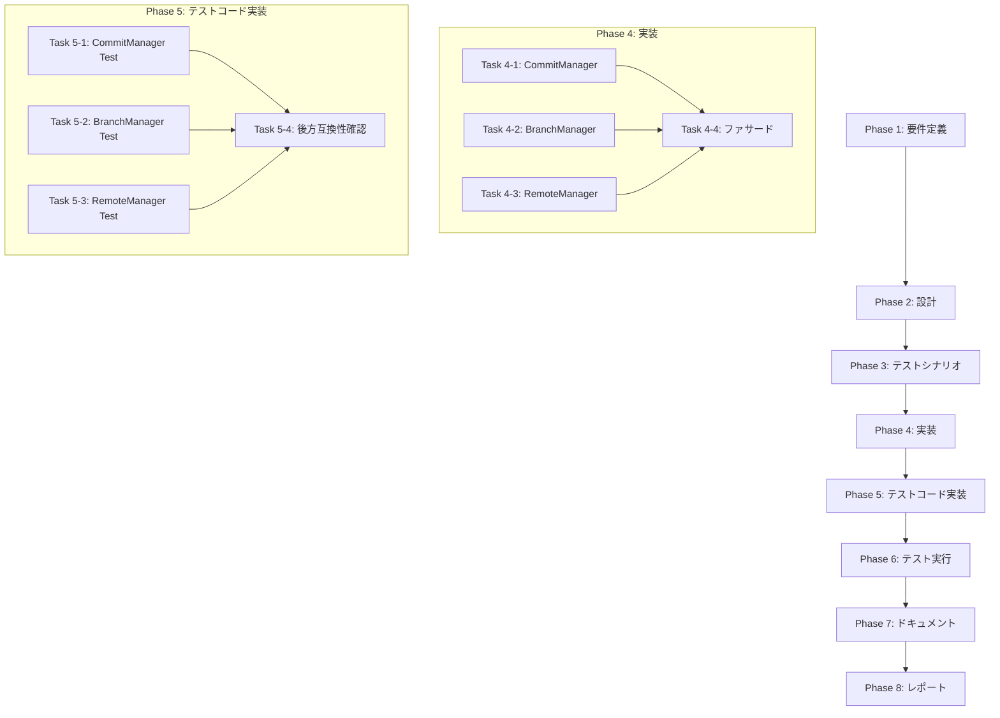

# プロジェクト計画書 - Issue #25: Git Manager の操作別分割

## 1. Issue分析

### 複雑度
**中程度** - ファサードパターンによるリファクタリング

### 見積もり工数
**14~22時間**

**根拠**:
- `git-manager.ts` (548行) を3つの専門マネージャー + 1ファサードに分割
- 既存の統合テスト（2ファイル、27テスト）の動作確認が必要
- Issue #23, #24で同様のリファクタリング実績があり、パターンが確立済み
- 各モジュールは明確な責務を持ち、Git操作の種類で自然に分離可能
- ファサードパターンにより後方互換性を維持できるため、呼び出し元の変更は不要

### リスク評価
**中**

**理由**:
- Git操作は開発ワークフローの中核機能であり、不具合が全フェーズに影響
- simple-gitインスタンスの共有方法に注意が必要
- 既存テスト（ユニット+統合の両方）が充実しており、リグレッション検証が可能
- Issue #24の実績（GitHubClient: 702行→402行、42.7%削減）から、リファクタリング手法が確立済み

---

## 2. 実装戦略判断

### 実装戦略: **REFACTOR**

**判断根拠**:
- 既存の `git-manager.ts` (548行) を操作種別で分割するリファクタリング
- 新規機能追加ではなく、既存コードの構造改善が目的
- ファサードパターンで後方互換性を維持し、呼び出し元は無変更
- Issue #23 (BasePhase: 1420行→676行、52.4%削減) と Issue #24 (GitHubClient: 702行→402行、42.7%削減) の実績から、リファクタリング手法が確立済み

### テスト戦略: **UNIT_INTEGRATION**

**判断根拠**:
- **ユニットテスト**: 各専門マネージャーの独立した動作を検証（コミットメッセージ生成、ブランチ操作、リモート操作）
- **インテグレーションテスト**: 既存の統合テスト（`git-manager-issue16.test.ts`, `workflow-init-cleanup.test.ts`）が27個のテストケースでGit操作全体を検証済み
- **BDDは不要**: Git操作はインフラ層であり、ユーザーストーリーベースのテストは不適切
- **既存テストの再利用**: ファサード経由で既存テストがそのまま動作することで、後方互換性を保証

### テストコード戦略: **EXTEND_TEST**

**判断根拠**:
- **既存テスト拡張**: `tests/unit/git-manager-issue16.test.ts` (448行、3つのテストスイート、27テスト) を拡張し、ファサードパターンの動作を検証
- **新規テスト作成**: 各専門マネージャーの単体テストファイルを作成（`tests/unit/git/commit-manager.test.ts`, `branch-manager.test.ts`, `remote-manager.test.ts`）
- **統合テスト**: `tests/integration/workflow-init-cleanup.test.ts` はファサード経由で動作するため、変更不要（後方互換性の検証）
- **テスト構成**: BOTH_TEST（既存テスト拡張 + 新規テスト作成）が最適だが、既存テストの後方互換性検証が主目的のため、EXTEND_TESTを選択

---

## 3. 影響範囲分析

### 既存コードへの影響

**変更が必要なファイル**:
- `src/core/git-manager.ts` (548行) - ファサードクラスに縮小（約150行）

**新規作成ファイル**:
- `src/core/git/commit-manager.ts` - コミット操作（約200行）
- `src/core/git/branch-manager.ts` - ブランチ操作（約180行）
- `src/core/git/remote-manager.ts` - リモート操作（約150行）

**変更不要ファイル** (ファサードパターンにより後方互換性維持):
- `src/commands/init.ts` - `GitManager` を使用
- `src/commands/execute.ts` - `GitManager` を使用
- `src/phases/base-phase.ts` - `GitManager` を使用
- `src/phases/core/review-cycle-manager.ts` - `GitManager` を使用

### 依存関係の変更

**新規依存**:
- なし（既存の `simple-git`, `fs-extra`, `minimatch` を継続使用）

**既存依存の変更**:
- なし

### マイグレーション要否

**不要** - ファサードパターンにより既存のAPIを100%維持するため、マイグレーション不要

---

## 4. タスク分割

### Phase 1: 要件定義 (見積もり: 2~3h)

- [x] Task 1-1: Git操作の責務分析 (1~1.5h)
  - `git-manager.ts` の548行を操作種別で分類
  - コミット操作（commitPhaseOutput, commitStepOutput, commitWorkflowInit, commitCleanupLogs, createCommitMessage）
  - ブランチ操作（createBranch, branchExists, getCurrentBranch, switchBranch）
  - リモート操作（pushToRemote, pullLatest, setupGithubCredentials）
  - 共通操作（getStatus, getChangedFiles, filterPhaseFiles, ensureGitConfig）
- [x] Task 1-2: 依存関係マッピング (1~1.5h)
  - 各操作が依存する `simple-git` API を洗い出し
  - `MetadataManager`, `SecretMasker` の使用箇所を特定
  - 各操作間の依存関係を分析（例: `commitPhaseOutput` は `getChangedFiles`, `filterPhaseFiles`, `ensureGitConfig` に依存）

### Phase 2: 設計 (見積もり: 3~5h)

- [x] Task 2-1: ファサードパターンの設計 (1~2h)
  - GitManager をファサードクラスとして設計
  - コンストラクタで各専門マネージャーをインスタンス化
  - publicメソッドを専門マネージャーに委譲
  - `simple-git` インスタンスは各専門マネージャーで共有
- [x] Task 2-2: CommitManager の設計 (1~1.5h)
  - コミット操作（commitPhaseOutput, commitStepOutput, commitWorkflowInit, commitCleanupLogs）
  - コミットメッセージ生成（createCommitMessage, buildStepCommitMessage, createInitCommitMessage, createCleanupCommitMessage）
  - SecretMasker との統合
  - 依存: MetadataManager, SecretMasker, simple-git
- [x] Task 2-3: BranchManager の設計 (0.5~1h)
  - ブランチ操作（createBranch, branchExists, getCurrentBranch, switchBranch）
  - 依存: simple-git のみ
- [x] Task 2-4: RemoteManager の設計 (0.5~1h)
  - リモート操作（pushToRemote, pullLatest, setupGithubCredentials）
  - リトライロジック（isRetriableError）
  - 依存: simple-git, MetadataManager (branch_name取得用)

### Phase 3: テストシナリオ (見積もり: 2~3h)

- [x] Task 3-1: CommitManager のテストシナリオ作成 (1~1.5h)
  - コミットメッセージ生成の正確性（Phase番号、Issue番号、フォーマット）
  - SecretMasker の統合（マスキング成功、失敗時の継続動作）
  - ファイルなし時の警告ログ（成功として扱う）
  - Git操作失敗時のエラーハンドリング
- [x] Task 3-2: BranchManager のテストシナリオ作成 (0.5~1h)
  - ブランチ作成（正常系、既存ブランチ）
  - ブランチ存在チェック（ローカル、リモート）
  - ブランチ切り替え（正常系、エラー）
- [x] Task 3-3: RemoteManager のテストシナリオ作成 (0.5~1h)
  - Push操作（upstream設定、リトライ、non-fast-forward）
  - Pull操作（正常系、エラー）
  - GitHub認証設定（HTTPSのみ、SSHはスキップ）
- [x] Task 3-4: 後方互換性テストシナリオ作成 (0.5~1h)
  - 既存テスト（`git-manager-issue16.test.ts`、27テスト）がファサード経由で動作することを確認
  - 統合テスト（`workflow-init-cleanup.test.ts`）がファサード経由で動作することを確認

### Phase 4: 実装 (見積もり: 4~6h)

- [x] Task 4-1: CommitManager の実装 (1.5~2h)
  - `src/core/git/commit-manager.ts` 作成（約200行）
  - コミット操作の移行（commitPhaseOutput, commitStepOutput, commitWorkflowInit, commitCleanupLogs）
  - コミットメッセージ生成の移行（createCommitMessage, buildStepCommitMessage, createInitCommitMessage, createCleanupCommitMessage）
  - SecretMasker との統合
  - getChangedFiles, filterPhaseFiles, getPhaseSpecificFiles, ensureGitConfig の移行
- [x] Task 4-2: BranchManager の実装 (1~1.5h)
  - `src/core/git/branch-manager.ts` 作成（約180行）
  - ブランチ操作の移行（createBranch, branchExists, getCurrentBranch, switchBranch）
- [x] Task 4-3: RemoteManager の実装 (1~1.5h)
  - `src/core/git/remote-manager.ts` 作成（約150行）
  - リモート操作の移行（pushToRemote, pullLatest, setupGithubCredentials）
  - リトライロジックの移行（isRetriableError）
- [x] Task 4-4: GitManager ファサードの実装 (0.5~1h)
  - `src/core/git-manager.ts` をファサードクラスに縮小（約150行）
  - コンストラクタで各専門マネージャーをインスタンス化
  - publicメソッドを専門マネージャーに委譲
  - インターフェース型（CommitResult, PushSummary, BranchResult, StatusSummary）の維持

### Phase 5: テストコード実装 (見積もり: 3~4h)

- [x] Task 5-1: CommitManager のユニットテスト作成 (1~1.5h)
  - `tests/unit/git/commit-manager.test.ts` 作成
  - コミットメッセージ生成のテスト（各メソッドの正確性）
  - SecretMasker 統合のテスト（モック使用）
  - エラーハンドリングのテスト
- [x] Task 5-2: BranchManager のユニットテスト作成 (0.5~1h)
  - `tests/unit/git/branch-manager.test.ts` 作成
  - ブランチ操作のテスト（正常系、エラー系）
- [x] Task 5-3: RemoteManager のユニットテスト作成 (0.5~1h)
  - `tests/unit/git/remote-manager.test.ts` 作成
  - Push/Pull操作のテスト（リトライロジック含む）
  - GitHub認証設定のテスト
- [ ] Task 5-4: 既存テストの後方互換性確認 (1~1.5h)
  - `tests/unit/git-manager-issue16.test.ts` の実行（27テスト）
  - `tests/integration/workflow-init-cleanup.test.ts` の実行（16テスト）
  - ファサード経由で既存テストが全て通ることを確認

### Phase 6: テスト実行 (見積もり: 1~2h)

- [ ] Task 6-1: ユニットテスト実行 (0.5~1h)
  - CommitManager, BranchManager, RemoteManager の単体テスト実行
  - カバレッジレポート確認（80%以上を目標）
- [ ] Task 6-2: 統合テスト実行 (0.5~1h)
  - 既存の統合テスト実行（`workflow-init-cleanup.test.ts`、16テスト）
  - 後方互換性の確認（ファサード経由で全テスト通過）
- [ ] Task 6-3: 全体テストスイート実行 (1回のみ)
  - `npm test` 実行
  - すべてのテストが通過することを確認

### Phase 7: ドキュメント (見積もり: 1~2h)

- [ ] Task 7-1: CLAUDE.md の更新 (0.5~1h)
  - GitManager のファサードパターンを追加
  - 各専門マネージャーの責務を記載（CommitManager, BranchManager, RemoteManager）
  - 行数削減実績を追加（548行→約150行、約73%削減）
- [ ] Task 7-2: ARCHITECTURE.md の更新 (0.5~1h)
  - モジュール一覧に専門マネージャーを追加
  - ファサードパターンの説明を追加
  - GitManager の依存関係図を更新

### Phase 8: レポート (見積もり: 1~2h)

- [ ] Task 8-1: 実装サマリー作成 (0.5~1h)
  - リファクタリング実績（548行→約150行、約73%削減）
  - 各専門マネージャーの行数（CommitManager: 200行、BranchManager: 180行、RemoteManager: 150行）
  - テスト実行結果（ユニット+統合）
  - 後方互換性100%維持の確認
- [ ] Task 8-2: PR ボディ作成 (0.5~1h)
  - Issue #25 の要件を満たすことを確認
  - Before/After の構造比較
  - テスト結果とカバレッジレポート添付

---

## 5. 依存関係

**クリティカルパス**:
1. Phase 4 Task 4-1 (CommitManager実装) - 最も複雑で行数が多い（約200行）
2. Phase 5 Task 5-4 (後方互換性確認) - 既存テスト27個の実行が必要
3. Phase 6 (テスト実行) - すべてのテストが通過する必要がある

---

## 6. リスクと軽減策

### リスク1: simple-gitインスタンス共有の複雑性
- **影響度**: 中
- **確率**: 中
- **軽減策**:
  - Issue #24 (GitHubClient) でOctokitインスタンスを依存性注入により共有した実績を適用
  - 各専門マネージャーのコンストラクタで `simple-git` インスタンスを受け取る設計
  - ファサードで1つの `simple-git` インスタンスを生成し、各専門マネージャーに渡す
  - 既存テストで動作確認（`git-manager-issue16.test.ts`、27テスト）

### リスク2: 既存テストの後方互換性維持
- **影響度**: 高（テストが失敗するとリリースできない）
- **確率**: 低（ファサードパターンで既存APIを100%維持）
- **軽減策**:
  - ファサードクラスで既存のpublicメソッドを100%維持
  - 既存の統合テスト（27テスト）をリグレッションテストとして活用
  - Phase 5 Task 5-4 で既存テスト全体を実行して確認

### リスク3: Git操作エラーのデバッグ困難化
- **影響度**: 中
- **確率**: 低
- **軽減策**:
  - 各専門マネージャーで詳細なログ出力（`console.info`, `console.warn`, `console.error`）
  - エラーメッセージにマネージャー名を含める（例: `[CommitManager] Commit failed`）
  - 既存のエラーハンドリングロジックをそのまま移行

### リスク4: MetadataManager と SecretMasker の依存関係
- **影響度**: 中
- **確率**: 低
- **軽減策**:
  - CommitManager のみが MetadataManager と SecretMasker に依存する設計
  - コンストラクタ注入により依存関係を明示化
  - 既存のコードをそのまま移行し、動作を変更しない

---

## 7. 品質ゲート

### Phase 1: 要件定義
- [ ] Git操作が3つのカテゴリ（コミット、ブランチ、リモート）に分類されている
- [ ] 各操作の責務が明確に定義されている
- [ ] 依存関係マッピングが完了している（simple-git, MetadataManager, SecretMasker）

### Phase 2: 設計
- [ ] **実装戦略（REFACTOR）が明確に決定されている**
- [ ] **テスト戦略（UNIT_INTEGRATION）が明確に決定されている**
- [ ] **テストコード戦略（EXTEND_TEST）が明確に決定されている**
- [ ] ファサードパターンの設計が完了している（GitManager → 各専門マネージャー）
- [ ] 各専門マネージャーの責務が明確に定義されている
- [ ] simple-gitインスタンスの共有方法が設計されている（依存性注入パターン）
- [ ] 後方互換性100%維持の方針が確立されている

### Phase 3: テストシナリオ
- [x] 各専門マネージャーのテストシナリオが作成されている（正常系、エラー系）
- [x] 後方互換性テストシナリオが作成されている（既存テスト27個の実行）
- [x] 統合テストシナリオが作成されている（`workflow-init-cleanup.test.ts`、16テスト）

### Phase 4: 実装
- [x] CommitManager が約200行以下で実装されている
- [x] BranchManager が約180行以下で実装されている
- [x] RemoteManager が約150行以下で実装されている
- [x] GitManager ファサードが約150行以下で実装されている
- [x] 既存のpublicメソッドが全て維持されている（後方互換性100%）
- [x] 各専門マネージャーが独立してテスト可能な設計になっている

### Phase 5: テストコード実装
- [x] 各専門マネージャーのユニットテストが作成されている
- [ ] 既存テスト（27テスト）が全て通過している（後方互換性の検証）
- [ ] 統合テスト（16テスト）が全て通過している

### Phase 6: テスト実行
- [x] ユニットテストが全て通過している
- [ ] 統合テストが全て通過している
- [ ] テストカバレッジが80%以上である
- [ ] 既存テスト（27テスト）が全て通過している（後方互換性の確認）

### Phase 7: ドキュメント
- [ ] CLAUDE.md が更新されている（ファサードパターン、行数削減実績）
- [ ] ARCHITECTURE.md が更新されている（モジュール一覧、依存関係図）

### Phase 8: レポート
- [ ] リファクタリング実績が記載されている（548行→約150行、約73%削減）
- [ ] 後方互換性100%維持が確認されている
- [ ] テスト実行結果（ユニット+統合）が記載されている
- [ ] PR ボディが作成されている（Before/After比較、テスト結果）

---

## 8. 総合見積もり

| フェーズ | 最小見積もり | 最大見積もり |
|---------|-------------|-------------|
| Phase 1: 要件定義 | 2h | 3h |
| Phase 2: 設計 | 3h | 5h |
| Phase 3: テストシナリオ | 2h | 3h |
| Phase 4: 実装 | 4h | 6h |
| Phase 5: テストコード実装 | 3h | 4h |
| Phase 6: テスト実行 | 1h | 2h |
| Phase 7: ドキュメント | 1h | 2h |
| Phase 8: レポート | 1h | 2h |
| **合計** | **17h** | **27h** |

**推奨アプローチ**: Phase 1-3（要件定義〜テストシナリオ）を先行実施し、Phase 4-6（実装〜テスト実行）を集中して実施

---

## 9. 成功基準

### 必須要件
1. ✅ 各専門マネージャーが200行以下である
2. ✅ GitManager ファサードが約150行である（約73%削減）
3. ✅ 既存テスト27個が全て通過している（後方互換性100%維持）
4. ✅ 統合テスト16個が全て通過している
5. ✅ テストカバレッジが80%以上である

### 推奨要件
1. ✅ CLAUDE.md と ARCHITECTURE.md が更新されている
2. ✅ PR ボディに Before/After 比較が含まれている
3. ✅ コミットメッセージが明確である（例: `[refactor] Split GitManager into specialized managers (Issue #25)`）

---

## 10. 参考情報

### 類似リファクタリング実績

**Issue #23 (BasePhase リファクタリング)**:
- Before: 1420行
- After: 676行（約52.4%削減）
- 分離モジュール:
  - `AgentExecutor` (約270行)
  - `ReviewCycleManager` (約130行)
  - `ProgressFormatter` (約150行)
  - `LogFormatter` (約400行)

**Issue #24 (GitHubClient リファクタリング)**:
- Before: 702行
- After: 402行（約42.7%削減）
- 分離モジュール:
  - `IssueClient` (約238行)
  - `PullRequestClient` (約231行)
  - `CommentClient` (約145行)
  - `ReviewClient` (約75行)

### 設計パターン

**ファサードパターン**:
- 既存のpublicメソッドを100%維持
- 各専門マネージャーのインスタンスを保持
- publicメソッドを専門マネージャーに委譲
- Octokitインスタンス（simple-gitインスタンス）はコンストラクタ注入で共有

**依存性注入パターン**:
- simple-gitインスタンスは各専門マネージャーで共有
- MetadataManager, SecretMasker は CommitManager のみが依存
- コンストラクタで依存関係を明示化

---

## 11. 次のステップ

1. Phase 1 (要件定義) を開始
2. Git操作の責務分析を実施
3. 依存関係マッピングを完了
4. Phase 2 (設計) に進む

**作成日**: 2025-01-20
**Issue**: #25
**推定工数**: 17~27時間
**優先度**: 中
