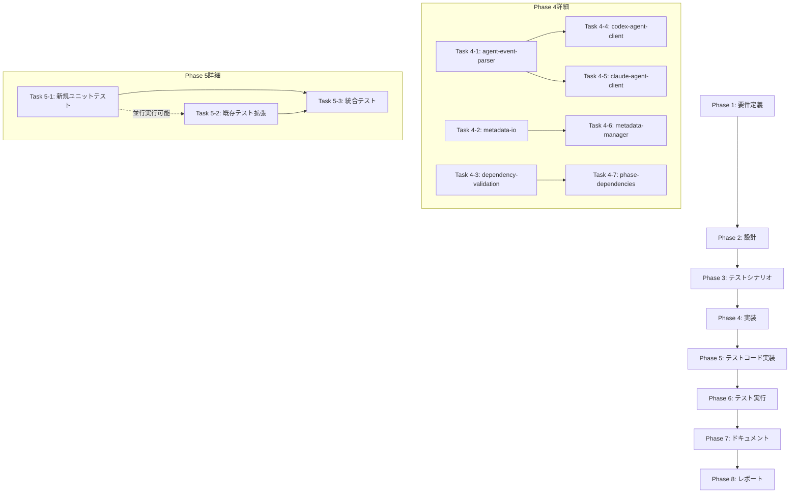

# プロジェクト計画書 - Issue #26

**Issue番号**: #26
**タイトル**: [REFACTOR] 残り4ファイルの軽量リファクタリング
**Issue URL**: https://github.com/tielec/ai-workflow-agent/issues/26
**作成日**: 2025-01-20
**優先度**: 低

---

## 1. Issue分析

### 1.1 複雑度

**判定**: 中程度

**根拠**:
- 対象ファイル数: 4ファイル（359～342行）
- 変更内容: ファイル内での小規模な整理（重複ロジック抽出、ヘルパー関数分離）
- 影響範囲: 各ファイル内部に限定、公開APIは維持
- リスク: 既存テストの維持が必要、既存の実装パターン（Issue #23, #24, #25）との整合性確保

### 1.2 見積もり工数

**合計工数**: 12～16時間

**フェーズ別内訳**:
- Phase 1 (要件定義): 1～2時間
- Phase 2 (設計): 2～3時間
- Phase 3 (テストシナリオ): 1～2時間
- Phase 4 (実装): 4～6時間
- Phase 5 (テストコード実装): 2～3時間
- Phase 6 (テスト実行): 0.5～1時間
- Phase 7 (ドキュメント): 0.5～1時間
- Phase 8 (レポート): 1時間

**根拠**:
1. **対象ファイルの規模**: 各ファイル300～360行程度で、大規模な再設計は不要
2. **既存パターンの存在**: Issue #23（BasePhase分離）、Issue #24（GitHubClient分離）、Issue #25（GitManager分離）の成功パターンを参照可能
3. **テストの存在**: `phase-dependencies.test.ts`が既に存在し、他のファイルも同様にテスト可能
4. **影響範囲の限定**: 各ファイル内部の整理が中心、破壊的変更は避ける

### 1.3 リスク評価

**総合リスク**: 中

**主要リスク**:
1. **エージェントクライアントの複雑性** (中リスク):
   - Codex/ClaudeのJSON/SDKイベント処理が複雑
   - ログフォーマット処理の共通化が困難な可能性
2. **既存テストの維持** (中リスク):
   - 大規模リファクタ（Issue #23, #24, #25）と異なり、既存テストが少ない
   - メタデータ管理のテストが不足している可能性
3. **プリセット定義の影響** (低リスク):
   - プリセット定義は構造化されているが、依存関係検証ロジックとの整合性確保が必要

---

## 2. 実装戦略判断

### 2.1 実装戦略: REFACTOR

**判断根拠**:
1. **新規ファイル作成なし**: 各ファイル内での整理が中心、新規モジュール作成は最小限
2. **既存コードの改善**: 重複ロジックの抽出、ヘルパー関数の分離による可読性向上
3. **破壊的変更の回避**: 公開APIは維持、既存の呼び出し元は無変更で動作
4. **成功パターンの適用**: Issue #23, #24, #25で確立されたリファクタリングパターンの踏襲

**既存パターンとの比較**:
- **Issue #23 (BasePhase)**: 1420行 → 676行（52.4%削減）、4モジュール分離
- **Issue #24 (GitHubClient)**: 702行 → 402行（42.7%削減）、ファサードパターン
- **Issue #25 (GitManager)**: 548行 → 181行（67%削減）、ファサードパターン
- **本Issue**: 各ファイル300～360行 → 目標250行以下（約30%削減）、ヘルパー分離

### 2.2 テスト戦略: UNIT_INTEGRATION

**判断根拠**:
1. **UNIT_ONLY が不十分な理由**:
   - エージェントクライアント: JSON/SDKイベント処理の実際の動作確認が必要
   - メタデータ管理: ファイルI/O操作の統合的な動作確認が必要
   - 依存関係検証: プリセット実行時の実際の動作確認が必要
2. **BDD が不要な理由**:
   - エンドユーザー向け機能ではない（内部モジュール）
   - ユーザーストーリーよりも技術的な動作保証が重要
3. **UNIT + INTEGRATION が最適な理由**:
   - **UNIT**: 各ヘルパー関数、共通ロジックの単体動作を保証
   - **INTEGRATION**: エージェント実行、メタデータI/O、依存関係検証の統合動作を保証

### 2.3 テストコード戦略: BOTH_TEST

**判断根拠**:
1. **EXTEND_TEST が必要な理由**:
   - `phase-dependencies.test.ts` は既に存在し、高品質（253行、11テストケース）
   - 既存テストに新規ヘルパー関数のテストケースを追加
2. **CREATE_TEST が必要な理由**:
   - Codex/Claudeエージェントクライアントのテストファイルが存在しない
   - メタデータ管理の包括的なテストファイルが不足
   - 各ファイルに対応する新規テストファイルの作成が必要
3. **BOTH_TEST が最適な理由**:
   - 既存テストの拡張により、プリセット・依存関係検証の品質を維持
   - 新規テストにより、エージェントクライアント・メタデータ管理の品質を保証

---

## 3. 影響範囲分析

### 3.1 既存コードへの影響

#### 3.1.1 変更が必要なファイル

**コアファイル（4ファイル）**:
1. `src/core/codex-agent-client.ts` (359行):
   - JSONイベントパース処理の共通化
   - ログフォーマット処理の分離
   - 環境変数設定処理の抽出
2. `src/core/claude-agent-client.ts` (354行):
   - SDKイベントハンドリングの共通化
   - ログフォーマット処理の分離
   - トークン抽出処理の整理
3. `src/core/metadata-manager.ts` (342行):
   - ファイルI/O操作の共通化
   - バリデーション処理の分離
   - タイムスタンプフォーマット処理の抽出
4. `src/core/phase-dependencies.ts` (336行):
   - プリセット定義の構造化
   - 依存関係検証ロジックの整理
   - エラー/警告メッセージ生成の共通化

**新規ヘルパーファイル（3～4ファイル）**:
1. `src/core/helpers/agent-event-parser.ts`:
   - Codex/Claude共通のイベントパースロジック
2. `src/core/helpers/metadata-io.ts`:
   - メタデータファイルI/O操作の共通処理
3. `src/core/helpers/dependency-validation.ts`:
   - 依存関係検証の共通ロジック（エラー/警告メッセージ生成）

**テストファイル（4～6ファイル）**:
1. `tests/unit/phase-dependencies.test.ts` (拡張):
   - 新規ヘルパー関数のテストケース追加
2. `tests/unit/codex-agent-client.test.ts` (新規):
   - JSONイベントパース処理のテスト
   - ログフォーマット処理のテスト
3. `tests/unit/claude-agent-client.test.ts` (新規):
   - SDKイベントハンドリングのテスト
   - トークン抽出処理のテスト
4. `tests/unit/metadata-manager.test.ts` (新規):
   - ファイルI/O操作のテスト
   - バリデーション処理のテスト
5. `tests/integration/agent-client-execution.test.ts` (新規):
   - Codex/Claudeエージェント実行の統合テスト
6. `tests/integration/metadata-persistence.test.ts` (新規):
   - メタデータ永続化の統合テスト

#### 3.1.2 影響を受ける可能性のあるファイル

**間接的な影響（公開APIは維持）**:
- `src/phases/base-phase.ts`: エージェントクライアントの呼び出し元、APIは維持
- `src/phases/core/agent-executor.ts`: Codex/Claudeクライアントの利用側、変更不要
- `src/commands/execute.ts`: メタデータマネージャーの利用側、変更不要

**影響なし（後方互換性を維持）**:
- すべての既存呼び出し元は無変更で動作

### 3.2 依存関係の変更

#### 3.2.1 新規依存の追加

**なし**: 既存の依存関係のみを使用（fs-extra, node:path, node:child_process 等）

#### 3.2.2 既存依存の変更

**なし**: 既存の依存関係を維持

### 3.3 マイグレーション要否

**不要**:
- データベーススキーマ変更なし
- 設定ファイル変更なし
- 環境変数変更なし
- メタデータフォーマット変更なし

---

## 4. タスク分割

### Phase 1: 要件定義 (見積もり: 1～2h)

- [ ] Task 1-1: 各ファイルの重複ロジック特定 (0.5～1h)
  - codex-agent-client.ts の重複分析（logEvent, fillTemplate 等）
  - claude-agent-client.ts の重複分析（logMessage系, extractToken 等）
  - metadata-manager.ts の重複分析（ファイルI/O, タイムスタンプ 等）
  - phase-dependencies.ts の重複分析（エラー/警告メッセージ生成 等）
- [ ] Task 1-2: ヘルパー関数の分離方針決定 (0.5～1h)
  - エージェント共通ロジックの抽出方針
  - メタデータI/O処理の分離方針
  - 依存関係検証ロジックの整理方針
  - 既存パターン（Issue #23, #24, #25）との整合性確認

### Phase 2: 設計 (見積もり: 2～3h)

- [ ] Task 2-1: ヘルパーモジュール設計 (1～1.5h)
  - `agent-event-parser.ts` インターフェース設計
  - `metadata-io.ts` インターフェース設計
  - `dependency-validation.ts` インターフェース設計
  - 各モジュールの責務分離とSRP準拠確認
- [ ] Task 2-2: リファクタリング計画策定 (1～1.5h)
  - 各ファイルの変更箇所リスト作成
  - 後方互換性維持の確認項目リスト作成
  - 既存テストの影響分析
  - リファクタリング順序の決定（依存関係を考慮）

### Phase 3: テストシナリオ (見積もり: 1～2h)

- [ ] Task 3-1: ユニットテストシナリオ作成 (0.5～1h)
  - Codex/Claudeエージェントクライアントのテストケース設計
  - メタデータマネージャーのテストケース設計
  - 既存プリセット・依存関係検証テストの拡張設計
- [ ] Task 3-2: 統合テストシナリオ作成 (0.5～1h)
  - エージェント実行の統合テストシナリオ
  - メタデータ永続化の統合テストシナリオ
  - リファクタリング前後の動作比較シナリオ

### Phase 4: 実装 (見積もり: 4～6h)

- [ ] Task 4-1: agent-event-parser.ts 実装 (0.5～1h)
  - JSONイベントパース処理の共通化
  - SDKイベントハンドリングの共通化
  - ログフォーマット処理の共通化
- [ ] Task 4-2: metadata-io.ts 実装 (0.5～1h)
  - ファイルI/O操作の共通化
  - タイムスタンプフォーマット処理の抽出
  - バリデーション処理の分離
- [ ] Task 4-3: dependency-validation.ts 実装 (0.5～1h)
  - エラー/警告メッセージ生成の共通化
  - プリセット定義の構造化
  - 依存関係検証ロジックの整理
- [ ] Task 4-4: codex-agent-client.ts リファクタリング (0.5～1h)
  - 共通ロジックをagent-event-parserに移行
  - 環境変数設定処理の抽出
  - ログフォーマット処理の統合
- [ ] Task 4-5: claude-agent-client.ts リファクタリング (0.5～1h)
  - 共通ロジックをagent-event-parserに移行
  - トークン抽出処理の整理
  - ログフォーマット処理の統合
- [ ] Task 4-6: metadata-manager.ts リファクタリング (0.5～1h)
  - ファイルI/O操作をmetadata-ioに移行
  - バリデーション処理の分離
  - 重複コードの削減
- [ ] Task 4-7: phase-dependencies.ts リファクタリング (0.5～1h)
  - エラー/警告メッセージ生成をdependency-validationに移行
  - プリセット定義の構造化
  - 依存関係検証ロジックの整理

### Phase 5: テストコード実装 (見積もり: 2～3h)

- [ ] Task 5-1: ユニットテスト実装（新規ファイル） (1～1.5h)
  - `tests/unit/codex-agent-client.test.ts` 作成
  - `tests/unit/claude-agent-client.test.ts` 作成
  - `tests/unit/metadata-manager.test.ts` 作成
  - 各ヘルパーモジュールのユニットテスト作成
- [ ] Task 5-2: ユニットテスト拡張（既存ファイル） (0.5～1h)
  - `tests/unit/phase-dependencies.test.ts` に新規ケース追加
  - 新規ヘルパー関数のテストケース追加
- [ ] Task 5-3: 統合テスト実装 (0.5～1h)
  - `tests/integration/agent-client-execution.test.ts` 作成
  - `tests/integration/metadata-persistence.test.ts` 作成

### Phase 6: テスト実行 (見積もり: 0.5～1h)

- [ ] Task 6-1: 全テスト実行 (0.5～1h)
  - `npm test` でユニット・統合テストを実行
  - カバレッジレポート確認（`npm run test:coverage`）
  - 失敗したテストケースの修正
  - リグレッションテストの実行

### Phase 7: ドキュメント (見積もり: 0.5～1h)

- [ ] Task 7-1: ドキュメント更新 (0.5～1h)
  - ARCHITECTURE.md の更新（新規ヘルパーモジュールの説明）
  - CLAUDE.md の更新（ファイル行数の更新）
  - 各ヘルパーモジュールのJSDocコメント追加

### Phase 8: レポート (見積もり: 1h)

- [ ] Task 8-1: 実装レポート作成 (1h)
  - リファクタリング結果のサマリー作成
  - 削減行数の集計
  - テストカバレッジの確認
  - PR本文の生成

---

## 5. 依存関係

**クリティカルパス**:
1. Phase 1 → Phase 2: 要件定義完了後に設計着手
2. Phase 4.1～4.3 → Phase 4.4～4.7: ヘルパーモジュール実装完了後に各ファイルリファクタリング
3. Phase 5.1, 5.2 → Phase 5.3: ユニットテスト完了後に統合テスト
4. Phase 6 → Phase 7: テスト合格後にドキュメント更新

**並行実行可能なタスク**:
- Phase 4.4, 4.5, 4.6, 4.7: 各ファイルのリファクタリングは並行実行可能（ヘルパーモジュール完成後）
- Phase 5.1, 5.2: 新規テストと既存テスト拡張は並行実行可能

---

## 6. リスクと軽減策

### リスク1: エージェントクライアントの複雑性

- **影響度**: 中
- **確率**: 中
- **軽減策**:
  1. **段階的リファクタリング**: Codex → Claude の順に実装し、パターンを確立
  2. **既存テスト活用**: Issue #23, #24, #25で確立されたテストパターンを参照
  3. **ログフォーマット処理の慎重な共通化**: 完全に統一できない場合は、部分的な共通化にとどめる
  4. **動作確認**: 各エージェントクライアントのリファクタリング後、実際のタスク実行で動作確認

### リスク2: 既存テストの不足

- **影響度**: 中
- **確率**: 中
- **軽減策**:
  1. **テストファースト**: 実装前にテストケースを作成し、リファクタリング前後の動作を保証
  2. **カバレッジ目標設定**: 各ファイル80%以上のカバレッジを目標
  3. **統合テストの追加**: ユニットテストだけでなく、実際のエージェント実行・メタデータI/Oの統合テストを実施
  4. **既存パターン参照**: `phase-dependencies.test.ts` (253行、11ケース) を参考に高品質なテストを作成

### リスク3: 後方互換性の破壊

- **影響度**: 高
- **確率**: 低
- **軽減策**:
  1. **公開API維持**: 各クラスのpublicメソッドは変更せず、内部実装のみリファクタリング
  2. **既存テストの実行**: リファクタリング後、すべての既存テストが合格することを確認
  3. **段階的デプロイ**: 各ファイルのリファクタリング完了後、個別にテストを実行
  4. **ロールバック計画**: Git履歴による即座のロールバックを可能にする

### リスク4: 目標行数削減の未達

- **影響度**: 低
- **確率**: 中
- **軽減策**:
  1. **現実的な目標設定**: 250行以下は努力目標、実際は270～280行でも許容
  2. **削減率の可視化**: Issue #23 (52.4%), #24 (42.7%), #25 (67%) と比較し、30%削減を現実的な目標に
  3. **優先順位の明確化**: 行数削減よりも可読性・保守性の向上を優先
  4. **段階的改善**: 今回のリファクタリングで完璧を目指さず、将来的な改善余地を残す

### リスク5: プリセット定義の影響

- **影響度**: 低
- **確率**: 低
- **軽減策**:
  1. **既存テストの維持**: `phase-dependencies.test.ts` の全テストケースを合格させる
  2. **プリセット実行テスト**: リファクタリング後、各プリセットの実際の実行を確認
  3. **依存関係検証の厳格化**: エラー/警告メッセージ生成の共通化により、検証ロジックの品質を向上
  4. **後方互換性の維持**: 非推奨プリセット（DEPRECATED_PRESETS）は維持

---

## 7. 品質ゲート

### Phase 1: 要件定義

- [ ] **重複ロジックが網羅的に特定されている**
  - 各ファイルで3つ以上の重複箇所を特定
  - 重複箇所の行数と影響範囲を明記
- [ ] **ヘルパー関数の分離方針が明確である**
  - 各ヘルパーモジュールの責務が単一責任原則（SRP）に準拠
  - 既存パターンとの整合性が確認されている
- [ ] **影響範囲が正確に分析されている**
  - 変更が必要なファイルリストが完全
  - 後方互換性への影響がゼロであることを確認

### Phase 2: 設計

- [ ] **実装戦略（REFACTOR）の判断根拠が明記されている**
  - 新規ファイル作成は最小限（ヘルパーのみ）
  - 公開APIは維持
- [ ] **テスト戦略（UNIT_INTEGRATION）の判断根拠が明記されている**
  - ユニットテストでヘルパー関数の単体動作を保証
  - 統合テストでエージェント実行・メタデータI/Oを保証
- [ ] **テストコード戦略（BOTH_TEST）の判断根拠が明記されている**
  - 既存テスト拡張（phase-dependencies.test.ts）
  - 新規テスト作成（codex/claude/metadata-manager）
- [ ] **ヘルパーモジュールの設計が完了している**
  - 各モジュールのインターフェースが定義されている
  - 依存関係が明確である
- [ ] **後方互換性維持の確認項目が定義されている**
  - 公開APIの変更なし
  - 既存テストの合格を保証

### Phase 3: テストシナリオ

- [ ] **ユニットテストシナリオが包括的である**
  - Codex/Claudeエージェントクライアントの全公開メソッドをカバー
  - メタデータマネージャーの全公開メソッドをカバー
  - ヘルパーモジュールの全関数をカバー
- [ ] **統合テストシナリオが実践的である**
  - 実際のエージェント実行フローを模擬
  - 実際のメタデータI/Oフローを模擬
- [ ] **リファクタリング前後の動作比較が可能である**
  - 同一テストケースでリファクタリング前後を比較
  - 性能退行がないことを確認

### Phase 4: 実装

- [ ] **ヘルパーモジュールが実装されている**
  - agent-event-parser.ts が完成
  - metadata-io.ts が完成
  - dependency-validation.ts が完成
- [ ] **各ファイルのリファクタリングが完了している**
  - codex-agent-client.ts のリファクタリング完了
  - claude-agent-client.ts のリファクタリング完了
  - metadata-manager.ts のリファクタリング完了
  - phase-dependencies.ts のリファクタリング完了
- [ ] **行数削減目標が達成されている（努力目標）**
  - 各ファイルが250行以下、または30%以上削減
- [ ] **公開APIが維持されている**
  - すべてのpublicメソッドのシグネチャが変更されていない

### Phase 5: テストコード実装

- [ ] **新規ユニットテストが実装されている**
  - codex-agent-client.test.ts が作成され、80%以上のカバレッジ
  - claude-agent-client.test.ts が作成され、80%以上のカバレッジ
  - metadata-manager.test.ts が作成され、80%以上のカバレッジ
- [ ] **既存テストが拡張されている**
  - phase-dependencies.test.ts に新規ケースが追加
  - 全既存テストケースが合格
- [ ] **統合テストが実装されている**
  - agent-client-execution.test.ts が作成
  - metadata-persistence.test.ts が作成

### Phase 6: テスト実行

- [ ] **全テストが合格している**
  - `npm test` で全テストが合格
  - `npm run test:unit` で全ユニットテストが合格
  - `npm run test:integration` で全統合テストが合格
- [ ] **カバレッジ目標が達成されている**
  - 全体カバレッジが既存レベル以上を維持
  - 新規ファイルのカバレッジが80%以上
- [ ] **リグレッションがない**
  - 既存のすべてのテストケースが合格
  - パフォーマンス退行がない

### Phase 7: ドキュメント

- [ ] **ARCHITECTURE.md が更新されている**
  - 新規ヘルパーモジュールの説明が追加
  - 各ファイルの行数が更新
- [ ] **CLAUDE.md が更新されている**
  - 各ファイルの行数が更新
  - リファクタリング結果が反映
- [ ] **JSDocコメントが追加されている**
  - 各ヘルパーモジュールの全公開関数にJSDocが追加

### Phase 8: レポート

- [ ] **実装レポートが作成されている**
  - リファクタリング結果のサマリーが明記
  - 削減行数の集計が正確
  - テストカバレッジが記載
- [ ] **PR本文が生成されている**
  - 変更内容が明確に記載
  - 後方互換性が保証されている
  - テスト結果が添付されている

---

## 8. 成功基準

### 8.1 必須要件（Must Have）

1. **行数削減**: 各ファイルが270行以下（30%削減）に到達
2. **テスト合格**: 全既存テスト + 新規テストが合格
3. **後方互換性**: 公開APIの変更なし、既存呼び出し元の無変更動作
4. **カバレッジ維持**: 全体カバレッジが既存レベル以上を維持

### 8.2 推奨要件（Should Have）

1. **行数削減（努力目標）**: 各ファイルが250行以下に到達
2. **カバレッジ向上**: 新規ファイルのカバレッジが80%以上
3. **ドキュメント更新**: ARCHITECTURE.md、CLAUDE.md の更新完了
4. **パフォーマンス維持**: リファクタリング前後で性能退行なし

### 8.3 参考情報

**既存リファクタリングの成功例**:
- **Issue #23 (BasePhase)**: 1420行 → 676行（52.4%削減）、4モジュール分離、テスト30ケース作成
- **Issue #24 (GitHubClient)**: 702行 → 402行（42.7%削減）、ファサードパターン、テスト24ケース作成
- **Issue #25 (GitManager)**: 548行 → 181行（67%削減）、ファサードパターン、テスト21ケース作成

**本Issueの目標**:
- **合計削減行数**: 約400～450行（30～35%削減）
- **新規テストケース数**: 20～30ケース
- **カバレッジ**: 全体80%以上、新規ファイル80%以上

---

## 9. 備考

### 9.1 関連Issue

- **親Issue**: #1（リファクタリング全体計画）
- **参考Issue**:
  - #23（BasePhase分離）
  - #24（GitHubClient分離）
  - #25（GitManager分離）

### 9.2 次のステップ

1. Phase 1（要件定義）で各ファイルの重複箇所を詳細に分析
2. Phase 2（設計）でヘルパーモジュールの責務を明確化
3. Phase 4（実装）で段階的にリファクタリングを実施
4. Phase 6（テスト実行）でリグレッションテストを徹底

### 9.3 その他の考慮事項

- **優先度**: 低（現状でも管理可能なサイズ）
- **実施時期**: Issue #23, #24, #25完了後
- **影響範囲**: 内部モジュールのみ、外部APIへの影響なし
- **リスク**: 中（エージェントクライアントの複雑性、既存テスト不足）
- **期待効果**: 可読性・保守性の向上、テストカバレッジの向上

---

**計画書作成日**: 2025-01-20
**次回レビュー日**: Phase 2（設計）完了後
**承認者**: AI Workflow Agent
