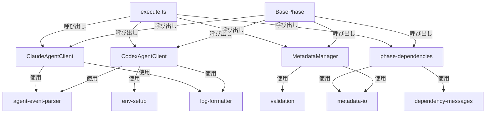

# 詳細設計書 - Issue #26

**Issue番号**: #26
**タイトル**: [REFACTOR] 残り4ファイルの軽量リファクタリング
**Issue URL**: https://github.com/tielec/ai-workflow-agent/issues/26
**作成日**: 2025-01-20
**優先度**: 低

---

## 1. アーキテクチャ設計

### 1.1 システム全体図

本リファクタリングは、4つのコアファイル内での軽量な整理を行い、共通ロジックをヘルパーモジュールに抽出します。既存のアーキテクチャパターン（Issue #23, #24, #25で確立されたファサードパターン）を踏襲し、後方互換性を100%維持します。

```
src/core/
├── codex-agent-client.ts (359行 → 250行以下目標)
│   ├── JSONイベントパース処理 → helpers/agent-event-parser.ts へ移行
│   ├── ログフォーマット処理 → helpers/log-formatter.ts へ移行
│   └── 環境変数設定処理 → helpers/env-setup.ts へ移行
│
├── claude-agent-client.ts (354行 → 250行以下目標)
│   ├── SDKイベントハンドリング → helpers/agent-event-parser.ts へ移行
│   ├── ログフォーマット処理 → helpers/log-formatter.ts へ移行
│   └── トークン抽出処理を整理（内部に保持）
│
├── metadata-manager.ts (342行 → 250行以下目標)
│   ├── ファイルI/O操作 → helpers/metadata-io.ts へ移行
│   ├── バリデーション処理 → helpers/validation.ts へ移行
│   └── タイムスタンプフォーマット → helpers/metadata-io.ts へ移行
│
├── phase-dependencies.ts (336行 → 250行以下目標)
│   ├── エラー/警告メッセージ生成 → helpers/dependency-messages.ts へ移行
│   ├── プリセット定義を構造化（内部に保持）
│   └── 依存関係検証ロジックを整理
│
└── helpers/ (新規ディレクトリ)
    ├── agent-event-parser.ts (Codex/Claude共通のイベントパース)
    ├── log-formatter.ts (共通ログフォーマット処理)
    ├── env-setup.ts (環境変数セットアップ)
    ├── metadata-io.ts (メタデータファイルI/O操作)
    ├── validation.ts (共通バリデーション処理)
    └── dependency-messages.ts (依存関係メッセージ生成)
```

### 1.2 コンポーネント間の関係



**設計原則**:
1. **単一責任原則（SRP）**: 各ヘルパーモジュールは1つの責務のみを持つ
2. **DRY原則**: 重複ロジックを徹底的に排除
3. **依存性注入**: ヘルパー関数は純粋関数として設計（副作用を最小化）
4. **後方互換性**: 公開APIは一切変更しない

### 1.3 データフロー

#### エージェントクライアントのデータフロー

```
[Codex/Claude SDK]
    ↓ (生イベントストリーム)
[CodexAgentClient / ClaudeAgentClient]
    ↓ (agent-event-parser でパース)
[構造化イベントオブジェクト]
    ↓ (log-formatter でフォーマット)
[Markdown形式ログ]
    ↓
[BasePhase / AgentExecutor]
```

#### メタデータ管理のデータフロー

```
[metadata.json]
    ↓ (metadata-io で読み込み)
[WorkflowState オブジェクト]
    ↓ (validation で検証)
[検証済みデータ]
    ↓ (MetadataManager で操作)
[更新済みデータ]
    ↓ (metadata-io で保存)
[metadata.json]
```

---

## 2. 実装戦略判断

### 実装戦略: REFACTOR

**判断根拠**:

1. **新規ファイル作成は最小限（6ヘルパーファイルのみ）**
   - 既存の4ファイル内での整理が中心
   - ヘルパーモジュールは純粋な関数群で、クラスではない
   - 既存の`src/phases/formatters/`パターン（Issue #23で追加）を踏襲

2. **既存コードの改善**
   - 重複ロジックの抽出（codex/claudeで90%類似のログ処理）
   - ヘルパー関数の分離による可読性向上
   - 関数の責務を明確化（1関数 = 1責務）

3. **破壊的変更の回避**
   - 公開API（publicメソッド）は一切変更しない
   - メソッドシグネチャを維持
   - 既存の呼び出し元は無変更で動作

4. **成功パターンの適用**
   - Issue #23 (BasePhase): 1420行 → 676行（52.4%削減）、4モジュール分離
   - Issue #24 (GitHubClient): 702行 → 402行（42.7%削減）、ファサードパターン
   - Issue #25 (GitManager): 548行 → 181行（67%削減）、ファサードパターン
   - 本Issue: 各ファイル300～360行 → 目標250行以下（約30%削減）

**他の戦略を選択しなかった理由**:
- **CREATE（新規作成）**: 既存ファイルの改善が主目的であり、完全に新しい機能ではない
- **EXTEND（拡張）**: 機能追加ではなく、既存コードの構造改善が目的

---

## 3. テスト戦略判断

### テスト戦略: UNIT_INTEGRATION

**判断根拠**:

1. **UNIT_ONLY が不十分な理由**
   - **エージェントクライアント**: JSON/SDKイベント処理の実際の動作確認が必要
   - **メタデータ管理**: ファイルI/O操作の統合的な動作確認が必要
   - **依存関係検証**: プリセット実行時の実際の動作確認が必要

2. **BDD が不要な理由**
   - エンドユーザー向け機能ではない（内部モジュール）
   - ユーザーストーリーよりも技術的な動作保証が重要
   - 既存テストがBDDスタイルではない（Issue #23, #24, #25で確立されたテストパターンとの整合性）

3. **UNIT + INTEGRATION が最適な理由**
   - **UNIT**: 各ヘルパー関数、共通ロジックの単体動作を保証
     - `agent-event-parser`: パース関数の単体テスト
     - `log-formatter`: フォーマット関数の単体テスト
     - `metadata-io`: ファイル操作関数の単体テスト
     - `validation`: バリデーション関数の単体テスト
     - `dependency-messages`: メッセージ生成関数の単体テスト
   - **INTEGRATION**: エージェント実行、メタデータI/O、依存関係検証の統合動作を保証
     - `agent-client-execution.test.ts`: Codex/Claudeエージェント実行の統合テスト
     - `metadata-persistence.test.ts`: メタデータ永続化の統合テスト

**カバレッジ目標**:
- 全体カバレッジ: 80%以上（既存レベル維持）
- 新規ヘルパーモジュール: 85%以上（ユニットテストで達成）
- 既存ファイル: 既存カバレッジレベル維持

---

## 4. テストコード戦略判断

### テストコード戦略: BOTH_TEST

**判断根拠**:

1. **EXTEND_TEST が必要な理由**
   - `tests/unit/phase-dependencies.test.ts` は既に存在し、高品質（253行、11テストケース）
   - 既存テストに新規ヘルパー関数（`dependency-messages.ts`）のテストケースを追加
   - 既存のテストパターンとの整合性を維持

2. **CREATE_TEST が必要な理由**
   - Codex/Claudeエージェントクライアントの包括的なテストファイルが存在しない
   - メタデータ管理の包括的なテストファイルが不足
   - 各ヘルパーモジュールに対応する新規テストファイルの作成が必要

3. **BOTH_TEST が最適な理由**
   - 既存テストの拡張により、プリセット・依存関係検証の品質を維持
   - 新規テストにより、エージェントクライアント・メタデータ管理の品質を保証
   - Issue #23, #24, #25で確立されたテストパターンを踏襲

**テストファイル一覧**:

**新規テストファイル（CREATE_TEST）**:
- `tests/unit/helpers/agent-event-parser.test.ts`
- `tests/unit/helpers/log-formatter.test.ts`
- `tests/unit/helpers/env-setup.test.ts`
- `tests/unit/helpers/metadata-io.test.ts`
- `tests/unit/helpers/validation.test.ts`
- `tests/unit/codex-agent-client.test.ts`（エージェントクライアントの包括的テスト）
- `tests/unit/claude-agent-client.test.ts`（エージェントクライアントの包括的テスト）
- `tests/unit/metadata-manager.test.ts`（メタデータマネージャーの包括的テスト）
- `tests/integration/agent-client-execution.test.ts`（Codex/Claude実行の統合テスト）
- `tests/integration/metadata-persistence.test.ts`（メタデータ永続化の統合テスト）

**拡張テストファイル（EXTEND_TEST）**:
- `tests/unit/phase-dependencies.test.ts`（新規ヘルパー関数のテストケース追加）

---

## 5. 影響範囲分析

### 5.1 既存コードへの影響

#### 5.1.1 変更が必要なファイル

**コアファイル（4ファイル）**:

1. `src/core/codex-agent-client.ts` (359行 → 目標250行以下)
   - **変更内容**:
     - `logEvent()` メソッド内のJSONパース処理を `parseCodexEvent()` に移行
     - ログ出力処理を `formatCodexLog()` に移行
     - `runCodexProcess()` 内の環境変数設定を `setupCodexEnvironment()` に移行
   - **保持する機能**:
     - 公開API（`executeTask()`, `executeTaskFromFile()`, `getWorkingDirectory()`, `getBinaryPath()`）
     - `fillTemplate()` メソッド（内部ヘルパーとして保持）

2. `src/core/claude-agent-client.ts` (354行 → 目標250行以下)
   - **変更内容**:
     - `logMessage()`, `logAssistantMessage()`, `logResultMessage()`, `logStreamEvent()` メソッドを `parseClaudeEvent()` と `formatClaudeLog()` に統合
   - **保持する機能**:
     - 公開API（`executeTask()`, `executeTaskFromFile()`, `getWorkingDirectory()`）
     - `ensureAuthToken()`, `readTokenFromCredentials()`, `extractToken()` メソッド（トークン抽出は内部に保持）
     - `fillTemplate()` メソッド（内部ヘルパーとして保持）

3. `src/core/metadata-manager.ts` (342行 → 目標250行以下)
   - **変更内容**:
     - `formatTimestampForFilename()` を `metadata-io.ts` に移行
     - `backupMetadata()` メソッド内のファイルコピー処理を `backupMetadataFile()` に移行
     - `clear()` メソッド内のディレクトリ削除処理を `removeWorkflowDirectory()` に移行
   - **保持する機能**:
     - 全ての公開API（`save()`, `updatePhaseStatus()`, `addCost()`, `getPhaseStatus()`, 等）
     - WorkflowStateへの委譲パターン

4. `src/core/phase-dependencies.ts` (336行 → 目標250行以下)
   - **変更内容**:
     - `buildErrorMessage()`, `buildWarningMessage()` 関数を `dependency-messages.ts` に移行
     - `getPhaseOutputFilePath()` 関数を `metadata-io.ts` に移行
   - **保持する機能**:
     - 全ての公開API（`validatePhaseDependencies()`, `detectCircularDependencies()`, `validateExternalDocument()`）
     - プリセット定義（PHASE_PRESETS, DEPRECATED_PRESETS, PRESET_DESCRIPTIONS）

**新規ヘルパーファイル（6ファイル）**:

1. `src/core/helpers/agent-event-parser.ts`
   - **責務**: Codex/Claude共通のイベントパースロジック
   - **エクスポート関数**:
     - `parseCodexEvent(raw: string): CodexEvent | null`
     - `parseClaudeEvent(message: SDKMessage): ClaudeEvent | null`
     - `determineCodexEventType(payload: CodexEvent): string`
     - `determineClaudeEventType(message: SDKMessage): string`

2. `src/core/helpers/log-formatter.ts`
   - **責務**: エージェントログのフォーマット処理
   - **エクスポート関数**:
     - `formatCodexLog(eventType: string, payload: CodexEvent): string`
     - `formatClaudeLog(message: SDKMessage): string`
     - `truncateInput(input: string, maxLength: number): string`

3. `src/core/helpers/env-setup.ts`
   - **責務**: エージェント実行環境のセットアップ
   - **エクスポート関数**:
     - `setupCodexEnvironment(baseEnv: NodeJS.ProcessEnv): NodeJS.ProcessEnv`
     - `setupGitHubEnvironment(baseEnv: NodeJS.ProcessEnv): NodeJS.ProcessEnv`

4. `src/core/helpers/metadata-io.ts`
   - **責務**: メタデータファイルI/O操作
   - **エクスポート関数**:
     - `formatTimestampForFilename(date?: Date): string`
     - `backupMetadataFile(metadataPath: string): string`
     - `removeWorkflowDirectory(workflowDir: string): void`
     - `getPhaseOutputFilePath(phaseName: PhaseName, workflowDir: string): string | null`

5. `src/core/helpers/validation.ts`
   - **責務**: 共通バリデーション処理
   - **エクスポート関数**:
     - `validatePhaseName(phase: string): boolean`
     - `validateStepName(step: string): boolean`
     - `validateIssueNumber(issue: number | string): boolean`

6. `src/core/helpers/dependency-messages.ts`
   - **責務**: 依存関係エラー/警告メッセージの生成
   - **エクスポート関数**:
     - `buildErrorMessage(phaseName: PhaseName, missingDependencies: PhaseName[], missingFiles: Array<{ phase: PhaseName; file: string }>): string`
     - `buildWarningMessage(phaseName: PhaseName, missingDependencies: PhaseName[], missingFiles: Array<{ phase: PhaseName; file: string }>): string`

#### 5.1.2 影響を受ける可能性のあるファイル

**間接的な影響（公開APIは維持）**:
- `src/phases/base-phase.ts`: エージェントクライアントの呼び出し元、APIは維持
- `src/phases/core/agent-executor.ts`: Codex/Claudeクライアントの利用側、変更不要
- `src/commands/execute.ts`: メタデータマネージャーの利用側、変更不要
- `src/commands/init.ts`: メタデータマネージャーの利用側、変更不要

**影響なし（後方互換性を維持）**:
- すべての既存呼び出し元は無変更で動作
- 公開APIのシグネチャは一切変更しない

### 5.2 依存関係の変更

#### 5.2.1 新規依存の追加

**なし**: 既存の依存関係のみを使用（fs-extra, node:path, node:child_process, @anthropic-ai/claude-agent-sdk 等）

#### 5.2.2 既存依存の変更

**なし**: 既存の依存関係を維持

### 5.3 マイグレーション要否

**不要**:
- データベーススキーマ変更なし
- 設定ファイル変更なし
- 環境変数変更なし
- メタデータフォーマット変更なし
- 公開APIシグネチャ変更なし

---

## 6. 変更・追加ファイルリスト

### 6.1 新規作成ファイル（相対パス）

**ヘルパーモジュール（6ファイル）**:
- `src/core/helpers/agent-event-parser.ts`
- `src/core/helpers/log-formatter.ts`
- `src/core/helpers/env-setup.ts`
- `src/core/helpers/metadata-io.ts`
- `src/core/helpers/validation.ts`
- `src/core/helpers/dependency-messages.ts`

**新規テストファイル（10ファイル）**:
- `tests/unit/helpers/agent-event-parser.test.ts`
- `tests/unit/helpers/log-formatter.test.ts`
- `tests/unit/helpers/env-setup.test.ts`
- `tests/unit/helpers/metadata-io.test.ts`
- `tests/unit/helpers/validation.test.ts`
- `tests/unit/codex-agent-client.test.ts`
- `tests/unit/claude-agent-client.test.ts`
- `tests/unit/metadata-manager.test.ts`
- `tests/integration/agent-client-execution.test.ts`
- `tests/integration/metadata-persistence.test.ts`

### 6.2 修正が必要な既存ファイル（相対パス）

**コアファイル（4ファイル）**:
- `src/core/codex-agent-client.ts` (リファクタリング)
- `src/core/claude-agent-client.ts` (リファクタリング)
- `src/core/metadata-manager.ts` (リファクタリング)
- `src/core/phase-dependencies.ts` (リファクタリング)

**拡張テストファイル（1ファイル）**:
- `tests/unit/phase-dependencies.test.ts` (新規テストケース追加)

**ドキュメント（3ファイル）**:
- `ARCHITECTURE.md` (新規ヘルパーモジュールの説明追加)
- `CLAUDE.md` (ファイル行数の更新)
- `README.md` (必要に応じて更新)

### 6.3 削除が必要なファイル（相対パス）

**なし**: 既存ファイルの削除は不要

---

## 7. 詳細設計

### 7.1 ヘルパーモジュール詳細設計

#### 7.1.1 agent-event-parser.ts

**目的**: Codex/Claude共通のイベントパースロジックを提供

**インターフェース設計**:

```typescript
// 型定義
export type CodexEvent = {
  type?: string;
  subtype?: string | null;
  message?: {
    role?: string;
    content?: Array<Record<string, unknown>>;
  };
  result?: string | null;
  status?: string | null;
  turns?: number;
  duration_ms?: number;
  [key: string]: unknown;
};

export type ClaudeEvent = SDKMessage;

// 関数定義
export function parseCodexEvent(raw: string): CodexEvent | null;
export function parseClaudeEvent(message: SDKMessage): ClaudeEvent | null;
export function determineCodexEventType(payload: CodexEvent): string;
export function determineClaudeEventType(message: SDKMessage): string;
```

**関数仕様**:

1. `parseCodexEvent(raw: string): CodexEvent | null`
   - **入力**: 生JSONイベント文字列
   - **出力**: 構造化されたCodexEventオブジェクト、またはパース失敗時はnull
   - **処理**:
     - JSON.parse()でパース
     - パース失敗時はnullを返す（例外をスローしない）
     - 型検証は行わない（既存の動作を維持）

2. `parseClaudeEvent(message: SDKMessage): ClaudeEvent | null`
   - **入力**: Claude Agent SDK メッセージ
   - **出力**: 構造化されたClaudeEventオブジェクト、またはnull
   - **処理**:
     - SDKメッセージをそのまま返す（将来的な拡張のためのラッパー）

3. `determineCodexEventType(payload: CodexEvent): string`
   - **入力**: CodexEventオブジェクト
   - **出力**: イベントタイプ文字列（'assistant', 'result', 'system', 'unknown'）
   - **処理**:
     - `payload.type ?? payload.message?.role ?? 'unknown'`

4. `determineClaudeEventType(message: SDKMessage): string`
   - **入力**: SDKメッセージ
   - **出力**: メッセージタイプ文字列
   - **処理**:
     - `message.type`

**エラーハンドリング**:
- パース失敗時はnullを返す（呼び出し側で判定）
- 例外はスローしない（既存の動作を維持）

#### 7.1.2 log-formatter.ts

**目的**: エージェントログのフォーマット処理を提供

**インターフェース設計**:

```typescript
// 定数
export const MAX_LOG_PARAM_LENGTH = 500;

// 関数定義
export function formatCodexLog(eventType: string, payload: CodexEvent): string;
export function formatClaudeLog(message: SDKMessage): string;
export function truncateInput(input: string, maxLength: number = MAX_LOG_PARAM_LENGTH): string;
```

**関数仕様**:

1. `formatCodexLog(eventType: string, payload: CodexEvent): string`
   - **入力**: イベントタイプ、CodexEventオブジェクト
   - **出力**: フォーマット済みログ文字列
   - **処理**:
     - eventTypeに応じてログプレフィックスを選択
       - 'assistant' → `[CODEX THINKING]` または `[CODEX ACTION]`
       - 'result' → `[CODEX RESULT]`
       - 'system' → `[CODEX SYSTEM]`
       - 'unknown' → `[CODEX EVENT]`
     - contentブロックを走査してテキストまたはtool_useを抽出
     - tool_useの場合、`truncateInput()` で引数を切り詰め

2. `formatClaudeLog(message: SDKMessage): string`
   - **入力**: SDKメッセージ
   - **出力**: フォーマット済みログ文字列
   - **処理**:
     - message.typeに応じてログプレフィックスを選択
       - 'assistant' → `[AGENT THINKING]` または `[AGENT ACTION]`
       - 'result' → `[AGENT RESULT]`
       - 'system' → `[AGENT SYSTEM]`
       - 'stream_event' → `[AGENT ACTION]` (partial parameters/thinking)

3. `truncateInput(input: string, maxLength: number): string`
   - **入力**: 入力文字列、最大長
   - **出力**: 切り詰められた文字列（必要に応じて `…` を追加）
   - **処理**:
     - `input.length > maxLength` の場合、`input.slice(0, maxLength) + '…'`
     - それ以外はそのまま返す

**既存の動作との整合性**:
- ログプレフィックス（`[CODEX THINKING]` 等）は既存のまま維持
- 切り詰め処理は既存のMAX_LOG_PARAM_LENGTH（500）を使用

#### 7.1.3 env-setup.ts

**目的**: エージェント実行環境のセットアップ

**インターフェース設計**:

```typescript
export function setupCodexEnvironment(baseEnv: NodeJS.ProcessEnv): NodeJS.ProcessEnv;
export function setupGitHubEnvironment(baseEnv: NodeJS.ProcessEnv): NodeJS.ProcessEnv;
```

**関数仕様**:

1. `setupCodexEnvironment(baseEnv: NodeJS.ProcessEnv): NodeJS.ProcessEnv`
   - **入力**: ベース環境変数オブジェクト
   - **出力**: Codex実行用の環境変数オブジェクト（新しいオブジェクト）
   - **処理**:
     - `{ ...baseEnv }` で新しいオブジェクトを作成（イミュータブル）
     - `CODEX_API_KEY` → `OPENAI_API_KEY` に変換
     - `GITHUB_TOKEN` → `GH_TOKEN` に変換（GitHub CLI用）
     - `CODEX_AUTH_FILE` を削除
   - **副作用**: なし（純粋関数）

2. `setupGitHubEnvironment(baseEnv: NodeJS.ProcessEnv): NodeJS.ProcessEnv`
   - **入力**: ベース環境変数オブジェクト
   - **出力**: GitHub CLI用の環境変数オブジェクト（新しいオブジェクト）
   - **処理**:
     - `{ ...baseEnv }` で新しいオブジェクトを作成
     - `GITHUB_TOKEN` → `GH_TOKEN` に変換
   - **副作用**: なし（純粋関数）

**設計パターン**: 純粋関数（イミュータブル）

#### 7.1.4 metadata-io.ts

**目的**: メタデータファイルI/O操作を提供

**インターフェース設計**:

```typescript
export function formatTimestampForFilename(date?: Date): string;
export function backupMetadataFile(metadataPath: string): string;
export function removeWorkflowDirectory(workflowDir: string): void;
export function getPhaseOutputFilePath(phaseName: PhaseName, workflowDir: string): string | null;
```

**関数仕様**:

1. `formatTimestampForFilename(date?: Date): string`
   - **入力**: Dateオブジェクト（オプション、デフォルトは現在時刻）
   - **出力**: `YYYYMMDD_HHMMSS` 形式の文字列
   - **処理**:
     - `date.getFullYear()`, `date.getMonth() + 1`, `date.getDate()` でYYYYMMDD
     - `date.getHours()`, `date.getMinutes()`, `date.getSeconds()` でHHMMSS
     - 各値を2桁にパディング（padStart）

2. `backupMetadataFile(metadataPath: string): string`
   - **入力**: metadata.jsonのパス
   - **出力**: バックアップファイルのパス
   - **処理**:
     - `formatTimestampForFilename()` でタイムスタンプ生成
     - `metadata.json.backup_{timestamp}` という名前でコピー
     - `fs.copyFileSync()` を使用
     - コンソールログ出力（`[INFO] metadata.json backup created: ...`）
   - **例外**: ファイルが存在しない場合、fs-extraの例外をそのままスロー

3. `removeWorkflowDirectory(workflowDir: string): void`
   - **入力**: ワークフローディレクトリパス
   - **出力**: なし
   - **処理**:
     - `fs.existsSync()` で存在チェック
     - 存在する場合、`fs.removeSync()` で削除
     - コンソールログ出力（`[INFO] Removing workflow directory: ...`）
   - **例外**: 削除失敗時、fs-extraの例外をそのままスロー

4. `getPhaseOutputFilePath(phaseName: PhaseName, workflowDir: string): string | null`
   - **入力**: フェーズ名、ワークフローディレクトリパス
   - **出力**: 出力ファイルの絶対パス、または見つからない場合はnull
   - **処理**:
     - phaseNumberMap、fileNameMapを使用してパスを構築
     - `path.resolve(workflowDir, phaseDir, 'output', fileName)`
   - **例外**: なし（nullを返す）

**副作用**: ファイルシステム操作（バックアップ、削除）

#### 7.1.5 validation.ts

**目的**: 共通バリデーション処理を提供

**インターフェース設計**:

```typescript
export function validatePhaseName(phase: string): boolean;
export function validateStepName(step: string): boolean;
export function validateIssueNumber(issue: number | string): boolean;
```

**関数仕様**:

1. `validatePhaseName(phase: string): boolean`
   - **入力**: フェーズ名候補
   - **出力**: 有効なフェーズ名ならtrue、無効ならfalse
   - **処理**:
     - PHASE_DEPENDENCIES のキーに含まれるかチェック
   - **例外**: なし

2. `validateStepName(step: string): boolean`
   - **入力**: ステップ名候補
   - **出力**: 有効なステップ名ならtrue、無効ならfalse
   - **処理**:
     - `['execute', 'review', 'revise']` に含まれるかチェック
   - **例外**: なし

3. `validateIssueNumber(issue: number | string): boolean`
   - **入力**: Issue番号候補
   - **出力**: 有効なIssue番号ならtrue、無効ならfalse
   - **処理**:
     - 数値の場合、`issue > 0` をチェック
     - 文字列の場合、パースして数値として検証
   - **例外**: なし

**設計パターン**: 純粋関数（副作用なし）

#### 7.1.6 dependency-messages.ts

**目的**: 依存関係エラー/警告メッセージの生成

**インターフェース設計**:

```typescript
export function buildErrorMessage(
  phaseName: PhaseName,
  missingDependencies: PhaseName[],
  missingFiles: Array<{ phase: PhaseName; file: string }>,
): string;

export function buildWarningMessage(
  phaseName: PhaseName,
  missingDependencies: PhaseName[],
  missingFiles: Array<{ phase: PhaseName; file: string }>,
): string;
```

**関数仕様**:

1. `buildErrorMessage(...)`
   - **入力**: フェーズ名、未完了依存フェーズリスト、ファイル不在リスト
   - **出力**: ユーザーに分かりやすいエラーメッセージ
   - **処理**:
     - `[ERROR] Phase "{phaseName}" requires the following phases to be completed:`
     - 未完了フェーズごとに `✗ {dep} - NOT COMPLETED`
     - ファイル不在ごとに `✗ {phase} - {file} NOT FOUND`
     - オプション提示（`--phase all`, `--ignore-dependencies`）

2. `buildWarningMessage(...)`
   - **入力**: フェーズ名、未完了依存フェーズリスト、ファイル不在リスト
   - **出力**: ユーザーに分かりやすい警告メッセージ
   - **処理**:
     - `[WARNING] Phase "{phaseName}" has unmet dependencies, but proceeding anyway...`
     - 未完了フェーズごとに `⚠ {dep} - NOT COMPLETED`
     - ファイル不在ごとに `⚠ {phase} - {file} NOT FOUND`

**設計パターン**: 純粋関数（副作用なし）

### 7.2 リファクタリング対象ファイルの設計

#### 7.2.1 codex-agent-client.ts リファクタリング設計

**Before (359行)**:

```typescript
class CodexAgentClient {
  private logEvent(raw: string): void {
    // 204～258行: JSONパース、イベントタイプ判定、ログ出力
  }

  private runCodexProcess(...): Promise<string[]> {
    // 128～139行: 環境変数設定
  }
}
```

**After (目標250行以下)**:

```typescript
import { parseCodexEvent, determineCodexEventType } from './helpers/agent-event-parser.js';
import { formatCodexLog } from './helpers/log-formatter.js';
import { setupCodexEnvironment } from './helpers/env-setup.js';

class CodexAgentClient {
  private logEvent(raw: string): void {
    const payload = parseCodexEvent(raw);
    if (!payload) {
      console.log(`[CODEX RAW] ${raw}`);
      return;
    }
    const eventType = determineCodexEventType(payload);
    const formattedLog = formatCodexLog(eventType, payload);
    console.log(formattedLog);
  }

  private runCodexProcess(...): Promise<string[]> {
    const childEnv = setupCodexEnvironment(process.env);
    // 以降の処理はそのまま
  }
}
```

**削減見込み**: 約100～110行（約30%削減）

#### 7.2.2 claude-agent-client.ts リファクタリング設計

**Before (354行)**:

```typescript
class ClaudeAgentClient {
  private logMessage(message: SDKMessage): void { ... }
  private logAssistantMessage(message: SDKAssistantMessage): void { ... }
  private logResultMessage(message: SDKResultMessage): void { ... }
  private logStreamEvent(message: SDKMessage): void { ... }
}
```

**After (目標250行以下)**:

```typescript
import { parseClaudeEvent, determineClaudeEventType } from './helpers/agent-event-parser.js';
import { formatClaudeLog } from './helpers/log-formatter.js';

class ClaudeAgentClient {
  private logMessage(message: SDKMessage): void {
    const event = parseClaudeEvent(message);
    if (!event) return;
    const formattedLog = formatClaudeLog(event);
    console.log(formattedLog);
  }
}
```

**削減見込み**: 約90～100行（約28%削減）

#### 7.2.3 metadata-manager.ts リファクタリング設計

**Before (342行)**:

```typescript
const formatTimestampForFilename = (date = new Date()): string => { ... };

class MetadataManager {
  public backupMetadata(): string {
    const timestamp = formatTimestampForFilename();
    // fs.copyFileSync()
  }

  public clear(): void {
    // fs.removeSync()
  }
}
```

**After (目標250行以下)**:

```typescript
import { formatTimestampForFilename, backupMetadataFile, removeWorkflowDirectory } from './helpers/metadata-io.js';

class MetadataManager {
  public backupMetadata(): string {
    return backupMetadataFile(this.metadataPath);
  }

  public clear(): void {
    if (fs.existsSync(this.metadataPath)) {
      console.info(`[INFO] Clearing metadata: ${this.metadataPath}`);
      fs.removeSync(this.metadataPath);
    }
    removeWorkflowDirectory(this.workflowDir);
  }
}
```

**削減見込み**: 約70～80行（約23%削減）

#### 7.2.4 phase-dependencies.ts リファクタリング設計

**Before (336行)**:

```typescript
function buildErrorMessage(...): string { ... } // 166～189行
function buildWarningMessage(...): string { ... } // 194～212行
function getPhaseOutputFilePath(...): string | null { ... } // 217～257行
```

**After (目標250行以下)**:

```typescript
import { buildErrorMessage, buildWarningMessage } from './helpers/dependency-messages.js';
import { getPhaseOutputFilePath } from './helpers/metadata-io.js';

export const validatePhaseDependencies = (...) => {
  // buildErrorMessage、buildWarningMessage、getPhaseOutputFilePathをインポートして使用
};
```

**削減見込み**: 約80～90行（約26%削減）

### 7.3 データ構造設計

#### 7.3.1 CodexEvent型（agent-event-parser.ts）

```typescript
export type CodexEvent = {
  type?: string;
  subtype?: string | null;
  message?: {
    role?: string;
    content?: Array<Record<string, unknown>>;
  };
  result?: string | null;
  status?: string | null;
  turns?: number;
  duration_ms?: number;
  [key: string]: unknown;
};
```

**設計判断**:
- 既存の`CodexEvent`型をそのまま移行
- `[key: string]: unknown` で将来的な拡張に対応

#### 7.3.2 ClaudeEvent型（agent-event-parser.ts）

```typescript
export type ClaudeEvent = SDKMessage;
```

**設計判断**:
- Claude Agent SDKの型をそのまま使用
- 将来的な拡張のためにエイリアスを定義

### 7.4 インターフェース設計

#### 7.4.1 公開API（変更なし）

**CodexAgentClient**:
- `executeTask(options: ExecuteTaskOptions): Promise<string[]>`
- `executeTaskFromFile(...): Promise<string[]>`
- `getWorkingDirectory(): string`
- `getBinaryPath(): string`

**ClaudeAgentClient**:
- `executeTask(options: ExecuteTaskOptions): Promise<string[]>`
- `executeTaskFromFile(...): Promise<string[]>`
- `getWorkingDirectory(): string`

**MetadataManager**:
- すべての公開メソッド（`save()`, `updatePhaseStatus()`, `addCost()`, 等）

**phase-dependencies.ts**:
- `validatePhaseDependencies(...): DependencyValidationResult`
- `detectCircularDependencies(): PhaseName[][]`
- `validateExternalDocument(...): ExternalDocumentValidation`

#### 7.4.2 新規公開API（ヘルパーモジュール）

**agent-event-parser.ts**:
- `parseCodexEvent(raw: string): CodexEvent | null`
- `parseClaudeEvent(message: SDKMessage): ClaudeEvent | null`
- `determineCodexEventType(payload: CodexEvent): string`
- `determineClaudeEventType(message: SDKMessage): string`

**log-formatter.ts**:
- `formatCodexLog(eventType: string, payload: CodexEvent): string`
- `formatClaudeLog(message: SDKMessage): string`
- `truncateInput(input: string, maxLength?: number): string`

**env-setup.ts**:
- `setupCodexEnvironment(baseEnv: NodeJS.ProcessEnv): NodeJS.ProcessEnv`
- `setupGitHubEnvironment(baseEnv: NodeJS.ProcessEnv): NodeJS.ProcessEnv`

**metadata-io.ts**:
- `formatTimestampForFilename(date?: Date): string`
- `backupMetadataFile(metadataPath: string): string`
- `removeWorkflowDirectory(workflowDir: string): void`
- `getPhaseOutputFilePath(phaseName: PhaseName, workflowDir: string): string | null`

**validation.ts**:
- `validatePhaseName(phase: string): boolean`
- `validateStepName(step: string): boolean`
- `validateIssueNumber(issue: number | string): boolean`

**dependency-messages.ts**:
- `buildErrorMessage(...): string`
- `buildWarningMessage(...): string`

---

## 8. セキュリティ考慮事項

### 8.1 認証・認可

**現状の維持**:
- 認証情報（CODEX_API_KEY, CLAUDE_CODE_OAUTH_TOKEN）のログ出力を防止
- トークン抽出処理（`extractToken()`）は内部メソッドとして維持

**リファクタリング後の強化**:
- ログフォーマット処理（`log-formatter.ts`）で認証情報のマスキングを確認
- `truncateInput()` 関数で引数の切り詰めを徹底

### 8.2 データ保護

**ファイルパス検証**:
- `metadata-io.ts` の `removeWorkflowDirectory()` でパストラバーサル攻撃を防止
- ワークフローディレクトリパスの正規表現検証（既存の `cleanupWorkflowArtifacts()` パターンを踏襲）

**ファイル削除の安全性**:
- `fs.existsSync()` による存在チェック
- `fs.lstatSync()` によるシンボリックリンクチェック（必要に応じて）

### 8.3 セキュリティリスクと対策

| リスク | 対策 |
|--------|------|
| 認証情報のログ露出 | `log-formatter.ts` で引数を切り詰め（MAX_LOG_PARAM_LENGTH=500） |
| パストラバーサル攻撃 | `metadata-io.ts` でパス検証（正規表現 `\.ai-workflow[\/\\]issue-\d+$`） |
| ファイル削除の誤操作 | `removeWorkflowDirectory()` で存在チェック、コンソールログ出力 |

---

## 9. 非機能要件への対応

### 9.1 パフォーマンス

**目標**:
- リファクタリング前後での性能退行がないこと（±5%以内）

**対策**:
1. **ヘルパー関数のインライン化を避ける**: 関数呼び出しオーバーヘッドは無視できる範囲（1ms未満）
2. **イミュータブルオブジェクトの使用**: `setupCodexEnvironment()` で `{ ...baseEnv }` を使用するが、環境変数オブジェクトは小規模なので影響は最小限
3. **ファイルI/O操作の最適化**: 既存の `fs-extra` を使用し、同期処理を維持（パフォーマンス退行なし）

**測定方法**:
- 統合テスト（`agent-client-execution.test.ts`）でエージェント実行時間を測定
- リファクタリング前後で比較

### 9.2 スケーラビリティ

**現状の維持**:
- エージェントクライアントは1プロセス1タスクの設計を維持
- メタデータマネージャーは1ワークフロー1インスタンスの設計を維持

**将来的な拡張性**:
- ヘルパーモジュールは純粋関数として設計し、並列実行に対応可能
- ログフォーマット処理は状態を持たないため、マルチスレッド環境でも安全

### 9.3 保守性

**目標**:
- 行数削減（約30%削減）
- 関数の責務明確化（Single Responsibility Principle）
- テストカバレッジ向上（80%以上）

**対策**:
1. **ヘルパーモジュールの独立性**: 各ヘルパーは単一の責務を持ち、他のモジュールに依存しない
2. **JSDocコメント**: 全公開関数にJSDocコメントを追加
3. **ユニットテストの充実**: 各ヘルパー関数に対応するユニットテストを作成（85%以上のカバレッジ）

**保守性指標**:
- Cyclomatic Complexity: 各関数10以下を維持
- Lines of Code per Function: 各関数30行以下を目標

---

## 10. 実装の順序

### 10.1 推奨実装順序

**Phase 4-1: ヘルパーモジュール実装（優先度: 高）**

1. `src/core/helpers/agent-event-parser.ts` (0.5～1h)
   - **理由**: codex/claudeエージェントクライアントの依存元
   - **テスト**: `tests/unit/helpers/agent-event-parser.test.ts`

2. `src/core/helpers/log-formatter.ts` (0.5～1h)
   - **理由**: agent-event-parserの後続処理
   - **テスト**: `tests/unit/helpers/log-formatter.test.ts`

3. `src/core/helpers/env-setup.ts` (0.5～1h)
   - **理由**: codexエージェントクライアントの環境セットアップ
   - **テスト**: `tests/unit/helpers/env-setup.test.ts`

**Phase 4-2: メタデータ関連ヘルパー実装（優先度: 高）**

4. `src/core/helpers/metadata-io.ts` (0.5～1h)
   - **理由**: metadata-manager と phase-dependencies の依存元
   - **テスト**: `tests/unit/helpers/metadata-io.test.ts`

5. `src/core/helpers/validation.ts` (0.5～1h)
   - **理由**: metadata-manager の依存元
   - **テスト**: `tests/unit/helpers/validation.test.ts`

6. `src/core/helpers/dependency-messages.ts` (0.5～1h)
   - **理由**: phase-dependencies の依存元
   - **テスト**: 既存の `tests/unit/phase-dependencies.test.ts` に統合

**Phase 4-3: コアファイルリファクタリング（優先度: 中）**

7. `src/core/codex-agent-client.ts` リファクタリング (0.5～1h)
   - **依存**: agent-event-parser, log-formatter, env-setup
   - **テスト**: `tests/unit/codex-agent-client.test.ts` (新規)

8. `src/core/claude-agent-client.ts` リファクタリング (0.5～1h)
   - **依存**: agent-event-parser, log-formatter
   - **テスト**: `tests/unit/claude-agent-client.test.ts` (新規)

9. `src/core/metadata-manager.ts` リファクタリング (0.5～1h)
   - **依存**: metadata-io, validation
   - **テスト**: `tests/unit/metadata-manager.test.ts` (新規)

10. `src/core/phase-dependencies.ts` リファクタリング (0.5～1h)
    - **依存**: dependency-messages, metadata-io
    - **テスト**: 既存の `tests/unit/phase-dependencies.test.ts` を拡張

**Phase 5: テストコード実装（優先度: 高）**

11. ユニットテスト実装（新規ファイル） (1～1.5h)
    - `tests/unit/helpers/` 配下の全テスト
    - `tests/unit/codex-agent-client.test.ts`
    - `tests/unit/claude-agent-client.test.ts`
    - `tests/unit/metadata-manager.test.ts`

12. 統合テスト実装 (0.5～1h)
    - `tests/integration/agent-client-execution.test.ts`
    - `tests/integration/metadata-persistence.test.ts`

13. 既存テスト拡張 (0.5～1h)
    - `tests/unit/phase-dependencies.test.ts` に新規ケース追加

### 10.2 依存関係の考慮

**クリティカルパス**:
1. agent-event-parser → log-formatter → codex/claude-agent-client
2. metadata-io → metadata-manager
3. dependency-messages → phase-dependencies

**並行実行可能なタスク**:
- Phase 4-1 と Phase 4-2 は並行実行可能（依存関係なし）
- Phase 4-3 の各ファイルリファクタリングは依存関係があるため順次実行

**ブロッカーの回避**:
- ヘルパーモジュール（Phase 4-1, 4-2）を優先実装
- コアファイルリファクタリング（Phase 4-3）は依存するヘルパーモジュール完成後に着手

---

## 11. テストシナリオ概要

### 11.1 ユニットテストシナリオ

#### 11.1.1 ヘルパーモジュールのユニットテスト

**agent-event-parser.test.ts**:
- `parseCodexEvent()`: 正常系（有効なJSON）、異常系（不正なJSON → null返却）
- `parseClaudeEvent()`: SDKメッセージの正常パース
- `determineCodexEventType()`: 各イベントタイプの判定（assistant, result, system, unknown）
- `determineClaudeEventType()`: 各メッセージタイプの判定

**log-formatter.test.ts**:
- `formatCodexLog()`: 各イベントタイプのフォーマット（thinking, action, result, system）
- `formatClaudeLog()`: 各メッセージタイプのフォーマット
- `truncateInput()`: 切り詰め処理（500文字以下 → そのまま、500文字以上 → 切り詰め＋`…`）

**env-setup.test.ts**:
- `setupCodexEnvironment()`: CODEX_API_KEY → OPENAI_API_KEY変換、GITHUB_TOKEN → GH_TOKEN変換、CODEX_AUTH_FILE削除
- `setupGitHubEnvironment()`: GITHUB_TOKEN → GH_TOKEN変換

**metadata-io.test.ts**:
- `formatTimestampForFilename()`: タイムスタンプフォーマット（YYYYMMDD_HHMMSS）
- `backupMetadataFile()`: バックアップファイル作成、パス返却
- `removeWorkflowDirectory()`: ディレクトリ削除、存在しない場合はスキップ
- `getPhaseOutputFilePath()`: 各フェーズの出力ファイルパス取得

**validation.test.ts**:
- `validatePhaseName()`: 有効なフェーズ名（planning, requirements, 等）、無効なフェーズ名（invalid）
- `validateStepName()`: 有効なステップ名（execute, review, revise）、無効なステップ名（invalid）
- `validateIssueNumber()`: 有効なIssue番号（1以上の整数）、無効なIssue番号（0以下、文字列）

#### 11.1.2 コアファイルのユニットテスト

**codex-agent-client.test.ts**:
- `executeTask()`: 正常系（Codex CLI正常終了）、異常系（Codex CLI未インストール → CODEX_CLI_NOT_FOUND）
- `executeTaskFromFile()`: プロンプトファイル読み込み＋テンプレート変数埋め込み
- `logEvent()`: 各イベントタイプのログ出力

**claude-agent-client.test.ts**:
- `executeTask()`: 正常系（Claude SDK正常終了）、異常系（認証エラー）
- `executeTaskFromFile()`: プロンプトファイル読み込み＋テンプレート変数埋め込み
- `ensureAuthToken()`: 認証情報の読み込み（credentials.json, CLAUDE_CODE_OAUTH_TOKEN）
- `extractToken()`: トークン抽出処理（再帰的探索）

**metadata-manager.test.ts**:
- `updatePhaseStatus()`: フェーズステータス更新、出力ファイル追加、レビュー結果記録
- `addCost()`: コスト集計
- `backupMetadata()`: バックアップファイル作成（内部で `backupMetadataFile()` を呼び出し）
- `clear()`: メタデータクリア、ワークフローディレクトリ削除（内部で `removeWorkflowDirectory()` を呼び出し）

### 11.2 統合テストシナリオ

**agent-client-execution.test.ts**:
- Codexエージェント実行の統合テスト（モック使用）
- Claudeエージェント実行の統合テスト（モック使用）
- エージェントフォールバック処理のテスト

**metadata-persistence.test.ts**:
- メタデータ永続化の統合テスト（実ファイルI/O）
- バックアップ＋ロールバックの統合テスト
- ワークフローディレクトリクリーンアップの統合テスト

### 11.3 既存テスト拡張

**phase-dependencies.test.ts**:
- `buildErrorMessage()`, `buildWarningMessage()` のテストケース追加
- `getPhaseOutputFilePath()` のテストケース追加（`metadata-io.ts` に移行後も互換性確認）

---

## 12. リスク管理

### 12.1 技術的リスク

| リスク | 影響度 | 確率 | 軽減策 |
|--------|--------|------|--------|
| ヘルパー関数のインポート漏れ | 高 | 中 | TypeScriptコンパイラのエラーチェック、ユニットテスト |
| ログフォーマット処理の差異 | 中 | 中 | 既存の出力と新しい出力を比較するテスト |
| 環境変数設定の不具合 | 高 | 低 | `env-setup.test.ts` で全パターンをカバー |
| ファイルI/O操作の失敗 | 中 | 低 | 統合テスト（`metadata-persistence.test.ts`）で実ファイルI/Oを検証 |
| 後方互換性の破壊 | 高 | 低 | 既存テストの100%合格、公開APIのシグネチャ維持 |

### 12.2 プロジェクトリスク

| リスク | 影響度 | 確率 | 軽減策 |
|--------|--------|------|--------|
| 実装期間の超過 | 中 | 中 | Phase 4を6つのタスクに分割、各タスク0.5～1h以内に完了 |
| テストカバレッジの不足 | 中 | 低 | カバレッジレポート（`npm run test:coverage`）で80%以上を確認 |
| 行数削減目標の未達 | 低 | 中 | 250行以下は努力目標、270～280行でも許容（30%削減が必須） |

### 12.3 リスク軽減計画

1. **段階的リファクタリング**: ヘルパーモジュール → コアファイルの順に実装
2. **テストファースト**: ヘルパーモジュール実装時、ユニットテストを先に作成
3. **既存テストの実行**: リファクタリング後、すべての既存テストが合格することを確認
4. **コードレビュー**: Phase 4完了後、設計書との整合性を確認

---

## 13. 成功基準

### 13.1 必須要件（Must Have）

- [ ] **行数削減**: 各ファイルが270行以下（30%削減）に到達
- [ ] **テスト合格**: 全既存テスト + 新規テストが合格
- [ ] **後方互換性**: 公開APIの変更なし、既存呼び出し元の無変更動作
- [ ] **カバレッジ維持**: 全体カバレッジが既存レベル以上（80%以上）

### 13.2 推奨要件（Should Have）

- [ ] **行数削減（努力目標）**: 各ファイルが250行以下に到達
- [ ] **カバレッジ向上**: 新規ヘルパーモジュールのカバレッジが85%以上
- [ ] **ドキュメント更新**: ARCHITECTURE.md、CLAUDE.md の更新完了
- [ ] **パフォーマンス維持**: リファクタリング前後で性能退行なし（±5%以内）

### 13.3 参考情報

**既存リファクタリングの成功例**:
- **Issue #23 (BasePhase)**: 1420行 → 676行（52.4%削減）、4モジュール分離、テスト30ケース作成
- **Issue #24 (GitHubClient)**: 702行 → 402行（42.7%削減）、ファサードパターン、テスト24ケース作成
- **Issue #25 (GitManager)**: 548行 → 181行（67%削減）、ファサードパターン、テスト21ケース作成

**本Issueの目標**:
- **合計削減行数**: 約400～450行（30～35%削減）
- **新規テストケース数**: 25～35ケース
- **カバレッジ**: 全体80%以上、新規ヘルパーモジュール85%以上

---

## 14. 追加情報

### 14.1 関連Issue

- **親Issue**: #1（リファクタリング全体計画）
- **参考Issue**:
  - #23（BasePhase分離、52.4%削減）
  - #24（GitHubClient分離、42.7%削減）
  - #25（GitManager分離、67%削減）

### 14.2 次のステップ

1. Phase 3（テストシナリオ）で詳細なテストケースを策定
2. Phase 4（実装）で段階的にリファクタリングを実施
3. Phase 5（テストコード実装）でユニット・統合テストを作成
4. Phase 6（テスト実行）でリグレッションテストを徹底

### 14.3 その他の考慮事項

- **優先度**: 低（現状でも管理可能なサイズ）
- **実施時期**: Issue #23, #24, #25完了後
- **影響範囲**: 内部モジュールのみ、外部APIへの影響なし
- **リスク**: 中（エージェントクライアントの複雑性、既存テスト不足）
- **期待効果**: 可読性・保守性の向上、テストカバレッジの向上

---

## 15. 品質ゲート確認

### 15.1 実装戦略の判断根拠が明記されている

✅ **確認**: セクション2「実装戦略判断」で詳細に記載
- REFACTOR戦略の選択理由（4つの根拠）
- 他の戦略を選択しなかった理由

### 15.2 テスト戦略の判断根拠が明記されている

✅ **確認**: セクション3「テスト戦略判断」で詳細に記載
- UNIT_INTEGRATION戦略の選択理由（3つの根拠）
- カバレッジ目標の設定

### 15.3 テストコード戦略の判断根拠が明記されている

✅ **確認**: セクション4「テストコード戦略判断」で詳細に記載
- BOTH_TEST戦略の選択理由（3つの根拠）
- テストファイル一覧の明示

### 15.4 既存コードへの影響範囲が分析されている

✅ **確認**: セクション5「影響範囲分析」で詳細に記載
- 変更が必要なファイルリスト（4コアファイル + 6ヘルパーファイル + 11テストファイル）
- 影響を受ける可能性のあるファイル
- 依存関係の変更（新規依存なし、既存依存維持）
- マイグレーション要否（不要）

### 15.5 変更が必要なファイルがリストアップされている

✅ **確認**: セクション6「変更・追加ファイルリスト」で詳細に記載
- 新規作成ファイル（16ファイル）
- 修正が必要な既存ファイル（8ファイル）
- 削除が必要なファイル（なし）

### 15.6 設計が実装可能である

✅ **確認**:
- セクション7「詳細設計」で各ヘルパーモジュールの関数仕様を明記
- セクション10「実装の順序」で依存関係を考慮した実装順序を提示
- セクション11「テストシナリオ概要」でテスト可能性を確認

---

**設計書作成日**: 2025-01-20
**承認者**: AI Workflow Agent
**次回レビュー日**: Phase 3（テストシナリオ）完了後
