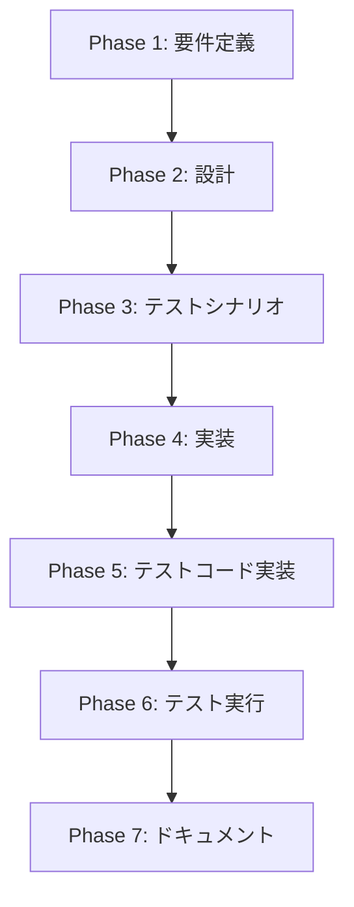

# Claude Agent 実行ログ

生成日時: 2025/12/6 10:22:51

---

## Turn 1: システム初期化

**セッションID**: `622b5e89-d039-4d1c-a275-132b73ae04aa`
**モデル**: claude-sonnet-4-5-20250929
**権限モード**: bypassPermissions
**利用可能ツール**: Task, Bash, Glob, Grep, ExitPlanMode, Read, Edit, Write, NotebookEdit, WebFetch, TodoWrite, WebSearch, BashOutput, KillShell, Skill, SlashCommand

## Turn 2: AI応答

以下、GitHubのIssue #261の情報をもとに、プロジェクト計画書を作成します。

---

# プロジェクト計画書 - Issue #261: feat(cli): Add finalize command for workflow completion

## 1. Issue分析

### 1.1 複雑度

**複雑度**: 中程度

**理由**:
- 新規コマンド（`finalize`）の追加だが、既存モジュール（`MetadataManager`、`ArtifactCleaner`、`PullRequestClient`、`SquashManager`）を組み合わせて実装可能
- `SquashManager` の `PhaseContext` 依存解消など、既存コードの修正が必要
- PR ドラフト解除（GraphQL API または `gh` コマンド）とマージ先ブランチ変更（REST API）の新規実装が必要
- 5つのステップを順次実行する制御フローの設計が必要

### 1.2 見積もり工数

**総工数**: 12~16時間

**内訳**:
- Phase 1（要件定義）: 1~2時間
- Phase 2（設計）: 2~3時間
- Phase 3（テストシナリオ）: 1~2時間
- Phase 4（実装）: 4~6時間
- Phase 5（テストコード実装）: 2~3時間
- Phase 6（テスト実行）: 1時間
- Phase 7（ドキュメント）: 1時間

**根拠**:
- 既存実装を再利用できるため、ゼロから実装するよりも工数を削減可能
- 新規API実装（ドラフト解除、ベースブランチ変更）はシンプルなため、各1~2時間程度
- Job DSL のデフォルト値変更は軽微な修正（30分程度）

### 1.3 リスク評価

**リスク**: 中

**理由**:
- GraphQL API または `gh` コマンドによるドラフト解除の実装リスク（中）
- `SquashManager` の `PhaseContext` 依存解消による既存機能への影響リスク（中）
- 5ステップの制御フローでエラーハンドリングが複雑化する可能性（低）
- Job DSL 変更による既存ジョブへの影響（低）

---

## 2. 実装戦略判断

### 2.1 実装戦略: CREATE

**判断根拠**:
- 新規コマンド（`finalize`）を作成
- 新規ファイル（`src/commands/finalize.ts`）を作成
- 既存モジュール（`MetadataManager`、`ArtifactCleaner`、`PullRequestClient`、`SquashManager`）を組み合わせて実装
- 一部の既存モジュール（`SquashManager`、`PullRequestClient`）には拡張が必要だが、主体は新規ファイルの作成

### 2.2 テスト戦略: UNIT_INTEGRATION

**判断根拠**:
- ユニットテスト: 各ステップのロジック（base_commit取得、クリーンアップ、スカッシュ、PR更新、ドラフト解除）を個別にテスト
- インテグレーションテスト: 5ステップ全体の統合フローをテスト（実際のGit操作、GitHub API呼び出しをモック）
- BDDテストは不要（エンドユーザー向けUIではなく、CLI開発者向け機能）

### 2.3 テストコード戦略: CREATE_TEST

**判断根拠**:
- 新規コマンド（`finalize`）の追加に伴い、新規テストファイル（`tests/unit/commands/finalize.test.ts`、`tests/integration/commands/finalize.test.ts`）を作成
- 既存テストファイルの拡張は不要（既存機能への影響は限定的）

---

## 3. 影響範囲分析

### 3.1 既存コードへの影響

**変更が必要なファイル・モジュール**:

| ファイル | 変更内容 |
|---------|---------|
| `src/commands/finalize.ts` | 新規作成 |
| `src/main.ts` | `finalize` コマンドの追加 |
| `src/core/git/squash-manager.ts` | `PhaseContext` 依存解消（finalize用のシンプルなコンテキストで動作） |
| `src/core/github/pull-request-client.ts` | `markPRReady()` と `updateBaseBranch()` の追加 |
| `jenkins/jobs/dsl/ai-workflow/ai_workflow_all_phases_job.groovy` | `SQUASH_ON_COMPLETE` デフォルト値を `false` に変更 |
| `jenkins/jobs/dsl/ai-workflow/ai_workflow_preset_job.groovy` | `SQUASH_ON_COMPLETE` デフォルト値を `false` に変更 |

### 3.2 依存関係の変更

**新規依存の追加**:
- なし（既存の `@octokit/rest`、`simple-git` を使用）

**既存依存の変更**:
- なし

### 3.3 マイグレーション要否

**不要**: データベーススキーマ変更、設定ファイル変更なし

---

## 4. タスク分割

### Phase 1: 要件定義 (見積もり: 1~2h)

- [ ] Task 1-1: Issueの詳細分析とユースケースの洗い出し (0.5~1h)
  - finalize コマンドの5つのステップを確認
  - 各ステップの入力・出力を明確化
  - エラーケースの洗い出し（base_commit 不在、PR番号取得失敗、etc.）
- [ ] Task 1-2: CLI オプションの仕様確定 (0.5~1h)
  - `--issue`、`--dry-run`、`--skip-squash`、`--skip-pr-update`、`--base-branch` の挙動を定義
  - デフォルト値の決定（`--base-branch` のデフォルトは `main`）

### Phase 2: 設計 (見積もり: 2~3h)

- [ ] Task 2-1: finalize コマンドの制御フロー設計 (1~1.5h)
  - 5ステップの実行順序とエラーハンドリング設計
  - `--dry-run` モードの挙動設計（各ステップでプレビュー表示）
  - `--skip-squash`、`--skip-pr-update` オプションの条件分岐設計
- [ ] Task 2-2: SquashManager の PhaseContext 依存解消設計 (0.5~1h)
  - finalize 用のシンプルなコンテキスト（`FinalizeContext`）を定義
  - フォールバックメッセージ生成ロジックの設計
- [ ] Task 2-3: PullRequestClient への新規メソッド追加設計 (0.5~1h)
  - `markPRReady()`: GraphQL mutation または `gh pr ready` コマンド実行
  - `updateBaseBranch()`: REST API の PATCH リクエスト

### Phase 3: テストシナリオ (見積もり: 1~2h)

- [ ] Task 3-1: ユニットテストのシナリオ設計 (0.5~1h)
  - `handleFinalizeCommand()` の各ステップを個別にテスト
  - `markPRReady()` と `updateBaseBranch()` の成功・失敗ケース
  - `--dry-run`、`--skip-squash`、`--skip-pr-update` オプションの挙動確認
- [ ] Task 3-2: インテグレーションテストのシナリオ設計 (0.5~1h)
  - 5ステップ全体の統合フロー（モックを使用）
  - base_commit 不在時のエラーハンドリング
  - PR番号取得失敗時のエラーハンドリング

### Phase 4: 実装 (見積もり: 4~6h)

- [ ] Task 4-1: `src/commands/finalize.ts` の作成 (2~3h)
  - `FinalizeCommandOptions` インターフェースの定義
  - `handleFinalizeCommand()` 関数の実装（5ステップの制御フロー）
  - `--dry-run` モードのプレビュー出力
- [ ] Task 4-2: `SquashManager` の PhaseContext 依存解消 (1~1.5h)
  - `FinalizeContext` の作成
  - `squashCommits()` メソッドの修正（PhaseContext → FinalizeContext）
- [ ] Task 4-3: `PullRequestClient` への新規メソッド追加 (1~1.5h)
  - `markPRReady()` の実装（GraphQL mutation または `gh pr ready`）
  - `updateBaseBranch()` の実装（REST API の PATCH）
- [ ] Task 4-4: `src/main.ts` に finalize コマンドを追加 (0.5h)
  - `commander` の設定
  - `handleFinalizeCommand()` の呼び出し
- [ ] Task 4-5: Job DSL のデフォルト値変更 (0.5h)
  - `ai_workflow_all_phases_job.groovy` の `SQUASH_ON_COMPLETE` を `false` に変更
  - `ai_workflow_preset_job.groovy` の `SQUASH_ON_COMPLETE` を `false` に変更

### Phase 5: テストコード実装 (見積もり: 2~3h)

- [ ] Task 5-1: ユニットテストの実装 (1~1.5h)
  - `tests/unit/commands/finalize.test.ts` の作成
  - 各ステップのロジックテスト（モックを使用）
  - オプション（`--dry-run`、`--skip-squash`、`--skip-pr-update`）の挙動確認
- [ ] Task 5-2: インテグレーションテストの実装 (1~1.5h)
  - `tests/integration/commands/finalize.test.ts` の作成
  - 5ステップ全体の統合フローテスト
  - エラーハンドリングのテスト

### Phase 6: テスト実行 (見積もり: 1h)

- [ ] Task 6-1: ユニットテストの実行とカバレッジ確認 (0.5h)
  - `npm run test:unit` でテスト実行
  - カバレッジレポート確認（目標: 80%以上）
- [ ] Task 6-2: インテグレーションテストの実行 (0.5h)
  - `npm run test:integration` でテスト実行
  - 失敗したテストケースのデバッグ

### Phase 7: ドキュメント (見積もり: 1h)

- [ ] Task 7-1: README.md の更新 (0.5h)
  - `finalize` コマンドの説明追加
  - CLI オプションの説明追加
- [ ] Task 7-2: CLAUDE.md の更新 (0.5h)
  - `finalize` コマンドの追加を記録
  - Job DSL のデフォルト値変更を記録

---

## 5. 依存関係

**タスク間の依存関係**:
- Phase 2（設計）は Phase 1（要件定義）の完了後に開始
- Phase 4（実装）は Phase 2（設計）の完了後に開始
- Phase 5（テストコード実装）は Phase 4（実装）の完了後に開始
- Phase 6（テスト実行）は Phase 5（テストコード実装）の完了後に開始
- Phase 7（ドキュメント）は Phase 6（テスト実行）の完了後に開始

---

## 6. リスクと軽減策

### リスク1: GraphQL API によるドラフト解除の実装難易度

- **影響度**: 中
- **確率**: 中
- **軽減策**: 
  - GraphQL API の実装が困難な場合、`gh pr ready <PR_NUMBER>` コマンドを subprocess で実行する方法にフォールバック
  - 事前に `gh` コマンドの動作確認を実施

### リスク2: SquashManager の PhaseContext 依存解消による既存機能への影響

- **影響度**: 中
- **確率**: 低
- **軽減策**:
  - 既存の `squashCommits()` メソッドは変更せず、finalize 用のオーバーロードメソッドを追加
  - 既存テストを全実行して影響がないことを確認

### リスク3: base_commit 消失後のスカッシュ失敗

- **影響度**: 高
- **確率**: 低
- **軽減策**:
  - Step 1 で base_commit をメモリに保持し、Step 2 の削除後も使用可能にする
  - base_commit が取得できない場合はエラーを返し、finalize を中止

### リスク4: Job DSL 変更による既存ジョブへの影響

- **影響度**: 低
- **確率**: 低
- **軽減策**:
  - デフォルト値の変更のみであり、既存ジョブの挙動には影響しない（パラメータを明示的に指定している場合は変更なし）
  - Jenkins Job の動作確認を実施

---

## 7. 品質ゲート

### Phase 1: 要件定義

- [ ] finalize コマンドの5つのステップが明確に定義されている
- [ ] CLI オプション（`--issue`、`--dry-run`、`--skip-squash`、`--skip-pr-update`、`--base-branch`）の仕様が確定している
- [ ] エラーケースが洗い出されている

### Phase 2: 設計

- [ ] 実装戦略（CREATE）の判断根拠が明記されている
- [ ] テスト戦略（UNIT_INTEGRATION）の判断根拠が明記されている
- [ ] テストコード戦略（CREATE_TEST）の判断根拠が明記されている
- [ ] 5ステップの制御フローが設計されている
- [ ] `SquashManager` の PhaseContext 依存解消設計が完了している
- [ ] `PullRequestClient` への新規メソッド追加設計が完了している

### Phase 3: テストシナリオ

- [ ] ユニットテストのシナリオが定義されている（各ステップ、オプション挙動）
- [ ] インテグレーションテストのシナリオが定義されている（5ステップ統合フロー）
- [ ] エラーハンドリングのテストシナリオが定義されている

### Phase 4: 実装

- [ ] `src/commands/finalize.ts` が作成されている
- [ ] `handleFinalizeCommand()` が5ステップを順次実行している
- [ ] `--dry-run`、`--skip-squash`、`--skip-pr-update` オプションが動作している
- [ ] `SquashManager` の PhaseContext 依存が解消されている
- [ ] `PullRequestClient.markPRReady()` が実装されている
- [ ] `PullRequestClient.updateBaseBranch()` が実装されている
- [ ] Job DSL のデフォルト値が変更されている（2ファイル）

### Phase 5: テストコード実装

- [ ] ユニットテストファイル（`tests/unit/commands/finalize.test.ts`）が作成されている
- [ ] インテグレーションテストファイル（`tests/integration/commands/finalize.test.ts`）が作成されている
- [ ] 各テストケースが明確な検証項目を持っている

### Phase 6: テスト実行

- [ ] ユニットテストが全て成功している
- [ ] インテグレーションテストが全て成功している
- [ ] コードカバレッジが80%以上である

### Phase 7: ドキュメント

- [ ] README.md に `finalize` コマンドの説明が追加されている
- [ ] CLAUDE.md に変更内容が記録されている
- [ ] CLI オプションの説明が明確である

---

## まとめ

本プロジェクト計画書は、Issue #261（finalize コマンドの追加）の実装を7つのフェーズに分割し、各フェーズのタスクを明確に定義しています。

**総工数**: 12~16時間  
**実装戦略**: CREATE（新規コマンド作成）  
**テスト戦略**: UNIT_INTEGRATION  
**リスク**: 中（GraphQL API実装、PhaseContext依存解消）

すべてのタスクはチェックリスト形式で記載されており、Review Phaseで完了判定が可能です。

## Turn 3: 実行完了

**ステータス**: success
**所要時間**: 82837ms
**ターン数**: 4

以下、GitHubのIssue #261の情報をもとに、プロジェクト計画書を作成します。

---

# プロジェクト計画書 - Issue #261: feat(cli): Add finalize command for workflow completion

## 1. Issue分析

### 1.1 複雑度

**複雑度**: 中程度

**理由**:
- 新規コマンド（`finalize`）の追加だが、既存モジュール（`MetadataManager`、`ArtifactCleaner`、`PullRequestClient`、`SquashManager`）を組み合わせて実装可能
- `SquashManager` の `PhaseContext` 依存解消など、既存コードの修正が必要
- PR ドラフト解除（GraphQL API または `gh` コマンド）とマージ先ブランチ変更（REST API）の新規実装が必要
- 5つのステップを順次実行する制御フローの設計が必要

### 1.2 見積もり工数

**総工数**: 12~16時間

**内訳**:
- Phase 1（要件定義）: 1~2時間
- Phase 2（設計）: 2~3時間
- Phase 3（テストシナリオ）: 1~2時間
- Phase 4（実装）: 4~6時間
- Phase 5（テストコード実装）: 2~3時間
- Phase 6（テスト実行）: 1時間
- Phase 7（ドキュメント）: 1時間

**根拠**:
- 既存実装を再利用できるため、ゼロから実装するよりも工数を削減可能
- 新規API実装（ドラフト解除、ベースブランチ変更）はシンプルなため、各1~2時間程度
- Job DSL のデフォルト値変更は軽微な修正（30分程度）

### 1.3 リスク評価

**リスク**: 中

**理由**:
- GraphQL API または `gh` コマンドによるドラフト解除の実装リスク（中）
- `SquashManager` の `PhaseContext` 依存解消による既存機能への影響リスク（中）
- 5ステップの制御フローでエラーハンドリングが複雑化する可能性（低）
- Job DSL 変更による既存ジョブへの影響（低）

---

## 2. 実装戦略判断

### 2.1 実装戦略: CREATE

**判断根拠**:
- 新規コマンド（`finalize`）を作成
- 新規ファイル（`src/commands/finalize.ts`）を作成
- 既存モジュール（`MetadataManager`、`ArtifactCleaner`、`PullRequestClient`、`SquashManager`）を組み合わせて実装
- 一部の既存モジュール（`SquashManager`、`PullRequestClient`）には拡張が必要だが、主体は新規ファイルの作成

### 2.2 テスト戦略: UNIT_INTEGRATION

**判断根拠**:
- ユニットテスト: 各ステップのロジック（base_commit取得、クリーンアップ、スカッシュ、PR更新、ドラフト解除）を個別にテスト
- インテグレーションテスト: 5ステップ全体の統合フローをテスト（実際のGit操作、GitHub API呼び出しをモック）
- BDDテストは不要（エンドユーザー向けUIではなく、CLI開発者向け機能）

### 2.3 テストコード戦略: CREATE_TEST

**判断根拠**:
- 新規コマンド（`finalize`）の追加に伴い、新規テストファイル（`tests/unit/commands/finalize.test.ts`、`tests/integration/commands/finalize.test.ts`）を作成
- 既存テストファイルの拡張は不要（既存機能への影響は限定的）

---

## 3. 影響範囲分析

### 3.1 既存コードへの影響

**変更が必要なファイル・モジュール**:

| ファイル | 変更内容 |
|---------|---------|
| `src/commands/finalize.ts` | 新規作成 |
| `src/main.ts` | `finalize` コマンドの追加 |
| `src/core/git/squash-manager.ts` | `PhaseContext` 依存解消（finalize用のシンプルなコンテキストで動作） |
| `src/core/github/pull-request-client.ts` | `markPRReady()` と `updateBaseBranch()` の追加 |
| `jenkins/jobs/dsl/ai-workflow/ai_workflow_all_phases_job.groovy` | `SQUASH_ON_COMPLETE` デフォルト値を `false` に変更 |
| `jenkins/jobs/dsl/ai-workflow/ai_workflow_preset_job.groovy` | `SQUASH_ON_COMPLETE` デフォルト値を `false` に変更 |

### 3.2 依存関係の変更

**新規依存の追加**:
- なし（既存の `@octokit/rest`、`simple-git` を使用）

**既存依存の変更**:
- なし

### 3.3 マイグレーション要否

**不要**: データベーススキーマ変更、設定ファイル変更なし

---

## 4. タスク分割

### Phase 1: 要件定義 (見積もり: 1~2h)

- [ ] Task 1-1: Issueの詳細分析とユースケースの洗い出し (0.5~1h)
  - finalize コマンドの5つのステップを確認
  - 各ステップの入力・出力を明確化
  - エラーケースの洗い出し（base_commit 不在、PR番号取得失敗、etc.）
- [ ] Task 1-2: CLI オプションの仕様確定 (0.5~1h)
  - `--issue`、`--dry-run`、`--skip-squash`、`--skip-pr-update`、`--base-branch` の挙動を定義
  - デフォルト値の決定（`--base-branch` のデフォルトは `main`）

### Phase 2: 設計 (見積もり: 2~3h)

- [ ] Task 2-1: finalize コマンドの制御フロー設計 (1~1.5h)
  - 5ステップの実行順序とエラーハンドリング設計
  - `--dry-run` モードの挙動設計（各ステップでプレビュー表示）
  - `--skip-squash`、`--skip-pr-update` オプションの条件分岐設計
- [ ] Task 2-2: SquashManager の PhaseContext 依存解消設計 (0.5~1h)
  - finalize 用のシンプルなコンテキスト（`FinalizeContext`）を定義
  - フォールバックメッセージ生成ロジックの設計
- [ ] Task 2-3: PullRequestClient への新規メソッド追加設計 (0.5~1h)
  - `markPRReady()`: GraphQL mutation または `gh pr ready` コマンド実行
  - `updateBaseBranch()`: REST API の PATCH リクエスト

### Phase 3: テストシナリオ (見積もり: 1~2h)

- [ ] Task 3-1: ユニットテストのシナリオ設計 (0.5~1h)
  - `handleFinalizeCommand()` の各ステップを個別にテスト
  - `markPRReady()` と `updateBaseBranch()` の成功・失敗ケース
  - `--dry-run`、`--skip-squash`、`--skip-pr-update` オプションの挙動確認
- [ ] Task 3-2: インテグレーションテストのシナリオ設計 (0.5~1h)
  - 5ステップ全体の統合フロー（モックを使用）
  - base_commit 不在時のエラーハンドリング
  - PR番号取得失敗時のエラーハンドリング

### Phase 4: 実装 (見積もり: 4~6h)

- [ ] Task 4-1: `src/commands/finalize.ts` の作成 (2~3h)
  - `FinalizeCommandOptions` インターフェースの定義
  - `handleFinalizeCommand()` 関数の実装（5ステップの制御フロー）
  - `--dry-run` モードのプレビュー出力
- [ ] Task 4-2: `SquashManager` の PhaseContext 依存解消 (1~1.5h)
  - `FinalizeContext` の作成
  - `squashCommits()` メソッドの修正（PhaseContext → FinalizeContext）
- [ ] Task 4-3: `PullRequestClient` への新規メソッド追加 (1~1.5h)
  - `markPRReady()` の実装（GraphQL mutation または `gh pr ready`）
  - `updateBaseBranch()` の実装（REST API の PATCH）
- [ ] Task 4-4: `src/main.ts` に finalize コマンドを追加 (0.5h)
  - `commander` の設定
  - `handleFinalizeCommand()` の呼び出し
- [ ] Task 4-5: Job DSL のデフォルト値変更 (0.5h)
  - `ai_workflow_all_phases_job.groovy` の `SQUASH_ON_COMPLETE` を `false` に変更
  - `ai_workflow_preset_job.groovy` の `SQUASH_ON_COMPLETE` を `false` に変更

### Phase 5: テストコード実装 (見積もり: 2~3h)

- [ ] Task 5-1: ユニットテストの実装 (1~1.5h)
  - `tests/unit/commands/finalize.test.ts` の作成
  - 各ステップのロジックテスト（モックを使用）
  - オプション（`--dry-run`、`--skip-squash`、`--skip-pr-update`）の挙動確認
- [ ] Task 5-2: インテグレーションテストの実装 (1~1.5h)
  - `tests/integration/commands/finalize.test.ts` の作成
  - 5ステップ全体の統合フローテスト
  - エラーハンドリングのテスト

### Phase 6: テスト実行 (見積もり: 1h)

- [ ] Task 6-1: ユニットテストの実行とカバレッジ確認 (0.5h)
  - `npm run test:unit` でテスト実行
  - カバレッジレポート確認（目標: 80%以上）
- [ ] Task 6-2: インテグレーションテストの実行 (0.5h)
  - `npm run test:integration` でテスト実行
  - 失敗したテストケースのデバッグ

### Phase 7: ドキュメント (見積もり: 1h)

- [ ] Task 7-1: README.md の更新 (0.5h)
  - `finalize` コマンドの説明追加
  - CLI オプションの説明追加
- [ ] Task 7-2: CLAUDE.md の更新 (0.5h)
  - `finalize` コマンドの追加を記録
  - Job DSL のデフォルト値変更を記録

---

## 5. 依存関係

**タスク間の依存関係**:
- Phase 2（設計）は Phase 1（要件定義）の完了後に開始
- Phase 4（実装）は Phase 2（設計）の完了後に開始
- Phase 5（テストコード実装）は Phase 4（実装）の完了後に開始
- Phase 6（テスト実行）は Phase 5（テストコード実装）の完了後に開始
- Phase 7（ドキュメント）は Phase 6（テスト実行）の完了後に開始

---

## 6. リスクと軽減策

### リスク1: GraphQL API によるドラフト解除の実装難易度

- **影響度**: 中
- **確率**: 中
- **軽減策**: 
  - GraphQL API の実装が困難な場合、`gh pr ready <PR_NUMBER>` コマンドを subprocess で実行する方法にフォールバック
  - 事前に `gh` コマンドの動作確認を実施

### リスク2: SquashManager の PhaseContext 依存解消による既存機能への影響

- **影響度**: 中
- **確率**: 低
- **軽減策**:
  - 既存の `squashCommits()` メソッドは変更せず、finalize 用のオーバーロードメソッドを追加
  - 既存テストを全実行して影響がないことを確認

### リスク3: base_commit 消失後のスカッシュ失敗

- **影響度**: 高
- **確率**: 低
- **軽減策**:
  - Step 1 で base_commit をメモリに保持し、Step 2 の削除後も使用可能にする
  - base_commit が取得できない場合はエラーを返し、finalize を中止

### リスク4: Job DSL 変更による既存ジョブへの影響

- **影響度**: 低
- **確率**: 低
- **軽減策**:
  - デフォルト値の変更のみであり、既存ジョブの挙動には影響しない（パラメータを明示的に指定している場合は変更なし）
  - Jenkins Job の動作確認を実施

---

## 7. 品質ゲート

### Phase 1: 要件定義

- [ ] finalize コマンドの5つのステップが明確に定義されている
- [ ] CLI オプション（`--issue`、`--dry-run`、`--skip-squash`、`--skip-pr-update`、`--base-branch`）の仕様が確定している
- [ ] エラーケースが洗い出されている

### Phase 2: 設計

- [ ] 実装戦略（CREATE）の判断根拠が明記されている
- [ ] テスト戦略（UNIT_INTEGRATION）の判断根拠が明記されている
- [ ] テストコード戦略（CREATE_TEST）の判断根拠が明記されている
- [ ] 5ステップの制御フローが設計されている
- [ ] `SquashManager` の PhaseContext 依存解消設計が完了している
- [ ] `PullRequestClient` への新規メソッド追加設計が完了している

### Phase 3: テストシナリオ

- [ ] ユニットテストのシナリオが定義されている（各ステップ、オプション挙動）
- [ ] インテグレーションテストのシナリオが定義されている（5ステップ統合フロー）
- [ ] エラーハンドリングのテストシナリオが定義されている

### Phase 4: 実装

- [ ] `src/commands/finalize.ts` が作成されている
- [ ] `handleFinalizeCommand()` が5ステップを順次実行している
- [ ] `--dry-run`、`--skip-squash`、`--skip-pr-update` オプションが動作している
- [ ] `SquashManager` の PhaseContext 依存が解消されている
- [ ] `PullRequestClient.markPRReady()` が実装されている
- [ ] `PullRequestClient.updateBaseBranch()` が実装されている
- [ ] Job DSL のデフォルト値が変更されている（2ファイル）

### Phase 5: テストコード実装

- [ ] ユニットテストファイル（`tests/unit/commands/finalize.test.ts`）が作成されている
- [ ] インテグレーションテストファイル（`tests/integration/commands/finalize.test.ts`）が作成されている
- [ ] 各テストケースが明確な検証項目を持っている

### Phase 6: テスト実行

- [ ] ユニットテストが全て成功している
- [ ] インテグレーションテストが全て成功している
- [ ] コードカバレッジが80%以上である

### Phase 7: ドキュメント

- [ ] README.md に `finalize` コマンドの説明が追加されている
- [ ] CLAUDE.md に変更内容が記録されている
- [ ] CLI オプションの説明が明確である

---

## まとめ

本プロジェクト計画書は、Issue #261（finalize コマンドの追加）の実装を7つのフェーズに分割し、各フェーズのタスクを明確に定義しています。

**総工数**: 12~16時間  
**実装戦略**: CREATE（新規コマンド作成）  
**テスト戦略**: UNIT_INTEGRATION  
**リスク**: 中（GraphQL API実装、PhaseContext依存解消）

すべてのタスクはチェックリスト形式で記載されており、Review Phaseで完了判定が可能です。

---

**経過時間**: 84272ms
**開始**: 2025-12-06T10:22:51.323Z
**終了**: 2025-12-06T10:24:15.595Z