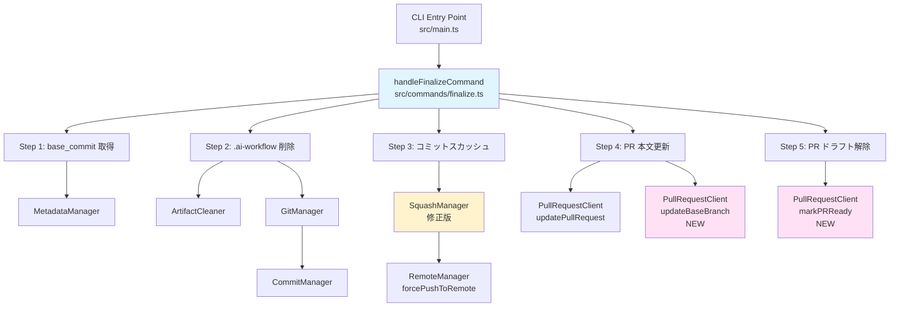
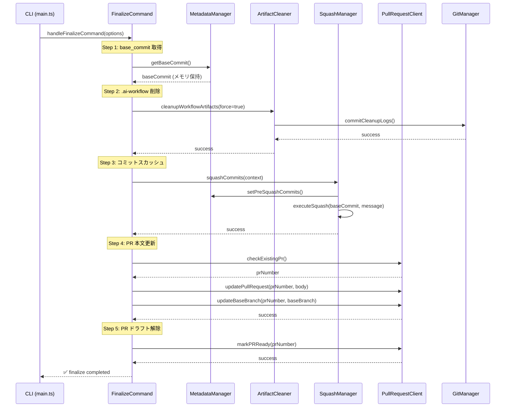
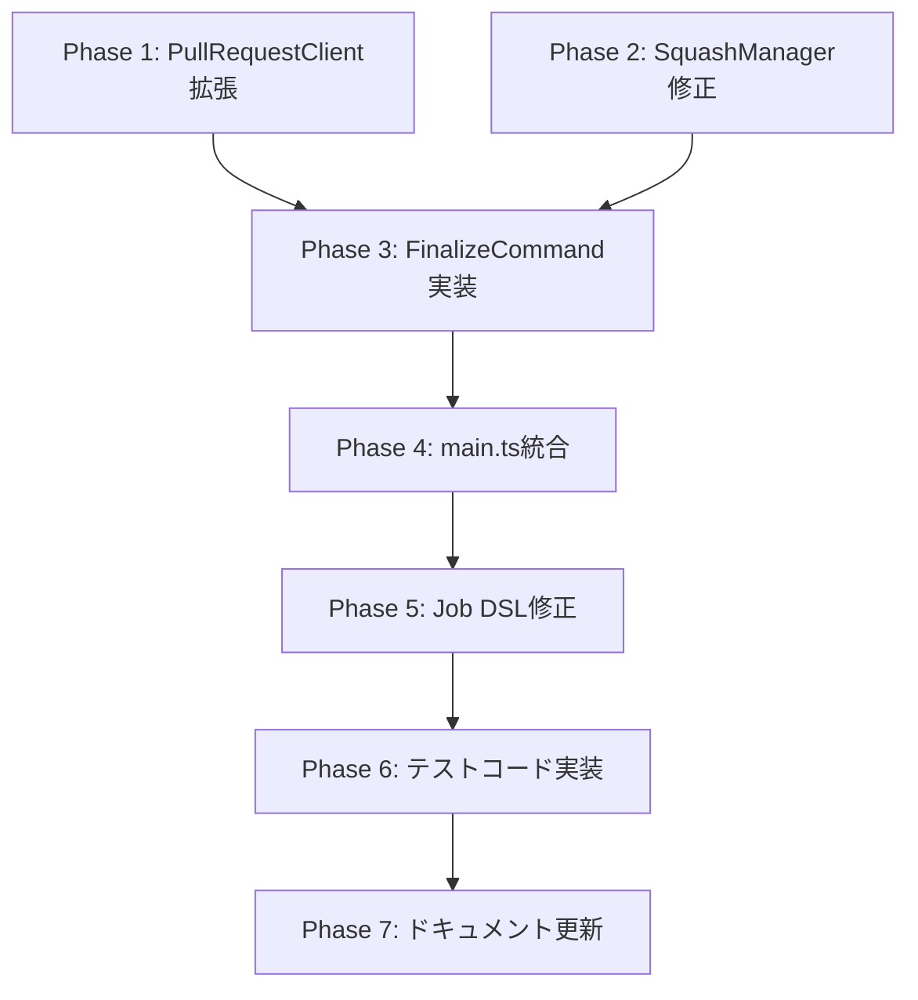

# 詳細設計書 - Issue #261: feat(cli): Add finalize command for workflow completion

**作成日**: 2025-01-30
**Issue番号**: #261
**Issue URL**: https://github.com/tielec/ai-workflow-agent/issues/261

---

## 目次

1. [実装戦略判断](#1-実装戦略判断)
2. [テスト戦略判断](#2-テスト戦略判断)
3. [テストコード戦略判断](#3-テストコード戦略判断)
4. [アーキテクチャ設計](#4-アーキテクチャ設計)
5. [影響範囲分析](#5-影響範囲分析)
6. [変更・追加ファイルリスト](#6-変更追加ファイルリスト)
7. [詳細設計](#7-詳細設計)
8. [セキュリティ考慮事項](#8-セキュリティ考慮事項)
9. [非機能要件への対応](#9-非機能要件への対応)
10. [実装の順序](#10-実装の順序)

---

## 1. 実装戦略判断

### 実装戦略: **CREATE（新規作成）**

**判断根拠**:

1. **新規コマンドの追加**
   - `finalize` コマンドは完全に新しい CLI コマンドであり、既存の `init`, `execute`, `cleanup`, `rollback` コマンドとは独立した機能を提供する
   - 新規ファイル `src/commands/finalize.ts` を作成し、独立したコマンドハンドラとして実装

2. **既存モジュールの統合による実装**
   - 既存の `MetadataManager`, `ArtifactCleaner`, `SquashManager`, `PullRequestClient` を**組み合わせて**使用するが、これらのモジュールへの変更は限定的（新規メソッド追加のみ）
   - 既存モジュールの**拡張**ではなく、既存機能を**統合**して新しいワークフローを構築する

3. **新規ファイルの作成数が主体**
   - 新規作成: `src/commands/finalize.ts`（コマンドハンドラ）
   - 修正: `PullRequestClient`（2メソッド追加）、`SquashManager`（PhaseContext依存解消）
   - 修正: `src/main.ts`（コマンド登録）
   - Job DSL 修正: 2ファイル（デフォルト値変更のみ）

4. **既存コードへの影響は限定的**
   - `cleanup` コマンドや `execute` コマンドの既存機能には影響しない
   - 新規メソッド追加による拡張は、後方互換性を保つ形で実装

**結論**: 新規ファイルの作成が主体であり、既存機能への影響が限定的なため、**CREATE（新規作成）** 戦略が適切。

---

## 2. テスト戦略判断

### テスト戦略: **UNIT_INTEGRATION**

**判断根拠**:

1. **ユニットテストの必要性**
   - 各ステップのロジック（Step 1-5）を個別にテスト可能
   - `PullRequestClient.markPRReady()` と `PullRequestClient.updateBaseBranch()` の新規メソッドをユニットテストで検証
   - CLI オプション（`--dry-run`, `--skip-squash`, `--skip-pr-update`, `--base-branch`）の挙動をユニットテストで確認
   - モックを使用して、エラーケース（base_commit 不在、PR番号取得失敗）を網羅的にテスト

2. **インテグレーションテストの必要性**
   - 5つのステップを順次実行する統合フローをテスト
   - 実際の Git 操作、GitHub API 呼び出しをモックして、エンドツーエンドのワークフローを検証
   - `MetadataManager`, `ArtifactCleaner`, `SquashManager`, `PullRequestClient` の統合動作を確認

3. **BDDテストは不要**
   - エンドユーザー向けUIではなく、CLI開発者向け機能
   - ユーザーストーリーよりも技術的な正確性が重視される
   - ユニット + インテグレーションで十分なカバレッジが得られる

**結論**: ユニットテストで個別ロジックを検証し、インテグレーションテストで統合フローを確認する **UNIT_INTEGRATION** 戦略が最適。

---

## 3. テストコード戦略判断

### テストコード戦略: **CREATE_TEST（新規テスト作成）**

**判断根拠**:

1. **新規コマンドの追加**
   - `finalize` コマンドは完全に新しい機能であり、既存テストファイルとの関連性が低い
   - 新規テストファイルを作成することで、テストコードの可読性と保守性が向上

2. **既存テストファイルへの影響なし**
   - `PullRequestClient` への新規メソッド追加は、既存メソッドのテストには影響しない
   - `SquashManager` の修正も、PhaseContext 依存解消による内部実装の変更のみであり、既存テストの拡張は不要

3. **テストファイルの新規作成**
   - **ユニットテスト**: `tests/unit/commands/finalize.test.ts`
   - **インテグレーションテスト**: `tests/integration/commands/finalize.test.ts`
   - 既存の `tests/unit/core/github/pull-request-client.test.ts` への追加は検討できるが、新規メソッドのテストは独立したテストケースとして実装可能

**結論**: 新規コマンドに対応する新規テストファイルを作成する **CREATE_TEST** 戦略が適切。

---

## 4. アーキテクチャ設計

### 4.1 システム全体図



### 4.2 コンポーネント間の関係

| コンポーネント | 役割 | 依存先 |
|---------------|------|--------|
| `handleFinalizeCommand` | 5ステップのオーケストレーション | MetadataManager, ArtifactCleaner, SquashManager, PullRequestClient, GitManager |
| `MetadataManager` | base_commit 取得、メタデータ更新 | - |
| `ArtifactCleaner` | ワークフローディレクトリ削除 | MetadataManager |
| `SquashManager` | コミットスカッシュ | MetadataManager, CommitManager, RemoteManager, Codex/Claude |
| `PullRequestClient` | PR 操作（本文更新、ドラフト解除、ベースブランチ変更） | Octokit |
| `GitManager` | Git コミット＆プッシュ | CommitManager, RemoteManager |

### 4.3 データフロー



---

## 5. 影響範囲分析

### 5.1 既存コードへの影響

| ファイル | 変更種別 | 変更内容 | 影響範囲 |
|---------|---------|---------|---------|
| `src/commands/finalize.ts` | **新規作成** | finalize コマンドハンドラの実装 | なし |
| `src/main.ts` | **修正** | `finalize` コマンドの登録（commander） | 既存コマンドへの影響なし |
| `src/core/git/squash-manager.ts` | **修正** | PhaseContext 依存解消（オーバーロードメソッド追加） | 既存の `squashCommits(context: PhaseContext)` には影響なし |
| `src/core/github/pull-request-client.ts` | **修正** | `markPRReady()` と `updateBaseBranch()` の追加 | 既存メソッドには影響なし |
| `jenkins/jobs/dsl/ai-workflow/ai_workflow_all_phases_job.groovy` | **修正** | `SQUASH_ON_COMPLETE` デフォルト値を `false` に変更 | 既存ジョブは明示的に指定している場合は影響なし |
| `jenkins/jobs/dsl/ai-workflow/ai_workflow_preset_job.groovy` | **修正** | `SQUASH_ON_COMPLETE` デフォルト値を `false` に変更 | 既存ジョブは明示的に指定している場合は影響なし |

### 5.2 依存関係の変更

**新規依存の追加**: なし（既存の `@octokit/rest`, `simple-git`, `fs-extra` を使用）

**既存依存の変更**: なし

### 5.3 マイグレーション要否

**不要**: データベーススキーマ変更、設定ファイル変更なし

---

## 6. 変更・追加ファイルリスト

### 6.1 新規作成ファイル

| ファイルパス | 説明 |
|-------------|------|
| `src/commands/finalize.ts` | finalize コマンドハンドラ |
| `tests/unit/commands/finalize.test.ts` | ユニットテスト |
| `tests/integration/commands/finalize.test.ts` | インテグレーションテスト |

### 6.2 修正が必要な既存ファイル

| ファイルパス | 修正内容 |
|-------------|---------|
| `src/main.ts` | `finalize` コマンドの登録（commander の `.command()` 呼び出し） |
| `src/core/git/squash-manager.ts` | PhaseContext 依存解消のためのオーバーロードメソッド追加 |
| `src/core/github/pull-request-client.ts` | `markPRReady()` と `updateBaseBranch()` メソッドの追加 |
| `jenkins/jobs/dsl/ai-workflow/ai_workflow_all_phases_job.groovy` | `SQUASH_ON_COMPLETE` デフォルト値を `false` に変更 |
| `jenkins/jobs/dsl/ai-workflow/ai_workflow_preset_job.groovy` | `SQUASH_ON_COMPLETE` デフォルト値を `false` に変更 |

### 6.3 削除が必要なファイル

なし

---

## 7. 詳細設計

### 7.1 `src/commands/finalize.ts` - finalize コマンドハンドラ

#### 7.1.1 インターフェース設計

```typescript
/**
 * FinalizeCommandOptions - CLI オプションの型定義
 */
export interface FinalizeCommandOptions {
  /** Issue番号（必須） */
  issue: string;

  /** ドライランフラグ（オプション） */
  dryRun?: boolean;

  /** スカッシュをスキップ（オプション） */
  skipSquash?: boolean;

  /** PR更新をスキップ（オプション） */
  skipPrUpdate?: boolean;

  /** PRのマージ先ブランチ（オプション、デフォルト: main） */
  baseBranch?: string;
}
```

#### 7.1.2 主要関数設計

```typescript
/**
 * handleFinalizeCommand - finalize コマンドのエントリーポイント
 *
 * @param options - CLI オプション
 * @throws Error - ステップ実行失敗時
 */
export async function handleFinalizeCommand(options: FinalizeCommandOptions): Promise<void> {
  logger.info('Starting finalize command...');

  // 1. バリデーション
  validateFinalizeOptions(options);

  // 2. メタデータ読み込み
  const { metadataManager, workflowDir } = await loadWorkflowMetadata(options.issue);

  // 3. ドライランモード判定
  if (options.dryRun) {
    await previewFinalize(options, metadataManager);
    return;
  }

  // 4. Step 1: base_commit 取得・一時保存
  const baseCommit = await executeStep1(metadataManager);

  // 5. Step 2: .ai-workflow 削除 + コミット
  await executeStep2(metadataManager, workflowDir, options);

  // 6. Step 3: コミットスカッシュ（--skip-squash でスキップ可能）
  if (!options.skipSquash) {
    await executeStep3(metadataManager, workflowDir, baseCommit, options);
  } else {
    logger.info('Skipping commit squash (--skip-squash option)');
  }

  // 7. Step 4-5: PR 更新とドラフト解除（--skip-pr-update でスキップ可能）
  if (!options.skipPrUpdate) {
    await executeStep4And5(metadataManager, options);
  } else {
    logger.info('Skipping PR update and draft conversion (--skip-pr-update option)');
  }

  logger.info('✅ Finalize completed successfully.');
}
```

#### 7.1.3 各ステップの詳細設計

##### Step 1: base_commit 取得・一時保存

```typescript
/**
 * executeStep1 - base_commit 取得・一時保存
 *
 * @param metadataManager - メタデータマネージャー
 * @returns base_commit ハッシュ
 * @throws Error - base_commit が存在しない場合
 */
async function executeStep1(metadataManager: MetadataManager): Promise<string> {
  logger.info('Step 1: Retrieving base_commit...');

  const baseCommit = metadataManager.getBaseCommit();
  if (!baseCommit) {
    throw new Error(
      'base_commit not found in metadata. ' +
        'Please ensure the workflow was initialized with the "init" command.'
    );
  }

  logger.info(`base_commit: ${baseCommit}`);
  return baseCommit;
}
```

##### Step 2: .ai-workflow 削除 + コミット

```typescript
/**
 * executeStep2 - .ai-workflow ディレクトリ削除 + コミット
 *
 * @param metadataManager - メタデータマネージャー
 * @param workflowDir - ワークフローディレクトリパス
 * @param options - CLI オプション
 */
async function executeStep2(
  metadataManager: MetadataManager,
  workflowDir: string,
  options: FinalizeCommandOptions
): Promise<void> {
  logger.info('Step 2: Cleaning up workflow artifacts...');

  const artifactCleaner = new ArtifactCleaner(metadataManager);

  // force=true で確認プロンプトをスキップ（CI環境でも動作）
  await artifactCleaner.cleanupWorkflowArtifacts(true);

  // Git コミット＆プッシュ
  const gitManager = new GitManager(workflowDir, metadataManager);
  const issueNumber = parseInt(options.issue, 10);

  const commitResult = await gitManager.commitCleanupLogs(issueNumber, 'finalize');
  if (!commitResult.success) {
    throw new Error(commitResult.error ?? 'Commit failed');
  }

  logger.info(`Cleanup committed: ${commitResult.commit_hash}`);

  const pushResult = await gitManager.pushToRemote();
  if (!pushResult.success) {
    throw new Error(pushResult.error ?? 'Push failed');
  }

  logger.info('✅ Step 2 completed: Workflow artifacts cleaned up.');
}
```

##### Step 3: コミットスカッシュ

```typescript
/**
 * executeStep3 - コミットスカッシュ
 *
 * @param metadataManager - メタデータマネージャー
 * @param workflowDir - ワークフローディレクトリパス
 * @param baseCommit - ワークフロー開始時のコミットハッシュ
 * @param options - CLI オプション
 */
async function executeStep3(
  metadataManager: MetadataManager,
  workflowDir: string,
  baseCommit: string,
  options: FinalizeCommandOptions
): Promise<void> {
  logger.info('Step 3: Squashing commits...');

  const gitManager = new GitManager(workflowDir, metadataManager);
  const squashManager = gitManager.getSquashManager();

  // finalize 用のシンプルなコンテキストを作成
  const context: FinalizeContext = {
    issueNumber: parseInt(options.issue, 10),
    baseCommit,
    targetBranch: 'main', // デフォルト
  };

  // SquashManager の新しいオーバーロードメソッドを呼び出し
  await squashManager.squashCommitsForFinalize(context);

  logger.info('✅ Step 3 completed: Commits squashed.');
}
```

##### Step 4-5: PR 更新とドラフト解除

```typescript
/**
 * executeStep4And5 - PR 本文更新とドラフト解除
 *
 * @param metadataManager - メタデータマネージャー
 * @param options - CLI オプション
 */
async function executeStep4And5(
  metadataManager: MetadataManager,
  options: FinalizeCommandOptions
): Promise<void> {
  logger.info('Step 4-5: Updating PR and marking as ready for review...');

  const issueNumber = parseInt(options.issue, 10);

  // GitHub Client 初期化
  const githubClient = createGitHubClient(metadataManager);
  const prClient = githubClient.getPullRequestClient();

  // PR 番号の取得
  const prNumber = await prClient.getPullRequestNumber(issueNumber);
  if (!prNumber) {
    throw new Error(`Pull request not found for issue #${issueNumber}`);
  }

  logger.info(`Found PR #${prNumber}`);

  // Step 4a: PR 本文更新
  const prBody = generateFinalPrBody(metadataManager, issueNumber);
  const updateResult = await prClient.updatePullRequest(prNumber, prBody);
  if (!updateResult.success) {
    throw new Error(`Failed to update PR: ${updateResult.error}`);
  }

  logger.info(`✅ PR #${prNumber} updated with final content.`);

  // Step 4b: マージ先ブランチ変更（--base-branch 指定時のみ）
  if (options.baseBranch && options.baseBranch !== 'main') {
    const baseBranchResult = await prClient.updateBaseBranch(prNumber, options.baseBranch);
    if (!baseBranchResult.success) {
      throw new Error(`Failed to update base branch: ${baseBranchResult.error}`);
    }

    logger.info(`✅ PR #${prNumber} base branch changed to '${options.baseBranch}'.`);
  }

  // Step 5: PR ドラフト解除
  const markReadyResult = await prClient.markPRReady(prNumber);
  if (!markReadyResult.success) {
    throw new Error(`Failed to mark PR as ready: ${markReadyResult.error}`);
  }

  logger.info(`✅ PR #${prNumber} marked as ready for review.`);
}
```

#### 7.1.4 ヘルパー関数設計

##### バリデーション

```typescript
/**
 * validateFinalizeOptions - CLI オプションのバリデーション
 *
 * @param options - CLI オプション
 * @throws Error - バリデーション失敗時
 */
function validateFinalizeOptions(options: FinalizeCommandOptions): void {
  // Issue番号チェック
  if (!options.issue) {
    throw new Error('Error: --issue option is required');
  }

  const issueNum = parseInt(options.issue, 10);
  if (isNaN(issueNum) || issueNum <= 0) {
    throw new Error(`Error: Invalid issue number: ${options.issue}. Must be a positive integer.`);
  }

  // baseBranch チェック（指定されている場合のみ）
  if (options.baseBranch && options.baseBranch.trim().length === 0) {
    throw new Error('Error: --base-branch cannot be empty');
  }
}
```

##### PR 最終本文生成

```typescript
/**
 * generateFinalPrBody - PR 最終本文を生成
 *
 * @param metadataManager - メタデータマネージャー
 * @param issueNumber - Issue番号
 * @returns PR 本文（Markdown形式）
 */
function generateFinalPrBody(metadataManager: MetadataManager, issueNumber: number): string {
  const metadata = metadataManager.getMetadata();

  // 変更サマリー
  const summary = `## 変更サマリー

- Issue番号: #${issueNumber}
- タイトル: ${metadata.issue_info?.title ?? 'Unknown'}
- 完了ステータス: All phases completed
`;

  // 完了フェーズ一覧
  const phases = [
    'planning',
    'requirements',
    'design',
    'test_scenario',
    'implementation',
    'test_implementation',
    'testing',
    'documentation',
    'report',
    'evaluation',
  ];

  const phaseList = phases
    .map((phase) => {
      const status = metadata.phases?.[phase]?.status ?? 'pending';
      const emoji = status === 'completed' ? '✅' : '⏳';
      return `- ${emoji} ${phase}: ${status}`;
    })
    .join('\n');

  // テスト結果（testing フェーズのステータスから取得）
  const testStatus = metadata.phases?.testing?.status === 'completed' ? '✅ Passed' : '⏳ Pending';

  const body = `${summary}

## フェーズステータス

${phaseList}

## テスト結果

${testStatus}

## クリーンアップ状況

- ✅ ワークフローディレクトリ削除済み
- ✅ コミットスカッシュ完了

---

**AI Workflow Agent - Finalize Command**
`;

  return body;
}
```

##### プレビューモード

```typescript
/**
 * previewFinalize - ドライランモードでプレビュー表示
 *
 * @param options - CLI オプション
 * @param metadataManager - メタデータマネージャー
 */
async function previewFinalize(
  options: FinalizeCommandOptions,
  metadataManager: MetadataManager
): Promise<void> {
  logger.info('[DRY RUN] Finalize preview:');
  logger.info('');

  logger.info('Steps to be executed:');
  logger.info('  1. Retrieve base_commit from metadata');
  logger.info('  2. Clean up workflow artifacts (.ai-workflow/issue-<NUM>/)');

  if (!options.skipSquash) {
    logger.info('  3. Squash commits from base_commit to HEAD');
  } else {
    logger.info('  3. [SKIPPED] Squash commits (--skip-squash)');
  }

  if (!options.skipPrUpdate) {
    logger.info('  4. Update PR body with final content');
    if (options.baseBranch && options.baseBranch !== 'main') {
      logger.info(`  5. Change PR base branch to '${options.baseBranch}'`);
    }
    logger.info('  6. Mark PR as ready for review (convert from draft)');
  } else {
    logger.info('  4-6. [SKIPPED] PR update and draft conversion (--skip-pr-update)');
  }

  logger.info('');
  logger.info('[DRY RUN] No changes were made. Remove --dry-run to execute.');
}
```

---

### 7.2 `src/core/github/pull-request-client.ts` - 新規メソッド追加

#### 7.2.1 `markPRReady()` - PR ドラフト解除

```typescript
/**
 * Marks a pull request as ready for review (converts from draft).
 *
 * Uses GitHub GraphQL API's markPullRequestReadyForReview mutation.
 * If GraphQL approach fails, falls back to `gh pr ready` command.
 *
 * @param prNumber - Pull request number
 * @returns GenericResult (success/error)
 */
public async markPRReady(prNumber: number): Promise<GenericResult> {
  try {
    // 1. PR の node_id を取得（GraphQL mutation に必要）
    const { data: prData } = await this.octokit.pulls.get({
      owner: this.owner,
      repo: this.repo,
      pull_number: prNumber,
    });

    const nodeId = prData.node_id;
    if (!nodeId) {
      return {
        success: false,
        error: 'PR node_id not found',
      };
    }

    // 2. GraphQL mutation 実行
    const mutation = `
      mutation MarkPRReady($pullRequestId: ID!) {
        markPullRequestReadyForReview(input: { pullRequestId: $pullRequestId }) {
          pullRequest {
            isDraft
          }
        }
      }
    `;

    const variables = {
      pullRequestId: nodeId,
    };

    const response = await this.octokit.graphql<{
      markPullRequestReadyForReview: {
        pullRequest: {
          isDraft: boolean;
        };
      };
    }>(mutation, variables);

    const isDraft = response.markPullRequestReadyForReview.pullRequest.isDraft;

    if (isDraft) {
      return {
        success: false,
        error: 'PR is still in draft state after mutation',
      };
    }

    logger.info(`PR #${prNumber} marked as ready for review.`);
    return { success: true, error: null };
  } catch (error) {
    // GraphQL失敗時はフォールバック（gh pr ready コマンド）
    logger.warn(`GraphQL mutation failed, attempting fallback: ${getErrorMessage(error)}`);

    try {
      // gh コマンドによるフォールバック
      const { exec } = await import('child_process');
      const { promisify } = await import('util');
      const execAsync = promisify(exec);

      await execAsync(`gh pr ready ${prNumber}`);

      logger.info(`PR #${prNumber} marked as ready via gh command.`);
      return { success: true, error: null };
    } catch (ghError) {
      const message = getErrorMessage(ghError);
      logger.error(`Failed to mark PR as ready: ${this.encodeWarning(message)}`);
      return { success: false, error: message };
    }
  }
}
```

#### 7.2.2 `updateBaseBranch()` - PR マージ先ブランチ変更

```typescript
/**
 * Updates the base branch of a pull request.
 *
 * Uses GitHub REST API's PATCH /repos/{owner}/{repo}/pulls/{pull_number} endpoint.
 *
 * @param prNumber - Pull request number
 * @param baseBranch - Target base branch (e.g., "develop", "main")
 * @returns GenericResult (success/error)
 */
public async updateBaseBranch(prNumber: number, baseBranch: string): Promise<GenericResult> {
  try {
    await this.octokit.pulls.update({
      owner: this.owner,
      repo: this.repo,
      pull_number: prNumber,
      base: baseBranch,
    });

    logger.info(`PR #${prNumber} base branch changed to '${baseBranch}'.`);
    return { success: true, error: null };
  } catch (error) {
    const message =
      error instanceof RequestError
        ? `GitHub API error: ${error.status} - ${error.message}`
        : getErrorMessage(error);
    logger.error(`Failed to update base branch: ${this.encodeWarning(message)}`);
    return { success: false, error: message };
  }
}
```

---

### 7.3 `src/core/git/squash-manager.ts` - PhaseContext 依存解消

#### 7.3.1 FinalizeContext インターフェース

```typescript
/**
 * FinalizeContext - finalize コマンド用のシンプルなコンテキスト
 *
 * PhaseContext の代替として、finalize コマンド専用のコンテキストを定義。
 */
export interface FinalizeContext {
  /** Issue番号 */
  issueNumber: number;

  /** ワークフロー開始時のコミットハッシュ */
  baseCommit: string;

  /** マージ先ブランチ（デフォルト: main） */
  targetBranch: string;
}
```

#### 7.3.2 オーバーロードメソッド

```typescript
/**
 * squashCommitsForFinalize - finalize コマンド用のスカッシュ処理
 *
 * PhaseContext に依存せず、FinalizeContext を受け取る。
 * エージェント生成によるコミットメッセージ生成は省略し、テンプレートベースのメッセージを使用。
 *
 * @param context - FinalizeContext
 * @throws Error - ブランチ保護違反時、スカッシュ失敗時
 */
public async squashCommitsForFinalize(context: FinalizeContext): Promise<void> {
  try {
    logger.info('Starting commit squash for finalize...');

    // 1. base_commitの取得
    const baseCommit = context.baseCommit;
    if (!baseCommit) {
      logger.warn('base_commit not provided. Skipping squash.');
      return;
    }

    // 2. コミット範囲の特定
    const commits = await this.getCommitsToSquash(baseCommit);
    if (commits.length <= 1) {
      logger.info(`Only ${commits.length} commit(s) found. Skipping squash.`);
      return;
    }

    logger.info(`Found ${commits.length} commits to squash.`);

    // 3. ブランチ保護チェック
    await this.validateBranchProtection();

    // 4. スカッシュ前のコミットハッシュを記録
    this.metadataManager.setPreSquashCommits(commits);

    // 5. フォールバックメッセージを使用（エージェント生成はスキップ）
    const message = this.generateFinalizeMessage(context);

    logger.info('Generated commit message (fallback):', message);

    // 6. スカッシュ実行
    await this.executeSquash(baseCommit, message);

    // 7. スカッシュ完了時刻を記録
    this.metadataManager.setSquashedAt(new Date().toISOString());

    logger.info('✅ Commit squash completed successfully.');
  } catch (error) {
    logger.error(`❌ Commit squash failed: ${getErrorMessage(error)}`);
    throw error;
  }
}

/**
 * generateFinalizeMessage - finalize 用のフォールバックメッセージ生成
 *
 * @param context - FinalizeContext
 * @returns Conventional Commits形式のコミットメッセージ
 */
private generateFinalizeMessage(context: FinalizeContext): string {
  const issueNumber = context.issueNumber;

  return `feat: Complete workflow for Issue #${issueNumber}

AI Workflow finalization completed.

Fixes #${issueNumber}`;
}
```

---

### 7.4 `src/main.ts` - コマンド登録

```typescript
// finalize コマンドの追加
program
  .command('finalize')
  .description('Finalize workflow completion (cleanup, squash, PR update, draft conversion)')
  .requiredOption('--issue <number>', 'Issue number')
  .option('--dry-run', 'Preview mode (do not execute)')
  .option('--skip-squash', 'Skip commit squash step')
  .option('--skip-pr-update', 'Skip PR update and draft conversion steps')
  .option('--base-branch <branch>', 'PR base branch (default: main)', 'main')
  .action(async (options) => {
    try {
      const { handleFinalizeCommand } = await import('./commands/finalize.js');
      await handleFinalizeCommand(options);
    } catch (error) {
      reportFatalError(error, 'finalize');
    }
  });
```

---

### 7.5 Job DSL の変更

#### 7.5.1 `ai_workflow_all_phases_job.groovy`

```groovy
// 変更前
booleanParam('SQUASH_ON_COMPLETE', true, 'Squash all commits after evaluation phase completion')

// 変更後
booleanParam('SQUASH_ON_COMPLETE', false, 'Squash all commits after evaluation phase completion (deprecated: use finalize command instead)')
```

#### 7.5.2 `ai_workflow_preset_job.groovy`

```groovy
// 変更前
booleanParam('SQUASH_ON_COMPLETE', true, 'Squash all commits after preset execution')

// 変更後
booleanParam('SQUASH_ON_COMPLETE', false, 'Squash all commits after preset execution (deprecated: use finalize command instead)')
```

---

## 8. セキュリティ考慮事項

### 8.1 認証・認可

| 項目 | 対策 |
|-----|------|
| **GitHub Personal Access Token** | 環境変数（`GITHUB_TOKEN`）から取得し、ログやエラーメッセージに出力しない |
| **Git URL サニタイゼーション** | HTTPS形式のGit URLに埋め込まれたトークンは自動的に除去（既存の `sanitizeGitUrl()` を使用） |
| **GraphQL API 認証** | Octokit インスタンス生成時に `GITHUB_TOKEN` を注入（既存実装と同様） |

### 8.2 データ保護

| 項目 | 対策 |
|-----|------|
| **メタデータの保護** | `metadata.json` の `pre_squash_commits` にスカッシュ前のコミットハッシュを記録（ロールバック可能性） |
| **確認プロンプト** | `cleanupWorkflowArtifacts()` で削除前に確認プロンプトを表示（`force=true` でスキップ可能） |
| **パス検証** | `ArtifactCleaner` のパス検証により、パストラバーサル攻撃を防止 |

### 8.3 セキュリティリスクと対策

| リスク | 対策 |
|-------|------|
| **強制プッシュによるデータ損失** | `--force-with-lease` を使用し、リモートブランチが先に進んでいる場合は自動的に拒否 |
| **main/master ブランチへの強制プッシュ** | `SquashManager.validateBranchProtection()` でブランチ保護チェック |
| **GraphQL API 失敗時の影響** | `gh pr ready` コマンドへのフォールバック機構を実装 |

---

## 9. 非機能要件への対応

### 9.1 パフォーマンス

| 項目 | 対応 |
|-----|------|
| **実行時間** | 各ステップは既存モジュールを再利用するため、既存の cleanup/squash/PR更新処理と同等のパフォーマンス |
| **API レート制限** | GitHub API 呼び出しは最小限（PR 取得、PR 更新、ベースブランチ変更、ドラフト解除の4回のみ） |

### 9.2 スケーラビリティ

| 項目 | 対応 |
|-----|------|
| **大規模リポジトリ** | コミット数が多い場合でも、`SquashManager` の既存ロジックにより効率的にスカッシュ実行 |
| **並列実行** | finalize コマンドは単一Issueに対して実行されるため、並列実行の影響なし |

### 9.3 保守性

| 項目 | 対応 |
|-----|------|
| **モジュール分離** | 各ステップの処理を専門モジュール（`MetadataManager`, `ArtifactCleaner`, `SquashManager`, `PullRequestClient`）に委譲し、単一責任原則（SRP）を遵守 |
| **テスタビリティ** | 各ステップのロジックは独立してテスト可能な形で実装（ユニットテスト + インテグレーションテスト） |
| **エラーハンドリング** | 各ステップでエラーが発生した場合、明確なエラーメッセージを表示し、処理を中断 |

---

## 10. 実装の順序

### 10.1 推奨実装順序

1. **Phase 1: PullRequestClient の拡張**
   - `markPRReady()` メソッドの実装
   - `updateBaseBranch()` メソッドの実装
   - ユニットテスト作成

2. **Phase 2: SquashManager の修正**
   - `FinalizeContext` インターフェース定義
   - `squashCommitsForFinalize()` オーバーロードメソッドの実装
   - `generateFinalizeMessage()` メソッドの実装
   - ユニットテスト作成

3. **Phase 3: FinalizeCommand の実装**
   - `FinalizeCommandOptions` インターフェース定義
   - `handleFinalizeCommand()` メイン関数の実装
   - `executeStep1()` 〜 `executeStep5()` の実装
   - ヘルパー関数（`validateFinalizeOptions()`, `generateFinalPrBody()`, `previewFinalize()`）の実装

4. **Phase 4: main.ts への統合**
   - `finalize` コマンドの登録（commander）

5. **Phase 5: Job DSL の修正**
   - `ai_workflow_all_phases_job.groovy` の変更
   - `ai_workflow_preset_job.groovy` の変更

6. **Phase 6: テストコード実装**
   - ユニットテスト（`tests/unit/commands/finalize.test.ts`）
   - インテグレーションテスト（`tests/integration/commands/finalize.test.ts`）

7. **Phase 7: ドキュメント更新**
   - `README.md` の更新（finalize コマンドの説明追加）
   - `CLAUDE.md` の更新（finalize コマンドの追加を記録）

### 10.2 依存関係の考慮



**ポイント**:
- Phase 1 と Phase 2 は並行して実装可能
- Phase 3 は Phase 1 と Phase 2 の完了後に開始
- Phase 4-7 は順次実行

---

## 品質ゲート（Phase 2 - Design）

以下の品質ゲートを満たしていることを確認してください：

- [x] **実装戦略の判断根拠が明記されている**
  - CREATE 戦略を選択し、4つの判断根拠を記載

- [x] **テスト戦略の判断根拠が明記されている**
  - UNIT_INTEGRATION 戦略を選択し、3つの判断根拠を記載

- [x] **テストコード戦略の判断根拠が明記されている**
  - CREATE_TEST 戦略を選択し、3つの判断根拠を記載

- [x] **既存コードへの影響範囲が分析されている**
  - セクション 5.1 で影響範囲を表形式で整理

- [x] **変更が必要なファイルがリストアップされている**
  - セクション 6 で新規作成・修正・削除ファイルをリストアップ

- [x] **設計が実装可能である**
  - セクション 7 で詳細設計を記載し、実装の順序も明示

---

**設計書の作成完了日**: 2025-01-30
**レビュー準備完了**: ✅
