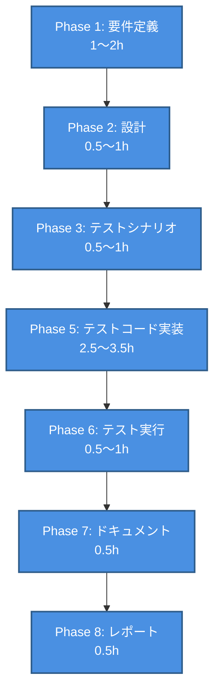

# プロジェクト計画書 - Issue #38

## Issue情報

- **Issue番号**: #38
- **タイトル**: [FOLLOW-UP] Issue #26 - 残タスク
- **状態**: open
- **URL**: https://github.com/tielec/ai-workflow-agent/issues/38
- **ラベル**: enhancement, ai-workflow-follow-up

---

## 1. Issue分析

### 複雑度判定: **簡単**

**根拠**:
- **修正範囲**: 9個のテストファイルのみ（新規実装なし、既存テストコードのAPIシグネチャ修正）
- **技術的複雑さ**: 低（APIシグネチャの変更、型定義の修正、フェーズ名の修正のみ）
- **依存関係**: 既存のPhase 4実装（完了済み）への適合のみ
- **新規機能**: なし（テストコードの技術的調整）

### 見積もり工数: **6～9時間**

**内訳**:
- **Phase 1（要件定義）**: 1～2時間（修正内容の詳細仕様化、優先度確認）
- **Phase 2（設計）**: 0.5～1時間（既存設計の確認、修正方針の明確化）
- **Phase 3（テストシナリオ）**: 0.5～1時間（修正後のテストケースの検証）
- **Phase 4（実装）**: 0時間（新規実装なし、テストコードのみ修正）
- **Phase 5（テストコード実装）**: 2.5～3.5時間（9ファイルの修正）
- **Phase 6（テスト実行）**: 0.5～1時間（全テスト実行、カバレッジ確認）
- **Phase 7（ドキュメント）**: 0.5時間（レポート更新、既存ドキュメントへの影響なし）
- **Phase 8（レポート）**: 0.5時間（PR本文生成、ステータスレポート）

**根拠**:
- 元Issue #26の評価レポート（evaluation_report.md Line 467-484）での見積もり：4～6時間（テストコード修正のみ）
- AI Workflowの全フェーズ実行を含めた現実的な見積もり：6～9時間

### リスク評価: **低**

**根拠**:
- **修正内容の明確性**: 評価レポートで詳細に文書化されている（evaluation_report.md Line 203-239）
- **技術的容易性**: APIシグネチャの変更のみ、コアロジックの変更なし
- **後方互換性**: テストコードのみの修正であり、実装コードへの影響なし
- **既存テストの成功率**: 88.1%（384個）が成功しており、修正範囲が限定的
- **成功事例**: agent-event-parser.test.ts、env-setup.test.tsは既に成功している

---

## 2. 実装戦略判断

### 実装戦略: **EXTEND**

**判断根拠**:
- **新規実装なし**: Phase 4の実装は完了済み（Issue #26）、新規機能追加はなし
- **既存コードの拡張**: テストコードを最新のAPIシグネチャに適合させる修正が中心
- **CREATE不採用の理由**: 新規ファイルやクラスの作成は不要（既存テストファイルの修正のみ）
- **REFACTOR不採用の理由**: テストコードの構造改善ではなく、APIシグネチャへの適合が目的

**具体的な修正内容**:
1. **APIシグネチャの修正**（5ファイル）:
   - codex-agent-client.test.ts: コンストラクタとexecuteTaskオプション
   - claude-agent-client.test.ts: コンストラクタ
   - metadata-manager.test.ts: コンストラクタ、updatePhaseStatus、addCost
   - agent-client-execution.test.ts: 上記1, 2と同じ
   - metadata-persistence.test.ts: 上記3と同じ

2. **型定義の修正**（2ファイル）:
   - log-formatter.test.ts: CodexEvent['message']型
   - dependency-messages.test.ts: PhaseName型のインポートパス

3. **フェーズ名の修正**（1ファイル）:
   - validation.test.ts: validPhases配列

4. **モック方式の修正**（1ファイル）:
   - metadata-io.test.ts: jest.mockを動的インポート形式に変更

### テスト戦略: **UNIT_INTEGRATION**

**判断根拠**:
- **既存テストの修正**: Issue #26で作成されたユニットテスト（6ファイル）と統合テスト（2ファイル）の修正
- **新規テストケース追加なし**: テストシナリオは既に包括的（66個のユニットテストケース、6個の統合テストケース）
- **BDD不要の理由**: ユーザーストーリー中心のテストは不要（内部リファクタリングのテスト修正）
- **ALL不要の理由**: 大規模な変更ではなく、既存テストの技術的調整のみ

**具体的なテストレベル**:
- **ユニットテスト**: ヘルパーモジュール（6ファイル）とコアファイル（3ファイル）の修正
- **統合テスト**: エージェント実行フローとメタデータ永続化フローの修正

### テストコード戦略: **EXTEND_TEST**

**判断根拠**:
- **既存テストファイルへの修正**: 9ファイルのテストコードを最新APIシグネチャに適合させる
- **新規テストファイル作成なし**: Issue #26で既に包括的なテストファイルが作成されている
- **CREATE_TEST不採用の理由**: 新規機能追加がないため、新規テストファイルは不要
- **BOTH_TEST不採用の理由**: 既存テスト修正のみで十分

**具体的な修正アプローチ**:
1. 各テストファイルのsetupセクションで新しいAPIシグネチャを使用
2. モック関数のシグネチャを最新の実装に合わせる
3. 型定義のインポートパスを修正
4. フェーズ名をプレフィックス付き形式（'00_planning'等）に統一

---

## 3. 影響範囲分析

### 既存コードへの影響

**実装コード**: **影響なし**
- Phase 4の実装は完了済み（Issue #26）
- 新規実装や既存実装の変更は不要

**テストコード**: **影響あり（9ファイル）**
- **優先度1（5ファイル）**: APIシグネチャの修正
  - `tests/unit/core/helpers/codex-agent-client.test.ts`
  - `tests/unit/core/helpers/claude-agent-client.test.ts`
  - `tests/unit/core/metadata-manager.test.ts`
  - `tests/integration/agent-client-execution.test.ts`
  - `tests/integration/metadata-persistence.test.ts`

- **優先度2（2ファイル）**: 型定義の修正
  - `tests/unit/core/helpers/log-formatter.test.ts`
  - `tests/unit/core/helpers/dependency-messages.test.ts`

- **優先度3（1ファイル）**: フェーズ名の修正
  - `tests/unit/core/helpers/validation.test.ts`

- **優先度4（1ファイル）**: モック方式の修正
  - `tests/unit/core/helpers/metadata-io.test.ts`

**ドキュメント**: **影響あり（1ファイル）**
- `AI_Workflow/ai_workflow_orchestrator/.ai-workflow/issue-26/08_report/output/report.md`
  - 「テスト結果」セクションの更新
  - 「マージ推奨」を「✅ マージ推奨」に変更

### 依存関係の変更

**新規依存の追加**: なし

**既存依存の変更**: なし

**既存APIの利用方法の変更**: なし（テストコードのみの修正）

### マイグレーション要否

**データベーススキーマ変更**: なし

**設定ファイル変更**: なし

**環境変数の追加/変更**: なし

**破壊的変更**: なし（テストコードのみの修正、公開APIへの影響なし）

---

## 4. タスク分割

### Phase 1: 要件定義 (見積もり: 1～2h)

- [ ] Task 1-1: Issue #26評価レポートの詳細分析 (0.5h)
  - evaluation_report.mdの残タスクセクション（Line 405-459）を詳細に読む
  - test-result.mdの失敗原因分析（Line 156-196）を詳細に読む
  - 各優先度（1～4）の修正内容を仕様化

- [ ] Task 1-2: Phase 4実装の最新APIシグネチャの確認 (0.5～1h)
  - src/core/codex-agent-client.tsのコンストラクタとexecuteTaskメソッドのシグネチャ確認
  - src/core/claude-agent-client.tsのコンストラクタシグネチャ確認
  - src/core/metadata-manager.tsのコンストラクタ、updatePhaseStatus、addCostのシグネチャ確認
  - 型定義ファイル（types.ts等）の確認

- [ ] Task 1-3: 機能要件の定義 (0～0.5h)
  - REQ-001～009: 各テストファイルの修正内容を機能要件として明記
  - 受け入れ基準の定義（全テスト合格、カバレッジ80%以上等）

### Phase 2: 設計 (見積もり: 0.5～1h)

- [x] Task 2-1: Issue #26設計書の確認 (0.5h)
  - .ai-workflow/issue-26/02_design/output/design.mdの詳細設計セクション確認
  - 各APIシグネチャの正しい形式を確認
  - テスト設計セクションの確認

- [x] Task 2-2: 修正方針の明確化 (0～0.5h)
  - 優先度1～4の修正アプローチを明確化
  - モック方式の変更方針（jest.mock → 動的インポート）を明確化

### Phase 3: テストシナリオ (見積もり: 0.5～1h)

- [ ] Task 3-1: Issue #26テストシナリオの確認 (0.5h)
  - .ai-workflow/issue-26/03_test-scenario/output/test-scenario.mdの確認
  - 既存のテストシナリオ（66個のユニットテスト、6個の統合テスト）が網羅的であることを確認

- [ ] Task 3-2: 修正後の検証シナリオの定義 (0～0.5h)
  - npm testでIssue #26のテストがすべて合格することを確認するシナリオ
  - npm run test:coverageでカバレッジレポートを生成し、80%以上を確認するシナリオ

### Phase 4: 実装 (見積もり: 0h)

**新規実装なし**（テストコードのみ修正、Phase 5で実施）

### Phase 5: テストコード実装 (見積もり: 2.5～3.5h)

- [ ] Task 5-1: 優先度1 - APIシグネチャの修正 (1.5～2h)
  - codex-agent-client.test.ts: コンストラクタとexecuteTaskオプションを修正
    - `new CodexAgentClient('/test/workspace')` → `new CodexAgentClient({ workingDir: '/test/workspace' })`
    - `{ workingDir: ... }` → `{ workingDirectory: ... }`
  - claude-agent-client.test.ts: コンストラクタを修正
    - `new ClaudeAgentClient('/test/workspace')` → `new ClaudeAgentClient({ workingDir: '/test/workspace' })`
  - metadata-manager.test.ts: 3つのAPIを修正
    - コンストラクタ: `new MetadataManager(26)` → `new MetadataManager('26')`
    - updatePhaseStatus: `{ outputFiles: [...] }` → `{ outputFile: '...' }`
    - addCost: 4引数 → 3引数
  - agent-client-execution.test.ts: 上記1, 2と同じ修正を適用
  - metadata-persistence.test.ts: 上記3と同じ修正を適用

- [ ] Task 5-2: 優先度2 - 型定義の修正 (0.5h)
  - log-formatter.test.ts: CodexEvent['message']型を修正
    - `message: 'System message'` → `message: { role: 'system', content: [...] }`
  - dependency-messages.test.ts: PhaseName型のインポートパスを修正
    - `import type { PhaseName }` → `import type { PhaseName } from '../types.js'`

- [ ] Task 5-3: 優先度3 - フェーズ名の修正 (0.25h)
  - validation.test.ts: validPhases配列をプレフィックス付きフェーズ名に修正
    - `'planning'`, `'requirements'` → `'00_planning'`, `'01_requirements'`

- [ ] Task 5-4: 優先度4 - モック方式の修正 (0.25～0.5h)
  - metadata-io.test.ts: jest.mockを動的インポート形式に修正
    - `jest.mock('fs-extra')`を削除
    - 動的インポートまたはVitestのvi.mock()に変更

### Phase 6: テスト実行 (見積もり: 0.5～1h)

- [ ] Task 6-1: 全テスト実行 (0.25～0.5h)
  - `npm test`で全テスト実行
  - Issue #26のテストファイル9個がすべて合格することを確認
  - 既存テストの成功率が維持されることを確認（88.1%以上）

- [ ] Task 6-2: カバレッジ確認 (0.25～0.5h)
  - `npm run test:coverage`でカバレッジレポート生成
  - 全体カバレッジが80%以上であることを確認
  - 新規ヘルパーモジュール（6ファイル）のカバレッジが85%以上であることを確認

### Phase 7: ドキュメント (見積もり: 0.5h)

- [ ] Task 7-1: Issue #26レポートの更新 (0.5h)
  - .ai-workflow/issue-26/08_report/output/report.mdの「テスト結果」セクションを更新
  - 「マージ推奨」を「✅ マージ推奨」に変更
  - Phase 6のテスト結果とカバレッジ結果を追記

### Phase 8: レポート (見積もり: 0.5h)

- [ ] Task 8-1: ステータスレポート生成 (0.25h)
  - 各フェーズの完了状況をまとめる
  - Issue #26との関連を明記
  - 成功基準の達成状況を確認

- [ ] Task 8-2: PR本文生成 (0.25h)
  - Issue #38の変更内容を簡潔にまとめる
  - テスト結果を含める
  - Issue #26の残タスク完了を明記

---

## 5. 依存関係

**重要な依存関係**:
- **Phase 1 → Phase 2**: 要件定義で特定された最新APIシグネチャを設計で確認
- **Phase 2 → Phase 3**: 修正方針を基にテストシナリオを確認
- **Phase 3 → Phase 5**: テストシナリオに基づいてテストコードを修正
- **Phase 5 → Phase 6**: 修正したテストコードを実行して検証
- **Phase 6 → Phase 7**: テスト結果を基にレポートを更新

**ブロッキング要因**:
- Phase 4（実装）は不要（既にIssue #26で完了済み）
- Phase 1でAPIシグネチャを正確に把握できない場合、Phase 5の修正が不正確になる

---

## 6. リスクと軽減策

### リスク1: APIシグネチャの理解不足

**影響度**: 高
**確率**: 低
**カテゴリ**: 技術的リスク

**詳細**:
Phase 4の最新実装を正確に理解できず、テストコードの修正が不完全になる可能性

**軽減策**:
- Phase 1で実装ファイル（src/core/*.ts）を直接読んで確認
- TypeScript型定義を確認してコンストラクタとメソッドのシグネチャを把握
- Issue #26の設計書（design.md）で詳細設計を確認

### リスク2: 修正後も一部のテストが失敗

**影響度**: 中
**確率**: 低
**カテゴリ**: 技術的リスク

**詳細**:
優先度1～4の修正を行っても、未発見の問題により一部のテストが失敗する可能性

**軽減策**:
- Phase 3で既存のテストシナリオ（test-scenario.md）を再確認
- Phase 6でテスト失敗時の原因分析とクイック修正のバッファを確保（0.5h）
- 評価レポートの「成功したテスト」（agent-event-parser.test.ts、env-setup.test.ts）をリファレンスとして活用

### リスク3: カバレッジ目標未達

**影響度**: 低
**確率**: 極低
**カテゴリ**: 品質リスク

**詳細**:
テストコードの修正により、カバレッジが80%未満に低下する可能性

**軽減策**:
- Issue #26の実装は既にカバレッジ目標を考慮して設計されている
- テストコードの修正範囲が限定的（APIシグネチャのみ）であり、カバレッジへの影響は最小限
- Phase 6でカバレッジレポートを確認し、必要に応じてテストケースを追加

### リスク4: 既存テストへの悪影響

**影響度**: 低
**確率**: 極低
**カテゴリ**: 技術的リスク

**詳細**:
Issue #26のテスト修正により、既存テスト（88.1%成功）の成功率が低下する可能性

**軽減策**:
- テストコードの修正範囲をIssue #26関連の9ファイルに限定
- Phase 6で既存テストの成功率を確認（88.1%以上を維持）
- 既存テストの失敗はIssue #26とは無関係と評価レポートで明記されている

### リスク5: スコープクリープ

**影響度**: 中
**確率**: 低
**カテゴリ**: スコープリスク

**詳細**:
「既存テストの失敗（20個のテストスイート）」をIssue #38のスコープに含めてしまう可能性

**軽減策**:
- 評価レポート（Line 383-400）で明確に「Issue #26のスコープ外」と記載されている
- Phase 1で既存テストの失敗を別途Issueとして管理することを確認
- Issue #38のスコープをIssue #26の残タスク（9ファイル）に限定

---

## 7. 品質ゲート

### Phase 1: 要件定義

- [ ] Issue #26評価レポートの残タスクセクションを詳細に分析している
- [ ] Phase 4実装の最新APIシグネチャを正確に把握している
- [ ] 機能要件（REQ-001～009）が明確に定義されている
- [ ] 受け入れ基準（全テスト合格、カバレッジ80%以上）が定義されている

### Phase 2: 設計

- [ ] 実装戦略（EXTEND）の判断根拠が明記されている
- [ ] テスト戦略（UNIT_INTEGRATION）の判断根拠が明記されている
- [ ] テストコード戦略（EXTEND_TEST）の判断根拠が明記されている
- [ ] 優先度1～4の修正方針が明確化されている
- [ ] モック方式の変更方針が明確化されている

### Phase 3: テストシナリオ

- [ ] Issue #26のテストシナリオが網羅的であることを確認している
- [ ] 修正後の検証シナリオが定義されている
- [ ] 受け入れ基準（全テスト合格、カバレッジ80%以上）に対応するテストシナリオがある

### Phase 5: テストコード実装

- [ ] 優先度1（APIシグネチャ）の修正が5ファイルすべて完了している
- [ ] 優先度2（型定義）の修正が2ファイルすべて完了している
- [ ] 優先度3（フェーズ名）の修正が1ファイル完了している
- [ ] 優先度4（モック方式）の修正が1ファイル完了している
- [ ] 修正内容がPhase 4の最新実装と一致している
- [ ] コーディング規約（ESLint、Prettier）に準拠している

### Phase 6: テスト実行

- [ ] Issue #26のテストファイル9個がすべて合格している
- [ ] 既存テストの成功率が88.1%以上を維持している
- [ ] 全体カバレッジが80%以上である
- [ ] 新規ヘルパーモジュール（6ファイル）のカバレッジが85%以上である

### Phase 7: ドキュメント

- [ ] Issue #26レポートの「テスト結果」セクションが更新されている
- [ ] 「マージ推奨」を「✅ マージ推奨」に変更している
- [ ] Phase 6のテスト結果とカバレッジ結果が追記されている

### Phase 8: レポート

- [ ] ステータスレポートが各フェーズの完了状況をまとめている
- [ ] Issue #26との関連が明記されている
- [ ] 成功基準の達成状況が確認されている
- [ ] PR本文がIssue #38の変更内容を簡潔にまとめている
- [ ] テスト結果が含まれている

---

## 8. 成功基準

### 必須要件（マージの前提条件）

1. **テストの成功**: Issue #26のテストファイル9個がすべて合格
2. **既存テストの維持**: 既存テストの成功率が88.1%以上を維持
3. **カバレッジ目標達成**: 全体カバレッジが80%以上、新規ヘルパーモジュールが85%以上
4. **Issue #26レポート更新**: 「✅ マージ推奨」に変更

### 努力目標

1. **既存テスト成功率の向上**: 88.1% → 90%以上（別途Issueとして管理）
2. **パフォーマンス維持**: リファクタリング前後のエージェント実行時間が±5%以内
3. **モニタリング**: 本番環境でのエージェント実行ログで異常なエラーがないことを確認

---

## 9. 次のステップ

### 即座の行動

1. **Phase 1開始**: Issue #26評価レポートと実装ファイルの詳細分析（1～2時間）
2. **Phase 2開始**: Issue #26設計書の確認と修正方針の明確化（0.5～1時間）
3. **Phase 3開始**: テストシナリオの確認と検証シナリオの定義（0.5～1時間）

### マイルストーン

- **Day 1（4～6時間）**: Phase 1～3完了、Phase 5の50%完了
- **Day 2（4～5時間）**: Phase 5完了、Phase 6～8完了
- **合計**: 6～9時間（1.5～2日間）

### 完了後のフォローアップ

1. **Issue #26のマージ**: PR本文を更新し、マージ
2. **既存テストの修正**: 別途Issueを作成（既存テストの失敗20個のテストスイート）
3. **Issue #1の更新**: リファクタリング全体計画にIssue #26の完了を記録

---

## 10. まとめ

Issue #38は、Issue #26の評価フェーズで特定されたテストコードの技術的調整を完了するためのフォローアップIssueです。**修正内容が明確で技術的に容易**であり、**実装自体は後方互換性100%維持、行数削減目標達成、コーディング規約準拠など、すべての品質基準を満たしている**ため、修正完了後はマージ可能な状態になります。

**重要なポイント**:
- **複雑度**: 簡単（テストコードのAPIシグネチャ修正のみ）
- **見積もり工数**: 6～9時間（1.5～2日間）
- **リスク**: 低（修正内容が明確、技術的に容易）
- **成功基準**: Issue #26のテスト9個すべて合格、既存テスト成功率88.1%以上維持、カバレッジ80%以上

**実装戦略**:
- **EXTEND**: 既存テストコードを最新APIシグネチャに適合させる
- **UNIT_INTEGRATION**: 既存のユニットテストと統合テストを修正
- **EXTEND_TEST**: 既存テストファイルへの修正のみ

このプロジェクト計画書に従って各フェーズを実行することで、Issue #26の残タスクを効率的に完了し、高品質なテストスイートを確立できます。

---

**計画書作成日**: 2025-01-22
**計画者**: AI Workflow Agent (Claude Code)
**承認者**: （レビュー後に記入）
