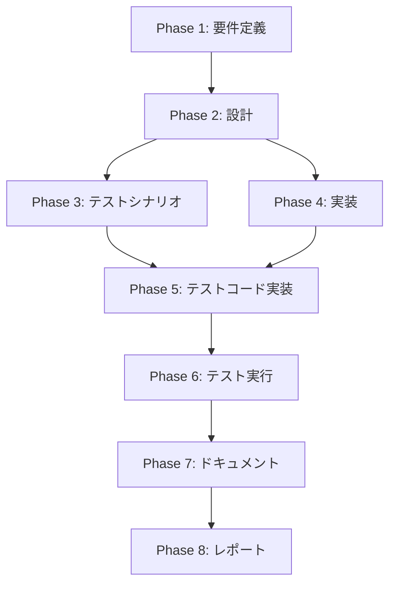

# プロジェクト計画書: Issue #442

## pr-comment execute コマンドでエージェントログをファイルに保存すべき

---

## 1. Issue分析

### 問題の概要

`pr-comment execute` コマンド実行時に、`ReviewCommentAnalyzer` クラスの `runAgent()` メソッドで生成されるエージェント実行ログが保存されていない。これにより、デバッグやトラブルシューティングが困難になっている。

### 現状分析

コード調査の結果、以下の状況が判明：

1. **`pr-comment execute` コマンド**（`src/commands/pr-comment/execute.ts`）
   - `persistExecuteLog()` 関数で `agent_log.md` を保存している
   - ただし、これはコマンド全体の実行ログであり、個別のコメント分析時のエージェントログではない

2. **`ReviewCommentAnalyzer` クラス**（`src/core/pr-comment/comment-analyzer.ts`）
   - `runAgent()` メソッドでエージェントを実行
   - 実行結果（`messages`）を処理して返すが、**ログの保存は行っていない**
   - `LogFormatter` のインポートすらない

3. **`pr-comment analyze` コマンド**（`src/commands/pr-comment/analyze.ts`）
   - `persistAgentLog()` 関数で `LogFormatter` を使用してログを保存
   - `agent_log.md` が `.ai-workflow/pr-{N}/analyze/` に保存される
   - **参考実装として利用可能**

### 複雑度: 簡単

- **理由**:
  - 変更は主に1ファイル（`comment-analyzer.ts`）
  - 既存の `LogFormatter` クラスを流用するだけ
  - `pr-comment analyze` コマンドに同様の実装が存在し、参考にできる
  - インターフェース変更は最小限（`runAgent()` に `commentId` を追加）

### 見積もり工数: 3〜5時間

| フェーズ | 見積もり |
|---------|---------|
| 要件定義 | 0.5h |
| 設計 | 0.5h |
| テストシナリオ | 0.5h |
| 実装 | 1h |
| テストコード実装 | 1h |
| テスト実行 | 0.5h |
| ドキュメント | 0.25h |
| レポート | 0.25h |
| **合計** | **4.5h** |

**根拠**:
- 既存パターンの踏襲（`pr-comment analyze` の `persistAgentLog()` 参照）
- 影響範囲が限定的（1ファイル + テストファイル）
- `LogFormatter` は既にテスト済みで信頼性が高い

### リスク評価: 低

- 既存機能への影響は最小限
- 新規ファイル作成不要
- 既存のテストパターンを流用可能

---

## 2. 実装戦略判断

### 実装戦略: EXTEND

**判断根拠**:
- 新規ファイル・クラスの作成は不要
- 既存の `ReviewCommentAnalyzer` クラスの `runAgent()` メソッドを拡張
- `LogFormatter` クラスは既に存在し、インポートして使用するのみ
- 既存のコードパターン（`pr-comment analyze` の実装）を参考に拡張

**具体的な変更内容**:
1. `ReviewCommentAnalyzer` クラスに `LogFormatter` をインポート
2. コンストラクタで `LogFormatter` インスタンスを初期化
3. `runAgent()` メソッドに `commentId` パラメータを追加
4. `runAgent()` 内でログを保存する処理を追加
5. `analyze()` メソッドから `runAgent()` への呼び出しを修正

### テスト戦略: UNIT_ONLY

**判断根拠**:
- `ReviewCommentAnalyzer` クラスの内部ロジック変更
- `LogFormatter` は既存でテスト済み
- 外部システム連携（GitHub API等）への影響なし
- `runAgent()` メソッドの単体テストで十分カバー可能
- 既存テストファイル（`comment-analyzer.test.ts`）が存在

**テスト観点**:
- エージェント実行成功時のログ保存
- エージェント実行失敗時（エラー発生時）のログ保存
- ログファイルのフォーマット確認

### テストコード戦略: EXTEND_TEST

**判断根拠**:
- 既存テストファイル `tests/unit/pr-comment/comment-analyzer.test.ts` が存在
- 新規テストファイル作成の必要なし
- 既存テストのパターン（モック、Jest設定等）を流用可能
- `runAgent()` メソッドのテストケースを追加

---

## 3. 影響範囲分析

### 既存コードへの影響

| ファイル | 影響内容 | リスク |
|---------|---------|-------|
| `src/core/pr-comment/comment-analyzer.ts` | `runAgent()` メソッド拡張、`LogFormatter` 追加 | 低 |
| `tests/unit/pr-comment/comment-analyzer.test.ts` | テストケース追加 | 低 |

### 依存関係の変更

| 種類 | 内容 |
|------|------|
| 新規依存追加 | `LogFormatter`（`src/phases/formatters/log-formatter.js`）のインポート |
| 既存依存変更 | なし |

**注意**: `LogFormatter` は既にプロジェクト内に存在し、`pr-comment analyze` や `pr-comment execute` で使用されているため、新規の外部依存は発生しない。

### マイグレーション要否

- **データベーススキーマ変更**: なし
- **設定ファイル変更**: なし
- **破壊的変更**: なし（内部メソッドのシグネチャ変更のみ）

### 出力ファイル構成（変更後）

```
.ai-workflow/pr-{NUM}/execute/
├── agent_log.md                    # 既存: executeコマンド全体のログ
├── agent_log_comment_{id}.md       # NEW: 各コメント分析のエージェントログ
├── analysis-{id}.json              # 既存: 分析結果（JSON）
└── ...
```

---

## 4. タスク分割

### Phase 1: 要件定義 (見積もり: 0.5h)

- [x] Task 1-1: 機能要件の明確化 (0.25h)
  - ログ保存のタイミング（成功時・失敗時の両方）
  - ログファイル名の命名規則確認
  - ログフォーマットの確認（`LogFormatter` 出力）

- [x] Task 1-2: 受け入れ基準の定義 (0.25h)
  - `runAgent()` 実行後にログファイルが作成されること
  - Markdown形式で適切にフォーマットされること
  - エラー時もログが保存されること

### Phase 2: 設計 (見積もり: 0.5h)

- [x] Task 2-1: クラス拡張設計 (0.25h)
  - `ReviewCommentAnalyzer` への `LogFormatter` 追加方法
  - `runAgent()` メソッドシグネチャ変更設計

- [x] Task 2-2: ログ保存処理設計 (0.25h)
  - ログファイルパス生成ロジック
  - 成功/失敗時の分岐処理

### Phase 3: テストシナリオ (見積もり: 0.5h)

- [ ] Task 3-1: テストケース設計 (0.5h)
  - 正常系: エージェント実行成功時のログ保存
  - 異常系: エージェント実行失敗時のログ保存
  - 境界: 空レスポンス時のログ保存

### Phase 4: 実装 (見積もり: 1h)

- [ ] Task 4-1: `ReviewCommentAnalyzer` クラスの拡張 (0.5h)
  - `LogFormatter` のインポート追加
  - コンストラクタで `LogFormatter` インスタンス化
  - `runAgent()` メソッドに `commentId` パラメータ追加

- [ ] Task 4-2: ログ保存処理の実装 (0.5h)
  - 成功時のログ保存処理
  - 失敗時（catch句）のログ保存処理
  - `analyze()` メソッドからの呼び出し修正

### Phase 5: テストコード実装 (見積もり: 1h)

- [ ] Task 5-1: テストケース実装 (1h)
  - `runAgent()` 成功時のログ保存テスト
  - `runAgent()` 失敗時のログ保存テスト
  - `LogFormatter.formatAgentLog()` 呼び出し確認テスト
  - ファイル書き込み確認テスト

### Phase 6: テスト実行 (見積もり: 0.5h)

- [ ] Task 6-1: ユニットテスト実行 (0.25h)
  - `npm run test:unit` でテスト実行
  - カバレッジ確認

- [ ] Task 6-2: 手動検証 (0.25h)
  - 実際の `pr-comment execute` コマンド実行
  - ログファイル出力確認

### Phase 7: ドキュメント (見積もり: 0.25h)

- [ ] Task 7-1: コード内コメント追加 (0.25h)
  - `runAgent()` メソッドのJSDoc更新
  - ログ保存処理のコメント追加

### Phase 8: レポート (見積もり: 0.25h)

- [ ] Task 8-1: 実装レポート作成 (0.25h)
  - 変更内容のサマリ
  - テスト結果
  - 動作確認結果

---

## 5. 依存関係



**並列実行可能なタスク**:
- Phase 3（テストシナリオ）と Phase 4（実装）は、Phase 2 完了後に並列実行可能

---

## 6. リスクと軽減策

### リスク1: LogFormatter の出力フォーマットの不一致

- **影響度**: 低
- **確率**: 低
- **軽減策**:
  - `pr-comment analyze` の既存実装を参照
  - `LogFormatter.formatAgentLog()` の引数を正確に渡す
  - 実装後にログ出力を目視確認

### リスク2: テストのモック設定の複雑化

- **影響度**: 中
- **確率**: 中
- **軽減策**:
  - 既存テストファイルのモックパターンを踏襲
  - `fs.writeFile` のモックは既に設定済み
  - `LogFormatter` はモックせず、実際のインスタンスを使用

### リスク3: パフォーマンスへの影響

- **影響度**: 低
- **確率**: 低
- **軽減策**:
  - ログ保存は非同期で行われる
  - ファイル書き込みは軽量（数KB程度）
  - 既存の `pr-comment analyze` で同様の処理が問題なく動作

### リスク4: 既存テストの破損

- **影響度**: 中
- **確率**: 低
- **軽減策**:
  - `runAgent()` のシグネチャ変更は内部的
  - 既存テストは `analyze()` を直接テストしていない
  - テスト実行で早期に問題を検出可能

---

## 7. 品質ゲート

### Phase 1: 要件定義

- [x] 機能要件が明確に記載されている
- [x] 受け入れ基準が定義されている
- [x] ログ保存の仕様が明確である

### Phase 2: 設計

- [x] 実装戦略の判断根拠が明記されている（EXTEND）
- [x] テスト戦略の判断根拠が明記されている（UNIT_ONLY）
- [x] テストコード戦略の判断根拠が明記されている（EXTEND_TEST）
- [x] クラス拡張の設計が明確である
- [x] 既存コードとの整合性が確認されている

### Phase 3: テストシナリオ

- [ ] 正常系テストケースが定義されている
- [ ] 異常系テストケースが定義されている
- [ ] 境界値テストケースが定義されている

### Phase 4: 実装

- [ ] `LogFormatter` が正しくインポートされている
- [ ] `runAgent()` メソッドが正しく拡張されている
- [ ] 成功時・失敗時の両方でログが保存される
- [ ] `analyze()` メソッドからの呼び出しが修正されている

### Phase 5: テストコード実装

- [ ] すべてのテストケースが実装されている
- [ ] モックが適切に設定されている
- [ ] アサーションが明確である

### Phase 6: テスト実行

- [ ] すべてのユニットテストがパスしている
- [ ] 既存テストが破損していない
- [ ] 手動検証でログファイルが作成されることを確認

### Phase 7: ドキュメント

- [ ] JSDocコメントが更新されている
- [ ] コード内コメントが適切である

### Phase 8: レポート

- [ ] 変更内容がサマリされている
- [ ] テスト結果が記載されている
- [ ] 動作確認結果が記載されている

---

## 8. 実装の詳細設計

### 8.1 変更するファイル

#### `src/core/pr-comment/comment-analyzer.ts`

**追加するインポート**:
```typescript
import { LogFormatter } from '../../phases/formatters/log-formatter.js';
```

**コンストラクタの拡張**:
```typescript
export class ReviewCommentAnalyzer {
  private readonly promptTemplatePath: string;
  private readonly outputDir: string;
  private readonly logFormatter: LogFormatter; // NEW

  constructor(promptsDir: string, outputDir: string) {
    this.promptTemplatePath = path.join(promptsDir, 'pr-comment', 'analyze.txt');
    this.outputDir = outputDir;
    this.logFormatter = new LogFormatter(); // NEW
  }
```

**`runAgent()` メソッドの拡張**:
```typescript
private async runAgent(
  agent: CodexAgentClient | ClaudeAgentClient,
  prompt: string,
  repoPath: string,
  commentId: number, // NEW: コメントIDを追加
): Promise<string | null> {
  const startTime = Date.now();
  let messages: string[] = [];

  try {
    logger.debug(`Running agent for PR comment analysis...`);
    messages = await agent.executeTask({
      prompt,
      maxTurns: 1,
      verbose: true,
      workingDirectory: repoPath,
    });
    const endTime = Date.now();
    const duration = endTime - startTime;
    logger.debug(`Agent execution completed, processing response...`);

    // NEW: エージェントログを保存
    const agentName = agent instanceof CodexAgentClient ? 'Codex Agent' : 'Claude Agent';
    await this.saveAgentLog(messages, startTime, endTime, duration, null, agentName, commentId);

    if (agent instanceof CodexAgentClient) {
      return this.extractFromCodexMessages(messages);
    }
    return this.extractFromClaudeMessages(messages);
  } catch (error) {
    const endTime = Date.now();
    const duration = endTime - startTime;
    logger.warn(`Agent execution failed: ${getErrorMessage(error)}`);

    // NEW: エラー時もログを保存
    const agentName = agent instanceof CodexAgentClient ? 'Codex Agent' : 'Claude Agent';
    await this.saveAgentLog(messages, startTime, endTime, duration, error as Error, agentName, commentId);

    return null;
  }
}
```

**新規メソッド `saveAgentLog()`**:
```typescript
private async saveAgentLog(
  messages: string[],
  startTime: number,
  endTime: number,
  duration: number,
  error: Error | null,
  agentName: string,
  commentId: number,
): Promise<void> {
  try {
    const agentLogContent = this.logFormatter.formatAgentLog(
      messages,
      startTime,
      endTime,
      duration,
      error,
      agentName,
    );

    const logFile = path.join(this.outputDir, `agent_log_comment_${commentId}.md`);
    await fsp.writeFile(logFile, agentLogContent, 'utf-8');
    logger.debug(`Agent log saved to: ${logFile}`);
  } catch (logError) {
    logger.warn(`Failed to save agent log: ${getErrorMessage(logError)}`);
  }
}
```

**`analyze()` メソッドの修正**:
```typescript
if (agent) {
  rawContent = await this.runAgent(agent, prompt, context.repoPath, commentMeta.comment.id);
}
```

### 8.2 テストケース

#### 追加するテストケース（`comment-analyzer.test.ts`）

```typescript
describe('runAgent with logging', () => {
  it('saves agent log on successful execution', async () => {
    // Setup
    const mockAgent = { executeTask: jest.fn().mockResolvedValue(['{"type": "result"}']) };

    // Execute
    await analyzer.analyze(commentMeta, context, mockAgent);

    // Verify
    expect(fs.writeFile).toHaveBeenCalledWith(
      expect.stringContaining('agent_log_comment_100.md'),
      expect.any(String),
      'utf-8'
    );
  });

  it('saves agent log on failed execution', async () => {
    // Setup
    const mockAgent = { executeTask: jest.fn().mockRejectedValue(new Error('Agent error')) };

    // Execute
    await analyzer.analyze(commentMeta, context, mockAgent);

    // Verify
    expect(fs.writeFile).toHaveBeenCalledWith(
      expect.stringContaining('agent_log_comment_100.md'),
      expect.any(String),
      'utf-8'
    );
  });
});
```

---

## 9. 参考情報

### 関連Issue

- Issue #441: pr-comment analyze コマンドの agent_log.md が適切にフォーマットされていない
- Issue #23: BasePhase アーキテクチャ分割（LogFormatter の導入）

### 参考実装

- `src/commands/pr-comment/analyze.ts` - `persistAgentLog()` 関数
- `src/commands/pr-comment/execute.ts` - `persistExecuteLog()` 関数
- `src/phases/formatters/log-formatter.ts` - `LogFormatter` クラス

### 既存テストパターン

- `tests/unit/pr-comment/comment-analyzer.test.ts` - 既存テストのモック設定
- `tests/unit/pr-comment/execute-command.test.ts` - ログ保存のテストパターン

---

## 10. 品質ゲートチェックリスト（Phase 0）

- [x] **実装戦略が明確に決定されている**: EXTEND
- [x] **テスト戦略が明確に決定されている**: UNIT_ONLY
- [x] **テストコード戦略が明確に決定されている**: EXTEND_TEST
- [x] **影響範囲が分析されている**: 1ファイル（+ テストファイル）
- [x] **タスク分割が適切な粒度である**: 各タスク0.25h〜1h
- [x] **リスクが洗い出されている**: 4つのリスクと軽減策を定義
