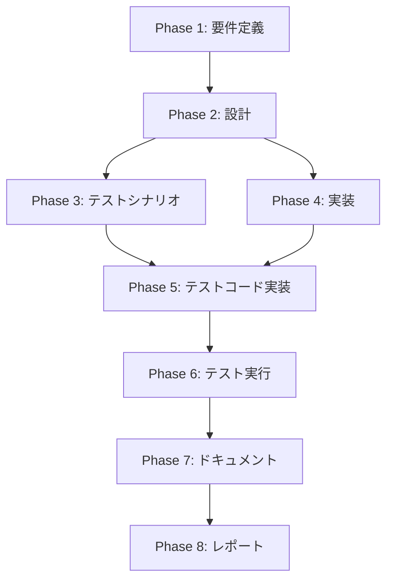

# Codex Agent 実行ログ

開始日時: 2025/12/22 13:09:58

---

## Turn 1: スレッド開始

**Thread ID**: `019b462e-508e-7760-b56c-87622376b0db`

## Turn 2: ツール実行

**種別**: reasoning
**ステータス**: completed

## Turn 3: ツール実行

**種別**: コマンド実行
**コマンド**: `/bin/bash -lc pwd`
**ステータス**: completed (exit_code=0)

```text
/tmp/ai-workflow-repos-111-08c033fa/ai-workflow-agent
```

## Turn 4: ツール実行

**種別**: reasoning
**ステータス**: completed

## Turn 5: ツール実行

**種別**: コマンド実行
**コマンド**: `/bin/bash -lc ls`
**ステータス**: completed (exit_code=0)

```text
ARCHITECTURE.md
CHANGELOG.md
CLAUDE.md
CODEBASE_EXPLORATION.md
CODEBASE_EXPLORATION_ISSUE427.md
CODEBASE_EXPLORATION_ISSUE442.md
CODEBASE_SUMMARY.md
DOCKER_AUTH_SETUP.md
Dockerfile
Jenkinsfile
LICENSE
PROGRESS.md
README.md
ROADMAP.md
SETUP_TYPESCRIPT.md
TROUBLESHOOTING.md
__mocks__
docs
examples
jenkins
jest.config.cjs
metadata.json.template
node_modules
package-lock.json
package.json
scripts
src
tests
tsconfig.json
tsconfig.test.json
```

## Turn 6: ツール実行

**種別**: reasoning
**ステータス**: completed

## Turn 7: ツール実行

**種別**: コマンド実行
**コマンド**: `/bin/bash -lc "rg --files -g 'Planning.md'"`
**ステータス**: failed (exit_code=127)

```text
/bin/bash: line 1: rg: command not found
```

## Turn 8: ツール実行

**種別**: reasoning
**ステータス**: completed

## Turn 9: ツール実行

**種別**: コマンド実行
**コマンド**: `/bin/bash -lc 'find .. -name Planning.md'`
**ステータス**: completed (exit_code=0)

## Turn 10: ツール実行

**種別**: reasoning
**ステータス**: completed

## Turn 11: ツール実行

**種別**: コマンド実行
**コマンド**: `/bin/bash -lc 'ls docs'`
**ステータス**: completed (exit_code=0)

```text
PR_COMMENT_RESOLUTION.md
```

## Turn 12: ツール実行

**種別**: reasoning
**ステータス**: completed

## Turn 13: ツール実行

**種別**: コマンド実行
**コマンド**: `/bin/bash -lc 'ls -a'`
**ステータス**: completed (exit_code=0)

```text
.
..
.ai-workflow
.eslintrc.json
.git
.github
.gitignore
.test-tmp
ARCHITECTURE.md
CHANGELOG.md
CLAUDE.md
CODEBASE_EXPLORATION.md
CODEBASE_EXPLORATION_ISSUE427.md
CODEBASE_EXPLORATION_ISSUE442.md
CODEBASE_SUMMARY.md
DOCKER_AUTH_SETUP.md
Dockerfile
Jenkinsfile
LICENSE
PROGRESS.md
README.md
ROADMAP.md
SETUP_TYPESCRIPT.md
TROUBLESHOOTING.md
__mocks__
docs
examples
jenkins
jest.config.cjs
metadata.json.template
node_modules
package-lock.json
package.json
scripts
src
tests
tsconfig.json
tsconfig.test.json
```

## Turn 14: ツール実行

**種別**: reasoning
**ステータス**: completed

## Turn 15: ツール実行

**種別**: コマンド実行
**コマンド**: `/bin/bash -lc 'grep -R "planning_document_path" -n'`
**ステータス**: completed (exit_code=0)

```text
.ai-workflow/issue-113/02_design/output/design.md:710:    .replace('{planning_document_path}', planningDocumentPath)
.ai-workflow/issue-113/09_evaluation/execute/agent_log_raw.txt:11:{"type":"user","message":{"role":"user","content":[{"tool_use_id":"toolu_01NcezY8Tf1TonsMWAzFBDp9","type":"tool_result","content":"     1→# 詳細設計書 - Issue #113\n     2→\n     3→## 0. Planning Document & Requirements Document の確認\n     4→\n     5→Planning Document（@.ai-workflow/issue-113/00_planning/output/planning.md）および要件定義書（@.ai-workflow/issue-113/01_requirements/output/requirements.md）を確認しました。\n     6→\n     7→**開発計画の概要**:\n     8→- **複雑度**: 中程度\n     9→- **見積もり工数**: 12~16時間\n    10→- **主要リスク**: BasePhase変更によるリグレッション、エージェント挙動変化、ログ解析ロジックの複雑化\n    11→\n    12→**要件定義サマリー**:\n    13→- 6フェーズ（Planning、Requirements、Design、TestScenario、Implementation、Report）にEvaluation Phaseのフォールバック機構を導入\n    14→- `BasePhase.executePhaseTemplate()`の拡張\n    15→- Reviseプロンプトの最適化（`{previous_log_snippet}`変数の追加、「⚠️ 最重要：必須アクション」セクションの追加）\n    16→\n    17→---\n    18→\n    19→## 1. アーキテクチャ設計\n    20→\n    21→### 1.1 システム全体図\n    22→\n    23→```mermaid\n    24→graph TB\n    25→    subgraph \"フェーズ実行フロー（既存 + 新規拡張）\"\n    26→        A[executePhaseTemplate 呼び出し] --> B[プロンプト読み込み・変数置換]\n    27→        B --> C[エージェント実行]\n    28→        C --> D{成果物ファイル<br/>存在確認}\n    29→        D -->|存在| E[成功を返す]\n    30→        D -->|不在<br/>& enableFallback: true| F[**NEW: handleMissingOutputFile**]\n    31→        D -->|不在<br/>& enableFallback: false| G[エラーを返す]\n    32→\n    33→        F --> H{**Step 1**<br/>ログから抽出}\n    34→        H -->|成功| I[ファイル保存]\n    35→        I --> E\n    36→        H -->|失敗| J{**Step 2**<br/>revise 呼び出し}\n    37→        J --> K[reviseプロンプトに<br/>previous_log_snippet注入]\n    38→        K --> L[エージェント再実行]\n    39→        L --> M{ファイル生成<br/>成功?}\n    40→        M -->|成功| E\n    41→        M -->|失敗| G\n    42→    end\n    43→\n    44→    subgraph \"Evaluation Phase（既存実装）\"\n    45→        E1[execute] --> E2[ファイル不在チェック]\n    46→        E2 --> E3[handleMissingEvaluationFile]\n    47→        E3 --> E4[extractEvaluationFromLog]\n    48→        E4 --> E5[isValidEvaluationContent]\n    49→        E5 --> E6[revise]\n    50→    end\n    51→\n    52→    subgraph \"各フェーズ（新規対応）\"\n    53→        P1[Planning Phase<br/>execute]\n    54→        P2[Requirements Phase<br/>execute]\n    55→        P3[Design Phase<br/>execute]\n    56→        P4[TestScenario Phase<br/>execute]\n    57→        P5[Implementation Phase<br/>execute]\n    58→        P6[Report Phase<br/>execute]\n    59→\n    60→        P1 --> A\n    61→        P2 --> A\n    62→        P3 --> A\n    63→        P4 --> A\n    64→        P5 --> A\n    65→        P6 --> A\n    66→    end\n    67→\n    68→    style F fill:#ffeb3b\n    69→    style H fill:#ffeb3b\n    70→    style J fill:#ffeb3b\n    71→    style K fill:#ffeb3b\n    72→```\n    73→\n    74→### 1.2 コンポーネント間の関係\n    75→\n    76→```mermaid\n    77→classDiagram\n    78→    class BasePhase {\n    79→        <<abstract>>\n    80→        +executePhaseTemplate()\n    81→        +executeWithAgent()\n    82→        +loadPrompt()\n    83→        +NEW: handleMissingOutputFile()\n    84→        +NEW: extractContentFromLog()\n    85→        +NEW: isValidOutputContent()\n    86→        #execute()\n    87→        #review()\n    88→        #revise()\n    89→    }\n    90→\n    91→    class EvaluationPhase {\n    92→        +execute()\n    93→        +revise()\n    94→        -handleMissingEvaluationFile()\n    95→        -extractEvaluationFromLog()\n    96→        -isValidEvaluationContent()\n    97→    }\n    98→\n    99→    class PlanningPhase {\n   100→        +execute()\n   101→        +revise()\n   102→    }\n   103→\n   104→    class RequirementsPhase {\n   105→        +execute()\n   106→        +revise()\n   107→    }\n   108→\n   109→    class DesignPhase {\n   110→        +execute()\n   111→        +revise()\n   112→    }\n   113→\n   114→    class TestScenarioPhase {\n   115→
... (truncated)
```

## Turn 16: ツール実行

**種別**: reasoning
**ステータス**: completed

## Turn 17: ツール実行

**種別**: コマンド実行
**コマンド**: `/bin/bash -lc 'ls .ai-workflow/issue-442'`
**ステータス**: completed (exit_code=0)

```text
00_planning
01_requirements
02_design
03_test_scenario
04_implementation
05_test_implementation
06_testing
metadata.json
```

## Turn 18: ツール実行

**種別**: reasoning
**ステータス**: completed

## Turn 19: ツール実行

**種別**: コマンド実行
**コマンド**: `/bin/bash -lc 'ls .ai-workflow/issue-442/00_planning/output'`
**ステータス**: completed (exit_code=0)

```text
planning.md
```

## Turn 20: ツール実行

**種別**: reasoning
**ステータス**: completed

## Turn 21: ツール実行

**種別**: コマンド実行
**コマンド**: `/bin/bash -lc 'rg -n "Phase 6" -n .ai-workflow/issue-442/00_planning/output/planning.md'`
**ステータス**: failed (exit_code=127)

```text
/bin/bash: line 1: rg: command not found
```

## Turn 22: ツール実行

**種別**: reasoning
**ステータス**: completed

## Turn 23: ツール実行

**種別**: コマンド実行
**コマンド**: `/bin/bash -lc 'grep -n "Phase 6" -n .ai-workflow/issue-442/00_planning/output/planning.md'`
**ステータス**: completed (exit_code=0)

```text
194:### Phase 6: テスト実行 (見積もり: 0.5h)
228:    P5 --> P6[Phase 6: テスト実行]
313:### Phase 6: テスト実行
```

## Turn 24: ツール実行

**種別**: reasoning
**ステータス**: completed

## Turn 25: ツール実行

**種別**: コマンド実行
**コマンド**: `/bin/bash -lc "sed -n '194,260p' .ai-workflow/issue-442/00_planning/output/planning.md"`
**ステータス**: completed (exit_code=0)

```text
### Phase 6: テスト実行 (見積もり: 0.5h)

- [ ] Task 6-1: ユニットテスト実行 (0.25h)
  - `npm run test:unit` でテスト実行
  - カバレッジ確認

- [ ] Task 6-2: 手動検証 (0.25h)
  - 実際の `pr-comment execute` コマンド実行
  - ログファイル出力確認

### Phase 7: ドキュメント (見積もり: 0.25h)

- [ ] Task 7-1: コード内コメント追加 (0.25h)
  - `runAgent()` メソッドのJSDoc更新
  - ログ保存処理のコメント追加

### Phase 8: レポート (見積もり: 0.25h)

- [ ] Task 8-1: 実装レポート作成 (0.25h)
  - 変更内容のサマリ
  - テスト結果
  - 動作確認結果

---

## 5. 依存関係



**並列実行可能なタスク**:
- Phase 3（テストシナリオ）と Phase 4（実装）は、Phase 2 完了後に並列実行可能

---

## 6. リスクと軽減策

### リスク1: LogFormatter の出力フォーマットの不一致

- **影響度**: 低
- **確率**: 低
- **軽減策**:
  - `pr-comment analyze` の既存実装を参照
  - `LogFormatter.formatAgentLog()` の引数を正確に渡す
  - 実装後にログ出力を目視確認

### リスク2: テストのモック設定の複雑化

- **影響度**: 中
- **確率**: 中
- **軽減策**:
  - 既存テストファイルのモックパターンを踏襲
  - `fs.writeFile` のモックは既に設定済み
  - `LogFormatter` はモックせず、実際のインスタンスを使用

### リスク3: パフォーマンスへの影響

- **影響度**: 低
```

## Turn 26: ツール実行

**種別**: reasoning
**ステータス**: completed

## Turn 27: ツール実行

**種別**: コマンド実行
**コマンド**: `/bin/bash -lc 'cat .ai-workflow/issue-442/06_testing/output/test-result.md'`
**ステータス**: completed (exit_code=0)

```text
# テスト実行結果

## テスト結果サマリー
- 総テスト数: 1551件
- 成功: 1135件
- 失敗: 415件
- 成功率: 73.18%

### `tests/unit/commands/auto-issue.test.ts::TC-CLI-001: parseOptions with default values`
- **エラー**: Repository 'repo' not found locally. Please ensure REPOS_ROOT is set correctly...
- **スタックトレース**:
  ```
  handleAutoIssueCommand (src/commands/auto-issue.ts:88:13)
  Object.<anonymous> (tests/unit/commands/auto-issue.test.ts:138:13)
  ```

### `tests/unit/commands/auto-issue.test.ts::Issue #153: GITHUB_REPOSITORY is set correctly`
- **エラー**: TypeError: jest.mocked(...).mockReturnValue is not a function
- **スタックトレース**:
  ```
  Object.<anonymous> (tests/unit/commands/auto-issue.test.ts:376:59)
  ```

### `tests/unit/commands/init-auto-model-selection.test.ts::TC-INIT-002 runs difficulty analysis...`
- **エラー**: TypeError: fs.ensureDir is not a function
- **スタックトレース**:
  ```
  Object.<anonymous> (tests/unit/commands/init-auto-model-selection.test.ts:168:14)
  ```

### `tests/unit/commands/init-auto-model-selection.test.ts::TC-INIT-001 skips difficulty analysis when disabled`
- **エラー**: TypeError: fs.removeSync is not a function
- **スタックトレース**:
  ```
  Object.<anonymous> (tests/unit/commands/init-auto-model-selection.test.ts:161:6)
  ```

### `tests/unit/phase-dependencies.test.ts::1.4.1: 全依存関係が満たされている場合`
- **エラー**: TypeError: fs.ensureDir is not a function
- **スタックトレース**:
  ```
  Object.<anonymous> (tests/unit/phase-dependencies.test.ts:72:14)
  ```

### `tests/unit/base-phase-optional-context.test.ts::1.3.1: ファイル存在時の参照生成`
- **エラー**: TypeError: fs.ensureDir is not a function
- **スタックトレース**:
  ```
  Object.<anonymous> (tests/unit/base-phase-optional-context.test.ts:31:14)
  ```

### `tests/unit/base-phase-optional-context.test.ts::afterAll cleanup`
- **エラー**: TypeError: fs.remove is not a function
- **スタックトレース**:
  ```
  Object.<anonymous> (tests/unit/base-phase-optional-context.test.ts:71:14)
  ```

### `tests/unit/helpers/metadata-io.test.ts`
- **エラー**: TypeError: Cannot assign to read only property 'copyFileSync' of object '[object Module]'
- **スタックトレース**:
  ```
  node_modules/jest-mock/build/index.js:622:31
  ```

### `tests/unit/pr-comment/change-applier.test.ts::CodeChangeApplier rejects absolute and traversal paths`
- **エラー**: Property `ensureDir` does not exist in the provided object
- **スタックトレース**:
  ```
  Object.<anonymous> (tests/unit/pr-comment/change-applier.test.ts:15:10)
  ```

### `tests/unit/core/issue-deduplicator.test.ts::Issue #153 end-to-end flow`
- **エラー**: TypeError: jest.mocked(...).mockReturnValue is not a function
- **スタックトレース**:
  ```
  Object.<anonymous> (tests/unit/core/issue-deduplicator.test.ts:335:50)
  ```
```

## Turn 28: ツール実行

**種別**: reasoning
**ステータス**: completed

## Turn 29: ツール実行

**種別**: コマンド実行
**コマンド**: `/bin/bash -lc 'rg -n "pr-comment execute" -n .ai-workflow/issue-442/06_testing/output/test-result.md'`
**ステータス**: failed (exit_code=127)

```text
/bin/bash: line 1: rg: command not found
```

## Turn 30: ツール実行

**種別**: reasoning
**ステータス**: completed

## Turn 31: ツール実行

**種別**: コマンド実行
**コマンド**: `/bin/bash -lc 'grep -n "pr-comment execute" .ai-workflow/issue-442/06_testing/output/test-result.md'`
**ステータス**: failed (exit_code=1)

## Turn 32: ツール実行

**種別**: reasoning
**ステータス**: completed

## Turn 33: ツール実行

**種別**: コマンド実行
**コマンド**: `/bin/bash -lc 'grep -n "manual" -n .ai-workflow/issue-442/04_implementation/output/implementation.md'`
**ステータス**: failed (exit_code=1)

## Turn 34: ツール実行

**種別**: reasoning
**ステータス**: completed

## Turn 35: ツール実行

**種別**: コマンド実行
**コマンド**: `/bin/bash -lc 'grep -R "pr-comment execute" -n'`
**ステータス**: completed (exit_code=0)

```text
.ai-workflow/issue-442/00_planning/output/planning.md:3:## pr-comment execute コマンドでエージェントログをファイルに保存すべき
.ai-workflow/issue-442/00_planning/output/planning.md:11:`pr-comment execute` コマンド実行時に、`ReviewCommentAnalyzer` クラスの `runAgent()` メソッドで生成されるエージェント実行ログが保存されていない。これにより、デバッグやトラブルシューティングが困難になっている。
.ai-workflow/issue-442/00_planning/output/planning.md:17:1. **`pr-comment execute` コマンド**（`src/commands/pr-comment/execute.ts`）
.ai-workflow/issue-442/00_planning/output/planning.md:123:**注意**: `LogFormatter` は既にプロジェクト内に存在し、`pr-comment analyze` や `pr-comment execute` で使用されているため、新規の外部依存は発生しない。
.ai-workflow/issue-442/00_planning/output/planning.md:201:  - 実際の `pr-comment execute` コマンド実行
.ai-workflow/issue-442/00_planning/execute/prompt.txt:25:- **タイトル**: pr-comment execute コマンドでエージェントログをファイルに保存すべき
.ai-workflow/issue-442/00_planning/execute/prompt.txt:34:`pr-comment execute` コマンド実行時、エージェントログがファイルに保存されていない。デバッグやトラブルシューティングが困難になっている。
.ai-workflow/issue-442/00_planning/execute/prompt.txt:38:- `pr-comment execute` コマンドは `ReviewCommentAnalyzer` を使用してコメントを分析
.ai-workflow/issue-442/00_planning/execute/agent_log_raw.txt:3:{"type":"assistant","message":{"model":"claude-opus-4-5-20251101","id":"msg_01A4qLNsAXa1xc2gLzp6zXwP","type":"message","role":"assistant","content":[{"type":"tool_use","id":"toolu_01Ck4VJNYM7UstpABrAY9Pk5","name":"Task","input":{"description":"Explore codebase structure","prompt":"Explore the codebase to understand:\n1. Overall project structure (directory layout, main files)\n2. The pr-comment command implementation, especially:\n   - src/core/pr-comment/comment-analyzer.ts\n   - Any related command files for pr-comment execute\n3. How logging is currently implemented in other parts:\n   - LogFormatter class location and usage\n   - How ai-workflow execute and pr-comment analyze save agent logs\n4. Existing test files for comment-analyzer\n5. Read CLAUDE.md, ARCHITECTURE.md, README.md if they exist\n\nReturn a comprehensive summary including:\n- File paths and their purposes\n- Current implementation details of comment-analyzer.ts\n- How LogFormatter works and is used elsewhere\n- Test file locations and patterns used","subagent_type":"Explore"}}],"stop_reason":null,"stop_sequence":null,"usage":{"input_tokens":2,"cache_creation_input_tokens":5860,"cache_read_input_tokens":12202,"cache_creation":{"ephemeral_5m_input_tokens":5860,"ephemeral_1h_input_tokens":0},"output_tokens":1,"service_tier":"standard"}},"parent_tool_use_id":null,"session_id":"b7f5aab9-65c9-4fb4-94ea-525db84676da","uuid":"f7c459bd-ea82-4c6a-b315-a5f44521f0fc"}
.ai-workflow/issue-442/00_planning/execute/agent_log_raw.txt:15:{"type":"user","message":{"role":"user","content":[{"tool_use_id":"toolu_01YVrsyABQP9PAqFfwrcSFLC","type":"tool_result","content":"     1→# アーキテクチャ概要 ― AI Workflow v2 (TypeScript)\n     2→\n     3→このドキュメントでは、TypeScript 版 AI Workflow の構成、モジュール間の制御フロー、および Codex / Claude Code / GitHub との連携方法を説明します。\n     4→\n     5→## 全体フロー\n     6→\n     7→```\n     8→CLI (src/main.ts - 約118行に削減、v0.3.0でリファクタリング)\n     9→ ├─ runCli() … CLI エントリーポイント\n    10→ ├─ commander定義（コマンドルーティングのみ）\n    11→ ├─ reportFatalError() … 致命的エラー報告\n    12→ ├─ reportExecutionSummary() … 実行サマリー表示\n    13→ └─ isValidPhaseName() … フェーズ名バリデーション\n    14→\n    15→src/commands/init.ts (Issue初期化コマンド処理)\n    16→ ├─ handleInitCommand() … Issue初期化コマンドハンドラ\n    17→ ├─ validateBranchName() … ブランチ名バリデーション（Git 命名規則チェック）\n    18→ ├─ resolveBranchName() … ブランチ名解決（カスタム or デフォルト）\n    19→ ├─ ★PR タイトル生成★ … Issueタイトルを取得し、PRタイトルとして使用（v0.3.0、Issue #73）\n    20→ └─ src/core/repository-utils.ts を利用（Issue URL解析、リポジトリパス解決）\n    21→\n    22→src/commands/execute.ts (フェーズ実行コマンド処理 - ファサード、v0.3.1で27%削減、Issue #46)\n    23→ ├─ handleExecuteCommand() … フェーズ実行コマンドハンドラ（各モジュールへ委譲）\n    24→ ├─ 既存公開関数の再エクスポート\n    25→ │   ├─ executePhasesSequential (workflow-executor から)\n    26→ │   ├─ executePhasesFrom (workflow-executor から)\n    27→ │   ├─ createPhaseInstance (phase-factory から)\n    28→ │   ├─ resolvePresetName (そのまま保持)
... (truncated)
```

## Turn 36: ツール実行

**種別**: reasoning
**ステータス**: completed

## Turn 37: ツール実行

**種別**: コマンド実行
**コマンド**: `/bin/bash -lc 'grep -R "Task 6-2" -n'`
**ステータス**: completed (exit_code=0)

```text
.ai-workflow/issue-10/00_planning/output/planning.md:249:- [x] Task 6-2: インテグレーションテスト実行と修正 (0.5~1h)
.ai-workflow/issue-102/00_planning/output/planning.md:165:- [ ] Task 6-2: 統合テスト実行と確認 (0.25~0.25h)
.ai-workflow/issue-102/03_test_scenario/output/test-scenario.md:499:**Task 6-2: 統合テスト実行と確認**（0.25~0.25h）
.ai-workflow/issue-102/03_test_scenario/output/test-scenario.md:581:- Task 6-2: 統合テスト実行と確認
.ai-workflow/issue-102/04_implementation/output/implementation.md:218:- **Task 6-2**: 統合テスト実行と確認（0.25~0.25h）
.ai-workflow/issue-102/05_test_implementation/output/test-implementation.md:135:**Task 6-2: 統合テスト実行と確認**（0.25~0.25h）
.ai-workflow/issue-102/09_evaluation/execute/agent_log_raw.txt:6:{"type":"user","message":{"role":"user","content":[{"tool_use_id":"toolu_01M3xCn9YciLASkuYnmRtGxJ","type":"tool_result","content":"     1→# プロジェクト計画書 - Issue #102\n     2→\n     3→## 1. Issue分析\n     4→\n     5→### 複雑度\n     6→**簡単**\n     7→\n     8→### 見積もり工数\n     9→**2~3時間**\n    10→\n    11→### 根拠\n    12→- **Task 1**: テストシナリオの期待値修正（1~1.5時間）\n    13→  - 2つのテストファイルで合計3箇所の期待値を修正\n    14→  - 既存テストの修正のみで、新規ロジック実装は不要\n    15→  - 影響範囲は限定的（file-selector.test.ts と commit-message-builder.test.ts のみ）\n    16→\n    17→- **Task 2**: Jest設定修正（0.5~1時間）\n    18→  - jest.config.cjs の transformIgnorePatterns に chalk を追加\n    19→  - 設定ファイル1箇所の修正\n    20→  - 統合テスト実行による動作確認\n    21→\n    22→- **バッファ**: 0.5時間（予期せぬ問題対応）\n    23→\n    24→### リスク評価\n    25→**低**\n    26→\n    27→- 既存テストの修正のみで、本体コードの変更は不要\n    28→- 影響範囲が明確（テストファイル2つ + 設定ファイル1つ）\n    29→- 元Issue #52の評価フェーズで具体的な修正箇所が特定済み\n    30→\n    31→---\n    32→\n    33→## 2. 実装戦略判断\n    34→\n    35→### 実装戦略: EXTEND\n    36→\n    37→**判断根拠**:\n    38→- **既存テストファイルの修正が中心**\n    39→  - file-selector.test.ts: 期待値の修正（lines 72-79）\n    40→  - commit-message-builder.test.ts: 期待値の修正（lines 205, 222）\n    41→  - jest.config.cjs: transformIgnorePatterns の拡張\n    42→- **新規ファイル・クラスの作成は不要**\n    43→- **本体コード（src/配下）の変更は不要**\n    44→- **既存のテスト構造を維持したまま、期待値と設定を修正**\n    45→\n    46→### テスト戦略: UNIT_ONLY\n    47→\n    48→**判断根拠**:\n    49→- **修正対象がユニットテストのみ**\n    50→  - file-selector.test.ts: FileSelector クラスのユニットテスト\n    51→  - commit-message-builder.test.ts: CommitMessageBuilder クラスのユニットテスト\n    52→  - commit-manager.test.ts: CommitManager の統合テスト（Jest設定修正で実行可能にする）\n    53→- **外部システム連携は不要**（Git操作はモック化済み）\n    54→- **ユーザーストーリーは不要**（テストインフラの修正）\n    55→- **既存のユニットテスト・統合テストを修正・有効化するのみ**\n    56→\n    57→### テストコード戦略: EXTEND_TEST\n    58→\n    59→**判断根拠**:\n    60→- **既存テストファイルの期待値を修正**\n    61→  - file-selector.test.ts（既存ファイル）\n    62→  - commit-message-builder.test.ts（既存ファイル）\n    63→- **新規テストファイルの作成は不要**\n    64→- **既存のテスト構造・テストケースを維持**\n    65→- **期待値の修正のみで、新規テストケースの追加は不要**\n    66→\n    67→---\n    68→\n    69→## 3. 影響範囲分析\n    70→\n    71→### 既存コードへの影響\n    72→\n    73→**テストコード**（3ファイル）:\n    74→- `tests/unit/git/file-selector.test.ts` (lines 72-79)\n    75→  - 期待値の修正が必要\n    76→  - 元Issue #52で追加された新規テストの期待値調整\n    77→- `tests/unit/git/commit-message-builder.test.ts` (lines 205, 222)\n    78→  - 期待値の修正が必要\n    79→  - 元Issue #52で追加された新規テストの期待値調整\n    80→- `tests/integration/git/commit-manager.test.ts`\n    81→  - 現在スキップされている統合テストを有効化（Jest設定修正後）\n    82→\n    83→**設定ファイル**（1ファイル）:\n    84→- `jest.config.cjs`\n    85→  - transformIgnorePatterns の修正が必要\n    86→  - chalk パッケージのESM対応\n    87→\n    88→**本体コード**:\n    89→- **影響なし**（src/ 配下のコード変更は不要）\n    90→\n    91→### 依存関係の変更\n    92→\n    93→**新規依存の追加**:\n    94→- なし\n    95→\n    96→**既存依存の変更**:\n    97→- なし（chalk は既存依存として package.json に含まれている）\n    98→\n    99→**Jest設定の変更**:\n   100→- transformIgnorePatterns に chalk を追加\n   101→  - 現在: `/node_modules/(?!(strip-ansi|ansi-regex)/)`\n   102→  - 修正後: `/node_modules/(?!(strip-ansi|ansi-regex|chalk)/)`\n   103→\n   104→### マイグレーション要否\n   105→\n   106→**不要**\n   107→\n   108→- データベーススキーマ変更: なし\n   109→- 設定ファイル変更: Jest設定のみ（開発環境のみ影響、本番環境への影響なし）\n   110→- 環境変数追加: なし\n   111→\n   112→---\n   113→\n   114→## 4. タスク分割\n   115→\n   116→### Phase 1: 要件
... (truncated)
```

## Turn 38: ツール実行

**種別**: reasoning
**ステータス**: completed

## Turn 39: ツール実行

**種別**: コマンド実行
**コマンド**: `/bin/bash -lc 'grep -n "Task 6-2" .ai-workflow/issue-442/04_implementation/review/agent_log.md'`
**ステータス**: completed (exit_code=0)

```text
1026:- [ ] Task 6-2: 手動検証 (0.25h)
1342:   199	- [ ] Task 6-2: 手動検証 (0.25h)
```

## Turn 40: ツール実行

**種別**: reasoning
**ステータス**: completed

## Turn 41: ツール実行

**種別**: コマンド実行
**コマンド**: `/bin/bash -lc 'grep -n "pr-comment execute" .ai-workflow/issue-442/04_implementation/output/implementation.md'`
**ステータス**: failed (exit_code=1)

## Turn 42: ツール実行

**種別**: reasoning
**ステータス**: completed

## Turn 43: ツール実行

**種別**: file_change
**ステータス**: completed

## Turn 44: ツール実行

**種別**: reasoning
**ステータス**: completed

## Turn 45: ツール実行

**種別**: コマンド実行
**コマンド**: `/bin/bash -lc "nl -ba .ai-workflow/issue-442/06_testing/output/test-result.md | sed -n '1,120p'"`
**ステータス**: completed (exit_code=0)

```text
1	# テスト実行結果
     2	
     3	## テスト結果サマリー
     4	- 総テスト数: 1551件
     5	- 成功: 1135件
     6	- 失敗: 415件
     7	- 成功率: 73.18%
     8	
     9	### `tests/unit/commands/auto-issue.test.ts::TC-CLI-001: parseOptions with default values`
    10	- **エラー**: Repository 'repo' not found locally. Please ensure REPOS_ROOT is set correctly...
    11	- **スタックトレース**:
    12	  ```
    13	  handleAutoIssueCommand (src/commands/auto-issue.ts:88:13)
    14	  Object.<anonymous> (tests/unit/commands/auto-issue.test.ts:138:13)
    15	  ```
    16	
    17	### `tests/unit/commands/auto-issue.test.ts::Issue #153: GITHUB_REPOSITORY is set correctly`
    18	- **エラー**: TypeError: jest.mocked(...).mockReturnValue is not a function
    19	- **スタックトレース**:
    20	  ```
    21	  Object.<anonymous> (tests/unit/commands/auto-issue.test.ts:376:59)
    22	  ```
    23	
    24	### `tests/unit/commands/init-auto-model-selection.test.ts::TC-INIT-002 runs difficulty analysis...`
    25	- **エラー**: TypeError: fs.ensureDir is not a function
    26	- **スタックトレース**:
    27	  ```
    28	  Object.<anonymous> (tests/unit/commands/init-auto-model-selection.test.ts:168:14)
    29	  ```
    30	
    31	### `tests/unit/commands/init-auto-model-selection.test.ts::TC-INIT-001 skips difficulty analysis when disabled`
    32	- **エラー**: TypeError: fs.removeSync is not a function
    33	- **スタックトレース**:
    34	  ```
    35	  Object.<anonymous> (tests/unit/commands/init-auto-model-selection.test.ts:161:6)
    36	  ```
    37	
    38	### `tests/unit/phase-dependencies.test.ts::1.4.1: 全依存関係が満たされている場合`
    39	- **エラー**: TypeError: fs.ensureDir is not a function
    40	- **スタックトレース**:
    41	  ```
    42	  Object.<anonymous> (tests/unit/phase-dependencies.test.ts:72:14)
    43	  ```
    44	
    45	### `tests/unit/base-phase-optional-context.test.ts::1.3.1: ファイル存在時の参照生成`
    46	- **エラー**: TypeError: fs.ensureDir is not a function
    47	- **スタックトレース**:
    48	  ```
    49	  Object.<anonymous> (tests/unit/base-phase-optional-context.test.ts:31:14)
    50	  ```
    51	
    52	### `tests/unit/base-phase-optional-context.test.ts::afterAll cleanup`
    53	- **エラー**: TypeError: fs.remove is not a function
    54	- **スタックトレース**:
    55	  ```
    56	  Object.<anonymous> (tests/unit/base-phase-optional-context.test.ts:71:14)
    57	  ```
    58	
    59	### `tests/unit/helpers/metadata-io.test.ts`
    60	- **エラー**: TypeError: Cannot assign to read only property 'copyFileSync' of object '[object Module]'
    61	- **スタックトレース**:
    62	  ```
    63	  node_modules/jest-mock/build/index.js:622:31
    64	  ```
    65	
    66	### `tests/unit/pr-comment/change-applier.test.ts::CodeChangeApplier rejects absolute and traversal paths`
    67	- **エラー**: Property `ensureDir` does not exist in the provided object
    68	- **スタックトレース**:
    69	  ```
    70	  Object.<anonymous> (tests/unit/pr-comment/change-applier.test.ts:15:10)
    71	  ```
    72	
    73	### `tests/unit/core/issue-deduplicator.test.ts::Issue #153 end-to-end flow`
    74	- **エラー**: TypeError: jest.mocked(...).mockReturnValue is not a function
    75	- **スタックトレース**:
    76	  ```
    77	  Object.<anonymous> (tests/unit/core/issue-deduplicator.test.ts:335:50)
    78	  ```
```

## Turn 46: ツール実行

**種別**: reasoning
**ステータス**: completed

## Turn 47: ツール実行

**種別**: コマンド実行
**コマンド**: `/bin/bash -lc "nl -ba .ai-workflow/issue-442/00_planning/output/planning.md | sed -n '190,230p'"`
**ステータス**: completed (exit_code=0)

```text
190	  - `runAgent()` 失敗時のログ保存テスト
   191	  - `LogFormatter.formatAgentLog()` 呼び出し確認テスト
   192	  - ファイル書き込み確認テスト
   193	
   194	### Phase 6: テスト実行 (見積もり: 0.5h)
   195	
   196	- [x] Task 6-1: ユニットテスト実行 (0.25h)
   197	  - `npm run test:unit` でテスト実行
   198	  - カバレッジ確認
   199	
   200	- [ ] Task 6-2: 手動検証 (0.25h)
   201	  - 実際の `pr-comment execute` コマンド実行
   202	  - ログファイル出力確認
   203	
   204	### Phase 7: ドキュメント (見積もり: 0.25h)
   205	
   206	- [ ] Task 7-1: コード内コメント追加 (0.25h)
   207	  - `runAgent()` メソッドのJSDoc更新
   208	  - ログ保存処理のコメント追加
   209	
   210	### Phase 8: レポート (見積もり: 0.25h)
   211	
   212	- [ ] Task 8-1: 実装レポート作成 (0.25h)
   213	  - 変更内容のサマリ
   214	  - テスト結果
   215	  - 動作確認結果
   216	
   217	---
   218	
   219	## 5. 依存関係
   220	
   221	```mermaid
   222	graph TD
   223	    P1[Phase 1: 要件定義] --> P2[Phase 2: 設計]
   224	    P2 --> P3[Phase 3: テストシナリオ]
   225	    P2 --> P4[Phase 4: 実装]
   226	    P3 --> P5[Phase 5: テストコード実装]
   227	    P4 --> P5
   228	    P5 --> P6[Phase 6: テスト実行]
   229	    P6 --> P7[Phase 7: ドキュメント]
   230	    P7 --> P8[Phase 8: レポート]
```

## Turn 48: ツール実行

**種別**: reasoning
**ステータス**: completed

## Turn 49: ツール実行

**種別**: コマンド実行
**コマンド**: `/bin/bash -lc 'git status -sb'`
**ステータス**: completed (exit_code=0)

```text
## ai-workflow/issue-442...origin/develop [ahead 16]
 M .ai-workflow/issue-442/00_planning/output/planning.md
 M .ai-workflow/issue-442/metadata.json
?? .ai-workflow/issue-442/00_planning/execute/agent_log_raw.txt
?? .ai-workflow/issue-442/00_planning/execute/prompt.txt
?? .ai-workflow/issue-442/00_planning/review/agent_log_raw.txt
?? .ai-workflow/issue-442/00_planning/review/prompt.txt
?? .ai-workflow/issue-442/01_requirements/execute/agent_log_raw.txt
?? .ai-workflow/issue-442/01_requirements/execute/prompt.txt
?? .ai-workflow/issue-442/01_requirements/review/agent_log_raw.txt
?? .ai-workflow/issue-442/01_requirements/review/prompt.txt
?? .ai-workflow/issue-442/02_design/execute/agent_log_raw.txt
?? .ai-workflow/issue-442/02_design/execute/prompt.txt
?? .ai-workflow/issue-442/02_design/review/agent_log_raw.txt
?? .ai-workflow/issue-442/02_design/review/prompt.txt
?? .ai-workflow/issue-442/03_test_scenario/execute/agent_log_raw.txt
?? .ai-workflow/issue-442/03_test_scenario/execute/prompt.txt
?? .ai-workflow/issue-442/03_test_scenario/review/agent_log_raw.txt
?? .ai-workflow/issue-442/03_test_scenario/review/prompt.txt
?? .ai-workflow/issue-442/04_implementation/execute/agent_log_raw.txt
?? .ai-workflow/issue-442/04_implementation/execute/prompt.txt
?? .ai-workflow/issue-442/04_implementation/review/agent_log_raw.txt
?? .ai-workflow/issue-442/04_implementation/review/prompt.txt
?? .ai-workflow/issue-442/05_test_implementation/execute/agent_log_raw.txt
?? .ai-workflow/issue-442/05_test_implementation/execute/prompt.txt
?? .ai-workflow/issue-442/05_test_implementation/review/agent_log_raw.txt
?? .ai-workflow/issue-442/05_test_implementation/review/prompt.txt
?? .ai-workflow/issue-442/06_testing/execute/agent_log_raw.txt
?? .ai-workflow/issue-442/06_testing/execute/prompt.txt
?? .ai-workflow/issue-442/06_testing/review/
```

## Turn 50: ツール実行

**種別**: reasoning
**ステータス**: completed

## Turn 51: ツール実行

**種別**: agent_message
**ステータス**: completed

## Turn 52: 実行完了

**ステータス**: completed
**所要時間**: 144605ms
**ターン数**: N/A

---

**経過時間**: 144605ms
**開始**: 2025-12-22T13:09:58.795Z
**終了**: 2025-12-22T13:12:23.400Z