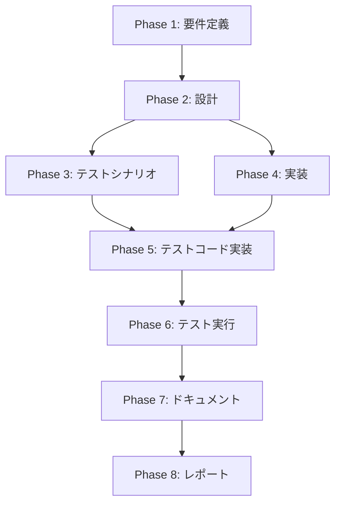

# プロジェクト計画書: Issue #45

## 1. Issue分析

### 複雑度: 簡単

### 見積もり工数: 3~5時間

**根拠**:
- 影響範囲: 3つのコマンドハンドラファイル（`execute.ts`, `review.ts`, `migrate.ts`）
- 作業内容: 既存の `any` 型を適切な TypeScript インターフェースに置き換える
- 既に `src/types/commands.ts` に型定義の基盤が存在し、パターンが確立されている
- コンパイル時エラーを修正するだけで、ランタイムロジックの変更は不要
- テストコードは既存テストに型を追加するのみ（新規テストシナリオ不要）

### リスク評価: 低

**理由**:
- 型の追加は非破壊的変更（既存の動作に影響しない）
- Commander.js のオプション定義は既に `src/main.ts` に明確に記述されている
- 影響範囲が限定的（3ファイル、各1箇所）
- TypeScript コンパイラが型不一致を自動検出するため、バグ混入リスクが極めて低い

---

## 2. 実装戦略判断

### 実装戦略: EXTEND

**判断根拠**:
- 既存の型定義ファイル `src/types/commands.ts` を拡張する形で新しいインターフェースを追加
- コマンドハンドラ関数のシグネチャを変更するが、内部ロジックは保持
- 新規ファイル作成は不要（既存ファイルの型宣言のみ追加）

**判断理由**:
- `src/types/commands.ts` に既に `PhaseContext`, `ExecutionSummary`, `IssueInfo`, `BranchValidationResult` が定義されており、同じパターンで `ExecuteCommandOptions`, `ReviewCommandOptions`, `MigrateOptions` を追加
- `src/commands/migrate.ts` には既に `MigrateOptions` インターフェースが存在するが、これは内部型であり、コマンドハンドラのオプション型として正式に昇格させる
- 既存のコマンドハンドラ関数はロジックを変更せず、型のみ追加

### テスト戦略: UNIT_ONLY

**判断根拠**:
- 型安全性の改善は、主にコンパイル時の型チェックで検証可能
- ユニットテストで型推論とオプション検証の動作を確認すれば十分
- インテグレーションテストは不要（既存のワークフローに影響しない）
- BDD テストも不要（エンドユーザーの振る舞いは変わらない）

**判断理由**:
- リファクタリングによる型の追加は、コンパイラが自動的に検証するため、複雑なテストシナリオ不要
- ユニットテストでオプションのパース処理と型の整合性を確認すれば、十分な品質保証が可能
- 既存の統合テストが通過すれば、後方互換性も保証される

### テストコード戦略: EXTEND_TEST

**判断根拠**:
- 既存のコマンドハンドラのテストファイル（存在する場合）に型検証テストを追加
- 新規のテストファイル作成は不要（型推論テスト程度のシンプルな追加）

**判断理由**:
- 型安全性の改善は、既存テストに型アサーションを追加する程度で済む
- 新規のテストシナリオは不要（コンパイラが型チェックを保証）
- テストコード量の増加は最小限（各ハンドラに1~2個の型検証テストを追加）

---

## 3. 影響範囲分析

### 既存コードへの影響

**変更が必要なファイル**:
1. **`src/types/commands.ts`** (約71行)
   - 新規インターフェース追加: `ExecuteCommandOptions`, `ReviewCommandOptions`
   - 既存の `MigrateOptions` を `src/commands/migrate.ts` から移行（重複排除）

2. **`src/commands/execute.ts`** (約682行)
   - 1箇所: `handleExecuteCommand(options: any)` → `handleExecuteCommand(options: ExecuteCommandOptions)`
   - 内部の型推論は TypeScript が自動的に修正

3. **`src/commands/review.ts`** (約37行)
   - 1箇所: `handleReviewCommand(options: any)` → `handleReviewCommand(options: ReviewCommandOptions)`
   - 内部の型推論は TypeScript が自動的に修正

4. **`src/commands/migrate.ts`** (約265行)
   - `MigrateOptions` インターフェースを `src/types/commands.ts` に移行
   - import 文を `../types/commands.js` から取得するように修正

5. **`src/main.ts`** (約136行)
   - 変更不要（Commander.js のオプション定義は既に正しく記述されている）
   - 各コマンドハンドラへの `options` 引数は、型推論により自動的に適切な型が割り当てられる

### 依存関係の変更

**新規依存の追加**: なし

**既存依存の変更**: なし

**型定義の依存関係**:
- `src/types/commands.ts` → `src/commands/execute.ts`, `src/commands/review.ts`, `src/commands/migrate.ts` が import
- 既存の型定義ファイルと同じパターンなので、依存関係の変更は最小限

### マイグレーション要否

**不要**

理由:
- ランタイム動作は変更されない
- 既存のメタデータ構造に変更なし
- 環境変数やコンフィグファイルへの影響なし

---

## 4. タスク分割

### Phase 1: 要件定義 (見積もり: 0.5h)

- [ ] Task 1-1: Issue #45 の内容を確認し、型定義の網羅性を検証 (0.5h)
  - Commander.js のオプション定義（`src/main.ts`）と照合
  - 各コマンドハンドラで使用されているオプションを抽出
  - `ExecuteCommandOptions`, `ReviewCommandOptions`, `MigrateOptions` に必要なフィールドをリストアップ

### Phase 2: 設計 (見積もり: 0.5h)

- [ ] Task 2-1: 型定義インターフェースの設計 (0.5h)
  - `ExecuteCommandOptions` インターフェースの設計（約14個のフィールド）
  - `ReviewCommandOptions` インターフェースの設計（約2個のフィールド）
  - `MigrateOptions` の既存定義を確認（`src/commands/migrate.ts` から移行）
  - 既存の型定義パターン（`PhaseContext`, `IssueInfo` 等）との整合性確認

### Phase 3: テストシナリオ (見積もり: 0.5h)

- [x] Task 3-1: 型推論のテストシナリオ作成 (0.5h)
  - `handleExecuteCommand` の型推論テスト（オプションの型が正しく推論されるか）
  - `handleReviewCommand` の型推論テスト
  - `handleMigrateCommand` の型推論テスト（既存の `MigrateOptions` を使用）
  - コンパイルエラーが発生するケースのテスト（型不一致の検出）

### Phase 4: 実装 (見積もり: 1~2h)

- [x] Task 4-1: `src/types/commands.ts` に新規インターフェースを追加 (0.5~1h)
  - `ExecuteCommandOptions` インターフェース作成（フィールド: issue, phase, preset, gitUser, gitEmail, forceReset, skipDependencyCheck, ignoreDependencies, agent, cleanupOnComplete, cleanupOnCompleteForce, requirementsDoc, designDoc, testScenarioDoc）
  - `ReviewCommandOptions` インターフェース作成（フィールド: phase, issue）
  - `MigrateOptions` を `src/commands/migrate.ts` から移行（既存のインターフェースを移動）
  - JSDoc コメントで各フィールドの説明を追加

- [x] Task 4-2: コマンドハンドラの型シグネチャ修正 (0.5h)
  - `src/commands/execute.ts` の `handleExecuteCommand` 関数に `ExecuteCommandOptions` を適用
  - `src/commands/review.ts` の `handleReviewCommand` 関数に `ReviewCommandOptions` を適用
  - `src/commands/migrate.ts` の `handleMigrateCommand` 関数の import を修正
  - TypeScript コンパイルエラーの修正（型不一致がある場合）

- [x] Task 4-3: コンパイル確認 (0.5h)
  - `npm run build` を実行し、コンパイルエラーがないことを確認
  - ESLint チェック（`npx eslint --ext .ts src`）でコードスタイル違反がないことを確認

### Phase 5: テストコード実装 (見積もり: 0.5~1h)

- [x] Task 5-1: 型推論のユニットテストを追加 (0.5~1h)
  - `tests/unit/types/command-options.test.ts` を作成（22個の型推論テストを実装）
  - `ExecuteCommandOptions` の型推論テスト（TypeScript の型チェックで検証）
  - `ReviewCommandOptions` の型推論テスト
  - `MigrateOptions` の型推論テスト
  - オプションの必須フィールド（`issue` 等）が正しく検証されるかのテスト
  - 既存テストファイルに型安全性テストを追加（execute.test.ts, review.test.ts, migrate.test.ts）

### Phase 6: テスト実行 (見積もり: 0.5h)

- [x] Task 6-1: すべてのテストを実行 (0.5h)
  - `npm test` を実行し、すべてのテストが通過することを確認
  - `npm run test:unit` でユニットテストのみ実行
  - 既存の統合テストが通過することを確認（後方互換性の検証）

### Phase 7: ドキュメント (見積もり: 0.5h)

- [x] Task 7-1: 型定義の JSDoc コメント追加 (0.5h)
  - `src/types/commands.ts` の新規インターフェースに JSDoc コメントを追加
  - IDE のオートコンプリートで表示される説明文を記載
  - 各フィールドのデフォルト値、必須/オプションを明記

### Phase 8: レポート (見積もり: 0.5h)

- [x] Task 8-1: 変更内容のサマリーを作成 (0.5h)
  - 変更されたファイルのリスト
  - 追加された型定義のサマリー
  - コンパイルエラーの削減数（`any` 型の削除数）
  - PR 説明文の作成

---

## 5. 依存関係

**重要な依存関係**:
- Phase 2（設計）は Phase 1（要件定義）の完了が必須
- Phase 4（実装）は Phase 2（設計）の完了が必須
- Phase 5（テストコード実装）は Phase 3（テストシナリオ）と Phase 4（実装）の両方の完了が必須
- Phase 6（テスト実行）は Phase 5（テストコード実装）の完了が必須

---

## 6. リスクと軽減策

### リスク1: 型定義の漏れ（オプションフィールドの見落とし）

- **影響度**: 中
- **確率**: 低
- **軽減策**:
  1. `src/main.ts` の Commander.js オプション定義を網羅的に確認
  2. 各コマンドハンドラ内で `options.xxx` でアクセスされているフィールドを grep で抽出
  3. TypeScript コンパイラが未定義フィールドをエラーとして検出するため、コンパイル時に発見可能

### リスク2: Optional vs Required の判定ミス

- **影響度**: 低
- **確率**: 低
- **軽減策**:
  1. Commander.js の `.requiredOption()` と `.option()` を区別して確認
  2. コマンドハンドラ内で `options.xxx ?? defaultValue` のようなフォールバック処理があるフィールドは Optional とする
  3. ユニットテストで必須フィールドの検証ロジックを追加

### リスク3: 既存テストの失敗（型変更による副作用）

- **影響度**: 低
- **確率**: 極めて低
- **軽減策**:
  1. 実装後、必ず `npm test` を実行してすべてのテストが通過することを確認
  2. TypeScript の型推論により、型不一致があればコンパイル時にエラーとなるため、ランタイムエラーは発生しにくい
  3. 既存のテストコードに型アサーションを追加する程度の変更なので、テストロジックの変更は不要

### リスク4: `MigrateOptions` の移行時の重複定義

- **影響度**: 低
- **確率**: 低
- **軽減策**:
  1. `src/commands/migrate.ts` の `MigrateOptions` を `src/types/commands.ts` に移行する際、元の定義を削除
  2. `src/commands/migrate.ts` で `import type { MigrateOptions } from '../types/commands.js'` を追加
  3. コンパイルエラーが発生した場合、import パスを修正

---

## 7. 品質ゲート

### Phase 1: 要件定義

- [ ] Commander.js のオプション定義が完全に抽出されている
- [ ] 各コマンドハンドラで使用されているオプションフィールドが網羅的にリストアップされている
- [ ] 必須オプションとオプショナルオプションが明確に区別されている

### Phase 2: 設計

- [ ] **実装戦略（EXTEND）が明確に記述されている**
- [ ] **テスト戦略（UNIT_ONLY）が明確に記述されている**
- [ ] **テストコード戦略（EXTEND_TEST）が明確に記述されている**
- [ ] 各インターフェースのフィールド名が Commander.js のオプション名と一致している
- [ ] 型定義が既存のコードスタイル（`PhaseContext`, `IssueInfo` 等）と整合性が取れている

### Phase 3: テストシナリオ

- [x] 型推論テストのシナリオが明確に定義されている
- [x] コンパイルエラーの検出テストが含まれている
- [x] 必須フィールドの検証テストが含まれている

### Phase 4: 実装

- [x] `npm run build` がエラーなく完了する
- [x] `npx eslint --ext .ts src` がエラーなく完了する
- [x] すべての `any` 型が適切な型に置き換えられている（`handleExecuteCommand`, `handleReviewCommand`）
- [x] `MigrateOptions` が `src/types/commands.ts` に正しく移行されている

### Phase 5: テストコード実装

- [x] 型推論のユニットテストが追加されている
- [x] テストコードがコンパイルエラーなく動作する

### Phase 6: テスト実行

- [x] `npm test` がすべて通過する
- [x] 既存の統合テストが通過する（後方互換性が保証されている）
- [x] 新規追加されたユニットテストが通過する

### Phase 7: ドキュメント

- [x] `src/types/commands.ts` の新規インターフェースに JSDoc コメントが追加されている
- [x] IDE のオートコンプリートで型情報が正しく表示される
- [x] 各フィールドの説明、デフォルト値、必須/オプションが明記されている

### Phase 8: レポート

- [x] 変更内容のサマリーが作成されている
- [x] PR 説明文に型安全性改善のメリット（コンパイル時検証、IDE サポート、リファクタリング容易性）が記載されている
- [x] 削減された `any` 型の数が報告されている

---

## まとめ

**総見積もり時間**: 3~5時間

**主要なマイルストーン**:
1. Phase 2 完了時点で設計が確定し、実装に着手可能
2. Phase 4 完了時点でコンパイルが通過し、型安全性が保証される
3. Phase 6 完了時点ですべてのテストが通過し、後方互換性が検証される

**成功の定義**:
- すべての `any` 型が適切な TypeScript インターフェースに置き換えられている
- `npm run build` がエラーなく完了する
- 既存のテストがすべて通過する（後方互換性が保たれている）
- IDE のオートコンプリートで型情報が正しく表示される
