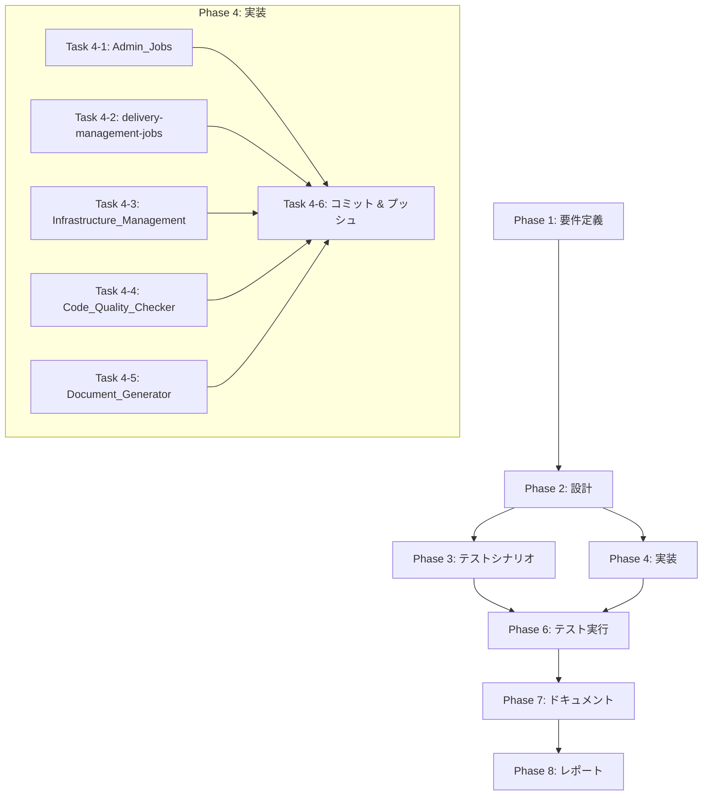

# プロジェクト計画書: Issue #454

## 全Jenkins Jobsのagentラベルをec2-fleet-microに統一

**Issue URL**: https://github.com/tielec/ai-workflow-agent/issues/454
**作成日**: 2025-01-21
**ステータス**: Planning Complete

---

## 1. Issue分析

### 概要

EC2 Fleetの最適化とコスト削減のため、17のJenkinsジョブのagentラベルを`ec2-fleet-micro`に統一する。各ジョブについてJob DSL（.groovyファイル）とJenkinsfileの2箇所を修正する必要がある。

### 重要な発見事項

**本リポジトリ（ai-workflow-agent）には対象ジョブが存在しない**

調査の結果、以下が判明:

1. **ai-workflow-agent リポジトリ**: 既にすべてのJenkinsジョブが`ec2-fleet-micro`に更新済み（Issue #435で対応完了）
2. **対象ジョブの配置**: Issue記載のジョブカテゴリ（Admin_Jobs、delivery-management-jobs等）は**別のリポジトリ**に配置されている

### 対象ジョブ一覧（別リポジトリ）

| カテゴリ | ジョブ数 | 修正ファイル数 |
|---------|---------|---------------|
| Admin_Jobs | 6 | 12 |
| delivery-management-jobs | 3 | 6 |
| Infrastructure_Management | 1 | 2 |
| Code_Quality_Checker | 4 | 8 |
| Document_Generator | 3 | 6 |
| **合計** | **17** | **34** |

### 複雑度判定

**複雑度: 簡単**

- **理由**:
  - 単純な文字列置換作業（`ec2-fleet` → `ec2-fleet-micro`）
  - 各ファイルの修正箇所は1-2行
  - ロジック変更なし
  - 既存パターンに従った一括変更

### 見積もり工数

**合計: 3-4時間**

| 作業 | 見積もり |
|-----|---------|
| ファイル特定・現状確認 | 0.5h |
| 34ファイルの修正 | 1.5h |
| Seed Job実行・反映確認 | 0.5h |
| 動作確認テスト | 0.5-1h |

**根拠**:
- 1ファイルあたりの修正時間: 2-3分（単純な文字列置換）
- 34ファイル × 3分 = 約100分 ≈ 1.5時間
- 確認・テスト作業を含めて3-4時間

### リスク評価

**リスク: 低**

- 変更は単純で明確
- 既にai-workflowパイプラインで同様の変更をテスト済み（Issue #435）
- ロールバックが容易（Git revert）

---

## 2. 実装戦略判断

### 実装戦略: REFACTOR

**判断根拠**:
- 既存コードの構造変更なし
- 既存ファイルの設定値（agentラベル）のみを変更
- 新規ファイル・クラス・モジュールの作成なし
- 機能追加なし

**具体的な作業**:
- 既存の`.groovy`ファイル内の`label 'ec2-fleet'`を`label 'ec2-fleet-micro'`に変更
- 既存のJenkinsfile内の`label 'ec2-fleet'`を`label 'ec2-fleet-micro'`に変更

### テスト戦略: INTEGRATION_ONLY

**判断根拠**:
- **ユニットテスト不要**: 設定値の変更のみでロジック変更なし
- **インテグレーションテスト必要**: Jenkinsジョブの実際の動作確認が必須
  - Seed Jobの実行と反映確認
  - 代表的なジョブの動作確認

**テスト内容**:
1. Seed Job実行によるJob DSL反映確認
2. 各カテゴリから1ジョブずつ選定し、実際にビルド実行
3. `ec2-fleet-micro`ラベルでエージェントが正しく割り当てられることを確認

### テストコード戦略: N/A（テストコード作成不要）

**判断根拠**:
- 設定値の変更のみでアプリケーションコードの変更なし
- 自動テストの対象外（Jenkins設定ファイル）
- 手動のインテグレーションテストで検証

---

## 3. 影響範囲分析

### 既存コードへの影響

**影響を受けるファイル（別リポジトリ）**:

#### Admin_Jobs（12ファイル）
- `Backup_Config/job.groovy` + `Backup_Config/Jenkinsfile`
- `Github_Webhooks_Setting/job.groovy` + `Github_Webhooks_Setting/Jenkinsfile`
- `Restore_Config/job.groovy` + `Restore_Config/Jenkinsfile`
- `SSM_Parameter_Backup/job.groovy` + `SSM_Parameter_Backup/Jenkinsfile`
- `SSM_Parameter_Restore/job.groovy` + `SSM_Parameter_Restore/Jenkinsfile`
- `Test_EC2_Fleet_Agent/job.groovy` + `Test_EC2_Fleet_Agent/Jenkinsfile`

#### delivery-management-jobs（6ファイル）
- `pulumi-dashboard/job.groovy` + `pulumi-dashboard/Jenkinsfile`
- `ssm-parameter-store-dashboard/job.groovy` + `ssm-parameter-store-dashboard/Jenkinsfile`
- `lambda-verification/job.groovy` + `lambda-verification/Jenkinsfile`

#### Infrastructure_Management（2ファイル）
- `Shutdown_Jenkins_Environment/job.groovy` + `Shutdown_Jenkins_Environment/Jenkinsfile`

#### Code_Quality_Checker（8ファイル）
- `pr-complexity-analyzer-github-trigger/job.groovy` + `Jenkinsfile`
- `rust-code-analysis-check-github-trigger/job.groovy` + `Jenkinsfile`
- `rust-code-analysis-check/job.groovy` + `Jenkinsfile`
- `pr-complexity-analyzer/job.groovy` + `Jenkinsfile`

#### Document_Generator（6ファイル）
- `pull_request_comment_builder/job.groovy` + `Jenkinsfile`
- `multi_pull_request_comment_builder/job.groovy` + `Jenkinsfile`
- `pull_request_comment_builder_github_trigger/job.groovy` + `Jenkinsfile`

### 依存関係の変更

- **新規依存の追加**: なし
- **既存依存の変更**: なし
- **EC2 Fleet設定依存**: `ec2-fleet-micro`ラベルがEC2 Fleet設定で定義済みであること（前提条件）

### マイグレーション要否

- **データベーススキーマ変更**: なし
- **設定ファイル変更**: Jenkinsジョブ設定のみ
- **Jenkins再起動**: 不要（Seed Job実行で反映）

---

## 4. タスク分割

### Phase 1: 要件定義 (見積もり: 0.5h)

- [ ] Task 1-1: 対象リポジトリの特定と確認 (0.25h)
  - 対象ジョブが配置されているリポジトリを特定
  - リポジトリへのアクセス権限を確認
- [ ] Task 1-2: 現状のagentラベル設定の確認 (0.25h)
  - 各ジョブの現在のagentラベル値を記録
  - 変更が必要なファイルの一覧を作成

### Phase 2: 設計 (見積もり: 0.25h)

- [ ] Task 2-1: 修正パターンの定義 (0.25h)
  - Job DSLの修正パターンを定義
  - Jenkinsfileの修正パターンを定義
  - 各ファイルタイプの修正箇所を特定

### Phase 3: テストシナリオ (見積もり: 0.25h)

- [ ] Task 3-1: テスト計画の策定 (0.25h)
  - 各カテゴリから代表ジョブを1つ選定
  - テスト実行手順を定義
  - 成功基準を定義

### Phase 4: 実装 (見積もり: 2h)

- [ ] Task 4-1: Admin_Jobsの修正 (0.5h)
  - 6ジョブ × 2ファイル = 12ファイルの修正
  - Job DSL: `label 'ec2-fleet'` → `label 'ec2-fleet-micro'`
  - Jenkinsfile: `label 'ec2-fleet'` → `label 'ec2-fleet-micro'`
- [ ] Task 4-2: delivery-management-jobsの修正 (0.25h)
  - 3ジョブ × 2ファイル = 6ファイルの修正
- [ ] Task 4-3: Infrastructure_Managementの修正 (0.1h)
  - 1ジョブ × 2ファイル = 2ファイルの修正
- [ ] Task 4-4: Code_Quality_Checkerの修正 (0.25h)
  - 4ジョブ × 2ファイル = 8ファイルの修正
- [ ] Task 4-5: Document_Generatorの修正 (0.25h)
  - 3ジョブ × 2ファイル = 6ファイルの修正
- [ ] Task 4-6: 変更のコミットとプッシュ (0.25h)
  - カテゴリごとまたは一括でコミット
  - リモートリポジトリにプッシュ

### Phase 5: テストコード実装 (見積もり: N/A)

**スキップ**: 設定ファイルの変更のみのため、テストコードの作成は不要

### Phase 6: テスト実行 (見積もり: 0.5h)

- [ ] Task 6-1: Seed Jobの実行 (0.1h)
  - Job DSLの変更をJenkinsに反映
  - 反映結果の確認
- [ ] Task 6-2: 代表ジョブの動作確認 (0.4h)
  - 各カテゴリから1ジョブを選定してビルド実行
  - `ec2-fleet-micro`ラベルでエージェントが割り当てられることを確認
  - ビルドが正常に完了することを確認

### Phase 7: ドキュメント (見積もり: 0.25h)

- [ ] Task 7-1: 変更内容のドキュメント化 (0.25h)
  - 変更したファイルの一覧を記録
  - 変更前後の設定値を記録
  - Issue #454のチェックリストを更新

### Phase 8: レポート (見積もり: 0.25h)

- [ ] Task 8-1: 完了レポートの作成 (0.25h)
  - 実施した変更のサマリー
  - テスト結果の報告
  - コスト削減効果の予測

---

## 5. 依存関係



**並列実行可能なタスク**:
- Task 4-1 ～ Task 4-5 は並列実行可能（独立したファイル修正）

---

## 6. リスクと軽減策

### リスク1: 対象リポジトリへのアクセス権限不足

- **影響度**: 高
- **確率**: 低
- **軽減策**:
  - 事前にリポジトリへのアクセス権限を確認
  - 必要に応じてリポジトリオーナーに権限付与を依頼

### リスク2: EC2 Fleet設定で`ec2-fleet-micro`ラベルが未定義

- **影響度**: 高
- **確率**: 低（Issue #435で既にテスト済み）
- **軽減策**:
  - 実装前にEC2 Fleet設定を確認
  - ラベルが未定義の場合はInfraチームと調整

### リスク3: 一部ジョブで`ec2-fleet-micro`インスタンスのリソースが不足

- **影響度**: 中
- **確率**: 低（軽量ジョブとして選定済み）
- **軽減策**:
  - 各ジョブの実行時リソース使用量を事前確認
  - 問題発生時は個別にラベルを調整

### リスク4: ファイル構造が想定と異なる

- **影響度**: 中
- **確率**: 中
- **軽減策**:
  - Phase 1で実際のファイル構造を確認
  - 想定と異なる場合は計画を修正

### リスク5: Seed Job実行時のエラー

- **影響度**: 中
- **確率**: 低
- **軽減策**:
  - 変更前のJob DSL設定をバックアップ
  - エラー発生時はGit revertで復旧

---

## 7. 品質ゲート

### Phase 1: 要件定義

- [ ] 対象リポジトリが特定されている
- [ ] 対象ファイルの一覧が作成されている
- [ ] 各ファイルの現在のagentラベル値が記録されている
- [ ] リポジトリへのアクセス権限が確認されている

### Phase 2: 設計

- [ ] 実装戦略の判断根拠が明記されている（REFACTOR）
- [ ] テスト戦略の判断根拠が明記されている（INTEGRATION_ONLY）
- [ ] 修正パターンが定義されている
- [ ] 各ファイルタイプの修正箇所が特定されている

### Phase 3: テストシナリオ

- [ ] 各カテゴリから代表ジョブが選定されている
- [ ] テスト実行手順が定義されている
- [ ] 成功基準が明確に定義されている

### Phase 4: 実装

- [ ] すべての対象ファイル（34ファイル）が修正されている
- [ ] 修正内容が`label 'ec2-fleet-micro'`で統一されている
- [ ] 変更がコミット・プッシュされている
- [ ] コミットメッセージにIssue番号（#454）が含まれている

### Phase 5: テストコード実装

- [ ] スキップ（設定ファイル変更のみのため）

### Phase 6: テスト実行

- [ ] Seed Jobが正常に実行されている
- [ ] 各カテゴリの代表ジョブがビルド成功している
- [ ] `ec2-fleet-micro`ラベルでエージェントが割り当てられている

### Phase 7: ドキュメント

- [ ] 変更したファイルの一覧が記録されている
- [ ] Issue #454のチェックリストが更新されている

### Phase 8: レポート

- [ ] 完了レポートが作成されている
- [ ] テスト結果が報告されている

---

## 8. 前提条件と制約

### 前提条件

1. **EC2 Fleet設定**: `ec2-fleet-micro`ラベルがEC2 Fleet設定で正しく定義されている
2. **リポジトリアクセス**: 対象リポジトリへの書き込み権限がある
3. **Jenkins権限**: Seed Jobの実行権限がある
4. **Issue #435完了**: ai-workflowパイプラインでのテストが完了し、`ec2-fleet-micro`の動作が確認済み

### 制約

1. **別リポジトリ**: 対象ファイルはai-workflow-agentリポジトリ外に配置されている
2. **Jenkins停止不可**: 変更はJenkinsを停止せずに実施する必要がある
3. **営業時間外推奨**: 念のため、ジョブ実行の少ない時間帯に変更を実施

---

## 9. 成果物

| フェーズ | 成果物 |
|---------|--------|
| Phase 1 | 対象ファイル一覧、現状設定値記録 |
| Phase 2 | 修正パターン定義書 |
| Phase 3 | テスト計画書 |
| Phase 4 | 修正済みファイル（34ファイル）、コミット履歴 |
| Phase 5 | N/A |
| Phase 6 | テスト結果報告 |
| Phase 7 | 変更履歴ドキュメント |
| Phase 8 | 完了レポート |

---

## 10. 補足情報

### 関連Issue

- **Issue #435**: ai-workflowパイプラインのラベル変更（完了済み、本Issue #454の前提）

### 参考ドキュメント

- [Jenkins README](/jenkins/README.md)
- [EC2 Fleet設定ドキュメント]（別リポジトリ）

### 変更パターン例

#### Job DSL (.groovy)

```groovy
// 修正前
agent {
    label 'ec2-fleet'
}

// 修正後
agent {
    label 'ec2-fleet-micro'
}
```

#### Jenkinsfile

```groovy
// 修正前
pipeline {
    agent {
        label 'ec2-fleet'
    }
}

// 修正後
pipeline {
    agent {
        label 'ec2-fleet-micro'
}
```

---

## 品質ゲートチェックリスト（Phase 0）

- [x] **実装戦略が明確に決定されている**: REFACTOR
- [x] **テスト戦略が明確に決定されている**: INTEGRATION_ONLY
- [x] **テストコード戦略が明確に決定されている**: N/A（テストコード作成不要）
- [x] **影響範囲が分析されている**: 5カテゴリ、17ジョブ、34ファイル
- [x] **タスク分割が適切な粒度である**: 各タスク0.1h〜0.5h
- [x] **リスクが洗い出されている**: 5つのリスクと軽減策を定義

---

*このプロジェクト計画書はPhase 0で作成されました。*
