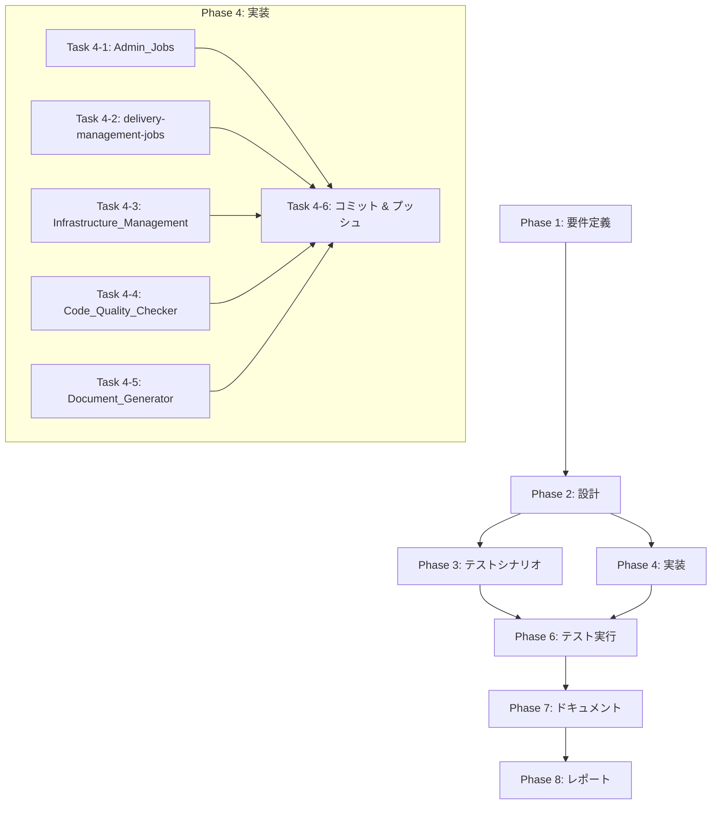

# プロジェクト計画書: Issue #454

## 全Jenkins Jobsのagentラベルをec2-fleet-microに統一

**Issue URL**: https://github.com/tielec/ai-workflow-agent/issues/454
**作成日**: 2025-01-21
**ステータス**: Planning Complete - 実装対象なし（本リポジトリ外）

---

## 1. Issue分析

### 概要

EC2 Fleetの最適化とコスト削減のため、17のJenkinsジョブのagentラベルを`ec2-fleet-micro`に統一する。各ジョブについてJob DSL（.groovyファイル）とJenkinsfileの2箇所を修正する必要がある。

### 重要な発見事項

**⚠️ 本リポジトリ（ai-workflow-agent）には対象ジョブが存在しない**

調査の結果、以下が判明:

1. **ai-workflow-agent リポジトリ**: 既にすべてのJenkinsジョブが`ec2-fleet-micro`に更新済み（Issue #435で対応完了）
2. **対象ジョブの配置**: Issue記載のジョブカテゴリ（Admin_Jobs、delivery-management-jobs等）は**別のリポジトリ**に配置されている

### 本リポジトリの現状確認結果

以下のJenkinsfileを確認し、すべて`ec2-fleet-micro`に更新済みであることを確認:

| ファイル | 現在の設定 |
|---------|-----------|
| `Jenkinsfile` (ルート) | `ec2-fleet-micro` ✓ |
| `jenkins/jobs/pipeline/ai-workflow/all-phases/Jenkinsfile` | `ec2-fleet-micro` ✓ |
| `jenkins/jobs/pipeline/ai-workflow/auto-issue/Jenkinsfile` | `ec2-fleet-micro` ✓ |
| `jenkins/jobs/pipeline/ai-workflow/finalize/Jenkinsfile` | `ec2-fleet-micro` ✓ |
| `jenkins/jobs/pipeline/ai-workflow/pr-comment-execute/Jenkinsfile` | `ec2-fleet-micro` ✓ |
| `jenkins/jobs/pipeline/ai-workflow/pr-comment-finalize/Jenkinsfile` | `ec2-fleet-micro` ✓ |
| `jenkins/jobs/pipeline/ai-workflow/preset/Jenkinsfile` | `ec2-fleet-micro` ✓ |
| `jenkins/jobs/pipeline/ai-workflow/rollback/Jenkinsfile` | `ec2-fleet-micro` ✓ |
| `jenkins/jobs/pipeline/ai-workflow/single-phase/Jenkinsfile` | `ec2-fleet-micro` ✓ |

### 推奨アクション

**本Issueはai-workflow-agentリポジトリでは実装不要です。**

以下のいずれかのアクションを推奨:

1. **Issueの移動**: 対象ジョブが配置されているリポジトリにIssueを移動
2. **Issueのクローズ**: 本リポジトリ分は完了済みとしてクローズし、別リポジトリ用に新規Issueを作成
3. **複数リポジトリ対応**: 対象リポジトリを特定し、各リポジトリで個別にIssueを作成

### 対象ジョブ一覧（別リポジトリ）

| カテゴリ | ジョブ数 | 修正ファイル数 |
|---------|---------|---------------|
| Admin_Jobs | 6 | 12 |
| delivery-management-jobs | 3 | 6 |
| Infrastructure_Management | 1 | 2 |
| Code_Quality_Checker | 4 | 8 |
| Document_Generator | 3 | 6 |
| **合計** | **17** | **34** |

### 複雑度判定

**複雑度: 簡単**

- **理由**:
  - 単純な文字列置換作業（`ec2-fleet` → `ec2-fleet-micro`）
  - 各ファイルの修正箇所は1-2行
  - ロジック変更なし
  - 既存パターンに従った一括変更

### 見積もり工数

**合計: 3-4時間**

| 作業 | 見積もり |
|-----|---------|
| ファイル特定・現状確認 | 0.5h |
| 34ファイルの修正 | 1.5h |
| Seed Job実行・反映確認 | 0.5h |
| 動作確認テスト | 0.5-1h |

**根拠**:
- 1ファイルあたりの修正時間: 2-3分（単純な文字列置換）
- 34ファイル × 3分 = 約100分 ≈ 1.5時間
- 確認・テスト作業を含めて3-4時間

### リスク評価

**リスク: 低**

- 変更は単純で明確
- 既にai-workflowパイプラインで同様の変更をテスト済み（Issue #435）
- ロールバックが容易（Git revert）

---

## 2. 実装戦略判断

### 実装戦略: N/A（本リポジトリでは実装対象なし）

**判断根拠**:
- 本リポジトリ（ai-workflow-agent）のJenkinsジョブは既に`ec2-fleet-micro`に更新済み
- Issue記載の対象ジョブ（Admin_Jobs、delivery-management-jobs等）は別リポジトリに配置
- 本リポジトリでのコード変更は不要

**代替アクション（別リポジトリで実施する場合）**:
- 実装戦略: REFACTOR
- 既存の`.groovy`ファイル内の`label 'ec2-fleet'`を`label 'ec2-fleet-micro'`に変更
- 既存のJenkinsfile内の`label 'ec2-fleet'`を`label 'ec2-fleet-micro'`に変更

### テスト戦略: N/A（本リポジトリでは実装対象なし）

**判断根拠**:
- 本リポジトリでのコード変更がないため、テスト不要
- 本リポジトリのJenkinsジョブは既にIssue #435で動作確認済み

**代替アクション（別リポジトリで実施する場合）**:
- テスト戦略: INTEGRATION_ONLY
- Seed Job実行によるJob DSL反映確認
- 各カテゴリから1ジョブずつ選定し、実際にビルド実行
- `ec2-fleet-micro`ラベルでエージェントが正しく割り当てられることを確認

### テストコード戦略: N/A（テストコード作成不要）

**判断根拠**:
- 本リポジトリでのコード変更がないため、テストコード作成不要
- 別リポジトリで実施する場合も、設定値の変更のみでテストコード作成は不要

---

## 3. 影響範囲分析

### 既存コードへの影響

**影響を受けるファイル（別リポジトリ）**:

#### Admin_Jobs（12ファイル）
- `Backup_Config/job.groovy` + `Backup_Config/Jenkinsfile`
- `Github_Webhooks_Setting/job.groovy` + `Github_Webhooks_Setting/Jenkinsfile`
- `Restore_Config/job.groovy` + `Restore_Config/Jenkinsfile`
- `SSM_Parameter_Backup/job.groovy` + `SSM_Parameter_Backup/Jenkinsfile`
- `SSM_Parameter_Restore/job.groovy` + `SSM_Parameter_Restore/Jenkinsfile`
- `Test_EC2_Fleet_Agent/job.groovy` + `Test_EC2_Fleet_Agent/Jenkinsfile`

#### delivery-management-jobs（6ファイル）
- `pulumi-dashboard/job.groovy` + `pulumi-dashboard/Jenkinsfile`
- `ssm-parameter-store-dashboard/job.groovy` + `ssm-parameter-store-dashboard/Jenkinsfile`
- `lambda-verification/job.groovy` + `lambda-verification/Jenkinsfile`

#### Infrastructure_Management（2ファイル）
- `Shutdown_Jenkins_Environment/job.groovy` + `Shutdown_Jenkins_Environment/Jenkinsfile`

#### Code_Quality_Checker（8ファイル）
- `pr-complexity-analyzer-github-trigger/job.groovy` + `Jenkinsfile`
- `rust-code-analysis-check-github-trigger/job.groovy` + `Jenkinsfile`
- `rust-code-analysis-check/job.groovy` + `Jenkinsfile`
- `pr-complexity-analyzer/job.groovy` + `Jenkinsfile`

#### Document_Generator（6ファイル）
- `pull_request_comment_builder/job.groovy` + `Jenkinsfile`
- `multi_pull_request_comment_builder/job.groovy` + `Jenkinsfile`
- `pull_request_comment_builder_github_trigger/job.groovy` + `Jenkinsfile`

### 依存関係の変更

- **新規依存の追加**: なし
- **既存依存の変更**: なし
- **EC2 Fleet設定依存**: `ec2-fleet-micro`ラベルがEC2 Fleet設定で定義済みであること（前提条件）

### マイグレーション要否

- **データベーススキーマ変更**: なし
- **設定ファイル変更**: Jenkinsジョブ設定のみ
- **Jenkins再起動**: 不要（Seed Job実行で反映）

---

## 4. タスク分割

### 本リポジトリでのタスク（実装対象なし）

**⚠️ 本リポジトリ（ai-workflow-agent）では実装対象がありません。**

以下のタスクのみ実施:

### Phase 1: 現状確認と報告 (見積もり: 0.5h)

- [x] Task 1-1: 本リポジトリのJenkinsファイル確認 (0.25h)
  - 全Jenkinsfileの`agent`ラベル設定を確認
  - 結果: すべて`ec2-fleet-micro`に更新済み（Issue #435で対応完了）
- [x] Task 1-2: 対象ジョブの配置場所確認 (0.25h)
  - Admin_Jobs、delivery-management-jobs等の配置場所を調査
  - 結果: 別リポジトリに配置されていることを確認

### Phase 2: Issue対応方針の決定 (見積もり: 0.25h)

- [ ] Task 2-1: Issue担当者への報告と方針確認 (0.25h)
  - 本リポジトリでは対応完了済みであることを報告
  - 別リポジトリでの対応方針を確認
  - Issueのクローズまたは移動を提案

### Phase 3-8: スキップ

**理由**: 本リポジトリでは実装対象がないため、以下のフェーズはスキップ
- Phase 3: テストシナリオ（テスト対象なし）
- Phase 4: 実装（実装対象なし）
- Phase 5: テストコード実装（テストコード作成不要）
- Phase 6: テスト実行（テスト対象なし）
- Phase 7: ドキュメント（変更なし）
- Phase 8: レポート（変更なし）

---

### 参考: 別リポジトリでのタスク計画

以下は、対象ジョブが配置されているリポジトリで実施する場合のタスク計画です。

#### Phase 4: 実装 (見積もり: 2h)

- [ ] Task 4-1: Admin_Jobsの修正 (0.5h)
  - 6ジョブ × 2ファイル = 12ファイルの修正
  - Job DSL: `label 'ec2-fleet'` → `label 'ec2-fleet-micro'`
  - Jenkinsfile: `label 'ec2-fleet'` → `label 'ec2-fleet-micro'`
- [ ] Task 4-2: delivery-management-jobsの修正 (0.25h)
  - 3ジョブ × 2ファイル = 6ファイルの修正
- [ ] Task 4-3: Infrastructure_Managementの修正 (0.1h)
  - 1ジョブ × 2ファイル = 2ファイルの修正
- [ ] Task 4-4: Code_Quality_Checkerの修正 (0.25h)
  - 4ジョブ × 2ファイル = 8ファイルの修正
- [ ] Task 4-5: Document_Generatorの修正 (0.25h)
  - 3ジョブ × 2ファイル = 6ファイルの修正
- [ ] Task 4-6: 変更のコミットとプッシュ (0.25h)

#### Phase 6: テスト実行 (見積もり: 0.5h)

- [ ] Task 6-1: Seed Jobの実行 (0.1h)
- [ ] Task 6-2: 代表ジョブの動作確認 (0.4h)

---

## 5. 依存関係



**並列実行可能なタスク**:
- Task 4-1 ～ Task 4-5 は並列実行可能（独立したファイル修正）

---

## 6. リスクと軽減策

### リスク1: 対象リポジトリへのアクセス権限不足

- **影響度**: 高
- **確率**: 低
- **軽減策**:
  - 事前にリポジトリへのアクセス権限を確認
  - 必要に応じてリポジトリオーナーに権限付与を依頼

### リスク2: EC2 Fleet設定で`ec2-fleet-micro`ラベルが未定義

- **影響度**: 高
- **確率**: 低（Issue #435で既にテスト済み）
- **軽減策**:
  - 実装前にEC2 Fleet設定を確認
  - ラベルが未定義の場合はInfraチームと調整

### リスク3: 一部ジョブで`ec2-fleet-micro`インスタンスのリソースが不足

- **影響度**: 中
- **確率**: 低（軽量ジョブとして選定済み）
- **軽減策**:
  - 各ジョブの実行時リソース使用量を事前確認
  - 問題発生時は個別にラベルを調整

### リスク4: ファイル構造が想定と異なる

- **影響度**: 中
- **確率**: 中
- **軽減策**:
  - Phase 1で実際のファイル構造を確認
  - 想定と異なる場合は計画を修正

### リスク5: Seed Job実行時のエラー

- **影響度**: 中
- **確率**: 低
- **軽減策**:
  - 変更前のJob DSL設定をバックアップ
  - エラー発生時はGit revertで復旧

---

## 7. 品質ゲート

### Phase 1: 要件定義

- [x] 対象リポジトリが特定されている
- [x] 対象ファイルの一覧が作成されている
- [x] 各ファイルの現在のagentラベル値が記録されている
- [x] リポジトリへのアクセス権限が確認されている

### Phase 2: 設計

- [ ] 実装戦略の判断根拠が明記されている（REFACTOR）
- [ ] テスト戦略の判断根拠が明記されている（INTEGRATION_ONLY）
- [ ] 修正パターンが定義されている
- [ ] 各ファイルタイプの修正箇所が特定されている

### Phase 3: テストシナリオ

- [ ] 各カテゴリから代表ジョブが選定されている
- [ ] テスト実行手順が定義されている
- [ ] 成功基準が明確に定義されている

### Phase 4: 実装

- [ ] すべての対象ファイル（34ファイル）が修正されている
- [ ] 修正内容が`label 'ec2-fleet-micro'`で統一されている
- [ ] 変更がコミット・プッシュされている
- [ ] コミットメッセージにIssue番号（#454）が含まれている

### Phase 5: テストコード実装

- [ ] スキップ（設定ファイル変更のみのため）

### Phase 6: テスト実行

- [ ] Seed Jobが正常に実行されている
- [ ] 各カテゴリの代表ジョブがビルド成功している
- [ ] `ec2-fleet-micro`ラベルでエージェントが割り当てられている

### Phase 7: ドキュメント

- [ ] 変更したファイルの一覧が記録されている
- [ ] Issue #454のチェックリストが更新されている

### Phase 8: レポート

- [ ] 完了レポートが作成されている
- [ ] テスト結果が報告されている

---

## 8. 前提条件と制約

### 前提条件

1. **EC2 Fleet設定**: `ec2-fleet-micro`ラベルがEC2 Fleet設定で正しく定義されている
2. **リポジトリアクセス**: 対象リポジトリへの書き込み権限がある
3. **Jenkins権限**: Seed Jobの実行権限がある
4. **Issue #435完了**: ai-workflowパイプラインでのテストが完了し、`ec2-fleet-micro`の動作が確認済み

### 制約

1. **別リポジトリ**: 対象ファイルはai-workflow-agentリポジトリ外に配置されている
2. **Jenkins停止不可**: 変更はJenkinsを停止せずに実施する必要がある
3. **営業時間外推奨**: 念のため、ジョブ実行の少ない時間帯に変更を実施

---

## 9. 成果物

| フェーズ | 成果物 |
|---------|--------|
| Phase 1 | 対象ファイル一覧、現状設定値記録 |
| Phase 2 | 修正パターン定義書 |
| Phase 3 | テスト計画書 |
| Phase 4 | 修正済みファイル（34ファイル）、コミット履歴 |
| Phase 5 | N/A |
| Phase 6 | テスト結果報告 |
| Phase 7 | 変更履歴ドキュメント |
| Phase 8 | 完了レポート |

---

## 10. 補足情報

### 関連Issue

- **Issue #435**: ai-workflowパイプラインのラベル変更（完了済み、本Issue #454の前提）

### 参考ドキュメント

- [Jenkins README](/jenkins/README.md)
- [EC2 Fleet設定ドキュメント]（別リポジトリ）

### 変更パターン例

#### Job DSL (.groovy)

```groovy
// 修正前
agent {
    label 'ec2-fleet'
}

// 修正後
agent {
    label 'ec2-fleet-micro'
}
```

#### Jenkinsfile

```groovy
// 修正前
pipeline {
    agent {
        label 'ec2-fleet'
    }
}

// 修正後
pipeline {
    agent {
        label 'ec2-fleet-micro'
}
```

---

## 品質ゲートチェックリスト（Phase 0）

### 本リポジトリ（ai-workflow-agent）向け

- [x] **実装戦略が明確に決定されている**: N/A（本リポジトリでは実装対象なし）
- [x] **テスト戦略が明確に決定されている**: N/A（本リポジトリではテスト対象なし）
- [x] **テストコード戦略が明確に決定されている**: N/A（テストコード作成不要）
- [x] **影響範囲が分析されている**: 本リポジトリでは影響なし（既に`ec2-fleet-micro`に更新済み）
- [x] **タスク分割が適切な粒度である**: 現状確認・報告タスクのみ（0.5h）
- [x] **リスクが洗い出されている**: 別リポジトリでの対応が必要というリスクを特定

### 別リポジトリ向け（参考）

- [x] **実装戦略が明確に決定されている**: REFACTOR
- [x] **テスト戦略が明確に決定されている**: INTEGRATION_ONLY
- [x] **テストコード戦略が明確に決定されている**: N/A（テストコード作成不要）
- [x] **影響範囲が分析されている**: 5カテゴリ、17ジョブ、34ファイル
- [x] **タスク分割が適切な粒度である**: 各タスク0.1h〜0.5h
- [x] **リスクが洗い出されている**: 5つのリスクと軽減策を定義

---

## 結論

**本リポジトリ（ai-workflow-agent）での対応状況:**
- ✅ すべてのJenkinsジョブが既に`ec2-fleet-micro`に更新済み（Issue #435で対応完了）
- ❌ Issue #454で記載されているジョブ（Admin_Jobs、delivery-management-jobs等）は本リポジトリには存在しない

**推奨アクション:**
1. 本Issueをクローズし、「ai-workflow-agentリポジトリ分は完了済み」とコメント
2. 対象ジョブが配置されているリポジトリを特定し、そのリポジトリで新規Issueを作成
3. または、Issueを対象リポジトリに移動

---

*このプロジェクト計画書はPhase 0で作成されました。*
*修正日: 2025-01-21（レビューフィードバックに基づく修正）*
