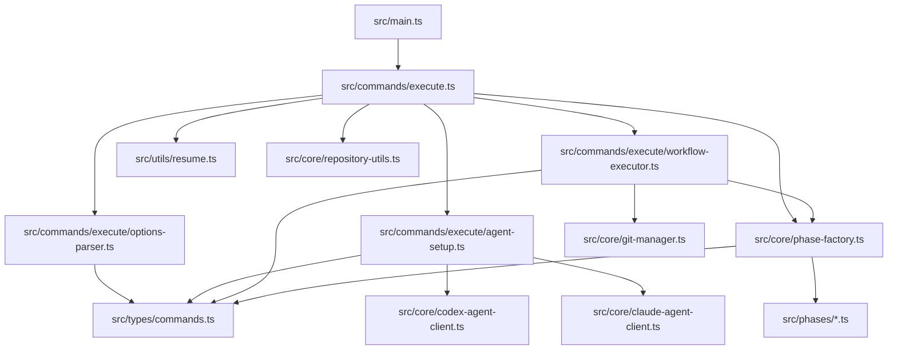

# 詳細設計書: Issue #46

**作成日**: 2025-01-20
**Issue番号**: #46
**Issue タイトル**: リファクタリング: execute.ts を小さなモジュールに分解（683行）
**対象リポジトリ**: tielec/ai-workflow-agent

---

## 0. Planning Document & Requirements の確認

### Planning Document の概要

Planning Document（`.ai-workflow/issue-46/00_planning/output/planning.md`）で策定された開発計画を踏まえ、以下の方針で設計を実施します：

- **実装戦略**: REFACTOR（既存機能を保持しつつ、複数のモジュールに分割）
- **テスト戦略**: UNIT_ONLY（既存の統合テストを回帰テストとして活用し、新規ユニットテストを追加）
- **テストコード戦略**: BOTH_TEST（既存テスト拡張 + 新規テスト作成）
- **見積もり工数**: 24~32時間（3~4営業日相当）
- **リスク評価**: 中（非破壊的リファクタリング、既存テストでカバーされているが、インポート文修正時の誤りが混入しやすい）

### Requirements の概要

要件定義書（`.ai-workflow/issue-46/01_requirements/output/requirements.md`）では以下の機能要件が定義されています：

- **FR-1**: モジュール分割（4つのモジュール + ファサード）
- **FR-2**: options-parser モジュール（CLIオプション解析とバリデーション）
- **FR-3**: agent-setup モジュール（エージェント初期化と認証情報解決）
- **FR-4**: workflow-executor モジュール（ワークフロー実行ロジック）
- **FR-5**: phase-factory モジュール（フェーズインスタンス生成）
- **FR-6**: ファサードパターンによる後方互換性維持
- **FR-7**: インポート文の整理

---

## 1. アーキテクチャ設計

### 1.1 全体アーキテクチャ

```
src/commands/execute.ts (ファサード、約150行)
├── handleExecuteCommand() ... メインエントリーポイント（簡素化、各モジュールへ委譲）
├── 既存公開関数の再エクスポート
│   ├── executePhasesSequential (workflow-executor から)
│   ├── executePhasesFrom (workflow-executor から)
│   ├── createPhaseInstance (phase-factory から)
│   ├── resolvePresetName (そのまま保持)
│   └── getPresetPhases (そのまま保持)
└── 内部ヘルパー関数
    ├── canResumeWorkflow (そのまま保持)
    ├── loadExternalDocuments (そのまま保持)
    ├── resetMetadata (そのまま保持)
    └── reportExecutionSummary (そのまま保持)

src/commands/execute/options-parser.ts (約100行)
├── parseExecuteOptions() ... ExecuteCommandOptions を正規化
└── validateExecuteOptions() ... 相互排他オプションの検証

src/commands/execute/agent-setup.ts (約150行)
├── setupAgentClients() ... Codex/Claude クライアントの初期化
└── resolveAgentCredentials() ... 認証情報のフォールバック処理

src/commands/execute/workflow-executor.ts (約200行)
├── executePhasesSequential() ... フェーズの順次実行
├── executePhasesFrom() ... 特定フェーズからの実行
└── (内部関数) executePhaseWithGitCommit() ... フェーズ実行 + Git コミット

src/core/phase-factory.ts (約100行)
├── createPhaseInstance() ... フェーズインスタンス生成
└── (内部関数) buildPhaseContext() ... PhaseContext の構築
```

### 1.2 モジュール間の依存関係



### 1.3 データフロー

```
1. CLI (main.ts)
   ↓ ExecuteCommandOptions
2. handleExecuteCommand() (execute.ts)
   ↓
3. options-parser.validateExecuteOptions() ... オプション検証
   ↓ ParsedExecuteOptions (正規化)
4. agent-setup.setupAgentClients() ... エージェント初期化
   ↓ AgentSetupResult { codexClient, claudeClient }
5. PhaseContext 構築
   ↓
6. workflow-executor.executePhasesSequential() ... フェーズ実行
   ↓ phaseName → phase-factory.createPhaseInstance()
   ↓ PhaseInstance
7. phaseInstance.run() ... 各フェーズ実行
   ↓ ExecutionSummary
8. reportExecutionSummary() ... 結果報告
```

---

## 2. 実装戦略判断

### 実装戦略: REFACTOR

**判断根拠**:

1. **既存機能の完全保持**: 新規機能の追加はなく、既存の `execute.ts` の機能を100%保持しつつ、複数のモジュールに分割する
2. **非破壊的リファクタリング**: 後方互換性を100%維持し、既存のインポート元（`src/main.ts`、テストファイル）は変更不要
3. **ファサードパターンの適用**: `execute.ts` をファサードとして、既存の公開API（`handleExecuteCommand`, `executePhasesSequential`, `createPhaseInstance` 等）を維持
4. **単一責任の原則への準拠**: 各モジュールが明確な責務を持ち、循環的複雑度を低減
5. **過去の成功事例**: Issue #24（GitHubClient）、Issue #25（GitManager）、Issue #26（各種ヘルパー）で実証されたファサードパターンを適用

---

## 3. テスト戦略判断

### テスト戦略: UNIT_ONLY

**判断根拠**:

1. **既存統合テストの活用**: 既存の統合テスト（`preset-execution.test.ts`, `multi-repo-workflow.test.ts`）が十分にカバーしており、これらを回帰テストとして活用
2. **非破壊的リファクタリング**: リファクタリング後も既存の統合テストがそのまま動作すべき
3. **ユニットテストの追加**: 分割された各モジュールの単一責任を検証する新規ユニットテストを追加
4. **外部システム連携の既存対応**: GitHub、Git、Codexエージェント等の外部システム連携は既存のモックやスタブで対応可能
5. **テストカバレッジ目標**: 新規モジュールのコードカバレッジ90%以上を維持

**対象テストレベル**:
- **ユニットテスト**: 分割された各モジュール（options-parser、agent-setup、workflow-executor、phase-factory）の独立した機能を検証
- **統合テスト**: 既存テストを回帰テストとして活用（新規追加は不要）

---

## 4. テストコード戦略判断

### テストコード戦略: BOTH_TEST

**判断根拠**:

1. **既存テスト拡張**: `tests/unit/commands/execute.test.ts` を拡張し、新規公開関数（再エクスポートされた関数）のテストを追加
2. **新規テスト作成**: 新規モジュール（`execute/options-parser.ts`、`execute/agent-setup.ts` 等）に対応するテストファイルを作成
   - `tests/unit/commands/execute/options-parser.test.ts`
   - `tests/unit/commands/execute/agent-setup.test.ts`
   - `tests/unit/commands/execute/workflow-executor.test.ts`
   - `tests/unit/core/phase-factory.test.ts`
3. **既存統合テストの保持**: `preset-execution.test.ts` 等は変更不要（回帰テストとして活用）
4. **モック戦略**: 各モジュールの独立性を担保するため、外部依存（fs、config、MetadataManager等）をモックする

---

## 5. 影響範囲分析

### 5.1 既存コードへの影響

#### 直接影響を受けるファイル:

1. **`src/commands/execute.ts`** (683行 → 約150行に削減)
   - **変更内容**: メインロジックを4つのモジュールに分割、ファサードパターンで既存API維持
   - **影響度**: **大** - 全体の再構成

2. **`src/core/phase-factory.ts`** (新規作成、約100行)
   - **変更内容**: `createPhaseInstance()` を `execute.ts` から移動
   - **影響度**: **中** - 新規ファイル作成

3. **`src/commands/execute/options-parser.ts`** (新規作成、約100行)
   - **変更内容**: CLIオプション解析ロジックを分離
   - **影響度**: **中** - 新規ファイル作成

4. **`src/commands/execute/agent-setup.ts`** (新規作成、約150行)
   - **変更内容**: エージェント初期化ロジックを分離
   - **影響度**: **中** - 新規ファイル作成

5. **`src/commands/execute/workflow-executor.ts`** (新規作成、約200行)
   - **変更内容**: ワークフロー実行ロジックを分離
   - **影響度**: **中** - 新規ファイル作成

6. **`tests/unit/commands/execute.test.ts`** (244行)
   - **変更内容**: テストケース追加（オプション解析、エージェント初期化）
   - **影響度**: **小** - 既存テスト拡張

7. **`tests/unit/commands/execute/`** (新規ディレクトリ)
   - **変更内容**: 新規テストファイル作成
   - **影響度**: **中** - 新規テストスイート作成

8. **`tests/unit/core/phase-factory.test.ts`** (新規作成、約200行)
   - **変更内容**: phase-factory のユニットテスト
   - **影響度**: **中** - 新規テストファイル作成

#### 間接影響を受けるファイル:

- **`src/main.ts`**: インポート文は変更不要（ファサードパターン）
- **既存の統合テスト**: 変更不要（回帰テストとして活用）
- **`CLAUDE.md`, `ARCHITECTURE.md`**: モジュール構成の更新が必要

### 5.2 依存関係の変更

#### 新規依存の追加: **なし**

- 外部ライブラリの追加は不要
- 既存の依存関係（`fs-extra`, `commander`, `simple-git` 等）をそのまま使用

#### 既存依存の変更: **なし**

- 依存関係グラフに変更なし
- インポートパスのみ変更（内部モジュール間）

### 5.3 マイグレーション要否: **不要**

- データベーススキーマ変更: なし
- 設定ファイル変更: なし
- 環境変数変更: なし
- `.ai-workflow/issue-*/metadata.json` 構造変更: なし

### 5.4 後方互換性: **100%維持**

- `src/commands/execute.ts` からの既存エクスポート（`handleExecuteCommand`, `executePhasesSequential`, `createPhaseInstance` 等）は全て維持
- 既存のインポート元（`src/main.ts`, テストファイル）は変更不要
- ファサードパターンにより、外部から見た動作は完全に同一

---

## 6. 変更・追加ファイルリスト

### 6.1 新規作成ファイル

1. **`src/commands/execute/options-parser.ts`** (約100行)
   - CLIオプション解析とバリデーションロジック

2. **`src/commands/execute/agent-setup.ts`** (約150行)
   - エージェント初期化と認証情報解決ロジック

3. **`src/commands/execute/workflow-executor.ts`** (約200行)
   - ワークフロー実行ロジック

4. **`src/core/phase-factory.ts`** (約100行)
   - フェーズインスタンス生成ロジック

5. **`tests/unit/commands/execute/options-parser.test.ts`** (約200行)
   - options-parser のユニットテスト

6. **`tests/unit/commands/execute/agent-setup.test.ts`** (約250行)
   - agent-setup のユニットテスト

7. **`tests/unit/commands/execute/workflow-executor.test.ts`** (約150行)
   - workflow-executor のユニットテスト

8. **`tests/unit/core/phase-factory.test.ts`** (約200行)
   - phase-factory のユニットテスト

### 6.2 修正が必要な既存ファイル

1. **`src/commands/execute.ts`** (683行 → 約150行)
   - ファサード実装への変更
   - 各モジュールへの委譲
   - 既存公開関数の再エクスポート

2. **`tests/unit/commands/execute.test.ts`** (244行 → 約270行)
   - 既存テストの拡張（新規公開関数のテスト追加）

3. **`CLAUDE.md`** (行数: 347)
   - コアモジュールセクションの更新

4. **`ARCHITECTURE.md`** (行数: 336)
   - モジュール一覧テーブルの更新

### 6.3 削除が必要なファイル

**なし**（既存ファイルは全て保持）

---

## 7. 詳細設計

### 7.1 options-parser モジュール

#### ファイルパス
`src/commands/execute/options-parser.ts`

#### 責務
- CLIオプションの解析とバリデーション
- 相互排他オプションの検証
- デフォルト値の補完

#### インターフェース設計

```typescript
/**
 * 解析済みオプション
 */
export interface ParsedExecuteOptions {
  issueNumber: string;
  phaseOption: string;
  presetOption: string | undefined;
  agentMode: 'auto' | 'codex' | 'claude';
  skipDependencyCheck: boolean;
  ignoreDependencies: boolean;
  forceReset: boolean;
  cleanupOnComplete: boolean;
  cleanupOnCompleteForce: boolean;
}

/**
 * バリデーション結果
 */
export interface ValidationResult {
  valid: boolean;
  errors: string[];
}

/**
 * ExecuteCommandOptions を正規化
 * @param options - CLI オプション
 * @returns 解析済みオプション
 */
export function parseExecuteOptions(
  options: ExecuteCommandOptions
): ParsedExecuteOptions {
  // 実装: デフォルト値補完、型変換
}

/**
 * 相互排他オプションを検証
 * @param options - CLI オプション
 * @returns バリデーション結果
 */
export function validateExecuteOptions(
  options: ExecuteCommandOptions
): ValidationResult {
  // 実装: 相互排他オプション検証
  // - '--preset' vs '--phase'
  // - '--skip-dependency-check' vs '--ignore-dependencies'
}
```

#### エラーハンドリング

- **相互排他オプション**: `ValidationResult.valid = false` を返し、`errors` 配列にエラーメッセージを含める
- **必須オプション不足**: `ValidationResult.valid = false` を返し、`errors` 配列にエラーメッセージを含める

#### 実装詳細

- 既存の execute.ts（56-82行）からロジックを移植
- エラーメッセージの統一（既存のメッセージを保持）

### 7.2 agent-setup モジュール

#### ファイルパス
`src/commands/execute/agent-setup.ts`

#### 責務
- エージェント初期化（Codex/Claude）
- 認証情報の解決（フォールバック処理）
- エージェントモード（auto/codex/claude）の選択

#### インターフェース設計

```typescript
/**
 * エージェント初期化結果
 */
export interface AgentSetupResult {
  codexClient: CodexAgentClient | null;
  claudeClient: ClaudeAgentClient | null;
}

/**
 * 認証情報解決結果
 */
export interface CredentialsResult {
  codexApiKey: string | null;
  claudeCredentialsPath: string | null;
}

/**
 * Codex/Claude クライアントを初期化
 * @param agentMode - エージェントモード ('auto' | 'codex' | 'claude')
 * @param workingDir - 作業ディレクトリ
 * @param codexApiKey - Codex API キー（オプション）
 * @param claudeCredentialsPath - Claude 認証情報パス（オプション）
 * @returns エージェント初期化結果
 */
export function setupAgentClients(
  agentMode: 'auto' | 'codex' | 'claude',
  workingDir: string,
  codexApiKey: string | null,
  claudeCredentialsPath: string | null
): AgentSetupResult {
  // 実装: エージェントモードに基づいた初期化
}

/**
 * 認証情報を解決（フォールバック処理）
 * @param homeDir - ホームディレクトリ
 * @param repoRoot - リポジトリルート
 * @returns 認証情報解決結果
 */
export function resolveAgentCredentials(
  homeDir: string,
  repoRoot: string
): CredentialsResult {
  // 実装: Codex API キーのフォールバック処理
  // - CODEX_API_KEY → OPENAI_API_KEY
  // 実装: Claude 認証情報ファイルの候補パス探索
  // - CLAUDE_CODE_CREDENTIALS_PATH
  // - ~/.claude-code/credentials.json
  // - <repo>/.claude-code/credentials.json
}
```

#### フォールバック処理

- **Codex API キー**: `CODEX_API_KEY` → `OPENAI_API_KEY`
- **Claude 認証情報**: 3つの候補パスを探索（優先度順）
  1. `CLAUDE_CODE_CREDENTIALS_PATH` 環境変数
  2. `~/.claude-code/credentials.json`
  3. `<repo>/.claude-code/credentials.json`

#### エージェントモード選択ロジック

- **auto**: Codex API キー優先、Claudeにフォールバック
- **codex**: Codex のみ使用（API キー必須、なければエラー）
- **claude**: Claude のみ使用（認証情報必須、なければエラー）

#### 環境変数設定

- `CODEX_API_KEY` / `OPENAI_API_KEY` を設定（Codexモード時）
- `CLAUDE_CODE_CREDENTIALS_PATH` を設定（Claudeモード時）

#### 実装詳細

- 既存の execute.ts（151-231行）からロジックを移植
- 認証情報フォールバック処理の保持

### 7.3 workflow-executor モジュール

#### ファイルパス
`src/commands/execute/workflow-executor.ts`

#### 責務
- フェーズの順次実行
- 特定フェーズからの実行（レジューム機能）
- Git 自動コミット＆プッシュの統合

#### インターフェース設計

```typescript
/**
 * フェーズを順次実行
 * @param phases - 実行するフェーズリスト
 * @param context - フェーズ実行コンテキスト
 * @param gitManager - Git管理インスタンス
 * @param cleanupOnComplete - 完了時クリーンアップフラグ
 * @param cleanupOnCompleteForce - クリーンアップ強制フラグ
 * @returns 実行サマリー
 */
export async function executePhasesSequential(
  phases: PhaseName[],
  context: PhaseContext,
  gitManager: GitManager,
  cleanupOnComplete?: boolean,
  cleanupOnCompleteForce?: boolean
): Promise<ExecutionSummary> {
  // 実装: 各フェーズを順次実行
  // - createPhaseInstance() を使用してフェーズインスタンスを生成
  // - phaseInstance.run() を実行
  // - 失敗時は ExecutionSummary.success = false を返す
}

/**
 * 特定フェーズから実行
 * @param startPhase - 開始フェーズ
 * @param context - フェーズ実行コンテキスト
 * @param gitManager - Git管理インスタンス
 * @param cleanupOnComplete - 完了時クリーンアップフラグ
 * @param cleanupOnCompleteForce - クリーンアップ強制フラグ
 * @returns 実行サマリー
 */
export async function executePhasesFrom(
  startPhase: PhaseName,
  context: PhaseContext,
  gitManager: GitManager,
  cleanupOnComplete?: boolean,
  cleanupOnCompleteForce?: boolean
): Promise<ExecutionSummary> {
  // 実装: PHASE_ORDER から startPhase 以降のフェーズを抽出
  // - executePhasesSequential() に委譲
}
```

#### 既存機能の保持

- `PhaseContext` の構築ロジックをそのまま移植
- Git 自動コミット＆プッシュの統合を維持（BasePhase.run() 内で実施）
- エラーハンドリング（`getErrorMessage()` 使用）

#### 実装詳細

- 既存の execute.ts（411-485行）からロジックを移植
- ResumeManager 統合の保持

### 7.4 phase-factory モジュール

#### ファイルパス
`src/core/phase-factory.ts`

#### 責務
- フェーズインスタンス生成（10フェーズ対応）
- PhaseContext の構築

#### インターフェース設計

```typescript
/**
 * フェーズインスタンスを作成
 * @param phaseName - フェーズ名
 * @param context - フェーズ実行コンテキスト
 * @returns フェーズインスタンス
 */
export function createPhaseInstance(
  phaseName: PhaseName,
  context: PhaseContext
): BasePhase {
  // 実装: Switch文でフェーズ名に応じてインスタンス生成
  // - 10フェーズすべてに対応
  // - PhaseContext の baseParams を構築
}
```

#### PhaseContext 構築

```typescript
const baseParams = {
  workingDir: context.workingDir,
  metadataManager: context.metadataManager,
  codexClient: context.codexClient,
  claudeClient: context.claudeClient,
  githubClient: context.githubClient,
  skipDependencyCheck: context.skipDependencyCheck,
  ignoreDependencies: context.ignoreDependencies,
  presetPhases: context.presetPhases,
};
```

#### 10フェーズ対応

- Planning、Requirements、Design、TestScenario、Implementation、TestImplementation、Testing、Documentation、Report、Evaluation

#### 実装詳細

- 既存の execute.ts（493-529行）からロジックを移植
- Switch文を保持（10フェーズ対応）
- 各フェーズクラスのインポート（28-37行を移動）

### 7.5 execute.ts ファサード実装

#### ファイルパス
`src/commands/execute.ts` (約150行)

#### 責務
- メインエントリーポイント（`handleExecuteCommand()`）
- 各モジュールへの委譲
- 既存公開関数の再エクスポート

#### handleExecuteCommand() の簡素化

```typescript
export async function handleExecuteCommand(
  options: ExecuteCommandOptions
): Promise<void> {
  // 1. オプション検証（options-parser に委譲）
  const validationResult = validateExecuteOptions(options);
  if (!validationResult.valid) {
    // エラーログ出力
    process.exit(1);
  }

  // 2. オプション解析（options-parser に委譲）
  const parsedOptions = parseExecuteOptions(options);

  // 3. メタデータ読み込み（既存ロジック保持）
  // ...

  // 4. 認証情報解決（agent-setup に委譲）
  const credentials = resolveAgentCredentials(homeDir, repoRoot);

  // 5. エージェント初期化（agent-setup に委譲）
  const { codexClient, claudeClient } = setupAgentClients(
    parsedOptions.agentMode,
    workingDir,
    credentials.codexApiKey,
    credentials.claudeCredentialsPath
  );

  // 6. PhaseContext 構築
  const context: PhaseContext = {
    workingDir,
    metadataManager,
    codexClient,
    claudeClient,
    githubClient,
    skipDependencyCheck: parsedOptions.skipDependencyCheck,
    ignoreDependencies: parsedOptions.ignoreDependencies,
  };

  // 7. フェーズ実行（workflow-executor に委譲）
  if (presetOption !== undefined) {
    // プリセット実行
  } else if (phaseOption === 'all') {
    // 全フェーズ実行またはレジューム
  } else {
    // 単一フェーズ実行
  }

  // 8. 実行サマリー報告
  reportExecutionSummary(summary);
  process.exit(summary.success ? 0 : 1);
}
```

#### 既存公開関数の再エクスポート

```typescript
// workflow-executor から再エクスポート
export { executePhasesSequential, executePhasesFrom } from './execute/workflow-executor.js';

// phase-factory から再エクスポート
export { createPhaseInstance } from '../core/phase-factory.js';

// そのまま保持
export { resolvePresetName, getPresetPhases, canResumeWorkflow };
```

#### 内部ヘルパー関数（そのまま保持）

- `canResumeWorkflow()`
- `loadExternalDocuments()`
- `resetMetadata()`
- `reportExecutionSummary()`

---

## 8. セキュリティ考慮事項

### 8.1 認証・認可

- **Codex API キー**: 環境変数 `CODEX_API_KEY` / `OPENAI_API_KEY` 経由でのみ取得（ハードコード禁止）
- **Claude 認証情報**: 環境変数 `CLAUDE_CODE_CREDENTIALS_PATH` 経由でのみ取得（ハードコード禁止）
- **GitHub Token**: Config クラス経由で取得（`config.getGitHubToken()`）

### 8.2 データ保護

- **Personal Access Token の除去**: Git remote URL のサニタイズ処理を維持（Issue #54 で導入済み）
- **ファイルパスの検証**: 外部ドキュメント読み込み時のパストラバーサル対策を維持

### 8.3 セキュリティリスクと対策

- **リスク**: 認証情報の誤った環境変数設定
  - **対策**: agent-setup モジュールで検証エラーを返す
- **リスク**: 外部ドキュメント読み込み時のパストラバーサル
  - **対策**: `validateExternalDocument()` によるパス検証

---

## 9. 非機能要件への対応

### 9.1 パフォーマンス

- **応答時間**: リファクタリング前後で、フェーズ実行の応答時間に変化なし（±5%以内）
  - ファサードパターンの委譲オーバーヘッドは無視できるレベル（Issue #24, #25で実証済み）
- **メモリ消費**: モジュール分割によるメモリ消費増加は10%以内

### 9.2 スケーラビリティ

- **新規フェーズ追加**: phase-factory モジュールに新規フェーズを追加するだけで対応可能
- **新規プリセット追加**: execute.ts の `resolvePresetName()` と `getPresetPhases()` に追加するだけで対応可能

### 9.3 保守性

- **循環的複雑度**: 各関数の循環的複雑度を10以下に抑える（現在: 推定25+）
- **ファイルサイズ**: 各モジュールは200行以内に抑える（`execute.ts` は約150行に削減）
- **単一責任の原則**: 各モジュールが1つの責務のみを持つ
- **依存性注入**: 各モジュールは PhaseContext や GitManager 等を引数で受け取り、外部依存を注入可能とする

---

## 10. 実装の順序

### 推奨実装順序

実装は以下の順序で行うことを推奨します（Phase 4: 実装フェーズ）：

#### Step 1: phase-factory モジュール（2h）
1. `src/core/phase-factory.ts` の作成
2. `createPhaseInstance()` の実装
3. 既存の execute.ts（493-529行）からロジックを移植
4. 10フェーズすべての対応を保持

**理由**: 他のモジュールが phase-factory に依存するため、最初に実装

#### Step 2: options-parser モジュール（2h）
1. `src/commands/execute/options-parser.ts` の作成
2. `parseExecuteOptions()` の実装
3. `validateExecuteOptions()` の実装
4. 既存の execute.ts（56-82行）からロジックを移植

**理由**: 依存関係が少なく、独立してテスト可能

#### Step 3: agent-setup モジュール（3h）
1. `src/commands/execute/agent-setup.ts` の作成
2. `resolveAgentCredentials()` の実装
3. `setupAgentClients()` の実装
4. 既存の execute.ts（151-231行）からロジックを移植

**理由**: options-parser の次に依存関係が少ない

#### Step 4: workflow-executor モジュール（3h）
1. `src/commands/execute/workflow-executor.ts` の作成
2. `executePhasesSequential()` の実装
3. `executePhasesFrom()` の実装
4. 既存の execute.ts（411-485行）からロジックを移植

**理由**: phase-factory に依存するため、Step 1 の後に実装

#### Step 5: execute.ts ファサード実装（2h）
1. `handleExecuteCommand()` の簡素化（各モジュールへの委譲）
2. 既存の公開関数を新規モジュールから再エクスポート
3. インポート文の整理（28-37行の10フェーズインポートを phase-factory に移動）

**理由**: 全モジュールが完成した後に統合

#### Step 6: TypeScript コンパイル確認（0.5h）
1. `npm run build` の実行
2. TypeScript コンパイルエラーの修正
3. ESLint チェック（`npx eslint src/`）の実行

**理由**: 統合後の検証

### 並行作業の可能性

- **Step 1, 2, 3** は並行作業可能（依存関係なし）
- **Step 4** は Step 1 完了後に並行作業可能
- **Step 5** は Step 1-4 完了後に実施

---

## 11. 品質ゲート（Phase 2: 設計）

本設計書は、以下の品質ゲートを満たすことを確認済みです：

- [x] **実装戦略の判断根拠が明記されている**
  - セクション2で明記（REFACTOR、5つの根拠）

- [x] **テスト戦略の判断根拠が明記されている**
  - セクション3で明記（UNIT_ONLY、5つの根拠）

- [x] **テストコード戦略の判断根拠が明記されている**
  - セクション4で明記（BOTH_TEST、4つの根拠）

- [x] **既存コードへの影響範囲が分析されている**
  - セクション5で分析（直接影響8ファイル、間接影響3ファイル）

- [x] **変更が必要なファイルがリストアップされている**
  - セクション6でリストアップ（新規8ファイル、修正4ファイル、削除0ファイル）

- [x] **設計が実装可能である**
  - セクション7で詳細設計を記載（インターフェース、実装詳細、エラーハンドリング）
  - セクション10で実装順序を明記

---

## 12. 成功基準（再掲）

このリファクタリングは、以下の条件をすべて満たす場合に成功とみなされます：

1. **構造改善**: execute.ts が683行から約150行に削減され、循環的複雑度が低下している
2. **単一責任の原則**: 各モジュールが明確な責務を持ち、独立してテスト可能である
3. **後方互換性**: 既存のインポート元（`src/main.ts`, テストファイル）は変更不要である
4. **テスト成功**: すべてのユニットテストと統合テストが成功している
5. **テストカバレッジ**: 90%以上のカバレッジを維持している
6. **ドキュメント更新**: ARCHITECTURE.md と CLAUDE.md が最新の状態に更新されている
7. **保守性向上**: 今後の機能追加時に、該当モジュールのみ変更すればよい状態になっている

---

## 13. 参考情報

### 類似のリファクタリング事例

本プロジェクトでは、過去に以下のリファクタリングを実施しており、同様のパターンを適用します：

1. **Issue #24: GitHubClient のリファクタリング** (v0.3.1)
   - 702行 → 402行（42.7%削減）
   - ファサードパターンで4つの専門クライアントに分離（IssueClient, PullRequestClient, CommentClient, ReviewClient）
   - 後方互換性100%維持

2. **Issue #25: GitManager のリファクタリング** (v0.3.1)
   - 548行 → 181行（67%削減）
   - ファサードパターンで3つの専門マネージャーに分離（CommitManager, BranchManager, RemoteManager）
   - 後方互換性100%維持

3. **Issue #26: 各種ヘルパーの分離** (v0.3.1)
   - CodexAgentClient、ClaudeAgentClient、MetadataManager から共通ロジックを抽出
   - 9.5%〜27.2%のコード削減

4. **Issue #23: BasePhase のリファクタリング** (v0.3.1)
   - 1420行 → 676行（52.4%削減）
   - 4つの独立したモジュールに責務を分離（AgentExecutor, ReviewCycleManager, ProgressFormatter, LogFormatter）

### 設計パターン

- **ファサードパターン**: 既存の公開API（`handleExecuteCommand` 等）を維持し、内部実装を各モジュールに委譲
- **単一責任の原則（SRP）**: 各モジュールが1つの責務のみを持つ
- **依存性注入（DI）**: 各モジュールがPhaseContextやGitManager等を引数で受け取る

### 関連ドキュメント

- **CLAUDE.md**: プロジェクト全体方針とコーディングガイドライン
- **ARCHITECTURE.md**: アーキテクチャ設計思想
- **Issue #45**: コマンドハンドラの型定義（依存関係、完了済み）
- **Issue #24**: GitHubClient のリファクタリング（参考事例）
- **Issue #25**: GitManager のリファクタリング（参考事例）
- **Issue #26**: 各種ヘルパーの分離（参考事例）

---

**計画書作成日**: 2025-01-20
**想定完了日**: Phase 0〜8 を通じて 24〜32時間（3〜4営業日相当）
