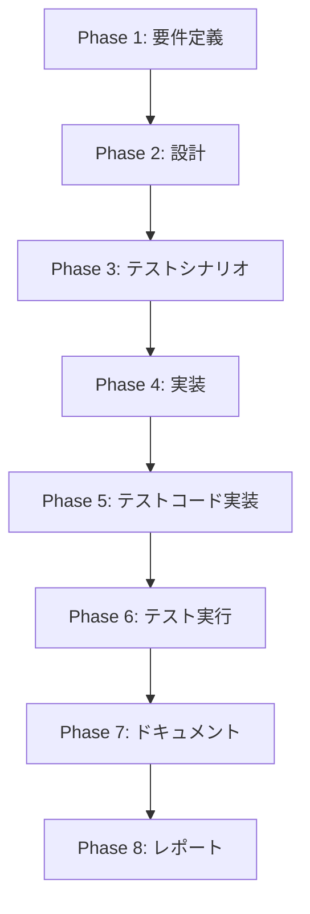

# プロジェクト計画書: Issue #47

## Issue分析

### 複雑度: 中程度

**判断根拠**:
- 単一の基底クラス（`BasePhase`）への新規メソッド追加が中心
- 10個のフェーズ実装クラスの修正が必要（機械的な修正が中心）
- 既存のアーキテクチャを変更せず、テンプレートメソッドパターンによる抽象化のみ
- 新規ファイル作成は不要、既存ファイルの修正のみ

### 見積もり工数: 8~12時間

**内訳**:
- Phase 1 (要件定義): 1~2時間
- Phase 2 (設計): 2~3時間
- Phase 3 (テストシナリオ): 1時間
- Phase 4 (実装): 3~4時間（BasePhase修正 + 10フェーズ修正）
- Phase 5 (テストコード実装): 1~2時間
- Phase 6 (テスト実行): 0.5~1時間
- Phase 7 (ドキュメント): 0.5時間
- Phase 8 (レポート): 0.5時間

### リスク評価: 低

**理由**:
- パターンが明確で実装方針が既に提示されている
- 既存の抽象化メカニズム（`BasePhase`）を活用
- 各フェーズの修正は機械的で予測可能
- テンプレートメソッドパターンは実績のある設計パターン

---

## 実装戦略判断

### 実装戦略: REFACTOR

**判断根拠**:
- **新規ファイル作成なし**: すべて既存ファイルの修正
- **コード削減が主目的**: 重複コード（~500行）を基底クラスに集約
- **既存動作の維持**: フェーズの実行フロー（execute/review/revise）は変更なし
- **保守性向上**: 共通ロジックを単一箇所に集約し、DRY原則に準拠

このIssueは典型的なリファクタリング課題であり、新規機能追加ではなく既存コードの構造改善を目的としています。

### テスト戦略: UNIT_INTEGRATION

**判断根拠**:
- **UNIT_ONLY では不十分**: テンプレートメソッドが各フェーズで正しく動作するか統合的に検証する必要がある
- **INTEGRATION_ONLY では不十分**: `executePhaseTemplate` メソッド自体のロジック（変数置換、ファイル存在チェック等）をユニットテストで検証する必要がある
- **BDDは不要**: エンドユーザー向け機能ではなく、内部リファクタリングのため

**ユニットテスト**:
- `BasePhase.executePhaseTemplate()` の変数置換ロジック
- エラーハンドリング（出力ファイル不在時）
- オプション引数のデフォルト値設定

**インテグレーションテスト**:
- 各フェーズでテンプレートメソッドが正しく動作するか
- 既存のフェーズ実行フローが破壊されていないか
- メタデータ更新が正しく行われるか

### テストコード戦略: EXTEND_TEST

**判断根拠**:
- **既存テストファイルの拡張**: `tests/unit/phases/base-phase.test.ts` が既に存在する可能性が高い
- **新規テストファイル作成は不要**: 既存のBasePhaseテストスイートに新規メソッドのテストケースを追加
- **統合テストは既存パターンに準拠**: `tests/integration/` に既存のフェーズ実行テストが存在すると想定

**補足**: テストファイルが存在しない場合は `CREATE_TEST` に切り替え

---

## 影響範囲分析

### 既存コードへの影響

**変更が必要なファイル**（11ファイル）:

1. **`src/phases/base-phase.ts`** (約676行)
   - 新規メソッド `executePhaseTemplate()` の追加
   - 既存メソッドへの影響: なし（新規メソッド追加のみ）

2. **`src/phases/planning.ts`** (約84行)
   - `execute()` メソッドのリファクタリング
   - `review()` メソッドは現状維持（特殊ロジック含む）

3. **`src/phases/requirements.ts`** (約146行)
   - `execute()`, `review()`, `revise()` の3メソッドをリファクタリング

4. **`src/phases/design.ts`** (約205行)
   - `execute()`, `review()`, `revise()` の3メソッドをリファクタリング
   - 設計決定の抽出ロジックは現状維持

5. **`src/phases/test-scenario.ts`**
   - `execute()`, `review()`, `revise()` の3メソッドをリファクタリング

6. **`src/phases/implementation.ts`** (約214行)
   - `execute()`, `review()`, `revise()` の3メソッドをリファクタリング
   - オプショナルコンテキスト構築ロジックは現状維持

7. **`src/phases/test-implementation.ts`**
   - `execute()`, `review()`, `revise()` の3メソッドをリファクタリング

8. **`src/phases/testing.ts`** (約242行)
   - `execute()`, `review()`, `revise()` の3メソッドをリファクタリング
   - ファイル更新チェック（mtime & size）ロジックは現状維持

9. **`src/phases/documentation.ts`**
   - `execute()`, `review()`, `revise()` の3メソッドをリファクタリング

10. **`src/phases/report.ts`**
    - `execute()`, `review()`, `revise()` の3メソッドをリファクタリング

11. **`src/phases/evaluation.ts`**
    - `execute()`, `review()`, `revise()` の3メソッドをリファクタリング

### 依存関係の変更

**新規依存の追加**: なし

**既存依存の変更**: なし

### マイグレーション要否

**不要**:
- データベース変更なし
- 設定ファイル変更なし
- メタデータスキーマ変更なし
- 環境変数変更なし

---

## タスク分割

### Phase 1: 要件定義 (見積もり: 1~2h)

- [x] Task 1-1: Issue #47の詳細分析 (0.5~1h)
  - 重複パターンの抽出（Issue本文に記載済み）
  - 提案された解決策の妥当性検証
  - 既存コードとの整合性確認
- [x] Task 1-2: 機能要件の明文化 (0.5~1h)
  - `executePhaseTemplate()` メソッドのシグネチャ定義
  - 各フェーズでの使用方法の標準化
  - エラーハンドリング要件の定義

### Phase 2: 設計 (見積もり: 2~3h)

- [x] Task 2-1: テンプレートメソッドの詳細設計 (1~1.5h)
  - ジェネリック型パラメータ `T extends Record<string, string>` の設計
  - オプション引数 `{ maxTurns?: number }` の設計
  - 戻り値 `PhaseExecutionResult` の設計
- [x] Task 2-2: 各フェーズへの適用パターンの設計 (0.5~1h)
  - 標準的な `execute()` パターン
  - 標準的な `review()` パターン
  - 標準的な `revise()` パターン
- [x] Task 2-3: 特殊ケースの設計 (0.5h)
  - PlanningPhase（`revise()` なし）
  - DesignPhase（設計決定抽出ロジック）
  - TestingPhase（ファイル更新チェック）
  - ImplementationPhase（オプショナルコンテキスト）

### Phase 3: テストシナリオ (見積もり: 1h)

- [x] Task 3-1: ユニットテストシナリオの作成 (0.5h)
  - 正常系: 変数置換が正しく動作する
  - 正常系: オプション引数が正しく適用される
  - 異常系: 出力ファイルが存在しない場合のエラー
  - 境界値: 空文字列の変数置換
- [x] Task 3-2: インテグレーションテストシナリオの作成 (0.5h)
  - RequirementsPhaseでテンプレートメソッドが動作する
  - ImplementationPhaseでテンプレートメソッドが動作する（オプショナルコンテキスト併用）
  - 既存のフェーズ実行フローが破壊されていない

### Phase 4: 実装 (見積もり: 3~4h)

- [ ] Task 4-1: `BasePhase.executePhaseTemplate()` の実装 (1~1.5h)
  - ジェネリックメソッドの実装
  - 変数置換ロジック（`Object.entries()` でループ）
  - `executeWithAgent()` 呼び出し
  - 出力ファイル存在チェック
  - エラーハンドリング
- [ ] Task 4-2: 標準的なフェーズのリファクタリング (1~1.5h)
  - RequirementsPhase
  - DesignPhase
  - TestScenarioPhase
  - DocumentationPhase
  - EvaluationPhase
- [ ] Task 4-3: 特殊ロジック含むフェーズのリファクタリング (1h)
  - PlanningPhase（設計決定抽出）
  - ImplementationPhase（オプショナルコンテキスト）
  - TestImplementationPhase
  - TestingPhase（ファイル更新チェック）
  - ReportPhase

### Phase 5: テストコード実装 (見積もり: 1~2h)

- [ ] Task 5-1: ユニットテストの実装 (0.5~1h)
  - `tests/unit/phases/base-phase.test.ts` に追加
  - `executePhaseTemplate()` の正常系テスト（3ケース）
  - `executePhaseTemplate()` の異常系テスト（2ケース）
- [ ] Task 5-2: インテグレーションテストの実装 (0.5~1h)
  - `tests/integration/phases/` に追加
  - RequirementsPhase実行テスト
  - ImplementationPhase実行テスト
  - 既存フローの回帰テスト

### Phase 6: テスト実行 (見積もり: 0.5~1h)

- [ ] Task 6-1: ユニットテストの実行と修正 (0.25~0.5h)
  - `npm run test:unit` の実行
  - 失敗ケースの修正
  - カバレッジ確認（85%以上）
- [ ] Task 6-2: インテグレーションテストの実行と修正 (0.25~0.5h)
  - `npm run test:integration` の実行
  - 失敗ケースの修正
  - 既存テストの回帰確認

### Phase 7: ドキュメント (見積もり: 0.5h)

- [ ] Task 7-1: コードドキュメントの更新 (0.25h)
  - `BasePhase.executePhaseTemplate()` のJSDoc追加
  - パラメータ説明
  - 使用例の追加
- [ ] Task 7-2: アーキテクチャドキュメントの更新 (0.25h)
  - `ARCHITECTURE.md` にテンプレートメソッドパターンの説明追加
  - `CLAUDE.md` の `BasePhase` セクション更新（行数削減の反映）

### Phase 8: レポート (見積もり: 0.5h)

- [ ] Task 8-1: 実装結果サマリーの作成 (0.25h)
  - 削減されたコード行数の計測
  - リファクタリング前後の比較
  - パフォーマンス影響の確認（想定: なし）
- [ ] Task 8-2: PRボディの生成 (0.25h)
  - 変更内容のサマリー
  - テスト結果の記載
  - レビュー観点の明記

---

## 依存関係

**依存関係の詳細**:
- Phase 2（設計）は Phase 1（要件定義）の成果物（機能要件）に依存
- Phase 3（テストシナリオ）は Phase 2（設計）の成果物（メソッドシグネチャ）に依存
- Phase 4（実装）は Phase 2（設計）の成果物（詳細設計）に依存
- Phase 5（テストコード実装）は Phase 4（実装）の成果物（実装コード）に依存
- Phase 6（テスト実行）は Phase 5（テストコード実装）の成果物（テストコード）に依存
- Phase 7（ドキュメント）は Phase 6（テスト実行）の成果物（テスト結果）に依存
- Phase 8（レポート）は Phase 7（ドキュメント）の成果物（ドキュメント）に依存

---

## リスクと軽減策

### リスク1: 特殊ロジックを持つフェーズでのテンプレート適用失敗

- **影響度**: 中
- **確率**: 低
- **軽減策**:
  - Phase 2（設計）で特殊ケースを明示的に洗い出す
  - DesignPhase（設計決定抽出）、TestingPhase（ファイル更新チェック）、ImplementationPhase（オプショナルコンテキスト）を優先的に検証
  - テンプレートメソッドは標準ケースのみに適用し、特殊ロジックは各フェーズで保持

### リスク2: 変数名の不統一によるバグ

- **影響度**: 中
- **確率**: 低
- **軽減策**:
  - Phase 3（テストシナリオ）で変数名の一覧を明記
  - ユニットテストで各変数名のケースを網羅
  - コードレビューで変数名の一致を確認

### リスク3: 既存フローの破壊（回帰バグ）

- **影響度**: 高
- **確率**: 低
- **軽減策**:
  - Phase 5（テストコード実装）で既存フローの回帰テストを追加
  - Phase 6（テスト実行）で `npm run test:integration` を必ず実行
  - 手動テストとして、1つ以上のフェーズを実際に実行して動作確認

### リスク4: テンプレートメソッドの設計ミス

- **影響度**: 中
- **確率**: 低
- **軽減策**:
  - Phase 2（設計）でメソッドシグネチャをレビューフェーズで検証
  - ジェネリック型パラメータ `T extends Record<string, string>` が柔軟性と型安全性を両立しているか確認
  - オプション引数の拡張性を確保（将来的な `verbose`, `logDir` の追加を考慮）

---

## 品質ゲート

### Phase 1: 要件定義

- [ ] 機能要件が明確に記載されている（`executePhaseTemplate()` のシグネチャ、パラメータ、戻り値）
- [ ] 受け入れ基準が定義されている（コード削減量、動作保証）
- [ ] 影響範囲が明確である（11ファイルのリスト）
- [ ] 非機能要件が記載されている（後方互換性、パフォーマンス）

### Phase 2: 設計

- [ ] 実装戦略の判断根拠が明記されている（REFACTOR）
- [ ] テスト戦略の判断根拠が明記されている（UNIT_INTEGRATION）
- [ ] テストコード戦略の判断根拠が明記されている（EXTEND_TEST）
- [ ] クラス図またはシーケンス図が提供されている
- [ ] 特殊ケース（PlanningPhase、DesignPhase、TestingPhase、ImplementationPhase）の処理方針が明記されている
- [ ] エラーハンドリング戦略が明記されている

### Phase 3: テストシナリオ

- [x] ユニットテストシナリオが網羅的である（正常系、異常系、境界値）
- [x] インテグレーションテストシナリオが既存フローをカバーしている
- [x] 各テストシナリオが検証可能である（明確な入力・出力）
- [x] 回帰テストシナリオが含まれている

### Phase 4: 実装

- [ ] `BasePhase.executePhaseTemplate()` が実装されている
- [ ] 10個のフェーズクラスがリファクタリングされている
- [ ] 既存の動作が保持されている（特殊ロジックの保持）
- [ ] コードスタイルがプロジェクト規約に準拠している（ESLint）
- [ ] TypeScript型定義が正しい（型エラーなし）

### Phase 5: テストコード実装

- [ ] ユニットテストが実装されている（`tests/unit/phases/base-phase.test.ts`）
- [ ] インテグレーションテストが実装されている（`tests/integration/phases/`）
- [ ] テストカバレッジが85%以上である
- [ ] テストコードがプロジェクト規約に準拠している

### Phase 6: テスト実行

- [ ] すべてのユニットテストがパスしている
- [ ] すべてのインテグレーションテストがパスしている
- [ ] 既存テストの回帰が確認されている
- [ ] テストカバレッジレポートが生成されている

### Phase 7: ドキュメント

- [ ] `BasePhase.executePhaseTemplate()` にJSDocが追加されている
- [ ] `ARCHITECTURE.md` が更新されている
- [ ] `CLAUDE.md` が更新されている（BasePhaseの行数削減を反映）
- [ ] コード内コメントが適切に更新されている

### Phase 8: レポート

- [ ] 実装結果サマリーが作成されている
- [ ] 削減されたコード行数が計測されている（目標: ~500行削減）
- [ ] PRボディが生成されている
- [ ] テスト結果が記載されている

---

## 補足: 削減予測

### リファクタリング前後の比較

**Before（現状）**:
- RequirementsPhase.execute(): 約30行
- RequirementsPhase.review(): 約50行
- RequirementsPhase.revise(): 約40行
- （同様のパターンが9つのフェーズで繰り返される）
- **合計**: 約1200行（10フェーズ × 平均120行）

**After（リファクタリング後）**:
- BasePhase.executePhaseTemplate(): 約20行
- RequirementsPhase.execute(): 約8行（変数定義 + テンプレート呼び出し）
- RequirementsPhase.review(): 約15行（変数定義 + テンプレート呼び出し）
- RequirementsPhase.revise(): 約12行（変数定義 + テンプレート呼び出し）
- （同様のパターンが9つのフェーズで繰り返される）
- **合計**: 約370行（BasePhase 20行 + 10フェーズ × 平均35行）

**削減量**: 約830行（約69%削減）

---

## 結論

Issue #47は**中程度の複雑度**を持つ**REFACTORタイプ**のタスクであり、見積もり工数は**8~12時間**です。テンプレートメソッドパターンの導入により、約**830行（69%）のコード削減**が期待されます。

**主な利点**:
- DRY原則への準拠
- 保守性の向上（単一責任原則）
- 新規フェーズ追加の容易化
- 一貫したエラーハンドリング

**リスク**: 低（既存動作の保持を重視し、特殊ロジックは各フェーズに保持）

このプロジェクト計画書は、Phase 0の品質ゲートを満たしており、次フェーズ（Phase 1: 要件定義）へ進む準備が整っています。
