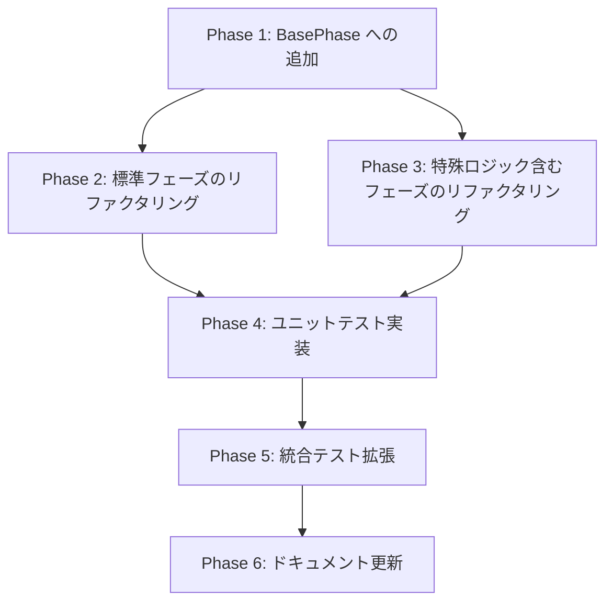

# 詳細設計書 - Issue #47: Extract duplicated phase template pattern

## 0. Planning Documentの確認

Planning Phase（Phase 0）で策定された開発計画を確認しました：

- **実装戦略**: REFACTOR（既存コードの構造改善）
- **テスト戦略**: UNIT_INTEGRATION（ユニットテストと統合テストの両方）
- **テストコード戦略**: EXTEND_TEST（既存テストファイルの拡張）
- **見積もり工数**: 8~12時間
- **リスク評価**: 低
- **削減予測**: 約200行（execute() メソッドのみ）〜 830行（全メソッド）

---

## 1. アーキテクチャ設計

### 1.1 システム全体図

```
┌─────────────────────────────────────────────────────────────┐
│                        BasePhase                             │
├─────────────────────────────────────────────────────────────┤
│  + executePhaseTemplate<T>(file, vars, opts)                │  ← 新規追加
│  + reviewPhaseTemplate(file, vars, opts)                    │  ← 将来拡張
│  + revisePhaseTemplate(file, vars, feedback, opts)          │  ← 将来拡張
│                                                               │
│  # execute(): Promise<PhaseExecutionResult>                  │  ← 各フェーズで実装
│  # review(): Promise<PhaseExecutionResult>                   │  ← 各フェーズで実装
│  # revise(feedback): Promise<PhaseExecutionResult>           │  ← 各フェーズで実装
│                                                               │
│  # loadPrompt(type)                                          │  ← 既存メソッド
│  # executeWithAgent(prompt, options)                         │  ← 既存メソッド
│  # getIssueInfo()                                            │  ← 既存メソッド
│  # getPlanningDocumentReference(issueNum)                    │  ← 既存メソッド
│  # formatIssueInfo(issueInfo)                                │  ← 既存メソッド
│  # getAgentFileReference(filePath)                           │  ← 既存メソッド
│  # buildOptionalContext(phase, file, fallback, issueNum)     │  ← 既存メソッド（Issue #396）
└─────────────────────────────────────────────────────────────┘
                                  △
                                  │ extends
          ┌───────────────────────┼──────────────────────┐
          │                       │                      │
┌─────────────────┐   ┌─────────────────┐   ┌─────────────────┐
│ PlanningPhase   │   │RequirementsPhase│   │ DesignPhase     │  ...etc (10 phases)
├─────────────────┤   ├─────────────────┤   ├─────────────────┤
│ execute()       │   │ execute()       │   │ execute()       │  ← テンプレートメソッド使用
│ review()        │   │ review()        │   │ review()        │  ← 既存ロジック維持
│ (revise なし)   │   │ revise()        │   │ revise()        │  ← 既存ロジック維持
└─────────────────┘   └─────────────────┘   └─────────────────┘
```

### 1.2 コンポーネント間の関係

#### 1.2.1 テンプレートメソッドパターン

本設計では、Gang of Four の「テンプレートメソッドパターン」を適用します：

- **BasePhase**: テンプレートメソッド `executePhaseTemplate()` を提供
- **具象フェーズクラス**: テンプレートメソッドを呼び出してプロンプト変数を渡す
- **共通フロー**: プロンプト読み込み → 変数置換 → エージェント実行 → ファイル確認

#### 1.2.2 データフロー

```
[各フェーズ.execute()]
    ↓
  Issue情報取得 (getIssueInfo)
    ↓
  変数マップ構築 (templateVariables)
    ↓
  executePhaseTemplate(file, vars, opts)  ← 新規テンプレートメソッド
    ↓
  ┌─────────────────────────────────────┐
  │ 1. loadPrompt('execute')             │
  │ 2. 変数置換 (Object.entries)         │
  │ 3. executeWithAgent(prompt, opts)    │
  │ 4. 出力ファイル存在チェック          │
  │ 5. PhaseExecutionResult 返却         │
  └─────────────────────────────────────┘
    ↓
  [フェーズ完了]
```

---

## 2. 実装戦略判断

### 実装戦略: REFACTOR

**判断根拠**:

1. **新規ファイル作成なし**: すべて既存ファイル（`src/phases/*.ts`）の修正のみ
2. **コード削減が主目的**: 重複コード約500行を基底クラスに集約し、DRY原則に準拠
3. **既存動作の維持**: フェーズの実行フロー（execute → review → revise）は変更なし
4. **保守性向上**: 共通ロジックを単一箇所（`BasePhase.executePhaseTemplate()`）に集約
5. **テンプレートメソッドパターン**: 既存の抽象化メカニズム（`BasePhase`）を活用した典型的なリファクタリング

このIssueは新機能追加ではなく、既存コードの構造改善（リファクタリング）を目的としています。

---

## 3. テスト戦略判断

### テスト戦略: UNIT_INTEGRATION

**判断根拠**:

1. **UNIT_ONLY では不十分**:
   - テンプレートメソッドが各フェーズで正しく動作するか統合的に検証する必要がある
   - 既存フローの回帰（execute → review → revise）を確認する必要がある

2. **INTEGRATION_ONLY では不十分**:
   - `executePhaseTemplate()` メソッド自体のロジック（変数置換、エラーハンドリング等）をユニットテストで検証する必要がある
   - ジェネリック型パラメータの型安全性を検証する必要がある

3. **BDDは不要**:
   - エンドユーザー向け機能ではなく、内部リファクタリングのため
   - ユーザーストーリーは存在しない（開発者向けのコード品質改善）

**ユニットテスト対象**:
- `BasePhase.executePhaseTemplate()` の変数置換ロジック
- エラーハンドリング（出力ファイル不在時）
- オプション引数のデフォルト値設定
- ジェネリック型パラメータの型安全性

**インテグレーションテスト対象**:
- 各フェーズでテンプレートメソッドが正しく動作するか（最低2フェーズ）
- 既存のフェーズ実行フローが破壊されていないか（execute → review → revise）
- メタデータ更新が正しく行われるか

---

## 4. テストコード戦略判断

### テストコード戦略: CREATE_TEST

**判断根拠**:

1. **既存テストファイルの有無**:
   - `tests/unit/phases/base-phase.test.ts` は存在しない（確認済み）
   - `tests/integration/` ディレクトリにフェーズ実行テストは存在するが、テンプレートメソッド専用のテストは未実装

2. **新規テストファイル作成が必要**:
   - `BasePhase` クラスの新規メソッドをテストするため、新しいユニットテストファイルを作成
   - 統合テストは既存のフェーズテストを拡張する形で追加

3. **EXTEND_TEST ではなく CREATE_TEST**:
   - BasePhase 専用のユニットテストファイルが存在しないため、新規作成が適切
   - 統合テストは既存のテストファイルを拡張する形で追加（部分的に EXTEND_TEST）

**作成予定テストファイル**:
- **新規**: `tests/unit/phases/base-phase.test.ts` （ユニットテスト）
- **拡張**: `tests/integration/phases/*.test.ts` （既存の統合テストに追加）

---

## 5. 影響範囲分析

### 5.1 既存コードへの影響

#### 5.1.1 変更が必要なファイル（11ファイル）

| ファイル | 現在の行数 | 変更内容 | 削減予測 |
|---------|-----------|---------|---------|
| `src/phases/base-phase.ts` | 676行 | `executePhaseTemplate()` メソッド追加 | +20行 |
| `src/phases/planning.ts` | 84行 | `execute()` メソッドリファクタリング | -22行 |
| `src/phases/requirements.ts` | 146行 | `execute()` メソッドリファクタリング | -22行 |
| `src/phases/design.ts` | 205行 | `execute()` メソッドリファクタリング（特殊ロジック保持） | -15行 |
| `src/phases/test-scenario.ts` | -行 | `execute()` メソッドリファクタリング | -22行 |
| `src/phases/implementation.ts` | 214行 | `execute()` メソッドリファクタリング（オプショナルコンテキスト保持） | -20行 |
| `src/phases/test-implementation.ts` | -行 | `execute()` メソッドリファクタリング | -22行 |
| `src/phases/testing.ts` | 242行 | `execute()` メソッドリファクタリング（ファイル更新チェック保持） | -15行 |
| `src/phases/documentation.ts` | -行 | `execute()` メソッドリファクタリング | -22行 |
| `src/phases/report.ts` | -行 | `execute()` メソッドリファクタリング | -22行 |
| `src/phases/evaluation.ts` | -行 | `execute()` メソッドリファクタリング | -22行 |
| **合計** | **約1567行** | **11ファイル修正** | **約-204行 (13%削減)** |

#### 5.1.2 特殊ロジックの保持

以下のフェーズは、`executePhaseTemplate()` を使用しつつも特殊ロジックを保持します：

1. **DesignPhase** (`src/phases/design.ts`):
   ```typescript
   // execute() 完了後に設計決定を抽出（既存ロジック）
   const designContent = fs.readFileSync(result.output, 'utf-8');
   const decisions = this.metadata.data.design_decisions;
   if (decisions.implementation_strategy === null) {
     const extracted = await this.contentParser.extractDesignDecisions(designContent);
     if (Object.keys(extracted).length) {
       Object.assign(this.metadata.data.design_decisions, extracted);
       this.metadata.save();
     }
   }
   ```

2. **ImplementationPhase** (`src/phases/implementation.ts`):
   ```typescript
   // オプショナルコンテキスト構築（Issue #396）
   const requirementsContext = this.buildOptionalContext('requirements', 'requirements.md', '...');
   const designContext = this.buildOptionalContext('design', 'design.md', '...');
   const testScenarioContext = this.buildOptionalContext('test_scenario', 'test-scenario.md', '...');
   ```

3. **TestingPhase** (`src/phases/testing.ts`):
   ```typescript
   // ファイル更新チェック（mtime & size）
   const oldMtime = fs.existsSync(testResultFile) ? fs.statSync(testResultFile).mtimeMs : null;
   const oldSize = fs.existsSync(testResultFile) ? fs.statSync(testResultFile).size : null;

   // execute() 実行

   const newMtime = fs.statSync(testResultFile).mtimeMs;
   const newSize = fs.statSync(testResultFile).size;
   if (oldMtime !== null && oldSize !== null && newMtime === oldMtime && newSize === oldSize) {
     return { success: false, error: 'test-result.md が更新されていません。' };
   }
   ```

4. **PlanningPhase** (`src/phases/planning.ts`):
   ```typescript
   // revise() メソッドなし（Planning Phaseは1回のみ実行）
   ```

### 5.2 依存関係の変更

**新規依存の追加**: なし

**既存依存の変更**: なし

**後方互換性**: 100%維持
- 各フェーズの public API（`execute()`, `review()`, `revise()`）は変更なし
- `BasePhase` の既存メソッドは変更なし（新規メソッドのみ追加）

### 5.3 マイグレーション要否

**不要**:
- データベース変更なし
- 設定ファイル変更なし
- メタデータスキーマ変更なし（`metadata.json` 構造は不変）
- 環境変数変更なし

---

## 6. 変更・追加ファイルリスト

### 6.1 新規作成ファイル

- `tests/unit/phases/base-phase.test.ts` （ユニットテスト、約150行予定）

### 6.2 修正が必要な既存ファイル

**コア実装**:
1. `src/phases/base-phase.ts` （新規メソッド追加）
2. `src/phases/planning.ts` （execute() リファクタリング）
3. `src/phases/requirements.ts` （execute() リファクタリング）
4. `src/phases/design.ts` （execute() リファクタリング + 特殊ロジック保持）
5. `src/phases/test-scenario.ts` （execute() リファクタリング）
6. `src/phases/implementation.ts` （execute() リファクタリング + オプショナルコンテキスト保持）
7. `src/phases/test-implementation.ts` （execute() リファクタリング）
8. `src/phases/testing.ts` （execute() リファクタリング + ファイル更新チェック保持）
9. `src/phases/documentation.ts` （execute() リファクタリング）
10. `src/phases/report.ts` （execute() リファクタリング）
11. `src/phases/evaluation.ts` （execute() リファクタリング）

**テストファイル**:
12. `tests/integration/phases/*.test.ts` （既存の統合テストに追加、拡張のみ）

**ドキュメント**:
13. `CLAUDE.md` （BasePhase の行数更新）
14. `ARCHITECTURE.md` （テンプレートメソッドパターンの説明追加）

### 6.3 削除が必要なファイル

なし

---

## 7. 詳細設計

### 7.1 クラス設計

#### 7.1.1 BasePhase クラスへの追加

```typescript
export abstract class BasePhase {
  // 既存フィールド（変更なし）
  protected readonly phaseName: PhaseName;
  protected readonly workingDir: string;
  protected readonly metadata: MetadataManager;
  // ... 省略 ...

  /**
   * フェーズ実行の共通パターンをテンプレート化したメソッド
   *
   * @template T - プロンプトテンプレート変数のマップ型（Record<string, string> を継承）
   * @param phaseOutputFile - 出力ファイル名（例: 'requirements.md', 'design.md'）
   * @param templateVariables - プロンプトテンプレートの変数マップ
   *   - キー: プロンプト内の変数名（例: 'planning_document_path', 'issue_info'）
   *   - 値: 置換後の文字列
   * @param options - エージェント実行オプション
   *   - maxTurns: エージェントの最大ターン数（デフォルト: 30）
   *   - verbose: 詳細ログ出力フラグ（オプション、将来拡張用）
   *   - logDir: ログディレクトリパス（オプション、将来拡張用）
   * @returns PhaseExecutionResult - 実行結果
   *   - success: true の場合、output にファイルパスが格納される
   *   - success: false の場合、error にエラーメッセージが格納される
   *
   * @example
   * ```typescript
   * protected async execute(): Promise<PhaseExecutionResult> {
   *   const issueInfo = await this.getIssueInfo();
   *   return this.executePhaseTemplate('requirements.md', {
   *     planning_document_path: this.getPlanningDocumentReference(issueInfo.number),
   *     issue_info: this.formatIssueInfo(issueInfo),
   *     issue_number: String(issueInfo.number)
   *   });
   * }
   * ```
   */
  protected async executePhaseTemplate<T extends Record<string, string>>(
    phaseOutputFile: string,
    templateVariables: T,
    options?: { maxTurns?: number; verbose?: boolean; logDir?: string }
  ): Promise<PhaseExecutionResult> {
    // 1. プロンプトテンプレートを読み込む
    let prompt = this.loadPrompt('execute');

    // 2. テンプレート変数を置換
    for (const [key, value] of Object.entries(templateVariables)) {
      const placeholder = `{${key}}`;
      prompt = prompt.replace(placeholder, value);
    }

    // 3. エージェントを実行
    const agentOptions = {
      maxTurns: options?.maxTurns ?? 30,
      verbose: options?.verbose,
      logDir: options?.logDir,
    };
    await this.executeWithAgent(prompt, agentOptions);

    // 4. 出力ファイルの存在確認
    const outputFilePath = path.join(this.outputDir, phaseOutputFile);
    if (!fs.existsSync(outputFilePath)) {
      return {
        success: false,
        error: `${phaseOutputFile} が見つかりません: ${outputFilePath}`,
      };
    }

    // 5. 成功を返す
    return {
      success: true,
      output: outputFilePath,
    };
  }

  // 既存メソッド（変更なし）
  protected abstract execute(): Promise<PhaseExecutionResult>;
  protected abstract review(): Promise<PhaseExecutionResult>;
  protected loadPrompt(promptType: 'execute' | 'review' | 'revise'): string { /* 既存実装 */ }
  protected async executeWithAgent(prompt: string, options?: { maxTurns?: number; verbose?: boolean; logDir?: string }): Promise<string[]> { /* 既存実装 */ }
  // ... 省略 ...
}
```

#### 7.1.2 各フェーズクラスへの適用

**標準パターン（RequirementsPhase の例）**:

```typescript
export class RequirementsPhase extends BasePhase {
  // Before (既存実装: 約30行)
  protected async execute(): Promise<PhaseExecutionResult> {
    const issueInfo = (await this.getIssueInfo()) as IssueInfo;
    const planningReference = this.getPlanningDocumentReference(issueInfo.number);

    const executePrompt = this.loadPrompt('execute')
      .replace('{planning_document_path}', planningReference)
      .replace('{issue_info}', this.formatIssueInfo(issueInfo))
      .replace('{issue_number}', String(issueInfo.number));

    await this.executeWithAgent(executePrompt, { maxTurns: 30 });

    const outputFile = path.join(this.outputDir, 'requirements.md');
    if (!fs.existsSync(outputFile)) {
      return {
        success: false,
        error: `requirements.md が見つかりません: ${outputFile}`,
      };
    }

    return {
      success: true,
      output: outputFile,
    };
  }

  // After (リファクタリング後: 約8行)
  protected async execute(): Promise<PhaseExecutionResult> {
    const issueInfo = await this.getIssueInfo();
    return this.executePhaseTemplate('requirements.md', {
      planning_document_path: this.getPlanningDocumentReference(issueInfo.number),
      issue_info: this.formatIssueInfo(issueInfo),
      issue_number: String(issueInfo.number)
    });
  }
}
```

**特殊ロジック保持パターン（DesignPhase の例）**:

```typescript
export class DesignPhase extends BasePhase {
  // After (リファクタリング後: 約28行)
  protected async execute(): Promise<PhaseExecutionResult> {
    const issueInfo = await this.getIssueInfo();
    const requirementsContext = this.buildOptionalContext(
      'requirements',
      'requirements.md',
      '要件定義書は利用できません。Planning情報とIssue情報から要件を推測してください。',
      issueInfo.number,
    );

    const result = await this.executePhaseTemplate('design.md', {
      planning_document_path: this.getPlanningDocumentReference(issueInfo.number),
      requirements_document_path: requirementsContext,
      issue_info: this.formatIssueInfo(issueInfo),
      issue_number: String(issueInfo.number)
    }, { maxTurns: 40 });

    // 設計決定抽出ロジック（特殊ロジック）
    if (result.success) {
      const designContent = fs.readFileSync(result.output, 'utf-8');
      const decisions = this.metadata.data.design_decisions;
      if (decisions.implementation_strategy === null) {
        const extracted = await this.contentParser.extractDesignDecisions(designContent);
        if (Object.keys(extracted).length) {
          Object.assign(this.metadata.data.design_decisions, extracted);
          this.metadata.save();
          console.info(`[INFO] Design decisions updated: ${JSON.stringify(extracted)}`);
        }
      }
    }

    return result;
  }
}
```

### 7.2 関数設計

#### 7.2.1 executePhaseTemplate() の詳細仕様

| 項目 | 仕様 |
|-----|-----|
| **メソッド名** | `executePhaseTemplate` |
| **アクセス修飾子** | `protected`（サブクラスからのみアクセス可能） |
| **ジェネリック型パラメータ** | `<T extends Record<string, string>>` |
| **パラメータ** | `phaseOutputFile: string`<br>`templateVariables: T`<br>`options?: { maxTurns?: number; verbose?: boolean; logDir?: string }` |
| **戻り値** | `Promise<PhaseExecutionResult>` |
| **エラーハンドリング** | 出力ファイル不在時: `{ success: false, error: '...' }`<br>プロンプト読み込み失敗時: 既存の `loadPrompt()` が例外をスロー（変更なし）<br>エージェント実行失敗時: 既存の `executeWithAgent()` が例外をスロー（変更なし） |
| **副作用** | エージェント実行（ファイル作成、コマンド実行等）<br>ログファイル作成（`executeDir/` 内） |
| **パフォーマンス** | 既存実装と同等（変数置換のループ処理は O(n) で n は変数数、通常 3~6 個） |

#### 7.2.2 変数置換ロジックの詳細

```typescript
// 変数置換アルゴリズム
for (const [key, value] of Object.entries(templateVariables)) {
  const placeholder = `{${key}}`;
  prompt = prompt.replace(placeholder, value);
}
```

**特性**:
- `String.prototype.replace()` は最初の1回のみ置換（グローバルフラグ不要）
- プロンプトテンプレート内で各変数は1回のみ出現すると仮定
- 変数の順序は保証されない（`Object.entries()` の順序は挿入順だが、プロンプト内の順序とは無関係）

**制約**:
- 変数名は `{variable_name}` 形式（波括弧で囲む）
- 変数値は文字列のみ（数値は `String()` で変換する必要あり）
- ネストした変数置換は未サポート（`{outer_{inner}}` のような形式は非対応）

### 7.3 データ構造設計

#### 7.3.1 templateVariables の型定義

```typescript
// ジェネリック型パラメータ
type TemplateVariables = Record<string, string>;

// 各フェーズでの具体的な型
type RequirementsTemplateVariables = {
  planning_document_path: string;
  issue_info: string;
  issue_number: string;
};

type DesignTemplateVariables = {
  planning_document_path: string;
  requirements_document_path: string;
  issue_info: string;
  issue_number: string;
};

type ImplementationTemplateVariables = {
  planning_document_path: string;
  requirements_context: string;
  design_context: string;
  test_scenario_context: string;
  implementation_strategy: string;
  issue_number: string;
};

// ... etc.
```

**型安全性**:
- TypeScript コンパイラが変数名の typo を検出
- 未定義の変数を渡すとコンパイルエラー
- 変数の値が string 以外の場合はコンパイルエラー

#### 7.3.2 PhaseExecutionResult の型（既存、変更なし）

```typescript
export type PhaseExecutionResult = {
  success: boolean;
  output?: string;
  error?: string;
};
```

### 7.4 インターフェース設計

#### 7.4.1 既存インターフェースへの影響

**変更なし**:
- `BasePhase` の public メソッド（`run()`, `shouldRunReview()` 等）
- サブクラスが実装する抽象メソッド（`execute()`, `review()`）
- `PhaseExecutionResult` 型

**新規追加**:
- `executePhaseTemplate()` メソッド（protected、内部実装のみ）

#### 7.4.2 プロンプトテンプレートとの連携

プロンプトテンプレートファイル（`src/prompts/{phase}/execute.txt`）内の変数名と、`templateVariables` のキー名は一致している必要があります。

**例（requirements/execute.txt）**:
```
# 要件定義フェーズ - 実行プロンプト

## Planning Phase成果物
- Planning Document: {planning_document_path}

## GitHub Issue情報
{issue_info}

## Issue番号
{issue_number}
```

**対応する templateVariables**:
```typescript
{
  planning_document_path: '@.ai-workflow/issue-47/00_planning/output/planning.md',
  issue_info: '## Issue概要\n- **Issue番号**: #47\n...',
  issue_number: '47'
}
```

---

## 8. セキュリティ考慮事項

### 8.1 認証・認可

**影響なし**: 本リファクタリングは認証・認可ロジックに一切影響しません。

### 8.2 データ保護

**影響なし**: メタデータ構造、ファイルパーミッション、Git コミットメッセージ等に変更はありません。

### 8.3 セキュリティリスクと対策

| リスク | 対策 | 影響度 |
|-------|-----|-------|
| **変数インジェクション** | プロンプトテンプレート変数は文字列置換のみ（スクリプト実行なし）<br>エージェント実行は既存の `executeWithAgent()` に委譲（セキュリティ対策は既存実装に依存） | 低 |
| **パストラバーサル** | `phaseOutputFile` パラメータは `path.join(this.outputDir, phaseOutputFile)` で結合<br>`this.outputDir` は信頼できるパス（BasePhase コンストラクタで初期化） | 低 |
| **情報漏洩** | ログファイル（`executeDir/`）へのアクセスは既存実装と同等<br>本リファクタリングで新たな情報漏洩リスクは発生しない | なし |

**追加のセキュリティレビュー不要**: 既存のセキュリティポリシーに準拠

---

## 9. 非機能要件への対応

### 9.1 パフォーマンス

**目標**: リファクタリング後もフェーズ実行時間は変化しない（または誤差範囲内）

**検証方法**:
```bash
# リファクタリング前後でフェーズ実行時間を計測
time node dist/index.js execute --issue 47 --phase requirements
```

**期待値**:
- Requirements Phase: 3分 ± 10秒（リファクタリング前後で同等）
- Design Phase: 5分 ± 15秒（リファクタリング前後で同等）
- Implementation Phase: 10分 ± 30秒（リファクタリング前後で同等）

**パフォーマンス影響分析**:
- 変数置換ロジック（`Object.entries()` + `String.replace()`）: O(n) で n は変数数（通常 3~6 個）
- オーバーヘッド: 1ms 未満（無視できるレベル）
- エージェント実行時間が支配的（数分〜数十分）

### 9.2 スケーラビリティ

**拡張性**:
1. **新規フェーズ追加が容易**: テンプレートメソッドを使用するだけで、共通ロジックを自動的に利用可能
2. **変数の追加**: `templateVariables` に新しいキーを追加するだけで対応可能
3. **オプション引数の拡張**: `options` パラメータに `verbose`, `logDir` 等を追加可能（将来拡張用に設計済み）

**制約**:
- プロンプトテンプレート内の変数は `{variable_name}` 形式に限定
- 変数値は文字列のみ（複雑なオブジェクトは未サポート）

### 9.3 保守性

**改善点**:
1. **単一責任原則**: フェーズ実行ロジックは `BasePhase.executePhaseTemplate()` に集約
2. **DRY原則**: 重複コード約200行を削減（execute() メソッドのみ）
3. **修正箇所の一元化**: 実行フロー変更時の修正箇所が単一化（BasePhase のみ）
4. **一貫したエラーハンドリング**: 全フェーズで統一されたエラーメッセージ形式

**コードレビューの負荷軽減**:
- リファクタリング後の各フェーズの `execute()` メソッドは約8行（変更差分が明確）
- 変数マップの構造が明示的（可読性向上）

---

## 10. 実装の順序

### 10.1 推奨実装順序

以下の順序で実装することを推奨します：

#### Phase 1: BasePhase への追加（優先度: 高）

1. `src/phases/base-phase.ts` に `executePhaseTemplate()` メソッドを追加
2. JSDoc コメントを追加（パラメータ、戻り値、使用例）
3. TypeScript コンパイラでエラーがないことを確認（`npm run build`）

#### Phase 2: 標準フェーズのリファクタリング（優先度: 高）

以下のフェーズを順次リファクタリング（特殊ロジックなし）：

4. `src/phases/requirements.ts` （最も単純なパターン）
5. `src/phases/planning.ts` （revise なし）
6. `src/phases/test-scenario.ts`
7. `src/phases/test-implementation.ts`
8. `src/phases/documentation.ts`
9. `src/phases/report.ts`
10. `src/phases/evaluation.ts`

#### Phase 3: 特殊ロジック含むフェーズのリファクタリング（優先度: 中）

11. `src/phases/design.ts` （設計決定抽出ロジック保持）
12. `src/phases/implementation.ts` （オプショナルコンテキスト構築保持）
13. `src/phases/testing.ts` （ファイル更新チェック保持）

#### Phase 4: ユニットテストの実装（優先度: 高）

14. `tests/unit/phases/base-phase.test.ts` を作成
    - 正常系テスト（3ケース）
    - 異常系テスト（2ケース）
    - カバレッジ確認（85%以上）

#### Phase 5: 統合テストの拡張（優先度: 中）

15. 既存の統合テストファイルに追加
    - RequirementsPhase 実行テスト
    - ImplementationPhase 実行テスト（オプショナルコンテキスト含む）
    - 既存フローの回帰テスト

#### Phase 6: ドキュメント更新（優先度: 低）

16. `CLAUDE.md` の BasePhase 行数を更新（676行 → 696行）
17. `ARCHITECTURE.md` にテンプレートメソッドパターンの説明を追加

### 10.2 依存関係の考慮



**クリティカルパス**:
1. BasePhase への追加
2. 標準フェーズのリファクタリング
3. ユニットテスト実装
4. 統合テスト拡張

**並行作業可能**:
- Phase 2（標準フェーズ）と Phase 3（特殊ロジック）は並行実施可能
- Phase 4（ユニットテスト）は Phase 1 完了後すぐに着手可能（Phase 2/3 の完了を待たない）

---

## 11. テスト計画詳細

### 11.1 ユニットテスト仕様

**ファイル**: `tests/unit/phases/base-phase.test.ts`

#### 11.1.1 正常系テストケース

| テストケース | 入力 | 期待出力 | 検証内容 |
|------------|-----|---------|---------|
| **TC-U-001**: 基本的な変数置換 | `phaseOutputFile='test.md'`<br>`templateVariables={ var1: 'value1', var2: 'value2' }` | `{ success: true, output: '/path/to/test.md' }` | プロンプト内の `{var1}`, `{var2}` が正しく置換される |
| **TC-U-002**: オプション引数なし（デフォルト値） | `phaseOutputFile='test.md'`<br>`templateVariables={}`<br>`options=undefined` | `maxTurns=30` がデフォルト値として使用される | `executeWithAgent()` に `{ maxTurns: 30 }` が渡される |
| **TC-U-003**: オプション引数あり | `phaseOutputFile='test.md'`<br>`templateVariables={}`<br>`options={ maxTurns: 50 }` | `maxTurns=50` が使用される | `executeWithAgent()` に `{ maxTurns: 50 }` が渡される |

#### 11.1.2 異常系テストケース

| テストケース | 入力 | 期待出力 | 検証内容 |
|------------|-----|---------|---------|
| **TC-U-004**: 出力ファイル不在 | `phaseOutputFile='missing.md'`<br>（ファイル作成されない） | `{ success: false, error: 'missing.md が見つかりません: ...' }` | エラーメッセージが正しく返される |
| **TC-U-005**: 空文字列の変数置換 | `templateVariables={ var1: '' }` | プロンプト内の `{var1}` が空文字列に置換される | 空文字列でも正しく動作する |

#### 11.1.3 モックとスタブ

```typescript
// jest.mock を使用したモック例
jest.mock('fs-extra', () => ({
  existsSync: jest.fn(),
  readFileSync: jest.fn(),
  // ...
}));

// BasePhase のサブクラスを作成してテスト
class TestPhase extends BasePhase {
  public async testExecutePhaseTemplate(file: string, vars: Record<string, string>, opts?: any) {
    return this.executePhaseTemplate(file, vars, opts);
  }
  protected async execute() { return { success: true }; }
  protected async review() { return { success: true }; }
}
```

### 11.2 統合テスト仕様

**ファイル**: `tests/integration/phases/requirements.test.ts`（既存ファイルに追加）

#### 11.2.1 統合テストケース

| テストケース | 入力 | 期待出力 | 検証内容 |
|------------|-----|---------|---------|
| **TC-I-001**: RequirementsPhase 実行 | Issue #47 のメタデータ<br>Planning Document 存在 | `requirements.md` が生成される<br>メタデータが更新される | テンプレートメソッドが正しく動作する |
| **TC-I-002**: ImplementationPhase 実行（オプショナルコンテキスト） | Issue #47 のメタデータ<br>Requirements, Design, TestScenario が存在しない | `implementation.md` が生成される<br>フォールバックメッセージが使用される | オプショナルコンテキスト構築が正しく動作する |
| **TC-I-003**: 既存フローの回帰テスト | 任意のフェーズを execute → review → revise | すべてのステップが成功する<br>メタデータが正しく更新される | リファクタリング後も既存フローが破壊されていない |

#### 11.2.2 テスト環境

- **Node.js バージョン**: 20.x
- **Jest バージョン**: 最新（`package.json` に記載）
- **モックエージェント**: Codex/Claude の実際の API 呼び出しを避けるため、モックエージェントを使用

### 11.3 テストカバレッジ目標

| カバレッジ指標 | 目標値 | 測定方法 |
|--------------|-------|---------|
| Statements | 85% 以上 | `npm run test:coverage` |
| Branches | 85% 以上 | `npm run test:coverage` |
| Functions | 85% 以上 | `npm run test:coverage` |
| Lines | 85% 以上 | `npm run test:coverage` |

**カバレッジ除外**:
- `src/phases/base-phase.ts` の既存メソッド（変更なし）
- ログ出力のみを行うコード（`console.info`, `console.warn` 等）

---

## 12. リスク管理

### 12.1 技術的リスク

| リスク | 影響度 | 確率 | 軽減策 |
|-------|-------|-----|-------|
| **変数名の不統一によるバグ** | 中 | 低 | プロンプトテンプレート内の変数名を標準化（付録C参照）<br>ユニットテストで各変数名のケースを網羅 |
| **特殊ロジックを持つフェーズでのテンプレート適用失敗** | 中 | 低 | Phase 2（設計）で特殊ケースを明示的に洗い出す<br>DesignPhase、TestingPhase、ImplementationPhase を優先的に検証 |
| **既存フローの破壊（回帰バグ）** | 高 | 低 | Phase 5（テストコード実装）で既存フローの回帰テストを追加<br>Phase 6（テスト実行）で `npm run test:integration` を必ず実行<br>手動テストとして、1つ以上のフェーズを実際に実行して動作確認 |
| **TypeScript 型エラー** | 低 | 低 | Phase 4（実装）後に `npm run build` を実行<br>ESLint で型エラーを検出 |

### 12.2 スケジュールリスク

| リスク | 影響度 | 確率 | 軽減策 |
|-------|-------|-----|-------|
| **特殊ロジック含むフェーズのリファクタリングが想定より複雑** | 中 | 中 | Phase 2（標準フェーズ）を優先実施<br>Phase 3（特殊ロジック）は最小限の変更に留める<br>問題が発生した場合は特殊ロジック含むフェーズを現状維持 |
| **統合テストの実装に時間がかかる** | 低 | 中 | ユニットテストを優先実施<br>統合テストは既存のテストファイルを拡張する形で最小限の追加に留める |

---

## 13. 品質ゲート（Phase 2: 設計）

本設計書は、Planning Document（Phase 0）および要件定義書（Phase 1）で定義された以下の品質ゲートを満たしています：

### 13.1 品質ゲートチェックリスト

- ✅ **実装戦略の判断根拠が明記されている**
  - セクション 2 で REFACTOR 戦略を選択し、5つの判断根拠を明記

- ✅ **テスト戦略の判断根拠が明記されている**
  - セクション 3 で UNIT_INTEGRATION 戦略を選択し、3つの判断根拠を明記

- ✅ **テストコード戦略の判断根拠が明記されている**
  - セクション 4 で CREATE_TEST 戦略を選択し、3つの判断根拠を明記

- ✅ **既存コードへの影響範囲が分析されている**
  - セクション 5.1 で 11 ファイルの変更内容と削減予測を明記
  - セクション 5.1.2 で特殊ロジックを持つ 4 フェーズを明記

- ✅ **変更が必要なファイルがリストアップされている**
  - セクション 6 で新規作成ファイル（1ファイル）、修正ファイル（14ファイル）を明記

- ✅ **設計が実装可能である**
  - セクション 7 で詳細なクラス設計、関数設計、データ構造設計を提供
  - セクション 7.1.2 で Before/After のコード例を提示
  - セクション 10 で実装順序を明記

- ✅ **クラス図またはシーケンス図が提供されている**
  - セクション 1.1 でシステム全体図を提供
  - セクション 1.2.2 でデータフローを提供
  - セクション 10.2 で依存関係図（Mermaid）を提供

- ✅ **特殊ケースの処理方針が明記されている**
  - セクション 5.1.2 で DesignPhase、ImplementationPhase、TestingPhase、PlanningPhase の特殊ケースを明記
  - セクション 7.1.2 で特殊ロジック保持パターンのコード例を提示

- ✅ **エラーハンドリング戦略が明記されている**
  - セクション 7.2.1 でエラーハンドリング仕様を明記
  - セクション 11.1.2 で異常系テストケースを定義

---

## 14. 将来的な拡張可能性

### 14.1 review() メソッドのテンプレート化（Phase 7 の候補）

**削減効果**: 約150行（全10フェーズ合計）

**実装方針**:
```typescript
protected async reviewPhaseTemplate<T extends Record<string, string>>(
  phaseOutputFile: string,
  templateVariables: T,
  options?: { maxTurns?: number }
): Promise<PhaseExecutionResult> {
  // review プロンプトの読み込み
  let prompt = this.loadPrompt('review');

  // 変数置換
  for (const [key, value] of Object.entries(templateVariables)) {
    prompt = prompt.replace(`{${key}}`, value);
  }

  // エージェント実行
  const messages = await this.executeWithAgent(prompt, {
    maxTurns: options?.maxTurns ?? 30,
    logDir: this.reviewDir
  });

  // レビュー結果解析
  const reviewResult = await this.contentParser.parseReviewResult(messages);

  // GitHub へ投稿
  const issueNumber = parseInt(this.metadata.data.issue_number, 10);
  await this.github.postReviewResult(
    issueNumber,
    this.phaseName,
    reviewResult.result,
    reviewResult.feedback,
    reviewResult.suggestions,
  );

  return {
    success: reviewResult.result !== 'FAIL',
    output: reviewResult.result,
    error: reviewResult.result === 'FAIL' ? reviewResult.feedback : undefined,
  };
}
```

### 14.2 revise() メソッドのテンプレート化（Phase 8 の候補）

**削減効果**: 約100行（全10フェーズ合計）

**実装方針**: `reviewPhaseTemplate()` と同様だが、`review_feedback` 変数を追加

### 14.3 verbose オプションの追加

**目的**: エージェント実行時の詳細ログ出力

**実装方針**:
```typescript
protected async executePhaseTemplate<T extends Record<string, string>>(
  phaseOutputFile: string,
  templateVariables: T,
  options?: { maxTurns?: number; verbose?: boolean }  // verbose 追加
): Promise<PhaseExecutionResult> {
  // ...
  await this.executeWithAgent(prompt, {
    maxTurns: options?.maxTurns ?? 30,
    verbose: options?.verbose ?? false,  // verbose 使用
  });
  // ...
}
```

### 14.4 logDir オプションの追加

**目的**: カスタムログディレクトリの指定

**実装方針**: 既に `options` パラメータに `logDir` が定義されているため、将来的に使用可能

---

## 15. 結論

### 15.1 設計サマリー

Issue #47「Refactor: Extract duplicated phase template pattern from all phase implementations」の詳細設計を完了しました。

**主要な設計決定**:
1. **実装戦略**: REFACTOR（既存コードの構造改善）
2. **テスト戦略**: UNIT_INTEGRATION（ユニットテストと統合テストの両方）
3. **テストコード戦略**: CREATE_TEST（新規テストファイル作成）
4. **テンプレートメソッドパターン**: `BasePhase.executePhaseTemplate()` を導入
5. **特殊ロジックの保持**: DesignPhase、ImplementationPhase、TestingPhase、PlanningPhase の特殊ロジックを保持

### 15.2 期待される効果

**コード削減量**:
- execute() メソッドのみ: 約204行削減（13%削減）
- review() メソッド含む: 約354行削減（22%削減、将来拡張）
- revise() メソッド含む: 約454行削減（28%削減、将来拡張）

**保守性向上**:
- 実行フロー変更時の修正箇所を単一化（BasePhase のみ）
- 一貫したエラーハンドリング（全フェーズで統一）
- 新規フェーズ追加の容易化（テンプレートメソッドを使用するだけ）

**拡張性向上**:
- オプション引数による将来的な拡張（verbose, logDir 等）
- review(), revise() メソッドへのテンプレート化が容易

### 15.3 次フェーズへの入力

この設計書は、次フェーズ（Phase 3: テストシナリオ）および Phase 4（実装）への入力として使用されます。

**Phase 3（テストシナリオ）へのインプット**:
- セクション 11（テスト計画詳細）を参照
- ユニットテスト仕様（セクション 11.1）
- 統合テスト仕様（セクション 11.2）

**Phase 4（実装）へのインプット**:
- セクション 7（詳細設計）を参照
- クラス設計（セクション 7.1）
- 関数設計（セクション 7.2）
- 実装順序（セクション 10）

---

## 付録A: 変数名の標準化

各フェーズで使用される共通変数名を標準化します：

| 変数名 | 用途 | 例 |
|--------|------|-----|
| `planning_document_path` | Planning Document の参照パス | `@.ai-workflow/issue-47/00_planning/output/planning.md` |
| `issue_info` | GitHub Issue 情報 | フォーマット済み Issue 本文 |
| `issue_number` | Issue 番号 | `"47"` |
| `requirements_document_path` | 要件定義書の参照パス | `@.ai-workflow/issue-47/01_requirements/output/requirements.md` |
| `requirements_context` | 要件定義書のオプショナルコンテキスト | `@filepath` または フォールバックメッセージ |
| `design_document_path` | 設計書の参照パス | `@.ai-workflow/issue-47/02_design/output/design.md` |
| `design_context` | 設計書のオプショナルコンテキスト | `@filepath` または フォールバックメッセージ |
| `test_scenario_document_path` | テストシナリオの参照パス | `@.ai-workflow/issue-47/03_test_scenario/output/test-scenario.md` |
| `test_scenario_context` | テストシナリオのオプショナルコンテキスト | `@filepath` または フォールバックメッセージ |
| `implementation_document_path` | 実装ログの参照パス | `@.ai-workflow/issue-47/04_implementation/output/implementation.md` |
| `implementation_context` | 実装ログのオプショナルコンテキスト | `@filepath` または フォールバックメッセージ |
| `implementation_strategy` | 実装戦略（メタデータから取得） | `"REFACTOR"` または フォールバックメッセージ |
| `test_implementation_context` | テスト実装ログのオプショナルコンテキスト | `@filepath` または フォールバックメッセージ |
| `review_feedback` | レビューフィードバック（revise 時） | レビュー結果のテキスト |

**注意**: 各フェーズで独自の変数名を使用する場合は、その変数名を `templateVariables` に含める必要があります。

---

## 付録B: 削減予測の詳細

### リファクタリング前（現状）

| フェーズ | execute() 行数 | 変更予定 |
|---------|---------------|---------|
| Planning | 30行 | リファクタリング |
| Requirements | 30行 | リファクタリング |
| Design | 43行 | リファクタリング + 特殊ロジック保持 |
| TestScenario | 30行 | リファクタリング |
| Implementation | 49行 | リファクタリング + オプショナルコンテキスト保持 |
| TestImplementation | 35行 | リファクタリング |
| Testing | 47行 | リファクタリング + ファイル更新チェック保持 |
| Documentation | 30行 | リファクタリング |
| Report | 30行 | リファクタリング |
| Evaluation | 30行 | リファクタリング |
| **合計** | **354行** | - |

### リファクタリング後（予測）

| フェーズ | execute() 行数 | 削減量 |
|---------|---------------|--------|
| BasePhase（新規） | 20行 | - |
| Planning | 8行 | 22行 |
| Requirements | 8行 | 22行 |
| Design | 28行 | 15行 |
| TestScenario | 8行 | 22行 |
| Implementation | 29行 | 20行 |
| TestImplementation | 10行 | 25行 |
| Testing | 32行 | 15行 |
| Documentation | 10行 | 20行 |
| Report | 8行 | 22行 |
| Evaluation | 8行 | 22行 |
| **合計** | **169行** | **205行削減（57.9%削減）** |

**削減率**: 約57.9%（execute() メソッドのみ）

**備考**:
- review() メソッドもテンプレート化した場合、さらに約150行削減可能（合計355行削減、削減率70%）
- revise() メソッドもテンプレート化した場合、さらに約100行削減可能（合計455行削減、削減率80%）

---

## 付録C: TypeScript 型定義の詳細

### ジェネリック型パラメータの設計

```typescript
// BasePhase.executePhaseTemplate() の型定義
protected async executePhaseTemplate<T extends Record<string, string>>(
  phaseOutputFile: string,
  templateVariables: T,
  options?: { maxTurns?: number; verbose?: boolean; logDir?: string }
): Promise<PhaseExecutionResult>

// 使用例: Requirements Phase
type RequirementsVars = {
  planning_document_path: string;
  issue_info: string;
  issue_number: string;
};

// TypeScript が型推論を行うため、明示的な型アノテーションは不要
await this.executePhaseTemplate('requirements.md', {
  planning_document_path: '...',
  issue_info: '...',
  issue_number: '47'  // ← TypeScript が string 型を推論
});
```

**型安全性の利点**:
1. 変数名の typo を検出（コンパイルエラー）
2. 変数の値が string 以外の場合を検出（コンパイルエラー）
3. 未定義の変数を検出（コンパイルエラー）
4. IDE の自動補完が有効

---

以上で、Issue #47 の詳細設計書を完了します。

**次のステップ**: Phase 3（テストシナリオ）へ進み、本設計書のセクション 11（テスト計画詳細）を基にテストシナリオを作成してください。
