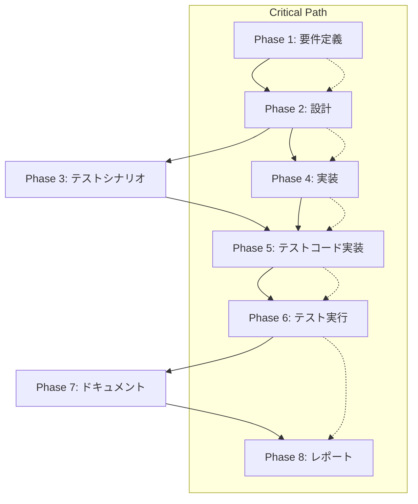

# プロジェクト計画書: エラーハンドリングユーティリティへのリファクタリング

**Issue**: #48
**タイトル**: リファクタリング: 過剰な 'as Error' キャストを適切なエラーハンドリングユーティリティに置き換え
**作成日**: 2025-01-21

---

## 1. Issue分析

### 複雑度: **中程度**

**判定理由**:
- 22ファイル、67箇所のコード修正が必要（広範囲だが単純なパターンの繰り返し）
- 新規ユーティリティモジュールの作成（1ファイル、約60行）
- 既存コードの構造は変更せず、エラーハンドリングパターンのみを置き換え
- ユニットテストおよび統合テストの追加が必要
- 既存の全テストが引き続き成功する必要がある

### 見積もり工数: **12~16時間**

**内訳**:
- Phase 1 (要件定義): 1~2時間
- Phase 2 (設計): 2~3時間
- Phase 3 (テストシナリオ): 1~2時間
- Phase 4 (実装): 3~4時間
- Phase 5 (テストコード実装): 2~3時間
- Phase 6 (テスト実行): 1~2時間
- Phase 7 (ドキュメント): 1~2時間
- Phase 8 (レポート): 1時間

**根拠**:
- 67箇所の置き換えは機械的だが、各ファイルのコンテキストに応じた適切な置き換えが必要（3~4時間）
- 新規ユーティリティは小規模だが、型安全性の検証とエッジケースのテストが重要（2~3時間）
- 既存テスト（52ファイル）の動作確認とエラーハンドリングのユニットテスト追加（3~5時間）

### リスク評価: **低~中**

**低リスク要因**:
- 既存の動作を変更しない（型キャストをユーティリティ関数に置き換えるのみ）
- 影響範囲が明確（catchブロック内のエラーハンドリング）
- ユニットテストで安全性を検証可能

**中リスク要因**:
- 広範囲の変更（67箇所）によるヒューマンエラーの可能性
- エラーハンドリングのエッジケース（非Errorオブジェクトのthrow）の見落とし
- 既存テストでカバーされていないエラーパスの存在可能性

---

## 2. 実装戦略判断

### 実装戦略: **CREATE + EXTEND**

**判断根拠**:
- **CREATE**: 新規ユーティリティモジュール `src/utils/error-utils.ts` を作成
  - `getErrorMessage()`: unknown型から安全にメッセージを抽出
  - `getErrorStack()`: unknown型から安全にスタックトレースを抽出
  - `isError()`: Error型ガード関数
- **EXTEND**: 既存22ファイルのcatchブロックでユーティリティを使用
  - `(error as Error).message` → `getErrorMessage(error)` に置き換え
  - `(error as Error).stack` → `getErrorStack(error)` に置き換え（必要に応じて）

**CREATEとEXTENDの比率**: 20% CREATE / 80% EXTEND

### テスト戦略: **UNIT_INTEGRATION**

**判断根拠**:
- **UNIT_ONLY**: エラーユーティリティ関数の動作を検証
  - Error、string、number、null、undefined、カスタムオブジェクト等の入力パターン
  - スタックトレースの存在/不在のケース
  - 型ガードの動作確認
- **INTEGRATION_ONLY**: 既存の統合テスト（52ファイル）が引き続き成功することを検証
  - エラーハンドリングパスが正しく動作するか
  - 実際のエージェント実行、Git操作、GitHub API呼び出しでのエラー処理

**選択理由**:
- ユーティリティ関数自体はユニットテストで完全に検証可能
- 既存コードへの統合は既存の統合テストで安全性を確認
- BDDは不要（エンドユーザー向けの振る舞い変更ではない）

### テストコード戦略: **CREATE_TEST + EXTEND_TEST**

**判断根拠**:
- **CREATE_TEST**: `tests/unit/utils/error-utils.test.ts` を新規作成
  - ユーティリティ関数の全入力パターンをカバー
  - エッジケースの検証（null、undefined、循環参照オブジェクト等）
- **EXTEND_TEST**: 既存テストファイルの一部を更新（必要に応じて）
  - エラーハンドリングのモックで非Error型を投げるケースを追加
  - 例: `tests/unit/commands/init.test.ts` で文字列エラーのケースを追加

**比率**: 70% CREATE_TEST / 30% EXTEND_TEST

---

## 3. 影響範囲分析

### 既存コードへの影響

**直接的な変更が必要なファイル（22ファイル）**:
1. `src/commands/execute.ts` - 3箇所
2. `src/commands/init.ts` - 4箇所
3. `src/core/content-parser.ts` - 4箇所
4. `src/core/git/branch-manager.ts` - 3箇所
5. `src/core/git/commit-manager.ts` - 10箇所
6. `src/core/git/remote-manager.ts` - 8箇所
7. `src/core/github-client.ts` - 1箇所
8. `src/core/github/comment-client.ts` - 2箇所
9. `src/core/github/issue-client.ts` - 2箇所
10. `src/core/github/pull-request-client.ts` - 推定2箇所
11. `src/core/phase-dependencies.ts` - 推定1箇所
12. `src/core/secret-masker.ts` - 推定1箇所
13. `src/phases/base-phase.ts` - 4箇所
14. `src/phases/core/agent-executor.ts` - 1箇所
15. `src/phases/evaluation.ts` - 6箇所
16. `src/phases/report.ts` - 推定2箇所
17. その他6ファイル - 推定13箇所

**変更パターン**:
```typescript
// Before
try {
  // some operation
} catch (error) {
  logger.error(`Failed: ${(error as Error).message}`);
}

// After
import { getErrorMessage } from '@/utils/error-utils.js';

try {
  // some operation
} catch (error) {
  logger.error(`Failed: ${getErrorMessage(error)}`);
}
```

**間接的な影響**:
- **logger.ts**: 変更不要（エラーメッセージを文字列として受け取る設計のため）
- **テストファイル**: 既存52ファイルのテストが引き続き成功する必要がある
- **型定義**: 新規型 `ErrorLike` の導入（オプション）

### 依存関係の変更

**新規依存**: なし（標準ライブラリのみ使用）

**既存依存の変更**: なし

**インポートの追加**:
- 22ファイルで `import { getErrorMessage, getErrorStack, isError } from '@/utils/error-utils.js';` を追加

### マイグレーション要否

**不要**

理由:
- データベーススキーマ変更なし
- 設定ファイル変更なし
- 環境変数の追加なし
- APIの破壊的変更なし

---

## 4. タスク分割

### Phase 1: 要件定義 (見積もり: 1~2h)

- [x] Task 1-1: エラーハンドリングパターンの現状分析 (0.5~1h)
  - 67箇所の `as Error` キャスト使用箇所をリストアップ
  - エラーハンドリングパターンのバリエーションを分類（message only、message + stack、型ガード等）
  - エッジケースの洗い出し（非Errorオブジェクトがthrowされるケース）

- [x] Task 1-2: ユーティリティ関数の要件定義 (0.5~1h)
  - `getErrorMessage()` の仕様策定（Error、string、number、object、null、undefined）
  - `getErrorStack()` の仕様策定（Errorのみスタックトレースを返す、それ以外はundefined）
  - `isError()` 型ガードの仕様策定（instanceof Error）
  - 受け入れ基準の明確化

### Phase 2: 設計 (見積もり: 2~3h)

- [x] Task 2-1: エラーユーティリティモジュールの詳細設計 (1~1.5h)
  - 関数シグネチャの設計（型定義）
  - エラーメッセージ抽出ロジックのフローチャート
  - エッジケースの処理方針（null、undefined、循環参照オブジェクト等）
  - TSDocコメントの設計

- [x] Task 2-2: リファクタリング方針の策定 (0.5~1h)
  - ファイル優先順位の決定（影響範囲の大きい順）
  - 置き換えパターンのテンプレート作成
  - レビューポイントのチェックリスト作成

- [x] Task 2-3: 型安全性とエラーハンドリングのベストプラクティス定義 (0.5h)
  - TypeScript型システムの活用方針
  - 新規コードでのエラーハンドリングガイドライン
  - CLAUDE.mdへの追記内容の草案

### Phase 3: テストシナリオ (見積もり: 1~2h)

- [x] Task 3-1: ユニットテストシナリオの策定 (0.5~1h)
  - `getErrorMessage()` のテストケース（Error、string、number、object、null、undefined、Symbol）
  - `getErrorStack()` のテストケース（Error、非Error）
  - `isError()` のテストケース（Error、ErrorSubclass、非Error）
  - エッジケース（循環参照、カスタムtoString()）

- [x] Task 3-2: 統合テストシナリオの策定 (0.5~1h)
  - 既存52テストファイルの実行と成功確認
  - エラーハンドリングパスのカバレッジ確認
  - リグレッションテストの範囲定義

### Phase 4: 実装 (見積もり: 3~4h)

- [x] Task 4-1: エラーユーティリティモジュールの実装 (1~1.5h)
  - `src/utils/error-utils.ts` の作成
  - `getErrorMessage()` 実装（Error、string、number、object対応）
  - `getErrorStack()` 実装（Error判定とundefined返却）
  - `isError()` 型ガード実装
  - TSDocコメント追加

- [x] Task 4-2: 高優先度ファイルのリファクタリング（前半11ファイル） (1~1.5h)
  - `src/commands/execute.ts` - 3箇所
  - `src/commands/init.ts` - 4箇所
  - `src/core/content-parser.ts` - 4箇所
  - `src/core/git/branch-manager.ts` - 3箇所
  - `src/core/git/commit-manager.ts` - 10箇所
  - `src/core/git/remote-manager.ts` - 8箇所
  - `src/core/github-client.ts` - 1箇所
  - `src/core/github/comment-client.ts` - 2箇所
  - `src/core/github/issue-client.ts` - 2箇所
  - `src/core/github/pull-request-client.ts` - 推定2箇所
  - `src/core/phase-dependencies.ts` - 推定1箇所

- [x] Task 4-3: 中優先度ファイルのリファクタリング（後半11ファイル） (1h)
  - `src/core/secret-masker.ts` - 推定2箇所
  - `src/phases/base-phase.ts` - 4箇所
  - `src/phases/core/agent-executor.ts` - 1箇所
  - `src/phases/evaluation.ts` - 6箇所
  - `src/phases/report.ts` - 3箇所
  - `src/core/github/pull-request-client.ts` - 3箇所（残り）

### Phase 5: テストコード実装 (見積もり: 2~3h)

- [ ] Task 5-1: ユニットテストの実装 (1.5~2h)
  - `tests/unit/utils/error-utils.test.ts` の作成
  - `getErrorMessage()` の全入力パターンテスト（8~10ケース）
  - `getErrorStack()` のテスト（3~4ケース）
  - `isError()` のテスト（3~4ケース）
  - エッジケーステスト（null、undefined、循環参照）

- [ ] Task 5-2: 統合テストの更新 (0.5~1h)
  - 既存テストファイルでエラーモックを非Error型に変更（必要に応じて）
  - `tests/unit/commands/init.test.ts` に文字列エラーケース追加
  - `tests/unit/git/commit-manager.test.ts` にnullエラーケース追加

### Phase 6: テスト実行 (見積もり: 1~2h)

- [ ] Task 6-1: ユニットテスト実行 (0.5h)
  - `npm run test:unit` の実行
  - `tests/unit/utils/error-utils.test.ts` の成功確認
  - カバレッジレポートの確認（100%を目指す）

- [ ] Task 6-2: 統合テスト実行 (0.5~1h)
  - `npm run test:integration` の実行
  - 既存52テストファイルの成功確認
  - リグレッションの検出と修正

- [ ] Task 6-3: 全テスト実行とカバレッジ確認 (0.5h)
  - `npm run test:coverage` の実行
  - カバレッジレポートの分析
  - 未カバー箇所の特定と追加テスト実装（必要に応じて）

### Phase 7: ドキュメント (見積もり: 1~2h)

- [ ] Task 7-1: CLAUDE.mdへのエラーハンドリングガイドライン追記 (0.5~1h)
  - 「エラーハンドリング規約」セクションの追加
  - `as Error` 使用禁止の明記
  - `error-utils` の使用方法とベストプラクティス
  - 新規コード作成時の注意事項

- [ ] Task 7-2: error-utils.tsのドキュメント充実化 (0.5h)
  - TSDocコメントの詳細化
  - 使用例の追加
  - エッジケースの説明
  - 型定義のドキュメント

- [ ] Task 7-3: READMEの更新（必要に応じて） (0~0.5h)
  - エラーハンドリングのベストプラクティスセクション追加（オプション）

### Phase 8: レポート (見積もり: 1h)

- [ ] Task 8-1: リファクタリング結果のサマリー作成 (0.5h)
  - 変更ファイル数、変更行数、削減された `as Error` の数
  - テスト結果の報告（ユニット、統合）
  - カバレッジメトリクスの報告

- [ ] Task 8-2: PR本文の作成 (0.5h)
  - 変更の概要と目的
  - 影響範囲の説明
  - テスト結果のサマリー
  - レビュー時の注意点

---

## 5. 依存関係



**タスク間の依存関係**:
- Task 4-1（ユーティリティ実装）は Task 4-2/4-3（リファクタリング）のブロッカー
- Task 5-1（ユニットテスト）は Task 4-1完了後に着手可能
- Task 6-1/6-2（テスト実行）は Task 5-1/5-2完了後に実施
- Task 7-1（CLAUDE.md更新）は Task 4-1完了後に並行実施可能

---

## 6. リスクと軽減策

### リスク1: 広範囲の変更によるヒューマンエラー

- **影響度**: 中
- **確率**: 中
- **軽減策**:
  - 変更箇所のチェックリスト作成（67箇所を管理）
  - `grep -r "as Error" src/` で残存箇所を確認
  - ESLintルールの追加検討（`@typescript-eslint/no-explicit-type-assertion` の部分的有効化）
  - ピアレビューでの二重チェック

### リスク2: 非Errorオブジェクトがthrowされるエッジケースの見落とし

- **影響度**: 低
- **確率**: 低
- **軽減策**:
  - ユニットテストで全入力型をカバー（Error、string、number、null、undefined、object）
  - 既存コードで実際に文字列やnullがthrowされているケースを調査
  - `getErrorMessage()` でのフォールバック実装（String(error)）

### リスク3: 既存テストの失敗（リグレッション）

- **影響度**: 中
- **確率**: 低~中
- **軽減策**:
  - Phase 6で全テストを実行し、失敗ケースを早期検出
  - 失敗したテストのエラーメッセージを分析し、ユーティリティの動作を確認
  - 既存テストでエラーモックが適切に設定されているか確認（Error型でthrow）

### リスク4: パフォーマンスへの影響

- **影響度**: 低
- **確率**: 極低
- **軽減策**:
  - ユーティリティ関数は軽量（型チェックと文字列変換のみ）
  - ホットパスではないcatchブロック内でのみ使用
  - 必要に応じてベンチマークテスト実施（`as Error` vs `getErrorMessage()`）

### リスク5: TypeScript型システムとの整合性

- **影響度**: 低
- **確率**: 低
- **軽減策**:
  - `isError()` 型ガード関数で型ナローイングをサポート
  - TSDocで型安全性の保証範囲を明記
  - 型定義ファイル（`error-utils.d.ts`）の自動生成確認

### リスク6: ドキュメントの不足によるレビュー遅延

- **影響度**: 低
- **確率**: 中
- **軽減策**:
  - Phase 7でCLAUDE.mdに明確なガイドライン追記
  - PR本文に変更の意図と影響範囲を詳細に記載
  - コードコメントでエッジケースの処理を説明

---

## 7. 品質ゲート

### Phase 1: 要件定義

- [ ] 67箇所の `as Error` 使用箇所がリストアップされている
- [ ] エラーハンドリングパターンが分類されている（message only、message + stack等）
- [ ] ユーティリティ関数の仕様が明確に定義されている
- [ ] 受け入れ基準が測定可能である

### Phase 2: 設計

- [x] **実装戦略（CREATE + EXTEND）の判断根拠が明記されている** ✅
- [x] **テスト戦略（UNIT_INTEGRATION）の判断根拠が明記されている** ✅
- [x] **テストコード戦略（CREATE_TEST + EXTEND_TEST）の判断根拠が明記されている** ✅
- [x] 関数シグネチャと型定義が設計されている
- [x] エッジケースの処理方針が定義されている
- [x] リファクタリングパターンのテンプレートが作成されている

### Phase 3: テストシナリオ

- [ ] ユニットテストケースが全入力型をカバーしている（8~10ケース以上）
- [ ] 統合テストの範囲が定義されている（既存52ファイル）
- [ ] エッジケーステストが含まれている（null、undefined、循環参照等）
- [ ] テストシナリオが実装可能である（具体的なテストコードの想定）

### Phase 4: 実装

- [ ] `src/utils/error-utils.ts` が実装されている
- [ ] 3つの関数（`getErrorMessage`, `getErrorStack`, `isError`）が動作する
- [ ] TSDocコメントが追加されている
- [ ] 22ファイル、67箇所のリファクタリングが完了している
- [ ] `as Error` キャストが0箇所になっている（`grep -r "as Error" src/` で確認）
- [ ] インポート文が正しく追加されている

### Phase 5: テストコード実装

- [ ] `tests/unit/utils/error-utils.test.ts` が実装されている
- [ ] ユニットテストが8~10ケース以上含まれている
- [ ] 統合テストが更新されている（必要に応じて）
- [ ] テストコードがビルドエラーなく実行可能である

### Phase 6: テスト実行

- [ ] ユニットテスト（`npm run test:unit`）が全て成功している
- [ ] 統合テスト（`npm run test:integration`）が全て成功している
- [ ] カバレッジレポートが生成されている
- [ ] `error-utils.ts` のカバレッジが100%である
- [ ] リグレッションが検出されていない

### Phase 7: ドキュメント

- [ ] CLAUDE.mdにエラーハンドリングガイドラインが追記されている
- [ ] `as Error` 使用禁止が明記されている
- [ ] `error-utils` の使用方法が記載されている
- [ ] TSDocコメントが充実している

### Phase 8: レポート

- [ ] リファクタリング結果のサマリーが作成されている
- [ ] テスト結果が報告されている（成功率、カバレッジ）
- [ ] PR本文が作成されている
- [ ] レビュー時の注意点が記載されている

---

## 8. 成功基準（Definition of Done）

このプロジェクトは、以下の条件を**すべて**満たした場合に完了とみなされます：

### 必須条件

1. **コード品質**
   - [ ] `src/` 配下に `as Error` キャストが0箇所（`grep -r "as Error" src/` の結果が空）
   - [ ] `src/utils/error-utils.ts` が実装され、3つの関数が動作する
   - [ ] ESLintエラーがゼロ（`npx eslint src/`）
   - [ ] TypeScriptコンパイルエラーがゼロ（`npm run build`）

2. **テスト品質**
   - [ ] 全ユニットテストが成功（`npm run test:unit` 100%成功）
   - [ ] 全統合テストが成功（`npm run test:integration` 100%成功）
   - [ ] `error-utils.ts` のコードカバレッジが100%
   - [ ] リグレッションが検出されていない

3. **ドキュメント品質**
   - [ ] CLAUDE.mdにエラーハンドリングガイドラインが追記されている
   - [ ] TSDocコメントが全関数に追加されている
   - [ ] PR本文が作成され、変更の意図が明確である

### オプション条件（推奨）

- [ ] ESLintルール追加（`@typescript-eslint/no-explicit-type-assertion` の検討）
- [ ] README.mdにエラーハンドリングのベストプラクティスセクション追加
- [ ] パフォーマンスベンチマーク実施（`as Error` vs `getErrorMessage()`）

---

## 9. 次のステップ

このプロジェクト計画書の承認後、以下の順序で進めます：

1. **Phase 1: 要件定義** - 現状分析と仕様策定
2. **Phase 2: 設計** - 詳細設計とリファクタリング方針策定
3. **Phase 4: 実装** - ユーティリティ作成と67箇所のリファクタリング（Phase 3と並行可）
4. **Phase 5: テストコード実装** - ユニットテスト作成
5. **Phase 6: テスト実行** - 全テスト実行とリグレッション確認
6. **Phase 7: ドキュメント** - CLAUDE.md更新とTSDoc充実化
7. **Phase 8: レポート** - PR作成とサマリー報告

---

## 10. 参考情報

### 関連Issue
- なし（このIssueが初回のエラーハンドリング改善）

### 関連ドキュメント
- `CLAUDE.md` - プロジェクトの全体方針とコーディングガイドライン
- `ARCHITECTURE.md` - モジュール構成とデータフロー
- `src/utils/logger.ts` - 統一ログモジュール（エラーメッセージを文字列として受け取る）

### 技術参考
- [TypeScript Handbook: Narrowing](https://www.typescriptlang.org/docs/handbook/2/narrowing.html) - 型ガード関数
- [MDN: Error](https://developer.mozilla.org/en-US/docs/Web/JavaScript/Reference/Global_Objects/Error) - Error オブジェクトの仕様

---

**承認者**: _____________
**承認日**: _____________
