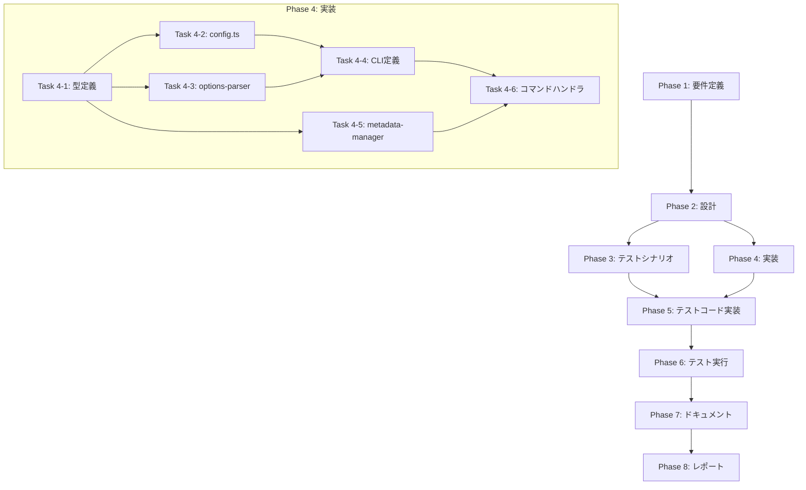

# プロジェクト計画書

## Issue #489: [Enhancement] CLI全コマンドに--language/AI_WORKFLOW_LANGUAGEを追加しワークフロー言語を一元設定可能にする

---

## 1. Issue分析

### 複雑度: **中程度**

本Issueは複数ファイルの修正を伴う既存機能の拡張であり、以下の特徴を持つ：

- **影響範囲**: CLI定義 (`main.ts`)、型定義 (`types.ts`, `types/commands.ts`)、オプションパーサー (`options-parser.ts`)、設定管理 (`config.ts`)、メタデータ管理 (`metadata-manager.ts`)、複数のコマンドハンドラ
- **新規ファイル作成**: 不要（既存ファイルの拡張のみ）
- **アーキテクチャ変更**: なし（既存パターンに従った実装）
- **テスト**: ユニットテスト + インテグレーションテストの追加が必要

### 見積もり工数: **12〜16時間**

| フェーズ | 見積もり |
|---------|---------|
| Phase 1: 要件定義 | 1h |
| Phase 2: 設計 | 2h |
| Phase 3: テストシナリオ | 1h |
| Phase 4: 実装 | 5~6h |
| Phase 5: テストコード実装 | 2~3h |
| Phase 6: テスト実行・修正 | 1~2h |
| Phase 7: ドキュメント | 0.5h |
| Phase 8: レポート | 0.5h |

**根拠**:
- 既存の `--claude-model` / `--codex-model` オプション追加（Issue #301, #302）と類似した変更パターン
- `config.ts` の既存パターン（`getFollowupLlmMode()` など）を踏襲可能
- `options-parser.ts` の既存バリデーションパターンを活用可能
- メタデータへの新規フィールド追加は `difficulty_analysis` と同様のパターン

### リスク評価: **低〜中**

- 既存コードベースのパターンに従った実装
- 後方互換性を維持（デフォルト値 `ja` で既存挙動を保持）
- 主要リスク: テストカバレッジの確保と全コマンドへの一貫した適用

---

## 2. 実装戦略判断

### 実装戦略: **EXTEND**

**判断根拠**:
- 新規ファイル・クラス・モジュールの作成は不要
- 既存のCLI構造、型定義、設定管理パターンを拡張
- `src/main.ts` のコマンド定義に `--language` オプションを追加
- `src/types/commands.ts` の各オプションインターフェースに `language` フィールドを追加
- `src/core/config.ts` に `getWorkflowLanguage()` メソッドを追加
- `src/types.ts` の `WorkflowMetadata` に `language` フィールドを追加

### テスト戦略: **UNIT_INTEGRATION**

**判断根拠**:
- **ユニットテスト**: 設定値取得ロジック、バリデーション、オプションパーサーの単体テスト
- **インテグレーションテスト**: CLI → メタデータ保存 → 読み出しの一連のフローテスト
- BDDテストは不要（ユーザーストーリー中心の機能ではなく、設定機能の追加）

### テストコード戦略: **BOTH_TEST**

**判断根拠**:
- **既存テスト拡張**: `tests/unit/commands/execute/options-parser.test.ts`、`tests/unit/core/config.test.ts` に言語オプション関連のテストケースを追加
- **新規テスト作成**: 言語設定の一元管理とメタデータ永続化に関する専用テストファイルを作成

---

## 3. 影響範囲分析

### 既存コードへの影響

| ファイル | 変更内容 |
|---------|---------|
| `src/main.ts` | `init`, `execute` 等のコマンドに `--language <ja\|en>` オプション追加 |
| `src/types/commands.ts` | `ExecuteCommandOptions`, `InitCommandOptions` 等に `language?: string` 追加 |
| `src/commands/execute/options-parser.ts` | `parseExecuteOptions()` に言語パース・バリデーション追加 |
| `src/core/config.ts` | `getWorkflowLanguage()` メソッド追加（環境変数 `AI_WORKFLOW_LANGUAGE` 取得） |
| `src/types.ts` | `WorkflowMetadata` に `language?: 'ja' \| 'en' \| null` 追加 |
| `src/core/metadata-manager.ts` | `setLanguage()`, `getLanguage()` メソッド追加（オプション） |
| `src/commands/init.ts` | 言語オプションの受け取りとメタデータへの保存 |
| `src/types/commands.ts` の `PhaseContext` | `language?: 'ja' \| 'en'` フィールド追加 |

### 依存関係の変更

- **新規依存の追加**: なし
- **既存依存の変更**: なし

### マイグレーション要否

- **データベーススキーマ変更**: 該当なし
- **設定ファイル変更**: `metadata.json` に `language` フィールドを追加（後方互換: フィールドがない場合は `ja` にフォールバック）
- **マイグレーションスクリプト**: 不要（マイグレーションレス運用を維持）

---

## 4. タスク分割

### Phase 1: 要件定義 (見積もり: 1h)

- [x] Task 1-1: 機能要件の明確化 (0.5h)
  - 言語オプション仕様の詳細定義（`ja` / `en` の許容値）
  - 優先順位の明確化（CLI > 環境変数 > メタデータ > デフォルト）
  - 対象コマンドの特定（init, execute, auto-issue, pr-comment系）
- [x] Task 1-2: 受け入れ基準の定義 (0.5h)
  - 各コマンドで `--language ja|en` が受け付けられること
  - 環境変数 `AI_WORKFLOW_LANGUAGE` が正しく読み込まれること
  - メタデータに言語設定が永続化されること
  - 不正値入力時のエラーメッセージ要件

### Phase 2: 設計 (見積もり: 2h)

- [x] Task 2-1: 設定値取得フローの設計 (1h)
  - CLI/環境変数/メタデータの優先順位ロジック設計
  - `config.ts` への `getWorkflowLanguage()` メソッド設計
  - バリデーションルールの設計（`ja` / `en` のみ許可）
- [x] Task 2-2: 型定義とインターフェース設計 (0.5h)
  - `ExecuteCommandOptions.language?: string` の追加設計
  - `WorkflowMetadata.language?: 'ja' | 'en' | null` の追加設計
  - `PhaseContext.language?: 'ja' | 'en'` の追加設計
- [x] Task 2-3: コマンド別影響範囲の設計 (0.5h)
  - 各コマンドへのオプション追加箇所の特定
  - 共通ユーティリティ関数の設計検討

### Phase 3: テストシナリオ (見積もり: 1h)

- [x] Task 3-1: ユニットテストシナリオ作成 (0.5h)
  - `config.getWorkflowLanguage()` のテストケース
  - `parseExecuteOptions()` の言語バリデーションテストケース
  - 不正値入力時のエラーハンドリングテストケース
- [x] Task 3-2: インテグレーションテストシナリオ作成 (0.5h)
  - CLI → メタデータ保存 → 再読み込みの一連フローテスト
  - 環境変数優先順位のテスト
  - 後方互換性テスト（`language` フィールドなしの既存メタデータ）

### Phase 4: 実装 (見積もり: 5~6h)

- [ ] Task 4-1: 型定義の拡張 (0.5h)
  - `src/types.ts` の `WorkflowMetadata` に `language` フィールド追加
  - `src/types/commands.ts` の各オプションインターフェースに `language` 追加
  - `src/types/commands.ts` の `PhaseContext` に `language` 追加
- [ ] Task 4-2: 設定管理の拡張 (1h)
  - `src/core/config.ts` に `getWorkflowLanguage()` メソッド追加
  - 環境変数 `AI_WORKFLOW_LANGUAGE` の取得とバリデーション
  - IConfig インターフェースの更新
- [ ] Task 4-3: オプションパーサーの拡張 (1h)
  - `src/commands/execute/options-parser.ts` に言語パース処理追加
  - `ParsedExecuteOptions` に `language` フィールド追加
  - `validateExecuteOptions()` に言語バリデーション追加
- [ ] Task 4-4: CLIコマンド定義の拡張 (1h)
  - `src/main.ts` の `init` コマンドに `--language` オプション追加
  - `src/main.ts` の `execute` コマンドに `--language` オプション追加
  - `src/main.ts` の `auto-issue` コマンドに `--language` オプション追加
  - `src/main.ts` の `pr-comment` サブコマンドに `--language` オプション追加
- [ ] Task 4-5: メタデータ管理の拡張 (1h)
  - `src/core/metadata-manager.ts` に `setLanguage()`, `getLanguage()` メソッド追加
  - 後方互換性のためのデフォルト値 (`ja`) ハンドリング
- [ ] Task 4-6: コマンドハンドラの更新 (0.5~1h)
  - `src/commands/init.ts` で言語をメタデータに保存
  - `src/commands/execute.ts` で言語を取得してコンテキストに渡す

### Phase 5: テストコード実装 (見積もり: 2~3h)

- [ ] Task 5-1: config.ts のユニットテスト追加 (0.5h)
  - `tests/unit/core/config.test.ts` に `getWorkflowLanguage()` のテスト追加
  - 環境変数設定/未設定時の動作テスト
  - 不正値入力時のフォールバックテスト
- [ ] Task 5-2: options-parser.ts のユニットテスト追加 (0.5h)
  - `tests/unit/commands/execute/options-parser.test.ts` に言語オプションテスト追加
  - 有効値 (`ja`, `en`) のパーステスト
  - 無効値入力時のバリデーションエラーテスト
- [ ] Task 5-3: metadata-manager.ts のユニットテスト追加 (0.5h)
  - `tests/unit/metadata-manager.test.ts` に言語設定テスト追加
  - `setLanguage()`, `getLanguage()` の動作テスト
  - 後方互換性テスト（既存メタデータでの動作）
- [ ] Task 5-4: インテグレーションテスト作成 (1~1.5h)
  - 新規ファイル `tests/integration/language-setting.test.ts` 作成
  - CLI → メタデータ → 再読み込みのE2Eテスト
  - 環境変数優先順位テスト

### Phase 6: テスト実行 (見積もり: 1~2h)

- [ ] Task 6-1: ユニットテスト実行と修正 (0.5h)
  - `npm test -- --grep "language"` で関連テスト実行
  - 失敗テストの修正
- [ ] Task 6-2: インテグレーションテスト実行と修正 (0.5h)
  - `npm test -- tests/integration/language-setting.test.ts` 実行
  - 失敗テストの修正
- [ ] Task 6-3: 既存テストの回帰確認 (0.5~1h)
  - `npm test` で全テスト実行
  - 回帰バグの修正

### Phase 7: ドキュメント (見積もり: 0.5h)

- [ ] Task 7-1: README.md の更新 (0.25h)
  - `--language` オプションの使用方法を追加
  - `AI_WORKFLOW_LANGUAGE` 環境変数の説明を追加
- [ ] Task 7-2: CHANGELOG.md の更新 (0.25h)
  - 新機能として言語設定機能を追記

### Phase 8: レポート (見積もり: 0.5h)

- [ ] Task 8-1: 実装サマリー作成 (0.25h)
  - 変更ファイル一覧
  - 追加したテストケース一覧
- [ ] Task 8-2: 残課題・改善提案の記録 (0.25h)
  - 将来の多言語対応拡張に向けた提案
  - プロンプトテンプレートの言語別対応（Phase 2以降）

---

## 5. 依存関係



---

## 6. リスクと軽減策

### リスク1: 後方互換性の破壊

- **影響度**: 高
- **確率**: 低
- **軽減策**:
  - `language` フィールドが未設定の場合は `ja` にフォールバック
  - 既存のメタデータファイルで回帰テストを実施
  - マイグレーションスクリプト不要の設計を維持

### リスク2: 全コマンドへの一貫した適用漏れ

- **影響度**: 中
- **確率**: 中
- **軽減策**:
  - Phase 2 で対象コマンドを明示的にリストアップ
  - 各コマンドのインテグレーションテストを追加
  - コードレビューで網羅性を確認

### リスク3: 環境変数とCLIオプションの優先順位混乱

- **影響度**: 中
- **確率**: 低
- **軽減策**:
  - 優先順位を明確にドキュメント化（CLI > 環境変数 > メタデータ > デフォルト）
  - `config.ts` で一元的に優先順位ロジックを実装
  - ユニットテストで各優先順位パターンを網羅

### リスク4: テストカバレッジ不足

- **影響度**: 中
- **確率**: 中
- **軽減策**:
  - Phase 3 で必要なテストシナリオを事前に設計
  - 既存テストパターン（`--claude-model` 等）を参考に網羅性を確保
  - カバレッジレポートで確認

---

## 7. 品質ゲート

### Phase 1: 要件定義
- [x] 機能要件が明確に記載されている
- [x] 受け入れ基準が定義されている
- [x] 対象コマンドが特定されている
- [x] 優先順位ルールが明確化されている

### Phase 2: 設計
- [x] 実装戦略の判断根拠が明記されている（EXTEND）
- [x] テスト戦略の判断根拠が明記されている（UNIT_INTEGRATION）
- [x] テストコード戦略の判断根拠が明記されている（BOTH_TEST）
- [x] 型定義とインターフェースが設計されている
- [x] 設定値取得フローが設計されている

### Phase 3: テストシナリオ
- [x] ユニットテストシナリオがカバレッジ要件を満たしている
- [x] インテグレーションテストシナリオが定義されている
- [x] エッジケース（不正値入力、未設定時）が網羅されている

### Phase 4: 実装
- [ ] 型定義が追加されている
- [ ] `config.ts` に `getWorkflowLanguage()` が実装されている
- [ ] `options-parser.ts` に言語パース・バリデーションが実装されている
- [ ] `main.ts` の対象コマンドに `--language` オプションが追加されている
- [ ] `metadata-manager.ts` に言語永続化機能が実装されている
- [ ] 後方互換性が維持されている（デフォルト `ja`）

### Phase 5: テストコード実装
- [ ] ユニットテストが実装されている
- [ ] インテグレーションテストが実装されている
- [ ] エッジケースがテストされている

### Phase 6: テスト実行
- [ ] すべてのテストがパスしている
- [ ] 回帰バグがないことを確認
- [ ] コードカバレッジが維持されている

### Phase 7: ドキュメント
- [ ] README.md が更新されている
- [ ] CHANGELOG.md が更新されている
- [ ] 使用方法が明記されている

### Phase 8: レポート
- [ ] 実装サマリーが作成されている
- [ ] 残課題が記録されている

---

## 補足情報

### 既存コードパターンの参考

1. **環境変数取得パターン** (`config.ts`):
```typescript
// 参考: getFollowupLlmMode()
public getWorkflowLanguage(): 'ja' | 'en' | null {
  const value = this.getEnv('AI_WORKFLOW_LANGUAGE', false);
  if (!value) return null;
  const normalized = value.toLowerCase();
  return ['ja', 'en'].includes(normalized) ? (normalized as 'ja' | 'en') : null;
}
```

2. **オプションパースパターン** (`options-parser.ts`):
```typescript
// 参考: claudeModel の解析
const language =
  typeof options.language === 'string' && ['ja', 'en'].includes(options.language.toLowerCase())
    ? options.language.toLowerCase() as 'ja' | 'en'
    : undefined;
```

3. **メタデータフィールド追加パターン** (`types.ts`):
```typescript
// 参考: difficulty_analysis
export interface WorkflowMetadata {
  // 既存フィールド...
  language?: 'ja' | 'en' | null;
}
```

### 優先順位ロジック（推奨）

```
1. CLI オプション (--language ja/en)
2. 環境変数 (AI_WORKFLOW_LANGUAGE=ja/en)
3. メタデータ (metadata.json の language フィールド)
4. デフォルト値 ('ja')
```

---

**計画書作成日**: 2025-01-15
**対象Issue**: #489
**計画書バージョン**: 1.0
