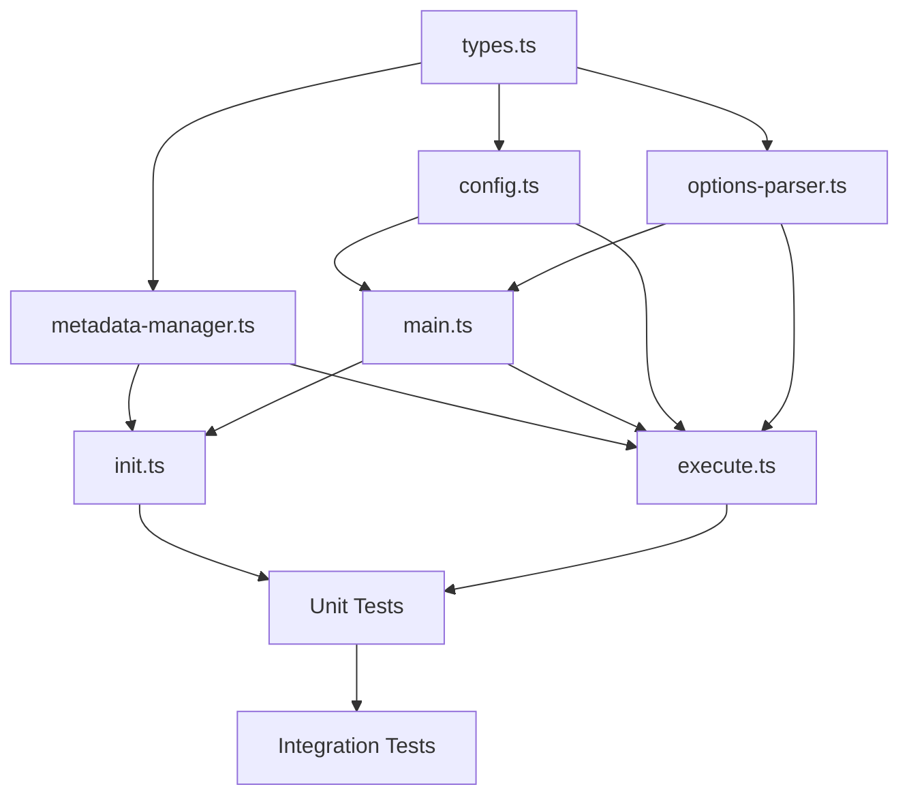

# 詳細設計書

## Issue #489: CLI全コマンドに--language/AI_WORKFLOW_LANGUAGEを追加しワークフロー言語を一元設定可能にする

---

## 0. 文書概要

本設計書は、ai-workflowの全コマンドに共通の言語指定手段（CLIオプション`--language`と環境変数`AI_WORKFLOW_LANGUAGE`）を追加し、メタデータを介してワークフロー全体で一貫した言語設定を維持する機能の詳細設計を定義する。

### 参照ドキュメント

- Planning Document: `.ai-workflow/issue-489/00_planning/output/planning.md`
- Requirements Document: `.ai-workflow/issue-489/01_requirements/output/requirements.md`
- GitHub Issue: https://github.com/tielec/ai-workflow-agent/issues/489

---

## 1. アーキテクチャ設計

### 1.1 システム全体図

```
┌─────────────────────────────────────────────────────────────────────────┐
│                           CLI Layer (main.ts)                          │
│  ┌─────────────┐ ┌─────────────┐ ┌─────────────┐ ┌─────────────────┐   │
│  │    init     │ │   execute   │ │ auto-issue  │ │   pr-comment    │   │
│  │ --language  │ │ --language  │ │ --language  │ │   --language    │   │
│  └──────┬──────┘ └──────┬──────┘ └──────┬──────┘ └───────┬─────────┘   │
│         │               │               │                 │            │
│         └───────────────┼───────────────┼─────────────────┘            │
│                         ▼               ▼                              │
└─────────────────────────┬───────────────────────────────────────────────┘
                          │
                          ▼
┌─────────────────────────────────────────────────────────────────────────┐
│                      Configuration Layer                                │
│  ┌─────────────────────────────────────────────────────────────────┐   │
│  │                    config.ts                                     │   │
│  │  ┌──────────────────────────────────────────────────────────┐   │   │
│  │  │  getWorkflowLanguage(): 'ja' | 'en' | null               │   │   │
│  │  │  ┌─────────────────────────────────────────────────────┐ │   │   │
│  │  │  │ AI_WORKFLOW_LANGUAGE env → normalize → validate     │ │   │   │
│  │  │  └─────────────────────────────────────────────────────┘ │   │   │
│  │  └──────────────────────────────────────────────────────────┘   │   │
│  └─────────────────────────────────────────────────────────────────┘   │
└─────────────────────────────────────────────────────────────────────────┘
                          │
                          ▼
┌─────────────────────────────────────────────────────────────────────────┐
│                      Command Layer                                      │
│  ┌─────────────────────────────────────────────────────────────────┐   │
│  │               options-parser.ts                                  │   │
│  │  ┌──────────────────────────────────────────────────────────┐   │   │
│  │  │  parseExecuteOptions(): { language?: 'ja' | 'en' }       │   │   │
│  │  │  validateExecuteOptions(): ja|en validation              │   │   │
│  │  └──────────────────────────────────────────────────────────┘   │   │
│  └─────────────────────────────────────────────────────────────────┘   │
└─────────────────────────────────────────────────────────────────────────┘
                          │
                          ▼
┌─────────────────────────────────────────────────────────────────────────┐
│                      Metadata Layer                                     │
│  ┌─────────────────────────────────────────────────────────────────┐   │
│  │                 metadata-manager.ts                              │   │
│  │  ┌──────────────────────────────────────────────────────────┐   │   │
│  │  │  setLanguage(lang: 'ja' | 'en'): void                    │   │   │
│  │  │  getLanguage(): 'ja' | 'en' | null                       │   │   │
│  │  └──────────────────────────────────────────────────────────┘   │   │
│  └─────────────────────────────────────────────────────────────────┘   │
│  ┌─────────────────────────────────────────────────────────────────┐   │
│  │                 metadata.json                                    │   │
│  │  { ..., "language": "ja" | "en" | null, ... }                   │   │
│  └─────────────────────────────────────────────────────────────────┘   │
└─────────────────────────────────────────────────────────────────────────┘
```

### 1.2 コンポーネント間の関係

```
┌────────────────────────────────────────────────────────────────────────┐
│                        Priority Resolution Flow                        │
│                                                                        │
│   ┌─────────────────┐                                                  │
│   │  CLI Option     │  ──► 最優先（--language ja|en）                  │
│   │  (--language)   │                                                  │
│   └────────┬────────┘                                                  │
│            │ null の場合                                               │
│            ▼                                                           │
│   ┌─────────────────┐                                                  │
│   │  Environment    │  ──► 2番目（AI_WORKFLOW_LANGUAGE=ja|en）         │
│   │  Variable       │                                                  │
│   └────────┬────────┘                                                  │
│            │ null の場合                                               │
│            ▼                                                           │
│   ┌─────────────────┐                                                  │
│   │  Metadata       │  ──► 3番目（metadata.json の language フィールド）│
│   │  (metadata.json)│                                                  │
│   └────────┬────────┘                                                  │
│            │ null の場合                                               │
│            ▼                                                           │
│   ┌─────────────────┐                                                  │
│   │  Default        │  ──► デフォルト（'ja'）                          │
│   │  ('ja')         │                                                  │
│   └─────────────────┘                                                  │
└────────────────────────────────────────────────────────────────────────┘
```

### 1.3 データフロー

```
User Input                 Processing                     Output
───────────                ──────────                     ──────

  --language en  ──────►  parseExecuteOptions()  ──────►  language: 'en'
       │                        │                              │
       │                        ▼                              │
       │               validateExecuteOptions()                │
       │                        │                              │
       │                        ▼                              │
       │               resolveLanguage()                       │
       │                  (優先順位ロジック)                   │
       │                        │                              │
       └────────────────────────┴──────────────────────────────┘
                                │
                                ▼
                        PhaseContext.language
                                │
                                ▼
                         Agent Prompt
                        (言語設定適用)
```

---

## 2. 実装戦略判断

### 実装戦略: **EXTEND（拡張）**

**判断根拠**:

1. **既存ファイルへの影響範囲**
   - 8〜10個の既存ファイルに対する拡張・修正が必要
   - 新規ファイルの作成は不要（既存のアーキテクチャを活用）

2. **新規ファイルの作成数**
   - 新規ソースファイル: 0件
   - 新規テストファイル: 1件（`tests/integration/language-setting.test.ts`）

3. **既存機能との統合度**
   - 既存の `--claude-model` / `--codex-model` オプション追加パターン（Issue #301, #302）と同一のパターンを踏襲
   - `config.ts` の `getFollowupLlmMode()` と同様の環境変数取得パターンを採用
   - `metadata-manager.ts` の `setDifficultyAnalysis()` / `getDifficultyAnalysis()` と同様のgetter/setterパターンを採用

4. **アーキテクチャ変更**
   - なし（既存のCLI → 設定 → メタデータのフローに言語設定を追加）

---

## 3. テスト戦略判断

### テスト戦略: **UNIT_INTEGRATION**

**判断根拠**:

1. **機能の複雑度**
   - 中程度（複数レイヤーにまたがる設定値の伝播）
   - 優先順位ロジックの正確性検証が重要

2. **ユーザーストーリーの有無**
   - 要件定義書にGherkinシナリオが定義済み
   - ただし、BDDテストは設定機能の追加には過剰

3. **既存テストとの整合性**
   - `tests/unit/core/config.test.ts` に環境変数テストパターンが存在
   - `tests/unit/commands/execute/options-parser.test.ts` にオプションパースのテストパターンが存在
   - `tests/integration/auto-model-selection.test.ts` がモデル設定の統合テストパターンを提供

4. **テスト内容**
   - **ユニットテスト**:
     - `config.getWorkflowLanguage()` の単体テスト
     - `parseExecuteOptions()` の言語オプションパーステスト
     - `validateExecuteOptions()` の言語バリデーションテスト
     - `metadata-manager.setLanguage()` / `getLanguage()` のテスト
   - **インテグレーションテスト**:
     - CLI → メタデータ保存 → 再読み込みのE2Eフロー
     - 優先順位ロジック（CLI > 環境変数 > メタデータ > デフォルト）の検証

---

## 4. テストコード戦略判断

### テストコード戦略: **BOTH_TEST（既存テスト拡張 + 新規テスト作成）**

**判断根拠**:

1. **既存テストファイルの有無**
   - `tests/unit/core/config.test.ts` が存在（環境変数テスト追加）
   - `tests/unit/commands/execute/options-parser.test.ts` が存在（言語オプションテスト追加）
   - `tests/unit/metadata-manager.test.ts` が存在（言語getter/setterテスト追加）

2. **既存テストとの関連性**
   - 既存の環境変数テスト、オプションパーサーテストに言語関連テストを追加することで一貫性を確保

3. **新規テスト作成の必要性**
   - 優先順位ロジックと後方互換性を網羅的に検証するため、専用の統合テストファイルを作成

**テストファイル一覧**:

| ファイル | 種別 | 内容 |
|---------|------|------|
| `tests/unit/core/config.test.ts` | 既存拡張 | `getWorkflowLanguage()` テスト追加 |
| `tests/unit/commands/execute/options-parser.test.ts` | 既存拡張 | 言語オプションのパース・バリデーションテスト追加 |
| `tests/unit/metadata-manager.test.ts` | 既存拡張 | `setLanguage()`, `getLanguage()` テスト追加 |
| `tests/integration/language-setting.test.ts` | 新規作成 | 優先順位・後方互換性の統合テスト |

---

## 5. 影響範囲分析

### 5.1 既存コードへの影響

| ファイル | 変更内容 | 影響度 |
|---------|---------|--------|
| `src/main.ts` | 7コマンドに `--language <ja\|en>` オプション追加 | 中 |
| `src/types.ts` | `WorkflowMetadata` に `language` フィールド追加 | 低 |
| `src/types/commands.ts` | 各オプションインターフェースに `language` 追加、`PhaseContext` に `language` 追加 | 低 |
| `src/core/config.ts` | `getWorkflowLanguage()` メソッド追加、`IConfig` インターフェース更新 | 低 |
| `src/commands/execute/options-parser.ts` | 言語パース・バリデーション追加 | 低 |
| `src/core/metadata-manager.ts` | `setLanguage()`, `getLanguage()` メソッド追加 | 低 |
| `src/commands/init.ts` | 言語オプション受け取りとメタデータ保存 | 低 |
| `src/commands/execute.ts` | 言語取得とコンテキスト伝播 | 低 |

### 5.2 依存関係の変更

- **新規依存の追加**: なし
- **既存依存の変更**: なし
- **パッケージバージョン変更**: なし

### 5.3 マイグレーション要否

| 項目 | 要否 | 詳細 |
|------|------|------|
| データベーススキーマ変更 | 該当なし | - |
| 設定ファイル変更 | なし | `metadata.json` に `language` フィールドを追加（オプショナル） |
| マイグレーションスクリプト | 不要 | `language` フィールドがない場合は `ja` にフォールバック |
| 後方互換性 | **維持** | 既存メタデータはそのまま動作（デフォルト `ja`） |

---

## 6. 変更・追加ファイルリスト

### 6.1 新規作成ファイル

| ファイルパス | 目的 |
|-------------|------|
| `tests/integration/language-setting.test.ts` | 言語設定の統合テスト |

### 6.2 修正が必要な既存ファイル

| ファイルパス | 変更内容 |
|-------------|---------|
| `src/main.ts` | `init`, `execute`, `auto-issue`, `rollback`, `rollback-auto`, `finalize`, `pr-comment` サブコマンドに `--language` オプション追加 |
| `src/types.ts` | `WorkflowMetadata` インターフェースに `language?: 'ja' \| 'en' \| null` 追加 |
| `src/types/commands.ts` | `ExecuteCommandOptions`, `InitCommandOptions` 等に `language?: string` 追加、`PhaseContext` に `language?: 'ja' \| 'en'` 追加 |
| `src/core/config.ts` | `IConfig` インターフェースに `getWorkflowLanguage()` 追加、`Config` クラスに実装追加 |
| `src/commands/execute/options-parser.ts` | `ParsedExecuteOptions` に `language` 追加、`parseExecuteOptions()` に言語パース追加、`validateExecuteOptions()` に言語バリデーション追加 |
| `src/core/metadata-manager.ts` | `setLanguage()`, `getLanguage()` メソッド追加 |
| `src/commands/init.ts` | 言語オプション受け取りとメタデータ保存処理追加 |
| `src/commands/execute.ts` | 言語取得と `PhaseContext` への伝播処理追加 |
| `tests/unit/core/config.test.ts` | `getWorkflowLanguage()` テスト追加 |
| `tests/unit/commands/execute/options-parser.test.ts` | 言語オプションのテスト追加 |
| `tests/unit/metadata-manager.test.ts` | 言語setter/getterのテスト追加 |

### 6.3 削除が必要なファイル

なし

---

## 7. 詳細設計

### 7.1 型定義設計

#### 7.1.1 WorkflowLanguage 型（許可言語定義）

```typescript
// src/types.ts に追加

/**
 * ワークフロー言語設定
 *
 * - 'ja': 日本語（デフォルト）
 * - 'en': 英語
 */
export type WorkflowLanguage = 'ja' | 'en';

/**
 * 許可される言語値の配列（バリデーション用）
 */
export const VALID_WORKFLOW_LANGUAGES: readonly WorkflowLanguage[] = ['ja', 'en'] as const;

/**
 * デフォルト言語
 */
export const DEFAULT_WORKFLOW_LANGUAGE: WorkflowLanguage = 'ja';
```

#### 7.1.2 WorkflowMetadata 拡張

```typescript
// src/types.ts の WorkflowMetadata インターフェース

export interface WorkflowMetadata {
  // ... 既存フィールド ...

  /**
   * ワークフロー言語設定（Issue #489）
   *
   * - 'ja': 日本語
   * - 'en': 英語
   * - null: 未設定（デフォルト 'ja' にフォールバック）
   */
  language?: WorkflowLanguage | null;
}
```

#### 7.1.3 ExecuteCommandOptions 拡張

```typescript
// src/types/commands.ts の ExecuteCommandOptions インターフェース

export interface ExecuteCommandOptions {
  // ... 既存フィールド ...

  /**
   * ワークフロー言語指定（Issue #489）
   *
   * 'ja' または 'en' を指定
   * 大文字小文字を区別しない（正規化される）
   */
  language?: string;
}
```

#### 7.1.4 PhaseContext 拡張

```typescript
// src/types/commands.ts の PhaseContext 型

export type PhaseContext = {
  // ... 既存フィールド ...

  /**
   * ワークフロー言語設定（Issue #489）
   *
   * 優先順位: CLI > 環境変数 > メタデータ > デフォルト('ja')
   */
  language?: WorkflowLanguage;
};
```

### 7.2 関数設計

#### 7.2.1 config.ts - getWorkflowLanguage()

```typescript
// src/core/config.ts の IConfig インターフェースに追加

export interface IConfig {
  // ... 既存メソッド ...

  /**
   * ワークフロー言語設定を環境変数から取得
   *
   * 環境変数 AI_WORKFLOW_LANGUAGE の値を取得し、正規化・バリデーションを行う
   *
   * @returns 'ja' | 'en' | null（有効な値がない場合）
   *
   * @example
   * // AI_WORKFLOW_LANGUAGE=en の場合
   * config.getWorkflowLanguage() // => 'en'
   *
   * // AI_WORKFLOW_LANGUAGE=EN の場合（大文字）
   * config.getWorkflowLanguage() // => 'en'（正規化される）
   *
   * // AI_WORKFLOW_LANGUAGE=fr の場合（無効値）
   * config.getWorkflowLanguage() // => null（無視される）
   *
   * // AI_WORKFLOW_LANGUAGE 未設定の場合
   * config.getWorkflowLanguage() // => null
   */
  getWorkflowLanguage(): 'ja' | 'en' | null;
}
```

**実装**:

```typescript
// src/core/config.ts の Config クラスに追加

public getWorkflowLanguage(): 'ja' | 'en' | null {
  const value = this.getEnv('AI_WORKFLOW_LANGUAGE', false);
  if (!value) {
    return null;
  }

  const normalized = value.toLowerCase().trim();
  if (normalized === 'ja' || normalized === 'en') {
    return normalized;
  }

  // 無効値はログを出力せず無視（デフォルト動作に従う）
  return null;
}
```

#### 7.2.2 options-parser.ts - 言語パース・バリデーション

**ParsedExecuteOptions 拡張**:

```typescript
// src/commands/execute/options-parser.ts

export interface ParsedExecuteOptions {
  // ... 既存フィールド ...

  /**
   * ワークフロー言語指定（Issue #489）
   *
   * 'ja' または 'en'、未指定時は undefined
   */
  language?: 'ja' | 'en';
}
```

**parseExecuteOptions() 拡張**:

```typescript
// parseExecuteOptions() 関数内に追加

// 言語オプションの解析（Issue #489）
const languageRaw =
  typeof options.language === 'string' ? options.language.toLowerCase().trim() : undefined;
const language =
  languageRaw === 'ja' || languageRaw === 'en' ? languageRaw : undefined;

return {
  // ... 既存フィールド ...
  language,
};
```

**validateExecuteOptions() 拡張**:

```typescript
// validateExecuteOptions() 関数内に追加

// 言語オプションのバリデーション（Issue #489）
if (options.language !== undefined) {
  const lang = String(options.language).toLowerCase().trim();
  if (lang !== 'ja' && lang !== 'en') {
    errors.push("Option '--language' must be one of: ja, en.");
  }
}
```

#### 7.2.3 metadata-manager.ts - 言語getter/setter

```typescript
// src/core/metadata-manager.ts の MetadataManager クラスに追加

/**
 * ワークフロー言語設定を保存（Issue #489）
 *
 * @param lang - 'ja' または 'en'
 */
public setLanguage(lang: 'ja' | 'en'): void {
  this.state.data.language = lang;
  this.save();
  logger.debug(`Workflow language set: ${lang}`);
}

/**
 * ワークフロー言語設定を取得（Issue #489）
 *
 * @returns 'ja' | 'en' | null（未設定の場合）
 */
public getLanguage(): 'ja' | 'en' | null {
  const lang = this.state.data.language;
  // 後方互換性: undefined または null の場合は null を返す
  // 呼び出し元でデフォルト値 'ja' にフォールバック
  return lang === 'ja' || lang === 'en' ? lang : null;
}
```

#### 7.2.4 言語解決ユーティリティ関数

```typescript
// src/commands/execute.ts または 新規ユーティリティファイル

import { config } from '../core/config.js';
import type { MetadataManager } from '../core/metadata-manager.js';
import { DEFAULT_WORKFLOW_LANGUAGE } from '../types.js';

/**
 * ワークフロー言語を解決する（優先順位ロジック）
 *
 * 優先順位:
 * 1. CLI オプション (--language ja|en)
 * 2. 環境変数 (AI_WORKFLOW_LANGUAGE=ja|en)
 * 3. メタデータ (metadata.json の language フィールド)
 * 4. デフォルト値 ('ja')
 *
 * @param cliLanguage - CLI で指定された言語（undefined の場合は次の優先順位へ）
 * @param metadataManager - メタデータマネージャー（null の場合はスキップ）
 * @returns 解決された言語設定 ('ja' または 'en')
 */
export function resolveWorkflowLanguage(
  cliLanguage: 'ja' | 'en' | undefined,
  metadataManager: MetadataManager | null
): 'ja' | 'en' {
  // 1. CLI オプション（最優先）
  if (cliLanguage) {
    return cliLanguage;
  }

  // 2. 環境変数
  const envLanguage = config.getWorkflowLanguage();
  if (envLanguage) {
    return envLanguage;
  }

  // 3. メタデータ
  if (metadataManager) {
    const metaLanguage = metadataManager.getLanguage();
    if (metaLanguage) {
      return metaLanguage;
    }
  }

  // 4. デフォルト値
  return DEFAULT_WORKFLOW_LANGUAGE;
}
```

### 7.3 CLI定義設計

#### 7.3.1 共通オプション定義パターン

```typescript
// src/main.ts に追加するオプション定義パターン

.option(
  '--language <lang>',
  'Workflow language (ja|en, default: ja)',
)
```

#### 7.3.2 対象コマンド一覧

| コマンド | オプション追加位置 | 備考 |
|---------|-------------------|------|
| `init` | `.option('--language <lang>', ...)` | メタデータに初期保存 |
| `execute` | `.option('--language <lang>', ...)` | 既存オプションと並列 |
| `auto-issue` | `.option('--language <lang>', ...)` | Issue生成言語指定 |
| `rollback` | `.option('--language <lang>', ...)` | ロールバック処理言語 |
| `rollback-auto` | `.option('--language <lang>', ...)` | 自動ロールバック言語 |
| `finalize` | `.option('--language <lang>', ...)` | ファイナライズ処理言語 |
| `pr-comment init` | `.option('--language <lang>', ...)` | PRコメント初期化言語 |
| `pr-comment analyze` | `.option('--language <lang>', ...)` | PRコメント分析言語 |
| `pr-comment execute` | `.option('--language <lang>', ...)` | PRコメント実行言語 |
| `pr-comment finalize` | `.option('--language <lang>', ...)` | PRコメントファイナライズ言語 |

### 7.4 データ構造設計

#### 7.4.1 metadata.json スキーマ拡張

```json
{
  "issue_number": "489",
  "issue_url": "https://github.com/...",
  "issue_title": "...",
  "workflow_version": "0.1.0",
  "current_phase": "planning",
  "language": "ja",  // 新規追加フィールド（Issue #489）
  "design_decisions": { ... },
  "cost_tracking": { ... },
  "phases": { ... }
}
```

**フィールド仕様**:

| フィールド | 型 | 必須 | デフォルト | 説明 |
|-----------|-----|------|-----------|------|
| `language` | `'ja' \| 'en' \| null` | No | `null` | ワークフロー言語設定。未設定時は `ja` にフォールバック |

### 7.5 インターフェース設計

#### 7.5.1 IConfig インターフェース拡張

```typescript
export interface IConfig {
  // === 既存メソッド（変更なし） ===
  getGitHubToken(): string;
  getGitHubRepository(): string | null;
  // ... 他の既存メソッド ...

  // === 新規メソッド（Issue #489） ===

  /**
   * ワークフロー言語設定を環境変数から取得
   */
  getWorkflowLanguage(): 'ja' | 'en' | null;
}
```

---

## 8. セキュリティ考慮事項

### 8.1 入力値サニタイズ

| リスク | 対策 |
|--------|------|
| コマンドインジェクション | 許可値リスト（`ja`, `en`）でバリデーション。許可外の値は無視 |
| パストラバーサル | 言語値はファイルパスに使用しない。メタデータJSONのフィールド値のみ |
| XSS/HTMLインジェクション | 言語値はプロンプトテンプレート内で使用される可能性があるが、LLMへの入力であり、ブラウザ出力には使用しない |

### 8.2 認証・認可

- **変更なし**: 言語設定は認証・認可に影響しない設定項目

### 8.3 データ保護

| 項目 | 対応 |
|------|------|
| 機密情報含有 | なし（`ja`/`en` のみ） |
| ログ出力 | 言語設定値はログ出力可能（機密情報ではない） |
| メタデータ保存 | `metadata.json` に平文で保存（暗号化不要） |

---

## 9. 非機能要件への対応

### 9.1 パフォーマンス

| 要件 | 対応 |
|------|------|
| 言語設定の取得は100ms以内 | `config.getWorkflowLanguage()` は環境変数読み取りのみで即時完了（<1ms） |
| 追加のAPI呼び出しなし | ローカル完結（環境変数、メタデータファイルのみ） |

### 9.2 スケーラビリティ

| 要件 | 対応 |
|------|------|
| 将来の言語追加 | `VALID_WORKFLOW_LANGUAGES` 配列に追加するだけで拡張可能 |
| 複数リポジトリ対応 | 既存のマルチリポジトリアーキテクチャに影響なし |

### 9.3 保守性

| 要件 | 対応 |
|------|------|
| 許可値の一元管理 | `types.ts` の `VALID_WORKFLOW_LANGUAGES` で一元定義 |
| テストカバレッジ | 新規コードに対して80%以上のカバレッジを目標 |
| 既存パターン踏襲 | `--claude-model` 等の既存実装パターンを厳密に踏襲 |

---

## 10. 実装の順序

### 10.1 推奨実装順序

```
Phase 1: 型定義の拡張（依存関係の基盤）
    ↓
Phase 2: config.ts の拡張（環境変数取得）
    ↓
Phase 3: options-parser.ts の拡張（CLIオプションパース）
    ↓
Phase 4: metadata-manager.ts の拡張（永続化）
    ↓
Phase 5: main.ts の拡張（CLIオプション定義）
    ↓
Phase 6: コマンドハンドラの更新（init.ts, execute.ts）
    ↓
Phase 7: ユニットテスト実装
    ↓
Phase 8: インテグレーションテスト実装
    ↓
Phase 9: ドキュメント更新
```

### 10.2 依存関係の考慮



### 10.3 ロールバックポイント

各フェーズ完了時点でコミットを作成し、問題発生時にロールバック可能にする：

1. **Phase 1 完了**: 型定義追加のみ（コンパイル可能、テストパス）
2. **Phase 3 完了**: CLI パース機能完成（バリデーションテストパス）
3. **Phase 5 完了**: 全CLI定義完了（E2E動作確認可能）
4. **Phase 8 完了**: 全テストパス（リリース可能状態）

---

## 11. 品質ゲート確認

### Phase 2: 設計

- [x] **実装戦略の判断根拠が明記されている**: EXTEND（セクション2）
- [x] **テスト戦略の判断根拠が明記されている**: UNIT_INTEGRATION（セクション3）
- [x] **テストコード戦略の判断根拠が明記されている**: BOTH_TEST（セクション4）
- [x] **既存コードへの影響範囲が分析されている**: セクション5
- [x] **変更が必要なファイルがリストアップされている**: セクション6
- [x] **設計が実装可能である**: 詳細設計（セクション7）で具体的なコード例を提示

---

## 12. 補足情報

### 12.1 既存パターンの参照

| パターン | 参照元 | 適用箇所 |
|---------|--------|---------|
| 環境変数取得 | `getFollowupLlmMode()` in `config.ts` | `getWorkflowLanguage()` |
| CLIオプション定義 | `--claude-model` in `main.ts` | `--language` |
| オプションパース | `claudeModel` in `options-parser.ts` | `language` |
| メタデータgetter/setter | `setDifficultyAnalysis()` / `getDifficultyAnalysis()` in `metadata-manager.ts` | `setLanguage()` / `getLanguage()` |

### 12.2 将来の拡張候補

| 項目 | 優先度 | 詳細 |
|------|--------|------|
| 追加言語サポート | Phase 2 | `fr`, `zh`, `de`, `es` 等 |
| プロンプトテンプレート言語別分離 | Phase 2 | `prompts/ja/`, `prompts/en/` ディレクトリ構造 |
| Issue言語自動検出 | Phase 3 | Issue本文からの言語自動判定 |

---

**設計書作成日**: 2025-01-15
**対象Issue**: #489
**設計書バージョン**: 1.0
