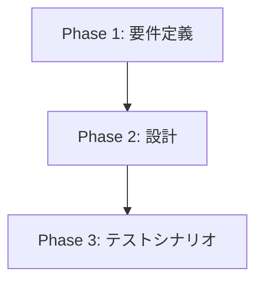

# Codex Agent 実行ログ

開始日時: 2025/12/25 13:04:16

---

## Turn 1: スレッド開始

**Thread ID**: `[REDACTED_TOKEN]`

## Turn 2: ツール実行

**種別**: reasoning
**ステータス**: completed

## Turn 3: ツール実行

**種別**: コマンド実行
**コマンド**: `/bin/bash -lc pwd`
**ステータス**: completed (exit_code=0)

```text
/tmp/ai-workflow-repos-132-607bc05f/ai-workflow-agent
```

## Turn 4: ツール実行

**種別**: reasoning
**ステータス**: completed

## Turn 5: ツール実行

**種別**: コマンド実行
**コマンド**: `/bin/bash -lc ls`
**ステータス**: completed (exit_code=0)

```text
ARCHITECTURE.md
CHANGELOG.md
CLAUDE.md
[REDACTED_TOKEN].md
[REDACTED_TOKEN].md
CODEBASE_SUMMARY.md
DOCKER_AUTH_SETUP.md
Dockerfile
Jenkinsfile
LICENSE
PROGRESS.md
README.md
ROADMAP.md
SETUP_TYPESCRIPT.md
TROUBLESHOOTING.md
__mocks__
docs
examples
jenkins
jest.config.cjs
metadata.json.template
package-lock.json
package.json
scripts
src
tests
tmp
tsconfig.json
tsconfig.test.json
```

## Turn 6: ツール実行

**種別**: reasoning
**ステータス**: completed

## Turn 7: ツール実行

**種別**: コマンド実行
**コマンド**: `/bin/bash -lc "rg --files -g 'AGENTS.md'"`
**ステータス**: failed (exit_code=127)

```text
/bin/bash: line 1: rg: command not found
```

## Turn 8: ツール実行

**種別**: reasoning
**ステータス**: completed

## Turn 9: ツール実行

**種別**: コマンド実行
**コマンド**: `/bin/bash -lc 'find .. -name AGENTS.md -print'`
**ステータス**: completed (exit_code=0)

## Turn 10: ツール実行

**種別**: reasoning
**ステータス**: completed

## Turn 11: ツール実行

**種別**: コマンド実行
**コマンド**: `/bin/bash -lc 'ls -a'`
**ステータス**: completed (exit_code=0)

```text
.
..
.ai-workflow
.eslintrc.json
.git
.github
.gitignore
.test-tmp
ARCHITECTURE.md
CHANGELOG.md
CLAUDE.md
[REDACTED_TOKEN].md
[REDACTED_TOKEN].md
CODEBASE_SUMMARY.md
DOCKER_AUTH_SETUP.md
Dockerfile
Jenkinsfile
LICENSE
PROGRESS.md
README.md
ROADMAP.md
SETUP_TYPESCRIPT.md
TROUBLESHOOTING.md
__mocks__
docs
examples
jenkins
jest.config.cjs
metadata.json.template
package-lock.json
package.json
scripts
src
tests
tmp
tsconfig.json
tsconfig.test.json
```

## Turn 12: ツール実行

**種別**: reasoning
**ステータス**: completed

## Turn 13: ツール実行

**種別**: コマンド実行
**コマンド**: `/bin/bash -lc 'cat .ai-workflow/issue-489/00_planning/output/planning.md'`
**ステータス**: completed (exit_code=0)

```text
# プロジェクト計画書

## Issue #489: [Enhancement] CLI全コマンドに--language/AI_WORKFLOW_LANGUAGEを追加しワークフロー言語を一元設定可能にする

---

## 1. Issue分析

### 複雑度: **中程度**

本Issueは複数ファイルの修正を伴う既存機能の拡張であり、以下の特徴を持つ：

- **影響範囲**: CLI定義 (`main.ts`)、型定義 (`types.ts`, `types/commands.ts`)、オプションパーサー (`options-parser.ts`)、設定管理 (`config.ts`)、メタデータ管理 (`metadata-manager.ts`)、複数のコマンドハンドラ
- **新規ファイル作成**: 不要（既存ファイルの拡張のみ）
- **アーキテクチャ変更**: なし（既存パターンに従った実装）
- **テスト**: ユニットテスト + インテグレーションテストの追加が必要

### 見積もり工数: **12〜16時間**

| フェーズ | 見積もり |
|---------|---------|
| Phase 1: 要件定義 | 1h |
| Phase 2: 設計 | 2h |
| Phase 3: テストシナリオ | 1h |
| Phase 4: 実装 | 5~6h |
| Phase 5: テストコード実装 | 2~3h |
| Phase 6: テスト実行・修正 | 1~2h |
| Phase 7: ドキュメント | 0.5h |
| Phase 8: レポート | 0.5h |

**根拠**:
- 既存の `--claude-model` / `--codex-model` オプション追加（Issue #301, #302）と類似した変更パターン
- `config.ts` の既存パターン（`getFollowupLlmMode()` など）を踏襲可能
- `options-parser.ts` の既存バリデーションパターンを活用可能
- メタデータへの新規フィールド追加は `difficulty_analysis` と同様のパターン

### リスク評価: **低〜中**

- 既存コードベースのパターンに従った実装
- 後方互換性を維持（デフォルト値 `ja` で既存挙動を保持）
- 主要リスク: テストカバレッジの確保と全コマンドへの一貫した適用

---

## 2. 実装戦略判断

### 実装戦略: **EXTEND**

**判断根拠**:
- 新規ファイル・クラス・モジュールの作成は不要
- 既存のCLI構造、型定義、設定管理パターンを拡張
- `src/main.ts` のコマンド定義に `--language` オプションを追加
- `src/types/commands.ts` の各オプションインターフェースに `language` フィールドを追加
- `src/core/config.ts` に `getWorkflowLanguage()` メソッドを追加
- `src/types.ts` の `WorkflowMetadata` に `language` フィールドを追加

### テスト戦略: **UNIT_INTEGRATION**

**判断根拠**:
- **ユニットテスト**: 設定値取得ロジック、バリデーション、オプションパーサーの単体テスト
- **インテグレーションテスト**: CLI → メタデータ保存 → 読み出しの一連のフローテスト
- BDDテストは不要（ユーザーストーリー中心の機能ではなく、設定機能の追加）

### テストコード戦略: **BOTH_TEST**

**判断根拠**:
- **既存テスト拡張**: `tests/unit/commands/execute/options-parser.test.ts`、`tests/unit/core/config.test.ts` に言語オプション関連のテストケースを追加
- **新規テスト作成**: 言語設定の一元管理とメタデータ永続化に関する専用テストファイルを作成

---

## 3. 影響範囲分析

### 既存コードへの影響

| ファイル | 変更内容 |
|---------|---------|
| `src/main.ts` | `init`, `execute` 等のコマンドに `--language <ja\|en>` オプション追加 |
| `src/types/commands.ts` | `[REDACTED_TOKEN]`, `InitCommandOptions` 等に `language?: string` 追加 |
| `src/commands/execute/options-parser.ts` | `parseExecuteOptions()` に言語パース・バリデーション追加 |
| `src/core/config.ts` | `getWorkflowLanguage()` メソッド追加（環境変数 `AI_WORKFLOW_LANGUAGE` 取得） |
| `src/types.ts` | `WorkflowMetadata` に `language?: 'ja' \| 'en' \| null` 追加 |
| `src/core/metadata-manager.ts` | `setLanguage()`, `getLanguage()` メソッド追加（オプション） |
| `src/commands/init.ts` | 言語オプションの受け取りとメタデータへの保存 |
| `src/types/commands.ts` の `PhaseContext` | `language?: 'ja' \| 'en'` フィールド追加 |

### 依存関係の変更

- **新規依存の追加**: なし
- **既存依存の変更**: なし

### マイグレーション要否

- **データベーススキーマ変更**: 該当なし
- **設定ファイル変更**: `metadata.json` に `language` フィールドを追加（後方互換: フィールドがない場合は `ja` にフォールバック）
- **マイグレーションスクリプト**: 不要（マイグレーションレス運用を維持）

---

## 4. タスク分割

### Phase 1: 要件定義 (見積もり: 1h)

- [x] Task 1-1: 機能要件の明確化 (0.5h)
  - 言語オプション仕様の詳細定義（`ja` / `en` の許容値）
  - 優先順位の明確化（CLI > 環境変数 > メタデータ > デフォルト）
  - 対象コマンドの特定（init, execute, auto-issue, pr-comment系）
- [x] Task 1-2: 受け入れ基準の定義 (0.5h)
  - 各コマンドで `--language ja|en` が受け付けられること
  - 環境変数 `AI_WORKFLOW_LANGUAGE` が正しく読み込まれること
  - メタデータに言語設定が永続化されること
  - 不正値入力時のエラーメッセージ要件

### Phase 2: 設計 (見積もり: 2h)

- [x] Task 2-1: 設定値取得フローの設計 (1h)
  - CLI/環境変数/メタデータの優先順位ロジック設計
  - `config.ts` への `getWorkflowLanguage()` メソッド設計
  - バリデーションルールの設計（`ja` / `en` のみ許可）
- [x] Task 2-2: 型定義とインターフェース設計 (0.5h)
  - `[REDACTED_TOKEN].language?: string` の追加設計
  - `WorkflowMetadata.language?: 'ja' | 'en' | null` の追加設計
  - `PhaseContext.language?: 'ja' | 'en'` の追加設計
- [x] Task 2-3: コマンド別影響範囲の設計 (0.5h)
  - 各コマンドへのオプション追加箇所の特定
  - 共通ユーティリティ関数の設計検討

### Phase 3: テストシナリオ (見積もり: 1h)

- [x] Task 3-1: ユニットテストシナリオ作成 (0.5h)
  - `config.getWorkflowLanguage()` のテストケース
  - `parseExecuteOptions()` の言語バリデーションテストケース
  - 不正値入力時のエラーハンドリングテストケース
- [x] Task 3-2: インテグレーションテストシナリオ作成 (0.5h)
  - CLI → メタデータ保存 → 再読み込みの一連フローテスト
  - 環境変数優先順位のテスト
  - 後方互換性テスト（`language` フィールドなしの既存メタデータ）

### Phase 4: 実装 (見積もり: 5~6h)

- [ ] Task 4-1: 型定義の拡張 (0.5h)
  - `src/types.ts` の `WorkflowMetadata` に `lan
... (truncated)
```

## Turn 14: ツール実行

**種別**: reasoning
**ステータス**: completed

## Turn 15: ツール実行

**種別**: コマンド実行
**コマンド**: `/bin/bash -lc 'cat .ai-workflow/issue-489/04_implementation/output/implementation.md'`
**ステータス**: completed (exit_code=0)

```text
# 実装完了レポート

## 変更ファイル一覧

| ファイル | 変更種別 | 概要 |
|---------|---------|------|
| `src/types.ts` | 修正 | ワークフロー言語型と定数を追加しメタデータにlanguageフィールドを定義 |
| `metadata.json.template` | 修正 | languageフィールドをテンプレートに追加 |
| `src/core/workflow-state.ts` | 修正 | languageフィールドのマイグレーションを追加 |
| `src/core/config.ts` | 修正 | AI_WORKFLOW_LANGUAGEを取得するgetterを実装 |
| `src/core/metadata-manager.ts` | 修正 | languageの保存・取得メソッドを追加 |
| `src/types/commands.ts` | 修正 | 各コマンドオプションとPhaseContextにlanguageを拡張 |
| `src/types/auto-issue.ts` | 修正 | auto-issue用オプションにlanguage型を追加 |
| `src/commands/auto-issue.ts` | 修正 | languageオプションのパースと解決を追加 |
| `src/commands/execute/options-parser.ts` | 修正 | executeオプションにlanguageのパース・バリデーションを追加 |
| `src/commands/execute.ts` | 修正 | 言語優先順位を解決してメタデータとコンテキストへ反映 |
| `src/commands/init.ts` | 修正 | initでの言語指定を検証しメタデータへ保存 |
| `src/commands/rollback.ts` | 修正 | rollback/rollback-autoで言語解決とメタデータ保存を追加 |
| `src/commands/finalize.ts` | 修正 | finalizeで言語オプションを検証・反映 |
| `src/main.ts` | 修正 | 各主要コマンドに`--language`オプションを追加 |

## 主要な変更点
- ワークフロー言語を表す`WorkflowLanguage`型と許可値定数を導入し、metadataテンプレート・マイグレーションで`language`フィールドを管理。
- `config.getWorkflowLanguage()`を追加し、CLI/環境変数/メタデータ/デフォルトの優先順位で言語を解決して`init`・`execute`・`rollback`・`finalize`各処理でメタデータへ保存。
- CLIレイヤーに`--language`オプションを追加し、`execute`のオプションパーサーや`auto-issue`等で正規化・バリデーションを実施。

## テスト実施状況
- ビルド: 未実施
- リント: 未実施
- 基本動作確認: 未実施（Phase 4ではテスト実装・実行なし）
```

## Turn 16: ツール実行

**種別**: reasoning
**ステータス**: completed

## Turn 17: ツール実行

**種別**: コマンド実行
**コマンド**: `/bin/bash -lc 'cat .ai-workflow/issue-489/02_design/output/design.md'`
**ステータス**: completed (exit_code=0)

```text
# 詳細設計書

## Issue #489: CLI全コマンドに--language/AI_WORKFLOW_LANGUAGEを追加しワークフロー言語を一元設定可能にする

---

## 0. 文書概要

本設計書は、ai-workflowの全コマンドに共通の言語指定手段（CLIオプション`--language`と環境変数`AI_WORKFLOW_LANGUAGE`）を追加し、メタデータを介してワークフロー全体で一貫した言語設定を維持する機能の詳細設計を定義する。

### 参照ドキュメント

- Planning Document: `.ai-workflow/issue-489/00_planning/output/planning.md`
- Requirements Document: `.ai-workflow/issue-489/01_requirements/output/requirements.md`
- GitHub Issue: https://__GITHUB_URL_0__/issues/489

---

## 1. アーキテクチャ設計

### 1.1 システム全体図

```
┌─────────────────────────────────────────────────────────────────────────┐
│                           CLI Layer (main.ts)                          │
│  ┌─────────────┐ ┌─────────────┐ ┌─────────────┐ ┌─────────────────┐   │
│  │    init     │ │   execute   │ │ auto-issue  │ │   pr-comment    │   │
│  │ --language  │ │ --language  │ │ --language  │ │   --language    │   │
│  └──────┬──────┘ └──────┬──────┘ └──────┬──────┘ └───────┬─────────┘   │
│         │               │               │                 │            │
│         └───────────────┼───────────────┼─────────────────┘            │
│                         ▼               ▼                              │
└─────────────────────────┬───────────────────────────────────────────────┘
                          │
                          ▼
┌─────────────────────────────────────────────────────────────────────────┐
│                      Configuration Layer                                │
│  ┌─────────────────────────────────────────────────────────────────┐   │
│  │                    config.ts                                     │   │
│  │  ┌──────────────────────────────────────────────────────────┐   │   │
│  │  │  getWorkflowLanguage(): 'ja' | 'en' | null               │   │   │
│  │  │  ┌─────────────────────────────────────────────────────┐ │   │   │
│  │  │  │ AI_WORKFLOW_LANGUAGE env → normalize → validate     │ │   │   │
│  │  │  └─────────────────────────────────────────────────────┘ │   │   │
│  │  └──────────────────────────────────────────────────────────┘   │   │
│  └─────────────────────────────────────────────────────────────────┘   │
└─────────────────────────────────────────────────────────────────────────┘
                          │
                          ▼
┌─────────────────────────────────────────────────────────────────────────┐
│                      Command Layer                                      │
│  ┌─────────────────────────────────────────────────────────────────┐   │
│  │               options-parser.ts                                  │   │
│  │  ┌──────────────────────────────────────────────────────────┐   │   │
│  │  │  parseExecuteOptions(): { language?: 'ja' | 'en' }       │   │   │
│  │  │  [REDACTED_TOKEN](): ja|en validation              │   │   │
│  │  └──────────────────────────────────────────────────────────┘   │   │
│  └─────────────────────────────────────────────────────────────────┘   │
└─────────────────────────────────────────────────────────────────────────┘
                          │
                          ▼
┌─────────────────────────────────────────────────────────────────────────┐
│                      Metadata Layer                                     │
│  ┌─────────────────────────────────────────────────────────────────┐   │
│  │                 metadata-manager.ts                              │   │
│  │  ┌──────────────────────────────────────────────────────────┐   │   │
│  │  │  setLanguage(lang: 'ja' | 'en'): void                    │   │   │
│  │  │  getLanguage(): 'ja' | 'en' | null                       │   │   │
│  │  └──────────────────────────────────────────────────────────┘   │   │
│  └─────────────────────────────────────────────────────────────────┘   │
│  ┌─────────────────────────────────────────────────────────────────┐   │
│  │                 metadata.json                                    │   │
│  │  { ..., "language": "ja" | "en" | null, ... }
... (truncated)
```

## Turn 18: ツール実行

**種別**: reasoning
**ステータス**: completed

## Turn 19: ツール実行

**種別**: コマンド実行
**コマンド**: `/bin/bash -lc 'cat .ai-workflow/issue-489/03_test_scenario/output/test-scenario.md'`
**ステータス**: completed (exit_code=0)

```text
# テストシナリオ

## Issue #489: CLI全コマンドに--language/AI_WORKFLOW_LANGUAGEを追加しワークフロー言語を一元設定可能にする

---

## 1. テスト戦略サマリー

### 選択されたテスト戦略: UNIT_INTEGRATION

**Phase 2 設計書より引用**:
- **判断根拠**:
  1. 機能の複雑度: 中程度（複数レイヤーにまたがる設定値の伝播）
  2. 優先順位ロジックの正確性検証が重要
  3. 既存テストとの整合性を確保

### テスト対象の範囲

| レイヤー | テスト対象 | テスト種別 |
|---------|-----------|-----------|
| Configuration Layer | `config.ts` - `getWorkflowLanguage()` | Unit |
| Command Layer | `options-parser.ts` - 言語パース・バリデーション | Unit |
| Metadata Layer | `metadata-manager.ts` - `setLanguage()`, `getLanguage()` | Unit |
| CLI Layer | `main.ts` - 各コマンドの `--language` オプション | Integration |
| 優先順位ロジック | CLI > 環境変数 > メタデータ > デフォルト | Integration |

### テストの目的

1. **正確性**: 言語設定が各レイヤーで正しく処理されることを検証
2. **優先順位**: CLI > 環境変数 > メタデータ > デフォルト(`ja`)の優先順位が正しく機能することを検証
3. **後方互換性**: 既存のメタデータ（`language`フィールドなし）でも正常に動作することを検証
4. **バリデーション**: 不正な言語値が適切にエラーハンドリングされることを検証

---

## 2. Unitテストシナリオ

### 2.1 config.ts - getWorkflowLanguage() テスト

**テストファイル**: `tests/unit/core/config.test.ts`（既存ファイル拡張）

#### 2.1.1 正常系テストケース

| ID | テストケース名 | 目的 | 前提条件 | 入力 | 期待結果 |
|----|---------------|------|---------|------|---------|
| CFG-001 | [REDACTED_TOKEN]環境変数ja設定時_jaを返す | 環境変数 `ja` が正しく取得されることを検証 | `AI_WORKFLOW_LANGUAGE=ja` | なし | `'ja'` |
| CFG-002 | [REDACTED_TOKEN]環境変数en設定時_enを返す | 環境変数 `en` が正しく取得されることを検証 | `AI_WORKFLOW_LANGUAGE=en` | なし | `'en'` |
| CFG-003 | [REDACTED_TOKEN]環境変数未設定時_nullを返す | 未設定時に `null` を返すことを検証 | `AI_WORKFLOW_LANGUAGE` 未設定 | なし | `null` |

**テストコード例**:
```typescript
describe('Config - getWorkflowLanguage()', () => {
  let originalEnv: NodeJS.ProcessEnv;

  beforeEach(() => {
    originalEnv = { ...process.env };
  });

  afterEach(() => {
    process.env = originalEnv;
  });

  describe('正常系', () => {
    test('AI_WORKFLOW_LANGUAGE=ja の場合、ja を返す', () => {
      // Given: 環境変数が設定されている
      process.env.AI_WORKFLOW_LANGUAGE = 'ja';

      // When: getWorkflowLanguage() を呼び出す
      const result = config.getWorkflowLanguage();

      // Then: 'ja' が返される
      expect(result).toBe('ja');
    });

    test('AI_WORKFLOW_LANGUAGE=en の場合、en を返す', () => {
      process.env.AI_WORKFLOW_LANGUAGE = 'en';
      const result = config.getWorkflowLanguage();
      expect(result).toBe('en');
    });

    test('AI_WORKFLOW_LANGUAGE 未設定の場合、null を返す', () => {
      delete process.env.AI_WORKFLOW_LANGUAGE;
      const result = config.getWorkflowLanguage();
      expect(result).toBeNull();
    });
  });
});
```

#### 2.1.2 大文字小文字正規化テストケース

| ID | テストケース名 | 目的 | 前提条件 | 入力 | 期待結果 |
|----|---------------|------|---------|------|---------|
| CFG-004 | [REDACTED_TOKEN]大文字JA_jaに正規化 | 大文字入力が正規化されることを検証 | `AI_WORKFLOW_LANGUAGE=JA` | なし | `'ja'` |
| CFG-005 | [REDACTED_TOKEN]大文字EN_enに正規化 | 大文字入力が正規化されることを検証 | `AI_WORKFLOW_LANGUAGE=EN` | なし | `'en'` |
| CFG-006 | [REDACTED_TOKEN]混合ケースJa_jaに正規化 | 混合ケース入力が正規化されることを検証 | `AI_WORKFLOW_LANGUAGE=Ja` | なし | `'ja'` |

**テストコード例**:
```typescript
describe('大文字小文字正規化', () => {
  test('AI_WORKFLOW_LANGUAGE=JA の場合、ja に正規化される', () => {
    process.env.AI_WORKFLOW_LANGUAGE = 'JA';
    const result = config.getWorkflowLanguage();
    expect(result).toBe('ja');
  });

  test('AI_WORKFLOW_LANGUAGE=EN の場合、en に正規化される', () => {
    process.env.AI_WORKFLOW_LANGUAGE = 'EN';
    const result = config.getWorkflowLanguage();
    expect(result).toBe('en');
  });

  test('AI_WORKFLOW_LANGUAGE=Ja の場合、ja に正規化される', () => {
    process.env.AI_WORKFLOW_LANGUAGE = 'Ja';
    const result = config.getWorkflowLanguage();
    expect(result).toBe('ja');
  });
});
```

#### 2.1.3 異常系・エッジケーステストケース

| ID | テストケース名 | 目的 | 前提条件 | 入力 | 期待結果 |
|----|---------------|------|---------|------|---------|
| CFG-007 | [REDACTED_TOKEN]不正値fr_nullを返す | 許可外の値が無視されることを検証 | `AI_WORKFLOW_LANGUAGE=fr` | なし | `null` |
| CFG-008 | [REDACTED_TOKEN]空文字_nullを返す | 空文字が無視されることを検証 | `AI_WORKFLOW_LANGUAGE=` | なし | `null` |
| CFG-009 | [REDACTED_TOKEN]空白文字_nullを返す | 空白のみが無視されることを検証 | `AI_WORKFLOW_LANGUAGE=   ` | なし | `null` |
... (truncated)
```

## Turn 20: ツール実行

**種別**: reasoning
**ステータス**: completed

## Turn 21: ツール実行

**種別**: コマンド実行
**コマンド**: `/bin/bash -lc "sed -n '1,200p' src/types.ts"`
**ステータス**: completed (exit_code=0)

```text
export type PhaseName =
  | 'planning'
  | 'requirements'
  | 'design'
  | 'test_scenario'
  | 'implementation'
  | 'test_implementation'
  | 'testing'
  | 'documentation'
  | 'report'
  | 'evaluation';

export type PhaseStatus = 'pending' | 'in_progress' | 'completed' | 'failed';

// Issue #10: ステップ名の型定義
export type StepName = 'execute' | 'review' | 'revise';

/**
 * ワークフロー言語設定
 *
 * - 'ja': 日本語（デフォルト）
 * - 'en': 英語
 */
export type WorkflowLanguage = 'ja' | 'en';

export const [REDACTED_TOKEN]: readonly WorkflowLanguage[] = ['ja', 'en'] as const;

export const [REDACTED_TOKEN]: WorkflowLanguage = 'ja';

export type DifficultyLevel = 'simple' | 'moderate' | 'complex';

export interface [REDACTED_TOKEN] {
  level: DifficultyLevel;
  confidence: number;
  factors: {
    [REDACTED_TOKEN]: number;
    scope: 'single_file' | 'single_module' | 'multiple_modules' | 'cross_cutting';
    requires_tests: boolean;
    [REDACTED_TOKEN]: boolean;
    complexity_score: number;
  };
  analyzed_at: string;
  analyzer_agent: 'claude' | 'codex';
  analyzer_model: string;
}

export interface StepModelConfig {
  claudeModel: 'opus' | 'sonnet';
  codexModel: 'max' | 'mini';
}

export interface PhaseModelConfig {
  execute: StepModelConfig;
  review: StepModelConfig;
  revise: StepModelConfig;
}

export type ModelConfigByPhase = {
  [phase in PhaseName]?: PhaseModelConfig;
};

export interface PhaseMetadata {
  status: PhaseStatus;
  retry_count: number;
  started_at: string | null;
  completed_at: string | null;
  review_result: string | null;
  output_files?: string[];
  // Issue #10: ステップ単位の進捗管理
  current_step?: StepName | null;  // 現在実行中のステップ（実行中でない場合はnull）
  completed_steps?: StepName[];     // 完了済みステップの配列（実行順序を保持）
  // Issue #90: 差し戻しコンテキスト（オプショナル）
  rollback_context?: import('./types/commands.js').RollbackContext | null;
}

/**
 * フォローアップ Issue の背景コンテキスト
 * Evaluation Phase から IssueClient に渡される
 */
export interface IssueContext {
  /**
   * 元 Issue の概要
   * 例: "Issue #91 では、BasePhase モジュール分解（Issue #49）で発生した 15 件のテスト失敗を修正しました。"
   */
  summary: string;

  /**
   * ブロッカーのステータス
   * 例: "すべてのブロッカーは解決済み"
   */
  blockerStatus: string;

  /**
   * タスクが残った理由
   * 例: "テスト失敗修正を優先したため、カバレッジ改善は後回しにした"
   */
  deferredReason: string;
}

/**
 * Evaluation Phase で検出された残タスク
 */
export interface RemainingTask {
  // ===== 既存フィールド（必須） =====
  /** タスクの説明 */
  task: string;

  /** 対象フェーズ（例: "implementation", "testing"） */
  phase: string;

  /** 優先度（例: "High", "Medium", "Low"） */
  priority: string;

  // ===== 新規フィールド（すべてオプショナル） =====

  /**
   * 優先度の理由
   * 例: "元 Issue #91 の推奨事項、ブロッカーではない"
   */
  priorityReason?: string;

  /**
   * 対象ファイル/モジュールのリスト
   * 例: ["src/core/phase-factory.ts", "src/commands/execute/agent-setup.ts"]
   */
  targetFiles?: string[];

  /**
   * 実行手順（番号付きリスト）
   * 例: ["不足しているテストケースを特定", "エッジケースのテストを追加"]
   */
  steps?: string[];

  /**
   * 受け入れ基準（Acceptance Criteria）
   * 例: ["すべての対象モジュールで 90% 以上のカバレッジを達成", "npm run test:coverage がすべてパス"]
   */
  acceptanceCriteria?: string[];

  /**
   * 依存タスク
   * 例: ["Task 1 完了後に実行", "Phase 4 の修正が必要"]
   */
  dependencies?: string[];

  /**
   * 見積もり工数
   * 例: "2-4h", "1日", "0.5h"
   */
  estimatedHours?: string;
}

export interface [REDACTED_TOKEN] {
  enabled: boolean;
  provider: 'auto' | 'openai' | 'claude' | 'agent';
  model?: string;
  temperature?: number;
  maxOutputTokens?: number;
  timeoutMs?: number;
  maxRetries?: number;
  maxTasks?: number;
  appendMetadata?: boolean;
}

export interface [REDACTED_TOKEN] {
  title: string;
  body: string;
  metadata: {
    provider: 'openai' | 'claude';
    model: string;
    durationMs: number;
    retryCount: number;
    inputTokens?: number;
    outputTokens?: number;
    omittedTasks?: number;
  };
}

export interface [REDACTED_TOKEN] extends PhaseMetadata {
  decision: string | null;
  failed_phase: PhaseName | null;
  remaining_tasks: RemainingTask[];
  created_issue_url: string |
... (truncated)
```

## Turn 22: ツール実行

**種別**: reasoning
**ステータス**: completed

## Turn 23: ツール実行

**種別**: コマンド実行
**コマンド**: `/bin/bash -lc 'grep -n "language" -n src/types.ts'`
**ステータス**: completed (exit_code=0)

```text
283:  language?: WorkflowLanguage | null;
```

## Turn 24: ツール実行

**種別**: reasoning
**ステータス**: completed

## Turn 25: ツール実行

**種別**: コマンド実行
**コマンド**: `/bin/bash -lc "sed -n '240,340p' src/types.ts"`
**ステータス**: completed (exit_code=0)

```text
export interface WorkflowMetadata {
  issue_number: string;
  issue_url: string;
  issue_title: string;
  repository?: string | null;
  target_repository?: TargetRepository | null;
  workflow_version: string;
  current_phase: PhaseName;
  design_decisions: DesignDecisions;
  cost_tracking: CostTracking;
  phases: PhasesMetadata;
  pr_number?: number | null;
  pr_url?: string | null;
  branch_name?: string | null;
  github_integration?: {
    progress_comment_id?: number;
    [REDACTED_TOKEN]?: string;
  };
  external_documents?: Record<string, string>;
  created_at: string;
  updated_at: string;
  // Issue #90: 差し戻し履歴（オプショナル）
  rollback_history?: import('./types/commands.js').[REDACTED_TOKEN][];
  // Issue #194: スカッシュ機能関連のメタデータ（オプショナル）
  base_commit?: string | null;                 // ワークフロー開始時のコミットハッシュ（init時に記録）
  pre_squash_commits?: string[] | null;        // スカッシュ前のコミットハッシュリスト（ロールバック用）
  squashed_at?: string | null;                 // スカッシュ完了時のタイムスタンプ（ISO 8601形式）
  /**
   * 難易度分析結果（[REDACTED_TOKEN] 有効時に設定）
   */
  difficulty_analysis?: [REDACTED_TOKEN] | null;
  /**
   * フェーズ別のモデル設定（[REDACTED_TOKEN] 有効時に設定）
   */
  model_config?: ModelConfigByPhase | null;
  /**
   * ワークフロー言語設定（Issue #489）
   *
   * - 'ja': 日本語
   * - 'en': 英語
   * - null: 未設定（デフォルト 'ja' にフォールバック）
   */
  language?: WorkflowLanguage | null;
}

export interface [REDACTED_TOKEN] {
  success: boolean;
  output?: string | null;
  error?: string | null;
  decision?: string | null;
  approved?: boolean;       // レビュー承認フラグ（Issue #49）
  feedback?: string;        // レビューフィードバック（Issue #49）
}

export interface PhaseRunSummary {
  phases: PhaseName[];
  success: boolean;
  failed_phase?: PhaseName;
  error?: string;
  results: Record<
    PhaseName,
    {
      success: boolean;
      error?: string;
      output?: string | null;
    }
  >;
}

export interface GitCommandResult {
  success: boolean;
  error?: string;
  [key: string]: unknown;
}

export interface [REDACTED_TOKEN] {
  success: boolean;
  decision?: string;
  failedPhase?: PhaseName;
  abortReason?: string;
  remainingTasks?: RemainingTask[];
  error?: string;
}
```

## Turn 26: ツール実行

**種別**: reasoning
**ステータス**: completed

## Turn 27: ツール実行

**種別**: コマンド実行
**コマンド**: `/bin/bash -lc 'grep -n "getWorkflowLanguage" -n src/core/config.ts'`
**ステータス**: completed (exit_code=0)

```text
102:  getWorkflowLanguage(): WorkflowLanguage | null;
297:  public getWorkflowLanguage(): WorkflowLanguage | null {
```

## Turn 28: ツール実行

**種別**: reasoning
**ステータス**: completed

## Turn 29: ツール実行

**種別**: コマンド実行
**コマンド**: `/bin/bash -lc "sed -n '1,220p' src/core/config.ts"`
**ステータス**: completed (exit_code=0)

```text
import { [REDACTED_TOKEN], type WorkflowLanguage } from '../types.js';
/**
 * 環境変数アクセスを一元化する設定管理クラス
 *
 * このモジュールは、AI Workflowプロジェクト全体で使用される環境変数への
 * 型安全なアクセスを提供します。process.envへの直接アクセスを隠蔽し、
 * 一元化された検証とフォールバックロジックを実現します。
 *
 * @module config
 */

/**
 * 環境変数アクセスのインターフェース
 *
 * このインターフェースは、アプリケーション全体で使用される環境変数への
 * 型安全なアクセスを提供します。必須環境変数は string 型、オプション
 * 環境変数は string | null 型を返します。
 */
export interface IConfig {
  // ========== GitHub関連 ==========

  /**
   * GitHub パーソナルアクセストークンを取得
   * @throws {Error} GITHUB_TOKEN が未設定の場合
   * @returns GitHub トークン
   */
  getGitHubToken(): string;

  /**
   * GitHub リポジトリ名を取得（owner/repo 形式）
   * @returns リポジトリ名、または未設定の場合は null
   */
  getGitHubRepository(): string | null;

  // ========== エージェント関連 ==========

  /**
   * Codex API キーを取得（Codex エージェント専用）
   * @returns API キー、または未設定の場合は null
   */
  getCodexApiKey(): string | null;

  /**
   * Claude Code 認証ファイルパスを取得（レガシー、非推奨）
   * @returns 認証ファイルパス、または未設定の場合は null
   * @deprecated CLAUDE_CODE_OAUTH_TOKEN または CLAUDE_CODE_API_KEY を使用してください
   */
  [REDACTED_TOKEN](): string | null;

  /**
   * Claude Code OAuth トークンを取得
   * @returns OAuth トークン、または未設定の場合は null
   */
  getClaudeOAuthToken(): string | null;

  /**
   * Claude Code API キーを取得（OAuth トークンがない場合のフォールバック）
   * @returns API キー、または未設定の場合は null
   */
  getClaudeCodeApiKey(): string | null;

  /**
   * Claude Code 認証トークンを取得（OAUTH_TOKEN → API_KEY のフォールバック）
   * @returns 認証トークン、または未設定の場合は null
   */
  getClaudeCodeToken(): string | null;

  /**
   * Claude の権限スキップフラグを取得
   * @returns true: スキップする、false: スキップしない
   */
  [REDACTED_TOKEN](): boolean;

  /**
   * OpenAI APIキーを取得（OpenAI API 専用、テキスト生成用）
   * @returns OpenAI APIキー、または未設定の場合は null
   */
  getOpenAiApiKey(): string | null;

  /**
   * Anthropic APIキーを取得（Anthropic API 専用、テキスト生成用）
   * @returns Anthropic APIキー、または未設定の場合は null
   */
  getAnthropicApiKey(): string | null;

  /**
   * Claude モデルを取得（Claude エージェント実行用）
   * @returns モデル名またはエイリアス、または未設定の場合は null
   */
  getClaudeModel(): string | null;

  /**
   * Codex モデルを取得（Codex エージェント実行用）
   * @returns モデル名またはエイリアス、または未設定の場合は null
   */
  getCodexModel(): string | null;

  /**
   * ワークフロー言語設定を取得
   * @returns 'ja' | 'en' | null（未設定または無効値の場合は null）
   */
  getWorkflowLanguage(): WorkflowLanguage | null;

  // ========== Git関連 ==========

  /**
   * Git コミット作成者名を取得（[REDACTED_TOKEN] → GIT_AUTHOR_NAME のフォールバック）
   * @returns ユーザー名、または未設定の場合は null
   */
  [REDACTED_TOKEN](): string | null;

  /**
   * Git コミット作成者メールを取得（[REDACTED_TOKEN] → GIT_AUTHOR_EMAIL のフォールバック）
   * @returns メールアドレス、または未設定の場合は null
   */
  [REDACTED_TOKEN](): string | null;

  // ========== パス関連 ==========

  /**
   * ホームディレクトリパスを取得（HOME → USERPROFILE のフォールバック）
   * @throws {Error} HOME と USERPROFILE の両方が未設定の場合
   * @returns ホームディレクトリパス
   */
  getHomeDir(): string;

  /**
   * リポジトリの親ディレクトリパスを取得
   * @returns ディレクトリパス、または未設定の場合は null
   */
  getReposRoot(): string | null;

  /**
   * Codex CLI バイナリパスを取得
   * @returns バイナリパス（デフォルト: 'codex'）
   */
  getCodexCliPath(): string;

  // ========== ロギング関連 ==========

  /**
   * ログレベルを取得
   * @returns ログレベル（'debug' | 'info' | 'warn' | 'error'、デフォルト: 'info'）
   */
  getLogLevel(): string;

  /**
   * カラーリング無効化フラグを取得
   * @returns true: カラーリング無効、false: カラーリング有効
   */
  getLogNoColor(): boolean;

  // ========== Follow-up LLM 設定 ==========

  /**
   * フォローアップ Issue 生成に使用する LLM モードを取得
   */
  getFollowupLlmMode(): 'auto' | 'openai' | 'claude' | 'agent' | 'off' | null;

  /**
   * フォローアップ Issue 生成に使用する LLM モデル名を取得
   */
  getFollowupLlmModel(): string | null;

  /**
   * フォローアップ Issue 生成時のタイムアウト（ミリ秒）を取得
   */
  [REDACTED_TOKEN](): number | null;

  /**
   * フォローアップ Issue 生成時の最大リトライ回数を取得
   */
  [REDACTED_TOKEN](): number | null;

  /**
   * フォローアップ Issue 生成結果にメタデータを追記するかどうか
   */
  [REDACTED_TOKEN](): boolean | null;

  /**
   * フォローアップ Issue 生成時の温度パラメータを取得
   */
  [REDACTED_TOKEN](): number | null;
... (truncated)
```

## Turn 30: ツール実行

**種別**: reasoning
**ステータス**: completed

## Turn 31: ツール実行

**種別**: コマンド実行
**コマンド**: `/bin/bash -lc "sed -n '220,360p' src/core/config.ts"`
**ステータス**: completed (exit_code=0)

```text
* このクラスはアプリケーション全体で単一のインスタンス（config）を
 * 共有します。process.env への直接アクセスを隠蔽し、型安全なアクセスと
 * 一元化された検証を提供します。
 */
export class Config implements IConfig {
  /**
   * コンストラクタ
   * 通常は直接インスタンス化せず、エクスポートされた config インスタンスを使用してください。
   */
  constructor() {}

  // ========== GitHub関連 ==========

  public getGitHubToken(): string {
    const token = this.getEnv('GITHUB_TOKEN', false);
    if (!token) {
      throw new Error(
        'GITHUB_TOKEN environment variable is required. ' +
          'Please set your GitHub personal access token with repo, workflow, and read:org scopes.',
      );
    }
    return token;
  }

  public getGitHubRepository(): string | null {
    return this.getEnv('GITHUB_REPOSITORY', false);
  }

  // ========== エージェント関連 ==========

  public getCodexApiKey(): string | null {
    // CODEX_API_KEY のみを使用（OPENAI_API_KEY へのフォールバックなし）
    return this.getEnv('CODEX_API_KEY', false);
  }

  public [REDACTED_TOKEN](): string | null {
    // レガシー: credentials.json ファイルパス（非推奨）
    return this.getEnv('[REDACTED_TOKEN]', false);
  }

  public getClaudeOAuthToken(): string | null {
    return this.getEnv('CLAUDE_CODE_OAUTH_TOKEN', false);
  }

  public getClaudeCodeApiKey(): string | null {
    return this.getEnv('CLAUDE_CODE_API_KEY', false);
  }

  public getClaudeCodeToken(): string | null {
    // CLAUDE_CODE_OAUTH_TOKEN を優先、なければ CLAUDE_CODE_API_KEY
    return this.getEnvWithFallback('CLAUDE_CODE_OAUTH_TOKEN', 'CLAUDE_CODE_API_KEY');
  }

  public [REDACTED_TOKEN](): boolean {
    return this.getEnv('[REDACTED_TOKEN]', false) === '1';
  }

  public getOpenAiApiKey(): string | null {
    // OPENAI_API_KEY のみを使用（テキスト生成用）
    return this.getEnv('OPENAI_API_KEY', false);
  }

  public getAnthropicApiKey(): string | null {
    // ANTHROPIC_API_KEY のみを使用（テキスト生成用）
    return this.getEnv('ANTHROPIC_API_KEY', false);
  }

  public getClaudeModel(): string | null {
    // CLAUDE_MODEL 環境変数（エイリアスまたはフルモデルID）
    return this.getEnv('CLAUDE_MODEL', false);
  }

  public getCodexModel(): string | null {
    // CODEX_MODEL 環境変数（エイリアスまたはフルモデルID）
    return this.getEnv('CODEX_MODEL', false);
  }

  public getWorkflowLanguage(): WorkflowLanguage | null {
    const value = this.getEnv('AI_WORKFLOW_LANGUAGE', false);
    if (!value) {
      return null;
    }

    const normalized = value.toLowerCase().trim() as WorkflowLanguage;
    return [REDACTED_TOKEN].includes(normalized) ? normalized : null;
  }

  // ========== Git関連 ==========

  public [REDACTED_TOKEN](): string | null {
    // [REDACTED_TOKEN] → GIT_AUTHOR_NAME のフォールバック
    return this.getEnvWithFallback('[REDACTED_TOKEN]', 'GIT_AUTHOR_NAME');
  }

  public [REDACTED_TOKEN](): string | null {
    // [REDACTED_TOKEN] → GIT_AUTHOR_EMAIL のフォールバック
    return this.getEnvWithFallback('[REDACTED_TOKEN]', 'GIT_AUTHOR_EMAIL');
  }

  // ========== パス関連 ==========

  public getHomeDir(): string {
    // HOME → USERPROFILE のフォールバック（必須）
    const home = this.getEnvWithFallback('HOME', 'USERPROFILE');
    if (!home) {
      throw new Error(
        'HOME or USERPROFILE environment variable is required. ' +
          'Please ensure your system has a valid home directory.',
      );
    }
    return home;
  }

  public getReposRoot(): string | null {
    return this.getEnv('REPOS_ROOT', false);
  }

  public getCodexCliPath(): string {
    // デフォルト: 'codex'
    return this.getEnv('CODEX_CLI_PATH', false) ?? 'codex';
  }

  // ========== ロギング関連 ==========

  public getLogLevel(): string {
    const level = this.getEnv('LOG_LEVEL', false)?.toLowerCase();
    const validLevels = ['debug', 'info', 'warn', 'error'];
    return level && validLevels.includes(level) ? level : 'info';
  }

  public getLogNoColor(): boolean {
    const value = this.getEnv('LOG_NO_COLOR', false);
    return value === 'true' || value === '1';
  }

  // ========== Follow-up LLM 設定 ==========

  public getFollowupLlmMode(): 'auto' | 'openai
... (truncated)
```

## Turn 32: ツール実行

**種別**: reasoning
**ステータス**: completed

## Turn 33: ツール実行

**種別**: コマンド実行
**コマンド**: `/bin/bash -lc 'grep -n "language" src/core/workflow-state.ts'`
**ステータス**: completed (exit_code=0)

```text
195:    // Workflow language (Issue #489)
196:    if (!('language' in this.data)) {
197:      logger.info('Migrating metadata.json: Adding language field');
198:      (this.data as WorkflowMetadata).language = null;
```

## Turn 34: ツール実行

**種別**: reasoning
**ステータス**: completed

## Turn 35: ツール実行

**種別**: コマンド実行
**コマンド**: `/bin/bash -lc "sed -n '150,230p' src/core/workflow-state.ts"`
**ステータス**: completed (exit_code=0)

```text
if (phaseName === 'evaluation') {
          newPhases.evaluation = existingPhase as [REDACTED_TOKEN];
        } else {
          newPhases[phaseName] = existingPhase as PhaseMetadata;
        }
      } else {
        logger.info(`Migrating metadata.json: Adding ${phaseName} phase`);
        if (phaseName === 'evaluation') {
          newPhases.evaluation = templatePhaseData as [REDACTED_TOKEN];
        } else {
          newPhases[phaseName] = templatePhaseData as PhaseMetadata;
        }
        migrated = true;
        phasesChanged = true;
      }
    }

    if (phasesChanged) {
      this.data.phases = newPhases;
    }

    // Design decisions
    if (!this.data.design_decisions) {
      logger.info('Migrating metadata.json: Adding design_decisions');
      this.data.design_decisions = { ...template.design_decisions };
      migrated = true;
    } else {
      for (const key of Object.keys(template.design_decisions)) {
        if (!(key in this.data.design_decisions)) {
          logger.info(
            `Migrating metadata.json: Adding design_decisions.${key}`,
          );
          this.data.design_decisions[key] = null;
          migrated = true;
        }
      }
    }

    // Cost tracking
    if (!this.data.cost_tracking) {
      logger.info('Migrating metadata.json: Adding cost_tracking');
      this.data.cost_tracking = { ...template.cost_tracking };
      migrated = true;
    }

    // Workflow language (Issue #489)
    if (!('language' in this.data)) {
      logger.info('Migrating metadata.json: Adding language field');
      (this.data as WorkflowMetadata).language = null;
      migrated = true;
    }

    // Workflow version
    if (!this.data.workflow_version) {
      logger.info('Migrating metadata.json: Adding workflow_version');
      this.data.workflow_version = template.workflow_version;
      migrated = true;
    }

    // Target repository (Issue #369)
    if (!('target_repository' in this.data)) {
      logger.info('Migrating metadata.json: Adding target_repository');
      this.data.target_repository = null;
      migrated = true;
    }

    // Difficulty analysis / model config (Issue #363)
    if (!('difficulty_analysis' in this.data)) {
      logger.info('Migrating metadata.json: Adding difficulty_analysis');
      (this.data as WorkflowMetadata).difficulty_analysis = null;
      migrated = true;
    }
    if (!('model_config' in this.data)) {
      logger.info('Migrating metadata.json: Adding model_config');
      (this.data as WorkflowMetadata).model_config = null;
      migrated = true;
    }

    // Issue #10: ステップ管理フィールドのマイグレーション
    for (const [phaseName, phaseData] of Object.entries(phases)) {
      let phaseChanged = false;
```

## Turn 36: ツール実行

**種別**: reasoning
**ステータス**: completed

## Turn 37: ツール実行

**種別**: コマンド実行
**コマンド**: `/bin/bash -lc "sed -n '1,120p' src/core/workflow-state.ts"`
**ステータス**: completed (exit_code=0)

```text
import fs from 'fs-extra';
import { logger } from '../utils/logger.js';
import { basename, dirname, join } from 'node:path';
import { resolveProjectPath } from './path-utils.js';
import {
  PhaseMetadata,
  PhaseName,
  PhaseStatus,
  WorkflowMetadata,
  PhasesMetadata,
  [REDACTED_TOKEN],
} from '../types.js';

const [REDACTED_TOKEN] = (date = new Date()): string => {
  const pad = (value: number) => value.toString().padStart(2, '0');
  return [
    date.getFullYear(),
    pad(date.getMonth() + 1),
    pad(date.getDate()),
  ].join('') +
    '_' +
    [pad(date.getHours()), pad(date.getMinutes()), pad(date.getSeconds())].join('');
};

const [REDACTED_TOKEN] = resolveProjectPath('metadata.json.template');

export class WorkflowState {
  public readonly metadataPath: string;
  public data: WorkflowMetadata;

  private constructor(metadataPath: string, data: WorkflowMetadata) {
    this.metadataPath = metadataPath;
    this.data = data;
  }

  public static createNew(
    metadataPath: string,
    issueNumber: string,
    issueUrl: string,
    issueTitle: string,
  ): WorkflowState {
    if (!fs.existsSync([REDACTED_TOKEN])) {
      throw new Error(
        `Template file not found: ${[REDACTED_TOKEN]}`,
      );
    }

    const initialData = JSON.parse(
      fs.readFileSync([REDACTED_TOKEN], 'utf-8')
    ) as WorkflowMetadata;

    const nowIso = new Date().toISOString();
    initialData.issue_number = issueNumber;
    initialData.issue_url = issueUrl;
    initialData.issue_title = issueTitle;
    initialData.created_at = nowIso;
    initialData.updated_at = nowIso;

    fs.mkdirSync(dirname(metadataPath), { recursive: true });
    fs.writeFileSync(metadataPath, JSON.stringify(initialData, null, 2), 'utf-8');

    return new WorkflowState(metadataPath, initialData);
  }

  public static load(metadataPath: string): WorkflowState {
    if (!fs.existsSync(metadataPath)) {
      throw new Error(`metadata.json not found: ${metadataPath}`);
    }

    const data = JSON.parse(fs.readFileSync(metadataPath, 'utf-8')) as WorkflowMetadata;
    return new WorkflowState(metadataPath, data);
  }

  public save(): void {
    this.data.updated_at = new Date().toISOString();
    fs.writeFileSync(this.metadataPath, JSON.stringify(this.data, null, 2), 'utf-8');
  }

  public updatePhaseStatus(phase: PhaseName, status: PhaseStatus): void {
    const phases = this.data.phases;
    if (!(phase in phases)) {
      throw new Error(`Unknown phase: ${phase}`);
    }

    const phaseData = phases[phase];
    phaseData.status = status;

    const nowIso = new Date().toISOString();
    if (status === 'in_progress') {
      phaseData.started_at = nowIso;
    } else if (status === 'completed' || status === 'failed') {
      phaseData.completed_at = nowIso;
    }

    this.data.current_phase = phase;
  }

  public incrementRetryCount(phase: PhaseName): number {
    const phases = this.data.phases;
    if (!(phase in phases)) {
      throw new Error(`Unknown phase: ${phase}`);
    }

    const current = phases[phase].retry_count;
    if (current >= 3) {
      throw new Error(`Max retry count exceeded for phase: ${phase}`);
    }

    phases[phase].retry_count = current + 1;
    return phases[phase].retry_count;
  }

  public setDesignDecision(key: string, value: string): void {
    if (!(key in this.data.design_decisions)) {
      throw new Error(`Unknown design decision key: ${key}`);
    }

    this.data.design_decisions[key] = value;
  }
```

## Turn 38: ツール実行

**種別**: reasoning
**ステータス**: completed

## Turn 39: ツール実行

**種別**: コマンド実行
**コマンド**: `/bin/bash -lc 'grep -n "language" metadata.json.template'`
**ステータス**: completed (exit_code=0)

```text
9:  "language": null,
```

## Turn 40: ツール実行

**種別**: reasoning
**ステータス**: completed

## Turn 41: ツール実行

**種別**: コマンド実行
**コマンド**: `/bin/bash -lc "sed -n '1,80p' metadata.json.template"`
**ステータス**: completed (exit_code=0)

```text
{
  "issue_number": "",
  "issue_url": "",
  "issue_title": "",
  "repository": null,
  "target_repository": null,
  "workflow_version": "1.0.0",
  "current_phase": "planning",
  "language": null,
  "design_decisions": {
    "[REDACTED_TOKEN]": null,
    "test_strategy": null,
    "test_code_strategy": null
  },
  "cost_tracking": {
    "total_input_tokens": 0,
    "total_output_tokens": 0,
    "total_cost_usd": 0.0
  },
  "difficulty_analysis": null,
  "model_config": null,
  "phases": {
    "planning": {
      "status": "pending",
      "retry_count": 0,
      "started_at": null,
      "completed_at": null,
      "review_result": null
    },
    "requirements": {
      "status": "pending",
      "retry_count": 0,
      "started_at": null,
      "completed_at": null,
      "review_result": null
    },
    "design": {
      "status": "pending",
      "retry_count": 0,
      "started_at": null,
      "completed_at": null,
      "review_result": null
    },
    "test_scenario": {
      "status": "pending",
      "retry_count": 0,
      "started_at": null,
      "completed_at": null,
      "review_result": null
    },
    "implementation": {
      "status": "pending",
      "retry_count": 0,
      "started_at": null,
      "completed_at": null,
      "review_result": null
    },
    "test_implementation": {
      "status": "pending",
      "retry_count": 0,
      "started_at": null,
      "completed_at": null,
      "review_result": null
    },
    "testing": {
      "status": "pending",
      "retry_count": 0,
      "started_at": null,
      "completed_at": null,
      "review_result": null
    },
    "documentation": {
      "status": "pending",
      "retry_count": 0,
      "started_at": null,
      "completed_at": null,
      "review_result": null
    },
    "report": {
      "status": "pending",
```

## Turn 42: ツール実行

**種別**: reasoning
**ステータス**: completed

## Turn 43: ツール実行

**種別**: コマンド実行
**コマンド**: `/bin/bash -lc 'grep -n "setLanguage" -n src/core/metadata-manager.ts'`
**ステータス**: completed (exit_code=0)

```text
216:  public setLanguage(lang: WorkflowLanguage): void {
```

## Turn 44: ツール実行

**種別**: reasoning
**ステータス**: completed

## Turn 45: ツール実行

**種別**: コマンド実行
**コマンド**: `/bin/bash -lc "sed -n '180,260p' src/core/metadata-manager.ts"`
**ステータス**: completed (exit_code=0)

```text
const allowed = allowedTransitions[fromStatus];
    if (!allowed || !allowed.includes(toStatus)) {
      logger.warn(
        `Phase ${phaseName}: Invalid status transition detected: ` +
        `${fromStatus} -> ${toStatus}. ` +
        `Allowed transitions from '${fromStatus}': [${(allowed ?? []).join(', ')}]`
      );
    }
  }

  public addCost(inputTokens: number, outputTokens: number, costUsd: number): void {
    const tracking = this.state.data.cost_tracking;
    tracking.total_input_tokens += inputTokens;
    tracking.total_output_tokens += outputTokens;
    tracking.total_cost_usd += costUsd;
    this.state.save();
  }

  public [REDACTED_TOKEN](result: [REDACTED_TOKEN] | null): void {
    this.state.data.difficulty_analysis = result;
    this.state.save();
  }

  public [REDACTED_TOKEN](): [REDACTED_TOKEN] | null {
    return this.state.data.difficulty_analysis ?? null;
  }

  public setModelConfig(config: ModelConfigByPhase | null): void {
    this.state.data.model_config = config;
    this.state.save();
  }

  public getModelConfig(): ModelConfigByPhase | null {
    return this.state.data.model_config ?? null;
  }

  public setLanguage(lang: WorkflowLanguage): void {
    this.state.data.language = lang;
    this.state.save();
    logger.debug(`Workflow language set: ${lang}`);
  }

  public getLanguage(): WorkflowLanguage | null {
    const lang = this.state.data.language;
    return lang === 'ja' || lang === 'en' ? lang : null;
  }

  public getPhaseStatus(phaseName: PhaseName): PhaseStatus {
    return this.state.getPhaseStatus(phaseName);
  }

  public setDesignDecision(key: string, value: string): void {
    this.state.setDesignDecision(key, value);
    this.state.save();
  }

  public incrementRetryCount(phaseName: PhaseName): number {
    const count = this.state.incrementRetryCount(phaseName);
    this.state.save();
    return count;
  }

  public clear(): void {
    if (fs.existsSync(this.metadataPath)) {
      logger.info(`Clearing metadata: ${this.metadataPath}`);
      fs.rmSync(this.metadataPath, { force: true });
    }

    [REDACTED_TOKEN](this.workflowDir);
    if (!fs.existsSync(this.workflowDir)) {
      logger.info('Workflow directory removed successfully');
    }
  }

  public rollbackToPhase(phaseName: PhaseName) {
    const phases = Object.keys(this.state.data.phases) as PhaseName[];
    if (!phases.includes(phaseName)) {
      return {
        success: false,
        error: `Invalid phase name: ${phaseName}`,
        backup_path: null,
```

## Turn 46: ツール実行

**種別**: reasoning
**ステータス**: completed

## Turn 47: ツール実行

**種別**: コマンド実行
**コマンド**: `/bin/bash -lc "sed -n '1,80p' src/core/metadata-manager.ts"`
**ステータス**: completed (exit_code=0)

```text
import fs from 'fs-extra';
import { logger } from '../utils/logger.js';
import { dirname, join } from 'node:path';
import { WorkflowState } from './workflow-state.js';
import {
  PhaseName,
  PhaseStatus,
  StepName,
  WorkflowMetadata,
  RemainingTask,
  PhaseMetadata,
  [REDACTED_TOKEN],
  [REDACTED_TOKEN],
  ModelConfigByPhase,
  WorkflowLanguage,
} from '../types.js';
import { [REDACTED_TOKEN], backupMetadataFile, [REDACTED_TOKEN] } from './helpers/metadata-io.js';

/**
 * フェーズの順序を定義
 * Object.keys() の順序は保証されないため、明示的な配列で順序を管理
 */
const PHASE_ORDER: PhaseName[] = [
  'planning',
  'requirements',
  'design',
  'test_scenario',
  'implementation',
  'test_implementation',
  'testing',
  'documentation',
  'report',
  'evaluation',
];

export class MetadataManager {
  public readonly metadataPath: string;
  public readonly workflowDir: string;
  private readonly state: WorkflowState;

  constructor(metadataPath: string) {
    this.metadataPath = metadataPath;
    this.workflowDir = dirname(metadataPath);
    this.state = WorkflowState.load(metadataPath);
  }

  private ensurePhaseData(
    phaseName: PhaseName,
  ): PhaseMetadata | [REDACTED_TOKEN] {
    let phaseData = this.state.data.phases[phaseName];
    if (phaseData) {
      return phaseData;
    }

    const migrated = this.state.migrate();
    phaseData = this.state.data.phases[phaseName];
    if (phaseData) {
      return phaseData;
    }

    logger.warn(`Phase ${phaseName} missing from metadata. Initializing default entry.`);
    if (phaseName === 'evaluation') {
      const evaluationData = this.[REDACTED_TOKEN]();
      this.state.data.phases.evaluation = evaluationData;
      return evaluationData;
    }

    const defaultData = this.[REDACTED_TOKEN]();
    this.state.data.phases[phaseName] = defaultData;
    return defaultData;
  }

  private [REDACTED_TOKEN](): PhaseMetadata {
    return {
      status: 'pending',
      retry_count: 0,
      started_at: null,
      completed_at: null,
      review_result: null,
      output_files: [],
```

## Turn 48: ツール実行

**種別**: reasoning
**ステータス**: completed

## Turn 49: ツール実行

**種別**: コマンド実行
**コマンド**: `/bin/bash -lc 'grep -n "language" src/types/commands.ts'`
**ステータス**: completed (exit_code=0)

```text
30:  language?: WorkflowLanguage;
262:  language?: string;
376:  language?: string;
503:  language?: string;
563:  language?: string;
575:  language?: string;
588:  language?: string;
600:  language?: string;
```

## Turn 50: ツール実行

**種別**: reasoning
**ステータス**: completed

## Turn 51: ツール実行

**種別**: コマンド実行
**コマンド**: `/bin/bash -lc "sed -n '1,120p' src/types/commands.ts"`
**ステータス**: completed (exit_code=0)

```text
import type {
  PhaseName,
  [REDACTED_TOKEN],
  [REDACTED_TOKEN],
  WorkflowLanguage,
} from '../types.js';
import type { MetadataManager } from '../core/metadata-manager.js';
import type { CodexAgentClient } from '../core/codex-agent-client.js';
import type { ClaudeAgentClient } from '../core/claude-agent-client.js';
import type { GitHubClient } from '../core/github-client.js';

/**
 * フェーズ実行コンテキスト
 */
export type PhaseContext = {
  workingDir: string;
  metadataManager: MetadataManager;
  codexClient: CodexAgentClient | null;
  claudeClient: ClaudeAgentClient | null;
  githubClient: GitHubClient;
  skipDependencyCheck: boolean;
  ignoreDependencies: boolean;
  presetPhases?: PhaseName[]; // プリセット実行時のフェーズリスト（Issue #396）
  [REDACTED_TOKEN]?: [REDACTED_TOKEN]; // Issue #119: Optional for backward compatibility
  modelOptimizer?: import('../core/model-optimizer.js').ModelOptimizer | null;
  modelOverrides?: import('../core/model-optimizer.js').ModelOverrides;
  squashOnComplete?: boolean; // ワークフロー完了時にコミットをスカッシュするかどうか（Issue #194）
  issueNumber?: number; // Issue番号（Issue #194: スカッシュ時のメッセージ生成に使用）
  issueInfo?: { title?: string; body?: string }; // Issue情報（Issue #194: スカッシュ時のメッセージ生成に使用）
  language?: WorkflowLanguage;
};

/**
 * フェーズ実行結果マップ
 */
export type PhaseResultMap = Record<PhaseName, [REDACTED_TOKEN]>;

/**
 * 実行サマリー
 */
export type ExecutionSummary = {
  success: boolean;
  failedPhase?: PhaseName;
  error?: string;
  results: PhaseResultMap;
};

/**
 * Issue URL解析結果
 */
export interface IssueInfo {
  /**
   * リポジトリオーナー
   * 例: "tielec"
   */
  owner: string;

  /**
   * リポジトリ名
   * 例: "my-app"
   */
  repo: string;

  /**
   * Issue番号
   * 例: 123
   */
  issueNumber: number;

  /**
   * リポジトリ名（owner/repo形式）
   * 例: "tielec/my-app"
   */
  repositoryName: string;
}

/**
 * ブランチ名バリデーション結果
 */
export interface [REDACTED_TOKEN] {
  valid: boolean;
  error?: string;
}

/**
 * Execute コマンドのオプション定義
 *
 * CLI の --issue, --phase, --preset 等のオプションを型安全に扱うためのインターフェース
 */
export interface [REDACTED_TOKEN] {
  /**
   * Issue番号（必須）
   *
   * 例: "123"
   */
  issue: string;

  /**
   * フェーズ名または "all"（オプション）
   *
   * デフォルト: "all"
   * 利用可能な値: "planning", "requirements", "design", "test_scenario",
   *              "implementation", "test_implementation", "testing",
   *              "documentation", "report", "evaluation", "all"
   */
  phase?: string;

  /**
   * プリセット名（オプション）
   *
   * 利用可能なプリセット: "review-requirements", "review-design",
   *                       "[REDACTED_TOKEN]", "quick-fix",
   *                       "implementation", "testing", "finalize"
   */
  preset?: string;

  /**
   * Git コミット作成者名（オプション）
   *
   * 環境変数 [REDACTED_TOKEN] に設定される
```

## Turn 52: ツール実行

**種別**: reasoning
**ステータス**: completed

## Turn 53: ツール実行

**種別**: コマンド実行
**コマンド**: `/bin/bash -lc "sed -n '200,350p' src/types/commands.ts"`
**ステータス**: completed (exit_code=0)

```text
testScenarioDoc?: string;

  /**
   * フォローアップ Issue 生成で利用する LLM のモード
   *
   * - 'off': LLM を使用しない（フォールバックのみ）
   * - 'auto': 利用可能なプロバイダを自動選択
   * - 'openai': OpenAI を強制使用
   * - 'claude': Claude を強制使用
   * - 'agent': エージェントベース生成（Codex/Claude Agent）
   */
  followupLlmMode?: 'auto' | 'openai' | 'claude' | 'agent' | 'off';

  /**
   * フォローアップ Issue 生成で利用する LLM モデル名
   */
  followupLlmModel?: string;

  /**
   * LLM 呼び出しのタイムアウト（ミリ秒）
   */
  followupLlmTimeout?: number;

  /**
   * LLM 呼び出しの最大リトライ回数
   */
  [REDACTED_TOKEN]?: number;

  /**
   * 生成したメタデータを Issue 本文に追記するかどうか
   */
  [REDACTED_TOKEN]?: boolean;

  /**
   * ワークフロー完了時にコミットをスカッシュするかどうか（Issue #194）
   *
   * デフォルト: false
   * true の場合、Evaluation Phase 完了後にワークフロー開始時点からのコミットを1つにスカッシュ
   */
  squashOnComplete?: boolean;

  /**
   * Claude モデル指定（Issue #301）
   *
   * エイリアス（opus, sonnet, haiku）またはフルモデルIDで指定
   * デフォルト: opus（[REDACTED_TOKEN]）
   */
  claudeModel?: string;

  /**
   * Codex モデル指定（Issue #302）
   *
   * エイリアス（max, mini, 5.1, legacy）またはフルモデルIDで指定
   * デフォルト: max（gpt-5.1-codex-max）
   */
  codexModel?: string;

  /**
   * ワークフロー言語指定（Issue #489）
   *
   * 'ja' または 'en' を指定
   */
  language?: string;
}

/**
 * Review コマンドのオプション定義
 *
 * CLI の --phase, --issue オプションを型安全に扱うためのインターフェース
 */
export interface [REDACTED_TOKEN] {
  /**
   * フェーズ名（必須）
   *
   * 例: "requirements", "design", "implementation"
   * 利用可能な値: "planning", "requirements", "design", "test_scenario",
   *              "implementation", "test_implementation", "testing",
   *              "documentation", "report", "evaluation"
   */
  phase: string;

  /**
   * Issue番号（必須）
   *
   * 例: "123"
   */
  issue: string;
}

/**
 * Migrate コマンドのオプション定義
 *
 * ワークフローメタデータのマイグレーション（Personal Access Token のサニタイズ等）に使用
 */
export interface MigrateOptions {
  /**
   * Personal Access Token サニタイズフラグ（必須）
   *
   * true の場合、metadata.json の Git remote URL から埋め込まれたトークンを除去
   */
  sanitizeTokens: boolean;

  /**
   * ドライランフラグ（必須）
   *
   * true の場合、ファイルを変更せず検出のみ実行
   */
  dryRun: boolean;

  /**
   * 対象Issue番号（オプション）
   *
   * 指定した場合、該当Issueのメタデータのみを対象とする
   */
  issue?: string;

  /**
   * 対象リポジトリパス（オプション）
   *
   * 指定した場合、該当リポジトリ内のメタデータを対象とする
   */
  repo?: string;
}

/**
 * Rollback コマンドのオプション定義（Issue #90）
 */
export interface [REDACTED_TOKEN] {
  /**
   * Issue番号（必須）
   */
  issue: string;

  /**
   * 差し戻し先フェーズ（必須）
   */
  toPhase: string;

  /**
   * 差し戻し理由（--reason で指定された場合）
   */
  reason?: string;

  /**
   * 差し戻し理由ファイルパス（--reason-file で指定された場合）
   */
  reasonFile?: string;

  /**
   * 差し戻し先ステップ（オプション、デフォルト: 'revise'）
   */
```

## Turn 54: ツール実行

**種別**: reasoning
**ステータス**: completed

## Turn 55: ツール実行

**種別**: コマンド実行
**コマンド**: `/bin/bash -lc "sed -n '360,520p' src/types/commands.ts"`
**ステータス**: completed (exit_code=0)

```text
*/
  force?: boolean;

  /**
   * ドライランモード（オプション、デフォルト: false）
   */
  dryRun?: boolean;

  /**
   * 対話的入力モード（オプション、デフォルト: false）
   */
  interactive?: boolean;

  /**
   * ワークフロー言語（オプション）
   */
  language?: string;
}

/**
 * 差し戻しコンテキスト（metadata.json の各フェーズに記録）（Issue #90）
 */
export interface RollbackContext {
  /**
   * 差し戻し実行時刻（ISO 8601形式、UTC）
   */
  triggered_at: string;

  /**
   * 差し戻し元フェーズ（オプション）
   */
  from_phase?: string | null;

  /**
   * 差し戻し元ステップ（オプション）
   */
  from_step?: import('../types.js').StepName | null;

  /**
   * 差し戻し理由（必須、1000文字以内）
   */
  reason: string;

  /**
   * レビュー結果ファイルへの @filepath 形式の参照（オプション）
   */
  review_result?: string | null;

  /**
   * 追加詳細情報（オプション）
   */
  details?: {
    blocker_count?: number;
    suggestion_count?: number;
    affected_tests?: string[];
    [key: string]: unknown;
  } | null;
}

/**
 * 差し戻し履歴エントリ（metadata.json のルートレベルに記録）（Issue #90）
 */
export interface [REDACTED_TOKEN] {
  /**
   * 差し戻し実行時刻（ISO 8601形式、UTC）
   */
  timestamp: string;

  /**
   * 差し戻し元フェーズ（オプション）
   */
  from_phase?: string | null;

  /**
   * 差し戻し元ステップ（オプション）
   */
  from_step?: import('../types.js').StepName | null;

  /**
   * 差し戻し先フェーズ（必須）
   */
  to_phase: string;

  /**
   * 差し戻し先ステップ（必須）
   */
  to_step: string;

  /**
   * 差し戻し理由（必須、1000文字以内）
   */
  reason: string;

  /**
   * トリガー元（manual | automatic、現在は manual のみ）
   */
  triggered_by: 'manual' | 'automatic';

  /**
   * レビュー結果ファイルのパス（オプション）
   */
  review_result_path?: string | null;
}

/**
 * Rollback Auto コマンドのオプション定義（Issue #271）
 *
 * エージェントベースの自動差し戻し検出に使用
 */
export interface RollbackAutoOptions {
  /**
   * Issue番号（必須）
   *
   * 例: 123
   */
  issueNumber: number;

  /**
   * ドライランモード（オプション、デフォルト: false）
   *
   * true の場合、実際の差し戻しは行わず、分析結果のみ表示
   */
  dryRun?: boolean;

  /**
   * 確認プロンプトをスキップ（オプション、デフォルト: false）
   *
   * true かつ confidence が 'high' の場合、確認なしで差し戻しを実行
   */
  force?: boolean;

  /**
   * エージェントモード（オプション、デフォルト: 'auto'）
   *
   * - 'auto': CODEX_API_KEY が設定されていれば Codex を使用、なければ Claude にフォールバック
   * - 'codex': Codex を強制使用（CODEX_API_KEY または OPENAI_API_KEY が必要）
   * - 'claude': Claude を強制使用（[REDACTED_TOKEN] が必要）
   */
  agent?: 'auto' | 'codex' | 'claude';

  /**
   * ワークフロー言語（オプション）
   */
  language?: string;
}

/**
 * エージェントによる差し戻し判定結果（Issue #271）
 *
 * エージェントが出力する JSON 形式の分析結果
 */
export interface RollbackDecision {
  /**
   * 差し戻しが必要かどうか（必須）
   */
  needs_rollback: boolean;

  /**
   * 差し戻し先フェーズ（needs_rollback が true の場合は必須）
   *
   * 例: "requirements", "design", "test_scenario"
```

## Turn 56: ツール実行

**種別**: reasoning
**ステータス**: completed

## Turn 57: ツール実行

**種別**: コマンド実行
**コマンド**: `/bin/bash -lc "sed -n '520,720p' src/types/commands.ts"`
**ステータス**: completed (exit_code=0)

```text
* 例: "requirements", "design", "test_scenario"
   */
  to_phase?: import('../types.js').PhaseName;

  /**
   * 差し戻し先ステップ（オプション、デフォルト: 'revise'）
   *
   * 例: "initial", "revise", "approve"
   */
  to_step?: import('../types.js').StepName;

  /**
   * 差し戻し理由（必須、1000文字以内）
   *
   * ユーザーおよび次フェーズのエージェントが理解できる形式で記述
   */
  reason: string;

  /**
   * 判定の確信度（必須）
   *
   * - 'high': エビデンスが明確で判定に確信がある
   * - 'medium': エビデンスはあるが解釈の余地がある
   * - 'low': エビデンスが不十分または曖昧
   */
  confidence: 'high' | 'medium' | 'low';

  /**
   * 分析の詳細（必須）
   *
   * エージェントが判定に至った根拠を記述
   */
  analysis: string;
}

/**
 * pr-comment init コマンドオプション
 */
export interface [REDACTED_TOKEN] {
  pr?: string;
  prUrl?: string;
  issue?: string;
  commentIds?: string;
  language?: string;
}

/**
 * pr-comment analyze コマンドオプション
 */
export interface [REDACTED_TOKEN] {
  pr?: string;
  prUrl?: string;
  commentIds?: string;
  dryRun?: boolean;
  agent?: 'auto' | 'codex' | 'claude';
  language?: string;
}

/**
 * pr-comment execute コマンドオプション
 */
export interface [REDACTED_TOKEN] {
  pr?: string;
  prUrl?: string;
  commentIds?: string;
  dryRun?: boolean;
  agent?: 'auto' | 'codex' | 'claude';
  batchSize?: string;
  language?: string;
}

/**
 * pr-comment finalize コマンドオプション
 */
export interface [REDACTED_TOKEN] {
  pr?: string;
  prUrl?: string;
  skipCleanup?: boolean;
  dryRun?: boolean;
  squash?: boolean;
  language?: string;
}
```

## Turn 58: ツール実行

**種別**: reasoning
**ステータス**: completed

## Turn 59: ツール実行

**種別**: コマンド実行
**コマンド**: `/bin/bash -lc 'grep -R "[REDACTED_TOKEN]" -n src'`
**ステータス**: completed (exit_code=0)

```text
src/commands/execute.ts:64:function [REDACTED_TOKEN](
src/commands/execute.ts:185:  const resolvedLanguage = [REDACTED_TOKEN](parsedLanguage, metadataManager);
src/commands/rollback.ts:41:  const workflowLanguage = [REDACTED_TOKEN](options.language, metadataManager);
src/commands/rollback.ts:550:  const workflowLanguage = [REDACTED_TOKEN](options.language, metadataManager);
src/commands/rollback.ts:1027:function [REDACTED_TOKEN](
src/commands/finalize.ts:58:  const workflowLanguage = [REDACTED_TOKEN](options.language, metadataManager);
src/commands/finalize.ts:447:function [REDACTED_TOKEN](
```

## Turn 60: ツール実行

**種別**: reasoning
**ステータス**: completed

## Turn 61: ツール実行

**種別**: コマンド実行
**コマンド**: `/bin/bash -lc "sed -n '1,200p' src/commands/execute.ts"`
**ステータス**: completed (exit_code=0)

```text
import path from 'node:path';
import process from 'node:process';
import * as fs from 'node:fs';

import { logger } from '../utils/logger.js';
import { config } from '../core/config.js';
import { MetadataManager } from '../core/metadata-manager.js';
import { GitManager } from '../core/git-manager.js';
import { GitHubClient } from '../core/github-client.js';
import {
  PHASE_PRESETS,
  DEPRECATED_PRESETS,
  [REDACTED_TOKEN],
} from '../core/phase-dependencies.js';
import { ResumeManager } from '../utils/resume.js';
import {
  [REDACTED_TOKEN],
  PhaseName,
  type [REDACTED_TOKEN],
  type WorkflowLanguage,
} from '../types.js';
import { [REDACTED_TOKEN], getRepoRoot } from '../core/repository-utils.js';
import { getErrorMessage } from '../utils/error-utils.js';
import type { PhaseContext, [REDACTED_TOKEN] } from '../types/commands.js';
import { ModelOptimizer, ModelOverrides } from '../core/model-optimizer.js';

// 新規モジュールからインポート
import { [REDACTED_TOKEN], parseExecuteOptions } from './execute/options-parser.js';
import { [REDACTED_TOKEN], setupAgentClients } from './execute/agent-setup.js';
import {
  [REDACTED_TOKEN],
  executePhasesFrom,
} from './execute/workflow-executor.js';

// phase-factory から createPhaseInstance を再エクスポート
export { createPhaseInstance } from '../core/phase-factory.js';
// workflow-executor から [REDACTED_TOKEN], executePhasesFrom を再エクスポート
export { [REDACTED_TOKEN], executePhasesFrom } from './execute/workflow-executor.js';

const PHASE_ORDER: PhaseName[] = [
  'planning',
  'requirements',
  'design',
  'test_scenario',
  'implementation',
  'test_implementation',
  'testing',
  'documentation',
  'report',
  'evaluation',
];

const [REDACTED_TOKEN]: [REDACTED_TOKEN] = {
  enabled: false,
  provider: 'auto',
  temperature: 0.2,
  maxOutputTokens: 1500,
  timeoutMs: 25000,
  maxRetries: 3,
  maxTasks: 5,
  appendMetadata: false,
};

function [REDACTED_TOKEN](
  cliLanguage: WorkflowLanguage | undefined,
  metadataManager: MetadataManager
): WorkflowLanguage {
  if (cliLanguage) {
    return cliLanguage;
  }

  const envLanguage = config.getWorkflowLanguage();
  if (envLanguage) {
    return envLanguage;
  }

  const metadataLanguage = metadataManager.getLanguage();
  if (metadataLanguage) {
    return metadataLanguage;
  }

  return [REDACTED_TOKEN];
}

/**
 * フェーズ実行コマンドハンドラ
 * @param options - CLI オプション
 */
export async function [REDACTED_TOKEN](options: [REDACTED_TOKEN]): Promise<void> {
  // 1. オプション検証（options-parser に委譲）
  const validationResult = [REDACTED_TOKEN](options);
  if (!validationResult.valid) {
    for (const error of validationResult.errors) {
      logger.error(error);
    }
    process.exit(1);
  }

  // 2. オプション解析（options-parser に委譲）
  const parsedOptions = parseExecuteOptions(options);
  const {
    issueNumber,
    phaseOption,
    presetOption,
    agentMode,
    skipDependencyCheck,
    ignoreDependencies,
    forceReset,
    cleanupOnComplete,
    [REDACTED_TOKEN],
    followupLlmMode,
    followupLlmModel,
    followupLlmTimeout,
    [REDACTED_TOKEN],
    [REDACTED_TOKEN],
    squashOnComplete,
    language: parsedLanguage,
  } = parsedOptions;

  // メタデータからリポジトリ情報を取得
  let repoRoot: string;
  let metadataPath: string;

  try {
    const result = await [REDACTED_TOKEN](issueNumber);
    repoRoot = result.repoRoot;
    metadataPath = result.metadataPath;
  } catch (error) {
    // フォールバック: 現在のリポジトリルートで試す
    const currentRepoRoot = await getRepoRoot();
    const [REDACTED_TOKEN] = path.join(
      currentRepoRoot,
      '.ai-workflow',
      `issue-${issueNumber}`,
      'metadata.json',
    );

    if (fs.existsSync([REDACTED_TOKEN])) {
      logger.warn('Metadata found in current repository (legacy behavior).');
      repoRoot = currentRepoRoot;
      metadataPath = [REDACTED_TOKEN];
    } else {
      logger.error('Workflow not foun
... (truncated)
```

## Turn 62: ツール実行

**種別**: reasoning
**ステータス**: completed

## Turn 63: ツール実行

**種別**: コマンド実行
**コマンド**: `/bin/bash -lc "sed -n '200,400p' src/commands/execute.ts"`
**ステータス**: completed (exit_code=0)

```text
} else {
      // REPOS_ROOTにリポジトリが存在しない場合は警告してフォールバック
      logger.warn(
        `Repository not found in REPOS_ROOT (${reposRootPath}). Falling back to metadata path.`,
      );
      workingDir = targetRepo?.path ?? repoRoot;
    }
  } else {
    // ローカル開発環境: metadata.jsonのパスを使用
    workingDir = targetRepo?.path ?? repoRoot;
  }
  const homeDir = config.getHomeDir();

  logger.info(`Agent mode: ${agentMode}`);

  // 4. 認証情報解決（agent-setup に委譲）
  const credentials = [REDACTED_TOKEN](homeDir, repoRoot);

  // 5. エージェント初期化（agent-setup に委譲）
  const { codexClient, claudeClient } = setupAgentClients(agentMode, workingDir, credentials, {
    claudeModel: parsedOptions.claudeModel,
    codexModel: parsedOptions.codexModel,
  });

  if (!codexClient && !claudeClient) {
    logger.error(
      `Agent mode "${agentMode}" requires a valid agent configuration, but neither Codex API key nor Claude Code credentials are available.`,
    );
    process.exit(1);
  }

  const githubToken = config.getGitHubToken();
  const repoName = metadataManager.data.repository ?? config.getGitHubRepository() ?? null;
  if (repoName) {
    metadataManager.data.repository = repoName;
  }
  const branchName = metadataManager.data.branch_name ?? `ai-workflow/issue-${issueNumber}`;
  if (!metadataManager.data.branch_name) {
    metadataManager.data.branch_name = branchName;
  }
  metadataManager.save();

  if (!repoName) {
    throw new Error('GITHUB_REPOSITORY environment variable is required.');
  }

  // Issue #174: Pass agent clients to GitHubClient for agent-based FOLLOW-UP Issue generation
  const githubClient = new GitHubClient(githubToken, repoName, codexClient, claudeClient);

  // Issue #194: Pass agent clients to GitManager for squash commit message generation
  const gitManager = new GitManager(repoRoot, metadataManager, {}, codexClient, claudeClient);

  const branchExists = await gitManager.branchExists(branchName);
  if (!branchExists) {
    logger.error(`Branch not found: ${branchName}. Please run init first.`);
    process.exit(1);
  }

  const currentBranch = await gitManager.getCurrentBranch();
  if (currentBranch !== branchName) {
    const switchResult = await gitManager.switchBranch(branchName);
    if (!switchResult.success) {
      logger.error(`${switchResult.error ?? 'Failed to switch branch.'}`);
      process.exit(1);
    }
    logger.info(`Switched to branch: ${switchResult.branch_name}`);
  } else {
    logger.info(`Already on branch: ${branchName}`);
  }

  // uncommitted changesがある場合はpullをスキップ
  let status = await gitManager.getStatus();
  if (status.is_dirty) {
    logger.info('Uncommitted changes detected. Skipping git pull to avoid conflicts.');
    if (status.untracked_files.length > 0 || status.modified_files.length > 0) {
      const qualify = (fileList: string[]) =>
        fileList.length > 0
          ? fileList.map((f) => path.resolve(repoRoot, f)).join(', ')
          : '(none)';

      logger.info(
        `Git status details -> Untracked: ${qualify(status.untracked_files)} | Modified: ${qualify(status.modified_files)}`,
      );
    }

    const dirtyFiles = [...status.untracked_files, ...status.modified_files];
    const metadataPrefix = `.ai-workflow/issue-${issueNumber}/`;
    const onlyMetadataDirty =
      dirtyFiles.length > 0 && dirtyFiles.every((file) => file.startsWith(metadataPrefix));

    if (onlyMetadataDirty) {
      const autoCommitted = await [REDACTED_TOKEN](
        gitManager,
        issueNumberInt,
        branchName,
      );
      if (autoCommitted) {
        status = await gitManager.getStatus();
      }
    }
  }

  if (!status.is_dirty) {
    const pullResult = await gitManager.pullLatest(branchName);
    if (!pullResult.success) {
      logger.warn(`Failed to pull latest changes: ${pullResult.error ?? 'unknown error'}`);
      logger.warn('Continuing workflow execution...');
    } else {
      logger.info('Successfully pulled latest changes.');
    }
  }

  const issueGenera
... (truncated)
```

## Turn 64: ツール実行

**種別**: reasoning
**ステータス**: completed

## Turn 65: ツール実行

**種別**: コマンド実行
**コマンド**: `/bin/bash -lc "sed -n '1,200p' src/commands/execute/options-parser.ts"`
**ステータス**: completed (exit_code=0)

```text
import { [REDACTED_TOKEN], type WorkflowLanguage } from '../../types.js';
import type { [REDACTED_TOKEN] } from '../../types/commands.js';

/**
 * 解析済みオプション
 *
 * [REDACTED_TOKEN] を正規化し、デフォルト値を補完した結果
 */
export interface [REDACTED_TOKEN] {
  /**
   * Issue番号
   */
  issueNumber: string;

  /**
   * フェーズオプション（"all" または具体的なフェーズ名）
   */
  phaseOption: string;

  /**
   * プリセットオプション（未指定時は undefined）
   */
  presetOption: string | undefined;

  /**
   * エージェントモード（'auto' | 'codex' | 'claude'）
   */
  agentMode: 'auto' | 'codex' | 'claude';

  /**
   * 依存関係チェックスキップフラグ
   */
  skipDependencyCheck: boolean;

  /**
   * 依存関係警告無視フラグ
   */
  ignoreDependencies: boolean;

  /**
   * メタデータリセットフラグ
   */
  forceReset: boolean;

  /**
   * 完了時クリーンアップフラグ
   */
  cleanupOnComplete: boolean;

  /**
   * クリーンアップ強制フラグ
   */
  [REDACTED_TOKEN]: boolean;

  /**
   * フォローアップ Issue 生成時の LLM モード
   */
  followupLlmMode?: 'auto' | 'openai' | 'claude' | 'agent' | 'off';

  /**
   * フォローアップ Issue 生成時のモデル名
   */
  followupLlmModel?: string;

  /**
   * フォローアップ Issue 生成時のタイムアウト（ミリ秒）
   */
  followupLlmTimeout?: number;

  /**
   * フォローアップ Issue 生成時の最大リトライ回数
   */
  [REDACTED_TOKEN]?: number;

  /**
   * Issue 本文にメタデータを追記するかどうか
   */
  [REDACTED_TOKEN]?: boolean;

  /**
   * ワークフロー完了時にコミットをスカッシュするかどうか（Issue #194）
   */
  squashOnComplete: boolean;

  /**
   * Claude モデル指定（エイリアスまたはフルモデルID）（Issue #301）
   */
  claudeModel?: string;

  /**
   * Codex モデル指定（エイリアスまたはフルモデルID）（Issue #302）
   */
  codexModel?: string;

  /**
   * ワークフロー言語指定（Issue #489）
   */
  language?: WorkflowLanguage;
}

/**
 * バリデーション結果
 */
export interface ValidationResult {
  /**
   * バリデーション成功フラグ
   */
  valid: boolean;

  /**
   * エラーメッセージリスト（バリデーション失敗時）
   */
  errors: string[];
}

/**
 * [REDACTED_TOKEN] を正規化
 *
 * デフォルト値を補完し、型変換を行います。
 *
 * @param options - CLI オプション
 * @returns 解析済みオプション
 */
export function parseExecuteOptions(options: [REDACTED_TOKEN]): [REDACTED_TOKEN] {
  const issueNumber = String(options.issue);
  const phaseOption: string = (options.phase ?? 'all').toLowerCase();
  const presetOption: string | undefined = options.preset;

  // エージェントモードの正規化
  const agentModeRaw = typeof options.agent === 'string' ? options.agent.toLowerCase() : 'auto';
  const agentMode: 'auto' | 'codex' | 'claude' =
    agentModeRaw === 'codex' || agentModeRaw === 'claude' ? agentModeRaw : 'auto';

  const skipDependencyCheck = Boolean(options.skipDependencyCheck);
  const ignoreDependencies = Boolean(options.ignoreDependencies);
  const forceReset = Boolean(options.forceReset);
  const cleanupOnComplete = Boolean(options.cleanupOnComplete);
  const [REDACTED_TOKEN] = Boolean(options.[REDACTED_TOKEN]);

  const followupLlmModeRaw =
    typeof options.followupLlmMode === 'string' ? options.followupLlmMode.toLowerCase() : undefined;
  const followupLlmMode =
    followupLlmModeRaw && ['auto', 'openai', 'claude', 'agent', 'off'].includes(followupLlmModeRaw)
      ? (followupLlmModeRaw as 'auto' | 'openai' | 'claude' | 'agent' | 'off')
      : undefined;

  const followupLlmModel =
    typeof options.followupLlmModel === 'string' && options.followupLlmModel.trim().length > 0
      ? options.followupLlmModel.trim()
      : undefined;

  const followupLlmTimeout =
    options.followupLlmTimeout !== undefined && options.followupLlmTimeout !== null
      ? Number(options.followupLlmTimeout)
      : undefined;

  const [REDACTED_TOKEN] =
    options.[REDACTED_TOKEN] !== undefined && options.[REDACTED_TOKEN] !== null
      ? Number(options.[REDACTED_TOKEN])
      : undefined;

  const [REDACTED_TOKEN] =
    typeof options.[REDACTED_TOKEN] === 'boolean'
      ? options.[REDACTED_TOKEN]
      : options.[REDACTED_TOKEN] !== undefined
      ? String(options.[REDACTED_TOKEN]).toLowerCase() === 'true'
      : undefined;

  const squashOnComplete = Boolean(options.squashOnComplete);
... (truncated)
```

## Turn 66: ツール実行

**種別**: reasoning
**ステータス**: completed

## Turn 67: ツール実行

**種別**: コマンド実行
**コマンド**: `/bin/bash -lc "sed -n '200,360p' src/commands/execute/options-parser.ts"`
**ステータス**: completed (exit_code=0)

```text
followupLlmModel,
    followupLlmTimeout: Number.isFinite(followupLlmTimeout ?? NaN) ? followupLlmTimeout : undefined,
    [REDACTED_TOKEN]: Number.isFinite([REDACTED_TOKEN] ?? NaN) ? [REDACTED_TOKEN] : undefined,
    [REDACTED_TOKEN],
    squashOnComplete,
    claudeModel,
    codexModel,
    language,
  };
}

/**
 * 相互排他オプションを検証
 *
 * 以下の相互排他制約を検証します:
 * - '--preset' と '--phase' の同時指定禁止
 * - '--[REDACTED_TOKEN]' と '--ignore-dependencies' の同時指定禁止
 * - '--issue' は必須
 * - '--phase' または '--preset' のいずれかが必須
 *
 * @param options - CLI オプション
 * @returns バリデーション結果
 */
export function [REDACTED_TOKEN](options: [REDACTED_TOKEN]): ValidationResult {
  const errors: string[] = [];

  // 必須オプション検証: --issue
  if (!options.issue) {
    errors.push("Option '--issue' is required.");
  }

  const phaseOption: string = (options.phase ?? 'all').toLowerCase();
  const presetOption: string | undefined = options.preset;

  // 相互排他検証: --preset vs --phase
  if (presetOption && phaseOption !== 'all') {
    errors.push("Options '--preset' and '--phase' are mutually exclusive.");
  }

  // 必須オプション検証: --phase または --preset のいずれかが必須
  if (!phaseOption && !presetOption) {
    errors.push("Either '--phase' or '--preset' must be specified.");
  }

  // 相互排他検証: --[REDACTED_TOKEN] vs --ignore-dependencies
  if (options.skipDependencyCheck && options.ignoreDependencies) {
    errors.push(
      "Options '--[REDACTED_TOKEN]' and '--ignore-dependencies' are mutually exclusive.",
    );
  }

  if (options.followupLlmMode) {
    const mode = String(options.followupLlmMode).toLowerCase();
    const allowed = ['auto', 'openai', 'claude', 'agent', 'off'];
    if (!allowed.includes(mode)) {
      errors.push(
        "Option '--followup-llm-mode' must be one of: auto, openai, claude, agent, off.",
      );
    }
  }

  if (options.followupLlmTimeout !== undefined) {
    const timeout = Number(options.followupLlmTimeout);
    if (!Number.isFinite(timeout) || timeout < 0) {
      errors.push("Option '--[REDACTED_TOKEN]' must be a non-negative number.");
    }
  }

  if (options.[REDACTED_TOKEN] !== undefined) {
    const retries = Number(options.[REDACTED_TOKEN]);
    if (!Number.isInteger(retries) || retries < 0) {
      errors.push("Option '--[REDACTED_TOKEN]' must be a non-negative integer.");
    }
  }

  if (options.language !== undefined) {
    const normalized = String(options.language).toLowerCase().trim();
    if (![REDACTED_TOKEN].includes(normalized as WorkflowLanguage)) {
      errors.push("Option '--language' must be one of: ja, en.");
    }
  }

  return {
    valid: errors.length === 0,
    errors,
  };
}
```

## Turn 68: ツール実行

**種別**: reasoning
**ステータス**: completed

## Turn 69: ツール実行

**種別**: コマンド実行
**コマンド**: `/bin/bash -lc 'grep -n "--language" -n src/main.ts'`
**ステータス**: failed (exit_code=2)

```text
grep: unrecognized option '--language'
Usage: grep [OPTION]... PATTERNS [FILE]...
Try 'grep --help' for more information.
```

## Turn 70: ツール実行

**種別**: reasoning
**ステータス**: completed

## Turn 71: ツール実行

**種別**: コマンド実行
**コマンド**: `/bin/bash -lc "grep -n -- '--language' src/main.ts"`
**ステータス**: completed (exit_code=0)

```text
37:    .option('--language <lang>', 'Workflow language (ja|en, default: ja)')
134:    .option('--language <lang>', 'Workflow language (ja|en, default: ja)')
185:    .option('--language <lang>', 'Workflow language (ja|en, default: ja)')
206:    .option('--language <lang>', 'Workflow language (ja|en, default: ja)')
235:    .option('--language <lang>', 'Workflow language (ja|en, default: ja)')
278:    .option('--language <lang>', 'Workflow language (ja|en, default: ja)')
296:    .option('--language <lang>', 'Workflow language (ja|en, default: ja)')
316:    .option('--language <lang>', 'Workflow language (ja|en, default: ja)')
337:    .option('--language <lang>', 'Workflow language (ja|en, default: ja)')
353:    .option('--language <lang>', 'Workflow language (ja|en, default: ja)')
```

## Turn 72: ツール実行

**種別**: reasoning
**ステータス**: completed

## Turn 73: ツール実行

**種別**: コマンド実行
**コマンド**: `/bin/bash -lc "sed -n '1,160p' src/main.ts"`
**ステータス**: completed (exit_code=0)

```text
import process from 'node:process';
import { Command, Option } from 'commander';

import { PHASE_PRESETS } from './core/phase-dependencies.js';
import { handleInitCommand } from './commands/init.js';
import { [REDACTED_TOKEN] } from './commands/execute.js';
import { handleReviewCommand } from './commands/review.js';
import { listPresets } from './commands/list-presets.js';
import { [REDACTED_TOKEN] } from './commands/migrate.js';
import { [REDACTED_TOKEN], [REDACTED_TOKEN] } from './commands/rollback.js';
import { [REDACTED_TOKEN] } from './commands/auto-issue.js';
import { [REDACTED_TOKEN] } from './commands/cleanup.js';
import { [REDACTED_TOKEN] } from './commands/finalize.js';
import { [REDACTED_TOKEN] } from './commands/pr-comment/init.js';
import { [REDACTED_TOKEN] } from './commands/pr-comment/analyze.js';
import { [REDACTED_TOKEN] } from './commands/pr-comment/execute.js';
import { [REDACTED_TOKEN] } from './commands/pr-comment/finalize.js';

/**
 * CLIエントリーポイント
 */
export async function runCli(): Promise<void> {
  const program = new Command();

  program
    .name('ai-workflow-v2')
    .description('TypeScript rewrite of the AI workflow automation toolkit')
    .version('0.1.0');

  // init コマンド
  program
    .command('init')
    .requiredOption('--issue-url <url>', 'GitHub Issue URL')
    .option('--branch <name>', 'Custom branch name (default: ai-workflow/issue-{issue_number})')
    .option('--base-branch <branch>', 'Base branch to branch from (default: current branch)')
    .option('--[REDACTED_TOKEN]', 'Analyze issue difficulty and select models automatically')
    .option('--language <lang>', 'Workflow language (ja|en, default: ja)')
    .action(async (options) => {
      try {
        await handleInitCommand(
          options.issueUrl,
          options.branch,
          options.autoModelSelection,
          options.baseBranch,
          options.language,
        );
      } catch (error) {
        reportFatalError(error);
      }
    });

  // list-presets コマンド
  program
    .command('list-presets')
    .description('List available presets')
    .action(async () => {
      try {
        listPresets();
      } catch (error) {
        reportFatalError(error);
      }
    });

  // execute コマンド
  program
    .command('execute')
    .requiredOption('--issue <number>', 'Issue number')
    .option('--phase <name>', 'Phase name or "all"', 'all')
    .addOption(
      new Option('--preset <preset>', 'Execute preset workflow').choices(
        Object.keys(PHASE_PRESETS),
      ),
    )
    .option('--git-user <name>', 'Git commit user name')
    .option('--git-email <email>', 'Git commit user email')
    .option('--force-reset', 'Clear metadata and restart from Phase 1', false)
    .option('--[REDACTED_TOKEN]', 'Skip all dependency checks', false)
    .option(
      '--ignore-dependencies',
      'Warn about dependency violations but continue',
      false,
    )
    .addOption(
      new Option('--agent <mode>', 'Agent mode')
        .choices(['auto', 'codex', 'claude'])
        .default('auto'),
    )
    .option(
      '--claude-model <model>',
      'Claude model (opus|sonnet|haiku or full model ID, default: opus)',
    )
    .option(
      '--codex-model <model>',
      'Codex model (max|mini|5.1|legacy or full model ID, default: max)',
    )
    .option('--requirements-doc <path>', 'External requirements document path')
    .option('--design-doc <path>', 'External design document path')
    .option('--test-scenario-doc <path>', 'External test scenario document path')
    .option(
      '--followup-llm-mode <mode>',
      'Follow-up issue LLM mode (off|auto|openai|claude|agent)',
    )
    .option(
      '--followup-llm-model <name>',
      'Override model name when using follow-up LLM integration',
    )
    .option(
      '--[REDACTED_TOKEN] <ms>',
      'Timeout in milliseconds for follow-up LLM requests',
    )
... (truncated)
```

## Turn 74: ツール実行

**種別**: reasoning
**ステータス**: completed

## Turn 75: ツール実行

**種別**: コマンド実行
**コマンド**: `/bin/bash -lc "sed -n '160,400p' src/main.ts"`
**ステータス**: completed (exit_code=0)

```text
.option('--sanitize-tokens', 'Sanitize Personal Access Tokens in metadata.json')
    .option('--dry-run', 'Dry run mode (do not modify files)')
    .option('--issue <number>', 'Target specific issue number')
    .option('--repo <path>', 'Target repository path')
    .action(async (options) => {
      try {
        await [REDACTED_TOKEN](options);
      } catch (error) {
        reportFatalError(error);
      }
    });

  // rollback コマンド (Issue #90)
  program
    .command('rollback')
    .description('Roll back a phase to a previous step')
    .requiredOption('--issue <number>', 'Issue number')
    .requiredOption('--to-phase <phase>', 'Target phase to roll back to')
    .option('--reason <text>', 'Rollback reason (text)')
    .option('--reason-file <path>', 'Rollback reason (file path)')
    .option('--to-step <step>', 'Target step (execute|review|revise)', 'revise')
    .option('--from-phase <phase>', 'Source phase (auto-detected if not specified)')
    .option('--force', 'Skip confirmation prompt', false)
    .option('--dry-run', 'Preview changes without updating metadata', false)
    .option('--interactive', 'Interactive mode for entering rollback reason', false)
    .option('--language <lang>', 'Workflow language (ja|en, default: ja)')
    .action(async (options) => {
      try {
        await [REDACTED_TOKEN](options);
      } catch (error) {
        reportFatalError(error);
      }
    });

  // rollback auto コマンド (Issue #271)
  program
    .command('rollback-auto')
    .description('Automatically detect if rollback is needed using AI agents')
    .requiredOption('--issue <number>', 'Issue number')
    .option('--dry-run', 'Preview mode (do not execute rollback)', false)
    .option('--force', 'Skip confirmation for high-confidence decisions', false)
    .addOption(
      new Option('--agent <mode>', 'Agent mode')
        .choices(['auto', 'codex', 'claude'])
        .default('auto'),
    )
    .option('--language <lang>', 'Workflow language (ja|en, default: ja)')
    .action(async (options) => {
      try {
        await [REDACTED_TOKEN]({
          issueNumber: Number.parseInt(options.issue, 10),
          dryRun: options.dryRun,
          force: options.force,
          agent: options.agent,
          language: options.language,
        });
      } catch (error) {
        reportFatalError(error);
      }
    });

  // auto-issue コマンド (Issue #126)
  program
    .command('auto-issue')
    .description('Detect bugs using AI agents and create GitHub Issues')
    .option('--category <type>', 'Detection category (bug|refactor|enhancement|all)', 'bug')
    .option('--limit <number>', 'Maximum number of issues to create', '5')
    .option('--output-file <path>', 'Write execution summary JSON to the specified path')
    .option('--dry-run', 'Preview mode (do not create issues)', false)
    .option('--[REDACTED_TOKEN] <number>', 'Duplicate detection threshold (0.0-1.0)', '0.8')
    .addOption(
      new Option('--agent <mode>', 'Agent mode')
        .choices(['auto', 'codex', 'claude'])
        .default('auto'),
    )
    .option('--language <lang>', 'Workflow language (ja|en, default: ja)')
    .option(
      '--creative-mode',
      'Enable creative mode for enhancement proposals (experimental ideas)',
      false,
    )
    .option(
      '--custom-instruction <text>',
      'Custom instruction for analysis guidance (max 500 chars, analysis-only)',
    )
    .action(async (options) => {
      try {
        await [REDACTED_TOKEN](options);
      } catch (error) {
        reportFatalError(error);
      }
    });

  // cleanup コマンド (Issue #212)
  program
    .command('cleanup')
    .description('Clean up workflow execution logs manually')
    .requiredOption('--issue <number>', 'Issue number')
    .option('--dry-run', 'Preview mode (do not delete files)', false)
    .option('--phases <range>', 'Phase range to clean up (e.g., "0-4" or "planning,requirements")')
    .option('--all', 'Delete all workfl
... (truncated)
```

## Turn 76: ツール実行

**種別**: reasoning
**ステータス**: completed

## Turn 77: ツール実行

**種別**: コマンド実行
**コマンド**: `/bin/bash -lc 'grep -n "language" src/commands/init.ts'`
**ステータス**: completed (exit_code=0)

```text
198:  language?: string
334:      [REDACTED_TOKEN](metadataManager, language);
438:  [REDACTED_TOKEN](metadataManager, language);
561:      throw new Error("Invalid language option. Allowed values are 'ja' or 'en'.");
571:  logger.info(`Workflow language set to ${resolvedLanguage}`);
```

## Turn 78: ツール実行

**種別**: reasoning
**ステータス**: completed

## Turn 79: ツール実行

**種別**: コマンド実行
**コマンド**: `/bin/bash -lc "sed -n '120,260p' src/commands/init.ts"`
**ステータス**: completed (exit_code=0)

```text
repoRoot: string,
  repositoryName: string,
  issueNumber: number,
  autoModelSelection?: boolean
): Promise<void> {
  if (!autoModelSelection) {
    return;
  }

  logger.info('Auto model selection enabled. Running difficulty analysis...');

  let githubToken: string;
  try {
    githubToken = config.getGitHubToken();
  } catch (error) {
    logger.warn(`GITHUB_TOKEN is required for difficulty analysis: ${getErrorMessage(error)}`);
    return;
  }

  const githubClient = new GitHubClient(githubToken, repositoryName, null, null);
  let issue;
  try {
    issue = await githubClient.getIssue(issueNumber);
  } catch (error) {
    logger.warn(`Failed to fetch issue for analysis: ${getErrorMessage(error)}`);
    return;
  }

  const credentials = [REDACTED_TOKEN](config.getHomeDir(), repoRoot);
  const { codexClient, claudeClient } = setupAgentClients('auto', repoRoot, credentials, {
    claudeModel: 'sonnet',
    codexModel: 'mini',
  });

  const analyzer = new DifficultyAnalyzer({
    claudeClient,
    codexClient,
    workingDir: repoRoot,
  });

  try {
    const analysisResult = await analyzer.analyze({
      title: issue.title ?? '',
      body: issue.body ?? '',
      labels: (issue.labels ?? []).map((label) => {
        // GitHub API の label は string または object
        if (typeof label === 'string') {
          return label;
        }
        return label?.name ?? '';
      }),
    });
    metadataManager.[REDACTED_TOKEN](analysisResult);

    const optimizer = new ModelOptimizer(analysisResult.level);
    const modelConfig = optimizer.generateModelConfig();
    metadataManager.setModelConfig(modelConfig);

    logger.info(
      `Difficulty analysis complete: level=${analysisResult.level}, confidence=${analysisResult.confidence.toFixed(2)}`
    );
  } catch (error) {
    logger.warn(`Difficulty analysis failed. Using default models. Details: ${getErrorMessage(error)}`);
  }
}

/**
 * Issue初期化コマンドハンドラ
 * @param issueUrl - GitHub Issue URL
 * @param customBranch - カスタムブランチ名（オプション）
 * @param autoModelSelection - 難易度分析に基づくモデル自動選択フラグ
 * @param baseBranch - 新規ブランチの分岐元（オプション）
 */
export async function handleInitCommand(
  issueUrl: string,
  customBranch?: string,
  autoModelSelection?: boolean,
  baseBranch?: string,
  language?: string
): Promise<void> {
  // Issue URLをパース
  let issueInfo;
  try {
    issueInfo = parseIssueUrl(issueUrl);
  } catch (error) {
    logger.error(`${getErrorMessage(error)}`);
    process.exit(1);
  }

  const { owner, repo, issueNumber, repositoryName } = issueInfo;

  // ローカルリポジトリパスの決定
  let repoRoot: string | undefined;
  const reposRootEnv = config.getReposRoot();
  if (reposRootEnv) {
    const candidate = path.join(reposRootEnv, repo);
    if (fs.existsSync(path.join(candidate, '.git'))) {
      repoRoot = candidate;
      logger.info(`Using REPOS_ROOT repository: ${repositoryName}`);
      logger.info(`Local path: ${repoRoot}`);
    }
  }

  if (!repoRoot) {
    try {
      // まず現在のディレクトリのGitリポジトリを確認
      const currentRepoRoot = await getRepoRoot();

      // Gitリモート URL（origin）からリポジトリ名を取得
      const git = simpleGit(currentRepoRoot);
      let currentRepoName: string | null = null;
      try {
        const remoteUrl = await git.remote(['get-url', 'origin']);
        const urlString =
          typeof remoteUrl === 'string' ? remoteUrl.trim() : String(remoteUrl).trim();

        const match = urlString.match(/\/([^\/]+?)(\.git)?$/);
        if (match) {
          currentRepoName = match[1];
        }
      } catch {
        currentRepoName = path.basename(currentRepoRoot);
      }

      if (currentRepoName === repo) {
        repoRoot = currentRepoRoot;
        logger.info(`Using current repository: ${repositoryName}`);
        logger.info(`Local path: ${repoRoot}`);
      } else {
        logger.info(
          `Current repository (${currentRepoName}) does not match target (${repo}). Searching...`,
        );
        repoRoot = [REDACTED_TOKEN](repo);
        logger.info(`T
... (truncated)
```

## Turn 80: ツール実行

**種別**: reasoning
**ステータス**: completed

## Turn 81: ツール実行

**種別**: コマンド実行
**コマンド**: `/bin/bash -lc "sed -n '300,460p' src/commands/init.ts"`
**ステータス**: completed (exit_code=0)

```text
fs.mkdirSync(workflowDir, { recursive: true });

    if (fs.existsSync(metadataPath)) {
      logger.info('Workflow already exists. Migrating metadata schema if required...');
      const state = WorkflowState.load(metadataPath);
      const migrated = state.migrate();
      const metadataManager = new MetadataManager(metadataPath);
      metadataManager.data.branch_name = branchName;
      metadataManager.data.repository = repositoryName;

      // target_repository フィールドを設定
      const remoteUrl = await git.remote(['get-url', 'origin']);
      const remoteUrlStr =
        typeof remoteUrl === 'string' ? remoteUrl.trim() : String(remoteUrl).trim();
      const sanitizedUrl = sanitizeGitUrl(remoteUrlStr);

      // Issue #54: Warn if token detected in remote URL
      if (sanitizedUrl !== remoteUrlStr) {
        logger.warn(
          'GitHub Personal Access Token detected in remote URL. Token has been removed from metadata.',
        );
        logger.info(
          `Original URL: ${remoteUrlStr.replace(/ghp_[a-zA-Z0-9]+|github_pat_[a-zA-Z0-9_]+/, '***')}`,
        );
        logger.info(`Sanitized URL: ${sanitizedUrl}`);
      }

      metadataManager.data.target_repository = {
        path: repoRoot,
        github_name: repositoryName,
        remote_url: sanitizedUrl,
        owner: owner,
        repo: repo,
      };
      [REDACTED_TOKEN](metadataManager, language);
      await [REDACTED_TOKEN](
        metadataManager,
        repoRoot,
        repositoryName,
        issueNumber,
        autoModelSelection
      );
      metadataManager.save();
      logger.info(
        migrated
          ? 'Metadata schema updated successfully.'
          : 'Metadata schema already up to date.',
      );
      const gitManager = new GitManager(repoRoot, metadataManager);
      await [REDACTED_TOKEN](gitManager, issueNumber, branchName);
      return;
    }

    // metadata.jsonが存在しない場合は作成（リモートブランチはあるが未初期化の状態）
    logger.info('Creating metadata for existing branch...');
  } else {
    // リモートブランチが存在しない場合: 新規作成
    logger.info(`Remote branch '${branchName}' not found. Creating new branch...`);

    const localBranches = await git.branchLocal();
    if (localBranches.all.includes(branchName)) {
      await git.checkout(branchName);
      logger.info(`Switched to existing local branch: ${branchName}`);
    } else {
      if (baseBranch !== undefined) {
        if (baseBranch.trim() === '') {
          logger.error('Error: --base-branch cannot be empty');
          process.exit(1);
        }

        const [REDACTED_TOKEN] = validateBranchName(baseBranch);
        if (![REDACTED_TOKEN].valid) {
          logger.error(
            `Error: Invalid base branch name: ${baseBranch}. ${[REDACTED_TOKEN].error}`,
          );
          process.exit(1);
        }

        const baseBranchExists =
          localBranches.all.includes(baseBranch) ||
          remoteBranches.all.includes(`origin/${baseBranch}`);

        if (!baseBranchExists) {
          logger.error(`Error: Base branch '${baseBranch}' not found`);
          process.exit(1);
        }

        logger.info(`Branching from: ${baseBranch}`);

        if (localBranches.all.includes(baseBranch)) {
          await git.checkout(baseBranch);
        } else if (remoteBranches.all.includes(`origin/${baseBranch}`)) {
          await git.checkoutBranch(baseBranch, `origin/${baseBranch}`);
        } else {
          await git.checkout(baseBranch);
        }
      } else {
        logger.info('Branching from: current branch');
      }

      await git.checkoutLocalBranch(branchName);
      logger.info(`Created and switched to new branch: ${branchName}`);
    }

    fs.mkdirSync(workflowDir, { recursive: true });
    logger.info('Creating metadata...');
  }

  // metadata.json作成
  WorkflowState.createNew(metadataPath, String(issueNumber), issueUrl, `Issue #${issueNumber}`);

  const metadataManager = new MetadataManager(metadataPath);
  metadataManager.data.branch_
... (truncated)
```

## Turn 82: ツール実行

**種別**: reasoning
**ステータス**: completed

## Turn 83: ツール実行

**種別**: コマンド実行
**コマンド**: `/bin/bash -lc 'grep -n "[REDACTED_TOKEN]" src/commands/init.ts'`
**ステータス**: completed (exit_code=0)

```text
334:      [REDACTED_TOKEN](metadataManager, language);
438:  [REDACTED_TOKEN](metadataManager, language);
556:function [REDACTED_TOKEN](metadataManager: MetadataManager, cliLanguage?: string): void {
```

## Turn 84: ツール実行

**種別**: reasoning
**ステータス**: completed

## Turn 85: ツール実行

**種別**: コマンド実行
**コマンド**: `/bin/bash -lc "sed -n '520,640p' src/commands/init.ts"`
**ステータス**: completed (exit_code=0)

```text
logger.info(`Draft PR created: ${prResult.pr_url}`);
      metadataManager.data.pr_number = prResult.pr_number ?? null;
      metadataManager.data.pr_url = prResult.pr_url ?? null;
      metadataManager.save();

      // Issue #253: PR情報をコミット&プッシュ
      logger.info('Committing PR information to metadata.json...');
      try {
        const prCommitResult = await gitManager.commitPhaseOutput(
          'planning',
          'completed',
          undefined,
        );
        if (prCommitResult.success) {
          logger.info(`PR metadata commit created: ${prCommitResult.commit_hash?.slice(0, 7) ?? 'unknown'}`);

          const prPushResult = await gitManager.pushToRemote();
          if (prPushResult.success) {
            logger.info('PR metadata pushed to remote successfully.');
          } else {
            logger.warn(`Failed to push PR metadata: ${prPushResult.error ?? 'unknown error'}. PR info saved locally.`);
          }
        } else {
          logger.warn(`Failed to commit PR metadata: ${prCommitResult.error ?? 'unknown error'}. PR info saved locally.`);
        }
      } catch (error) {
        logger.warn(`Failed to commit/push PR metadata: ${getErrorMessage(error)}. PR info saved locally.`);
      }
    } else {
      logger.warn(`PR creation failed: ${prResult.error ?? 'unknown error'}. Please create manually.`);
    }
  } catch (error) {
    logger.warn(`Failed to create PR automatically: ${getErrorMessage(error)}`);
  }
}

function [REDACTED_TOKEN](metadataManager: MetadataManager, cliLanguage?: string): void {
  let normalizedCli: WorkflowLanguage | undefined;
  if (cliLanguage) {
    const normalized = cliLanguage.trim().toLowerCase() as WorkflowLanguage;
    if (normalized !== 'ja' && normalized !== 'en') {
      throw new Error("Invalid language option. Allowed values are 'ja' or 'en'.");
    }
    normalizedCli = normalized;
  }

  const envLanguage = config.getWorkflowLanguage();
  const resolvedLanguage =
    normalizedCli ?? envLanguage ?? metadataManager.getLanguage() ?? [REDACTED_TOKEN];

  metadataManager.setLanguage(resolvedLanguage);
  logger.info(`Workflow language set to ${resolvedLanguage}`);
}
```

## Turn 86: ツール実行

**種別**: reasoning
**ステータス**: completed

## Turn 87: ツール実行

**種別**: コマンド実行
**コマンド**: `/bin/bash -lc "sed -n '1,80p' src/commands/init.ts"`
**ステータス**: completed (exit_code=0)

```text
import path from 'node:path';
import process from 'node:process';
import * as fs from 'node:fs';
import simpleGit from 'simple-git';

import { logger } from '../utils/logger.js';
import { config } from '../core/config.js';
import { WorkflowState } from '../core/workflow-state.js';
import { MetadataManager } from '../core/metadata-manager.js';
import { GitManager } from '../core/git-manager.js';
import { GitHubClient } from '../core/github-client.js';
import { parseIssueUrl, [REDACTED_TOKEN], getRepoRoot } from '../core/repository-utils.js';
import { sanitizeGitUrl } from '../utils/git-url-utils.js';
import { getErrorMessage } from '../utils/error-utils.js';
import type { [REDACTED_TOKEN] } from '../types/commands.js';
import { DifficultyAnalyzer } from '../core/difficulty-analyzer.js';
import { ModelOptimizer } from '../core/model-optimizer.js';
import { [REDACTED_TOKEN], setupAgentClients } from './execute/agent-setup.js';
import { [REDACTED_TOKEN], type WorkflowLanguage } from '../types.js';

/**
 * Gitブランチ名のバリデーション
 * [REDACTED_TOKEN] の命名規則に基づく
 * @see https://git-scm.com/docs/[REDACTED_TOKEN]
 * @param branchName - 検証するブランチ名
 * @returns バリデーション結果（valid: boolean, error?: string）
 */
export function validateBranchName(branchName: string): [REDACTED_TOKEN] {
  // 1. 空文字列チェック
  if (!branchName || branchName.trim() === '') {
    return { valid: false, error: 'Branch name cannot be empty' };
  }

  // 2. ドットで始まらないチェック
  if (branchName.startsWith('.')) {
    return { valid: false, error: 'Branch name cannot start with "."' };
  }

  // 3. スラッシュの位置チェック
  if (branchName.startsWith('/') || branchName.endsWith('/')) {
    return { valid: false, error: 'Branch name cannot start or end with "/"' };
  }

  // 4. 連続ドットチェック
  if (branchName.includes('..')) {
    return { valid: false, error: 'Branch name cannot contain ".."' };
  }

  // 5. 不正文字チェック（~, ^, :, ?, *, [, \, 空白、@{）
  const invalidChars = /[~^:?*[\\\s]|@\{/;
  if (invalidChars.test(branchName)) {
    return {
      valid: false,
      error: 'Branch name contains invalid characters (spaces, ~, ^, :, ?, *, [, \\, @{)',
    };
  }

  // 6. ドットで終わらないチェック
  if (branchName.endsWith('.')) {
    return { valid: false, error: 'Branch name cannot end with "."' };
  }

  return { valid: true };
}

/**
 * ブランチ名を解決（デフォルト vs カスタム）
 * @param customBranch - CLI の --branch オプション値
 * @param issueNumber - Issue番号
 * @returns 解決されたブランチ名
 * @throws バリデーションエラー時はエラーをスロー
 */
export function resolveBranchName(customBranch: string | undefined, issueNumber: number): string {
  // 1. カスタムブランチ名が指定された場合
  if (customBranch) {
    // バリデーション
    const validation = validateBranchName(customBranch);
    if (!validation.valid) {
      throw new Error(`[ERROR] Invalid branch name: ${customBranch}. ${validation.error}`);
    }
```

## Turn 88: ツール実行

**種別**: reasoning
**ステータス**: completed

## Turn 89: ツール実行

**種別**: コマンド実行
**コマンド**: `/bin/bash -lc 'grep -n "language" src/commands/auto-issue.ts'`
**ステータス**: completed (exit_code=0)

```text
51:    logger.info(`Workflow language: ${resolveLanguage(options.language)}`);
559:  const languageRaw =
560:    typeof rawOptions.language === 'string' ? rawOptions.language.trim().toLowerCase() : undefined;
561:  if (languageRaw && ![REDACTED_TOKEN].includes(languageRaw as WorkflowLanguage)) {
562:    throw new Error("Option '--language' must be one of: ja, en.");
574:    language: languageRaw as WorkflowLanguage | undefined,
```

## Turn 90: ツール実行

**種別**: reasoning
**ステータス**: completed

## Turn 91: ツール実行

**種別**: コマンド実行
**コマンド**: `/bin/bash -lc "sed -n '500,640p' src/commands/auto-issue.ts"`
**ステータス**: completed (exit_code=0)

```text
// limit（デフォルト: 5）
  const limitStr = rawOptions.limit ?? '5';
  const limit = parseInt(limitStr, 10);
  if (!Number.isFinite(limit) || limit < 1) {
    throw new Error(`Invalid limit: "${limitStr}". Must be a positive integer.`);
  }

  // outputFile（オプション）
  const outputFileRaw = rawOptions.outputFile;
  let outputFile: string | undefined;
  if (typeof outputFileRaw === 'string') {
    const trimmed = outputFileRaw.trim();
    if (!trimmed) {
      throw new Error('output-file must not be empty.');
    }
    outputFile = path.resolve(process.cwd(), trimmed);
  }

  // dryRun（デフォルト: false）
  const dryRun = rawOptions.dryRun ?? false;

  // similarityThreshold（デフォルト: 0.8）
  const [REDACTED_TOKEN] = rawOptions.similarityThreshold ?? '0.8';
  const similarityThreshold = parseFloat([REDACTED_TOKEN]);
  if (
    !Number.isFinite(similarityThreshold) ||
    similarityThreshold < 0.0 ||
    similarityThreshold > 1.0
  ) {
    throw new Error(
      `Invalid [REDACTED_TOKEN]: "${[REDACTED_TOKEN]}". Must be between 0.0 and 1.0.`,
    );
  }

  // agent（デフォルト: 'auto'）
  const agent = rawOptions.agent ?? 'auto';
  if (!['auto', 'codex', 'claude'].includes(agent)) {
    throw new Error(`Invalid agent: "${agent}". Allowed values: auto, codex, claude`);
  }

  // creativeMode（デフォルト: false）
  const creativeMode = rawOptions.creativeMode ?? false;

  // customInstruction（オプション）
  const [REDACTED_TOKEN] = rawOptions.customInstruction;
  let customInstruction: string | undefined;
  if (typeof [REDACTED_TOKEN] === 'string') {
    const trimmed = [REDACTED_TOKEN].trim();
    if (!trimmed) {
      throw new Error('custom-instruction must not be empty.');
    }
    if (trimmed.length > [REDACTED_TOKEN]) {
      throw new Error(
        `Custom instruction exceeds maximum length (${[REDACTED_TOKEN]} characters).`,
      );
    }
    customInstruction = trimmed;
  }

  const languageRaw =
    typeof rawOptions.language === 'string' ? rawOptions.language.trim().toLowerCase() : undefined;
  if (languageRaw && ![REDACTED_TOKEN].includes(languageRaw as WorkflowLanguage)) {
    throw new Error("Option '--language' must be one of: ja, en.");
  }

  return {
    category: category as 'bug' | 'refactor' | 'enhancement' | 'all',
    limit,
    outputFile,
    dryRun,
    similarityThreshold,
    agent: agent as 'auto' | 'codex' | 'claude',
    creativeMode,
    customInstruction,
    language: languageRaw as WorkflowLanguage | undefined,
  };
}

function resolveLanguage(cliLanguage?: WorkflowLanguage): WorkflowLanguage {
  if (cliLanguage) {
    return cliLanguage;
  }

  const envLanguage = config.getWorkflowLanguage();
  if (envLanguage) {
    return envLanguage;
  }

  return [REDACTED_TOKEN];
}

/**
 * 実行結果サマリーを表示
 *
 * @param results - Issue作成結果のリスト
 * @param dryRun - dry-runモードフラグ
 */
function reportResults(results: IssueCreationResult[], dryRun: boolean): void {
  logger.info('===== auto-issue Results =====');

  if (dryRun) {
    logger.info(`[DRY RUN] ${results.length} issue candidates found.`);
    logger.info('No issues were created (dry-run mode).');
    return;
  }

  const successResults = results.filter((r) => r.success && r.issueUrl);
  const failedResults = results.filter((r) => !r.success);

  logger.info(`Successfully created ${successResults.length} issues:`);
  for (const result of successResults) {
    logger.info(`  - Issue #${result.issueNumber}: ${result.issueUrl}`);
  }

  if (failedResults.length > 0) {
    logger.warn(`Failed to create ${failedResults.length} issues:`);
    for (const result of failedResults) {
      logger.warn(`  - Error: ${result.error}`);
    }
  }

  logger.info('==============================');
}
```

## Turn 92: ツール実行

**種別**: reasoning
**ステータス**: completed

## Turn 93: ツール実行

**種別**: コマンド実行
**コマンド**: `/bin/bash -lc "sed -n '1,220p' src/commands/auto-issue.ts"`
**ステータス**: completed (exit_code=0)

```text
/**
 * auto-issue コマンドハンドラ
 *
 * エージェント（Codex/Claude）を使用してリポジトリのバグを検出し、
 * GitHub Issueを自動作成します。
 *
 * @module auto-issue-command
 */

import path from 'node:path';
import { Octokit } from '@octokit/rest';
import { logger } from '../utils/logger.js';
import { config } from '../core/config.js';
import { getErrorMessage } from '../utils/error-utils.js';
import { [REDACTED_TOKEN], setupAgentClients } from './execute/agent-setup.js';
import { RepositoryAnalyzer } from '../core/repository-analyzer.js';
import { IssueDeduplicator, type ExistingIssue } from '../core/issue-deduplicator.js';
import { IssueGenerator } from '../core/issue-generator.js';
import { [REDACTED_TOKEN] } from '../core/repository-utils.js';
import type { CodexAgentClient } from '../core/codex-agent-client.js';
import type { ClaudeAgentClient } from '../core/claude-agent-client.js';
import type {
  AutoIssueOptions,
  IssueCreationResult,
  RawAutoIssueOptions,
} from '../types/auto-issue.js';
import { [REDACTED_TOKEN], [REDACTED_TOKEN] } from './auto-issue-output.js';
import { [REDACTED_TOKEN] } from '../core/instruction-validator.js';
import {
  [REDACTED_TOKEN],
  [REDACTED_TOKEN],
  type WorkflowLanguage,
} from '../types.js';

/**
 * auto-issue コマンドのメインハンドラ
 *
 * @param rawOptions - CLIオプション（生の入力）
 * @throws 必須環境変数が未設定の場合、またはエージェントが利用不可の場合
 */
export async function [REDACTED_TOKEN](rawOptions: RawAutoIssueOptions): Promise<void> {
  try {
    logger.info('Starting auto-issue command...');

    // 1. オプションパース（デフォルト値適用、バリデーション）
    const options = parseOptions(rawOptions);

    logger.info(
      `Options: category=${options.category}, limit=${options.limit}, dryRun=${options.dryRun}, similarityThreshold=${options.similarityThreshold}, agent=${options.agent}, outputFile=${options.outputFile ?? '(not set)'}, customInstruction=${options.customInstruction ? 'provided' : 'not provided'}`,
    );
    logger.info(`Workflow language: ${resolveLanguage(options.language)}`);
    if (options.customInstruction) {
      logger.info(`Using custom instruction: ${options.customInstruction}`);
    }

    if (options.customInstruction) {
      logger.info('Validating custom instruction...');
      const validationResult = await [REDACTED_TOKEN].validate(options.customInstruction);

      if (!validationResult.isValid) {
        logger.error(`Unsafe custom instruction detected: ${validationResult.reason}`);
        throw new Error(validationResult.errorMessage ?? 'Unsafe custom instruction detected.');
      }

      if (validationResult.confidence === 'low') {
        logger.warn(`Low confidence validation: ${validationResult.reason}`);
      }

      logger.info(
        `Custom instruction validated: category=${validationResult.category}, confidence=${validationResult.confidence}, method=${validationResult.validationMethod}`,
      );
    }

    // 2. GITHUB_REPOSITORY から owner/repo を取得
    const githubRepository = config.getGitHubRepository();
    if (githubRepository === undefined || githubRepository === null) {
      throw new Error('GITHUB_REPOSITORY environment variable is required.');
    }
    logger.info(`GitHub repository: ${githubRepository}`);

    // 3. リポジトリ名を抽出（例: "tielec/reflection-cloud-api" → "reflection-cloud-api"）
    const [owner, repo] = githubRepository.split('/');
    if (!owner || !repo) {
      throw new Error(`Invalid repository name: ${githubRepository}`);
    }

    // 4. ローカルリポジトリパスを解決
    let repoPath: string;
    try {
      repoPath = [REDACTED_TOKEN](repo);
      logger.info(`Resolved repository path: ${repoPath}`);
    } catch (error) {
      logger.error(`Failed to resolve repository path: ${getErrorMessage(error)}`);
      throw new Error(
        `Repository '${repo}' not found locally.\n` +
        `Please ensure REPOS_ROOT is set correctly in Jenkins environment,\n` +
        `or run the command from the repository root in local environment.\n` +
        `Original error: ${g
... (truncated)
```

## Turn 94: ツール実行

**種別**: reasoning
**ステータス**: completed

## Turn 95: ツール実行

**種別**: コマンド実行
**コマンド**: `/bin/bash -lc "sed -n '1,200p' src/types/auto-issue.ts"`
**ステータス**: completed (exit_code=0)

```text
/**
 * auto-issue コマンド関連の型定義
 *
 * このモジュールは、自動Issue作成機能で使用されるデータ構造を定義します。
 * バグ候補、CLIオプション、重複検出結果、Issue作成結果などの型を提供します。
 *
 * @module auto-issue-types
 */
import type { WorkflowLanguage } from '../types.js';

/**
 * バグ候補
 *
 * エージェント（Codex/Claude）がリポジトリのコード解析で検出した
 * バグの候補情報を表します。
 */
export interface BugCandidate {
  /**
   * バグタイトル（50〜80文字推奨）
   */
  title: string;

  /**
   * ファイルパス（相対パス）
   */
  file: string;

  /**
   * 行番号
   */
  line: number;

  /**
   * 深刻度
   */
  severity: 'high' | 'medium' | 'low';

  /**
   * 詳細説明（200〜500文字推奨）
   */
  description: string;

  /**
   * 修正案（100〜300文字推奨）
   */
  suggestedFix: string;

  /**
   * カテゴリ（Phase 1では固定）
   */
  category: 'bug';
}

/**
 * リファクタリング候補
 *
 * エージェント（Codex/Claude）がリポジトリのコード解析で検出した
 * リファクタリングが必要な箇所の候補情報を表します。
 */
export interface RefactorCandidate {
  /**
   * リファクタリングの種類
   * - large-file: 大きすぎるファイル（500行以上）
   * - large-function: 大きすぎる関数（50行以上）
   * - high-complexity: 複雑な条件分岐（ネスト深さ4以上）
   * - duplication: コード重複
   * - unused-code: 未使用コード
   * - missing-docs: ドキュメント欠落
   */
  type:
    | 'large-file'
    | 'large-function'
    | 'high-complexity'
    | 'duplication'
    | 'unused-code'
    | 'missing-docs';

  /**
   * 対象ファイルの相対パス
   */
  filePath: string;

  /**
   * 該当する行範囲（オプショナル）
   */
  lineRange?: {
    start: number;
    end: number;
  };

  /**
   * 問題の詳細説明（最小20文字）
   */
  description: string;

  /**
   * 推奨される改善策（最小20文字）
   */
  suggestion: string;

  /**
   * 優先度
   * - low: 低（可読性向上）
   * - medium: 中（保守性向上）
   * - high: 高（技術的負債の削減）
   */
  priority: 'low' | 'medium' | 'high';
}

/**
 * 機能拡張提案
 *
 * エージェント（Codex/Claude）がリポジトリの特性を分析し、
 * 創造的な機能拡張の提案を生成した情報を表します。
 */
export interface EnhancementProposal {
  /**
   * 提案のタイプ
   * - improvement: 既存機能の改善
   * - integration: 他ツール連携
   * - automation: ワークフロー自動化
   * - dx: 開発者体験向上
   * - quality: 品質保証強化
   * - ecosystem: エコシステム拡張
   */
  type: 'improvement' | 'integration' | 'automation' | 'dx' | 'quality' | 'ecosystem';

  /**
   * 提案タイトル（50〜100文字）
   */
  title: string;

  /**
   * 提案の詳細説明（100文字以上）
   */
  description: string;

  /**
   * なぜこの提案が有用か（50文字以上）
   */
  rationale: string;

  /**
   * 実装のヒント（配列、最低1つ）
   */
  [REDACTED_TOKEN]: string[];

  /**
   * 期待される効果
   */
  expected_impact: 'low' | 'medium' | 'high';

  /**
   * 実装の難易度
   */
  effort_estimate: 'small' | 'medium' | 'large';

  /**
   * 関連するファイル・モジュール（配列、最低1つ）
   */
  related_files: string[];
}

/**
 * CLIオプション
 *
 * auto-issue コマンドで使用されるオプション設定を表します。
 */
export interface AutoIssueOptions {
  /**
   * 検出カテゴリ
   * Phase 1では 'bug' のみサポート
   */
  category: 'bug' | 'refactor' | 'enhancement' | 'all';

  /**
   * 生成する最大Issue数（デフォルト: 5）
   */
  limit: number;

  /**
   * JSON結果を出力するファイルパス
   * 指定されていない場合はファイル出力しない
   */
  outputFile?: string;

  /**
   * dry-runモード（デフォルト: false）
   * true の場合、Issue作成をスキップし、候補のみ表示
   */
  dryRun: boolean;

  /**
   * 重複判定の閾値（0.0〜1.0、デフォルト: 0.8）
   * コサイン類似度がこの値以上の場合、LLM判定を実行
   */
  similarityThreshold: number;

  /**
   * 使用エージェント（auto/codex/claude、デフォルト: auto）
```

## Turn 96: ツール実行

**種別**: reasoning
**ステータス**: completed

## Turn 97: ツール実行

**種別**: コマンド実行
**コマンド**: `/bin/bash -lc "sed -n '200,400p' src/types/auto-issue.ts"`
**ステータス**: completed (exit_code=0)

```text
* 使用エージェント（auto/codex/claude、デフォルト: auto）
   */
  agent: 'auto' | 'codex' | 'claude';

  /**
   * 創造的モード（デフォルト: false）
   * true の場合、より実験的・創造的な提案を含める
   * enhancement カテゴリでのみ有効
   */
 creativeMode?: boolean;

  /**
   * カスタム指示（解析の重点を示す任意入力、最大500文字）
   */
  customInstruction?: string;

  /**
   * ワークフロー言語（Issue #489）
   *
   * 'ja' または 'en' を指定
   */
  language?: WorkflowLanguage;
}

/**
 * CLIオプション（生の入力）
 *
 * commander から受け取る文字列中心のオプションを表します。
 */
export interface RawAutoIssueOptions {
  category?: string;
  limit?: string;
  outputFile?: string;
  dryRun?: boolean;
  similarityThreshold?: string;
  agent?: 'auto' | 'codex' | 'claude';
  creativeMode?: boolean;

  /**
   * カスタム指示（オプション）
   * エージェントへ追加の検出指示を伝えるための文字列
   */
  customInstruction?: string;

  /**
   * ワークフロー言語（オプション）
   */
  language?: string;
}

/**
 * カスタム指示の検証結果
 */
export interface ValidationResult {
  /** 安全な指示かどうか */
  isValid: boolean;

  /** 判定の信頼度 */
  confidence: 'high' | 'medium' | 'low';

  /** 判定理由（具体的） */
  reason: string;

  /** 指示の分類 */
  category: 'analysis' | 'execution';

  /** isValid=false の場合のエラーメッセージ */
  errorMessage?: string;

  /** フォールバック時の検出パターン */
  detectedPattern?: string;

  /** 検証方法 */
  validationMethod: 'llm' | 'pattern';

  /** 検証日時（ISO8601形式） */
  validatedAt: string;
}

/**
 * LLMからの検証応答
 */
export interface [REDACTED_TOKEN] {
  /** 安全な指示かどうか（LLM判定） */
  isSafe: boolean;

  /** 判定理由 */
  reason: string;

  /** 指示の分類 */
  category: 'analysis' | 'execution';

  /** 判定の信頼度 */
  confidence: 'high' | 'medium' | 'low';
}

/**
 * 検証結果のキャッシュエントリ
 */
export interface [REDACTED_TOKEN] {
  /** キャッシュされた検証結果 */
  result: ValidationResult;

  /** キャッシュ作成時刻（Unix timestamp） */
  timestamp: number;

  /** 最終アクセス時刻（LRU用） */
  lastAccessed: number;
}

/**
 * JSON出力用の実行情報
 */
export interface [REDACTED_TOKEN] {
  /**
   * 実行タイムスタンプ（ISO8601 UTC）
   */
  timestamp: string;

  /**
   * 対象リポジトリ (owner/repo)
   */
  repository: string;

  /**
   * 検出カテゴリ
   */
  category: AutoIssueOptions['category'];

  /**
   * dry-runでの実行かどうか
   */
  dryRun: boolean;
}

/**
 * JSON出力用のサマリー
 */
export interface AutoIssueSummary {
  total: number;
  success: number;
  failed: number;
  skipped: number;
}

/**
 * JSON出力用のIssue詳細
 */
export interface AutoIssueIssueEntry {
  success: boolean;
  title: string;
  issueNumber?: number;
  issueUrl?: string;
  error?: string;
  skippedReason?: string;
}

/**
 * auto-issueコマンドのJSON出力スキーマ
 */
export interface AutoIssueJsonOutput {
  execution: [REDACTED_TOKEN];
  summary: AutoIssueSummary;
  issues: AutoIssueIssueEntry[];
}

/**
 * 重複検出結果
 *
 * IssueDeduplicator が既存Issueとの重複をチェックした結果を表します。
 */
export interface [REDACTED_TOKEN] {
  /**
   * 重複判定結果
   */
  isDuplicate: boolean;

  /**
   * 類似度スコア（0.0〜1.0）
   * コサイン類似度またはLLM判定スコア
   */
  similarityScore: number;

  /**
   * 重複している既存Issue（重複の場合のみ）
   */
  existingIssue?: {
    number: number;
    title: string;
    url: string;
  };

  /**
   * 判定理由（ログ記録用）
   */
  reason: string;
}

/**
 * Issue作成結果
 *
```

## Turn 98: ツール実行

**種別**: reasoning
**ステータス**: completed

## Turn 99: ツール実行

**種別**: コマンド実行
**コマンド**: `/bin/bash -lc "grep -n \"options\\.language\" -n src/commands/auto-issue.ts"`
**ステータス**: completed (exit_code=0)

```text
51:    logger.info(`Workflow language: ${resolveLanguage(options.language)}`);
```

## Turn 100: ツール実行

**種別**: reasoning
**ステータス**: completed

## Turn 101: ツール実行

**種別**: コマンド実行
**コマンド**: `/bin/bash -lc 'grep -n "language" src/commands/rollback.ts'`
**ステータス**: completed (exit_code=0)

```text
41:  const workflowLanguage = [REDACTED_TOKEN](options.language, metadataManager);
43:  logger.info(`Workflow language: ${workflowLanguage}`);
550:  const workflowLanguage = [REDACTED_TOKEN](options.language, metadataManager);
552:  logger.info(`Workflow language: ${workflowLanguage}`);
1034:    throw new Error("Invalid language option. Allowed values are 'ja' or 'en'.");
```

## Turn 102: ツール実行

**種別**: reasoning
**ステータス**: completed

## Turn 103: ツール実行

**種別**: コマンド実行
**コマンド**: `/bin/bash -lc "sed -n '1,120p' src/commands/rollback.ts"`
**ステータス**: completed (exit_code=0)

```text
/**
 * Rollback コマンドハンドラ（Issue #90）
 *
 * フェーズ差し戻し機能を実装するコマンドハンドラ。
 * - 差し戻し理由の読み込み（--reason、--reason-file、--interactive）
 * - メタデータ更新（rollback_context、rollback_history、フェーズステータス）
 * - ROLLBACK_REASON.md の生成
 * - 後続フェーズのリセット
 */

import * as fs from 'node:fs';
import path from 'node:path';
import os from 'node:os';
import readline from 'node:readline';
import { logger } from '../utils/logger.js';
import { config } from '../core/config.js';
import { MetadataManager } from '../core/metadata-manager.js';
import { GitManager } from '../core/git-manager.js';
import { [REDACTED_TOKEN] } from '../core/repository-utils.js';
import { [REDACTED_TOKEN], PhaseName, StepName, type WorkflowLanguage } from '../types.js';
import type { [REDACTED_TOKEN], RollbackContext, [REDACTED_TOKEN], RollbackAutoOptions, RollbackDecision } from '../types/commands.js';
import { getErrorMessage } from '../utils/error-utils.js';
import { CodexAgentClient } from '../core/codex-agent-client.js';
import { ClaudeAgentClient } from '../core/claude-agent-client.js';
import { AgentExecutor } from '../phases/core/agent-executor.js';
import { detectCodexCliAuth, isValidCodexApiKey } from '../core/helpers/codex-credentials.js';
import { glob } from 'glob';

/**
 * Rollback コマンドのエントリーポイント
 */
export async function [REDACTED_TOKEN](options: [REDACTED_TOKEN]): Promise<void> {
  logger.info('Starting rollback command...');

  // 1. メタデータ読み込み
  const { metadataManager, workflowDir } = await [REDACTED_TOKEN](options.issue);

  // 2. バリデーション
  [REDACTED_TOKEN](options, metadataManager);

  const workflowLanguage = [REDACTED_TOKEN](options.language, metadataManager);
  metadataManager.setLanguage(workflowLanguage);
  logger.info(`Workflow language: ${workflowLanguage}`);

  // 3. 差し戻し理由の読み込み
  const reason = await loadRollbackReason(options, workflowDir);

  // 4. 確認プロンプト（--force でスキップ）
  if (!options.force && !options.dryRun) {
    const confirmed = await confirmRollback(
      options.toPhase,
      reason,
      metadataManager
    );

    if (!confirmed) {
      logger.info('Rollback cancelled.');
      return;
    }
  }

  // 5. ドライランモードの処理
  if (options.dryRun) {
    previewRollback(options, metadataManager, reason);
    return;
  }

  // 6. 差し戻し実行
  await executeRollback(
    options,
    metadataManager,
    workflowDir,
    reason
  );

  logger.info('Rollback completed successfully.');
}

/**
 * ワークフローメタデータを読み込む
 */
async function [REDACTED_TOKEN](issueNumber: string): Promise<{
  metadataManager: MetadataManager;
  workflowDir: string;
}> {
  // メタデータの探索
  const result = await [REDACTED_TOKEN](issueNumber);
  const metadataPath = result.metadataPath;

  const metadataManager = new MetadataManager(metadataPath);
  const workflowDir = metadataManager.workflowDir;

  logger.info(`Loaded workflow metadata: ${metadataPath}`);
  return { metadataManager, workflowDir };
}

/**
 * Rollback オプションをバリデーション
 * Issue #90: テストのためにエクスポート
 */
export function [REDACTED_TOKEN](
  options: [REDACTED_TOKEN],
  metadataManager: MetadataManager
): void {
  // 1. to-phase の有効性チェック
  const validPhases: PhaseName[] = [
    'planning', 'requirements', 'design', 'test_scenario',
    'implementation', 'test_implementation', 'testing',
    'documentation', 'report', 'evaluation'
  ];

  const toPhase = options.toPhase as PhaseName;
  if (!validPhases.includes(toPhase)) {
    throw new Error(
      `Invalid phase name: ${options.toPhase}. ` +
      `Use 'list-presets' command to see valid phase names.`
    );
  }

  // 2. to-step の有効性チェック
```

## Turn 104: ツール実行

**種別**: reasoning
**ステータス**: completed

## Turn 105: ツール実行

**種別**: コマンド実行
**コマンド**: `/bin/bash -lc "sed -n '1010,1060p' src/commands/rollback.ts"`
**ステータス**: completed (exit_code=0)

```text
* @returns 一時ディレクトリ内のユニークなファイルパス
 */
function [REDACTED_TOKEN](): string {
  const timestamp = Date.now();
  const random = Math.random().toString(36).substring(2, 8);
  return path.join(os.tmpdir(), `rollback-auto-${timestamp}-${random}.json`);
}

function [REDACTED_TOKEN](value?: string): WorkflowLanguage | undefined {
  if (!value) {
    return undefined;
  }

  const normalized = value.trim().toLowerCase() as WorkflowLanguage;
  return normalized === 'ja' || normalized === 'en' ? normalized : undefined;
}

function [REDACTED_TOKEN](
  cliLanguage: string | undefined,
  metadataManager: MetadataManager
): WorkflowLanguage {
  const normalizedCli = cliLanguage ? [REDACTED_TOKEN](cliLanguage) : undefined;

  if (cliLanguage && !normalizedCli) {
    throw new Error("Invalid language option. Allowed values are 'ja' or 'en'.");
  }

  if (normalizedCli) {
    return normalizedCli;
  }

  const envLanguage = config.getWorkflowLanguage();
  if (envLanguage) {
    return envLanguage;
  }

  const metadataLanguage = metadataManager.getLanguage();
  if (metadataLanguage) {
    return metadataLanguage;
  }

  return [REDACTED_TOKEN];
}
```

## Turn 106: ツール実行

**種別**: reasoning
**ステータス**: completed

## Turn 107: ツール実行

**種別**: コマンド実行
**コマンド**: `/bin/bash -lc 'grep -n "[REDACTED_TOKEN]" src/commands/finalize.ts'`
**ステータス**: completed (exit_code=0)

```text
58:  const workflowLanguage = [REDACTED_TOKEN](options.language, metadataManager);
447:function [REDACTED_TOKEN](
```

## Turn 108: ツール実行

**種別**: reasoning
**ステータス**: completed

## Turn 109: ツール実行

**種別**: コマンド実行
**コマンド**: `/bin/bash -lc "sed -n '1,160p' src/commands/finalize.ts"`
**ステータス**: completed (exit_code=0)

```text
/**
 * Finalize コマンドハンドラ（Issue #261）
 *
 * ワークフロー完了時の最終処理を統合したコマンドとして実装。
 * - CLI引数解析（--issue, --dry-run, --skip-squash, --skip-pr-update, --base-branch）
 * - 5ステップの順次実行（base_commit取得、クリーンアップ、スカッシュ、PR更新、ドラフト解除）
 * - エラーハンドリング（各ステップで明確なエラーメッセージ）
 */

import path from 'node:path';
import simpleGit from 'simple-git';
import { logger } from '../utils/logger.js';
import { MetadataManager } from '../core/metadata-manager.js';
import { GitManager } from '../core/git-manager.js';
import { ArtifactCleaner } from '../phases/cleanup/artifact-cleaner.js';
import { GitHubClient } from '../core/github-client.js';
import { [REDACTED_TOKEN] } from '../core/repository-utils.js';
import { getErrorMessage } from '../utils/error-utils.js';
import type { FinalizeContext } from '../core/git/squash-manager.js';
import { config } from '../core/config.js';
import { [REDACTED_TOKEN], type PhaseName, type WorkflowLanguage } from '../types.js';

/**
 * [REDACTED_TOKEN] - CLIオプションの型定義
 */
export interface [REDACTED_TOKEN] {
  /** Issue番号（必須） */
  issue: string;

  /** ドライランフラグ（オプション） */
  dryRun?: boolean;

  /** スカッシュをスキップ（オプション） */
  skipSquash?: boolean;

  /** PR更新をスキップ（オプション） */
  skipPrUpdate?: boolean;

  /** PRのマージ先ブランチ（オプション、デフォルト: main） */
  baseBranch?: string;

  /** ワークフロー言語（オプション） */
  language?: string;
}

/**
 * [REDACTED_TOKEN] - finalize コマンドのエントリーポイント
 */
export async function [REDACTED_TOKEN](options: [REDACTED_TOKEN]): Promise<void> {
  logger.info('Starting finalize command...');

  // 1. バリデーション
  [REDACTED_TOKEN](options);

  // 2. メタデータ読み込み
  const { metadataManager, workflowDir, repoDir } = await [REDACTED_TOKEN](options.issue);

  const workflowLanguage = [REDACTED_TOKEN](options.language, metadataManager);
  metadataManager.setLanguage(workflowLanguage);
  logger.info(`Workflow language: ${workflowLanguage}`);

  // 3. ドライランモード判定
  if (options.dryRun) {
    await previewFinalize(options, metadataManager);
    return;
  }

  // 4. Step 1: base_commit 取得・一時保存
  const { baseCommit, headBeforeCleanup } = await executeStep1(metadataManager, repoDir);

  // 5. Step 2: .ai-workflow 削除 + コミット
  await executeStep2(metadataManager, repoDir, options);

  // 6. Step 3: コミットスカッシュ（--skip-squash でスキップ可能）
  if (!options.skipSquash) {
    await executeStep3(metadataManager, repoDir, baseCommit, headBeforeCleanup, options);
  } else {
    logger.info('Skipping commit squash (--skip-squash option)');
  }

  // 7. Step 4-5: PR 更新とドラフト解除（--skip-pr-update でスキップ可能）
  if (!options.skipPrUpdate) {
    await executeStep4And5(metadataManager, options);
  } else {
    logger.info('Skipping PR update and draft conversion (--skip-pr-update option)');
  }

  logger.info('✅ Finalize completed successfully.');
}

/**
 * ワークフローメタデータを読み込む
 */
async function [REDACTED_TOKEN](issueNumber: string): Promise<{
  metadataManager: MetadataManager;
  workflowDir: string;
  repoDir: string;
}> {
  // メタデータの探索
  const result = await [REDACTED_TOKEN](issueNumber);
  const metadataPath = result.metadataPath;

  const metadataManager = new MetadataManager(metadataPath);
  const workflowDir = metadataManager.workflowDir;
  // リポジトリルートは .ai-workflow の親ディレクトリ
  const repoDir = path.dirname(path.dirname(workflowDir));

  logger.info(`Loaded workflow metadata: ${metadataPath}`);
  return { metadataManager, workflowDir, repoDir };
}

/**
 * [REDACTED_TOKEN] - CLIオプションのバリデーション
 */
function [REDACTED_TOKEN](options: [REDACTED_TOKEN]): void {
  // Issue番号チェック
  if (!options.issue) {
    throw new Error('Error: --issue option is required');
  }

  const issueNum = parseInt(options.issue, 10);
  if (isNaN(issueNum) || issueNum <= 0) {
    throw new Error(`Error: Invalid issue number: ${options.issue}. Must be a positive integer.`);
  }

  // baseBranch チェック（指定されている場合のみ）
  if (options.baseBranch && options.baseBranch.trim().length === 0) {
    throw new Error('Error: --base-branch cannot be empty');
... (truncated)
```

## Turn 110: ツール実行

**種別**: reasoning
**ステータス**: completed

## Turn 111: ツール実行

**種別**: コマンド実行
**コマンド**: `/bin/bash -lc "sed -n '400,520p' src/commands/finalize.ts"`
**ステータス**: completed (exit_code=0)

```text
/**
 * previewFinalize - ドライランモードでプレビュー表示
 *
 * @param options - CLI オプション
 * @param metadataManager - メタデータマネージャー
 */
async function previewFinalize(
  options: [REDACTED_TOKEN],
  metadataManager: MetadataManager
): Promise<void> {
  logger.info('[DRY RUN] Finalize preview:');
  logger.info('');

  logger.info('Steps to be executed:');
  logger.info('  1. Retrieve base_commit from metadata');
  logger.info('  2. Clean up workflow artifacts (.ai-workflow/issue-<NUM>/)');

  if (!options.skipSquash) {
    logger.info('  3. Squash commits from base_commit to HEAD');
  } else {
    logger.info('  3. [SKIPPED] Squash commits (--skip-squash)');
  }

  if (!options.skipPrUpdate) {
    logger.info('  4. Update PR body with final content');
    if (options.baseBranch) {
      logger.info(`  5. Change PR base branch to '${options.baseBranch}'`);
    }
    logger.info('  6. Mark PR as ready for review (convert from draft)');
  } else {
    logger.info('  4-6. [SKIPPED] PR update and draft conversion (--skip-pr-update)');
  }

  logger.info('');
  logger.info('[DRY RUN] No changes were made. Remove --dry-run to execute.');
}

function [REDACTED_TOKEN](value?: string): WorkflowLanguage | undefined {
  if (!value) {
    return undefined;
  }

  const normalized = value.trim().toLowerCase() as WorkflowLanguage;
  return normalized === 'ja' || normalized === 'en' ? normalized : undefined;
}

function [REDACTED_TOKEN](
  cliLanguage: string | undefined,
  metadataManager: MetadataManager
): WorkflowLanguage {
  const normalizedCli = [REDACTED_TOKEN](cliLanguage);
  if (normalizedCli) {
    return normalizedCli;
  }

  const envLanguage = config.getWorkflowLanguage();
  if (envLanguage) {
    return envLanguage;
  }

  const metadataLanguage = metadataManager.getLanguage();
  if (metadataLanguage) {
    return metadataLanguage;
  }

  return [REDACTED_TOKEN];
}
```

## Turn 112: ツール実行

**種別**: reasoning
**ステータス**: completed

## Turn 113: ツール実行

**種別**: コマンド実行
**コマンド**: `/bin/bash -lc "sed -n '520,620p' src/commands/rollback.ts"`
**ステータス**: completed (exit_code=0)

```text
const inlineJsonMatch = joined.match(/\{[\s\S]*\}/);

  const jsonText = codeBlockMatch?.[1] ?? inlineJsonMatch?.[0];
  if (!jsonText) {
    throw new Error('Failed to parse RollbackDecision from agent response: JSON not found.');
  }

  try {
    const parsed = JSON.parse(jsonText);
    return parsed as RollbackDecision;
  } catch (error) {
    throw new Error(`Failed to parse RollbackDecision: ${getErrorMessage(error)}`);
  }
}

// ========================================
// Rollback Auto Mode (Issue #271)
// ========================================

/**
 * Rollback Auto コマンドのエントリーポイント（Issue #271）
 *
 * エージェントを使用して自動的に差し戻しの必要性と対象を判定する
 */
export async function [REDACTED_TOKEN](options: RollbackAutoOptions): Promise<void> {
  logger.info('Starting rollback auto analysis...');

  // 1. メタデータ読み込み
  const { metadataManager, workflowDir } = await [REDACTED_TOKEN](String(options.issueNumber));

  const workflowLanguage = [REDACTED_TOKEN](options.language, metadataManager);
  metadataManager.setLanguage(workflowLanguage);
  logger.info(`Workflow language: ${workflowLanguage}`);

  // 2. エージェントクライアントの初期化
  const { codexClient, claudeClient } = [REDACTED_TOKEN](options.agent);

  if (!codexClient && !claudeClient) {
    throw new Error(
      'No agent client available. Please configure CODEX_API_KEY or CLAUDE_CODE_OAUTH_TOKEN/CLAUDE_CODE_API_KEY.'
    );
  }

  // 3. 出力ファイルパスの生成
  const outputFilePath = [REDACTED_TOKEN]();
  logger.debug(`Rollback decision output file: ${outputFilePath}`);

  try {
    // 4. 分析コンテキストの収集
    const analysisContext = await [REDACTED_TOKEN](
      options.issueNumber,
      metadataManager,
      workflowDir
    );

    // 5. プロンプト生成
    const prompt = buildAgentPrompt(
      options.issueNumber,
      analysisContext,
      metadataManager,
      outputFilePath
    );

    // 6. エージェント実行
    logger.info('Running agent analysis...');
    const agentExecutor = new AgentExecutor(
      codexClient,
      claudeClient,
      metadataManager,
      'evaluation', // ダミーフェーズ名（メトリクス記録用）
      workflowDir,
      () => workflowDir
    );

    await agentExecutor.executeWithAgent(prompt, {
      maxTurns: 10,
      verbose: false,
    });

    // 7. 出力ファイルから RollbackDecision を読み込む
    const decision = [REDACTED_TOKEN](outputFilePath);

    // 8. バリデーション
    [REDACTED_TOKEN](decision);

    // 9. 結果表示
    [REDACTED_TOKEN](decision, options);

    // 10. 差し戻し不要の場合は終了
    if (!decision.needs_rollback) {
      logger.info('Analysis complete: No rollback needed.');
      return;
    }

    // 11. ドライランモードの場合はプレビュー表示して終了
    if (options.dryRun) {
      [REDACTED_TOKEN](decision);
      return;
    }

    // 12. 確認プロンプト（--force かつ high confidence の場合はスキップ）
```

## Turn 114: ツール実行

**種別**: reasoning
**ステータス**: completed

## Turn 115: ツール実行

**種別**: コマンド実行
**コマンド**: `/bin/bash -lc 'grep -R "setLanguage" -n src'`
**ステータス**: completed (exit_code=0)

```text
src/commands/execute.ts:186:  metadataManager.setLanguage(resolvedLanguage);
src/commands/init.ts:570:  metadataManager.setLanguage(resolvedLanguage);
src/commands/rollback.ts:42:  metadataManager.setLanguage(workflowLanguage);
src/commands/rollback.ts:551:  metadataManager.setLanguage(workflowLanguage);
src/commands/finalize.ts:59:  metadataManager.setLanguage(workflowLanguage);
src/core/metadata-manager.ts:216:  public setLanguage(lang: WorkflowLanguage): void {
```

## Turn 116: ツール実行

**種別**: reasoning
**ステータス**: completed

## Turn 117: ツール実行

**種別**: コマンド実行
**コマンド**: `/bin/bash -lc 'grep -R "getLanguage" -n src'`
**ステータス**: completed (exit_code=0)

```text
src/commands/execute.ts:77:  const metadataLanguage = metadataManager.getLanguage();
src/commands/init.ts:568:    normalizedCli ?? envLanguage ?? metadataManager.getLanguage() ?? [REDACTED_TOKEN];
src/commands/rollback.ts:1046:  const metadataLanguage = metadataManager.getLanguage();
src/commands/finalize.ts:461:  const metadataLanguage = metadataManager.getLanguage();
src/core/metadata-manager.ts:222:  public getLanguage(): WorkflowLanguage | null {
```

## Turn 118: ツール実行

**種別**: reasoning
**ステータス**: completed

## Turn 119: ツール実行

**種別**: reasoning
**ステータス**: completed

## Turn 120: ツール実行

**種別**: コマンド実行
**コマンド**: `/bin/bash -lc 'rg -n "Phase 4: 実装" -n -n .ai-workflow/issue-489/00_planning/output/planning.md'`
**ステータス**: failed (exit_code=127)

```text
/bin/bash: line 1: rg: command not found
```

## Turn 121: ツール実行

**種別**: reasoning
**ステータス**: completed

## Turn 122: ツール実行

**種別**: コマンド実行
**コマンド**: `/bin/bash -lc 'grep -n "Phase 4" -n .ai-workflow/issue-489/00_planning/output/planning.md'`
**ステータス**: completed (exit_code=0)

```text
25:| Phase 4: 実装 | 5~6h |
139:### Phase 4: 実装 (見積もり: 5~6h)
221:    P2 --> P4[Phase 4: 実装]
228:    subgraph "Phase 4: 実装"
301:### Phase 4: 実装
```

## Turn 123: ツール実行

**種別**: reasoning
**ステータス**: completed

## Turn 124: ツール実行

**種別**: コマンド実行
**コマンド**: `/bin/bash -lc "sed -n '120,220p' .ai-workflow/issue-489/00_planning/output/planning.md"`
**ステータス**: completed (exit_code=0)

```text
- [x] Task 2-2: 型定義とインターフェース設計 (0.5h)
  - `[REDACTED_TOKEN].language?: string` の追加設計
  - `WorkflowMetadata.language?: 'ja' | 'en' | null` の追加設計
  - `PhaseContext.language?: 'ja' | 'en'` の追加設計
- [x] Task 2-3: コマンド別影響範囲の設計 (0.5h)
  - 各コマンドへのオプション追加箇所の特定
  - 共通ユーティリティ関数の設計検討

### Phase 3: テストシナリオ (見積もり: 1h)

- [x] Task 3-1: ユニットテストシナリオ作成 (0.5h)
  - `config.getWorkflowLanguage()` のテストケース
  - `parseExecuteOptions()` の言語バリデーションテストケース
  - 不正値入力時のエラーハンドリングテストケース
- [x] Task 3-2: インテグレーションテストシナリオ作成 (0.5h)
  - CLI → メタデータ保存 → 再読み込みの一連フローテスト
  - 環境変数優先順位のテスト
  - 後方互換性テスト（`language` フィールドなしの既存メタデータ）

### Phase 4: 実装 (見積もり: 5~6h)

- [ ] Task 4-1: 型定義の拡張 (0.5h)
  - `src/types.ts` の `WorkflowMetadata` に `language` フィールド追加
  - `src/types/commands.ts` の各オプションインターフェースに `language` 追加
  - `src/types/commands.ts` の `PhaseContext` に `language` 追加
- [ ] Task 4-2: 設定管理の拡張 (1h)
  - `src/core/config.ts` に `getWorkflowLanguage()` メソッド追加
  - 環境変数 `AI_WORKFLOW_LANGUAGE` の取得とバリデーション
  - IConfig インターフェースの更新
- [ ] Task 4-3: オプションパーサーの拡張 (1h)
  - `src/commands/execute/options-parser.ts` に言語パース処理追加
  - `[REDACTED_TOKEN]` に `language` フィールド追加
  - `[REDACTED_TOKEN]()` に言語バリデーション追加
- [ ] Task 4-4: CLIコマンド定義の拡張 (1h)
  - `src/main.ts` の `init` コマンドに `--language` オプション追加
  - `src/main.ts` の `execute` コマンドに `--language` オプション追加
  - `src/main.ts` の `auto-issue` コマンドに `--language` オプション追加
  - `src/main.ts` の `pr-comment` サブコマンドに `--language` オプション追加
- [ ] Task 4-5: メタデータ管理の拡張 (1h)
  - `src/core/metadata-manager.ts` に `setLanguage()`, `getLanguage()` メソッド追加
  - 後方互換性のためのデフォルト値 (`ja`) ハンドリング
- [ ] Task 4-6: コマンドハンドラの更新 (0.5~1h)
  - `src/commands/init.ts` で言語をメタデータに保存
  - `src/commands/execute.ts` で言語を取得してコンテキストに渡す

### Phase 5: テストコード実装 (見積もり: 2~3h)

- [ ] Task 5-1: config.ts のユニットテスト追加 (0.5h)
  - `tests/unit/core/config.test.ts` に `getWorkflowLanguage()` のテスト追加
  - 環境変数設定/未設定時の動作テスト
  - 不正値入力時のフォールバックテスト
- [ ] Task 5-2: options-parser.ts のユニットテスト追加 (0.5h)
  - `tests/unit/commands/execute/options-parser.test.ts` に言語オプションテスト追加
  - 有効値 (`ja`, `en`) のパーステスト
  - 無効値入力時のバリデーションエラーテスト
- [ ] Task 5-3: metadata-manager.ts のユニットテスト追加 (0.5h)
  - `tests/unit/metadata-manager.test.ts` に言語設定テスト追加
  - `setLanguage()`, `getLanguage()` の動作テスト
  - 後方互換性テスト（既存メタデータでの動作）
- [ ] Task 5-4: インテグレーションテスト作成 (1~1.5h)
  - 新規ファイル `tests/integration/language-setting.test.ts` 作成
  - CLI → メタデータ → 再読み込みのE2Eテスト
  - 環境変数優先順位テスト

### Phase 6: テスト実行 (見積もり: 1~2h)

- [ ] Task 6-1: ユニットテスト実行と修正 (0.5h)
  - `npm test -- --grep "language"` で関連テスト実行
  - 失敗テストの修正
- [ ] Task 6-2: インテグレーションテスト実行と修正 (0.5h)
  - `npm test -- tests/integration/language-setting.test.ts` 実行
  - 失敗テストの修正
- [ ] Task 6-3: 既存テストの回帰確認 (0.5~1h)
  - `npm test` で全テスト実行
  - 回帰バグの修正

### Phase 7: ドキュメント (見積もり: 0.5h)

- [ ] Task 7-1: README.md の更新 (0.25h)
  - `--language` オプションの使用方法を追加
  - `AI_WORKFLOW_LANGUAGE` 環境変数の説明を追加
- [ ] Task 7-2: CHANGELOG.md の更新 (0.25h)
  - 新機能として言語設定機能を追記

### Phase 8: レポート (見積もり: 0.5h)

- [ ] Task 8-1: 実装サマリー作成 (0.25h)
  - 変更ファイル一覧
  - 追加したテストケース一覧
- [ ] Task 8-2: 残課題・改善提案の記録 (0.25h)
  - 将来の多言語対応拡張に向けた提案
  - プロンプトテンプレートの言語別対応（Phase 2以降）

---

## 5. 依存関係



## Turn 125: ツール実行

**種別**: reasoning
**ステータス**: completed

## Turn 126: ツール実行

**種別**: file_change
**ステータス**: completed

## Turn 127: ツール実行

**種別**: reasoning
**ステータス**: completed

## Turn 128: ツール実行

**種別**: コマンド実行
**コマンド**: `/bin/bash -lc 'grep -R "language" src/commands/pr-comment'`
**ステータス**: failed (exit_code=1)

## Turn 129: ツール実行

**種別**: reasoning
**ステータス**: completed

## Turn 130: ツール実行

**種別**: コマンド実行
**コマンド**: `/bin/bash -lc "grep -n -- 'language' src/commands/pr-comment/init.ts"`
**ステータス**: failed (exit_code=1)

## Turn 131: ツール実行

**種別**: reasoning
**ステータス**: completed

## Turn 132: ツール実行

**種別**: コマンド実行
**コマンド**: `/bin/bash -lc "sed -n '1,200p' src/commands/pr-comment/init.ts"`
**ステータス**: completed (exit_code=0)

```text
import process from 'node:process';
import simpleGit from 'simple-git';
import { logger } from '../../utils/logger.js';
import { getErrorMessage } from '../../utils/error-utils.js';
import { [REDACTED_TOKEN] } from '../../core/pr-comment/metadata-manager.js';
import { GitHubClient } from '../../core/github-client.js';
import { config } from '../../core/config.js';
import { [REDACTED_TOKEN] } from '../../types/commands.js';
import { PRInfo, RepositoryInfo, ReviewComment, ResolutionSummary } from '../../types/pr-comment.js';
import {
  getRepoRoot,
  parsePullRequestUrl,
  [REDACTED_TOKEN],
} from '../../core/repository-utils.js';
import { sanitizeGitUrl } from '../../utils/git-url-utils.js';

/**
 * pr-comment init コマンドハンドラ
 */
export async function [REDACTED_TOKEN](options: [REDACTED_TOKEN]): Promise<void> {
  try {
    // PR URLまたはPR番号からリポジトリ情報とPR番号を解決
    const { repositoryName, prNumber } = await resolvePrInfo(options);

    const githubClient = new GitHubClient(null, repositoryName);

    logger.info(`Initializing PR comment resolution for PR #${prNumber}...`);

    const prInfo = await fetchPrInfo(githubClient, prNumber);
    const repoInfo = await buildRepositoryInfo(githubClient, options.prUrl);
    const metadataManager = new [REDACTED_TOKEN](repoInfo.path, prNumber);
    const git = simpleGit(repoInfo.path);

    if (await metadataManager.exists()) {
      logger.warn('Metadata already exists. Skipping initialization.');
      logger.info('Use "pr-comment analyze" or "pr-comment execute" to resume.');
      return;
    }

    const comments = await fetchReviewComments(githubClient, prNumber, options.commentIds);

    if (comments.length === 0) {
      logger.warn('No unresolved comments found.');
    }

    await metadataManager.initialize(
      prInfo,
      repoInfo,
      comments,
      options.issue ? Number.parseInt(options.issue, 10) : undefined,
    );

    try {
      const log = await git.log(['-1']);
      const baseCommit = log.latest?.hash;
      if (baseCommit) {
        await metadataManager.setBaseCommit(baseCommit);
        logger.debug(`Recording base commit: ${baseCommit.substring(0, 8)}`);
      } else {
        logger.warn('Could not determine current HEAD commit. Squash may not work.');
      }
    } catch (error) {
      logger.warn(`Failed to record base commit: ${getErrorMessage(error)}`);
    }

    const summary = await metadataManager.getSummary();
    displaySummary(summary);

    logger.info(`Initialization completed. Metadata saved to: ${metadataManager.getMetadataPath()}`);

    // Git コミット & プッシュ
    const metadataPath = metadataManager.getMetadataPath();
    const relativePath = metadataPath.replace(`${repoInfo.path}/`, '').replace(/\\/g, '/');

    // Git設定（環境変数から取得、デフォルト値使用）
    const gitUserName = config.[REDACTED_TOKEN]() || 'AI Workflow Bot';
    const gitUserEmail = config.[REDACTED_TOKEN]() || '[REDACTED_EMAIL]';

    logger.debug(`Configuring Git user: ${gitUserName} <${gitUserEmail}>`);
    await git.addConfig('user.name', gitUserName);
    await git.addConfig('user.email', gitUserEmail);

    logger.info('Committing PR comment metadata...');
    await git.add(relativePath);
    await git.commit(`[pr-comment] Initialize PR #${prNumber} comment resolution metadata`);

    logger.info('Pushing to remote...');

    // PRのheadブランチにプッシュ
    const targetBranch = prInfo.branch;

    logger.debug(`Pushing to PR branch: ${targetBranch}`);
    // 現在のHEADをリモートのtargetBranchにpush
    await git.push('origin', `HEAD:${targetBranch}`);

    logger.info('Metadata committed and pushed to remote.');
  } catch (error) {
    logger.error(`Failed to initialize: ${getErrorMessage(error)}`);
    process.exit(1);
  }
}

/**
 * PR URLまたはPR番号からリポジトリ情報とPR番号を解決
 */
async function resolvePrInfo(options: [REDACTED_TOKEN]): Promise<{ repositoryName: string; prNumber: number }> {
  // --pr-url オプションが指定されている場合
  if (options.prUrl) {
    const prIn
... (truncated)
```

## Turn 133: ツール実行

**種別**: reasoning
**ステータス**: completed

## Turn 134: ツール実行

**種別**: コマンド実行
**コマンド**: `/bin/bash -lc 'grep -R "[REDACTED_TOKEN]" src/commands/pr-comment -n'`
**ステータス**: failed (exit_code=1)

## Turn 135: ツール実行

**種別**: reasoning
**ステータス**: completed

## Turn 136: ツール実行

**種別**: コマンド実行
**コマンド**: `/bin/bash -lc "grep -R \"options\\.language\" -n src"`
**ステータス**: completed (exit_code=0)

```text
src/commands/auto-issue.ts:51:    logger.info(`Workflow language: ${resolveLanguage(options.language)}`);
src/commands/execute/options-parser.ts:184:    typeof options.language === 'string' ? options.language.trim().toLowerCase() : undefined;
src/commands/execute/options-parser.ts:275:  if (options.language !== undefined) {
src/commands/execute/options-parser.ts:276:    const normalized = String(options.language).toLowerCase().trim();
src/commands/rollback.ts:41:  const workflowLanguage = [REDACTED_TOKEN](options.language, metadataManager);
src/commands/rollback.ts:550:  const workflowLanguage = [REDACTED_TOKEN](options.language, metadataManager);
src/commands/finalize.ts:58:  const workflowLanguage = [REDACTED_TOKEN](options.language, metadataManager);
src/commands/finalize.ts:131:  if (options.language) {
src/commands/finalize.ts:132:    const normalized = options.language.trim().toLowerCase();
src/main.ts:45:          options.language,
src/main.ts:214:          language: options.language,
```

## Turn 137: ツール実行

**種別**: reasoning
**ステータス**: completed

## Turn 138: ツール実行

**種別**: コマンド実行
**コマンド**: `/bin/bash -lc 'grep -R "resolveLanguage" -n src'`
**ステータス**: completed (exit_code=0)

```text
src/commands/auto-issue.ts:51:    logger.info(`Workflow language: ${resolveLanguage(options.language)}`);
src/commands/auto-issue.ts:578:function resolveLanguage(cliLanguage?: WorkflowLanguage): WorkflowLanguage {
```

## Turn 139: ツール実行

**種別**: reasoning
**ステータス**: completed

## Turn 140: ツール実行

**種別**: コマンド実行
**コマンド**: `/bin/bash -lc 'git status -sb'`
**ステータス**: completed (exit_code=0)

```text
## ai-workflow/issue-489...origin/develop [ahead 12]
 M .ai-workflow/issue-489/00_planning/output/planning.md
 M .ai-workflow/issue-489/metadata.json
?? .ai-workflow/issue-489/00_planning/execute/agent_log_raw.txt
?? .ai-workflow/issue-489/00_planning/execute/prompt.txt
?? .ai-workflow/issue-489/00_planning/review/agent_log_raw.txt
?? .ai-workflow/issue-489/00_planning/review/prompt.txt
?? .ai-workflow/issue-489/01_requirements/execute/agent_log_raw.txt
?? .ai-workflow/issue-489/01_requirements/execute/prompt.txt
?? .ai-workflow/issue-489/01_requirements/review/agent_log_raw.txt
?? .ai-workflow/issue-489/01_requirements/review/prompt.txt
?? .ai-workflow/issue-489/02_design/execute/agent_log_raw.txt
?? .ai-workflow/issue-489/02_design/execute/prompt.txt
?? .ai-workflow/issue-489/02_design/review/agent_log_raw.txt
?? .ai-workflow/issue-489/02_design/review/prompt.txt
?? .ai-workflow/issue-489/03_test_scenario/execute/agent_log_raw.txt
?? .ai-workflow/issue-489/03_test_scenario/execute/prompt.txt
?? .ai-workflow/issue-489/03_test_scenario/review/agent_log_raw.txt
?? .ai-workflow/issue-489/03_test_scenario/review/prompt.txt
?? .ai-workflow/issue-489/04_implementation/execute/agent_log_raw.txt
?? .ai-workflow/issue-489/04_implementation/execute/prompt.txt
?? .ai-workflow/issue-489/04_implementation/review/
```

## Turn 141: ツール実行

**種別**: reasoning
**ステータス**: completed

## Turn 142: ツール実行

**種別**: コマンド実行
**コマンド**: `/bin/bash -lc "grep -R \"context\\.language\" -n src"`
**ステータス**: failed (exit_code=1)

## Turn 143: ツール実行

**種別**: reasoning
**ステータス**: completed

## Turn 144: ツール実行

**種別**: コマンド実行
**コマンド**: `/bin/bash -lc "grep -R \"\\.language\" -n src"`
**ステータス**: completed (exit_code=0)

```text
src/commands/auto-issue.ts:51:    logger.info(`Workflow language: ${resolveLanguage(options.language)}`);
src/commands/auto-issue.ts:560:    typeof rawOptions.language === 'string' ? rawOptions.language.trim().toLowerCase() : undefined;
src/commands/execute/options-parser.ts:184:    typeof options.language === 'string' ? options.language.trim().toLowerCase() : undefined;
src/commands/execute/options-parser.ts:275:  if (options.language !== undefined) {
src/commands/execute/options-parser.ts:276:    const normalized = String(options.language).toLowerCase().trim();
src/commands/rollback.ts:41:  const workflowLanguage = [REDACTED_TOKEN](options.language, metadataManager);
src/commands/rollback.ts:550:  const workflowLanguage = [REDACTED_TOKEN](options.language, metadataManager);
src/commands/finalize.ts:58:  const workflowLanguage = [REDACTED_TOKEN](options.language, metadataManager);
src/commands/finalize.ts:131:  if (options.language) {
src/commands/finalize.ts:132:    const normalized = options.language.trim().toLowerCase();
src/core/metadata-manager.ts:217:    this.state.data.language = lang;
src/core/metadata-manager.ts:223:    const lang = this.state.data.language;
src/core/workflow-state.ts:198:      (this.data as WorkflowMetadata).language = null;
src/main.ts:45:          options.language,
src/main.ts:214:          language: options.language,
```

## Turn 145: ツール実行

**種別**: reasoning
**ステータス**: completed

## Turn 146: ツール実行

**種別**: コマンド実行
**コマンド**: `/bin/bash -lc "nl -ba src/core/config.ts | sed -n '260,330p'"`
**ステータス**: completed (exit_code=0)

```text
260	  public getClaudeOAuthToken(): string | null {
   261	    return this.getEnv('CLAUDE_CODE_OAUTH_TOKEN', false);
   262	  }
   263	
   264	  public getClaudeCodeApiKey(): string | null {
   265	    return this.getEnv('CLAUDE_CODE_API_KEY', false);
   266	  }
   267	
   268	  public getClaudeCodeToken(): string | null {
   269	    // CLAUDE_CODE_OAUTH_TOKEN を優先、なければ CLAUDE_CODE_API_KEY
   270	    return this.getEnvWithFallback('CLAUDE_CODE_OAUTH_TOKEN', 'CLAUDE_CODE_API_KEY');
   271	  }
   272	
   273	  public [REDACTED_TOKEN](): boolean {
   274	    return this.getEnv('[REDACTED_TOKEN]', false) === '1';
   275	  }
   276	
   277	  public getOpenAiApiKey(): string | null {
   278	    // OPENAI_API_KEY のみを使用（テキスト生成用）
   279	    return this.getEnv('OPENAI_API_KEY', false);
   280	  }
   281	
   282	  public getAnthropicApiKey(): string | null {
   283	    // ANTHROPIC_API_KEY のみを使用（テキスト生成用）
   284	    return this.getEnv('ANTHROPIC_API_KEY', false);
   285	  }
   286	
   287	  public getClaudeModel(): string | null {
   288	    // CLAUDE_MODEL 環境変数（エイリアスまたはフルモデルID）
   289	    return this.getEnv('CLAUDE_MODEL', false);
   290	  }
   291	
   292	  public getCodexModel(): string | null {
   293	    // CODEX_MODEL 環境変数（エイリアスまたはフルモデルID）
   294	    return this.getEnv('CODEX_MODEL', false);
   295	  }
   296	
   297	  public getWorkflowLanguage(): WorkflowLanguage | null {
   298	    const value = this.getEnv('AI_WORKFLOW_LANGUAGE', false);
   299	    if (!value) {
   300	      return null;
   301	    }
   302	
   303	    const normalized = value.toLowerCase().trim() as WorkflowLanguage;
   304	    return [REDACTED_TOKEN].includes(normalized) ? normalized : null;
   305	  }
   306	
   307	  // ========== Git関連 ==========
   308	
   309	  public [REDACTED_TOKEN](): string | null {
   310	    // [REDACTED_TOKEN] → GIT_AUTHOR_NAME のフォールバック
   311	    return this.getEnvWithFallback('[REDACTED_TOKEN]', 'GIT_AUTHOR_NAME');
   312	  }
   313	
   314	  public [REDACTED_TOKEN](): string | null {
   315	    // [REDACTED_TOKEN] → GIT_AUTHOR_EMAIL のフォールバック
   316	    return this.getEnvWithFallback('[REDACTED_TOKEN]', 'GIT_AUTHOR_EMAIL');
   317	  }
   318	
   319	  // ========== パス関連 ==========
   320	
   321	  public getHomeDir(): string {
   322	    // HOME → USERPROFILE のフォールバック（必須）
   323	    const home = this.getEnvWithFallback('HOME', 'USERPROFILE');
   324	    if (!home) {
   325	      throw new Error(
   326	        'HOME or USERPROFILE environment variable is required. ' +
   327	          'Please ensure your system has a valid home directory.',
   328	      );
   329	    }
   330	    return home;
```

## Turn 147: ツール実行

**種別**: reasoning
**ステータス**: completed

## Turn 148: ツール実行

**種別**: コマンド実行
**コマンド**: `/bin/bash -lc "nl -ba src/core/metadata-manager.ts | sed -n '200,250p'"`
**ステータス**: completed (exit_code=0)

```text
200	    this.state.save();
   201	  }
   202	
   203	  public [REDACTED_TOKEN](): [REDACTED_TOKEN] | null {
   204	    return this.state.data.difficulty_analysis ?? null;
   205	  }
   206	
   207	  public setModelConfig(config: ModelConfigByPhase | null): void {
   208	    this.state.data.model_config = config;
   209	    this.state.save();
   210	  }
   211	
   212	  public getModelConfig(): ModelConfigByPhase | null {
   213	    return this.state.data.model_config ?? null;
   214	  }
   215	
   216	  public setLanguage(lang: WorkflowLanguage): void {
   217	    this.state.data.language = lang;
   218	    this.state.save();
   219	    logger.debug(`Workflow language set: ${lang}`);
   220	  }
   221	
   222	  public getLanguage(): WorkflowLanguage | null {
   223	    const lang = this.state.data.language;
   224	    return lang === 'ja' || lang === 'en' ? lang : null;
   225	  }
   226	
   227	  public getPhaseStatus(phaseName: PhaseName): PhaseStatus {
   228	    return this.state.getPhaseStatus(phaseName);
   229	  }
   230	
   231	  public setDesignDecision(key: string, value: string): void {
   232	    this.state.setDesignDecision(key, value);
   233	    this.state.save();
   234	  }
   235	
   236	  public incrementRetryCount(phaseName: PhaseName): number {
   237	    const count = this.state.incrementRetryCount(phaseName);
   238	    this.state.save();
   239	    return count;
   240	  }
   241	
   242	  public clear(): void {
   243	    if (fs.existsSync(this.metadataPath)) {
   244	      logger.info(`Clearing metadata: ${this.metadataPath}`);
   245	      fs.rmSync(this.metadataPath, { force: true });
   246	    }
   247	
   248	    [REDACTED_TOKEN](this.workflowDir);
   249	    if (!fs.existsSync(this.workflowDir)) {
   250	      logger.info('Workflow directory removed successfully');
```

## Turn 149: ツール実行

**種別**: reasoning
**ステータス**: completed

## Turn 150: ツール実行

**種別**: コマンド実行
**コマンド**: `/bin/bash -lc "nl -ba src/commands/execute.ts | sed -n '40,140p'"`
**ステータス**: completed (exit_code=0)

```text
40	const PHASE_ORDER: PhaseName[] = [
    41	  'planning',
    42	  'requirements',
    43	  'design',
    44	  'test_scenario',
    45	  'implementation',
    46	  'test_implementation',
    47	  'testing',
    48	  'documentation',
    49	  'report',
    50	  'evaluation',
    51	];
    52	
    53	const [REDACTED_TOKEN]: [REDACTED_TOKEN] = {
    54	  enabled: false,
    55	  provider: 'auto',
    56	  temperature: 0.2,
    57	  maxOutputTokens: 1500,
    58	  timeoutMs: 25000,
    59	  maxRetries: 3,
    60	  maxTasks: 5,
    61	  appendMetadata: false,
    62	};
    63	
    64	function [REDACTED_TOKEN](
    65	  cliLanguage: WorkflowLanguage | undefined,
    66	  metadataManager: MetadataManager
    67	): WorkflowLanguage {
    68	  if (cliLanguage) {
    69	    return cliLanguage;
    70	  }
    71	
    72	  const envLanguage = config.getWorkflowLanguage();
    73	  if (envLanguage) {
    74	    return envLanguage;
    75	  }
    76	
    77	  const metadataLanguage = metadataManager.getLanguage();
    78	  if (metadataLanguage) {
    79	    return metadataLanguage;
    80	  }
    81	
    82	  return [REDACTED_TOKEN];
    83	}
    84	
    85	/**
    86	 * フェーズ実行コマンドハンドラ
    87	 * @param options - CLI オプション
    88	 */
    89	export async function [REDACTED_TOKEN](options: [REDACTED_TOKEN]): Promise<void> {
    90	  // 1. オプション検証（options-parser に委譲）
    91	  const validationResult = [REDACTED_TOKEN](options);
    92	  if (!validationResult.valid) {
    93	    for (const error of validationResult.errors) {
    94	      logger.error(error);
    95	    }
    96	    process.exit(1);
    97	  }
    98	
    99	  // 2. オプション解析（options-parser に委譲）
   100	  const parsedOptions = parseExecuteOptions(options);
   101	  const {
   102	    issueNumber,
   103	    phaseOption,
   104	    presetOption,
   105	    agentMode,
   106	    skipDependencyCheck,
   107	    ignoreDependencies,
   108	    forceReset,
   109	    cleanupOnComplete,
   110	    [REDACTED_TOKEN],
   111	    followupLlmMode,
   112	    followupLlmModel,
   113	    followupLlmTimeout,
   114	    [REDACTED_TOKEN],
   115	    [REDACTED_TOKEN],
   116	    squashOnComplete,
   117	    language: parsedLanguage,
   118	  } = parsedOptions;
   119	
   120	  // メタデータからリポジトリ情報を取得
   121	  let repoRoot: string;
   122	  let metadataPath: string;
   123	
   124	  try {
   125	    const result = await [REDACTED_TOKEN](issueNumber);
   126	    repoRoot = result.repoRoot;
   127	    metadataPath = result.metadataPath;
   128	  } catch (error) {
   129	    // フォールバック: 現在のリポジトリルートで試す
   130	    const currentRepoRoot = await getRepoRoot();
   131	    const [REDACTED_TOKEN] = path.join(
   132	      currentRepoRoot,
   133	      '.ai-workflow',
   134	      `issue-${issueNumber}`,
   135	      'metadata.json',
   136	    );
   137	
   138	    if (fs.existsSync([REDACTED_TOKEN])) {
   139	      logger.warn('Metadata found in current repository (legacy behavior).');
   140	      repoRoot = currentRepoRoot;
```

## Turn 151: ツール実行

**種別**: reasoning
**ステータス**: completed

## Turn 152: ツール実行

**種別**: コマンド実行
**コマンド**: `/bin/bash -lc "nl -ba src/commands/execute.ts | sed -n '170,210p'"`
**ステータス**: completed (exit_code=0)

```text
170	      {
   171	        requirements: options.requirementsDoc,
   172	        design: options.designDoc,
   173	        test_scenario: options.testScenarioDoc,
   174	      },
   175	      metadataManager,
   176	      repoRoot,
   177	    );
   178	  }
   179	
   180	  if (forceReset) {
   181	    logger.info('--force-reset specified. Restarting from Phase 1...');
   182	    metadataManager = await resetMetadata(metadataManager, metadataPath, issueNumber);
   183	  }
   184	
   185	  const resolvedLanguage = [REDACTED_TOKEN](parsedLanguage, metadataManager);
   186	  metadataManager.setLanguage(resolvedLanguage);
   187	  logger.info(`Workflow language: ${resolvedLanguage}`);
   188	
   189	  // workingDirは対象リポジトリのパスを使用
   190	  // Issue #234: REPOS_ROOTが設定されている場合は、そのパスを優先使用
   191	  // （metadata.jsonに保存されたパスはビルド番号の変更で古くなる可能性があるため）
   192	  let workingDir: string;
   193	  const reposRoot = config.getReposRoot();
   194	  if (reposRoot && targetRepo?.repo) {
   195	    // Jenkins環境: REPOS_ROOT/repo-name を使用
   196	    const reposRootPath = path.join(reposRoot, targetRepo.repo);
   197	    if (fs.existsSync(reposRootPath)) {
   198	      workingDir = reposRootPath;
   199	      logger.info(`Using REPOS_ROOT path: ${workingDir}`);
   200	    } else {
   201	      // REPOS_ROOTにリポジトリが存在しない場合は警告してフォールバック
   202	      logger.warn(
   203	        `Repository not found in REPOS_ROOT (${reposRootPath}). Falling back to metadata path.`,
   204	      );
   205	      workingDir = targetRepo?.path ?? repoRoot;
   206	    }
   207	  } else {
   208	    // ローカル開発環境: metadata.jsonのパスを使用
   209	    workingDir = targetRepo?.path ?? repoRoot;
   210	  }
```

## Turn 153: ツール実行

**種別**: reasoning
**ステータス**: completed

## Turn 154: ツール実行

**種別**: コマンド実行
**コマンド**: `/bin/bash -lc "nl -ba src/commands/init.ts | sed -n '300,380p'"`
**ステータス**: completed (exit_code=0)

```text
300	    fs.mkdirSync(workflowDir, { recursive: true });
   301	
   302	    if (fs.existsSync(metadataPath)) {
   303	      logger.info('Workflow already exists. Migrating metadata schema if required...');
   304	      const state = WorkflowState.load(metadataPath);
   305	      const migrated = state.migrate();
   306	      const metadataManager = new MetadataManager(metadataPath);
   307	      metadataManager.data.branch_name = branchName;
   308	      metadataManager.data.repository = repositoryName;
   309	
   310	      // target_repository フィールドを設定
   311	      const remoteUrl = await git.remote(['get-url', 'origin']);
   312	      const remoteUrlStr =
   313	        typeof remoteUrl === 'string' ? remoteUrl.trim() : String(remoteUrl).trim();
   314	      const sanitizedUrl = sanitizeGitUrl(remoteUrlStr);
   315	
   316	      // Issue #54: Warn if token detected in remote URL
   317	      if (sanitizedUrl !== remoteUrlStr) {
   318	        logger.warn(
   319	          'GitHub Personal Access Token detected in remote URL. Token has been removed from metadata.',
   320	        );
   321	        logger.info(
   322	          `Original URL: ${remoteUrlStr.replace(/ghp_[a-zA-Z0-9]+|github_pat_[a-zA-Z0-9_]+/, '***')}`,
   323	        );
   324	        logger.info(`Sanitized URL: ${sanitizedUrl}`);
   325	      }
   326	
   327	      metadataManager.data.target_repository = {
   328	        path: repoRoot,
   329	        github_name: repositoryName,
   330	        remote_url: sanitizedUrl,
   331	        owner: owner,
   332	        repo: repo,
   333	      };
   334	      [REDACTED_TOKEN](metadataManager, language);
   335	      await [REDACTED_TOKEN](
   336	        metadataManager,
   337	        repoRoot,
   338	        repositoryName,
   339	        issueNumber,
   340	        autoModelSelection
   341	      );
   342	      metadataManager.save();
   343	      logger.info(
   344	        migrated
   345	          ? 'Metadata schema updated successfully.'
   346	          : 'Metadata schema already up to date.',
   347	      );
   348	      const gitManager = new GitManager(repoRoot, metadataManager);
   349	      await [REDACTED_TOKEN](gitManager, issueNumber, branchName);
   350	      return;
   351	    }
   352	
   353	    // metadata.jsonが存在しない場合は作成（リモートブランチはあるが未初期化の状態）
   354	    logger.info('Creating metadata for existing branch...');
   355	  } else {
   356	    // リモートブランチが存在しない場合: 新規作成
   357	    logger.info(`Remote branch '${branchName}' not found. Creating new branch...`);
   358	
   359	    const localBranches = await git.branchLocal();
   360	    if (localBranches.all.includes(branchName)) {
   361	      await git.checkout(branchName);
   362	      logger.info(`Switched to existing local branch: ${branchName}`);
   363	    } else {
   364	      if (baseBranch !== undefined) {
   365	        if (baseBranch.trim() === '') {
   366	          logger.error('Error: --base-branch cannot be empty');
   367	          process.exit(1);
   368	        }
   369	
   370	        const [REDACTED_TOKEN] = validateBranchName(baseBranch);
   371	        if (![REDACTED_TOKEN].valid) {
   372	          logger.error(
   373	            `Error: Invalid base branch name: ${baseBranch}. ${[REDACTED_TOKEN].error}`,
   374	          );
   375	          process.exit(1);
   376	        }
   377	
   378	        const baseBranchExists =
   379	          localBranches.all.includes(baseBranch) ||
   380	          remoteBranches.all.includes(`origin/${baseBranch}`);
```

## Turn 155: ツール実行

**種別**: reasoning
**ステータス**: completed

## Turn 156: ツール実行

**種別**: コマンド実行
**コマンド**: `/bin/bash -lc "nl -ba src/commands/init.ts | sed -n '540,620p'"`
**ステータス**: completed (exit_code=0)

```text
540	            logger.warn(`Failed to push PR metadata: ${prPushResult.error ?? 'unknown error'}. PR info saved locally.`);
   541	          }
   542	        } else {
   543	          logger.warn(`Failed to commit PR metadata: ${prCommitResult.error ?? 'unknown error'}. PR info saved locally.`);
   544	        }
   545	      } catch (error) {
   546	        logger.warn(`Failed to commit/push PR metadata: ${getErrorMessage(error)}. PR info saved locally.`);
   547	      }
   548	    } else {
   549	      logger.warn(`PR creation failed: ${prResult.error ?? 'unknown error'}. Please create manually.`);
   550	    }
   551	  } catch (error) {
   552	    logger.warn(`Failed to create PR automatically: ${getErrorMessage(error)}`);
   553	  }
   554	}
   555	
   556	function [REDACTED_TOKEN](metadataManager: MetadataManager, cliLanguage?: string): void {
   557	  let normalizedCli: WorkflowLanguage | undefined;
   558	  if (cliLanguage) {
   559	    const normalized = cliLanguage.trim().toLowerCase() as WorkflowLanguage;
   560	    if (normalized !== 'ja' && normalized !== 'en') {
   561	      throw new Error("Invalid language option. Allowed values are 'ja' or 'en'.");
   562	    }
   563	    normalizedCli = normalized;
   564	  }
   565	
   566	  const envLanguage = config.getWorkflowLanguage();
   567	  const resolvedLanguage =
   568	    normalizedCli ?? envLanguage ?? metadataManager.getLanguage() ?? [REDACTED_TOKEN];
   569	
   570	  metadataManager.setLanguage(resolvedLanguage);
   571	  logger.info(`Workflow language set to ${resolvedLanguage}`);
   572	}
```

## Turn 157: ツール実行

**種別**: reasoning
**ステータス**: completed

## Turn 158: ツール実行

**種別**: コマンド実行
**コマンド**: `/bin/bash -lc "nl -ba src/commands/auto-issue.ts | sed -n '30,90p'"`
**ステータス**: completed (exit_code=0)

```text
30	  [REDACTED_TOKEN],
    31	  [REDACTED_TOKEN],
    32	  type WorkflowLanguage,
    33	} from '../types.js';
    34	
    35	/**
    36	 * auto-issue コマンドのメインハンドラ
    37	 *
    38	 * @param rawOptions - CLIオプション（生の入力）
    39	 * @throws 必須環境変数が未設定の場合、またはエージェントが利用不可の場合
    40	 */
    41	export async function [REDACTED_TOKEN](rawOptions: RawAutoIssueOptions): Promise<void> {
    42	  try {
    43	    logger.info('Starting auto-issue command...');
    44	
    45	    // 1. オプションパース（デフォルト値適用、バリデーション）
    46	    const options = parseOptions(rawOptions);
    47	
    48	    logger.info(
    49	      `Options: category=${options.category}, limit=${options.limit}, dryRun=${options.dryRun}, similarityThreshold=${options.similarityThreshold}, agent=${options.agent}, outputFile=${options.outputFile ?? '(not set)'}, customInstruction=${options.customInstruction ? 'provided' : 'not provided'}`,
    50	    );
    51	    logger.info(`Workflow language: ${resolveLanguage(options.language)}`);
    52	    if (options.customInstruction) {
    53	      logger.info(`Using custom instruction: ${options.customInstruction}`);
    54	    }
    55	
    56	    if (options.customInstruction) {
    57	      logger.info('Validating custom instruction...');
    58	      const validationResult = await [REDACTED_TOKEN].validate(options.customInstruction);
    59	
    60	      if (!validationResult.isValid) {
    61	        logger.error(`Unsafe custom instruction detected: ${validationResult.reason}`);
    62	        throw new Error(validationResult.errorMessage ?? 'Unsafe custom instruction detected.');
    63	      }
    64	
    65	      if (validationResult.confidence === 'low') {
    66	        logger.warn(`Low confidence validation: ${validationResult.reason}`);
    67	      }
    68	
    69	      logger.info(
    70	        `Custom instruction validated: category=${validationResult.category}, confidence=${validationResult.confidence}, method=${validationResult.validationMethod}`,
    71	      );
    72	    }
    73	
    74	    // 2. GITHUB_REPOSITORY から owner/repo を取得
    75	    const githubRepository = config.getGitHubRepository();
    76	    if (githubRepository === undefined || githubRepository === null) {
    77	      throw new Error('GITHUB_REPOSITORY environment variable is required.');
    78	    }
    79	    logger.info(`GitHub repository: ${githubRepository}`);
    80	
    81	    // 3. リポジトリ名を抽出（例: "tielec/reflection-cloud-api" → "reflection-cloud-api"）
    82	    const [owner, repo] = githubRepository.split('/');
    83	    if (!owner || !repo) {
    84	      throw new Error(`Invalid repository name: ${githubRepository}`);
    85	    }
    86	
    87	    // 4. ローカルリポジトリパスを解決
    88	    let repoPath: string;
    89	    try {
    90	      repoPath = [REDACTED_TOKEN](repo);
```

## Turn 159: ツール実行

**種別**: reasoning
**ステータス**: completed

## Turn 160: ツール実行

**種別**: コマンド実行
**コマンド**: `/bin/bash -lc "nl -ba src/commands/auto-issue.ts | sed -n '540,610p'"`
**ステータス**: completed (exit_code=0)

```text
540	  // creativeMode（デフォルト: false）
   541	  const creativeMode = rawOptions.creativeMode ?? false;
   542	
   543	  // customInstruction（オプション）
   544	  const [REDACTED_TOKEN] = rawOptions.customInstruction;
   545	  let customInstruction: string | undefined;
   546	  if (typeof [REDACTED_TOKEN] === 'string') {
   547	    const trimmed = [REDACTED_TOKEN].trim();
   548	    if (!trimmed) {
   549	      throw new Error('custom-instruction must not be empty.');
   550	    }
   551	    if (trimmed.length > [REDACTED_TOKEN]) {
   552	      throw new Error(
   553	        `Custom instruction exceeds maximum length (${[REDACTED_TOKEN]} characters).`,
   554	      );
   555	    }
   556	    customInstruction = trimmed;
   557	  }
   558	
   559	  const languageRaw =
   560	    typeof rawOptions.language === 'string' ? rawOptions.language.trim().toLowerCase() : undefined;
   561	  if (languageRaw && ![REDACTED_TOKEN].includes(languageRaw as WorkflowLanguage)) {
   562	    throw new Error("Option '--language' must be one of: ja, en.");
   563	  }
   564	
   565	  return {
   566	    category: category as 'bug' | 'refactor' | 'enhancement' | 'all',
   567	    limit,
   568	    outputFile,
   569	    dryRun,
   570	    similarityThreshold,
   571	    agent: agent as 'auto' | 'codex' | 'claude',
   572	    creativeMode,
   573	    customInstruction,
   574	    language: languageRaw as WorkflowLanguage | undefined,
   575	  };
   576	}
   577	
   578	function resolveLanguage(cliLanguage?: WorkflowLanguage): WorkflowLanguage {
   579	  if (cliLanguage) {
   580	    return cliLanguage;
   581	  }
   582	
   583	  const envLanguage = config.getWorkflowLanguage();
   584	  if (envLanguage) {
   585	    return envLanguage;
   586	  }
   587	
   588	  return [REDACTED_TOKEN];
   589	}
   590	
   591	/**
   592	 * 実行結果サマリーを表示
   593	 *
   594	 * @param results - Issue作成結果のリスト
   595	 * @param dryRun - dry-runモードフラグ
   596	 */
   597	function reportResults(results: IssueCreationResult[], dryRun: boolean): void {
   598	  logger.info('===== auto-issue Results =====');
   599	
   600	  if (dryRun) {
   601	    logger.info(`[DRY RUN] ${results.length} issue candidates found.`);
   602	    logger.info('No issues were created (dry-run mode).');
   603	    return;
   604	  }
   605	
   606	  const successResults = results.filter((r) => r.success && r.issueUrl);
   607	  const failedResults = results.filter((r) => !r.success);
   608	
   609	  logger.info(`Successfully created ${successResults.length} issues:`);
   610	  for (const result of successResults) {
```

## Turn 161: ツール実行

**種別**: reasoning
**ステータス**: completed

## Turn 162: ツール実行

**種別**: コマンド実行
**コマンド**: `/bin/bash -lc "nl -ba src/main.ts | sed -n '1,120p'"`
**ステータス**: completed (exit_code=0)

```text
1	import process from 'node:process';
     2	import { Command, Option } from 'commander';
     3	
     4	import { PHASE_PRESETS } from './core/phase-dependencies.js';
     5	import { handleInitCommand } from './commands/init.js';
     6	import { [REDACTED_TOKEN] } from './commands/execute.js';
     7	import { handleReviewCommand } from './commands/review.js';
     8	import { listPresets } from './commands/list-presets.js';
     9	import { [REDACTED_TOKEN] } from './commands/migrate.js';
    10	import { [REDACTED_TOKEN], [REDACTED_TOKEN] } from './commands/rollback.js';
    11	import { [REDACTED_TOKEN] } from './commands/auto-issue.js';
    12	import { [REDACTED_TOKEN] } from './commands/cleanup.js';
    13	import { [REDACTED_TOKEN] } from './commands/finalize.js';
    14	import { [REDACTED_TOKEN] } from './commands/pr-comment/init.js';
    15	import { [REDACTED_TOKEN] } from './commands/pr-comment/analyze.js';
    16	import { [REDACTED_TOKEN] } from './commands/pr-comment/execute.js';
    17	import { [REDACTED_TOKEN] } from './commands/pr-comment/finalize.js';
    18	
    19	/**
    20	 * CLIエントリーポイント
    21	 */
    22	export async function runCli(): Promise<void> {
    23	  const program = new Command();
    24	
    25	  program
    26	    .name('ai-workflow-v2')
    27	    .description('TypeScript rewrite of the AI workflow automation toolkit')
    28	    .version('0.1.0');
    29	
    30	  // init コマンド
    31	  program
    32	    .command('init')
    33	    .requiredOption('--issue-url <url>', 'GitHub Issue URL')
    34	    .option('--branch <name>', 'Custom branch name (default: ai-workflow/issue-{issue_number})')
    35	    .option('--base-branch <branch>', 'Base branch to branch from (default: current branch)')
    36	    .option('--[REDACTED_TOKEN]', 'Analyze issue difficulty and select models automatically')
    37	    .option('--language <lang>', 'Workflow language (ja|en, default: ja)')
    38	    .action(async (options) => {
    39	      try {
    40	        await handleInitCommand(
    41	          options.issueUrl,
    42	          options.branch,
    43	          options.autoModelSelection,
    44	          options.baseBranch,
    45	          options.language,
    46	        );
    47	      } catch (error) {
    48	        reportFatalError(error);
    49	      }
    50	    });
    51	
    52	  // list-presets コマンド
    53	  program
    54	    .command('list-presets')
    55	    .description('List available presets')
    56	    .action(async () => {
    57	      try {
    58	        listPresets();
    59	      } catch (error) {
    60	        reportFatalError(error);
    61	      }
    62	    });
    63	
    64	  // execute コマンド
    65	  program
    66	    .command('execute')
    67	    .requiredOption('--issue <number>', 'Issue number')
    68	    .option('--phase <name>', 'Phase name or "all"', 'all')
    69	    .addOption(
    70	      new Option('--preset <preset>', 'Execute preset workflow').choices(
    71	        Object.keys(PHASE_PRESETS),
    72	      ),
    73	    )
    74	    .option('--git-user <name>', 'Git commit user name')
    75	    .option('--git-email <email>', 'Git commit user email')
    76	    .option('--force-reset', 'Clear metadata and restart from Phase 1', false)
    77	    .option('--[REDACTED_TOKEN]', 'Skip all dependency checks', false)
    78	    .option(
    79	      '--ignore-dependencies',
    80	      'Warn about dependency violations but continue',
    81	      false,
    82	    )
    83	    .addOption(
    84	      new Option('--agent <mode>', 'Agent mode')
    85	        .choices(['auto', 'codex', 'claude'])
    86	        .default('auto'),
    87	    )
    88	    .option(
    89	      '--claude-model <model>',
    90	      'Claude model (opus|sonnet|haiku or full model ID, default: opus)',
    91	    )
    92	    .option(
    93	      '--codex-model <model>',
    94	      'Codex mod
... (truncated)
```

## Turn 163: ツール実行

**種別**: reasoning
**ステータス**: completed

## Turn 164: ツール実行

**種別**: コマンド実行
**コマンド**: `/bin/bash -lc "nl -ba src/commands/execute/options-parser.ts | sed -n '250,320p'"`
**ステータス**: completed (exit_code=0)

```text
250	
   251	  if (options.followupLlmMode) {
   252	    const mode = String(options.followupLlmMode).toLowerCase();
   253	    const allowed = ['auto', 'openai', 'claude', 'agent', 'off'];
   254	    if (!allowed.includes(mode)) {
   255	      errors.push(
   256	        "Option '--followup-llm-mode' must be one of: auto, openai, claude, agent, off.",
   257	      );
   258	    }
   259	  }
   260	
   261	  if (options.followupLlmTimeout !== undefined) {
   262	    const timeout = Number(options.followupLlmTimeout);
   263	    if (!Number.isFinite(timeout) || timeout < 0) {
   264	      errors.push("Option '--[REDACTED_TOKEN]' must be a non-negative number.");
   265	    }
   266	  }
   267	
   268	  if (options.[REDACTED_TOKEN] !== undefined) {
   269	    const retries = Number(options.[REDACTED_TOKEN]);
   270	    if (!Number.isInteger(retries) || retries < 0) {
   271	      errors.push("Option '--[REDACTED_TOKEN]' must be a non-negative integer.");
   272	    }
   273	  }
   274	
   275	  if (options.language !== undefined) {
   276	    const normalized = String(options.language).toLowerCase().trim();
   277	    if (![REDACTED_TOKEN].includes(normalized as WorkflowLanguage)) {
   278	      errors.push("Option '--language' must be one of: ja, en.");
   279	    }
   280	  }
   281	
   282	  return {
   283	    valid: errors.length === 0,
   284	    errors,
   285	  };
   286	}
```

## Turn 165: ツール実行

**種別**: reasoning
**ステータス**: completed

## Turn 166: ツール実行

**種別**: コマンド実行
**コマンド**: `/bin/bash -lc "nl -ba src/commands/rollback.ts | sed -n '1030,1075p'"`
**ステータス**: completed (exit_code=0)

```text
1030	): WorkflowLanguage {
  1031	  const normalizedCli = cliLanguage ? [REDACTED_TOKEN](cliLanguage) : undefined;
  1032	
  1033	  if (cliLanguage && !normalizedCli) {
  1034	    throw new Error("Invalid language option. Allowed values are 'ja' or 'en'.");
  1035	  }
  1036	
  1037	  if (normalizedCli) {
  1038	    return normalizedCli;
  1039	  }
  1040	
  1041	  const envLanguage = config.getWorkflowLanguage();
  1042	  if (envLanguage) {
  1043	    return envLanguage;
  1044	  }
  1045	
  1046	  const metadataLanguage = metadataManager.getLanguage();
  1047	  if (metadataLanguage) {
  1048	    return metadataLanguage;
  1049	  }
  1050	
  1051	  return [REDACTED_TOKEN];
  1052	}
```

## Turn 167: ツール実行

**種別**: reasoning
**ステータス**: completed

## Turn 168: ツール実行

**種別**: コマンド実行
**コマンド**: `/bin/bash -lc "nl -ba src/commands/finalize.ts | sed -n '120,190p'"`
**ステータス**: completed (exit_code=0)

```text
120	
   121	  const issueNum = parseInt(options.issue, 10);
   122	  if (isNaN(issueNum) || issueNum <= 0) {
   123	    throw new Error(`Error: Invalid issue number: ${options.issue}. Must be a positive integer.`);
   124	  }
   125	
   126	  // baseBranch チェック（指定されている場合のみ）
   127	  if (options.baseBranch && options.baseBranch.trim().length === 0) {
   128	    throw new Error('Error: --base-branch cannot be empty');
   129	  }
   130	
   131	  if (options.language) {
   132	    const normalized = options.language.trim().toLowerCase();
   133	    if (normalized !== 'ja' && normalized !== 'en') {
   134	      throw new Error("Error: --language must be one of 'ja' or 'en'");
   135	    }
   136	  }
   137	}
   138	
   139	/**
   140	 * executeStep1 - base_commit 取得・headBeforeCleanup 保存
   141	 *
   142	 * @param metadataManager - メタデータマネージャー
   143	 * @param repoDir - リポジトリルートディレクトリパス
   144	 * @returns base_commit と headBeforeCleanup
   145	 * @throws Error - base_commit が存在しない場合
   146	 */
   147	async function executeStep1(
   148	  metadataManager: MetadataManager,
   149	  repoDir: string
   150	): Promise<{ baseCommit: string; headBeforeCleanup: string }> {
   151	  logger.info('Step 1: Retrieving base_commit and current HEAD...');
   152	
   153	  const baseCommit = metadataManager.getBaseCommit();
   154	  if (!baseCommit) {
   155	    throw new Error(
   156	      'base_commit not found in metadata. ' +
   157	        'Please ensure the workflow was initialized with the "init" command.'
   158	    );
   159	  }
   160	
   161	  // pull による HEAD 更新の影響を避けるため、Step 2 実行直前の HEAD を保存
   162	  const git = simpleGit(repoDir);
   163	  const headBeforeCleanup = (await git.revparse(['HEAD'])).trim();
   164	
   165	  logger.info(`base_commit: ${baseCommit}`);
   166	  logger.info(`HEAD (before cleanup): ${headBeforeCleanup}`);
   167	
   168	  return { baseCommit, headBeforeCleanup };
   169	}
   170	
   171	/**
   172	 * executeStep2 - .ai-workflow ディレクトリ削除 + コミット
   173	 *
   174	 * @param metadataManager - メタデータマネージャー
   175	 * @param repoDir - リポジトリルートディレクトリパス
   176	 * @param options - CLI オプション
   177	 */
   178	async function executeStep2(
   179	  metadataManager: MetadataManager,
   180	  repoDir: string,
   181	  options: [REDACTED_TOKEN]
   182	): Promise<void> {
   183	  logger.info('Step 2: Cleaning up workflow artifacts...');
   184	
   185	  const artifactCleaner = new ArtifactCleaner(metadataManager);
   186	
   187	  // force=true で確認プロンプトをスキップ（CI環境でも動作）
   188	  await artifactCleaner.[REDACTED_TOKEN](true);
   189	
   190	  // Git コミット＆プッシュ（リポジトリルートで初期化）
```

## Turn 169: ツール実行

**種別**: reasoning
**ステータス**: completed

## Turn 170: ツール実行

**種別**: コマンド実行
**コマンド**: `/bin/bash -lc "nl -ba src/commands/finalize.ts | sed -n '430,500p'"`
**ステータス**: completed (exit_code=0)

```text
430	  } else {
   431	    logger.info('  4-6. [SKIPPED] PR update and draft conversion (--skip-pr-update)');
   432	  }
   433	
   434	  logger.info('');
   435	  logger.info('[DRY RUN] No changes were made. Remove --dry-run to execute.');
   436	}
   437	
   438	function [REDACTED_TOKEN](value?: string): WorkflowLanguage | undefined {
   439	  if (!value) {
   440	    return undefined;
   441	  }
   442	
   443	  const normalized = value.trim().toLowerCase() as WorkflowLanguage;
   444	  return normalized === 'ja' || normalized === 'en' ? normalized : undefined;
   445	}
   446	
   447	function [REDACTED_TOKEN](
   448	  cliLanguage: string | undefined,
   449	  metadataManager: MetadataManager
   450	): WorkflowLanguage {
   451	  const normalizedCli = [REDACTED_TOKEN](cliLanguage);
   452	  if (normalizedCli) {
   453	    return normalizedCli;
   454	  }
   455	
   456	  const envLanguage = config.getWorkflowLanguage();
   457	  if (envLanguage) {
   458	    return envLanguage;
   459	  }
   460	
   461	  const metadataLanguage = metadataManager.getLanguage();
   462	  if (metadataLanguage) {
   463	    return metadataLanguage;
   464	  }
   465	
   466	  return [REDACTED_TOKEN];
   467	}
```

## Turn 171: ツール実行

**種別**: reasoning
**ステータス**: completed

## Turn 172: ツール実行

**種別**: コマンド実行
**コマンド**: `/bin/bash -lc "nl -ba src/core/workflow-state.ts | sed -n '180,210p'"`
**ステータス**: completed (exit_code=0)

```text
180	            `Migrating metadata.json: Adding design_decisions.${key}`,
   181	          );
   182	          this.data.design_decisions[key] = null;
   183	          migrated = true;
   184	        }
   185	      }
   186	    }
   187	
   188	    // Cost tracking
   189	    if (!this.data.cost_tracking) {
   190	      logger.info('Migrating metadata.json: Adding cost_tracking');
   191	      this.data.cost_tracking = { ...template.cost_tracking };
   192	      migrated = true;
   193	    }
   194	
   195	    // Workflow language (Issue #489)
   196	    if (!('language' in this.data)) {
   197	      logger.info('Migrating metadata.json: Adding language field');
   198	      (this.data as WorkflowMetadata).language = null;
   199	      migrated = true;
   200	    }
   201	
   202	    // Workflow version
   203	    if (!this.data.workflow_version) {
   204	      logger.info('Migrating metadata.json: Adding workflow_version');
   205	      this.data.workflow_version = template.workflow_version;
   206	      migrated = true;
   207	    }
   208	
   209	    // Target repository (Issue #369)
   210	    if (!('target_repository' in this.data)) {
```

## Turn 173: ツール実行

**種別**: reasoning
**ステータス**: completed

## Turn 174: ツール実行

**種別**: コマンド実行
**コマンド**: `/bin/bash -lc "nl -ba .ai-workflow/issue-489/04_implementation/output/implementation.md | sed -n '1,200p'"`
**ステータス**: completed (exit_code=0)

```text
1	# 実装完了レポート
     2	
     3	## 変更ファイル一覧
     4	
     5	| ファイル | 変更種別 | 概要 |
     6	|---------|---------|------|
     7	| `src/types.ts` | 修正 | ワークフロー言語型と定数を追加しメタデータにlanguageフィールドを定義 |
     8	| `metadata.json.template` | 修正 | languageフィールドをテンプレートに追加 |
     9	| `src/core/workflow-state.ts` | 修正 | languageフィールドのマイグレーションを追加 |
    10	| `src/core/config.ts` | 修正 | AI_WORKFLOW_LANGUAGEを取得するgetterを実装 |
    11	| `src/core/metadata-manager.ts` | 修正 | languageの保存・取得メソッドを追加 |
    12	| `src/types/commands.ts` | 修正 | 各コマンドオプションとPhaseContextにlanguageを拡張 |
    13	| `src/types/auto-issue.ts` | 修正 | auto-issue用オプションにlanguage型を追加 |
    14	| `src/commands/auto-issue.ts` | 修正 | languageオプションのパースと解決を追加 |
    15	| `src/commands/execute/options-parser.ts` | 修正 | executeオプションにlanguageのパース・バリデーションを追加 |
    16	| `src/commands/execute.ts` | 修正 | 言語優先順位を解決してメタデータとコンテキストへ反映 |
    17	| `src/commands/init.ts` | 修正 | initでの言語指定を検証しメタデータへ保存 |
    18	| `src/commands/rollback.ts` | 修正 | rollback/rollback-autoで言語解決とメタデータ保存を追加 |
    19	| `src/commands/finalize.ts` | 修正 | finalizeで言語オプションを検証・反映 |
    20	| `src/main.ts` | 修正 | 各主要コマンドに`--language`オプションを追加 |
    21	
    22	## 主要な変更点
    23	- ワークフロー言語を表す`WorkflowLanguage`型と許可値定数を導入し、metadataテンプレート・マイグレーションで`language`フィールドを管理。
    24	- `config.getWorkflowLanguage()`を追加し、CLI/環境変数/メタデータ/デフォルトの優先順位で言語を解決して`init`・`execute`・`rollback`・`finalize`各処理でメタデータへ保存。
    25	- CLIレイヤーに`--language`オプションを追加し、`execute`のオプションパーサーや`auto-issue`等で正規化・バリデーションを実施。
    26	
    27	## テスト実施状況
    28	- ビルド: 未実施
    29	- リント: 未実施
    30	- 基本動作確認: 未実施（Phase 4ではテスト実装・実行なし）
```

## Turn 175: ツール実行

**種別**: reasoning
**ステータス**: completed

## Turn 176: ツール実行

**種別**: コマンド実行
**コマンド**: `/bin/bash -lc "nl -ba metadata.json.template | sed -n '1,40p'"`
**ステータス**: completed (exit_code=0)

```text
1	{
     2	  "issue_number": "",
     3	  "issue_url": "",
     4	  "issue_title": "",
     5	  "repository": null,
     6	  "target_repository": null,
     7	  "workflow_version": "1.0.0",
     8	  "current_phase": "planning",
     9	  "language": null,
    10	  "design_decisions": {
    11	    "[REDACTED_TOKEN]": null,
    12	    "test_strategy": null,
    13	    "test_code_strategy": null
    14	  },
    15	  "cost_tracking": {
    16	    "total_input_tokens": 0,
    17	    "total_output_tokens": 0,
    18	    "total_cost_usd": 0.0
    19	  },
    20	  "difficulty_analysis": null,
    21	  "model_config": null,
    22	  "phases": {
    23	    "planning": {
    24	      "status": "pending",
    25	      "retry_count": 0,
    26	      "started_at": null,
    27	      "completed_at": null,
    28	      "review_result": null
    29	    },
    30	    "requirements": {
    31	      "status": "pending",
    32	      "retry_count": 0,
    33	      "started_at": null,
    34	      "completed_at": null,
    35	      "review_result": null
    36	    },
    37	    "design": {
    38	      "status": "pending",
    39	      "retry_count": 0,
    40	      "started_at": null,
```

## Turn 177: ツール実行

**種別**: reasoning
**ステータス**: completed

## Turn 178: ツール実行

**種別**: コマンド実行
**コマンド**: `/bin/bash -lc "nl -ba src/types.ts | sed -n '1,80p'"`
**ステータス**: completed (exit_code=0)

```text
1	export type PhaseName =
     2	  | 'planning'
     3	  | 'requirements'
     4	  | 'design'
     5	  | 'test_scenario'
     6	  | 'implementation'
     7	  | 'test_implementation'
     8	  | 'testing'
     9	  | 'documentation'
    10	  | 'report'
    11	  | 'evaluation';
    12	
    13	export type PhaseStatus = 'pending' | 'in_progress' | 'completed' | 'failed';
    14	
    15	// Issue #10: ステップ名の型定義
    16	export type StepName = 'execute' | 'review' | 'revise';
    17	
    18	/**
    19	 * ワークフロー言語設定
    20	 *
    21	 * - 'ja': 日本語（デフォルト）
    22	 * - 'en': 英語
    23	 */
    24	export type WorkflowLanguage = 'ja' | 'en';
    25	
    26	export const [REDACTED_TOKEN]: readonly WorkflowLanguage[] = ['ja', 'en'] as const;
    27	
    28	export const [REDACTED_TOKEN]: WorkflowLanguage = 'ja';
    29	
    30	export type DifficultyLevel = 'simple' | 'moderate' | 'complex';
    31	
    32	export interface [REDACTED_TOKEN] {
    33	  level: DifficultyLevel;
    34	  confidence: number;
    35	  factors: {
    36	    [REDACTED_TOKEN]: number;
    37	    scope: 'single_file' | 'single_module' | 'multiple_modules' | 'cross_cutting';
    38	    requires_tests: boolean;
    39	    [REDACTED_TOKEN]: boolean;
    40	    complexity_score: number;
    41	  };
    42	  analyzed_at: string;
    43	  analyzer_agent: 'claude' | 'codex';
    44	  analyzer_model: string;
    45	}
    46	
    47	export interface StepModelConfig {
    48	  claudeModel: 'opus' | 'sonnet';
    49	  codexModel: 'max' | 'mini';
    50	}
    51	
    52	export interface PhaseModelConfig {
    53	  execute: StepModelConfig;
    54	  review: StepModelConfig;
    55	  revise: StepModelConfig;
    56	}
    57	
    58	export type ModelConfigByPhase = {
    59	  [phase in PhaseName]?: PhaseModelConfig;
    60	};
    61	
    62	export interface PhaseMetadata {
    63	  status: PhaseStatus;
    64	  retry_count: number;
    65	  started_at: string | null;
    66	  completed_at: string | null;
    67	  review_result: string | null;
    68	  output_files?: string[];
    69	  // Issue #10: ステップ単位の進捗管理
    70	  current_step?: StepName | null;  // 現在実行中のステップ（実行中でない場合はnull）
    71	  completed_steps?: StepName[];     // 完了済みステップの配列（実行順序を保持）
    72	  // Issue #90: 差し戻しコンテキスト（オプショナル）
    73	  rollback_context?: import('./types/commands.js').RollbackContext | null;
    74	}
    75	
    76	/**
    77	 * フォローアップ Issue の背景コンテキスト
    78	 * Evaluation Phase から IssueClient に渡される
    79	 */
    80	export interface IssueContext {
```

## Turn 179: ツール実行

**種別**: reasoning
**ステータス**: completed

## Turn 180: ツール実行

**種別**: agent_message
**ステータス**: completed

## Turn 181: 実行完了

**ステータス**: completed
**所要時間**: 383411ms
**ターン数**: N/A

---

**経過時間**: 383411ms
**開始**: 2025-12-25T13:04:16.408Z
**終了**: 2025-12-25T13:10:39.819Z