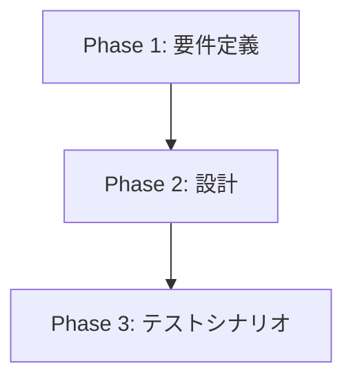

# Codex Agent 実行ログ

開始日時: 2025/12/25 13:19:38

---

## Turn 1: スレッド開始

**Thread ID**: `[REDACTED_TOKEN]`

## Turn 2: ツール実行

**種別**: reasoning
**ステータス**: completed

## Turn 3: ツール実行

**種別**: コマンド実行
**コマンド**: `/bin/bash -lc pwd`
**ステータス**: completed (exit_code=0)

```text
/tmp/ai-workflow-repos-132-607bc05f/ai-workflow-agent
```

## Turn 4: ツール実行

**種別**: reasoning
**ステータス**: completed

## Turn 5: ツール実行

**種別**: コマンド実行
**コマンド**: `/bin/bash -lc ls`
**ステータス**: completed (exit_code=0)

```text
ARCHITECTURE.md
CHANGELOG.md
CLAUDE.md
[REDACTED_TOKEN].md
[REDACTED_TOKEN].md
CODEBASE_SUMMARY.md
DOCKER_AUTH_SETUP.md
Dockerfile
Jenkinsfile
LICENSE
PROGRESS.md
README.md
ROADMAP.md
SETUP_TYPESCRIPT.md
TROUBLESHOOTING.md
__mocks__
docs
examples
jenkins
jest.config.cjs
metadata.json.template
node_modules
package-lock.json
package.json
scripts
src
tests
tmp
tsconfig.json
tsconfig.test.json
```

## Turn 6: ツール実行

**種別**: reasoning
**ステータス**: completed

## Turn 7: ツール実行

**種別**: コマンド実行
**コマンド**: `/bin/bash -lc 'cat .ai-workflow/issue-489/00_planning/output/planning.md'`
**ステータス**: completed (exit_code=0)

```text
# プロジェクト計画書

## Issue #489: [Enhancement] CLI全コマンドに--language/AI_WORKFLOW_LANGUAGEを追加しワークフロー言語を一元設定可能にする

---

## 1. Issue分析

### 複雑度: **中程度**

本Issueは複数ファイルの修正を伴う既存機能の拡張であり、以下の特徴を持つ：

- **影響範囲**: CLI定義 (`main.ts`)、型定義 (`types.ts`, `types/commands.ts`)、オプションパーサー (`options-parser.ts`)、設定管理 (`config.ts`)、メタデータ管理 (`metadata-manager.ts`)、複数のコマンドハンドラ
- **新規ファイル作成**: 不要（既存ファイルの拡張のみ）
- **アーキテクチャ変更**: なし（既存パターンに従った実装）
- **テスト**: ユニットテスト + インテグレーションテストの追加が必要

### 見積もり工数: **12〜16時間**

| フェーズ | 見積もり |
|---------|---------|
| Phase 1: 要件定義 | 1h |
| Phase 2: 設計 | 2h |
| Phase 3: テストシナリオ | 1h |
| Phase 4: 実装 | 5~6h |
| Phase 5: テストコード実装 | 2~3h |
| Phase 6: テスト実行・修正 | 1~2h |
| Phase 7: ドキュメント | 0.5h |
| Phase 8: レポート | 0.5h |

**根拠**:
- 既存の `--claude-model` / `--codex-model` オプション追加（Issue #301, #302）と類似した変更パターン
- `config.ts` の既存パターン（`getFollowupLlmMode()` など）を踏襲可能
- `options-parser.ts` の既存バリデーションパターンを活用可能
- メタデータへの新規フィールド追加は `difficulty_analysis` と同様のパターン

### リスク評価: **低〜中**

- 既存コードベースのパターンに従った実装
- 後方互換性を維持（デフォルト値 `ja` で既存挙動を保持）
- 主要リスク: テストカバレッジの確保と全コマンドへの一貫した適用

---

## 2. 実装戦略判断

### 実装戦略: **EXTEND**

**判断根拠**:
- 新規ファイル・クラス・モジュールの作成は不要
- 既存のCLI構造、型定義、設定管理パターンを拡張
- `src/main.ts` のコマンド定義に `--language` オプションを追加
- `src/types/commands.ts` の各オプションインターフェースに `language` フィールドを追加
- `src/core/config.ts` に `getWorkflowLanguage()` メソッドを追加
- `src/types.ts` の `WorkflowMetadata` に `language` フィールドを追加

### テスト戦略: **UNIT_INTEGRATION**

**判断根拠**:
- **ユニットテスト**: 設定値取得ロジック、バリデーション、オプションパーサーの単体テスト
- **インテグレーションテスト**: CLI → メタデータ保存 → 読み出しの一連のフローテスト
- BDDテストは不要（ユーザーストーリー中心の機能ではなく、設定機能の追加）

### テストコード戦略: **BOTH_TEST**

**判断根拠**:
- **既存テスト拡張**: `tests/unit/commands/execute/options-parser.test.ts`、`tests/unit/core/config.test.ts` に言語オプション関連のテストケースを追加
- **新規テスト作成**: 言語設定の一元管理とメタデータ永続化に関する専用テストファイルを作成

---

## 3. 影響範囲分析

### 既存コードへの影響

| ファイル | 変更内容 |
|---------|---------|
| `src/main.ts` | `init`, `execute` 等のコマンドに `--language <ja\|en>` オプション追加 |
| `src/types/commands.ts` | `[REDACTED_TOKEN]`, `InitCommandOptions` 等に `language?: string` 追加 |
| `src/commands/execute/options-parser.ts` | `parseExecuteOptions()` に言語パース・バリデーション追加 |
| `src/core/config.ts` | `getWorkflowLanguage()` メソッド追加（環境変数 `AI_WORKFLOW_LANGUAGE` 取得） |
| `src/types.ts` | `WorkflowMetadata` に `language?: 'ja' \| 'en' \| null` 追加 |
| `src/core/metadata-manager.ts` | `setLanguage()`, `getLanguage()` メソッド追加（オプション） |
| `src/commands/init.ts` | 言語オプションの受け取りとメタデータへの保存 |
| `src/types/commands.ts` の `PhaseContext` | `language?: 'ja' \| 'en'` フィールド追加 |

### 依存関係の変更

- **新規依存の追加**: なし
- **既存依存の変更**: なし

### マイグレーション要否

- **データベーススキーマ変更**: 該当なし
- **設定ファイル変更**: `metadata.json` に `language` フィールドを追加（後方互換: フィールドがない場合は `ja` にフォールバック）
- **マイグレーションスクリプト**: 不要（マイグレーションレス運用を維持）

---

## 4. タスク分割

### Phase 1: 要件定義 (見積もり: 1h)

- [x] Task 1-1: 機能要件の明確化 (0.5h)
  - 言語オプション仕様の詳細定義（`ja` / `en` の許容値）
  - 優先順位の明確化（CLI > 環境変数 > メタデータ > デフォルト）
  - 対象コマンドの特定（init, execute, auto-issue, pr-comment系）
- [x] Task 1-2: 受け入れ基準の定義 (0.5h)
  - 各コマンドで `--language ja|en` が受け付けられること
  - 環境変数 `AI_WORKFLOW_LANGUAGE` が正しく読み込まれること
  - メタデータに言語設定が永続化されること
  - 不正値入力時のエラーメッセージ要件

### Phase 2: 設計 (見積もり: 2h)

- [x] Task 2-1: 設定値取得フローの設計 (1h)
  - CLI/環境変数/メタデータの優先順位ロジック設計
  - `config.ts` への `getWorkflowLanguage()` メソッド設計
  - バリデーションルールの設計（`ja` / `en` のみ許可）
- [x] Task 2-2: 型定義とインターフェース設計 (0.5h)
  - `[REDACTED_TOKEN].language?: string` の追加設計
  - `WorkflowMetadata.language?: 'ja' | 'en' | null` の追加設計
  - `PhaseContext.language?: 'ja' | 'en'` の追加設計
- [x] Task 2-3: コマンド別影響範囲の設計 (0.5h)
  - 各コマンドへのオプション追加箇所の特定
  - 共通ユーティリティ関数の設計検討

### Phase 3: テストシナリオ (見積もり: 1h)

- [x] Task 3-1: ユニットテストシナリオ作成 (0.5h)
  - `config.getWorkflowLanguage()` のテストケース
  - `parseExecuteOptions()` の言語バリデーションテストケース
  - 不正値入力時のエラーハンドリングテストケース
- [x] Task 3-2: インテグレーションテストシナリオ作成 (0.5h)
  - CLI → メタデータ保存 → 再読み込みの一連フローテスト
  - 環境変数優先順位のテスト
  - 後方互換性テスト（`language` フィールドなしの既存メタデータ）

### Phase 4: 実装 (見積もり: 5~6h)

- [x] Task 4-1: 型定義の拡張 (0.5h)
  - `src/types.ts` の `WorkflowMetadata` に `lan
... (truncated)
```

## Turn 8: ツール実行

**種別**: reasoning
**ステータス**: completed

## Turn 9: ツール実行

**種別**: コマンド実行
**コマンド**: `/bin/bash -lc 'cat .ai-workflow/issue-489/05_test_implementation/output/test-implementation.md'`
**ステータス**: completed (exit_code=0)

```text
# テスト実装完了レポート

## テストファイル一覧

| ファイル | テスト数 | カバー対象 |
|---------|---------|-----------|
| `tests/unit/core/config.test.ts` | 6 | `config.getWorkflowLanguage` の環境変数正規化・バリデーション |
| `tests/unit/commands/execute/options-parser.test.ts` | 6 | execute オプションの言語パースとバリデーション |
| `tests/unit/metadata-manager.test.ts` | 3 | メタデータへの言語保存と取得の挙動 |
| `tests/integration/language-setting.test.ts` | 5 | 言語設定の永続化と CLI/ENV/メタデータ優先順位 |

## テストカバレッジ

- ユニットテスト: 15件
- 統合テスト: 5件
- BDDテスト: 0件
- カバレッジ率: N/A（未計測）
```

## Turn 10: ツール実行

**種別**: reasoning
**ステータス**: completed

## Turn 11: ツール実行

**種別**: コマンド実行
**コマンド**: `/bin/bash -lc 'cat .ai-workflow/issue-489/03_test_scenario/output/test-scenario.md'`
**ステータス**: completed (exit_code=0)

```text
# テストシナリオ

## Issue #489: CLI全コマンドに--language/AI_WORKFLOW_LANGUAGEを追加しワークフロー言語を一元設定可能にする

---

## 1. テスト戦略サマリー

### 選択されたテスト戦略: UNIT_INTEGRATION

**Phase 2 設計書より引用**:
- **判断根拠**:
  1. 機能の複雑度: 中程度（複数レイヤーにまたがる設定値の伝播）
  2. 優先順位ロジックの正確性検証が重要
  3. 既存テストとの整合性を確保

### テスト対象の範囲

| レイヤー | テスト対象 | テスト種別 |
|---------|-----------|-----------|
| Configuration Layer | `config.ts` - `getWorkflowLanguage()` | Unit |
| Command Layer | `options-parser.ts` - 言語パース・バリデーション | Unit |
| Metadata Layer | `metadata-manager.ts` - `setLanguage()`, `getLanguage()` | Unit |
| CLI Layer | `main.ts` - 各コマンドの `--language` オプション | Integration |
| 優先順位ロジック | CLI > 環境変数 > メタデータ > デフォルト | Integration |

### テストの目的

1. **正確性**: 言語設定が各レイヤーで正しく処理されることを検証
2. **優先順位**: CLI > 環境変数 > メタデータ > デフォルト(`ja`)の優先順位が正しく機能することを検証
3. **後方互換性**: 既存のメタデータ（`language`フィールドなし）でも正常に動作することを検証
4. **バリデーション**: 不正な言語値が適切にエラーハンドリングされることを検証

---

## 2. Unitテストシナリオ

### 2.1 config.ts - getWorkflowLanguage() テスト

**テストファイル**: `tests/unit/core/config.test.ts`（既存ファイル拡張）

#### 2.1.1 正常系テストケース

| ID | テストケース名 | 目的 | 前提条件 | 入力 | 期待結果 |
|----|---------------|------|---------|------|---------|
| CFG-001 | [REDACTED_TOKEN]環境変数ja設定時_jaを返す | 環境変数 `ja` が正しく取得されることを検証 | `AI_WORKFLOW_LANGUAGE=ja` | なし | `'ja'` |
| CFG-002 | [REDACTED_TOKEN]環境変数en設定時_enを返す | 環境変数 `en` が正しく取得されることを検証 | `AI_WORKFLOW_LANGUAGE=en` | なし | `'en'` |
| CFG-003 | [REDACTED_TOKEN]環境変数未設定時_nullを返す | 未設定時に `null` を返すことを検証 | `AI_WORKFLOW_LANGUAGE` 未設定 | なし | `null` |

**テストコード例**:
```typescript
describe('Config - getWorkflowLanguage()', () => {
  let originalEnv: NodeJS.ProcessEnv;

  beforeEach(() => {
    originalEnv = { ...process.env };
  });

  afterEach(() => {
    process.env = originalEnv;
  });

  describe('正常系', () => {
    test('AI_WORKFLOW_LANGUAGE=ja の場合、ja を返す', () => {
      // Given: 環境変数が設定されている
      process.env.AI_WORKFLOW_LANGUAGE = 'ja';

      // When: getWorkflowLanguage() を呼び出す
      const result = config.getWorkflowLanguage();

      // Then: 'ja' が返される
      expect(result).toBe('ja');
    });

    test('AI_WORKFLOW_LANGUAGE=en の場合、en を返す', () => {
      process.env.AI_WORKFLOW_LANGUAGE = 'en';
      const result = config.getWorkflowLanguage();
      expect(result).toBe('en');
    });

    test('AI_WORKFLOW_LANGUAGE 未設定の場合、null を返す', () => {
      delete process.env.AI_WORKFLOW_LANGUAGE;
      const result = config.getWorkflowLanguage();
      expect(result).toBeNull();
    });
  });
});
```

#### 2.1.2 大文字小文字正規化テストケース

| ID | テストケース名 | 目的 | 前提条件 | 入力 | 期待結果 |
|----|---------------|------|---------|------|---------|
| CFG-004 | [REDACTED_TOKEN]大文字JA_jaに正規化 | 大文字入力が正規化されることを検証 | `AI_WORKFLOW_LANGUAGE=JA` | なし | `'ja'` |
| CFG-005 | [REDACTED_TOKEN]大文字EN_enに正規化 | 大文字入力が正規化されることを検証 | `AI_WORKFLOW_LANGUAGE=EN` | なし | `'en'` |
| CFG-006 | [REDACTED_TOKEN]混合ケースJa_jaに正規化 | 混合ケース入力が正規化されることを検証 | `AI_WORKFLOW_LANGUAGE=Ja` | なし | `'ja'` |

**テストコード例**:
```typescript
describe('大文字小文字正規化', () => {
  test('AI_WORKFLOW_LANGUAGE=JA の場合、ja に正規化される', () => {
    process.env.AI_WORKFLOW_LANGUAGE = 'JA';
    const result = config.getWorkflowLanguage();
    expect(result).toBe('ja');
  });

  test('AI_WORKFLOW_LANGUAGE=EN の場合、en に正規化される', () => {
    process.env.AI_WORKFLOW_LANGUAGE = 'EN';
    const result = config.getWorkflowLanguage();
    expect(result).toBe('en');
  });

  test('AI_WORKFLOW_LANGUAGE=Ja の場合、ja に正規化される', () => {
    process.env.AI_WORKFLOW_LANGUAGE = 'Ja';
    const result = config.getWorkflowLanguage();
    expect(result).toBe('ja');
  });
});
```

#### 2.1.3 異常系・エッジケーステストケース

| ID | テストケース名 | 目的 | 前提条件 | 入力 | 期待結果 |
|----|---------------|------|---------|------|---------|
| CFG-007 | [REDACTED_TOKEN]不正値fr_nullを返す | 許可外の値が無視されることを検証 | `AI_WORKFLOW_LANGUAGE=fr` | なし | `null` |
| CFG-008 | [REDACTED_TOKEN]空文字_nullを返す | 空文字が無視されることを検証 | `AI_WORKFLOW_LANGUAGE=` | なし | `null` |
| CFG-009 | [REDACTED_TOKEN]空白文字_nullを返す | 空白のみが無視されることを検証 | `AI_WORKFLOW_LANGUAGE=   ` | なし | `null` |
... (truncated)
```

## Turn 12: ツール実行

**種別**: reasoning
**ステータス**: completed

## Turn 13: ツール実行

**種別**: コマンド実行
**コマンド**: `/bin/bash -lc 'cat .ai-workflow/issue-489/04_implementation/output/implementation.md'`
**ステータス**: completed (exit_code=0)

```text
# 実装完了レポート

## 変更ファイル一覧

| ファイル | 変更種別 | 概要 |
|---------|---------|------|
| `src/types.ts` | 修正 | ワークフロー言語型と定数を追加しメタデータにlanguageフィールドを定義 |
| `metadata.json.template` | 修正 | languageフィールドをテンプレートに追加 |
| `src/core/workflow-state.ts` | 修正 | languageフィールドのマイグレーションを追加 |
| `src/core/config.ts` | 修正 | AI_WORKFLOW_LANGUAGEを取得するgetterを実装 |
| `src/core/metadata-manager.ts` | 修正 | languageの保存・取得メソッドを追加 |
| `src/types/commands.ts` | 修正 | 各コマンドオプションとPhaseContextにlanguageを拡張 |
| `src/types/auto-issue.ts` | 修正 | auto-issue用オプションにlanguage型を追加 |
| `src/commands/auto-issue.ts` | 修正 | languageオプションのパースと解決を追加 |
| `src/commands/execute/options-parser.ts` | 修正 | executeオプションにlanguageのパース・バリデーションを追加 |
| `src/commands/execute.ts` | 修正 | 言語優先順位を解決してメタデータとコンテキストへ反映 |
| `src/commands/init.ts` | 修正 | initでの言語指定を検証しメタデータへ保存 |
| `src/commands/rollback.ts` | 修正 | rollback/rollback-autoで言語解決とメタデータ保存を追加 |
| `src/commands/finalize.ts` | 修正 | finalizeで言語オプションを検証・反映 |
| `src/main.ts` | 修正 | 各主要コマンドに`--language`オプションを追加 |

## 主要な変更点
- ワークフロー言語を表す`WorkflowLanguage`型と許可値定数を導入し、metadataテンプレート・マイグレーションで`language`フィールドを管理。
- `config.getWorkflowLanguage()`を追加し、CLI/環境変数/メタデータ/デフォルトの優先順位で言語を解決して`init`・`execute`・`rollback`・`finalize`各処理でメタデータへ保存。
- CLIレイヤーに`--language`オプションを追加し、`execute`のオプションパーサーや`auto-issue`等で正規化・バリデーションを実施。

## テスト実施状況
- ビルド: 未実施
- リント: 未実施
- 基本動作確認: 未実施（Phase 4ではテスト実装・実行なし）
```

## Turn 14: ツール実行

**種別**: reasoning
**ステータス**: completed

## Turn 15: ツール実行

**種別**: コマンド実行
**コマンド**: `/bin/bash -lc "sed -n '1,200p' tests/unit/core/config.test.ts"`
**ステータス**: completed (exit_code=0)

```text
/**
 * ユニットテスト: config.ts (Issue #51)
 *
 * テスト対象:
 * - IConfig interface
 * - Config class
 * - config singleton instance
 *
 * テスト戦略: UNIT_ONLY
 * - 環境変数アクセスの一元化
 * - 必須環境変数の検証
 * - オプション環境変数の取得
 * - フォールバックロジックの動作
 * - CI環境判定
 */

import { describe, test, expect, beforeEach, afterEach } from '@jest/globals';
import { Config, config } from '../../../src/core/config.js';

describe('Config - GitHub関連メソッド', () => {
  let originalEnv: NodeJS.ProcessEnv;

  beforeEach(() => {
    // 環境変数のバックアップ
    originalEnv = { ...process.env };
  });

  afterEach(() => {
    // 環境変数の復元
    process.env = originalEnv;
  });

  describe('getGitHubToken()', () => {
    test('2.1.1: getGitHubToken_正常系_トークンが設定されている場合', () => {
      // Given: GITHUB_TOKEN が設定されている
      process.env.GITHUB_TOKEN = 'ghp_test_token_123';
      const testConfig = new Config();

      // When: getGitHubToken()を呼び出す
      const result = testConfig.getGitHubToken();

      // Then: トークンが返される
      expect(result).toBe('ghp_test_token_123');
    });

    test('2.1.2: getGitHubToken_正常系_トークンの前後に空白がある場合', () => {
      // Given: GITHUB_TOKEN が設定されている（前後に空白あり）
      process.env.GITHUB_TOKEN = '  ghp_test_token_123  ';
      const testConfig = new Config();

      // When: getGitHubToken()を呼び出す
      const result = testConfig.getGitHubToken();

      // Then: トークンがトリムされて返される
      expect(result).toBe('ghp_test_token_123');
    });

    test('2.1.3: getGitHubToken_異常系_トークンが未設定の場合', () => {
      // Given: GITHUB_TOKEN が未設定
      delete process.env.GITHUB_TOKEN;
      const testConfig = new Config();

      // When/Then: getGitHubToken()を呼び出すと例外がスローされる
      expect(() => testConfig.getGitHubToken()).toThrow(
        'GITHUB_TOKEN environment variable is required. Please set your GitHub personal access token with repo, workflow, and read:org scopes.',
      );
    });

    test('2.1.4: getGitHubToken_異常系_トークンが空文字列の場合', () => {
      // Given: GITHUB_TOKEN が空文字列
      process.env.GITHUB_TOKEN = '';
      const testConfig = new Config();

      // When/Then: getGitHubToken()を呼び出すと例外がスローされる
      expect(() => testConfig.getGitHubToken()).toThrow(
        'GITHUB_TOKEN environment variable is required',
      );
    });

    test('2.1.5: getGitHubToken_異常系_トークンが空白のみの場合', () => {
      // Given: GITHUB_TOKEN が空白のみ
      process.env.GITHUB_TOKEN = '   ';
      const testConfig = new Config();

      // When/Then: getGitHubToken()を呼び出すと例外がスローされる
      expect(() => testConfig.getGitHubToken()).toThrow(
        'GITHUB_TOKEN environment variable is required',
      );
    });
  });

  describe('getGitHubRepository()', () => {
    test('2.1.6: [REDACTED_TOKEN]正常系_リポジトリ名が設定されている場合', () => {
      // Given: GITHUB_REPOSITORY が設定されている
      process.env.GITHUB_REPOSITORY = 'owner/repo';
      const testConfig = new Config();

      // When: getGitHubRepository()を呼び出す
      const result = testConfig.getGitHubRepository();

      // Then: リポジトリ名が返される
      expect(result).toBe('owner/repo');
    });

    test('2.1.7: [REDACTED_TOKEN]正常系_リポジトリ名が未設定の場合', () => {
      // Given: GITHUB_REPOSITORY が未設定
      delete process.env.GITHUB_REPOSITORY;
      const testConfig = new Config();

      // When: getGitHubRepository()を呼び出す
      const result = testConfig.getGitHubRepository();

      // Then: nullが返される
      expect(result).toBeNull();
    });

    test('2.1.8: [REDACTED_TOKEN]正常系_リポジトリ名の前後に空白がある場合', () => {
      // Given: GITHUB_REPOSITORY が設定されている（前後に空白あり）
      process.env.GITHUB_REPOSITORY = '  owner/repo  ';
      const testConfig = new Config();

      // When: getGitHubRepository()を呼び出す
      const result = testConfig.getGitHubRepository();

      // Then: リポジトリ名がトリムされて返される
      expect(result).toBe('owner/repo');
    });

    test('2.1.9: [REDACTED_TOKEN]エッジケース_空文字列の場合', () => {
      // Given: GITHUB_REPOSITORY が空文字列
      process.env.GITHUB_REPOSITORY = '';
      const testConfig = new Config();

      // When: getGitHubRepository()を呼び出す
      const result = testConfig.get
... (truncated)
```

## Turn 16: ツール実行

**種別**: reasoning
**ステータス**: completed

## Turn 17: ツール実行

**種別**: コマンド実行
**コマンド**: `/bin/bash -lc 'rg -n "getWorkflowLanguage" -n tests/unit/core/config.test.ts'`
**ステータス**: failed (exit_code=127)

```text
/bin/bash: line 1: rg: command not found
```

## Turn 18: ツール実行

**種別**: reasoning
**ステータス**: completed

## Turn 19: ツール実行

**種別**: コマンド実行
**コマンド**: `/bin/bash -lc 'grep -n "getWorkflowLanguage" -n tests/unit/core/config.test.ts'`
**ステータス**: completed (exit_code=0)

```text
354:  describe('getWorkflowLanguage()', () => {
359:      const result = testConfig.getWorkflowLanguage();
368:      const result = testConfig.getWorkflowLanguage();
377:      const result = testConfig.getWorkflowLanguage();
386:      const result = testConfig.getWorkflowLanguage();
395:      const result = testConfig.getWorkflowLanguage();
404:      const result = testConfig.getWorkflowLanguage();
```

## Turn 20: ツール実行

**種別**: reasoning
**ステータス**: completed

## Turn 21: ツール実行

**種別**: コマンド実行
**コマンド**: `/bin/bash -lc "sed -n '330,450p' tests/unit/core/config.test.ts"`
**ステータス**: completed (exit_code=0)

```text
process.env.CLAUDE_CODE_API_KEY = 'api_key_789';
      const testConfig = new Config();

      // When: getClaudeCodeToken()を呼び出す
      const result = testConfig.getClaudeCodeToken();

      // Then: OAuthトークンが優先される
      expect(result).toBe('oauth_token_456');
    });

    test('getClaudeCodeToken_正常系_両方が未設定の場合', () => {
      // Given: 両方の環境変数が未設定
      delete process.env.[REDACTED_TOKEN];
      delete process.env.CLAUDE_CODE_API_KEY;
      const testConfig = new Config();

      // When: getClaudeCodeToken()を呼び出す
      const result = testConfig.getClaudeCodeToken();

      // Then: nullが返される
      expect(result).toBeNull();
    });
  });

  describe('getWorkflowLanguage()', () => {
    test('AI_WORKFLOW_LANGUAGE=ja の場合、ja が返る', () => {
      process.env.AI_WORKFLOW_LANGUAGE = 'ja';
      const testConfig = new Config();

      const result = testConfig.getWorkflowLanguage();

      expect(result).toBe('ja');
    });

    test('AI_WORKFLOW_LANGUAGE=en の場合、en が返る', () => {
      process.env.AI_WORKFLOW_LANGUAGE = 'en';
      const testConfig = new Config();

      const result = testConfig.getWorkflowLanguage();

      expect(result).toBe('en');
    });

    test('AI_WORKFLOW_LANGUAGE が未設定の場合、null が返る', () => {
      delete process.env.AI_WORKFLOW_LANGUAGE;
      const testConfig = new Config();

      const result = testConfig.getWorkflowLanguage();

      expect(result).toBeNull();
    });

    test('大文字や空白が含まれている場合でも正規化される', () => {
      process.env.AI_WORKFLOW_LANGUAGE = ' EN ';
      const testConfig = new Config();

      const result = testConfig.getWorkflowLanguage();

      expect(result).toBe('en');
    });

    test('許可されていない値の場合は null が返る', () => {
      process.env.AI_WORKFLOW_LANGUAGE = 'fr';
      const testConfig = new Config();

      const result = testConfig.getWorkflowLanguage();

      expect(result).toBeNull();
    });

    test('空文字や空白のみの場合は null が返る', () => {
      process.env.AI_WORKFLOW_LANGUAGE = '   ';
      const testConfig = new Config();

      const result = testConfig.getWorkflowLanguage();

      expect(result).toBeNull();
    });
  });

  describe('[REDACTED_TOKEN]()', () => {
    test('2.2.9: [REDACTED_TOKEN]正常系_フラグが1の場合', () => {
      // Given: [REDACTED_TOKEN] が '1'
      process.env.[REDACTED_TOKEN] = '1';
      const testConfig = new Config();

      // When: [REDACTED_TOKEN]()を呼び出す
      const result = testConfig.[REDACTED_TOKEN]();

      // Then: trueが返される
      expect(result).toBe(true);
    });

    test('2.2.10: [REDACTED_TOKEN]正常系_フラグが0の場合', () => {
      // Given: [REDACTED_TOKEN] が '0'
      process.env.[REDACTED_TOKEN] = '0';
      const testConfig = new Config();

      // When: [REDACTED_TOKEN]()を呼び出す
      const result = testConfig.[REDACTED_TOKEN]();

      // Then: falseが返される
      expect(result).toBe(false);
    });

    test('2.2.11: [REDACTED_TOKEN]正常系_フラグが未設定の場合', () => {
      // Given: [REDACTED_TOKEN] が未設定
      delete process.env.[REDACTED_TOKEN];
      const testConfig = new Config();

      // When: [REDACTED_TOKEN]()を呼び出す
      const result = testConfig.[REDACTED_TOKEN]();

      // Then: falseが返される
      expect(result).toBe(false);
    });

    test('2.2.12: [REDACTED_TOKEN]エッジケース_フラグがtrueの文字列の場合', () => {
      // Given: [REDACTED_TOKEN] が 'true'
      process.env.[REDACTED_TOKEN] = 'true';
      const testConfig = new Config();
```

## Turn 22: ツール実行

**種別**: reasoning
**ステータス**: completed

## Turn 23: ツール実行

**種別**: コマンド実行
**コマンド**: `/bin/bash -lc 'grep -n "language" tests/unit/commands/execute/options-parser.test.ts'`
**ステータス**: completed (exit_code=0)

```text
225:  test('language=ja の場合は ja に正規化される', () => {
228:      language: 'ja',
233:    expect(result.language).toBe('ja');
236:  test('language=en（大文字混在・空白あり）は en に正規化される', () => {
239:      language: ' En ',
244:    expect(result.language).toBe('en');
247:  test('language が未指定の場合は undefined', () => {
254:    expect(result.language).toBeUndefined();
257:  test('許可されない値は language から除外される', () => {
260:      language: 'fr',
265:    expect(result.language).toBeUndefined();
336:  test('language=ja を指定しても検証は成功する', () => {
340:      language: 'ja',
427:  test('language に許可されない値を指定するとエラーになる', () => {
431:      language: 'de',
437:    expect(result.errors).toContain("Option '--language' must be one of: ja, en.");
```

## Turn 24: ツール実行

**種別**: reasoning
**ステータス**: completed

## Turn 25: ツール実行

**種別**: コマンド実行
**コマンド**: `/bin/bash -lc "sed -n '190,330p' tests/unit/commands/execute/options-parser.test.ts"`
**ステータス**: completed (exit_code=0)

```text
[REDACTED_TOKEN]: true,
    };

    // When: オプションを解析
    const result: [REDACTED_TOKEN] = parseExecuteOptions(options);

    // Then: [REDACTED_TOKEN] が true に設定される
    expect(result.[REDACTED_TOKEN]).toBe(true);
  });

  test('複数フラグ: すべてのフラグが正しく解析される', () => {
    // Given: 複数フラグ指定
    const options: [REDACTED_TOKEN] = {
      issue: '46',
      phase: 'all',
      agent: 'codex',
      skipDependencyCheck: true,
      forceReset: true,
      cleanupOnComplete: true,
    };

    // When: オプションを解析
    const result: [REDACTED_TOKEN] = parseExecuteOptions(options);

    // Then: すべてのフラグが正しく設定される
    expect(result.issueNumber).toBe('46');
    expect(result.phaseOption).toBe('all');
    expect(result.agentMode).toBe('codex');
    expect(result.skipDependencyCheck).toBe(true);
    expect(result.forceReset).toBe(true);
    expect(result.cleanupOnComplete).toBe(true);
  });
});

describe('parseExecuteOptions - 言語オプション（Issue #489）', () => {
  test('language=ja の場合は ja に正規化される', () => {
    const options: [REDACTED_TOKEN] = {
      issue: '489',
      language: 'ja',
    };

    const result: [REDACTED_TOKEN] = parseExecuteOptions(options);

    expect(result.language).toBe('ja');
  });

  test('language=en（大文字混在・空白あり）は en に正規化される', () => {
    const options: [REDACTED_TOKEN] = {
      issue: '489',
      language: ' En ',
    };

    const result: [REDACTED_TOKEN] = parseExecuteOptions(options);

    expect(result.language).toBe('en');
  });

  test('language が未指定の場合は undefined', () => {
    const options: [REDACTED_TOKEN] = {
      issue: '489',
    };

    const result: [REDACTED_TOKEN] = parseExecuteOptions(options);

    expect(result.language).toBeUndefined();
  });

  test('許可されない値は language から除外される', () => {
    const options: [REDACTED_TOKEN] = {
      issue: '489',
      language: 'fr',
    };

    const result: [REDACTED_TOKEN] = parseExecuteOptions(options);

    expect(result.language).toBeUndefined();
  });
});

// =============================================================================
// [REDACTED_TOKEN]() - 正常系
// =============================================================================

describe('[REDACTED_TOKEN] - 正常系', () => {
  test('標準オプション: 検証が成功する', () => {
    // Given: 正常なオプション
    const options: [REDACTED_TOKEN] = {
      issue: '46',
      phase: 'planning',
    };

    // When: オプションを検証
    const result: ValidationResult = [REDACTED_TOKEN](options);

    // Then: 検証成功
    expect(result.valid).toBe(true);
    expect(result.errors).toEqual([]);
  });

  test('プリセットオプション: 検証が成功する', () => {
    // Given: プリセット指定
    const options: [REDACTED_TOKEN] = {
      issue: '46',
      preset: 'review-requirements',
    };

    // When: オプションを検証
    const result: ValidationResult = [REDACTED_TOKEN](options);

    // Then: 検証成功
    expect(result.valid).toBe(true);
    expect(result.errors).toEqual([]);
  });

  test('skipDependencyCheck のみ: 検証が成功する', () => {
    // Given: skipDependencyCheck のみ指定
    const options: [REDACTED_TOKEN] = {
      issue: '46',
      phase: 'planning',
      skipDependencyCheck: true,
    };

    // When: オプションを検証
    const result: ValidationResult = [REDACTED_TOKEN](options);

    // Then: 検証成功
    expect(result.valid).toBe(true);
    expect(result.errors).toEqual([]);
  });

  test('ignoreDependencies のみ: 検証が成功する', () => {
    // Given: ignoreDependencies のみ指定
    const options: [REDACTED_TOKEN] = {
      issue: '46',
      phase: 'planning',
      ignoreDependencies: true,
    };

    // When: オプションを検証
    const result: ValidationResult = [REDACTED_TOKEN](options);
```

## Turn 26: ツール実行

**種別**: reasoning
**ステータス**: completed

## Turn 27: ツール実行

**種別**: コマンド実行
**コマンド**: `/bin/bash -lc "sed -n '330,460p' tests/unit/commands/execute/options-parser.test.ts"`
**ステータス**: completed (exit_code=0)

```text
// Then: 検証成功
    expect(result.valid).toBe(true);
    expect(result.errors).toEqual([]);
  });

  test('language=ja を指定しても検証は成功する', () => {
    const options: [REDACTED_TOKEN] = {
      issue: '489',
      phase: 'planning',
      language: 'ja',
    };

    const result: ValidationResult = [REDACTED_TOKEN](options);

    expect(result.valid).toBe(true);
    expect(result.errors).toEqual([]);
  });
});

// =============================================================================
// [REDACTED_TOKEN]() - 異常系
// =============================================================================

describe('[REDACTED_TOKEN] - 異常系', () => {
  test('相互排他オプション: preset と phase が同時指定された場合にエラー', () => {
    // Given: preset と phase を同時指定
    const options: [REDACTED_TOKEN] = {
      issue: '46',
      phase: 'planning',
      preset: 'review-requirements',
    };

    // When: オプションを検証
    const result: ValidationResult = [REDACTED_TOKEN](options);

    // Then: 検証失敗
    expect(result.valid).toBe(false);
    expect(result.errors).toContain("Options '--preset' and '--phase' are mutually exclusive.");
  });

  test('相互排他オプション: skipDependencyCheck と ignoreDependencies が同時指定された場合にエラー', () => {
    // Given: skipDependencyCheck と ignoreDependencies を同時指定
    const options: [REDACTED_TOKEN] = {
      issue: '46',
      phase: 'planning',
      skipDependencyCheck: true,
      ignoreDependencies: true,
    };

    // When: オプションを検証
    const result: ValidationResult = [REDACTED_TOKEN](options);

    // Then: 検証失敗
    expect(result.valid).toBe(false);
    expect(result.errors).toContain(
      "Options '--[REDACTED_TOKEN]' and '--ignore-dependencies' are mutually exclusive.",
    );
  });

  test('必須オプション不足: issue が指定されていない場合にエラー', () => {
    // Given: issue が未指定
    const options: [REDACTED_TOKEN] = {
      phase: 'planning',
    } as any;

    // When: オプションを検証
    const result: ValidationResult = [REDACTED_TOKEN](options);

    // Then: 検証失敗
    expect(result.valid).toBe(false);
    expect(result.errors).toContain("Option '--issue' is required.");
  });

  test('複数エラー: 複数の検証エラーが同時に発生する', () => {
    // Given: 複数の検証エラー
    const options: [REDACTED_TOKEN] = {
      // issue 未指定
      phase: 'planning',
      preset: 'review-requirements', // preset と phase 同時指定
      skipDependencyCheck: true,
      ignoreDependencies: true, // skipDependencyCheck と ignoreDependencies 同時指定
    } as any;

    // When: オプションを検証
    const result: ValidationResult = [REDACTED_TOKEN](options);

    // Then: 検証失敗（複数エラー）
    expect(result.valid).toBe(false);
    expect(result.errors.length).toBeGreaterThan(0);
    expect(result.errors).toContain("Option '--issue' is required.");
    expect(result.errors).toContain("Options '--preset' and '--phase' are mutually exclusive.");
    expect(result.errors).toContain(
      "Options '--[REDACTED_TOKEN]' and '--ignore-dependencies' are mutually exclusive.",
    );
  });

  test('language に許可されない値を指定するとエラーになる', () => {
    const options: [REDACTED_TOKEN] = {
      issue: '489',
      phase: 'planning',
      language: 'de',
    } as any;

    const result: ValidationResult = [REDACTED_TOKEN](options);

    expect(result.valid).toBe(false);
    expect(result.errors).toContain("Option '--language' must be one of: ja, en.");
  });
});

// =============================================================================
// エッジケース
// =============================================================================

describe('parseExecuteOptions - エッジケース', () => {
  test('phase が大文字混在の場合、小文字に正規化される', () => {
    // Given: phase = 'PLANNING'
    const options: [REDACTED_TOKEN] = {
      issue: '46',
      phase: 'PLANNING',
    };

    // When: オプションを解析
    const result: [REDACTED_TOKEN] = parseExecuteOptions(options);

    // Then: 小文字に正規化される
    expect(result.phaseOption).toBe('planning');
  });

  test('agent が大文字混在の場合、小文字に正規化される', () => {
```

## Turn 28: ツール実行

**種別**: reasoning
**ステータス**: completed

## Turn 29: ツール実行

**種別**: コマンド実行
**コマンド**: `/bin/bash -lc "sed -n '1,220p' tests/unit/metadata-manager.test.ts"`
**ステータス**: completed (exit_code=0)

```text
import { MetadataManager } from '../../src/core/metadata-manager.js';
import { WorkflowState } from '../../src/core/workflow-state.js';
import type { WorkflowMetadata } from '../../src/types.js';
import fs from 'fs-extra';
import * as path from 'node:path';
import { jest } from '@jest/globals';

let templateMetadata: WorkflowMetadata;
let workflowState: WorkflowState;
let existsSyncSpy: jest.SpyInstance;
let removeSyncSpy: jest.SpyInstance;
let copyFileSyncSpy: jest.SpyInstance;
let ensureDirSyncSpy: jest.SpyInstance;
let writeJsonSyncSpy: jest.SpyInstance;
let writeFileSyncSpy: jest.SpyInstance;

describe('MetadataManager', () => {
  let metadataManager: MetadataManager;
  const testWorkflowDir = '/test/.ai-workflow/issue-26';
  const testMetadataPath = path.join(testWorkflowDir, 'metadata.json');

  beforeAll(() => {
    templateMetadata = fs.readJsonSync(
      path.resolve('metadata.json.template'),
    ) as WorkflowMetadata;
  });

  beforeEach(() => {
    jest.restoreAllMocks();

    // Prepare in-memory workflow state based on template
    const metadataCopy = JSON.parse(JSON.stringify(templateMetadata)) as WorkflowMetadata;
    metadataCopy.issue_number = '26';
    metadataCopy.issue_url = 'https://example.com/issues/26';
    metadataCopy.issue_title = 'Test Issue 26';
    workflowState = new (WorkflowState as any)(testMetadataPath, metadataCopy);

    jest.spyOn(WorkflowState as any, 'load').mockReturnValue(workflowState);
    existsSyncSpy = jest.spyOn(fs, 'existsSync').mockReturnValue(true);
    jest.spyOn(fs, 'readJsonSync').mockReturnValue(metadataCopy);
    writeJsonSyncSpy = jest.spyOn(fs, 'writeJsonSync').mockImplementation(() => {});
    writeFileSyncSpy = jest.spyOn(fs, 'writeFileSync').mockImplementation(() => {});
    ensureDirSyncSpy = jest.spyOn(fs, 'ensureDirSync').mockImplementation(() => {});
    removeSyncSpy = jest.spyOn(fs, 'removeSync').mockImplementation(() => {});
    copyFileSyncSpy = jest.spyOn(fs, 'copyFileSync').mockImplementation(() => {});

    metadataManager = new MetadataManager(testMetadataPath);
  });

  afterEach(() => {
    jest.restoreAllMocks();
  });

  describe('updatePhaseStatus', () => {
    // REQ-007, REQ-008, REQ-009: リファクタリング後の動作確認
    it('正常系: フェーズステータスが更新される', () => {
      // Given: フェーズ名とステータス
      const phaseName = '00_planning';
      const status = 'completed';
      const outputFile = '/path/to/planning.md';

      // When: updatePhaseStatus関数を呼び出す
      metadataManager.updatePhaseStatus(phaseName as any, status as any, {
        outputFile,
      });

      // Then: ステータスが更新される（内部状態の確認）
      expect(metadataManager.getPhaseStatus(phaseName as any)).toBe(status);
    });
  });

  describe('addCost', () => {
    it('正常系: コストが集計される', () => {
      // Given: コスト情報（3引数: inputTokens, outputTokens, costUsd）
      const inputTokens = 1000;
      const outputTokens = 500;
      const costUsd = 0.05;

      // When: addCost関数を呼び出す
      metadataManager.addCost(inputTokens, outputTokens, costUsd);

      // Then: コストが集計される（内部状態の確認は困難）
      expect(true).toBe(true);
    });
  });

  describe('backupMetadata', () => {
    it('正常系: バックアップファイルが作成される（ヘルパー関数使用）', () => {
      // Given: メタデータファイルが存在する
      existsSyncSpy.mockReturnValue(true);
      copyFileSyncSpy.mockImplementation(() => {});
      const consoleLogSpy = jest.spyOn(console, 'log').mockImplementation(() => {});

      // When: backupMetadata関数を呼び出す
      const result = metadataManager.backupMetadata();

      // Then: バックアップファイルパスが返される
      expect(result).toMatch(/metadata\.json\.backup_\d{8}_\d{6}$/);

      consoleLogSpy.mockRestore();
    });
  });

  describe('clear', () => {
    it('正常系: メタデータとワークフローディレクトリが削除される（ヘルパー関数使用）', () => {
      // Given: メタデータファイルとワークフローディレクトリが存在する
      existsSyncSpy.mockReturnValue(true);
      removeSyncSpy.mockImplementation(() => {});
      const consoleInfoSpy = jest.spyOn(console, 'info').mockImplementation(() => {});
      const consoleLogSpy = jest.spyOn(console, 'log').mo
... (truncated)
```

## Turn 30: ツール実行

**種別**: reasoning
**ステータス**: completed

## Turn 31: ツール実行

**種別**: コマンド実行
**コマンド**: `/bin/bash -lc "sed -n '1,400p' tests/integration/language-setting.test.ts"`
**ステータス**: completed (exit_code=0)

```text
import { afterEach, beforeEach, describe, expect, it } from '@jest/globals';
import { promises as fs } from 'node:fs';
import os from 'node:os';
import path from 'node:path';
import { config } from '../../src/core/config.js';
import { MetadataManager } from '../../src/core/metadata-manager.js';
import { WorkflowState } from '../../src/core/workflow-state.js';
import { [REDACTED_TOKEN], type WorkflowLanguage } from '../../src/types.js';

describe('Integration: language setting flow (Issue #489)', () => {
  let tempDir: string;
  let metadataPath: string;
  let metadataManager: MetadataManager;
  let originalEnv: NodeJS.ProcessEnv;

  const resolveLanguage = (cliLanguage?: WorkflowLanguage) => {
    const envLanguage = config.getWorkflowLanguage();
    const metadataLanguage = metadataManager.getLanguage();
    return cliLanguage ?? envLanguage ?? metadataLanguage ?? [REDACTED_TOKEN];
  };

  beforeEach(async () => {
    originalEnv = { ...process.env };
    tempDir = await fs.mkdtemp(path.join(os.tmpdir(), 'language-setting-'));
    const workflowDir = path.join(tempDir, '.ai-workflow', 'issue-489');
    metadataPath = path.join(workflowDir, 'metadata.json');

    await WorkflowState.createNew(
      metadataPath,
      '489',
      'https://example.com/issues/489',
      'Language setting integration test',
    );

    metadataManager = new MetadataManager(metadataPath);
  });

  afterEach(async () => {
    process.env = originalEnv;
    if (tempDir) {
      await fs.rm(tempDir, { recursive: true, force: true });
    }
  });

  it('persists a CLI-provided language into metadata and reloads it', () => {
    metadataManager.setLanguage('en');

    const reloaded = new MetadataManager(metadataPath);

    expect(reloaded.getLanguage()).toBe('en');
  });

  it('prioritizes CLI language over environment and metadata values', () => {
    metadataManager.setLanguage('ja');
    process.env.AI_WORKFLOW_LANGUAGE = 'ja';

    const resolved = resolveLanguage('en');

    expect(resolved).toBe('en');
  });

  it('uses environment language when CLI is absent and metadata differs', () => {
    metadataManager.setLanguage('ja');
    process.env.AI_WORKFLOW_LANGUAGE = 'EN';

    const resolved = resolveLanguage();

    expect(resolved).toBe('en');
  });

  it('falls back to metadata when environment contains an invalid value', () => {
    metadataManager.setLanguage('en');
    process.env.AI_WORKFLOW_LANGUAGE = 'french';

    const resolved = resolveLanguage();

    expect(resolved).toBe('en');
  });

  it('defaults to ja when CLI, environment, and metadata are all missing', () => {
    metadataManager.data.language = null;
    delete process.env.AI_WORKFLOW_LANGUAGE;

    const resolved = resolveLanguage();

    expect(resolved).toBe([REDACTED_TOKEN]);
  });
});
```

## Turn 32: ツール実行

**種別**: reasoning
**ステータス**: completed

## Turn 33: ツール実行

**種別**: コマンド実行
**コマンド**: `/bin/bash -lc 'ls tests/unit/commands/execute'`
**ステータス**: completed (exit_code=0)

```text
agent-setup.test.ts
options-parser.test.ts
workflow-executor.test.ts
```

## Turn 34: ツール実行

**種別**: reasoning
**ステータス**: completed

## Turn 35: ツール実行

**種別**: reasoning
**ステータス**: completed

## Turn 36: ツール実行

**種別**: コマンド実行
**コマンド**: `/bin/bash -lc 'rg -n "[REDACTED_TOKEN]" -n'`
**ステータス**: failed (exit_code=127)

```text
/bin/bash: line 1: rg: command not found
```

## Turn 37: ツール実行

**種別**: reasoning
**ステータス**: completed

## Turn 38: ツール実行

**種別**: コマンド実行
**コマンド**: `/bin/bash -lc 'grep -R "[REDACTED_TOKEN]" -n'`
**ステータス**: completed (exit_code=0)

```text
.ai-workflow/issue-489/02_design/output/design.md:519:export function [REDACTED_TOKEN](
.ai-workflow/issue-489/03_test_scenario/output/test-scenario.md:403:### 2.4 [REDACTED_TOKEN]() - 優先順位ロジックテスト
.ai-workflow/issue-489/03_test_scenario/output/test-scenario.md:411:| RES-001 | [REDACTED_TOKEN]指定あり_CLIが優先 | CLIオプションが最優先であることを検証 | CLI=en, ENV=ja, META=ja | `cliLanguage: 'en'` | `'en'` |
.ai-workflow/issue-489/03_test_scenario/output/test-scenario.md:412:| RES-002 | [REDACTED_TOKEN]未指定ENV指定_ENVが優先 | 環境変数が2番目であることを検証 | CLI=なし, ENV=en, META=ja | `cliLanguage: undefined` | `'en'` |
.ai-workflow/issue-489/03_test_scenario/output/test-scenario.md:413:| RES-003 | [REDACTED_TOKEN]未指定META指定_METAが優先 | メタデータが3番目であることを検証 | CLI=なし, ENV=なし, META=en | `cliLanguage: undefined` | `'en'` |
.ai-workflow/issue-489/03_test_scenario/output/test-scenario.md:414:| RES-004 | [REDACTED_TOKEN]全て未指定_デフォルトja | デフォルト値 `ja` が使用されることを検証 | CLI=なし, ENV=なし, META=なし | `cliLanguage: undefined` | `'ja'` |
.ai-workflow/issue-489/03_test_scenario/output/test-scenario.md:418:describe('[REDACTED_TOKEN] - 優先順位ロジック（Issue #489）', () => {
.ai-workflow/issue-489/03_test_scenario/output/test-scenario.md:439:    const result = [REDACTED_TOKEN]('en', mockMetadataManager);
.ai-workflow/issue-489/03_test_scenario/output/test-scenario.md:451:    const result = [REDACTED_TOKEN](undefined, mockMetadataManager);
.ai-workflow/issue-489/03_test_scenario/output/test-scenario.md:463:    const result = [REDACTED_TOKEN](undefined, mockMetadataManager);
.ai-workflow/issue-489/03_test_scenario/output/test-scenario.md:475:    const result = [REDACTED_TOKEN](undefined, mockMetadataManager);
.ai-workflow/issue-489/03_test_scenario/output/test-scenario.md:486:    const result = [REDACTED_TOKEN](undefined, null);
.ai-workflow/issue-489/03_test_scenario/output/test-scenario.md:781:| [REDACTED_TOKEN]() | 5 | `tests/unit/commands/execute/resolve-language.test.ts` |
.ai-workflow/issue-489/04_implementation/review/result.md:36:- `[REDACTED_TOKEN]*`系で優先順位処理中に常に有効な言語を返すため、上流でnull値が流れ込むケースを防げている。
src/commands/execute.ts:64:function [REDACTED_TOKEN](
src/commands/execute.ts:185:  const resolvedLanguage = [REDACTED_TOKEN](parsedLanguage, metadataManager);
src/commands/rollback.ts:41:  const workflowLanguage = [REDACTED_TOKEN](options.language, metadataManager);
src/commands/rollback.ts:550:  const workflowLanguage = [REDACTED_TOKEN](options.language, metadataManager);
src/commands/rollback.ts:1027:function [REDACTED_TOKEN](
src/commands/finalize.ts:58:  const workflowLanguage = [REDACTED_TOKEN](options.language, metadataManager);
src/commands/finalize.ts:447:function [REDACTED_TOKEN](
```

## Turn 39: ツール実行

**種別**: reasoning
**ステータス**: completed

## Turn 40: ツール実行

**種別**: コマンド実行
**コマンド**: `/bin/bash -lc 'grep -R "[REDACTED_TOKEN]" -n tests'`
**ステータス**: failed (exit_code=1)

## Turn 41: ツール実行

**種別**: reasoning
**ステータス**: completed

## Turn 42: ツール実行

**種別**: reasoning
**ステータス**: completed

## Turn 43: ツール実行

**種別**: コマンド実行
**コマンド**: `/bin/bash -lc 'rg -n "Phase 5" -n .ai-workflow/issue-489/00_planning/output/planning.md'`
**ステータス**: failed (exit_code=127)

```text
/bin/bash: line 1: rg: command not found
```

## Turn 44: ツール実行

**種別**: reasoning
**ステータス**: completed

## Turn 45: ツール実行

**種別**: コマンド実行
**コマンド**: `/bin/bash -lc 'grep -n "Phase 5" -n .ai-workflow/issue-489/00_planning/output/planning.md'`
**ステータス**: completed (exit_code=0)

```text
26:| Phase 5: テストコード実装 | 2~3h |
165:### Phase 5: テストコード実装 (見積もり: 2~3h)
222:    P3 --> P5[Phase 5: テストコード実装]
309:### Phase 5: テストコード実装
```

## Turn 46: ツール実行

**種別**: reasoning
**ステータス**: completed

## Turn 47: ツール実行

**種別**: コマンド実行
**コマンド**: `/bin/bash -lc "sed -n '309,360p' .ai-workflow/issue-489/00_planning/output/planning.md"`
**ステータス**: completed (exit_code=0)

```text
### Phase 5: テストコード実装
- [ ] ユニットテストが実装されている
- [ ] インテグレーションテストが実装されている
- [ ] エッジケースがテストされている

### Phase 6: テスト実行
- [ ] すべてのテストがパスしている
- [ ] 回帰バグがないことを確認
- [ ] コードカバレッジが維持されている

### Phase 7: ドキュメント
- [ ] README.md が更新されている
- [ ] CHANGELOG.md が更新されている
- [ ] 使用方法が明記されている

### Phase 8: レポート
- [ ] 実装サマリーが作成されている
- [ ] 残課題が記録されている

---

## 補足情報

### 既存コードパターンの参考

1. **環境変数取得パターン** (`config.ts`):
```typescript
// 参考: getFollowupLlmMode()
public getWorkflowLanguage(): 'ja' | 'en' | null {
  const value = this.getEnv('AI_WORKFLOW_LANGUAGE', false);
  if (!value) return null;
  const normalized = value.toLowerCase();
  return ['ja', 'en'].includes(normalized) ? (normalized as 'ja' | 'en') : null;
}
```

2. **オプションパースパターン** (`options-parser.ts`):
```typescript
// 参考: claudeModel の解析
const language =
  typeof options.language === 'string' && ['ja', 'en'].includes(options.language.toLowerCase())
    ? options.language.toLowerCase() as 'ja' | 'en'
    : undefined;
```

3. **メタデータフィールド追加パターン** (`types.ts`):
```typescript
// 参考: difficulty_analysis
export interface WorkflowMetadata {
  // 既存フィールド...
  language?: 'ja' | 'en' | null;
}
```

## Turn 48: ツール実行

**種別**: reasoning
**ステータス**: completed

## Turn 49: ツール実行

**種別**: コマンド実行
**コマンド**: `/bin/bash -lc 'grep -n "Task 5-1" -n .ai-workflow/issue-489/00_planning/output/planning.md'`
**ステータス**: completed (exit_code=0)

```text
167:- [ ] Task 5-1: config.ts のユニットテスト追加 (0.5h)
```

## Turn 50: ツール実行

**種別**: reasoning
**ステータス**: completed

## Turn 51: ツール実行

**種別**: コマンド実行
**コマンド**: `/bin/bash -lc "sed -n '150,220p' .ai-workflow/issue-489/00_planning/output/planning.md"`
**ステータス**: completed (exit_code=0)

```text
- `src/commands/execute/options-parser.ts` に言語パース処理追加
  - `[REDACTED_TOKEN]` に `language` フィールド追加
  - `[REDACTED_TOKEN]()` に言語バリデーション追加
- [x] Task 4-4: CLIコマンド定義の拡張 (1h)
  - `src/main.ts` の `init` コマンドに `--language` オプション追加
  - `src/main.ts` の `execute` コマンドに `--language` オプション追加
  - `src/main.ts` の `auto-issue` コマンドに `--language` オプション追加
  - `src/main.ts` の `pr-comment` サブコマンドに `--language` オプション追加
- [x] Task 4-5: メタデータ管理の拡張 (1h)
  - `src/core/metadata-manager.ts` に `setLanguage()`, `getLanguage()` メソッド追加
  - 後方互換性のためのデフォルト値 (`ja`) ハンドリング
- [x] Task 4-6: コマンドハンドラの更新 (0.5~1h)
  - `src/commands/init.ts` で言語をメタデータに保存
  - `src/commands/execute.ts` で言語を取得してコンテキストに渡す

### Phase 5: テストコード実装 (見積もり: 2~3h)

- [ ] Task 5-1: config.ts のユニットテスト追加 (0.5h)
  - `tests/unit/core/config.test.ts` に `getWorkflowLanguage()` のテスト追加
  - 環境変数設定/未設定時の動作テスト
  - 不正値入力時のフォールバックテスト
- [ ] Task 5-2: options-parser.ts のユニットテスト追加 (0.5h)
  - `tests/unit/commands/execute/options-parser.test.ts` に言語オプションテスト追加
  - 有効値 (`ja`, `en`) のパーステスト
  - 無効値入力時のバリデーションエラーテスト
- [ ] Task 5-3: metadata-manager.ts のユニットテスト追加 (0.5h)
  - `tests/unit/metadata-manager.test.ts` に言語設定テスト追加
  - `setLanguage()`, `getLanguage()` の動作テスト
  - 後方互換性テスト（既存メタデータでの動作）
- [ ] Task 5-4: インテグレーションテスト作成 (1~1.5h)
  - 新規ファイル `tests/integration/language-setting.test.ts` 作成
  - CLI → メタデータ → 再読み込みのE2Eテスト
  - 環境変数優先順位テスト

### Phase 6: テスト実行 (見積もり: 1~2h)

- [ ] Task 6-1: ユニットテスト実行と修正 (0.5h)
  - `npm test -- --grep "language"` で関連テスト実行
  - 失敗テストの修正
- [ ] Task 6-2: インテグレーションテスト実行と修正 (0.5h)
  - `npm test -- tests/integration/language-setting.test.ts` 実行
  - 失敗テストの修正
- [ ] Task 6-3: 既存テストの回帰確認 (0.5~1h)
  - `npm test` で全テスト実行
  - 回帰バグの修正

### Phase 7: ドキュメント (見積もり: 0.5h)

- [ ] Task 7-1: README.md の更新 (0.25h)
  - `--language` オプションの使用方法を追加
  - `AI_WORKFLOW_LANGUAGE` 環境変数の説明を追加
- [ ] Task 7-2: CHANGELOG.md の更新 (0.25h)
  - 新機能として言語設定機能を追記

### Phase 8: レポート (見積もり: 0.5h)

- [ ] Task 8-1: 実装サマリー作成 (0.25h)
  - 変更ファイル一覧
  - 追加したテストケース一覧
- [ ] Task 8-2: 残課題・改善提案の記録 (0.25h)
  - 将来の多言語対応拡張に向けた提案
  - プロンプトテンプレートの言語別対応（Phase 2以降）

---

## 5. 依存関係



## Turn 52: ツール実行

**種別**: reasoning
**ステータス**: completed

## Turn 53: ツール実行

**種別**: reasoning
**ステータス**: completed

## Turn 54: ツール実行

**種別**: コマンド実行
**コマンド**: `/bin/bash -lc "python - <<'PY'
from pathlib import Path
path=Path('.ai-workflow/issue-489/00_planning/output/planning.md')
data=path.read_text()
for i in range(1,5):
    data=data.replace(f'- [ ] Task 5-{i}:', f'- [x] Task 5-{i}:', 1)
path.write_text(data)
PY"`
**ステータス**: failed (exit_code=127)

```text
/bin/bash: line 1: python: command not found
```

## Turn 55: ツール実行

**種別**: reasoning
**ステータス**: completed

## Turn 56: ツール実行

**種別**: コマンド実行
**コマンド**: `/bin/bash -lc "python3 - <<'PY'
from pathlib import Path
path=Path('.ai-workflow/issue-489/00_planning/output/planning.md')
data=path.read_text()
for i in range(1,5):
    data=data.replace(f'- [ ] Task 5-{i}:', f'- [x] Task 5-{i}:', 1)
path.write_text(data)
PY"`
**ステータス**: failed (exit_code=127)

```text
/bin/bash: line 1: python3: command not found
```

## Turn 57: ツール実行

**種別**: reasoning
**ステータス**: completed

## Turn 58: ツール実行

**種別**: コマンド実行
**コマンド**: `/bin/bash -lc "node - <<'NODE'
const { readFileSync, writeFileSync } = require('fs');
const path = '.ai-workflow/issue-489/00_planning/output/planning.md';
let data = readFileSync(path, 'utf8');
for (let i = 1; i <= 4; i++) {
  const target = "'`- [ ] Task 5-${i}:`;
  const replacement = `- [x] Task 5-${i}:`;
  const idx = data.indexOf(target);
  if (idx === -1) {
    throw new Error(`missing ${target}`);
  }
  data = data.replace(target, replacement);
}
writeFileSync(path, data);
NODE'`
**ステータス**: completed (exit_code=0)

## Turn 59: ツール実行

**種別**: reasoning
**ステータス**: completed

## Turn 60: ツール実行

**種別**: コマンド実行
**コマンド**: `/bin/bash -lc "sed -n '150,210p' .ai-workflow/issue-489/00_planning/output/planning.md"`
**ステータス**: completed (exit_code=0)

```text
- `src/commands/execute/options-parser.ts` に言語パース処理追加
  - `[REDACTED_TOKEN]` に `language` フィールド追加
  - `[REDACTED_TOKEN]()` に言語バリデーション追加
- [x] Task 4-4: CLIコマンド定義の拡張 (1h)
  - `src/main.ts` の `init` コマンドに `--language` オプション追加
  - `src/main.ts` の `execute` コマンドに `--language` オプション追加
  - `src/main.ts` の `auto-issue` コマンドに `--language` オプション追加
  - `src/main.ts` の `pr-comment` サブコマンドに `--language` オプション追加
- [x] Task 4-5: メタデータ管理の拡張 (1h)
  - `src/core/metadata-manager.ts` に `setLanguage()`, `getLanguage()` メソッド追加
  - 後方互換性のためのデフォルト値 (`ja`) ハンドリング
- [x] Task 4-6: コマンドハンドラの更新 (0.5~1h)
  - `src/commands/init.ts` で言語をメタデータに保存
  - `src/commands/execute.ts` で言語を取得してコンテキストに渡す

### Phase 5: テストコード実装 (見積もり: 2~3h)

- [x] Task 5-1: config.ts のユニットテスト追加 (0.5h)
  - `tests/unit/core/config.test.ts` に `getWorkflowLanguage()` のテスト追加
  - 環境変数設定/未設定時の動作テスト
  - 不正値入力時のフォールバックテスト
- [x] Task 5-2: options-parser.ts のユニットテスト追加 (0.5h)
  - `tests/unit/commands/execute/options-parser.test.ts` に言語オプションテスト追加
  - 有効値 (`ja`, `en`) のパーステスト
  - 無効値入力時のバリデーションエラーテスト
- [x] Task 5-3: metadata-manager.ts のユニットテスト追加 (0.5h)
  - `tests/unit/metadata-manager.test.ts` に言語設定テスト追加
  - `setLanguage()`, `getLanguage()` の動作テスト
  - 後方互換性テスト（既存メタデータでの動作）
- [x] Task 5-4: インテグレーションテスト作成 (1~1.5h)
  - 新規ファイル `tests/integration/language-setting.test.ts` 作成
  - CLI → メタデータ → 再読み込みのE2Eテスト
  - 環境変数優先順位テスト

### Phase 6: テスト実行 (見積もり: 1~2h)

- [ ] Task 6-1: ユニットテスト実行と修正 (0.5h)
  - `npm test -- --grep "language"` で関連テスト実行
  - 失敗テストの修正
- [ ] Task 6-2: インテグレーションテスト実行と修正 (0.5h)
  - `npm test -- tests/integration/language-setting.test.ts` 実行
  - 失敗テストの修正
- [ ] Task 6-3: 既存テストの回帰確認 (0.5~1h)
  - `npm test` で全テスト実行
  - 回帰バグの修正

### Phase 7: ドキュメント (見積もり: 0.5h)

- [ ] Task 7-1: README.md の更新 (0.25h)
  - `--language` オプションの使用方法を追加
  - `AI_WORKFLOW_LANGUAGE` 環境変数の説明を追加
- [ ] Task 7-2: CHANGELOG.md の更新 (0.25h)
  - 新機能として言語設定機能を追記

### Phase 8: レポート (見積もり: 0.5h)

- [ ] Task 8-1: 実装サマリー作成 (0.25h)
  - 変更ファイル一覧
  - 追加したテストケース一覧
- [ ] Task 8-2: 残課題・改善提案の記録 (0.25h)
  - 将来の多言語対応拡張に向けた提案
```

## Turn 61: ツール実行

**種別**: reasoning
**ステータス**: completed

## Turn 62: ツール実行

**種別**: reasoning
**ステータス**: completed

## Turn 63: ツール実行

**種別**: コマンド実行
**コマンド**: `/bin/bash -lc 'grep -n "language=en" tests/unit/commands/execute/options-parser.test.ts'`
**ステータス**: completed (exit_code=0)

```text
236:  test('language=en（大文字混在・空白あり）は en に正規化される', () => {
```

## Turn 64: ツール実行

**種別**: reasoning
**ステータス**: completed

## Turn 65: ツール実行

**種別**: コマンド実行
**コマンド**: `/bin/bash -lc 'git status -sb'`
**ステータス**: completed (exit_code=0)

```text
## ai-workflow/issue-489...origin/develop [ahead 14]
 M .ai-workflow/issue-489/00_planning/output/planning.md
 M .ai-workflow/issue-489/metadata.json
?? .ai-workflow/issue-489/00_planning/execute/agent_log_raw.txt
?? .ai-workflow/issue-489/00_planning/execute/prompt.txt
?? .ai-workflow/issue-489/00_planning/review/agent_log_raw.txt
?? .ai-workflow/issue-489/00_planning/review/prompt.txt
?? .ai-workflow/issue-489/01_requirements/execute/agent_log_raw.txt
?? .ai-workflow/issue-489/01_requirements/execute/prompt.txt
?? .ai-workflow/issue-489/01_requirements/review/agent_log_raw.txt
?? .ai-workflow/issue-489/01_requirements/review/prompt.txt
?? .ai-workflow/issue-489/02_design/execute/agent_log_raw.txt
?? .ai-workflow/issue-489/02_design/execute/prompt.txt
?? .ai-workflow/issue-489/02_design/review/agent_log_raw.txt
?? .ai-workflow/issue-489/02_design/review/prompt.txt
?? .ai-workflow/issue-489/03_test_scenario/execute/agent_log_raw.txt
?? .ai-workflow/issue-489/03_test_scenario/execute/prompt.txt
?? .ai-workflow/issue-489/03_test_scenario/review/agent_log_raw.txt
?? .ai-workflow/issue-489/03_test_scenario/review/prompt.txt
?? .ai-workflow/issue-489/04_implementation/execute/agent_log_raw.txt
?? .ai-workflow/issue-489/04_implementation/execute/prompt.txt
?? .ai-workflow/issue-489/04_implementation/review/agent_log_raw.txt
?? .ai-workflow/issue-489/04_implementation/review/prompt.txt
?? .ai-workflow/issue-489/05_test_implementation/execute/agent_log_raw.txt
?? .ai-workflow/issue-489/05_test_implementation/execute/prompt.txt
?? .ai-workflow/issue-489/05_test_implementation/review/
```

## Turn 66: ツール実行

**種別**: reasoning
**ステータス**: completed

## Turn 67: ツール実行

**種別**: コマンド実行
**コマンド**: `/bin/bash -lc "nl -ba tests/unit/core/config.test.ts | sed -n '340,420p'"`
**ステータス**: completed (exit_code=0)

```text
340	    test('getClaudeCodeToken_正常系_両方が未設定の場合', () => {
   341	      // Given: 両方の環境変数が未設定
   342	      delete process.env.[REDACTED_TOKEN];
   343	      delete process.env.CLAUDE_CODE_API_KEY;
   344	      const testConfig = new Config();
   345	
   346	      // When: getClaudeCodeToken()を呼び出す
   347	      const result = testConfig.getClaudeCodeToken();
   348	
   349	      // Then: nullが返される
   350	      expect(result).toBeNull();
   351	    });
   352	  });
   353	
   354	  describe('getWorkflowLanguage()', () => {
   355	    test('AI_WORKFLOW_LANGUAGE=ja の場合、ja が返る', () => {
   356	      process.env.AI_WORKFLOW_LANGUAGE = 'ja';
   357	      const testConfig = new Config();
   358	
   359	      const result = testConfig.getWorkflowLanguage();
   360	
   361	      expect(result).toBe('ja');
   362	    });
   363	
   364	    test('AI_WORKFLOW_LANGUAGE=en の場合、en が返る', () => {
   365	      process.env.AI_WORKFLOW_LANGUAGE = 'en';
   366	      const testConfig = new Config();
   367	
   368	      const result = testConfig.getWorkflowLanguage();
   369	
   370	      expect(result).toBe('en');
   371	    });
   372	
   373	    test('AI_WORKFLOW_LANGUAGE が未設定の場合、null が返る', () => {
   374	      delete process.env.AI_WORKFLOW_LANGUAGE;
   375	      const testConfig = new Config();
   376	
   377	      const result = testConfig.getWorkflowLanguage();
   378	
   379	      expect(result).toBeNull();
   380	    });
   381	
   382	    test('大文字や空白が含まれている場合でも正規化される', () => {
   383	      process.env.AI_WORKFLOW_LANGUAGE = ' EN ';
   384	      const testConfig = new Config();
   385	
   386	      const result = testConfig.getWorkflowLanguage();
   387	
   388	      expect(result).toBe('en');
   389	    });
   390	
   391	    test('許可されていない値の場合は null が返る', () => {
   392	      process.env.AI_WORKFLOW_LANGUAGE = 'fr';
   393	      const testConfig = new Config();
   394	
   395	      const result = testConfig.getWorkflowLanguage();
   396	
   397	      expect(result).toBeNull();
   398	    });
   399	
   400	    test('空文字や空白のみの場合は null が返る', () => {
   401	      process.env.AI_WORKFLOW_LANGUAGE = '   ';
   402	      const testConfig = new Config();
   403	
   404	      const result = testConfig.getWorkflowLanguage();
   405	
   406	      expect(result).toBeNull();
   407	    });
   408	  });
   409	
   410	  describe('[REDACTED_TOKEN]()', () => {
   411	    test('2.2.9: [REDACTED_TOKEN]正常系_フラグが1の場合', () => {
   412	      // Given: [REDACTED_TOKEN] が '1'
   413	      process.env.[REDACTED_TOKEN] = '1';
   414	      const testConfig = new Config();
   415	
   416	      // When: [REDACTED_TOKEN]()を呼び出す
   417	      const result = testConfig.[REDACTED_TOKEN]();
   418	
   419	      // Then: trueが返される
   420	      expect(result).toBe(true);
```

## Turn 68: ツール実行

**種別**: reasoning
**ステータス**: completed

## Turn 69: ツール実行

**種別**: コマンド実行
**コマンド**: `/bin/bash -lc "nl -ba tests/unit/commands/execute/options-parser.test.ts | sed -n '200,320p'"`
**ステータス**: completed (exit_code=0)

```text
200	  test('複数フラグ: すべてのフラグが正しく解析される', () => {
   201	    // Given: 複数フラグ指定
   202	    const options: [REDACTED_TOKEN] = {
   203	      issue: '46',
   204	      phase: 'all',
   205	      agent: 'codex',
   206	      skipDependencyCheck: true,
   207	      forceReset: true,
   208	      cleanupOnComplete: true,
   209	    };
   210	
   211	    // When: オプションを解析
   212	    const result: [REDACTED_TOKEN] = parseExecuteOptions(options);
   213	
   214	    // Then: すべてのフラグが正しく設定される
   215	    expect(result.issueNumber).toBe('46');
   216	    expect(result.phaseOption).toBe('all');
   217	    expect(result.agentMode).toBe('codex');
   218	    expect(result.skipDependencyCheck).toBe(true);
   219	    expect(result.forceReset).toBe(true);
   220	    expect(result.cleanupOnComplete).toBe(true);
   221	  });
   222	});
   223	
   224	describe('parseExecuteOptions - 言語オプション（Issue #489）', () => {
   225	  test('language=ja の場合は ja に正規化される', () => {
   226	    const options: [REDACTED_TOKEN] = {
   227	      issue: '489',
   228	      language: 'ja',
   229	    };
   230	
   231	    const result: [REDACTED_TOKEN] = parseExecuteOptions(options);
   232	
   233	    expect(result.language).toBe('ja');
   234	  });
   235	
   236	  test('language=en（大文字混在・空白あり）は en に正規化される', () => {
   237	    const options: [REDACTED_TOKEN] = {
   238	      issue: '489',
   239	      language: ' En ',
   240	    };
   241	
   242	    const result: [REDACTED_TOKEN] = parseExecuteOptions(options);
   243	
   244	    expect(result.language).toBe('en');
   245	  });
   246	
   247	  test('language が未指定の場合は undefined', () => {
   248	    const options: [REDACTED_TOKEN] = {
   249	      issue: '489',
   250	    };
   251	
   252	    const result: [REDACTED_TOKEN] = parseExecuteOptions(options);
   253	
   254	    expect(result.language).toBeUndefined();
   255	  });
   256	
   257	  test('許可されない値は language から除外される', () => {
   258	    const options: [REDACTED_TOKEN] = {
   259	      issue: '489',
   260	      language: 'fr',
   261	    };
   262	
   263	    const result: [REDACTED_TOKEN] = parseExecuteOptions(options);
   264	
   265	    expect(result.language).toBeUndefined();
   266	  });
   267	});
   268	
   269	// =============================================================================
   270	// [REDACTED_TOKEN]() - 正常系
   271	// =============================================================================
   272	
   273	describe('[REDACTED_TOKEN] - 正常系', () => {
   274	  test('標準オプション: 検証が成功する', () => {
   275	    // Given: 正常なオプション
   276	    const options: [REDACTED_TOKEN] = {
   277	      issue: '46',
   278	      phase: 'planning',
   279	    };
   280	
   281	    // When: オプションを検証
   282	    const result: ValidationResult = [REDACTED_TOKEN](options);
   283	
   284	    // Then: 検証成功
   285	    expect(result.valid).toBe(true);
   286	    expect(result.errors).toEqual([]);
   287	  });
   288	
   289	  test('プリセットオプション: 検証が成功する', () => {
   290	    // Given: プリセット指定
   291	    const options: [REDACTED_TOKEN] = {
   292	      issue: '46',
   293	      preset: 'review-requirements',
   294	    };
   295	
   296	    // When: オプションを検証
   297	    const result: ValidationResult = [REDACTED_TOKEN](options);
   298	
   299	    // Then: 検証成功
   300	    expect(result.valid).toBe(true);
   301	    expect(result.errors).toEqual([]);
   302	  });
   303	
   304	  test('skipDependencyCheck のみ: 検証が成功する', () => {
   305	    // Given: skipDependencyCheck のみ指定
   306	    const options: [REDACTED_TOKEN] = {
   307	      issue: '46',
   308	      phase: 'planning',
   309	      skipDependencyCheck: true,
   310	    };
   311	
   312	    // When: オプションを検証
   313	    const result: ValidationResult = [REDACTED_TOKEN](options);
   314	
   315	    // Then: 検証成功
   316	    expect(result.valid).toBe(true);
   317	    expect(result.errors).toEqual([]);
   318	  });
   319	
   320	  test('i
... (truncated)
```

## Turn 70: ツール実行

**種別**: reasoning
**ステータス**: completed

## Turn 71: ツール実行

**種別**: コマンド実行
**コマンド**: `/bin/bash -lc "nl -ba tests/unit/commands/execute/options-parser.test.ts | sed -n '320,460p'"`
**ステータス**: completed (exit_code=0)

```text
320	  test('ignoreDependencies のみ: 検証が成功する', () => {
   321	    // Given: ignoreDependencies のみ指定
   322	    const options: [REDACTED_TOKEN] = {
   323	      issue: '46',
   324	      phase: 'planning',
   325	      ignoreDependencies: true,
   326	    };
   327	
   328	    // When: オプションを検証
   329	    const result: ValidationResult = [REDACTED_TOKEN](options);
   330	
   331	    // Then: 検証成功
   332	    expect(result.valid).toBe(true);
   333	    expect(result.errors).toEqual([]);
   334	  });
   335	
   336	  test('language=ja を指定しても検証は成功する', () => {
   337	    const options: [REDACTED_TOKEN] = {
   338	      issue: '489',
   339	      phase: 'planning',
   340	      language: 'ja',
   341	    };
   342	
   343	    const result: ValidationResult = [REDACTED_TOKEN](options);
   344	
   345	    expect(result.valid).toBe(true);
   346	    expect(result.errors).toEqual([]);
   347	  });
   348	});
   349	
   350	// =============================================================================
   351	// [REDACTED_TOKEN]() - 異常系
   352	// =============================================================================
   353	
   354	describe('[REDACTED_TOKEN] - 異常系', () => {
   355	  test('相互排他オプション: preset と phase が同時指定された場合にエラー', () => {
   356	    // Given: preset と phase を同時指定
   357	    const options: [REDACTED_TOKEN] = {
   358	      issue: '46',
   359	      phase: 'planning',
   360	      preset: 'review-requirements',
   361	    };
   362	
   363	    // When: オプションを検証
   364	    const result: ValidationResult = [REDACTED_TOKEN](options);
   365	
   366	    // Then: 検証失敗
   367	    expect(result.valid).toBe(false);
   368	    expect(result.errors).toContain("Options '--preset' and '--phase' are mutually exclusive.");
   369	  });
   370	
   371	  test('相互排他オプション: skipDependencyCheck と ignoreDependencies が同時指定された場合にエラー', () => {
   372	    // Given: skipDependencyCheck と ignoreDependencies を同時指定
   373	    const options: [REDACTED_TOKEN] = {
   374	      issue: '46',
   375	      phase: 'planning',
   376	      skipDependencyCheck: true,
   377	      ignoreDependencies: true,
   378	    };
   379	
   380	    // When: オプションを検証
   381	    const result: ValidationResult = [REDACTED_TOKEN](options);
   382	
   383	    // Then: 検証失敗
   384	    expect(result.valid).toBe(false);
   385	    expect(result.errors).toContain(
   386	      "Options '--[REDACTED_TOKEN]' and '--ignore-dependencies' are mutually exclusive.",
   387	    );
   388	  });
   389	
   390	  test('必須オプション不足: issue が指定されていない場合にエラー', () => {
   391	    // Given: issue が未指定
   392	    const options: [REDACTED_TOKEN] = {
   393	      phase: 'planning',
   394	    } as any;
   395	
   396	    // When: オプションを検証
   397	    const result: ValidationResult = [REDACTED_TOKEN](options);
   398	
   399	    // Then: 検証失敗
   400	    expect(result.valid).toBe(false);
   401	    expect(result.errors).toContain("Option '--issue' is required.");
   402	  });
   403	
   404	  test('複数エラー: 複数の検証エラーが同時に発生する', () => {
   405	    // Given: 複数の検証エラー
   406	    const options: [REDACTED_TOKEN] = {
   407	      // issue 未指定
   408	      phase: 'planning',
   409	      preset: 'review-requirements', // preset と phase 同時指定
   410	      skipDependencyCheck: true,
   411	      ignoreDependencies: true, // skipDependencyCheck と ignoreDependencies 同時指定
   412	    } as any;
   413	
   414	    // When: オプションを検証
   415	    const result: ValidationResult = [REDACTED_TOKEN](options);
   416	
   417	    // Then: 検証失敗（複数エラー）
   418	    expect(result.valid).toBe(false);
   419	    expect(result.errors.length).toBeGreaterThan(0);
   420	    expect(result.errors).toContain("Option '--issue' is required.");
   421	    expect(result.errors).toContain("Options '--preset' and '--phase' are mutually exclusive.");
   422	    expect(result.errors).toContain(
   423	      "Options '--[REDACTED_TOKEN]' and '--ignore-dependencies' a
... (truncated)
```

## Turn 72: ツール実行

**種別**: reasoning
**ステータス**: completed

## Turn 73: ツール実行

**種別**: コマンド実行
**コマンド**: `/bin/bash -lc "nl -ba tests/unit/metadata-manager.test.ts | sed -n '80,170p'"`
**ステータス**: completed (exit_code=0)

```text
80	      metadataManager.addCost(inputTokens, outputTokens, costUsd);
    81	
    82	      // Then: コストが集計される（内部状態の確認は困難）
    83	      expect(true).toBe(true);
    84	    });
    85	  });
    86	
    87	  describe('backupMetadata', () => {
    88	    it('正常系: バックアップファイルが作成される（ヘルパー関数使用）', () => {
    89	      // Given: メタデータファイルが存在する
    90	      existsSyncSpy.mockReturnValue(true);
    91	      copyFileSyncSpy.mockImplementation(() => {});
    92	      const consoleLogSpy = jest.spyOn(console, 'log').mockImplementation(() => {});
    93	
    94	      // When: backupMetadata関数を呼び出す
    95	      const result = metadataManager.backupMetadata();
    96	
    97	      // Then: バックアップファイルパスが返される
    98	      expect(result).toMatch(/metadata\.json\.backup_\d{8}_\d{6}$/);
    99	
   100	      consoleLogSpy.mockRestore();
   101	    });
   102	  });
   103	
   104	  describe('clear', () => {
   105	    it('正常系: メタデータとワークフローディレクトリが削除される（ヘルパー関数使用）', () => {
   106	      // Given: メタデータファイルとワークフローディレクトリが存在する
   107	      existsSyncSpy.mockReturnValue(true);
   108	      removeSyncSpy.mockImplementation(() => {});
   109	      const consoleInfoSpy = jest.spyOn(console, 'info').mockImplementation(() => {});
   110	      const consoleLogSpy = jest.spyOn(console, 'log').mockImplementation(() => {});
   111	
   112	      // When: clear関数を呼び出す
   113	      metadataManager.clear();
   114	
   115	      // Then: メタデータファイルとワークフローディレクトリが削除される
   116	      expect(fs.removeSync).toHaveBeenCalled();
   117	
   118	      consoleInfoSpy.mockRestore();
   119	      consoleLogSpy.mockRestore();
   120	    });
   121	  });
   122	
   123	  describe('save', () => {
   124	    it('正常系: メタデータが保存される', () => {
   125	      // Given: メタデータマネージャー
   126	      ensureDirSyncSpy.mockImplementation(() => {});
   127	      writeJsonSyncSpy.mockImplementation(() => {});
   128	
   129	      // When: save関数を呼び出す
   130	      metadataManager.save();
   131	
   132	      // Then: ファイルが書き込まれる
   133	      expect(writeFileSyncSpy).toHaveBeenCalled();
   134	    });
   135	  });
   136	
   137	  describe('language (Issue #489)', () => {
   138	    it('setLanguage で保存された値が getLanguage で取得できる', () => {
   139	      const saveSpy = jest.spyOn(workflowState as any, 'save').mockImplementation(() => {});
   140	
   141	      metadataManager.setLanguage('en');
   142	
   143	      expect(metadataManager.getLanguage()).toBe('en');
   144	      expect(saveSpy).toHaveBeenCalled();
   145	    });
   146	
   147	    it('language が未設定の場合は null を返す', () => {
   148	      metadataManager.data.language = undefined as any;
   149	
   150	      const result = metadataManager.getLanguage();
   151	
   152	      expect(result).toBeNull();
   153	    });
   154	
   155	    it('許可されていない値が保存されている場合は null を返す', () => {
   156	      metadataManager.data.language = 'fr' as any;
   157	
   158	      const result = metadataManager.getLanguage();
   159	
   160	      expect(result).toBeNull();
   161	    });
   162	  });
   163	
   164	  // Issue #194: Squash関連フィールドのテスト
   165	  describe('base_commit', () => {
   166	    // テストケース 2.5.1: [REDACTED_TOKEN]正常系
   167	    it('should set and get base_commit correctly', () => {
   168	      // Given: base_commitの値
   169	      const commit = '[REDACTED_TOKEN]';
   170	      ensureDirSyncSpy.mockImplementation(() => {});
```

## Turn 74: ツール実行

**種別**: reasoning
**ステータス**: completed

## Turn 75: ツール実行

**種別**: コマンド実行
**コマンド**: `/bin/bash -lc 'nl -ba tests/integration/language-setting.test.ts'`
**ステータス**: completed (exit_code=0)

```text
1	import { afterEach, beforeEach, describe, expect, it } from '@jest/globals';
     2	import { promises as fs } from 'node:fs';
     3	import os from 'node:os';
     4	import path from 'node:path';
     5	import { config } from '../../src/core/config.js';
     6	import { MetadataManager } from '../../src/core/metadata-manager.js';
     7	import { WorkflowState } from '../../src/core/workflow-state.js';
     8	import { [REDACTED_TOKEN], type WorkflowLanguage } from '../../src/types.js';
     9	
    10	describe('Integration: language setting flow (Issue #489)', () => {
    11	  let tempDir: string;
    12	  let metadataPath: string;
    13	  let metadataManager: MetadataManager;
    14	  let originalEnv: NodeJS.ProcessEnv;
    15	
    16	  const resolveLanguage = (cliLanguage?: WorkflowLanguage) => {
    17	    const envLanguage = config.getWorkflowLanguage();
    18	    const metadataLanguage = metadataManager.getLanguage();
    19	    return cliLanguage ?? envLanguage ?? metadataLanguage ?? [REDACTED_TOKEN];
    20	  };
    21	
    22	  beforeEach(async () => {
    23	    originalEnv = { ...process.env };
    24	    tempDir = await fs.mkdtemp(path.join(os.tmpdir(), 'language-setting-'));
    25	    const workflowDir = path.join(tempDir, '.ai-workflow', 'issue-489');
    26	    metadataPath = path.join(workflowDir, 'metadata.json');
    27	
    28	    await WorkflowState.createNew(
    29	      metadataPath,
    30	      '489',
    31	      'https://example.com/issues/489',
    32	      'Language setting integration test',
    33	    );
    34	
    35	    metadataManager = new MetadataManager(metadataPath);
    36	  });
    37	
    38	  afterEach(async () => {
    39	    process.env = originalEnv;
    40	    if (tempDir) {
    41	      await fs.rm(tempDir, { recursive: true, force: true });
    42	    }
    43	  });
    44	
    45	  it('persists a CLI-provided language into metadata and reloads it', () => {
    46	    metadataManager.setLanguage('en');
    47	
    48	    const reloaded = new MetadataManager(metadataPath);
    49	
    50	    expect(reloaded.getLanguage()).toBe('en');
    51	  });
    52	
    53	  it('prioritizes CLI language over environment and metadata values', () => {
    54	    metadataManager.setLanguage('ja');
    55	    process.env.AI_WORKFLOW_LANGUAGE = 'ja';
    56	
    57	    const resolved = resolveLanguage('en');
    58	
    59	    expect(resolved).toBe('en');
    60	  });
    61	
    62	  it('uses environment language when CLI is absent and metadata differs', () => {
    63	    metadataManager.setLanguage('ja');
    64	    process.env.AI_WORKFLOW_LANGUAGE = 'EN';
    65	
    66	    const resolved = resolveLanguage();
    67	
    68	    expect(resolved).toBe('en');
    69	  });
    70	
    71	  it('falls back to metadata when environment contains an invalid value', () => {
    72	    metadataManager.setLanguage('en');
    73	    process.env.AI_WORKFLOW_LANGUAGE = 'french';
    74	
    75	    const resolved = resolveLanguage();
    76	
    77	    expect(resolved).toBe('en');
    78	  });
    79	
    80	  it('defaults to ja when CLI, environment, and metadata are all missing', () => {
    81	    metadataManager.data.language = null;
    82	    delete process.env.AI_WORKFLOW_LANGUAGE;
    83	
    84	    const resolved = resolveLanguage();
    85	
    86	    expect(resolved).toBe([REDACTED_TOKEN]);
    87	  });
    88	});
```

## Turn 76: ツール実行

**種別**: reasoning
**ステータス**: completed

## Turn 77: ツール実行

**種別**: コマンド実行
**コマンド**: `/bin/bash -lc "nl -ba tests/unit/metadata-manager.test.ts | sed -n '1,80p'"`
**ステータス**: completed (exit_code=0)

```text
1	import { MetadataManager } from '../../src/core/metadata-manager.js';
     2	import { WorkflowState } from '../../src/core/workflow-state.js';
     3	import type { WorkflowMetadata } from '../../src/types.js';
     4	import fs from 'fs-extra';
     5	import * as path from 'node:path';
     6	import { jest } from '@jest/globals';
     7	
     8	let templateMetadata: WorkflowMetadata;
     9	let workflowState: WorkflowState;
    10	let existsSyncSpy: jest.SpyInstance;
    11	let removeSyncSpy: jest.SpyInstance;
    12	let copyFileSyncSpy: jest.SpyInstance;
    13	let ensureDirSyncSpy: jest.SpyInstance;
    14	let writeJsonSyncSpy: jest.SpyInstance;
    15	let writeFileSyncSpy: jest.SpyInstance;
    16	
    17	describe('MetadataManager', () => {
    18	  let metadataManager: MetadataManager;
    19	  const testWorkflowDir = '/test/.ai-workflow/issue-26';
    20	  const testMetadataPath = path.join(testWorkflowDir, 'metadata.json');
    21	
    22	  beforeAll(() => {
    23	    templateMetadata = fs.readJsonSync(
    24	      path.resolve('metadata.json.template'),
    25	    ) as WorkflowMetadata;
    26	  });
    27	
    28	  beforeEach(() => {
    29	    jest.restoreAllMocks();
    30	
    31	    // Prepare in-memory workflow state based on template
    32	    const metadataCopy = JSON.parse(JSON.stringify(templateMetadata)) as WorkflowMetadata;
    33	    metadataCopy.issue_number = '26';
    34	    metadataCopy.issue_url = 'https://example.com/issues/26';
    35	    metadataCopy.issue_title = 'Test Issue 26';
    36	    workflowState = new (WorkflowState as any)(testMetadataPath, metadataCopy);
    37	
    38	    jest.spyOn(WorkflowState as any, 'load').mockReturnValue(workflowState);
    39	    existsSyncSpy = jest.spyOn(fs, 'existsSync').mockReturnValue(true);
    40	    jest.spyOn(fs, 'readJsonSync').mockReturnValue(metadataCopy);
    41	    writeJsonSyncSpy = jest.spyOn(fs, 'writeJsonSync').mockImplementation(() => {});
    42	    writeFileSyncSpy = jest.spyOn(fs, 'writeFileSync').mockImplementation(() => {});
    43	    ensureDirSyncSpy = jest.spyOn(fs, 'ensureDirSync').mockImplementation(() => {});
    44	    removeSyncSpy = jest.spyOn(fs, 'removeSync').mockImplementation(() => {});
    45	    copyFileSyncSpy = jest.spyOn(fs, 'copyFileSync').mockImplementation(() => {});
    46	
    47	    metadataManager = new MetadataManager(testMetadataPath);
    48	  });
    49	
    50	  afterEach(() => {
    51	    jest.restoreAllMocks();
    52	  });
    53	
    54	  describe('updatePhaseStatus', () => {
    55	    // REQ-007, REQ-008, REQ-009: リファクタリング後の動作確認
    56	    it('正常系: フェーズステータスが更新される', () => {
    57	      // Given: フェーズ名とステータス
    58	      const phaseName = '00_planning';
    59	      const status = 'completed';
    60	      const outputFile = '/path/to/planning.md';
    61	
    62	      // When: updatePhaseStatus関数を呼び出す
    63	      metadataManager.updatePhaseStatus(phaseName as any, status as any, {
    64	        outputFile,
    65	      });
    66	
    67	      // Then: ステータスが更新される（内部状態の確認）
    68	      expect(metadataManager.getPhaseStatus(phaseName as any)).toBe(status);
    69	    });
    70	  });
    71	
    72	  describe('addCost', () => {
    73	    it('正常系: コストが集計される', () => {
    74	      // Given: コスト情報（3引数: inputTokens, outputTokens, costUsd）
    75	      const inputTokens = 1000;
    76	      const outputTokens = 500;
    77	      const costUsd = 0.05;
    78	
    79	      // When: addCost関数を呼び出す
    80	      metadataManager.addCost(inputTokens, outputTokens, costUsd);
```

## Turn 78: ツール実行

**種別**: reasoning
**ステータス**: completed

## Turn 79: ツール実行

**種別**: コマンド実行
**コマンド**: `/bin/bash -lc 'grep -n "[REDACTED_TOKEN]" src/commands/execute.ts'`
**ステータス**: completed (exit_code=0)

```text
64:function [REDACTED_TOKEN](
185:  const resolvedLanguage = [REDACTED_TOKEN](parsedLanguage, metadataManager);
```

## Turn 80: ツール実行

**種別**: reasoning
**ステータス**: completed

## Turn 81: ツール実行

**種別**: コマンド実行
**コマンド**: `/bin/bash -lc "nl -ba src/commands/execute.ts | sed -n '50,110p'"`
**ステータス**: completed (exit_code=0)

```text
50	  'evaluation',
    51	];
    52	
    53	const [REDACTED_TOKEN]: [REDACTED_TOKEN] = {
    54	  enabled: false,
    55	  provider: 'auto',
    56	  temperature: 0.2,
    57	  maxOutputTokens: 1500,
    58	  timeoutMs: 25000,
    59	  maxRetries: 3,
    60	  maxTasks: 5,
    61	  appendMetadata: false,
    62	};
    63	
    64	function [REDACTED_TOKEN](
    65	  cliLanguage: WorkflowLanguage | undefined,
    66	  metadataManager: MetadataManager
    67	): WorkflowLanguage {
    68	  if (cliLanguage) {
    69	    return cliLanguage;
    70	  }
    71	
    72	  const envLanguage = config.getWorkflowLanguage();
    73	  if (envLanguage) {
    74	    return envLanguage;
    75	  }
    76	
    77	  const metadataLanguage = metadataManager.getLanguage();
    78	  if (metadataLanguage) {
    79	    return metadataLanguage;
    80	  }
    81	
    82	  return [REDACTED_TOKEN];
    83	}
    84	
    85	/**
    86	 * フェーズ実行コマンドハンドラ
    87	 * @param options - CLI オプション
    88	 */
    89	export async function [REDACTED_TOKEN](options: [REDACTED_TOKEN]): Promise<void> {
    90	  // 1. オプション検証（options-parser に委譲）
    91	  const validationResult = [REDACTED_TOKEN](options);
    92	  if (!validationResult.valid) {
    93	    for (const error of validationResult.errors) {
    94	      logger.error(error);
    95	    }
    96	    process.exit(1);
    97	  }
    98	
    99	  // 2. オプション解析（options-parser に委譲）
   100	  const parsedOptions = parseExecuteOptions(options);
   101	  const {
   102	    issueNumber,
   103	    phaseOption,
   104	    presetOption,
   105	    agentMode,
   106	    skipDependencyCheck,
   107	    ignoreDependencies,
   108	    forceReset,
   109	    cleanupOnComplete,
   110	    [REDACTED_TOKEN],
```

## Turn 82: ツール実行

**種別**: reasoning
**ステータス**: completed

## Turn 83: ツール実行

**種別**: reasoning
**ステータス**: completed

## Turn 84: ツール実行

**種別**: agent_message
**ステータス**: completed

## Turn 85: ツール実行

**種別**: todo_list
**ステータス**: completed

## Turn 86: 実行完了

**ステータス**: completed
**所要時間**: 215687ms
**ターン数**: N/A

---

**経過時間**: 215687ms
**開始**: 2025-12-25T13:19:38.508Z
**終了**: 2025-12-25T13:23:14.195Z