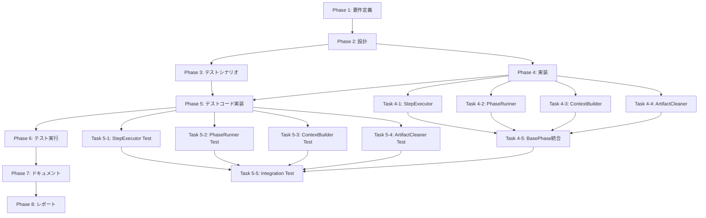

# プロジェクト計画書 - Issue #49: base-phase.ts のモジュール分解リファクタリング

## 1. Issue分析

### 1.1 複雑度判定

**複雑度**: **複雑** (Complex)

**判定根拠**:
- **アーキテクチャ変更**: BasePhaseは全10フェーズの基底クラスであり、システムのコアアーキテクチャに位置する
- **影響範囲の広さ**: 全フェーズクラス（10クラス）が継承しており、変更の影響範囲が極めて大きい
- **責務の多様性**: ライフサイクル管理、エージェント実行、Git統合、GitHub API統合、ファイル管理、クリーンアップ、ユーザーインタラクションという7つの異なる責務を持つ
- **既存モジュール構造**: Issue #23で既に一部モジュール化（AgentExecutor、ReviewCycleManager、LogFormatter、ProgressFormatter）されているが、さらなる分解が必要
- **技術的複雑性**: 循環的複雑度が高い `run()` メソッド（99行）、複雑なステップ管理ロジック、Git/GitHub統合の非同期処理

### 1.2 見積もり工数

**総工数**: **24~32時間** (3~4日)

**工数配分の根拠**:
- **Phase 1: 要件定義** (2~3h): 既存コード分析、責務の洗い出し、モジュール境界の決定
- **Phase 2: 設計** (4~5h): モジュール間インターフェース設計、依存性注入パターン設計、後方互換性戦略
- **Phase 3: テストシナリオ** (2~3h): 既存機能の保証、リグレッション防止のシナリオ策定
- **Phase 4: 実装** (8~12h): 4つの新規モジュール作成、BasePhase リファクタリング、依存性注入統合
- **Phase 5: テストコード実装** (3~4h): ユニットテスト、インテグレーションテスト作成
- **Phase 6: テスト実行** (1~2h): テスト実行、バグ修正、リグレッションチェック
- **Phase 7: ドキュメント** (2~3h): ARCHITECTURE.md、CLAUDE.md更新、モジュールのJSDoc整備
- **Phase 8: レポート** (2h): 実装サマリー、PR作成

### 1.3 リスク評価

**総合リスク**: **高** (High)

**リスク詳細**:

#### 技術的リスク: **高**
- BasePhaseは全フェーズの基底クラスであり、破壊的変更のリスクが高い
- 既存の4つのモジュール（AgentExecutor、ReviewCycleManager、LogFormatter、ProgressFormatter）との統合複雑性
- 非同期処理（Git/GitHub統合）の正確性保証が必要
- ステップ単位のレジューム機能の動作保証（Issue #10の機能）

#### スコープリスク: **中**
- Issue #23で一部モジュール化済みのため、分離済み部分との境界設計が必要
- 「適切なモジュール粒度」の判断に主観が入る余地がある

#### リソースリスク: **中**
- TypeScript、デザインパターン（依存性注入、ファサードパターン）の知識が必要
- 包括的なテストケースの作成に時間を要する

#### 依存リスク: **低**
- 外部ライブラリへの新規依存は不要
- 既存機能の動作に影響を与えないため、ブロッキング問題は発生しにくい

---

## 2. 実装戦略判断

### 2.1 実装戦略: **REFACTOR**

**判断根拠**:

このIssueは典型的な**リファクタリングタスク**です。新規機能の追加や既存機能の拡張ではなく、コードの内部構造改善が目的です。

**REFACTOR判定の理由**:
1. **機能追加なし**: 外部から見た振る舞いは一切変更しない（後方互換性100%維持）
2. **構造改善**: 単一責任の原則（SRP）に基づき、複数の責務を独立したモジュールに分離
3. **保守性向上**: 循環的複雑度の削減、テスト容易性の向上が主目的
4. **既存パターンの踏襲**: Issue #23（GitHubClient、GitManager、BasePhaseの一部）と同様のファサードパターンによるモジュール分離を継続

**既存リファクタリング実績（参考）**:
- **Issue #23**: BasePhase 1420行 → 676行（52.4%削減）
- **Issue #24**: GitHubClient 702行 → 402行（42.7%削減）
- **Issue #25**: GitManager 548行 → 181行（67%削減）
- **Issue #26**: MetadataManager、CodexAgentClient等の削減

今回の目標: **BasePhase 676行 → 約300行（55.6%削減）**

### 2.2 テスト戦略: **UNIT_INTEGRATION**

**判断根拠**:

リファクタリングの成功を保証するため、ユニットテストとインテグレーションテストの両方が必要です。

**UNIT_INTEGRATION判定の理由**:

#### ユニットテスト（UNIT）が必要な理由:
1. **新規モジュールの単体テスト**: 各モジュール（StepExecutor、PhaseRunner、ContextBuilder、ArtifactCleaner）の独立した動作保証
2. **境界条件の検証**: エラーハンドリング、null/undefined処理、パス検証ロジック
3. **依存性のモック化**: Git/GitHub APIに依存しない高速なテスト実行

#### インテグレーションテスト（INTEGRATION）が必要な理由:
1. **既存機能の動作保証**: 全10フェーズの基底クラスであるため、リグレッション防止が最優先
2. **モジュール間連携の検証**: BasePhase（ファサード）と各専門モジュールの統合動作確認
3. **Git/GitHub統合の検証**: ステップ単位のコミット（Issue #10）、進捗投稿、クリーンアップの動作確認
4. **エンドツーエンドの実行フロー**: execute → review → revise の完全なライフサイクルテスト

**BDDが不要な理由**:
- このリファクタリングはユーザーストーリーではなく、内部アーキテクチャの改善
- 外部から見た振る舞いは変更されないため、BDD形式のテストは冗長

### 2.3 テストコード戦略: **CREATE_TEST**

**判断根拠**:

新規モジュールの作成が中心のため、新規テストファイルを作成します。

**CREATE_TEST判定の理由**:
1. **新規モジュール**: 4つの新規モジュール（StepExecutor、PhaseRunner、ContextBuilder、ArtifactCleaner）には対応するテストファイルが存在しない
2. **テストの独立性**: 各モジュールの責務が明確に分離されているため、独立したテストファイルで管理すべき
3. **保守性**: モジュールごとにテストファイルを分離することで、テストの可読性とメンテナンス性が向上

**新規テストファイル一覧**:
- `tests/unit/phases/lifecycle/step-executor.test.ts` (約150行)
- `tests/unit/phases/lifecycle/phase-runner.test.ts` (約180行)
- `tests/unit/phases/context/context-builder.test.ts` (約120行)
- `tests/unit/phases/cleanup/artifact-cleaner.test.ts` (約100行)
- `tests/integration/phases/base-phase-refactored.test.ts` (約200行)

**既存テストの保持**:
- BasePhase の既存テストは保持し、リファクタリング後も動作することを確認
- 必要に応じて、既存テストに追加のアサーションを加える（EXTEND_TEST的要素は最小限）

---

## 3. 影響範囲分析

### 3.1 既存コードへの影響

#### **直接影響を受けるファイル（変更必須）**:

1. **`src/phases/base-phase.ts`** (約676行 → 約300行)
   - 4つの専門モジュールに責務を分離
   - ファサードクラスとして各モジュールをオーケストレーション
   - 後方互換性100%維持（publicメソッドのシグネチャは不変）

2. **新規作成ファイル（4ファイル）**:
   - `src/phases/lifecycle/step-executor.ts` (約120行)
   - `src/phases/lifecycle/phase-runner.ts` (約100行)
   - `src/phases/context/context-builder.ts` (約100行)
   - `src/phases/cleanup/artifact-cleaner.ts` (約80行)

#### **間接影響を受けるファイル（動作確認必須、変更は不要）**:

3. **全フェーズクラス（10ファイル）**:
   - `src/phases/planning.ts`
   - `src/phases/requirements.ts`
   - `src/phases/design.ts`
   - `src/phases/test-scenario.ts`
   - `src/phases/implementation.ts`
   - `src/phases/test-implementation.ts`
   - `src/phases/testing.ts`
   - `src/phases/documentation.ts`
   - `src/phases/report.ts`
   - `src/phases/evaluation.ts`
   - **影響**: BasePhaseのpublicインターフェースが不変のため、コード変更は不要。ただし、インテグレーションテストで動作確認が必須。

4. **BasePhaseに依存するコアモジュール（4ファイル）**:
   - `src/phases/core/agent-executor.ts` (Issue #23で作成)
   - `src/phases/core/review-cycle-manager.ts` (Issue #23で作成)
   - `src/phases/formatters/log-formatter.ts` (Issue #23で作成)
   - `src/phases/formatters/progress-formatter.ts` (Issue #23で作成)
   - **影響**: 依存性注入により統合されているため、動作確認が必須。

5. **コマンドハンドラ**:
   - `src/commands/execute.ts`
   - `src/commands/execute/workflow-executor.ts`
   - **影響**: BasePhase.run()を呼び出すため、動作確認が必須。

### 3.2 依存関係の変更

#### **新規依存の追加**: なし

すべての新規モジュールは既存の依存関係（fs-extra、simple-git、@octokit/rest等）のみを使用します。

#### **既存依存の変更**: なし

BasePhaseクラスのコンストラクタ引数（`BasePhaseConstructorParams`）は不変です。

#### **依存性注入パターンの追加**:

新規モジュールはBasePhaseのコンストラクタで初期化され、privateフィールドとして保持されます。

```typescript
// BasePhase (リファクタリング後)
export abstract class BasePhase {
  // 既存モジュール (Issue #23)
  private readonly logFormatter: LogFormatter;
  private readonly progressFormatter: ProgressFormatter;
  private agentExecutor: AgentExecutor | null;
  private readonly reviewCycleManager: ReviewCycleManager;

  // 新規モジュール (Issue #49)
  private readonly stepExecutor: StepExecutor;
  private readonly phaseRunner: PhaseRunner;
  private readonly contextBuilder: ContextBuilder;
  private readonly artifactCleaner: ArtifactCleaner;

  constructor(params: BasePhaseConstructorParams) {
    // ... 既存の初期化処理 ...

    // 新規モジュールの初期化
    this.stepExecutor = new StepExecutor(this, this.metadata);
    this.phaseRunner = new PhaseRunner(this, this.metadata, this.github);
    this.contextBuilder = new ContextBuilder(this, this.metadata, this.workingDir);
    this.artifactCleaner = new ArtifactCleaner(this.metadata);
  }
}
```

### 3.3 マイグレーション要否

#### **データベーススキーマ変更**: 不要

#### **設定ファイル変更**: 不要

#### **メタデータ構造変更**: 不要

`metadata.json` の構造は一切変更されません。

#### **環境変数変更**: 不要

#### **後方互換性**: 100%維持

- BasePhaseのpublicメソッドのシグネチャは不変
- 全フェーズクラスの既存コードは無変更で動作
- 既存のワークフロー（CI/CD、Jenkins統合）は影響を受けない

---

## 4. タスク分割

以下のチェックリストは、各フェーズの完了判定基準として使用されます。

### Phase 1: 要件定義 (見積もり: 2~3h)

- [x] Task 1-1: BasePhaseの責務分析と洗い出し (1h)
  - 既存コード（676行）を7つの責務カテゴリに分類
  - Issue #23で分離済みのモジュール（AgentExecutor、ReviewCycleManager等）との境界を明確化
  - 新規モジュール候補の洗い出し（StepExecutor、PhaseRunner、ContextBuilder、ArtifactCleaner）
  - 各責務の行数とメソッド数の集計
- [x] Task 1-2: モジュール境界の決定と責務マトリックスの作成 (0.5~1h)
  - 責務マトリックス: 各メソッドをどのモジュールに配置するか決定
  - モジュール間の依存関係グラフ作成（Mermaid形式）
  - publicメソッド vs privateメソッドの分類
  - BasePhase（ファサード）に残すべきメソッドの決定
- [x] Task 1-3: 非機能要件の定義 (0.5~1h)
  - 後方互換性100%維持の確認基準策定
  - パフォーマンス要件（依存性注入のオーバーヘッド評価）
  - エラーハンドリング戦略（各モジュールでの例外処理方針）
  - ロギング戦略（どのレベルでログを出力するか）

### Phase 2: 設計 (見積もり: 4~5h)

- [x] Task 2-1: モジュール間インターフェース設計 (2~2.5h)
  - StepExecutor インターフェース設計（executeStep、reviewStep、reviseStep）
  - PhaseRunner インターフェース設計（run、validateDependencies、handleFailure）
  - ContextBuilder インターフェース設計（buildOptionalContext、getAgentFileReference、getPlanningDocumentReference）
  - ArtifactCleaner インターフェース設計（cleanupWorkflowArtifacts、cleanupWorkflowLogs、promptUserConfirmation）
  - 各モジュールのコンストラクタ引数設計（依存性注入）
- [x] Task 2-2: 依存性注入パターンの設計 (1~1.5h)
  - BasePhaseコンストラクタでの初期化順序決定
  - モジュール間の循環参照の回避策検討（BasePhaseへの参照をどう渡すか）
  - 既存モジュール（AgentExecutor、ReviewCycleManager）との統合方法
  - モックフレンドリーな設計（テスト容易性）
- [x] Task 2-3: 後方互換性戦略の設計 (1h)
  - BasePhaseのpublicメソッドの保持（シグネチャ不変）
  - protectedメソッドの移行戦略（既存フェーズクラスへの影響最小化）
  - エラーハンドリングの一貫性保証
  - ログメッセージの互換性維持

### Phase 3: テストシナリオ (見積もり: 2~3h)

- [x] Task 3-1: ユニットテストシナリオの策定 (1~1.5h)
  - StepExecutor のテストケース策定（20ケース）
    - executeステップの成功/失敗パターン
    - reviewステップのスキップ/実行パターン
    - reviseステップのリトライロジック
    - completed_stepsの管理
  - PhaseRunner のテストケース策定（15ケース）
    - run()メソッドの完全フロー
    - 依存関係検証の成功/失敗パターン
    - エラーハンドリング（execute/review/revise各ステップでの失敗）
  - ContextBuilder のテストケース策定（12ケース）
    - ファイル存在時の@filepath参照生成
    - ファイル不在時のフォールバックメッセージ
    - 相対パス解決の正確性
  - ArtifactCleaner のテストケース策定（10ケース）
    - ワークフローログのクリーンアップ（Report Phase）
    - ワークフローアーティファクト全体のクリーンアップ（Evaluation Phase）
    - パス検証、シンボリックリンクチェック
    - 確認プロンプト（CI環境/非CI環境）
- [x] Task 3-2: インテグレーションテストシナリオの策定 (1~1.5h)
  - BasePhase全体のライフサイクルテスト（execute → review → revise）
  - Git統合テスト（ステップ単位のコミット＆プッシュ）
  - GitHub統合テスト（進捗コメント投稿）
  - 全10フェーズの動作保証（リグレッションテスト）
  - エラーリカバリテスト（途中失敗時のレジューム動作）

### Phase 4: 実装 (見積もり: 8~12h)

- [x] Task 4-1: StepExecutor モジュールの実装 (2~3h)
  - `src/phases/lifecycle/step-executor.ts` 作成
  - executeStep() メソッド実装（BasePhase.execute()呼び出し + completed_steps管理）
  - reviewStep() メソッド実装（BasePhase.review()呼び出し + スキップロジック）
  - reviseStep() メソッド実装（リトライロジック + ReviewCycleManager連携）
  - commitAndPushStep() メソッド実装（Git統合）
  - エラーハンドリング、ロギング
- [x] Task 4-2: PhaseRunner モジュールの実装 (2~3h)
  - `src/phases/lifecycle/phase-runner.ts` 作成
  - run() メソッド実装（依存関係検証 → StepExecutor呼び出し → ステータス更新）
  - validateDependencies() メソッド実装（phase-dependencies.ts連携）
  - handleFailure() メソッド実装（エラー時のメタデータ更新 + GitHub投稿）
  - postProgress() メソッド実装（ProgressFormatter連携）
  - エラーハンドリング、ロギング
- [x] Task 4-3: ContextBuilder モジュールの実装 (1.5~2h)
  - `src/phases/context/context-builder.ts` 作成
  - buildOptionalContext() メソッド実装（ファイル存在チェック + フォールバック）
  - getAgentFileReference() メソッド実装（相対パス解決 + @filepath生成）
  - getPlanningDocumentReference() メソッド実装（Planning Phase専用参照）
  - getPhaseOutputFile() メソッド実装（共通ファイルパス解決）
  - エラーハンドリング、ロギング
- [x] Task 4-4: ArtifactCleaner モジュールの実装 (1.5~2h)
  - `src/phases/cleanup/artifact-cleaner.ts` 作成
  - cleanupWorkflowArtifacts() メソッド実装（Evaluation Phase用、全削除）
  - cleanupWorkflowLogs() メソッド実装（Report Phase用、ログのみ削除）
  - promptUserConfirmation() メソッド実装（readlineインターフェース）
  - isCIEnvironment() メソッド実装（config.isCI()連携）
  - パス検証、シンボリックリンクチェック
  - エラーハンドリング、ロギング
- [x] Task 4-5: BasePhase リファクタリング（モジュール統合） (2~4h)
  - 新規モジュールの依存性注入（コンストラクタ）
  - run() メソッドの簡略化（PhaseRunner に委譲）
  - buildOptionalContext() メソッドの委譲（ContextBuilder に委譲）
  - cleanupWorkflowArtifacts() メソッドの委譲（ArtifactCleaner に委譲）
  - 不要なprivateメソッドの削除（各モジュールに移動済み）
  - 後方互換性の確認（publicメソッドのシグネチャ不変）
  - 行数削減の確認（676行 → 約300行）

### Phase 5: テストコード実装 (見積もり: 3~4h)

- [x] Task 5-1: StepExecutor ユニットテスト実装 (0.5~1h)
  - `tests/unit/phases/lifecycle/step-executor.test.ts` 作成
  - executeステップの成功/失敗テスト
  - reviewステップのスキップ/実行テスト
  - reviseステップのリトライテスト
  - completed_steps管理のテスト
  - Gitコミット＆プッシュのモックテスト
- [x] Task 5-2: PhaseRunner ユニットテスト実装 (0.5~1h)
  - `tests/unit/phases/lifecycle/phase-runner.test.ts` 作成
  - run()メソッドの完全フローテスト
  - 依存関係検証の成功/失敗テスト
  - エラーハンドリングテスト（各ステップでの失敗）
  - ステータス更新のテスト
  - GitHub進捗投稿のモックテスト
- [x] Task 5-3: ContextBuilder ユニットテスト実装 (0.5h)
  - `tests/unit/phases/context/context-builder.test.ts` 作成
  - ファイル存在時の@filepath参照生成テスト
  - ファイル不在時のフォールバックメッセージテスト
  - 相対パス解決の正確性テスト
  - Planning Phase参照の特殊処理テスト
- [x] Task 5-4: ArtifactCleaner ユニットテスト実装 (0.5h)
  - `tests/unit/phases/cleanup/artifact-cleaner.test.ts` 作成
  - ワークフローログのクリーンアップテスト
  - ワークフローアーティファクト全体のクリーンアップテスト
  - パス検証、シンボリックリンクチェックのテスト
  - 確認プロンプトのテスト（CI環境/非CI環境）
- [x] Task 5-5: BasePhase インテグレーションテスト実装 (1~1.5h)
  - `tests/integration/phases/base-phase-refactored.test.ts` 作成
  - 全ライフサイクル（execute → review → revise）のテスト
  - Git統合テスト（ステップ単位のコミット＆プッシュ）
  - GitHub統合テスト（進捗コメント投稿）
  - エラーリカバリテスト（途中失敗時のレジューム）
  - 全10フェーズの動作保証（既存テストの補完）

### Phase 6: テスト実行 (見積もり: 1~2h)

- [ ] Task 6-1: ユニットテスト実行とバグ修正 (0.5~1h)
  - `npm run test:unit` 実行
  - テスト失敗箇所の特定と修正
  - カバレッジ確認（目標: 90%以上）
  - エッジケースの追加テスト
- [ ] Task 6-2: インテグレーションテスト実行とリグレッションチェック (0.5~1h)
  - `npm run test:integration` 実行
  - 全10フェーズの動作確認
  - 既存テストの成功確認（リグレッション防止）
  - エラーハンドリングの動作確認
  - パフォーマンス検証（依存性注入のオーバーヘッド確認）

### Phase 7: ドキュメント (見積もり: 2~3h)

- [x] Task 7-1: ARCHITECTURE.md の更新 (1~1.5h)
  - BasePhaseモジュール構造の図解追加（Mermaid）
  - 4つの新規モジュールの説明追加
    - StepExecutor: ステップ実行ロジック
    - PhaseRunner: フェーズライフサイクル管理
    - ContextBuilder: コンテキスト構築
    - ArtifactCleaner: クリーンアップロジック
  - モジュール分離の設計思想説明
  - 依存性注入パターンの説明
- [x] Task 7-2: CLAUDE.md の更新 (0.5~1h)
  - BasePhaseのモジュール構成セクション更新
  - 新規モジュールの行数とファイルパス追加
  - リファクタリング実績の更新（Issue #49追加）
  - 関心の分離原則の強調
- [x] Task 7-3: モジュールのJSDoc整備 (0.5h)
  - 各モジュール（StepExecutor、PhaseRunner、ContextBuilder、ArtifactCleaner）のクラスレベルJSDoc追加
  - publicメソッドのJSDoc追加（引数、戻り値、例外）
  - 使用例の追加（@example タグ）

### Phase 8: レポート (見積もり: 2h)

- [ ] Task 8-1: 実装サマリーの作成 (1h)
  - リファクタリング前後の比較（行数、循環的複雑度）
  - モジュール分離のメリット説明
  - テスト結果のサマリー（カバレッジ、成功率）
  - パフォーマンス影響の評価
- [ ] Task 8-2: PR作成とレビュー準備 (1h)
  - PRタイトル・本文作成（テンプレート使用）
  - 変更ファイル一覧の整理
  - レビューポイントの明記
  - スクリーンショット/ログの添付（必要に応じて）

---

## 5. 依存関係

### 5.1 タスク間の依存関係グラフ



### 5.2 クリティカルパス

**クリティカルパス**: Phase 1 → Phase 2 → Phase 4 (Task 4-1 → 4-2 → 4-3 → 4-4 → 4-5) → Phase 5 → Phase 6 → Phase 7 → Phase 8

**ボトルネック**:
- **Phase 4 (8~12h)**: 実装フェーズが最も時間を要する
- **Task 4-5 (2~4h)**: BasePhase統合は全モジュール完成後にのみ着手可能

**並行作業の可能性**:
- Task 4-1 ~ 4-4 は独立して実装可能（並行作業可能）
- Task 5-1 ~ 5-4 は独立してテスト作成可能（並行作業可能）

---

## 6. リスクと軽減策

### リスク1: 後方互換性の破壊

- **影響度**: **高** - 全10フェーズが動作不能になる可能性
- **確率**: **中** - publicメソッドのシグネチャ変更が誤って発生する可能性
- **軽減策**:
  1. **Phase 2（設計）**: publicメソッドリストを明示的に列挙し、シグネチャ不変を保証
  2. **Phase 5（テスト）**: 全10フェーズのインテグレーションテストで動作保証
  3. **Phase 6（テスト実行）**: 既存テストの成功を必須条件とする
  4. **コードレビュー**: PRレビュー時にpublicメソッドの変更をチェック

### リスク2: モジュール間の循環参照

- **影響度**: **中** - モジュール分離の失敗、コンパイルエラー
- **確率**: **中** - BasePhaseと各モジュールの相互参照が複雑
- **軽減策**:
  1. **Phase 2（設計）**: 依存関係グラフを作成し、循環参照を事前に検出
  2. **依存性注入**: BasePhaseをコンストラクタ引数として渡し、モジュール側からBasePhaseを参照可能にする
  3. **インターフェース分離**: 必要に応じてBasePhaseのインターフェースを抽出し、依存を抽象化

### リスク3: テストカバレッジ不足

- **影響度**: **高** - リグレッションバグの見逃し
- **確率**: **中** - 複雑なエラーハンドリングパスのテスト漏れ
- **軽減策**:
  1. **Phase 3（テストシナリオ）**: エッジケース（エラーハンドリング、null/undefined処理）を明示的にリストアップ
  2. **Phase 5（テスト実装）**: カバレッジツール（Jest）で90%以上を目標
  3. **Phase 6（テスト実行）**: カバレッジレポートを確認し、不足箇所を補完

### リスク4: ステップ単位レジューム機能の動作不良

- **影響度**: **高** - CI環境でのワークフロー失敗
- **確率**: **中** - ステップ管理ロジック（completed_steps、current_step）の移行ミス
- **軽減策**:
  1. **Phase 4（実装）**: StepExecutorでステップ管理ロジックを集約し、単一箇所で管理
  2. **Phase 5（テスト）**: ステップレジュームの専用テストケースを作成
  3. **Phase 6（テスト実行）**: CI環境でのインテグレーションテストを必須実施

### リスク5: 既存モジュール（Issue #23）との統合不良

- **影響度**: **中** - AgentExecutor、ReviewCycleManager等との連携不良
- **確率**: **低** - 既存モジュールのインターフェースは安定
- **軽減策**:
  1. **Phase 1（要件定義）**: 既存モジュールとの境界を明確化
  2. **Phase 2（設計）**: 既存モジュールのインターフェースを変更しない設計
  3. **Phase 5（テスト）**: 既存モジュールとの連携テストを追加

### リスク6: パフォーマンス劣化

- **影響度**: **低** - 依存性注入によるオーバーヘッド
- **確率**: **低** - オブジェクト生成コストは微小
- **軽減策**:
  1. **Phase 2（設計）**: モジュール初期化はコンストラクタで1回のみ実施
  2. **Phase 6（テスト実行）**: パフォーマンステストで実行時間を比較
  3. **必要に応じて**: 遅延初期化（lazy initialization）を検討

---

## 7. 品質ゲート

### Phase 1: 要件定義

- [ ] **責務マトリックスが作成されている** - 各メソッドの配置先モジュールが決定済み
- [ ] **モジュール境界が明確に定義されている** - 新規4モジュールの責務が重複なく分離
- [ ] **既存モジュール（Issue #23）との境界が明確化されている** - AgentExecutor、ReviewCycleManager等との役割分担が明示
- [ ] **非機能要件が定義されている** - 後方互換性、パフォーマンス、エラーハンドリング戦略

### Phase 2: 設計

- [ ] **実装戦略の判断根拠が明記されている** - REFACTOR戦略が選択された理由が明確
- [ ] **テスト戦略の判断根拠が明記されている** - UNIT_INTEGRATION戦略が選択された理由が明確
- [ ] **モジュール間インターフェースが設計されている** - 各モジュールのpublicメソッドのシグネチャが決定済み
- [ ] **依存性注入パターンが設計されている** - コンストラクタ引数、初期化順序が決定済み
- [ ] **後方互換性が保証されている** - BasePhaseのpublicメソッドのシグネチャが不変
- [ ] **循環参照が回避されている** - 依存関係グラフで循環が存在しないことを確認

### Phase 3: テストシナリオ

- [ ] **ユニットテストケースが網羅的に策定されている** - 各モジュールのテストケースが20ケース以上
- [ ] **インテグレーションテストケースが策定されている** - ライフサイクル全体、Git/GitHub統合、全10フェーズのテスト
- [ ] **エッジケース（エラーハンドリング）がカバーされている** - 境界条件、null/undefined処理
- [ ] **リグレッションテストが定義されている** - 既存機能の動作保証

### Phase 4: 実装

- [ ] **4つの新規モジュールが実装されている** - StepExecutor、PhaseRunner、ContextBuilder、ArtifactCleaner
- [ ] **BasePhaseが300行以下に削減されている** - 目標: 676行 → 約300行（55.6%削減）
- [ ] **後方互換性が維持されている** - publicメソッドのシグネチャが不変
- [ ] **依存性注入が実装されている** - BasePhaseコンストラクタで新規モジュールを初期化
- [ ] **既存モジュールとの統合が完了している** - AgentExecutor、ReviewCycleManager等との連携動作
- [ ] **エラーハンドリングが実装されている** - 各モジュールで適切な例外処理
- [ ] **ロギングが実装されている** - 各モジュールで適切なログ出力（logger使用）

### Phase 5: テストコード実装

- [ ] **ユニットテストが実装されている** - 各モジュールのテストファイルが作成済み
- [ ] **インテグレーションテストが実装されている** - BasePhase全体のテストファイルが作成済み
- [ ] **テストカバレッジが90%以上** - Jest カバレッジレポートで確認
- [ ] **エッジケースがテストされている** - エラーハンドリング、null/undefined処理

### Phase 6: テスト実行

- [ ] **ユニットテストがすべて成功している** - `npm run test:unit` が成功
- [ ] **インテグレーションテストがすべて成功している** - `npm run test:integration` が成功
- [ ] **既存テストがすべて成功している** - リグレッションが発生していない
- [ ] **テストカバレッジが90%以上** - 不足箇所が補完済み
- [ ] **パフォーマンス劣化がない** - リファクタリング前後で実行時間が同等

### Phase 7: ドキュメント

- [ ] **ARCHITECTURE.mdが更新されている** - 新規モジュール構成、依存関係グラフが追加済み
- [ ] **CLAUDE.mdが更新されている** - モジュール一覧、リファクタリング実績が更新済み
- [ ] **各モジュールのJSDocが整備されている** - クラスレベル、publicメソッドのJSDocが完備

### Phase 8: レポート

- [ ] **実装サマリーが作成されている** - リファクタリング前後の比較、テスト結果が記載
- [ ] **PRが作成されている** - タイトル、本文、変更ファイル一覧が整理済み
- [ ] **レビューポイントが明記されている** - 後方互換性、テストカバレッジ等の確認項目

---

## 8. 補足事項

### 8.1 リファクタリングの原則

このリファクタリングは、**Martin Fowler の「リファクタリング」**の原則に従います：

1. **小さなステップで進める**: 各モジュールを個別に実装し、BasePhaseに統合
2. **テストを先に書く**: テストシナリオ策定（Phase 3）を実装前に完了
3. **常にコンパイル可能な状態を保つ**: 中間コミットでもビルドが成功する状態を維持
4. **リファクタリングと機能追加を分離**: このIssueでは機能追加を一切行わない

### 8.2 Issue #23 との関係

Issue #23では、BasePhaseを1420行から676行に削減しました。今回（Issue #49）はその続編として、676行を約300行にさらに削減します。

**Issue #23で分離されたモジュール（再掲）**:
- AgentExecutor: エージェント実行ロジック
- ReviewCycleManager: レビューサイクル管理
- LogFormatter: ログフォーマット
- ProgressFormatter: 進捗表示フォーマット

**Issue #49で分離するモジュール（新規）**:
- StepExecutor: ステップ実行ロジック
- PhaseRunner: フェーズライフサイクル管理
- ContextBuilder: コンテキスト構築
- ArtifactCleaner: クリーンアップロジック

### 8.3 参考: 既存リファクタリング実績

プロジェクトでは、これまでに複数の大規模リファクタリングが成功しています：

| Issue | 対象モジュール | 削減率 | 分離モジュール数 |
|-------|---------------|--------|-----------------|
| #23   | BasePhase     | 52.4%  | 4モジュール      |
| #24   | GitHubClient  | 42.7%  | 4モジュール      |
| #25   | GitManager    | 67%    | 3モジュール      |
| #26   | 複数          | 9.5%~27.2% | 7モジュール  |
| #46   | execute.ts    | 27%    | 3モジュール      |
| **#49** | **BasePhase** | **55.6%** | **4モジュール** |

このプロジェクトには、モジュール分離のノウハウが蓄積されています。

### 8.4 成功基準

このリファクタリングは、以下を満たす場合に成功と判定されます：

1. **行数削減**: BasePhase 676行 → 約300行（55.6%削減）
2. **後方互換性**: 全10フェーズクラスのコード変更なしで動作
3. **テストカバレッジ**: 90%以上
4. **テスト成功率**: 100%（既存テスト含む）
5. **パフォーマンス**: リファクタリング前後で実行時間が同等（±5%以内）
6. **保守性**: 循環的複雑度の削減（run()メソッドが50行以下）

---

## 9. まとめ

### 9.1 プロジェクトの目標

**Issue #49の目標**: BasePhase (676行) を4つの専門モジュールに分解し、単一責任の原則に準拠した保守性の高いアーキテクチャを実現する。

### 9.2 期待される効果

1. **保守性の向上**: 各モジュールの責務が明確になり、変更の影響範囲が局所化
2. **テスト容易性の向上**: モジュール単位でのユニットテストが容易
3. **循環的複雑度の削減**: run()メソッド（99行）の簡略化
4. **再利用性の向上**: 各モジュールが独立して再利用可能
5. **開発効率の向上**: 新規フェーズ追加時の実装コストが削減

### 9.3 次のステップ

このプロジェクト計画書が承認されたら、**Phase 1: 要件定義**に進みます。

---

**計画書作成日**: 2025-01-21
**見積もり総工数**: 24~32時間（3~4日）
**リスクレベル**: 高（コアアーキテクチャのリファクタリング）
**後方互換性**: 100%維持
