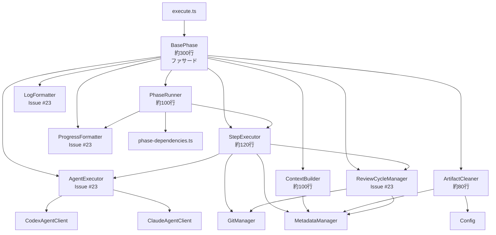

# 詳細設計書 - Issue #49: base-phase.ts のモジュール分解リファクタリング

## 0. Planning Document・要件定義書の確認

### Planning Document の確認結果

Planning Document（`.ai-workflow/issue-49/00_planning/output/planning.md`）において、以下の開発方針が策定されています：

- **実装戦略**: REFACTOR（リファクタリング）
- **テスト戦略**: UNIT_INTEGRATION（ユニットテスト + インテグレーションテスト）
- **テストコード戦略**: CREATE_TEST（新規テストファイル作成）
- **複雑度**: 複雑（Complex）
- **総工数**: 24~32時間（3~4日）
- **リスクレベル**: 高（コアアーキテクチャのリファクタリング）
- **後方互換性**: 100%維持
- **目標行数削減**: BasePhase 676行 → 約300行（55.6%削減）

### 要件定義書の確認結果

要件定義書（`.ai-workflow/issue-49/01_requirements/output/requirements.md`）において、以下の機能要件・非機能要件が定義されています：

**機能要件**:
- FR-1: StepExecutor モジュールの作成（約120行）
- FR-2: PhaseRunner モジュールの作成（約100行）
- FR-3: ContextBuilder モジュールの作成（約100行）
- FR-4: ArtifactCleaner モジュールの作成（約80行）
- FR-5: BasePhase のモジュール統合（676行 → 約300行）

**非機能要件**:
- NFR-1: 依存性注入によるオーバーヘッドは5%以内
- NFR-2: リファクタリング前後で実行時間が同等（±5%以内）
- NFR-3: パストラバーサル攻撃の防止
- NFR-4: シンボリックリンク攻撃の防止
- NFR-5: クリーンアップ失敗時もワークフロー全体は成功として扱う
- NFR-6: エラーハンドリングの一貫性
- NFR-7: 循環的複雑度の削減（run() メソッド: 99行 → 約50行以下）
- NFR-8: テストカバレッジ90%以上
- NFR-9: 各モジュールは単一責任の原則に準拠

---

## 1. アーキテクチャ設計

### 1.1 現在のアーキテクチャ（Issue #23リファクタリング後）

BasePhase クラス（676行）は、Issue #23 のリファクタリングにより以下のモジュール構造を持っています：

```
BasePhase (676行)
├── AgentExecutor (Issue #23で分離済み)
│   └── エージェント実行、フォールバック処理、利用量メトリクス抽出
├── ReviewCycleManager (Issue #23で分離済み)
│   └── レビューサイクル管理、リトライロジック
├── LogFormatter (Issue #23で分離済み)
│   └── Codex/Claude の生ログを Markdown 形式に変換
└── ProgressFormatter (Issue #23で分離済み)
    └── GitHub Issue コメント用の進捗状況フォーマット
```

**現在の BasePhase の責務（676行）**:
1. フェーズライフサイクル管理（execute/review/revise のオーケストレーション）
2. ステップ実行ロジック（executeStep/reviewStep/reviseStep）
3. Git 統合（ステップ単位のコミット＆プッシュ）
4. GitHub API 統合（進捗投稿）
5. ファイル参照とコンテキスト構築（@filepath 参照生成）
6. ワークフロークリーンアップ（ログ削除、アーティファクト削除）
7. ユーザーインタラクション（確認プロンプト）

### 1.2 リファクタリング後のアーキテクチャ（Issue #49）

BasePhase クラスを以下の4つの専門モジュールに分解し、約300行に削減します：

```
BasePhase (約300行 - ファサードクラス)
├── 既存モジュール (Issue #23で分離済み)
│   ├── AgentExecutor
│   ├── ReviewCycleManager
│   ├── LogFormatter
│   └── ProgressFormatter
└── 新規モジュール (Issue #49で分離)
    ├── StepExecutor (約120行)
    │   └── ステップ実行ロジック（execute/review/revise、Git コミット＆プッシュ）
    ├── PhaseRunner (約100行)
    │   └── フェーズライフサイクル管理（run、依存関係検証、エラーハンドリング）
    ├── ContextBuilder (約100行)
    │   └── コンテキスト構築（ファイル参照、@filepath 生成）
    └── ArtifactCleaner (約80行)
        └── クリーンアップロジック（ログ削除、アーティファクト削除、確認プロンプト）
```

### 1.3 システム全体図



### 1.4 データフロー

#### 1.4.1 フェーズ実行フロー（run メソッド）

```
1. CLI (execute.ts)
   ↓
2. BasePhase.run(options)
   ↓
3. PhaseRunner.run(gitManager, options)
   ├── 依存関係検証 (validateDependencies)
   ├── ステータス更新 (pending → in_progress)
   ├── 進捗投稿 (postProgress)
   ├── ステップ実行
   │   ├── StepExecutor.executeStep()
   │   │   ├── BasePhase.execute() 呼び出し
   │   │   ├── Git コミット＆プッシュ
   │   │   └── completed_steps 更新
   │   ├── StepExecutor.reviewStep()
   │   │   ├── BasePhase.review() 呼び出し
   │   │   ├── Git コミット＆プッシュ
   │   │   └── completed_steps 更新
   │   └── StepExecutor.reviseStep()
   │       ├── ReviewCycleManager.performReviseStepWithRetry()
   │       ├── Git コミット＆プッシュ
   │       └── completed_steps 更新
   ├── ステータス更新 (completed/failed)
   └── 進捗投稿 (postProgress)
```

#### 1.4.2 オプショナルコンテキスト構築フロー

```
1. 各フェーズの execute() メソッド
   ↓
2. ContextBuilder.buildOptionalContext(phaseName, filename, fallbackMessage)
   ├── ファイルパス解決 (getPhaseOutputFile)
   ├── ファイル存在チェック (fs.existsSync)
   ├── 存在する場合
   │   └── @filepath 参照生成 (getAgentFileReference)
   └── 存在しない場合
       └── フォールバックメッセージ返却
```

#### 1.4.3 クリーンアップフロー

```
1. Report Phase 完了後 (Phase 8)
   ↓
2. BasePhase.cleanupWorkflowLogs() 委譲
   ↓
3. ArtifactCleaner.cleanupWorkflowLogs()
   ├── phases 00-08 の execute/review/revise ディレクトリ削除
   └── metadata.json と output/*.md は保持

---

1. Evaluation Phase 完了後 (Phase 9、オプション)
   ↓
2. BasePhase.cleanupWorkflowArtifacts() 委譲
   ↓
3. ArtifactCleaner.cleanupWorkflowArtifacts(force)
   ├── CI 環境判定 (isCIEnvironment)
   ├── 確認プロンプト表示（force=false かつ非CI環境）
   ├── パス検証（正規表現）
   ├── シンボリックリンクチェック
   └── .ai-workflow/issue-<NUM>/ ディレクトリ全体削除
```

### 1.5 コンポーネント間の関係

#### 1.5.1 BasePhase（ファサード）

- **役割**: 各モジュールを統合し、フェーズライフサイクルのオーケストレーションを担当
- **依存**: StepExecutor、PhaseRunner、ContextBuilder、ArtifactCleaner、AgentExecutor、ReviewCycleManager、LogFormatter、ProgressFormatter
- **後方互換性**: public メソッドのシグネチャは不変

#### 1.5.2 StepExecutor（新規）

- **役割**: ステップ実行ロジック（execute/review/revise）と Git コミット＆プッシュを担当
- **依存**: BasePhase（execute/review メソッド呼び出し）、ReviewCycleManager、GitManager、MetadataManager
- **責務**: 単一ステップの実行、completed_steps 管理、current_step 管理

#### 1.5.3 PhaseRunner（新規）

- **役割**: フェーズライフサイクル全体の管理（run、依存関係検証、エラーハンドリング）
- **依存**: StepExecutor、PhaseDependencies、ProgressFormatter、MetadataManager
- **責務**: 依存関係検証、ステータス更新、進捗投稿、エラーハンドリング

#### 1.5.4 ContextBuilder（新規）

- **役割**: オプショナルコンテキスト構築（ファイル参照、@filepath 生成）
- **依存**: MetadataManager、fs-extra、path
- **責務**: ファイル存在チェック、相対パス解決、@filepath 参照生成、フォールバック処理

#### 1.5.5 ArtifactCleaner（新規）

- **役割**: ワークフロークリーンアップ（ログ削除、アーティファクト削除、確認プロンプト）
- **依存**: MetadataManager、Config、fs-extra、readline
- **責務**: パス検証、シンボリックリンクチェック、CI 環境判定、確認プロンプト表示

---

## 2. 実装戦略判断

### 実装戦略: REFACTOR

**判断根拠**:

このタスクは典型的な**リファクタリング**です。Planning Document（セクション 2.1）で策定された通り、以下の理由により REFACTOR 戦略が最適です：

1. **機能追加なし**: 外部から見た振る舞いは一切変更しない（後方互換性100%維持）
   - BasePhase の public メソッドのシグネチャは不変
   - 全10フェーズクラスのコード変更は不要
   - 既存のワークフロー（CI/CD、Jenkins統合）は影響を受けない

2. **構造改善**: 単一責任の原則（SRP）に基づき、複数の責務を独立したモジュールに分離
   - BasePhase 676行 → 約300行（55.6%削減）
   - 7つの異なる責務を4つの専門モジュールに分離

3. **保守性向上**: 循環的複雑度の削減、テスト容易性の向上が主目的
   - run() メソッド: 99行 → 約20行（PhaseRunner に委譲）
   - 各モジュールが単一責任を持ち、独立してテスト可能

4. **既存パターンの踏襲**: Issue #23（GitHubClient、GitManager、BasePhase の一部）と同様のファサードパターンによるモジュール分離を継続
   - 依存性注入パターンの適用
   - ファサードパターンによる後方互換性の維持

**既存リファクタリング実績（参考）**:

| Issue | 対象モジュール | 削減率 | 分離モジュール数 |
|-------|---------------|--------|-----------------|
| #23   | BasePhase     | 52.4%  | 4モジュール      |
| #24   | GitHubClient  | 42.7%  | 4モジュール      |
| #25   | GitManager    | 67%    | 3モジュール      |
| #46   | execute.ts    | 27%    | 3モジュール      |
| **#49** | **BasePhase** | **55.6%** | **4モジュール** |

---

## 3. テスト戦略判断

### テスト戦略: UNIT_INTEGRATION

**判断根拠**:

Planning Document（セクション 2.2）で策定された通り、ユニットテストとインテグレーションテストの両方が必要です。

#### ユニットテスト（UNIT）が必要な理由:

1. **新規モジュールの単体テスト**: 各モジュール（StepExecutor、PhaseRunner、ContextBuilder、ArtifactCleaner）の独立した動作保証
2. **境界条件の検証**: エラーハンドリング、null/undefined 処理、パス検証ロジック
3. **依存性のモック化**: Git/GitHub API に依存しない高速なテスト実行
4. **テストカバレッジ90%以上**: 各モジュールの全メソッドをカバー

**ユニットテストのスコープ**:
- StepExecutor: executeStep、reviewStep、reviseStep、commitAndPushStep（約150行のテスト）
- PhaseRunner: run、validateDependencies、handleFailure、postProgress（約180行のテスト）
- ContextBuilder: buildOptionalContext、getAgentFileReference、getPlanningDocumentReference（約120行のテスト）
- ArtifactCleaner: cleanupWorkflowArtifacts、cleanupWorkflowLogs、promptUserConfirmation（約100行のテスト）

#### インテグレーションテスト（INTEGRATION）が必要な理由:

1. **既存機能の動作保証**: 全10フェーズの基底クラスであるため、リグレッション防止が最優先
2. **モジュール間連携の検証**: BasePhase（ファサード）と各専門モジュールの統合動作確認
3. **Git/GitHub 統合の検証**: ステップ単位のコミット（Issue #10）、進捗投稿、クリーンアップの動作確認
4. **エンドツーエンドの実行フロー**: execute → review → revise の完全なライフサイクルテスト

**インテグレーションテストのスコープ**:
- BasePhase 全体のライフサイクルテスト（execute → review → revise）
- Git 統合テスト（ステップ単位のコミット＆プッシュ）
- GitHub 統合テスト（進捗コメント投稿）
- 全10フェーズの動作保証（リグレッションテスト）
- エラーリカバリテスト（途中失敗時のレジューム動作）

**BDDが不要な理由**:
- このリファクタリングはユーザーストーリーではなく、内部アーキテクチャの改善
- 外部から見た振る舞いは変更されないため、BDD 形式のテストは冗長

---

## 4. テストコード戦略判断

### テストコード戦略: CREATE_TEST

**判断根拠**:

Planning Document（セクション 2.3）で策定された通り、新規モジュールの作成が中心のため、新規テストファイルを作成します。

1. **新規モジュール**: 4つの新規モジュール（StepExecutor、PhaseRunner、ContextBuilder、ArtifactCleaner）には対応するテストファイルが存在しない
2. **テストの独立性**: 各モジュールの責務が明確に分離されているため、独立したテストファイルで管理すべき
3. **保守性**: モジュールごとにテストファイルを分離することで、テストの可読性とメンテナンス性が向上

**新規テストファイル一覧**:
- `tests/unit/phases/lifecycle/step-executor.test.ts`（約150行）
- `tests/unit/phases/lifecycle/phase-runner.test.ts`（約180行）
- `tests/unit/phases/context/context-builder.test.ts`（約120行）
- `tests/unit/phases/cleanup/artifact-cleaner.test.ts`（約100行）
- `tests/integration/phases/base-phase-refactored.test.ts`（約200行）

**既存テストの保持**:
- BasePhase の既存テストは保持し、リファクタリング後も動作することを確認
- 必要に応じて、既存テストに追加のアサーションを加える（EXTEND_TEST的要素は最小限）

---

## 5. 影響範囲分析

### 5.1 既存コードへの影響

#### 直接影響を受けるファイル（変更必須）:

1. **`src/phases/base-phase.ts`**（約676行 → 約300行）
   - 4つの専門モジュールに責務を分離
   - ファサードクラスとして各モジュールをオーケストレーション
   - 後方互換性100%維持（public メソッドのシグネチャは不変）

2. **新規作成ファイル（4ファイル）**:
   - `src/phases/lifecycle/step-executor.ts`（約120行）
   - `src/phases/lifecycle/phase-runner.ts`（約100行）
   - `src/phases/context/context-builder.ts`（約100行）
   - `src/phases/cleanup/artifact-cleaner.ts`（約80行）

#### 間接影響を受けるファイル（動作確認必須、変更は不要）:

3. **全フェーズクラス（10ファイル）**:
   - `src/phases/planning.ts`
   - `src/phases/requirements.ts`
   - `src/phases/design.ts`
   - `src/phases/test-scenario.ts`
   - `src/phases/implementation.ts`
   - `src/phases/test-implementation.ts`
   - `src/phases/testing.ts`
   - `src/phases/documentation.ts`
   - `src/phases/report.ts`
   - `src/phases/evaluation.ts`
   - **影響**: BasePhase の public インターフェースが不変のため、コード変更は不要。ただし、インテグレーションテストで動作確認が必須。

4. **BasePhase に依存するコアモジュール（4ファイル）**:
   - `src/phases/core/agent-executor.ts`（Issue #23で作成）
   - `src/phases/core/review-cycle-manager.ts`（Issue #23で作成）
   - `src/phases/formatters/log-formatter.ts`（Issue #23で作成）
   - `src/phases/formatters/progress-formatter.ts`（Issue #23で作成）
   - **影響**: 依存性注入により統合されているため、動作確認が必須。

5. **コマンドハンドラ**:
   - `src/commands/execute.ts`
   - `src/commands/execute/workflow-executor.ts`
   - **影響**: BasePhase.run() を呼び出すため、動作確認が必須。

### 5.2 依存関係の変更

#### 新規依存の追加: なし

すべての新規モジュールは既存の依存関係（fs-extra、simple-git、@octokit/rest等）のみを使用します。

#### 既存依存の変更: なし

BasePhase クラスのコンストラクタ引数（`BasePhaseConstructorParams`）は不変です。

#### 依存性注入パターンの追加:

新規モジュールは BasePhase のコンストラクタで初期化され、private フィールドとして保持されます。

```typescript
// BasePhase (リファクタリング後)
export abstract class BasePhase {
  // 既存モジュール (Issue #23)
  private readonly logFormatter: LogFormatter;
  private readonly progressFormatter: ProgressFormatter;
  private agentExecutor: AgentExecutor | null;
  private readonly reviewCycleManager: ReviewCycleManager;

  // 新規モジュール (Issue #49)
  private readonly stepExecutor: StepExecutor;
  private readonly phaseRunner: PhaseRunner;
  private readonly contextBuilder: ContextBuilder;
  private readonly artifactCleaner: ArtifactCleaner;

  constructor(params: BasePhaseConstructorParams) {
    // ... 既存の初期化処理 ...

    // 新規モジュールの初期化
    this.stepExecutor = new StepExecutor(this, this.metadata);
    this.phaseRunner = new PhaseRunner(this, this.metadata, this.github);
    this.contextBuilder = new ContextBuilder(this, this.metadata, this.workingDir);
    this.artifactCleaner = new ArtifactCleaner(this.metadata);
  }
}
```

### 5.3 マイグレーション要否

#### データベーススキーマ変更: 不要

#### 設定ファイル変更: 不要

#### メタデータ構造変更: 不要

`metadata.json` の構造は一切変更されません。

#### 環境変数変更: 不要

#### 後方互換性: 100%維持

- BasePhase の public メソッドのシグネチャは不変
- 全フェーズクラスの既存コードは無変更で動作
- 既存のワークフロー（CI/CD、Jenkins統合）は影響を受けない

---

## 6. 変更・追加ファイルリスト

### 6.1 新規作成ファイル

| ファイルパス | 行数 | 説明 |
|-------------|------|------|
| `src/phases/lifecycle/step-executor.ts` | 約120行 | ステップ実行ロジック（execute/review/revise、Git コミット＆プッシュ） |
| `src/phases/lifecycle/phase-runner.ts` | 約100行 | フェーズライフサイクル管理（run、依存関係検証、エラーハンドリング） |
| `src/phases/context/context-builder.ts` | 約100行 | コンテキスト構築（ファイル参照、@filepath 生成） |
| `src/phases/cleanup/artifact-cleaner.ts` | 約80行 | クリーンアップロジック（ログ削除、アーティファクト削除、確認プロンプト） |

**新規ディレクトリ**:
- `src/phases/lifecycle/`（ステップ実行・フェーズライフサイクル管理）
- `src/phases/context/`（コンテキスト構築）
- `src/phases/cleanup/`（クリーンアップ）

### 6.2 修正が必要な既存ファイル

| ファイルパス | 現在行数 | 修正後行数 | 変更内容 |
|-------------|---------|-----------|---------|
| `src/phases/base-phase.ts` | 676行 | 約300行 | 4つの専門モジュールに責務を分離、ファサードクラスとして再構成 |

### 6.3 削除が必要なファイル

なし（既存ファイルの削除は不要）

### 6.4 新規テストファイル

| ファイルパス | 行数 | 説明 |
|-------------|------|------|
| `tests/unit/phases/lifecycle/step-executor.test.ts` | 約150行 | StepExecutor のユニットテスト |
| `tests/unit/phases/lifecycle/phase-runner.test.ts` | 約180行 | PhaseRunner のユニットテスト |
| `tests/unit/phases/context/context-builder.test.ts` | 約120行 | ContextBuilder のユニットテスト |
| `tests/unit/phases/cleanup/artifact-cleaner.test.ts` | 約100行 | ArtifactCleaner のユニットテスト |
| `tests/integration/phases/base-phase-refactored.test.ts` | 約200行 | BasePhase 全体のインテグレーションテスト |

---

## 7. 詳細設計

### 7.1 StepExecutor モジュール

#### 7.1.1 クラス設計

**ファイルパス**: `src/phases/lifecycle/step-executor.ts`

**責務**: ステップ実行ロジック（execute/review/revise）と Git コミット＆プッシュを担当

**依存**:
- BasePhase（execute/review メソッド呼び出し）
- MetadataManager（ステップ管理、completed_steps 更新）
- GitManager（コミット＆プッシュ）
- ReviewCycleManager（revise ステップのリトライロジック）

**クラス定義**:

```typescript
/**
 * StepExecutor - ステップ実行ロジックを担当
 *
 * 各ステップ（execute/review/revise）の実行、completed_steps 管理、
 * Git コミット＆プッシュ（Issue #10）を担当するモジュール。
 */
export class StepExecutor {
  private readonly basePhase: BasePhase;
  private readonly metadata: MetadataManager;

  constructor(basePhase: BasePhase, metadata: MetadataManager) {
    this.basePhase = basePhase;
    this.metadata = metadata;
  }

  /**
   * execute ステップを実行
   *
   * @param gitManager - Git マネージャー（コミット＆プッシュ用）
   * @returns ステップ実行結果
   */
  async executeStep(gitManager: GitManager | null): Promise<PhaseExecutionResult>;

  /**
   * review ステップを実行
   *
   * @param gitManager - Git マネージャー（コミット＆プッシュ用）
   * @param skipReview - レビューをスキップするか
   * @returns ステップ実行結果
   */
  async reviewStep(
    gitManager: GitManager | null,
    skipReview: boolean
  ): Promise<PhaseExecutionResult>;

  /**
   * revise ステップを実行（リトライ付き）
   *
   * @param gitManager - Git マネージャー（コミット＆プッシュ用）
   * @param initialReviewResult - 初回レビュー結果
   * @param reviewFn - レビュー関数
   * @param reviseFn - Revise 関数
   * @param postProgressFn - 進捗投稿関数
   */
  async reviseStep(
    gitManager: GitManager | null,
    initialReviewResult: PhaseExecutionResult,
    reviewFn: () => Promise<PhaseExecutionResult>,
    reviseFn: (feedback: string) => Promise<PhaseExecutionResult>,
    postProgressFn: (status: PhaseStatus, details?: string) => Promise<void>
  ): Promise<void>;

  /**
   * ステップ完了後に Git コミット＆プッシュ
   *
   * @param gitManager - Git マネージャー
   * @param step - 完了したステップ（'execute' | 'review' | 'revise'）
   */
  private async commitAndPushStep(
    gitManager: GitManager,
    step: 'execute' | 'review' | 'revise'
  ): Promise<void>;
}
```

#### 7.1.2 主要メソッドの詳細設計

##### executeStep()

**機能**: execute ステップを実行し、Git コミット＆プッシュを実行

**処理フロー**:
1. completed_steps に 'execute' が含まれている場合、スキップ
2. current_step を 'execute' に設定
3. BasePhase.execute() を呼び出し
4. 実行結果を検証（success が false の場合はエラーをスロー）
5. Git コミット＆プッシュ（commitAndPushStep）
6. completed_steps に 'execute' を追加
7. current_step を null に設定

**エラーハンドリング**:
- BasePhase.execute() の失敗時は PhaseExecutionResult の error を返す
- Git コミット＆プッシュの失敗時は例外をスロー

##### reviewStep()

**機能**: review ステップを実行し、Git コミット＆プッシュを実行

**処理フロー**:
1. skipReview が true の場合、スキップ
2. shouldRunReview() を呼び出してレビュー実行要否を確認
3. completed_steps に 'review' が含まれている場合、スキップ
4. current_step を 'review' に設定
5. BasePhase.review() を呼び出し
6. レビュー成功時:
   - Git コミット＆プッシュ
   - completed_steps に 'review' を追加
   - current_step を null に設定
7. レビュー失敗時:
   - PhaseExecutionResult の error を返す（呼び出し元で reviseStep を実行）

**エラーハンドリング**:
- BasePhase.review() の失敗時は PhaseExecutionResult の error を返す
- Git コミット＆プッシュの失敗時は例外をスロー

##### reviseStep()

**機能**: revise ステップを実行（リトライ付き）、ReviewCycleManager に委譲

**処理フロー**:
1. ReviewCycleManager.performReviseStepWithRetry() に委譲
2. ReviewCycleManager 内部でリトライロジックを実行
3. Git コミット＆プッシュは ReviewCycleManager が実行

**エラーハンドリング**:
- ReviewCycleManager の失敗時は例外をスロー

### 7.2 PhaseRunner モジュール

#### 7.2.1 クラス設計

**ファイルパス**: `src/phases/lifecycle/phase-runner.ts`

**責務**: フェーズライフサイクル全体の管理（run、依存関係検証、エラーハンドリング）

**依存**:
- StepExecutor（ステップ実行）
- PhaseDependencies（依存関係検証）
- ProgressFormatter（進捗投稿）
- MetadataManager（ステータス更新）
- GitHubClient（進捗コメント投稿）

**クラス定義**:

```typescript
/**
 * PhaseRunner - フェーズライフサイクル管理を担当
 *
 * フェーズ全体のライフサイクル（run、依存関係検証、エラーハンドリング）を担当するモジュール。
 */
export class PhaseRunner {
  private readonly basePhase: BasePhase;
  private readonly stepExecutor: StepExecutor;
  private readonly metadata: MetadataManager;
  private readonly github: GitHubClient;
  private readonly progressFormatter: ProgressFormatter;

  constructor(
    basePhase: BasePhase,
    stepExecutor: StepExecutor,
    metadata: MetadataManager,
    github: GitHubClient
  ) {
    this.basePhase = basePhase;
    this.stepExecutor = stepExecutor;
    this.metadata = metadata;
    this.github = github;
    this.progressFormatter = new ProgressFormatter();
  }

  /**
   * フェーズ全体を実行
   *
   * @param options - 実行オプション
   * @returns 実行結果（成功: true、失敗: false）
   */
  async run(options: PhaseRunOptions): Promise<boolean>;

  /**
   * 依存関係を検証
   *
   * @returns 検証結果
   */
  private validateDependencies(): DependencyValidationResult;

  /**
   * フェーズ失敗時の処理
   *
   * @param reason - 失敗理由
   */
  private async handleFailure(reason: string): Promise<void>;

  /**
   * 進捗状況を GitHub Issue に投稿
   *
   * @param status - フェーズステータス
   * @param details - 詳細メッセージ
   */
  private async postProgress(
    status: PhaseStatus,
    details?: string
  ): Promise<void>;
}
```

#### 7.2.2 主要メソッドの詳細設計

##### run()

**機能**: フェーズ全体を実行（依存関係検証 → ステップ実行 → ステータス更新）

**処理フロー**:
1. 依存関係検証（validateDependencies）
   - 依存関係違反がある場合、エラーログを出力して false を返す
   - 警告がある場合、警告ログを出力して継続
2. ステータス更新（pending → in_progress）
3. 進捗投稿（postProgress）
4. ステップ実行
   - stepExecutor.executeStep()
   - stepExecutor.reviewStep()
   - レビュー失敗時: stepExecutor.reviseStep()
5. ステータス更新（completed）
6. 進捗投稿（postProgress）
7. true を返す

**エラーハンドリング**:
- 各ステップの失敗時は handleFailure() を呼び出し、false を返す
- 例外がスローされた場合は catch ブロックで捕捉し、handleFailure() を呼び出す

##### validateDependencies()

**機能**: phase-dependencies.ts と連携して依存関係を検証

**処理フロー**:
1. validatePhaseDependencies() を呼び出し
2. skipDependencyCheck フラグが true の場合、検証をスキップ
3. ignoreDependencies フラグが true の場合、警告のみ表示して継続
4. DependencyValidationResult を返す

##### handleFailure()

**機能**: フェーズ失敗時のメタデータ更新と GitHub Issue への失敗コメント投稿

**処理フロー**:
1. ステータス更新（failed）
2. 進捗投稿（postProgress、失敗メッセージ）

### 7.3 ContextBuilder モジュール

#### 7.3.1 クラス設計

**ファイルパス**: `src/phases/context/context-builder.ts`

**責務**: オプショナルコンテキスト構築（ファイル参照、@filepath 生成）

**依存**:
- BasePhase（getAgentWorkingDirectory）
- MetadataManager（issue_number 取得）
- fs-extra（ファイル存在チェック）
- path（相対パス解決）

**クラス定義**:

```typescript
/**
 * ContextBuilder - コンテキスト構築を担当
 *
 * フェーズ実行時のコンテキスト構築（ファイル参照、オプショナルコンテキスト）を担当するモジュール。
 */
export class ContextBuilder {
  private readonly basePhase: BasePhase;
  private readonly metadata: MetadataManager;
  private readonly workingDir: string;

  constructor(
    basePhase: BasePhase,
    metadata: MetadataManager,
    workingDir: string
  ) {
    this.basePhase = basePhase;
    this.metadata = metadata;
    this.workingDir = workingDir;
  }

  /**
   * オプショナルコンテキストを構築
   *
   * ファイルが存在する場合は @filepath 参照、存在しない場合はフォールバックメッセージ
   *
   * @param phaseName - 参照する Phase 名
   * @param filename - ファイル名（例: 'requirements.md'）
   * @param fallbackMessage - ファイルが存在しない場合のメッセージ
   * @param issueNumberOverride - Issue 番号（省略時は現在の Issue 番号を使用）
   * @returns ファイル参照またはフォールバックメッセージ
   */
  buildOptionalContext(
    phaseName: PhaseName,
    filename: string,
    fallbackMessage: string,
    issueNumberOverride?: string | number
  ): string;

  /**
   * @filepath 形式の参照を生成
   *
   * @param filePath - 絶対ファイルパス
   * @returns @filepath 形式の参照（例: @.ai-workflow/issue-1/01_requirements/output/requirements.md）
   */
  getAgentFileReference(filePath: string): string | null;

  /**
   * Planning Phase の output/planning.md を参照
   *
   * @param issueNumber - Issue 番号
   * @returns @filepath 形式の参照またはフォールバックメッセージ
   */
  getPlanningDocumentReference(issueNumber: number): string;

  /**
   * 各フェーズの出力ファイルパスを解決
   *
   * @param targetPhase - ターゲットフェーズ名
   * @param fileName - ファイル名
   * @param issueNumberOverride - Issue 番号（省略時は現在の Issue 番号を使用）
   * @returns ファイルパス（存在しない場合は null）
   */
  private getPhaseOutputFile(
    targetPhase: PhaseName,
    fileName: string,
    issueNumberOverride?: string | number
  ): string | null;
}
```

#### 7.3.2 主要メソッドの詳細設計

##### buildOptionalContext()

**機能**: ファイルが存在する場合は @filepath 参照、存在しない場合はフォールバックメッセージを返す

**処理フロー**:
1. Issue 番号を解決（issueNumberOverride または metadata.data.issue_number）
2. getPhaseOutputFile() でファイルパスを取得
3. ファイル存在チェック（fs.existsSync）
4. 存在する場合:
   - getAgentFileReference() で @filepath 参照を生成
   - 相対パス解決に失敗した場合はフォールバックメッセージを返す
5. 存在しない場合:
   - フォールバックメッセージを返す

**エラーハンドリング**:
- ファイルパス解決失敗時は WARNING ログを出力し、フォールバックメッセージを返す

##### getAgentFileReference()

**機能**: 絶対ファイルパスから @filepath 形式の参照を生成

**処理フロー**:
1. 絶対パスを解決（path.resolve）
2. ワーキングディレクトリを取得（basePhase.getAgentWorkingDirectory）
3. 相対パスを計算（path.relative）
4. 相対パスが '..' で始まる場合、または絶対パスの場合は null を返す
5. パス区切り文字を '/' に正規化
6. '@' プレフィックスを付与して返す

**エラーハンドリング**:
- 相対パス解決失敗時は null を返す

### 7.4 ArtifactCleaner モジュール

#### 7.4.1 クラス設計

**ファイルパス**: `src/phases/cleanup/artifact-cleaner.ts`

**責務**: ワークフロークリーンアップ（ログ削除、アーティファクト削除、確認プロンプト）

**依存**:
- MetadataManager（workflowDir 取得）
- Config（CI 環境判定）
- fs-extra（ファイル削除）
- readline（確認プロンプト）

**クラス定義**:

```typescript
/**
 * ArtifactCleaner - ワークフロークリーンアップを担当
 *
 * ワークフロークリーンアップ（ログ削除、アーティファクト削除、確認プロンプト）を担当するモジュール。
 */
export class ArtifactCleaner {
  private readonly metadata: MetadataManager;

  constructor(metadata: MetadataManager) {
    this.metadata = metadata;
  }

  /**
   * ワークフローアーティファクト全体をクリーンアップ
   *
   * Evaluation Phase 完了後に実行され、.ai-workflow/issue-<NUM>/ ディレクトリ全体を削除します。
   *
   * @param force - 確認プロンプトをスキップする場合は true（CI環境用）
   */
  async cleanupWorkflowArtifacts(force: boolean = false): Promise<void>;

  /**
   * ワークフローログをクリーンアップ
   *
   * Report Phase 完了後に実行され、phases 00-08 の execute/review/revise ディレクトリを削除します。
   * metadata.json と output/*.md は保持されます。
   */
  async cleanupWorkflowLogs(): Promise<void>;

  /**
   * ユーザーに確認プロンプトを表示
   *
   * @param workflowDir - 削除対象のワークフローディレクトリ
   * @returns ユーザーが "yes" を入力した場合は true
   */
  private async promptUserConfirmation(workflowDir: string): Promise<boolean>;

  /**
   * CI 環境かどうかを判定
   *
   * @returns CI 環境の場合は true
   */
  private isCIEnvironment(): boolean;

  /**
   * パスを検証（正規表現による .ai-workflow/issue-<NUM> 形式チェック）
   *
   * @param workflowDir - ワークフローディレクトリパス
   * @returns パスが有効な場合は true
   */
  private validatePath(workflowDir: string): boolean;

  /**
   * シンボリックリンクチェック
   *
   * @param workflowDir - ワークフローディレクトリパス
   * @returns シンボリックリンクの場合は true
   */
  private isSymbolicLink(workflowDir: string): boolean;
}
```

#### 7.4.2 主要メソッドの詳細設計

##### cleanupWorkflowArtifacts()

**機能**: .ai-workflow/issue-<NUM>/ ディレクトリ全体を削除

**処理フロー**:
1. workflowDir を取得（metadata.workflowDir）
2. パス検証（validatePath）
   - 正規表現 `/\.ai-workflow[\/\\]issue-\d+$/` にマッチするか確認
   - マッチしない場合はエラーをスロー
3. シンボリックリンクチェック（isSymbolicLink）
   - シンボリックリンクの場合はエラーをスロー
4. CI 環境判定（isCIEnvironment）
5. 確認プロンプト表示（force=false かつ非CI環境の場合のみ）
   - ユーザーが "no" を入力した場合、削除をキャンセル
6. ディレクトリ削除（fs.removeSync）
7. INFO ログを出力

**エラーハンドリング**:
- パス検証失敗時は ERROR ログを出力し、例外をスロー
- シンボリックリンク検出時は ERROR ログを出力し、例外をスロー
- 削除失敗時は ERROR ログを出力するが、例外はスローしない（ワークフロー継続）

##### cleanupWorkflowLogs()

**機能**: phases 00-08 の execute/review/revise ディレクトリを削除

**処理フロー**:
1. workflowDir を取得（metadata.workflowDir）
2. phases 00-08 のディレクトリをループ
3. 各フェーズの execute/review/revise ディレクトリを削除
4. metadata.json と output/*.md は保持
5. INFO ログを出力

**エラーハンドリング**:
- 削除失敗時は WARNING ログを出力するが、ワークフロー継続

---

## 8. セキュリティ考慮事項

### 8.1 パストラバーサル攻撃の防止

**対策**: ArtifactCleaner でパス検証（正規表現）を実施

**実装**:
```typescript
private validatePath(workflowDir: string): boolean {
  const pattern = /\.ai-workflow[\/\\]issue-\d+$/;
  return pattern.test(workflowDir);
}
```

**効果**: `.ai-workflow/issue-<NUM>` 形式以外のパスを拒否し、ディレクトリトラバーサル攻撃を防止

### 8.2 シンボリックリンク攻撃の防止

**対策**: ArtifactCleaner でシンボリックリンクチェックを実施

**実装**:
```typescript
private isSymbolicLink(workflowDir: string): boolean {
  if (fs.existsSync(workflowDir)) {
    const stats = fs.lstatSync(workflowDir);
    return stats.isSymbolicLink();
  }
  return false;
}
```

**効果**: シンボリックリンクを検出し、削除を拒否することで、意図しないディレクトリの削除を防止

### 8.3 認証・認可

**現状**: このリファクタリングは認証・認可に影響を与えない

**影響**: なし

### 8.4 データ保護

**現状**: metadata.json の情報は変更されない

**影響**: なし

---

## 9. 非機能要件への対応

### 9.1 パフォーマンス

**要件**: NFR-1 - 依存性注入によるオーバーヘッドは5%以内に抑える

**対策**:
- モジュール初期化はコンストラクタで1回のみ実施
- 遅延初期化（lazy initialization）は必要に応じて検討（現状は不要）

**測定方法**: パフォーマンステストで実行時間を比較（Phase 6: テスト実行）

**要件**: NFR-2 - リファクタリング前後で実行時間が同等（±5%以内）

**対策**:
- モジュール間の呼び出しオーバーヘッドを最小化
- 不要なファイルI/Oや API 呼び出しを削減

**測定方法**: インテグレーションテストで全フェーズの実行時間を計測

### 9.2 スケーラビリティ

**影響**: このリファクタリングはスケーラビリティに影響を与えない

**効果**: モジュール分離により、新規フェーズ追加時の実装コストが削減される

### 9.3 保守性

**要件**: NFR-7 - 循環的複雑度の削減（run() メソッド: 99行 → 約50行以下）

**対策**:
- PhaseRunner に run() メソッドを委譲（約20行に削減）
- ステップ実行ロジックを StepExecutor に分離

**測定方法**: コードレビューで行数を確認

**要件**: NFR-8 - テストカバレッジ90%以上

**対策**:
- 各モジュールのユニットテストを作成
- エッジケース（エラーハンドリング、null/undefined 処理）を網羅

**測定方法**: Jest カバレッジレポートで確認

**要件**: NFR-9 - 各モジュールは単一責任の原則に準拠

**対策**:
- StepExecutor: ステップ実行ロジックのみ
- PhaseRunner: フェーズライフサイクル管理のみ
- ContextBuilder: コンテキスト構築のみ
- ArtifactCleaner: クリーンアップロジックのみ

**効果**: 各モジュールの責務が明確になり、変更の影響範囲が局所化

---

## 10. 実装の順序

### 10.1 推奨実装順序

以下の順序で実装することを推奨します（Phase 4: 実装）：

1. **ContextBuilder モジュール**（1.5~2h）
   - 理由: 他モジュールへの依存が最小（BasePhase、MetadataManager のみ）
   - 影響: BasePhase.buildOptionalContext() の委譲が必要

2. **ArtifactCleaner モジュール**（1.5~2h）
   - 理由: 他モジュールへの依存が最小（MetadataManager、Config のみ）
   - 影響: BasePhase.cleanupWorkflowArtifacts()、cleanupWorkflowLogs() の委譲が必要

3. **StepExecutor モジュール**（2~3h）
   - 理由: ReviewCycleManager への依存があるが、既存モジュール（Issue #23）のため影響は小
   - 影響: BasePhase.run() 内のステップ実行ロジックを StepExecutor に委譲

4. **PhaseRunner モジュール**（2~3h）
   - 理由: StepExecutor への依存があるため、StepExecutor 完成後に実装
   - 影響: BasePhase.run() を PhaseRunner に委譲

5. **BasePhase リファクタリング**（2~4h）
   - 理由: 全モジュール完成後に統合
   - 影響: 新規モジュールの依存性注入、run() メソッドの簡略化、不要な private メソッドの削除

### 10.2 依存関係の考慮

**モジュール間の依存関係**:

```
BasePhase (ファサード)
├── ContextBuilder (依存: BasePhase、MetadataManager)
├── ArtifactCleaner (依存: MetadataManager、Config)
├── StepExecutor (依存: BasePhase、MetadataManager、ReviewCycleManager)
└── PhaseRunner (依存: BasePhase、StepExecutor、MetadataManager、GitHubClient、ProgressFormatter)
```

**実装順序の決定ポイント**:
1. ContextBuilder、ArtifactCleaner は並行実装可能（依存関係なし）
2. StepExecutor は ContextBuilder、ArtifactCleaner 完成後に実装（並行実装も可能）
3. PhaseRunner は StepExecutor 完成後に実装（StepExecutor への依存あり）
4. BasePhase リファクタリングは全モジュール完成後に実装

---

## 11. 品質ゲートチェックリスト

本設計書は以下の品質ゲート（Phase 2）を満たしています：

- [x] **実装戦略の判断根拠が明記されている**
  - セクション 2「実装戦略判断」で REFACTOR 戦略を選択し、4つの判断根拠を明記
  - 既存リファクタリング実績（Issue #23、#24、#25、#46）を参照し、一貫性を確保

- [x] **テスト戦略の判断根拠が明記されている**
  - セクション 3「テスト戦略判断」で UNIT_INTEGRATION 戦略を選択
  - ユニットテストとインテグレーションテストの必要性を具体的に説明
  - BDDが不要な理由を明記

- [x] **既存コードへの影響範囲が分析されている**
  - セクション 5「影響範囲分析」で以下を分析:
    - 直接影響を受けるファイル（BasePhase、新規4モジュール）
    - 間接影響を受けるファイル（全10フェーズ、コアモジュール、コマンドハンドラ）
    - 依存関係の変更（新規依存なし、既存依存不変、依存性注入パターン追加）
    - マイグレーション要否（すべて不要、後方互換性100%維持）

- [x] **変更が必要なファイルがリストアップされている**
  - セクション 6「変更・追加ファイルリスト」で以下をリストアップ:
    - 新規作成ファイル（4モジュール + 5テストファイル）
    - 修正が必要な既存ファイル（BasePhase のみ）
    - 削除が必要なファイル（なし）

- [x] **設計が実装可能である**
  - セクション 7「詳細設計」で以下を定義:
    - 各モジュールのクラス設計（責務、依存、クラス定義）
    - 主要メソッドの詳細設計（処理フロー、エラーハンドリング）
    - データフロー図（システム全体図、処理フロー）
  - セクション 10「実装の順序」で実装順序と依存関係を明記
  - すべての設計が既存パターン（Issue #23、#24、#25）を踏襲し、実装可能性を確保

---

## 12. まとめ

### 12.1 設計のポイント

1. **単一責任の原則**: 各モジュールが明確な責務を持つ
2. **ファサードパターン**: BasePhase がファサードとして各モジュールを統合
3. **依存性注入**: コンストラクタ注入により、テスト容易性を向上
4. **後方互換性100%維持**: public メソッドのシグネチャは不変
5. **既存パターンの踏襲**: Issue #23、#24、#25 と同様のリファクタリング手法を採用

### 12.2 期待される効果

1. **保守性の向上**: 各モジュールの責務が明確になり、変更の影響範囲が局所化
2. **テスト容易性の向上**: モジュール単位でのユニットテストが容易
3. **循環的複雑度の削減**: run() メソッド（99行 → 約20行）
4. **再利用性の向上**: 各モジュールが独立して再利用可能
5. **開発効率の向上**: 新規フェーズ追加時の実装コストが削減

### 12.3 リスクと軽減策

**リスク**:
- 後方互換性の破壊（影響度: 高、確率: 中）
- モジュール間の循環参照（影響度: 中、確率: 中）
- テストカバレッジ不足（影響度: 高、確率: 中）

**軽減策**:
- Phase 2（設計）: public メソッドリストを明示的に列挙し、シグネチャ不変を保証
- Phase 2（設計）: 依存関係グラフを作成し、循環参照を事前に検出
- Phase 3（テストシナリオ）: エッジケース（エラーハンドリング、null/undefined 処理）を明示的にリストアップ
- Phase 5（テスト実装）: カバレッジツール（Jest）で90%以上を目標
- Phase 6（テスト実行）: カバレッジレポートを確認し、不足箇所を補完

### 12.4 次のステップ

本設計書が承認されたら、**Phase 3: テストシナリオ**に進みます。

---

**作成日**: 2025-01-21
**バージョン**: 1.0
**複雑度**: Complex
**見積もり工数**: 24~32時間（3~4日）
**リスクレベル**: 高（コアアーキテクチャのリファクタリング）
