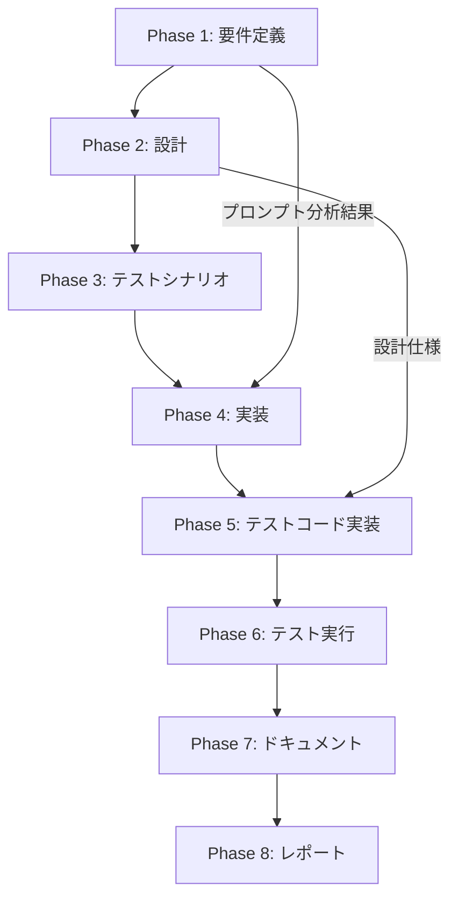

# プロジェクト計画書 - Issue #5: Evaluation Phase ファイル保存問題の修正

## 1. Issue分析

### 複雑度判定
**中程度**

### 見積もり工数
**6~10時間**

**根拠**:
- プロンプト分析と比較調査: 2~3時間
- プロンプト修正とコード改善: 2~3時間
- テストケース作成と検証: 1~2時間
- ドキュメント更新: 1~2時間

### リスク評価
**低**

**理由**:
- 既存のフェーズパターンを踏襲するため、アーキテクチャ変更不要
- プロンプト修正が中心で、コードロジックへの影響は限定的
- 他のフェーズは正常動作しているため、設計パターンは実証済み
- Evaluation Phase 自体が最終フェーズであり、依存フェーズへの影響がない

---

## 2. 実装戦略判断

### 実装戦略: EXTEND

**判断根拠**:
- **既存コードの拡張が中心**: evaluation.ts の既存ロジックは保持し、プロンプトの改善とファイル保存検証の強化を実施
- **新規ファイル作成は最小限**: プロンプトファイルの修正が主要タスク
- **既存パターンの適用**: 成功している他のフェーズ（Planning、Requirements等）のプロンプト構造を参考に、Evaluation Phase のプロンプトを改善
- **アーキテクチャ変更なし**: BasePhase の execute/review/revise サイクルはそのまま使用

### テスト戦略: UNIT_INTEGRATION

**判断根拠**:
- **UNIT**: プロンプト解析ロジックのユニットテスト（ContentParser の evaluation decision 解析）
- **INTEGRATION**: Evaluation Phase 全体の統合テスト（execute() → ファイル保存 → review() サイクル）
- **BDD不要**: ユーザーストーリーよりもシステム内部の動作検証が中心
- **既存テストとの整合性**: 他のフェーズと同様の UNIT_INTEGRATION パターン

### テストコード戦略: BOTH_TEST

**判断根拠**:
- **EXTEND_TEST**: 既存の evaluation.ts のテスト（存在する場合）にファイル保存検証を追加
- **CREATE_TEST**: プロンプト効果検証のための新規インテグレーションテスト
- **理由**: ファイル保存という既存機能の検証（EXTEND）と、プロンプト改善効果の検証（CREATE）の両方が必要

---

## 3. 影響範囲分析

### 既存コードへの影響

**プロンプトファイル**:
- `src/prompts/evaluation/execute.txt`: ファイル保存指示の明確化

**ソースコード（軽微な修正の可能性）**:
- `src/phases/evaluation.ts`: ファイル保存検証ロジックの強化（任意）
- `src/core/content-parser.ts`: 評価決定の解析ロジック検証（既存機能の確認）

**テストファイル**:
- `tests/integration/evaluation.test.ts`: 新規作成（または既存の拡張）
- `tests/unit/content-parser.test.ts`: 既存テストの拡張（存在する場合）

### 依存関係の変更
**なし**

既存の依存関係（fs-extra、path 等）のみ使用。新規パッケージの追加は不要。

### マイグレーション要否
**不要**

既存の metadata.json スキーマや出力ディレクトリ構造は変更なし。

---

## 4. タスク分割

### Phase 1: 要件定義 (見積もり: 1~2h)

- [ ] Task 1-1: プロンプト比較分析 (0.5~1h)
  - 各フェーズの execute.txt を比較（保存指示の位置、表現、明確さ）
  - プロンプトの長さと複雑度を測定
  - 成功フェーズ（Planning、Requirements等）のパターンを特定

- [ ] Task 1-2: Evaluation Phase の固有要件定義 (0.5~1h)
  - ファイル保存の必須性を要件として明確化
  - 評価レポート生成と保存の分離を要件化
  - エージェントへの明示的な保存指示を要件化

### Phase 2: 設計 (見積もり: 1~2h)

- [ ] Task 2-1: プロンプト改善案の設計 (0.5~1h)
  - ファイル保存指示の位置最適化（プロンプトの最後に明示的なステップとして配置）
  - Write ツール使用の明示化（"必ず Write ツールを使用してください" 等）
  - ステップバイステップ形式の導入（1. 評価実施 → 2. レポート生成 → 3. ファイル保存）

- [ ] Task 2-2: コード改善案の設計（必要に応じて） (0.5~1h)
  - executeWithAgent() 後の即座のファイル存在チェック（現行動作の検証）
  - エージェントへのリマインダー機能の設計（Turn数が一定数を超えた場合のプロンプト追加）
  - maxTurns 設定の見直し（50 → 適切な値の検討）

### Phase 3: テストシナリオ (見積もり: 1h)

- [ ] Task 3-1: ユニットテストシナリオ策定 (0.5h)
  - ContentParser.parseEvaluationDecision() のテスト（PASS、PASS_WITH_ISSUES、FAIL_PHASE_*、ABORT の各パターン）
  - ファイル保存検証ロジックのテスト

- [ ] Task 3-2: インテグレーションテストシナリオ策定 (0.5h)
  - Evaluation Phase の execute() → ファイル保存 → review() サイクル全体のテスト
  - エージェントログの分析（Write ツール呼び出しの検証）
  - 失敗ケース（ファイル未保存）の再現テスト

### Phase 4: 実装 (見積もり: 2~3h)

- [ ] Task 4-1: evaluation/execute.txt の修正 (1~1.5h)
  - プロンプト末尾に明示的な保存ステップを追加
  - Write ツール使用の明示化
  - 保存必須の強調（"重要: このファイルが存在しない場合、フェーズは失敗します"）

- [ ] Task 4-2: evaluation.ts の改善（任意） (0.5~1h)
  - executeWithAgent() のオプション調整（maxTurns の見直し）
  - ファイル存在チェックのエラーメッセージ改善
  - デバッグログの追加（エージェントの動作トレース）

- [ ] Task 4-3: 他のフェーズのプロンプト検証 (0.5h)
  - 同様の問題が他のフェーズで発生していないか確認
  - 必要に応じて予防的な修正を適用

### Phase 5: テストコード実装 (見積もり: 1~2h)

- [ ] Task 5-1: ユニットテスト実装 (0.5~1h)
  - ContentParser のテスト拡張（evaluation decision 解析の網羅テスト）
  - ファイル保存検証ロジックのテスト

- [ ] Task 5-2: インテグレーションテスト実装 (0.5~1h)
  - Evaluation Phase の E2E テスト作成
  - モックエージェントによるファイル保存動作の検証
  - 失敗ケースの再現テスト（ファイル未保存時のエラーハンドリング）

### Phase 6: テスト実行 (見積もり: 0.5~1h)

- [ ] Task 6-1: ローカルテスト実行 (0.25~0.5h)
  - `npm test` によるユニット・統合テストの実行
  - テストカバレッジの確認（80%以上を目標）

- [ ] Task 6-2: 実際のワークフローでの検証 (0.25~0.5h)
  - 修正後の Evaluation Phase を実際の Issue で実行
  - evaluation_report.md が正しく作成されることを確認
  - エージェントログで Write ツール呼び出しを確認

### Phase 7: ドキュメント (見積もり: 0.5~1h)

- [ ] Task 7-1: プロンプト設計ガイドライン作成 (0.5~1h)
  - ファイル保存指示のベストプラクティスを文書化
  - 今後の新規フェーズ開発時の参考資料として整備
  - TROUBLESHOOTING.md への追記（同様の問題が発生した場合の対処法）

### Phase 8: レポート (見積もり: 0.5h)

- [ ] Task 8-1: 修正内容のサマリー作成 (0.5h)
  - 根本原因の特定結果
  - 修正内容（プロンプト・コード・テスト）
  - 検証結果（テスト成功率、実際のワークフロー実行結果）
  - 再発防止策

---

## 5. 依存関係

**重要な依存関係**:
- Phase 1 の分析結果は Phase 4（実装）で直接利用される
- Phase 2 の設計仕様は Phase 5（テストコード実装）で使用される
- Phase 6（テスト実行）で失敗した場合、Phase 4 に戻って修正が必要

---

## 6. リスクと軽減策

### リスク1: プロンプト修正だけでは解決しない可能性
- **影響度**: 中
- **確率**: 低
- **軽減策**:
  - Phase 1 で徹底的に他のフェーズのプロンプトを分析し、成功パターンを特定
  - Phase 4 で evaluation.ts のコード改善も並行実施（maxTurns 調整、エージェントリマインダー等）
  - Phase 6 で実際のワークフローでの検証を必ず実施

### リスク2: エージェントの非決定的動作
- **影響度**: 中
- **確率**: 中
- **軽減策**:
  - 複数回のテスト実行で再現性を確認
  - エージェントログの詳細分析（Turn ごとの動作パターン）
  - プロンプトの明示性を最大限に高める（ステップバイステップ、強調表現の使用）

### リスク3: 他のフェーズへの影響
- **影響度**: 低
- **確率**: 低
- **軽減策**:
  - Evaluation Phase のみの修正に限定（BasePhase の変更は避ける）
  - Phase 6 で全フェーズの回帰テスト実施
  - プロンプト修正パターンが普遍的に適用可能か検証

### リスク4: スコープクリープ（過剰な一般化）
- **影響度**: 中
- **確率**: 中
- **軽減策**:
  - Issue #5 の解決に焦点を絞る
  - 他のフェーズの予防的修正は Task 4-3 に限定
  - プロンプト設計ガイドラインは Phase 7 で別ドキュメントとして整備

---

## 7. 品質ゲート

### Phase 1: 要件定義
- [ ] 機能要件が明確に記載されている（ファイル保存の必須性）
- [ ] 受け入れ基準が定義されている（evaluation_report.md の存在、Write ツール呼び出しの確認）
- [ ] プロンプト分析結果が客観的データに基づいている

### Phase 2: 設計
- [ ] 実装戦略の判断根拠が明記されている（EXTEND 戦略）
- [ ] テスト戦略の判断根拠が明記されている（UNIT_INTEGRATION）
- [ ] プロンプト改善案が具体的である（保存ステップの明示化）
- [ ] コード改善案が既存パターンに準拠している

### Phase 3: テストシナリオ
- [ ] ユニットテストシナリオが網羅的である（ContentParser の全決定タイプ）
- [ ] インテグレーションテストシナリオが E2E をカバーしている
- [ ] 失敗ケースの再現テストが含まれている

### Phase 4: 実装
- [ ] プロンプト修正が設計仕様に準拠している
- [ ] 既存のフェーズパターンと整合性がある
- [ ] コードの可読性が維持されている

### Phase 5: テストコード実装
- [ ] テストカバレッジが 80% 以上である
- [ ] ユニット・統合テストが実装されている
- [ ] テストコードが保守可能である

### Phase 6: テスト実行
- [ ] すべてのテストが成功している
- [ ] 実際のワークフローで evaluation_report.md が作成される
- [ ] エージェントログで Write ツール呼び出しが確認できる

### Phase 7: ドキュメント
- [ ] プロンプト設計ガイドラインが明確である
- [ ] 再発防止策が文書化されている
- [ ] TROUBLESHOOTING.md が更新されている

### Phase 8: レポート
- [ ] 根本原因が特定されている
- [ ] 修正内容が要約されている
- [ ] 検証結果が記録されている

---

## 付録: 根本原因仮説

### 最有力仮説: プロンプトの明示性不足

**観察事実**:
1. Evaluation Phase のプロンプト（163行）は他のフェーズと同程度の長さ
2. ファイル保存指示は 152行目に記載（プロンプトの最後から 11 行目）
3. 保存指示は "**重要**" で強調されているが、"Write ツール" の明示的な指示がない
4. エージェントログで Turn 2 に評価レポートを生成するが、Turn 3 で保存せずに終了

**成功フェーズとの違い**:
- Requirements Phase（110行）: 保存指示が 63行目（プロンプトの中盤）
- Design Phase（197行）: 保存指示が 191行目（プロンプトの最後）
- Report Phase（277行）: 保存指示が 253行目（プロンプトの最後）

**仮説**:
Evaluation Phase のプロンプトは、評価基準（7つ）と決定タイプ（4つ）の詳細説明が長いため、エージェントが「評価内容の生成」に集中し、「ファイル保存」を後回しにする傾向がある。特に、保存指示が「出力フォーマット」セクション（行 142-151）と「重要な注意事項」セクション（行 154-162）の間に埋もれている。

**対策**:
プロンプトの最後に明示的な「最終ステップ」セクションを追加し、以下を記載:
1. 評価レポートの内容をまとめる
2. **Write ツールを使用**して指定パスに保存
3. 保存完了を確認

この構造により、エージェントが「生成」と「保存」を明確に分離して認識できるようになる。

---

**作成日**: 2025-01-20
**想定完了日**: 2025-01-22（2営業日）
**総見積もり工数**: 6~10時間
