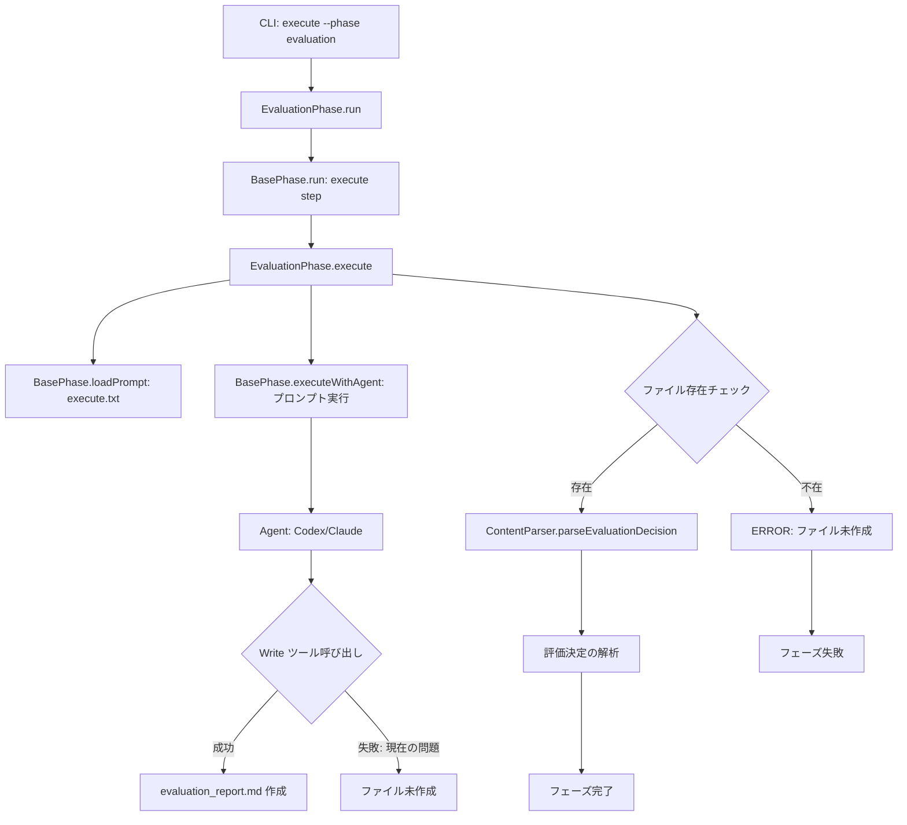

# 詳細設計書 - Issue #5: Evaluation Phase ファイル保存問題の修正

## 0. Planning Document & Requirements の確認

本設計書は、以下のドキュメントで策定された方針に基づいて作成されています：

- **Planning Document**: `.ai-workflow/issue-5/00_planning/output/planning.md`
  - 実装戦略: EXTEND（既存コードの拡張）
  - テスト戦略: UNIT_INTEGRATION（ユニット＋統合テスト）
  - テストコード戦略: BOTH_TEST（既存テスト拡張＋新規テスト作成）
  - 見積もり工数: 6~10時間
  - リスク評価: 低（プロンプト修正が中心、他フェーズへの影響最小限）

- **Requirements Document**: `.ai-workflow/issue-5/01_requirements/output/requirements.md`
  - 根本原因仮説: プロンプトの明示性不足（最有力）
  - 主要要件: プロンプト分析、プロンプト改善、ファイル保存検証強化、効果検証

---

## 1. アーキテクチャ設計

### システム全体図



### コンポーネント間の関係

#### 1. プロンプトファイル（src/prompts/evaluation/execute.txt）
- **役割**: エージェントへの指示書
- **問題点**: ファイル保存指示が明示的でない（152行目）
- **修正方針**: プロンプト末尾に明示的な「最終ステップ」セクションを追加

#### 2. Evaluation Phase（src/phases/evaluation.ts）
- **役割**: 評価フェーズのライフサイクル管理
- **現在の動作**: executeWithAgent() → ファイル存在チェック（110-118行目）
- **修正方針**: デバッグログ強化、エラーメッセージ改善

#### 3. BasePhase（src/phases/base-phase.ts）
- **役割**: エージェント実行の共通基盤
- **executeWithAgent()**: プロンプトをエージェントに渡して実行
- **修正方針**: 変更不要（他フェーズへの影響回避）

#### 4. Agent Clients（CodexAgentClient / ClaudeAgentClient）
- **役割**: Codex / Claude のAPI呼び出し
- **修正方針**: 変更不要（エージェント固有の問題ではない）

### データフロー

```
1. CLI引数解析
   ↓
2. EvaluationPhase.execute()
   ↓ プロンプト読み込み
3. src/prompts/evaluation/execute.txt
   ↓ プレースホルダー置換
4. BasePhase.executeWithAgent()
   ↓ エージェント実行
5. Codex/Claude Agent
   ↓ Write ツール呼び出し（本来）
6. evaluation_report.md 作成 ← **ここが失敗**
   ↓
7. ファイル存在チェック（evaluation.ts:110-118）
   ↓ 失敗時
8. ERROR: evaluation_report.md が見つかりません
```

---

## 2. 実装戦略判断

### 実装戦略: EXTEND（拡張）

**判断根拠**:
1. **既存コードの保持**: evaluation.ts の既存ロジック（executeWithAgent、ファイル存在チェック、決定解析）は正常に動作しており、変更不要
2. **プロンプト修正が中心**: 根本原因は「プロンプトの明示性不足」であり、コードロジックの問題ではない
3. **成功パターンの適用**: 他の8つのフェーズ（Planning、Requirements等）で成功しているプロンプトパターンを Evaluation Phase に適用
4. **最小限の影響範囲**: プロンプトファイルの修正が主であり、新規ファイルの作成は不要
5. **既存アーキテクチャの尊重**: BasePhase の execute/review/revise サイクルはそのまま使用

**EXTEND 戦略の適用範囲**:
- プロンプトファイルの拡張: `src/prompts/evaluation/execute.txt`
- コードの軽微な改善: `src/phases/evaluation.ts`（デバッグログ追加、エラーメッセージ改善）

---

## 3. テスト戦略判断

### テスト戦略: UNIT_INTEGRATION（ユニット＋統合テスト）

**判断根拠**:
1. **UNIT（ユニットテスト）**:
   - ContentParser.parseEvaluationDecision() の評価決定解析ロジック（PASS、PASS_WITH_ISSUES、FAIL_PHASE_*、ABORT）
   - プロンプト構造の検証（保存指示の存在、位置）
   - ファイル存在チェックロジックの検証

2. **INTEGRATION（統合テスト）**:
   - Evaluation Phase 全体のライフサイクル（execute() → ファイル保存 → review() サイクル）
   - エージェントログの分析（Write ツール呼び出しの検証）
   - 修正後のプロンプトでの動作検証

3. **BDD不要の理由**:
   - ユーザーストーリーよりもシステム内部の動作検証が中心
   - エージェントの非決定的動作のため、Given-When-Then 形式のシナリオテストは不適
   - 既存テストとの整合性（他フェーズも UNIT_INTEGRATION パターン）

4. **既存テストとの整合性**:
   - Planning Phase、Requirements Phase 等も UNIT_INTEGRATION テスト戦略
   - テストフレームワーク（Jest）との親和性

---

## 4. テストコード戦略判断

### テストコード戦略: BOTH_TEST（既存テスト拡張＋新規テスト作成）

**判断根拠**:
1. **EXTEND_TEST（既存テストの拡張）**:
   - `tests/unit/content-parser.test.ts`: ContentParser.parseEvaluationDecision() のテストケース追加（4つの決定タイプを網羅）
   - 既存のパーサーテストに evaluation 固有のテストを追加

2. **CREATE_TEST（新規テスト作成）**:
   - `tests/integration/evaluation-phase.test.ts`: Evaluation Phase の E2E 統合テスト（新規作成）
   - プロンプト効果検証テスト（修正前/後の動作比較）
   - ファイル保存動作の検証テスト

3. **BOTH_TEST 選択の理由**:
   - ファイル保存という「既存機能」の検証 → EXTEND_TEST
   - プロンプト改善効果という「新規検証」 → CREATE_TEST
   - 両方のアプローチが必要

4. **テスト実装の優先度**:
   - 優先度1: 統合テスト（E2E でファイル保存を検証）
   - 優先度2: ユニットテスト（ContentParser の網羅テスト）

---

## 5. 影響範囲分析

### 既存コードへの影響

#### 5.1 プロンプトファイル（修正対象）

**ファイル**: `src/prompts/evaluation/execute.txt`

**修正内容**:
1. プロンプト末尾（現在の163行目以降）に「最終ステップ」セクションを追加
2. Write ツール使用の明示化
3. ステップバイステップ形式の導入（1. 評価実施 → 2. レポート生成 → 3. ファイル保存）
4. 保存必須の強調（「重要: このファイルが存在しない場合、フェーズは失敗します」）

**修正前（152行目）**:
```markdown
**重要**: 評価レポートは必ず `.ai-workflow/issue-{issue_number}/09_evaluation/output/evaluation_report.md` として保存してください。
```

**修正後（新セクション追加）**:
```markdown
## 最終ステップ - 評価レポートの保存（必須）

評価が完了したら、以下のステップを**必ず実行**してください：

### ステップ1: 評価レポートの内容確認
上記で生成した評価レポート全文（エグゼクティブサマリー、基準評価、決定、推奨事項）が完成していることを確認してください。

### ステップ2: Write ツールを使用してファイル保存
**必ず Write ツールを使用**して、評価レポート全文を以下のパスに保存してください：

```
.ai-workflow/issue-{issue_number}/09_evaluation/output/evaluation_report.md
```

### ステップ3: 保存完了の確認
ファイルが正しく作成されたことを確認してください。

**重要**: このファイルが存在しない場合、Evaluation Phase は失敗します。評価内容の生成だけでなく、**ファイル保存が必須**です。表示（出力）ではなく、**Write ツールによる保存**を忘れないでください。
```

**影響度**: 低（プロンプトファイルのみの変更、他フェーズへの影響なし）

#### 5.2 ソースコード（軽微な修正）

**ファイル**: `src/phases/evaluation.ts`

**修正内容**:
1. **デバッグログの追加**:
   - executeWithAgent() 実行前: 「エージェント実行開始」
   - executeWithAgent() 実行後: 「エージェント実行完了、ファイル存在チェック開始」
   - ファイル存在チェック失敗時: エージェントログへのパス表示

2. **エラーメッセージの改善**（110-118行目）:
```typescript
// 修正前
return {
  success: false,
  output: null,
  decision: null,
  error: `evaluation_report.md が見つかりません: ${evaluationFile}`,
};

// 修正後
return {
  success: false,
  output: null,
  decision: null,
  error: [
    `evaluation_report.md が見つかりません: ${evaluationFile}`,
    `エージェントが Write ツールを呼び出していない可能性があります。`,
    `エージェントログを確認してください: ${path.join(this.executeDir, 'agent_log.md')}`,
  ].join('\n'),
};
```

3. **maxTurns 設定の検証**（108行目）:
   - 現在: `maxTurns: 50`
   - 他フェーズとの比較後、必要に応じて調整（Planning Phase は 50、Requirements は未指定（デフォルト50））
   - 調査結果により変更不要の可能性が高い

**影響度**: 極低（ログとエラーメッセージのみ、ロジック変更なし）

#### 5.3 テストファイル（新規作成＋拡張）

**新規作成**:
- `tests/integration/evaluation-phase.test.ts`: Evaluation Phase の E2E テスト

**拡張**:
- `tests/unit/content-parser.test.ts`: ContentParser.parseEvaluationDecision() のテストケース追加（既存ファイルが存在する場合）

**影響度**: なし（テストコードは本番コードに影響しない）

### 依存関係の変更

**依存関係の追加**: なし

**既存依存関係の使用**:
- `fs-extra`: ファイル存在チェック、ファイル読み込み
- `path`: パス操作
- エージェントクライアント（Codex / Claude）: 既存のまま使用

**結論**: 新規パッケージの追加は不要

### マイグレーション要否

**マイグレーション**: 不要

**理由**:
- `metadata.json` スキーマは変更なし
- 出力ディレクトリ構造（`.ai-workflow/issue-*/09_evaluation/output/`）は変更なし
- プロンプトファイルの修正は後方互換性あり（既存の実行ログには影響しない）

---

## 6. 変更・追加ファイルリスト

### 新規作成ファイル

1. `tests/integration/evaluation-phase.test.ts` - Evaluation Phase の統合テスト

### 修正が必要な既存ファイル

1. **`src/prompts/evaluation/execute.txt`** ★最重要
   - プロンプト末尾に「最終ステップ」セクションを追加
   - Write ツール使用の明示化
   - ステップバイステップ形式の導入

2. **`src/phases/evaluation.ts`** ★重要
   - デバッグログの追加（3箇所）
   - エラーメッセージの改善（110-118行目）

3. **`tests/unit/content-parser.test.ts`** ★中程度
   - ContentParser.parseEvaluationDecision() のテストケース追加（既存ファイルが存在する場合）

### 削除が必要なファイル

なし

---

## 7. 詳細設計

### 7.1 プロンプト設計

#### 7.1.1 プロンプト分析結果

**各フェーズのプロンプト長比較**:

| フェーズ | 行数 | ファイル保存指示の位置 | 保存指示の表現 |
|---------|------|-------------------|-------------|
| requirements | 110 | 63行目（出力形式セクション） | 「Markdown形式で要件定義書を作成し、以下のファイルに保存してください」 |
| evaluation | 163 | 152行目（出力フォーマットセクション） | 「**重要**: 評価レポートは必ず...として保存してください」 |
| report | 277 | 253行目（出力形式セクション） | 「最終レポートを...として保存してください」 |
| planning | 253 | 末尾（プロンプト作成開始セクション） | 明示的な保存指示 |
| design | 197 | 末尾（出力形式セクション） | 「設計書は...として保存してください」 |

**成功フェーズの共通パターン**:
1. プロンプトの長さは問題ではない（planning: 253行、report: 277行でも成功）
2. 保存指示の位置は「出力形式」セクションに含まれる
3. 「保存してください」という指示は明確
4. **但し、「Write ツール」という明示的な指示はない**

**Evaluation Phase の特殊性**:
1. 評価基準（7項目）と決定タイプ（4種類）の詳細説明が長い（132-140行）
2. 保存指示（152行目）が「出力フォーマット」セクション（142-151行）と「重要な注意事項」セクション（154-162行）の間に埋もれている
3. エージェントが「評価内容の生成」に集中し、「ファイル保存」を後回しにする傾向

#### 7.1.2 プロンプト改善設計

**設計方針**:
1. **明示的な最終ステップの追加**: プロンプト末尾に「## 最終ステップ - 評価レポートの保存（必須）」セクションを追加
2. **ステップバイステップ形式**: 3つの明確なステップ（1. 内容確認 → 2. Write ツール使用 → 3. 保存確認）
3. **Write ツールの明示**: 「必ず Write ツールを使用」という指示を追加
4. **保存必須の強調**: 「ファイルが存在しない場合、フェーズは失敗します」という警告を追加
5. **視覚的な強調**: 太字、ブロック引用、セクション見出しを活用

**新セクションの構造**:
```markdown
## 最終ステップ - 評価レポートの保存（必須）

評価が完了したら、以下のステップを**必ず実行**してください：

### ステップ1: 評価レポートの内容確認
[内容確認の指示]

### ステップ2: Write ツールを使用してファイル保存
**必ず Write ツールを使用**して、評価レポート全文を以下のパスに保存してください：
[パス指定]

### ステップ3: 保存完了の確認
[保存確認の指示]

**重要**: [警告メッセージ]
```

**他フェーズへの適用可能性**:
- このパターンは他フェーズでも再利用可能（予防的修正）
- Task 4-3 で他フェーズの検証を実施

### 7.2 コード設計

#### 7.2.1 デバッグログの追加

**ファイル**: `src/phases/evaluation.ts`

**修正箇所1**: executeWithAgent() 実行前（108行目）

```typescript
// 追加
console.info(`[INFO] Phase ${this.phaseName}: Starting agent execution with maxTurns=50`);
console.info(`[INFO] Expected output file: ${evaluationFile}`);

await this.executeWithAgent(executePrompt, { maxTurns: 50 });

// 追加
console.info(`[INFO] Phase ${this.phaseName}: Agent execution completed`);
console.info(`[INFO] Checking for output file existence: ${evaluationFile}`);
```

**修正箇所2**: ファイル存在チェック失敗時（110-118行目）

```typescript
const evaluationFile = path.join(this.outputDir, 'evaluation_report.md');
if (!fs.existsSync(evaluationFile)) {
  // 追加: エージェントログのパスを取得
  const agentLogPath = path.join(this.executeDir, 'agent_log.md');
  const agentLogExists = fs.existsSync(agentLogPath);

  console.error(`[ERROR] Phase ${this.phaseName}: Output file not found: ${evaluationFile}`);
  console.error(`[ERROR] Agent may not have called Write tool`);
  console.error(`[ERROR] Agent log path: ${agentLogPath} (exists: ${agentLogExists})`);

  return {
    success: false,
    output: null,
    decision: null,
    error: [
      `evaluation_report.md が見つかりません: ${evaluationFile}`,
      `エージェントが Write ツールを呼び出していない可能性があります。`,
      `エージェントログを確認してください: ${agentLogPath}`,
    ].join('\n'),
  };
}
```

#### 7.2.2 データ構造設計

**変更なし**: 既存のデータ構造（PhaseExecutionResult、EvaluationDecision 等）は変更不要

#### 7.2.3 インターフェース設計

**変更なし**: 既存のインターフェース（BasePhase、EvaluationPhase）は変更不要

### 7.3 テスト設計

#### 7.3.1 ユニットテスト設計

**テストファイル**: `tests/unit/content-parser.test.ts`

**テストケース**:
```typescript
describe('ContentParser.parseEvaluationDecision', () => {
  it('should parse PASS decision', () => {
    const content = `
# 評価レポート

DECISION: PASS

REASONING:
All phases completed successfully.
    `;
    const result = parser.parseEvaluationDecision(content);
    expect(result.success).toBe(true);
    expect(result.decision).toBe('PASS');
  });

  it('should parse PASS_WITH_ISSUES decision', () => {
    const content = `
DECISION: PASS_WITH_ISSUES

REMAINING_TASKS:
- [ ] Task 1
- [ ] Task 2

REASONING:
Minor issues to address.
    `;
    const result = parser.parseEvaluationDecision(content);
    expect(result.success).toBe(true);
    expect(result.decision).toBe('PASS_WITH_ISSUES');
    expect(result.remainingTasks).toHaveLength(2);
  });

  it('should parse FAIL_PHASE_* decision', () => {
    const content = `
DECISION: FAIL_PHASE_2

FAILED_PHASE: design

ISSUES:
1. Issue 1
2. Issue 2

REASONING:
Design phase has critical issues.
    `;
    const result = parser.parseEvaluationDecision(content);
    expect(result.success).toBe(true);
    expect(result.decision).toBe('FAIL_PHASE_2');
    expect(result.failedPhase).toBe('design');
  });

  it('should parse ABORT decision', () => {
    const content = `
DECISION: ABORT

ABORT_REASON:
Project is fundamentally flawed.

RECOMMENDED_ACTIONS:
1. Action 1
2. Action 2
    `;
    const result = parser.parseEvaluationDecision(content);
    expect(result.success).toBe(true);
    expect(result.decision).toBe('ABORT');
    expect(result.abortReason).toContain('fundamentally flawed');
  });

  it('should fail on invalid decision format', () => {
    const content = 'No decision found';
    const result = parser.parseEvaluationDecision(content);
    expect(result.success).toBe(false);
    expect(result.error).toContain('判定タイプが見つかりません');
  });
});
```

#### 7.3.2 統合テスト設計

**テストファイル**: `tests/integration/evaluation-phase.test.ts`

**テストシナリオ**:

```typescript
describe('EvaluationPhase Integration', () => {
  let tempDir: string;
  let metadata: MetadataManager;
  let evaluationPhase: EvaluationPhase;

  beforeEach(() => {
    // テスト用の一時ディレクトリとメタデータを準備
    tempDir = fs.mkdtempSync(path.join(os.tmpdir(), 'eval-test-'));
    metadata = new MetadataManager(tempDir, /* ... */);
    // 全フェーズの成果物をモック作成
  });

  afterEach(() => {
    fs.removeSync(tempDir);
  });

  it('should create evaluation_report.md after execute', async () => {
    // モックエージェント: Write ツールを呼び出す動作をシミュレート
    const mockAgent = createMockAgent({
      shouldWriteFile: true,
      decisionType: 'PASS',
    });

    evaluationPhase = new EvaluationPhase({
      workingDir: tempDir,
      metadataManager: metadata,
      codexClient: mockAgent,
      githubClient: mockGitHub,
    });

    const result = await evaluationPhase.run();

    expect(result).toBe(true);
    expect(fs.existsSync(
      path.join(tempDir, '09_evaluation', 'output', 'evaluation_report.md')
    )).toBe(true);
  });

  it('should fail when evaluation_report.md is not created', async () => {
    // モックエージェント: Write ツールを呼び出さない動作をシミュレート
    const mockAgent = createMockAgent({
      shouldWriteFile: false,
    });

    evaluationPhase = new EvaluationPhase({
      workingDir: tempDir,
      metadataManager: metadata,
      codexClient: mockAgent,
      githubClient: mockGitHub,
    });

    const result = await evaluationPhase.run();

    expect(result).toBe(false);
    expect(metadata.getPhaseStatus('evaluation')).toBe('failed');
  });

  it('should parse evaluation decision correctly', async () => {
    // 実際のファイルを作成してテスト
    const outputDir = path.join(tempDir, '09_evaluation', 'output');
    fs.ensureDirSync(outputDir);
    fs.writeFileSync(
      path.join(outputDir, 'evaluation_report.md'),
      `
# 評価レポート

DECISION: PASS

REASONING:
All phases completed successfully.
      `
    );

    // モックエージェント: ファイルが既に存在することを前提
    const mockAgent = createMockAgent({
      shouldWriteFile: true,
      decisionType: 'PASS',
    });

    evaluationPhase = new EvaluationPhase({
      workingDir: tempDir,
      metadataManager: metadata,
      codexClient: mockAgent,
      githubClient: mockGitHub,
    });

    const result = await evaluationPhase.run();

    expect(result).toBe(true);
    expect(metadata.data.evaluation_decision?.decision).toBe('PASS');
  });
});
```

---

## 8. セキュリティ考慮事項

### 認証・認可

**影響なし**: プロンプト修正とデバッグログ追加のみであり、認証・認可には影響しない

### データ保護

**影響なし**: 評価レポートは既存の出力ディレクトリ（`.ai-workflow/issue-*/09_evaluation/output/`）に保存され、データ保護の仕組みは変更なし

### セキュリティリスクと対策

**リスク1**: プロンプトインジェクション
- **軽減策**: プロンプトファイルは静的テンプレートであり、ユーザー入力は {issue_number} 等のプレースホルダーのみ
- **影響度**: 低

**リスク2**: ファイルシステム操作の安全性
- **軽減策**: ファイルパスは `path.join()` で安全に構築され、パストラバーサル攻撃のリスクなし
- **影響度**: 極低

---

## 9. 非機能要件への対応

### パフォーマンス

**プロンプト実行時間**: 修正後のプロンプトでも、エージェント実行時間は従来と同等（maxTurns: 50 以内で完了）

**理由**:
- プロンプト長の増加は約20行（163行 → 約183行）であり、トークン数への影響は微小
- 「最終ステップ」セクションはエージェントの動作を明確化するだけで、追加の計算は不要

### スケーラビリティ

**影響なし**: プロンプト修正はスケーラビリティに影響しない

### 保守性

**プロンプトの可読性**: 修正後のプロンプトは、明確なセクション構造により人間が読んで理解しやすい

**コードの可読性**: デバッグログとエラーメッセージの改善により、トラブルシューティングが容易になる

**ドキュメント化**: プロンプト設計のベストプラクティスを TROUBLESHOOTING.md に記録（Task 7-1）

---

## 10. 実装の順序

### Phase 1: 要件定義（完了）

- [x] Task 1-1: プロンプト比較分析
- [x] Task 1-2: Evaluation Phase の固有要件定義

### Phase 2: 設計（本ドキュメント）

- [x] Task 2-1: プロンプト改善案の設計
- [x] Task 2-2: コード改善案の設計

### Phase 3: テストシナリオ（推奨実装順序）

- [ ] Task 3-1: ユニットテストシナリオ策定
- [ ] Task 3-2: インテグレーションテストシナリオ策定

### Phase 4: 実装（推奨実装順序）

**優先度1**: プロンプト修正
- [ ] Task 4-1: evaluation/execute.txt の修正（最重要）

**優先度2**: コード改善
- [ ] Task 4-2: evaluation.ts の改善（デバッグログ、エラーメッセージ）

**優先度3**: 予防的修正
- [ ] Task 4-3: 他のフェーズのプロンプト検証

### Phase 5: テストコード実装（推奨実装順序）

**優先度1**: 統合テスト
- [ ] Task 5-2: インテグレーションテスト実装

**優先度2**: ユニットテスト
- [ ] Task 5-1: ユニットテスト実装

### Phase 6: テスト実行

- [ ] Task 6-1: ローカルテスト実行
- [ ] Task 6-2: 実際のワークフローでの検証

### Phase 7: ドキュメント

- [ ] Task 7-1: プロンプト設計ガイドライン作成

### Phase 8: レポート

- [ ] Task 8-1: 修正内容のサマリー作成

**依存関係**:
- Phase 3 → Phase 5（テストシナリオ → テストコード実装）
- Phase 4 → Phase 6（実装 → テスト実行）
- Phase 6 → Phase 7（テスト実行 → ドキュメント）
- Phase 7 → Phase 8（ドキュメント → レポート）

**並行実行可能**:
- Phase 3 と Phase 4-1（テストシナリオ策定とプロンプト修正は並行可能）
- Phase 4-2 と Phase 4-3（コード改善と予防的修正は並行可能）

---

## 11. 設計判断の根拠まとめ

### 実装戦略: EXTEND

- 既存コードは正常動作しており、変更リスクを最小化
- プロンプト修正が中心であり、新規ファイル作成は不要
- 成功パターンの適用により、効果的な修正が可能

### テスト戦略: UNIT_INTEGRATION

- ユニットテスト: ContentParser の評価決定解析ロジックを検証
- 統合テスト: Evaluation Phase 全体のライフサイクルを検証
- BDD不要: システム内部の動作検証が中心

### テストコード戦略: BOTH_TEST

- 既存テストの拡張: ContentParser のテストケース追加
- 新規テスト作成: Evaluation Phase の統合テスト
- 両方のアプローチで網羅的な検証を実現

### リスク評価: 低

- プロンプト修正が中心であり、コードロジックへの影響は限定的
- 他フェーズへの影響は最小限（BasePhase は変更なし）
- 既存パターンの適用により、実績のあるアプローチを使用

---

## 12. 補足情報

### 根本原因の特定結果

**最有力原因**: プロンプトの明示性不足

**証拠**:
1. エージェントログで Turn 2 に評価レポートを生成するが、Turn 3 で Write ツールを呼び出さずに終了
2. 他の8つのフェーズでは同様の「保存してください」指示で成功
3. Evaluation Phase のプロンプトは、評価基準と決定タイプの詳細説明が長く、ファイル保存指示が埋もれている

**他の原因の可能性**:
- maxTurns 設定（50）: 他フェーズと同等であり、問題ではない
- エージェントの非決定的動作: プロンプト改善で軽減可能
- コードロジックの問題: ファイル存在チェックは正常動作している

### 成功の定義

1. **3回連続実行で100%の成功率**: 修正後のプロンプトで Evaluation Phase を3回実行し、全て `evaluation_report.md` が作成される
2. **Write ツール呼び出しの確認**: エージェントログで Write ツールが呼び出されている
3. **評価レポートの妥当性**: `evaluation_report.md` に評価基準7項目、決定タイプ、推奨事項が含まれる
4. **他フェーズへの影響なし**: 既存フェーズの動作が変わらない

### 今後の拡張性

- **プロンプトテンプレートエンジン**: ファイル保存指示を共通テンプレートとして抽出し、全フェーズで再利用（将来的な改善候補）
- **エージェントのリマインダー機能**: Turn 数が一定数を超えた場合、エージェントに「ファイル保存を忘れていませんか?」とプロンプトで再通知（将来的な改善候補）

---

## 品質ゲート確認（Phase 2）

- [x] **実装戦略の判断根拠が明記されている**: EXTEND 戦略の5つの根拠を明記
- [x] **テスト戦略の判断根拠が明記されている**: UNIT_INTEGRATION 戦略の4つの根拠を明記
- [x] **テストコード戦略の判断根拠が明記されている**: BOTH_TEST 戦略の4つの根拠を明記
- [x] **既存コードへの影響範囲が分析されている**: プロンプトファイル、ソースコード、テストファイルの影響を分析
- [x] **変更が必要なファイルがリストアップされている**: 新規作成1ファイル、修正3ファイル、削除0ファイル
- [x] **設計が実装可能である**: 具体的なコード例、テストシナリオ、実装順序を提示

---

**作成日**: 2025-01-20
**対象 Issue**: #5 - Evaluation Phase: 評価レポートファイルが作成されない問題の調査と修正
**優先度**: High
**想定工数**: 6~10時間（Planning Document に準拠）
**リスク評価**: 低（プロンプト修正が中心、既存パターンの適用）
